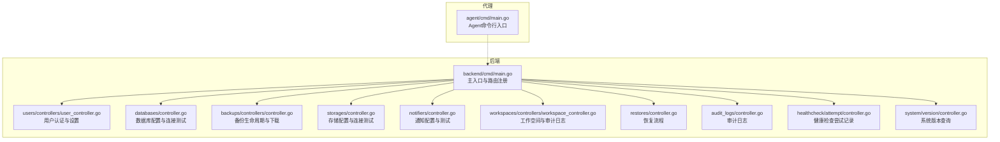
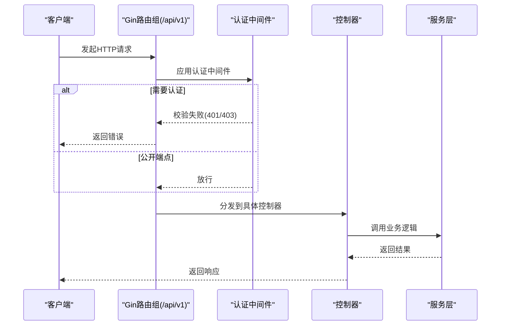
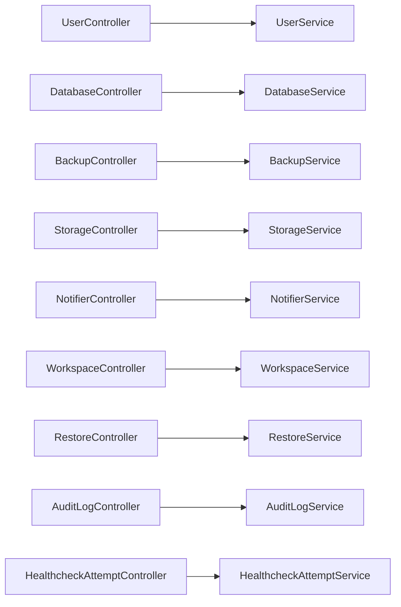

# API参考文档

<cite>
**本文档引用的文件**
- [backend/cmd/main.go](file://backend/cmd/main.go)
- [backend/internal/features/users/controllers/user_controller.go](file://backend/internal/features/users/controllers/user_controller.go)
- [backend/internal/features/databases/controller.go](file://backend/internal/features/databases/controller.go)
- [backend/internal/features/backups/backups/controllers/controller.go](file://backend/internal/features/backups/backups/controllers/controller.go)
- [backend/internal/features/storages/controller.go](file://backend/internal/features/storages/controller.go)
- [backend/internal/features/notifiers/controller.go](file://backend/internal/features/notifiers/controller.go)
- [backend/internal/features/workspaces/controllers/workspace_controller.go](file://backend/internal/features/workspaces/controllers/workspace_controller.go)
- [backend/internal/features/restores/controller.go](file://backend/internal/features/restores/controller.go)
- [backend/internal/features/audit_logs/controller.go](file://backend/internal/features/audit_logs/controller.go)
- [backend/internal/features/healthcheck/attempt/controller.go](file://backend/internal/features/healthcheck/attempt/controller.go)
- [backend/internal/features/system/version/controller.go](file://backend/internal/features/system/version/controller.go)
- [agent/cmd/main.go](file://agent/cmd/main.go)
</cite>

## 目录
1. [简介](#简介)
2. [项目结构](#项目结构)
3. [核心组件](#核心组件)
4. [架构总览](#架构总览)
5. [详细组件分析](#详细组件分析)
6. [依赖关系分析](#依赖关系分析)
7. [性能考虑](#性能考虑)
8. [故障排除指南](#故障排除指南)
9. [结论](#结论)
10. [附录](#附录)

## 简介
本API参考文档面向Databasus后端服务，覆盖用户管理、数据库管理、备份管理、存储管理、通知管理、工作空间、恢复、审计日志、健康检查、系统版本等模块的完整接口规范。文档提供每个端点的HTTP方法、URL模式、请求参数、响应格式与错误码说明，并给出常见使用场景与参数组合示例。同时说明认证方式、授权要求、速率限制策略，以及SDK使用指南、版本控制与兼容性策略、性能优化建议与最佳实践。

## 项目结构
后端采用Gin框架构建REST API，通过主入口注册路由组并挂载各功能模块控制器；前端静态资源由后端统一托管。Agent作为独立可执行程序，负责与后端交互以完成备份、恢复、升级等任务。

**图表来源**
- [backend/cmd/main.go:213-257](file://backend/cmd/main.go#L213-L257)
- [backend/internal/features/users/controllers/user_controller.go:24-46](file://backend/internal/features/users/controllers/user_controller.go#L24-L46)
- [backend/internal/features/databases/controller.go:20-38](file://backend/internal/features/databases/controller.go#L20-L38)
- [backend/internal/features/backups/backups/controllers/controller.go:27-39](file://backend/internal/features/backups/backups/controllers/controller.go#L27-L39)
- [backend/internal/features/storages/controller.go:19-27](file://backend/internal/features/storages/controller.go#L19-L27)
- [backend/internal/features/notifiers/controller.go:19-27](file://backend/internal/features/notifiers/controller.go#L19-L27)
- [backend/internal/features/workspaces/controllers/workspace_controller.go:22-31](file://backend/internal/features/workspaces/controllers/workspace_controller.go#L22-L31)
- [backend/internal/features/restores/controller.go:17-21](file://backend/internal/features/restores/controller.go#L17-L21)
- [backend/internal/features/audit_logs/controller.go:17-23](file://backend/internal/features/audit_logs/controller.go#L17-L23)
- [backend/internal/features/healthcheck/attempt/controller.go:17-19](file://backend/internal/features/healthcheck/attempt/controller.go#L17-L19)
- [backend/internal/features/system/version/controller.go:14-16](file://backend/internal/features/system/version/controller.go#L14-L16)
- [agent/cmd/main.go:24-48](file://agent/cmd/main.go#L24-L48)

**章节来源**
- [backend/cmd/main.go:213-257](file://backend/cmd/main.go#L213-L257)
- [agent/cmd/main.go:24-48](file://agent/cmd/main.go#L24-L48)

## 核心组件
- 路由与中间件：后端在主入口中注册“/api/v1”路由组，公开端点（如登录、健康检查、版本、Agent相关）无需Bearer认证，受保护端点需通过用户中间件鉴权。
- 认证与授权：受保护端点均要求Bearer JWT Token；部分端点对角色或工作空间权限有额外校验（如仅拥有者可删除工作空间、仅成员可查看审计日志）。
- 速率限制：登录与重置密码等敏感操作内置速率限制，防止暴力破解与滥用。
- 压缩与CORS：启用GZIP压缩与开发环境CORS配置，提升传输效率与跨域支持。
- 文档生成：Swagger注解自动生成OpenAPI文档，便于调试与联调。

**章节来源**
- [backend/cmd/main.go:213-257](file://backend/cmd/main.go#L213-L257)
- [backend/internal/features/users/controllers/user_controller.go:113-158](file://backend/internal/features/users/controllers/user_controller.go#L113-L158)
- [backend/internal/features/workspaces/controllers/workspace_controller.go:126-132](file://backend/internal/features/workspaces/controllers/workspace_controller.go#L126-L132)

## 架构总览
下图展示了API的总体调用流：客户端通过受保护或公开端点访问后端，后端根据中间件进行认证与授权，再调用对应服务层处理业务逻辑。

**图表来源**
- [backend/cmd/main.go:233-257](file://backend/cmd/main.go#L233-L257)
- [backend/internal/features/users/controllers/user_controller.go:24-46](file://backend/internal/features/users/controllers/user_controller.go#L24-L46)

## 详细组件分析

### 用户管理（Users）
- 认证与会话
  - POST /api/v1/users/signup：注册新用户，支持Cloudflare Turnstile验证（可选）。
  - POST /api/v1/users/signin：用户登录，支持Cloudflare Turnstile与速率限制（默认每分钟10次）。
  - POST /api/v1/users/send-reset-password-code：发送密码重置验证码，支持Turnstile与速率限制（每小时最多3次）。
  - POST /api/v1/users/reset-password：使用验证码重置密码。
  - POST /api/v1/users/admin/has-password：检测管理员是否已设置密码。
  - POST /api/v1/users/admin/set-password：管理员设置初始密码（无需认证）。
  - POST /api/v1/auth/github/callback、POST /api/v1/auth/google/callback：OAuth回调，换取JWT。
- 受保护端点
  - GET /api/v1/users/me：获取当前用户资料。
  - PUT /api/v1/users/me：更新当前用户信息（名称/邮箱）。
  - PUT /api/v1/users/change-password：修改当前用户密码。
  - POST /api/v1/users/invite：邀请新用户（需要权限）。

请求/响应要点
- 登录与注册：请求体包含邮箱、密码、可选的Cloudflare Turnstile令牌；成功返回JWT与用户信息。
- 密码重置：先发送验证码，再提交验证码与新密码完成重置。
- 受保护端点：需在Header中携带Authorization: Bearer <token>。

错误码
- 400：请求格式错误、参数无效。
- 401：未认证或令牌无效。
- 403：权限不足。
- 429：速率限制触发。

示例场景
- 新用户注册并登录，随后修改密码。
- 管理员为未设密码的实例设置初始密码。
- 工作空间成员邀请新成员加入。

**章节来源**
- [backend/internal/features/users/controllers/user_controller.go:24-46](file://backend/internal/features/users/controllers/user_controller.go#L24-L46)
- [backend/internal/features/users/controllers/user_controller.go:113-158](file://backend/internal/features/users/controllers/user_controller.go#L113-L158)
- [backend/internal/features/users/controllers/user_controller.go:409-460](file://backend/internal/features/users/controllers/user_controller.go#L409-L460)
- [backend/internal/features/users/controllers/user_controller.go:462-486](file://backend/internal/features/users/controllers/user_controller.go#L462-L486)

### 数据库管理（Databases）
- 公开端点
  - POST /api/v1/databases/verify-token：验证Agent令牌有效性（用于Agent侧校验）。
- 受保护端点
  - POST /api/v1/databases/create：创建工作空间内的数据库配置。
  - POST /api/v1/databases/update：更新数据库配置。
  - DELETE /api/v1/databases/{id}：删除数据库配置。
  - GET /api/v1/databases/{id}：按ID获取数据库详情。
  - GET /api/v1/databases：按工作空间ID分页获取数据库列表。
  - POST /api/v1/databases/{id}/test-connection：测试现有配置的连接。
  - POST /api/v1/databases/test-connection-direct：直接测试未保存配置的连接。
  - POST /api/v1/databases/{id}/copy：复制数据库配置。
  - GET /api/v1/databases/notifier/{id}/is-using：检查通知器是否被使用。
  - GET /api/v1/databases/notifier/{id}/databases-count：统计使用该通知器的数据库数量。
  - POST /api/v1/databases/is-readonly：判断数据库凭据是否只读。
  - POST /api/v1/databases/create-readonly-user：为备份创建只读用户。
  - POST /api/v1/databases/{id}/regenerate-token：重新生成Agent令牌。

请求/响应要点
- 创建/更新/复制：请求体为数据库配置对象，需包含workspaceId。
- 连接测试：支持两种形式，一种针对已有配置，一种直接传入临时配置。
- 权限与只读：部分操作需要特定权限，且可检测数据库用户是否仅有SELECT权限。

错误码
- 400：参数无效或连接失败。
- 401：未认证。
- 403：权限不足。
- 500：内部错误。

示例场景
- 在指定工作空间创建MySQL/MariaDB/PostgreSQL/MongoDB数据库配置。
- 测试连接并复制配置用于不同环境。
- 为备份流程创建只读用户并生成Agent令牌。

**章节来源**
- [backend/internal/features/databases/controller.go:20-38](file://backend/internal/features/databases/controller.go#L20-L38)
- [backend/internal/features/databases/controller.go:52-77](file://backend/internal/features/databases/controller.go#L52-L77)
- [backend/internal/features/databases/controller.go:186-212](file://backend/internal/features/databases/controller.go#L186-L212)
- [backend/internal/features/databases/controller.go:224-274](file://backend/internal/features/databases/controller.go#L224-L274)
- [backend/internal/features/databases/controller.go:353-373](file://backend/internal/features/databases/controller.go#L353-L373)
- [backend/internal/features/databases/controller.go:375-408](file://backend/internal/features/databases/controller.go#L375-L408)
- [backend/internal/features/databases/controller.go:423-446](file://backend/internal/features/databases/controller.go#L423-L446)
- [backend/internal/features/databases/controller.go:459-479](file://backend/internal/features/databases/controller.go#L459-L479)
- [backend/internal/features/databases/controller.go:491-504](file://backend/internal/features/databases/controller.go#L491-L504)

### 备份管理（Backups）
- 受保护端点
  - GET /api/v1/backups：分页获取数据库备份列表，支持状态过滤、时间过滤、WAL类型过滤。
  - POST /api/v1/backups：创建备份任务。
  - DELETE /api/v1/backups/{id}：删除备份。
  - POST /api/v1/backups/{id}/cancel：取消进行中的备份。
  - POST /api/v1/backups/{id}/download-token：生成下载令牌（有效期约5分钟）。
- 公开端点
  - GET /api/v1/backups/{id}/file：使用下载令牌下载备份文件，支持并发下载控制与心跳保活。

请求/响应要点
- 下载令牌：每个用户同一时间仅允许一个下载任务，下载过程中自动续期锁。
- 文件命名：根据数据库类型生成扩展名（如.sql.zst、.dump、.archive）。
- 并发与限速：下载流式输出并结合速率限制器，避免过载。

错误码
- 400：参数无效或操作失败。
- 401：未认证或令牌无效。
- 409：下载冲突（已有下载进行中）。
- 500：内部错误。

示例场景
- 触发一次全量备份，稍后生成下载令牌并下载归档文件。
- 取消长时间未完成的备份任务。
- 按状态与时间范围筛选历史备份。

**章节来源**
- [backend/internal/features/backups/backups/controllers/controller.go:27-39](file://backend/internal/features/backups/backups/controllers/controller.go#L27-L39)
- [backend/internal/features/backups/backups/controllers/controller.go:57-85](file://backend/internal/features/backups/backups/controllers/controller.go#L57-L85)
- [backend/internal/features/backups/backups/controllers/controller.go:99-118](file://backend/internal/features/backups/backups/controllers/controller.go#L99-L118)
- [backend/internal/features/backups/backups/controllers/controller.go:130-149](file://backend/internal/features/backups/backups/controllers/controller.go#L130-L149)
- [backend/internal/features/backups/backups/controllers/controller.go:161-180](file://backend/internal/features/backups/backups/controllers/controller.go#L161-L180)
- [backend/internal/features/backups/backups/controllers/controller.go:192-221](file://backend/internal/features/backups/backups/controllers/controller.go#L192-L221)
- [backend/internal/features/backups/backups/controllers/controller.go:242-320](file://backend/internal/features/backups/backups/controllers/controller.go#L242-L320)

### 存储管理（Storages）
- 受保护端点
  - POST /api/v1/storages：保存存储配置（S3、Azure Blob、FTP、NAS、Rclone、SFTP、本地等）。
  - GET /api/v1/storages：按工作空间获取存储列表。
  - GET /api/v1/storages/{id}：按ID获取存储详情。
  - DELETE /api/v1/storages/{id}：删除存储。
  - POST /api/v1/storages/{id}/test：测试存储连接。
  - POST /api/v1/storages/{id}/transfer：将存储从一个工作空间转移到另一个（需权限）。
  - POST /api/v1/storages/direct-test：直接测试传入的存储配置。

请求/响应要点
- 权限控制：保存、删除、测试等操作对工作空间成员有不同权限要求。
- 连接测试：支持对已保存配置与直接传入配置进行测试。

错误码
- 400：参数无效或连接失败。
- 401：未认证。
- 403：权限不足。
- 500：内部错误。

示例场景
- 在工作空间内配置S3存储并测试连通性。
- 将存储从一个工作空间转移至另一个工作空间。

**章节来源**
- [backend/internal/features/storages/controller.go:19-27](file://backend/internal/features/storages/controller.go#L19-L27)
- [backend/internal/features/storages/controller.go:42-71](file://backend/internal/features/storages/controller.go#L42-L71)
- [backend/internal/features/storages/controller.go:123-153](file://backend/internal/features/storages/controller.go#L123-L153)
- [backend/internal/features/storages/controller.go:167-190](file://backend/internal/features/storages/controller.go#L167-L190)
- [backend/internal/features/storages/controller.go:204-227](file://backend/internal/features/storages/controller.go#L204-L227)
- [backend/internal/features/storages/controller.go:243-283](file://backend/internal/features/storages/controller.go#L243-L283)
- [backend/internal/features/storages/controller.go:298-339](file://backend/internal/features/storages/controller.go#L298-L339)

### 通知管理（Notifiers）
- 受保护端点
  - POST /api/v1/notifiers：保存通知器（Discord、Email、Slack、Teams、Telegram、Webhook等）。
  - GET /api/v1/notifiers：按工作空间获取通知器列表。
  - GET /api/v1/notifiers/{id}：按ID获取通知器详情。
  - DELETE /api/v1/notifiers/{id}：删除通知器。
  - POST /api/v1/notifiers/{id}/test：发送测试通知。
  - POST /api/v1/notifiers/{id}/transfer：将通知器从一个工作空间转移到另一个（需权限）。
  - POST /api/v1/notifiers/direct-test：直接测试传入的通知器配置。

请求/响应要点
- 权限控制：保存、删除、测试等操作对工作空间成员有不同权限要求。
- 测试通知：支持多种通知渠道的即时验证。

错误码
- 400：参数无效或发送失败。
- 401：未认证。
- 403：权限不足。
- 500：内部错误。

示例场景
- 配置Slack通知器并发送测试消息。
- 将通知器从一个工作空间转移到另一个工作空间。

**章节来源**
- [backend/internal/features/notifiers/controller.go:19-27](file://backend/internal/features/notifiers/controller.go#L19-L27)
- [backend/internal/features/notifiers/controller.go:42-70](file://backend/internal/features/notifiers/controller.go#L42-L70)
- [backend/internal/features/notifiers/controller.go:122-152](file://backend/internal/features/notifiers/controller.go#L122-L152)
- [backend/internal/features/notifiers/controller.go:166-189](file://backend/internal/features/notifiers/controller.go#L166-L189)
- [backend/internal/features/notifiers/controller.go:191-226](file://backend/internal/features/notifiers/controller.go#L191-L226)
- [backend/internal/features/notifiers/controller.go:242-282](file://backend/internal/features/notifiers/controller.go#L242-L282)
- [backend/internal/features/notifiers/controller.go:297-334](file://backend/internal/features/notifiers/controller.go#L297-L334)

### 工作空间（Workspaces）
- 受保护端点
  - POST /api/v1/workspaces：创建新的工作空间。
  - GET /api/v1/workspaces：列出用户所属的工作空间。
  - GET /api/v1/workspaces/{id}：获取工作空间详情。
  - PUT /api/v1/workspaces/{id}：更新工作空间配置。
  - DELETE /api/v1/workspaces/{id}：删除工作空间（仅拥有者或管理员）。
  - GET /api/v1/workspaces/{id}/audit-logs：获取工作空间审计日志（成员可访问）。

请求/响应要点
- 审计日志：支持分页与时间过滤，仅成员可查看。
- 权限控制：创建、更新、删除、查看审计日志均有相应权限要求。

错误码
- 400：参数无效或权限不足。
- 401：未认证。
- 403：权限不足。
- 500：内部错误。

示例场景
- 创建工作空间并邀请成员。
- 查看工作空间审计日志以追踪变更。

**章节来源**
- [backend/internal/features/workspaces/controllers/workspace_controller.go:22-31](file://backend/internal/features/workspaces/controllers/workspace_controller.go#L22-L31)
- [backend/internal/features/workspaces/controllers/workspace_controller.go:46-71](file://backend/internal/features/workspaces/controllers/workspace_controller.go#L46-L71)
- [backend/internal/features/workspaces/controllers/workspace_controller.go:82-96](file://backend/internal/features/workspaces/controllers/workspace_controller.go#L82-L96)
- [backend/internal/features/workspaces/controllers/workspace_controller.go:110-135](file://backend/internal/features/workspaces/controllers/workspace_controller.go#L110-L135)
- [backend/internal/features/workspaces/controllers/workspace_controller.go:151-182](file://backend/internal/features/workspaces/controllers/workspace_controller.go#L151-L182)
- [backend/internal/features/workspaces/controllers/workspace_controller.go:195-219](file://backend/internal/features/workspaces/controllers/workspace_controller.go#L195-L219)
- [backend/internal/features/workspaces/controllers/workspace_controller.go:237-268](file://backend/internal/features/workspaces/controllers/workspace_controller.go#L237-L268)

### 恢复管理（Restores）
- 受保护端点
  - GET /api/v1/restores/{backupId}：获取某备份的所有恢复记录。
  - POST /api/v1/restores/{backupId}/restore：基于备份ID启动恢复流程。
  - POST /api/v1/restores/cancel/{restoreId}：取消进行中的恢复。

请求/响应要点
- 恢复流程：接收备份ID与目标数据库配置，启动异步恢复任务。
- 取消恢复：仅对进行中的恢复有效。

错误码
- 400：参数无效或操作失败。
- 401：未认证。
- 500：内部错误。

示例场景
- 从指定备份恢复到目标数据库。
- 取消长时间未完成的恢复任务。

**章节来源**
- [backend/internal/features/restores/controller.go:17-21](file://backend/internal/features/restores/controller.go#L17-L21)
- [backend/internal/features/restores/controller.go:33-53](file://backend/internal/features/restores/controller.go#L33-L53)
- [backend/internal/features/restores/controller.go:64-89](file://backend/internal/features/restores/controller.go#L64-L89)
- [backend/internal/features/restores/controller.go:100-119](file://backend/internal/features/restores/controller.go#L100-L119)

### 审计日志（Audit Logs）
- 受保护端点
  - GET /api/v1/audit-logs/global：获取全局审计日志（仅管理员）。
  - GET /api/v1/audit-logs/users/{userId}：获取指定用户的审计日志（需权限）。

请求/响应要点
- 全局审计日志：仅管理员可见。
- 用户审计日志：成员可查看自己的日志，管理员可查看任意用户日志。

错误码
- 400：参数无效。
- 401：未认证。
- 403：权限不足。
- 500：内部错误。

示例场景
- 管理员查看系统级操作日志。
- 用户查看自身操作记录。

**章节来源**
- [backend/internal/features/audit_logs/controller.go:17-23](file://backend/internal/features/audit_logs/controller.go#L17-L23)
- [backend/internal/features/audit_logs/controller.go:39-63](file://backend/internal/features/audit_logs/controller.go#L39-L63)
- [backend/internal/features/audit_logs/controller.go:81-112](file://backend/internal/features/audit_logs/controller.go#L81-L112)

### 健康检查尝试（Healthcheck Attempts）
- 受保护端点
  - GET /api/v1/healthcheck-attempts/{databaseId}：按数据库ID获取健康检查尝试记录，支持afterDate过滤（默认最近7天）。

请求/响应要点
- 时间过滤：可指定afterDate以限定查询范围。
- 权限控制：需具备数据库访问权限。

错误码
- 400：参数无效。
- 401：未认证。
- 500：内部错误。

示例场景
- 查询某数据库近一周的健康检查失败记录。

**章节来源**
- [backend/internal/features/healthcheck/attempt/controller.go:17-19](file://backend/internal/features/healthcheck/attempt/controller.go#L17-L19)
- [backend/internal/features/healthcheck/attempt/controller.go:33-70](file://backend/internal/features/healthcheck/attempt/controller.go#L33-L70)

### 系统版本（System Version）
- 公开端点
  - GET /api/v1/system/version：获取应用版本号（优先读取环境变量APP_VERSION，否则使用默认版本）。

请求/响应要点
- 版本回退：当未设置APP_VERSION时，返回默认版本字符串。

错误码
- 无特殊错误码，正常返回200。

示例场景
- 客户端在启动时拉取后端版本以进行兼容性检查。

**章节来源**
- [backend/internal/features/system/version/controller.go:14-16](file://backend/internal/features/system/version/controller.go#L14-L16)
- [backend/internal/features/system/version/controller.go:25-38](file://backend/internal/features/system/version/controller.go#L25-L38)

### Agent接口（Agent）
Agent作为独立命令行工具，提供以下命令：
- start：启动Agent（WAL归档+基础备份），支持跳过自动更新检查。
- stop：停止运行中的Agent。
- status：显示Agent状态。
- restore：从备份恢复数据库（需配置目标pgdata目录、备份ID或PITR时间）。
- version：打印Agent版本。

请求/响应要点
- Agent通过HTTP客户端与后端通信，需配置后端主机地址与令牌。
- 自动更新：在开发模式下可检查并升级Agent。

错误码
- 400：参数缺失或配置错误。
- 500：Agent内部错误。

示例场景
- 启动Agent并开始备份任务。
- 使用restore命令从指定备份ID或PITR时间点恢复数据库。

**章节来源**
- [agent/cmd/main.go:24-48](file://agent/cmd/main.go#L24-L48)
- [agent/cmd/main.go:50-75](file://agent/cmd/main.go#L50-L75)
- [agent/cmd/main.go:99-115](file://agent/cmd/main.go#L99-L115)
- [agent/cmd/main.go:117-160](file://agent/cmd/main.go#L117-L160)
- [agent/cmd/main.go:173-193](file://agent/cmd/main.go#L173-L193)

## 依赖关系分析
- 控制器依赖服务层：各控制器通过依赖注入的服务层实现业务逻辑，降低耦合度。
- 中间件依赖：受保护端点依赖用户中间件进行认证与授权。
- 组件间协作：备份下载涉及令牌校验、并发控制与心跳保活；数据库连接测试与只读用户创建涉及数据库驱动与权限校验。

**图表来源**
- [backend/internal/features/users/controllers/user_controller.go:19-22](file://backend/internal/features/users/controllers/user_controller.go#L19-L22)
- [backend/internal/features/databases/controller.go:14-18](file://backend/internal/features/databases/controller.go#L14-L18)
- [backend/internal/features/backups/backups/controllers/controller.go:23-25](file://backend/internal/features/backups/backups/controllers/controller.go#L23-L25)
- [backend/internal/features/storages/controller.go:14-17](file://backend/internal/features/storages/controller.go#L14-L17)
- [backend/internal/features/notifiers/controller.go:14-17](file://backend/internal/features/notifiers/controller.go#L14-L17)
- [backend/internal/features/workspaces/controllers/workspace_controller.go:18-20](file://backend/internal/features/workspaces/controllers/workspace_controller.go#L18-L20)
- [backend/internal/features/restores/controller.go:13-15](file://backend/internal/features/restores/controller.go#L13-L15)
- [backend/internal/features/audit_logs/controller.go:13-15](file://backend/internal/features/audit_logs/controller.go#L13-L15)
- [backend/internal/features/healthcheck/attempt/controller.go:13-15](file://backend/internal/features/healthcheck/attempt/controller.go#L13-L15)

**章节来源**
- [backend/internal/features/users/controllers/user_controller.go:19-22](file://backend/internal/features/users/controllers/user_controller.go#L19-L22)
- [backend/internal/features/databases/controller.go:14-18](file://backend/internal/features/databases/controller.go#L14-L18)
- [backend/internal/features/backups/backups/controllers/controller.go:23-25](file://backend/internal/features/backups/backups/controllers/controller.go#L23-L25)
- [backend/internal/features/storages/controller.go:14-17](file://backend/internal/features/storages/controller.go#L14-L17)
- [backend/internal/features/notifiers/controller.go:14-17](file://backend/internal/features/notifiers/controller.go#L14-L17)
- [backend/internal/features/workspaces/controllers/workspace_controller.go:18-20](file://backend/internal/features/workspaces/controllers/workspace_controller.go#L18-L20)
- [backend/internal/features/restores/controller.go:13-15](file://backend/internal/features/restores/controller.go#L13-L15)
- [backend/internal/features/audit_logs/controller.go:13-15](file://backend/internal/features/audit_logs/controller.go#L13-L15)
- [backend/internal/features/healthcheck/attempt/controller.go:13-15](file://backend/internal/features/healthcheck/attempt/controller.go#L13-L15)

## 性能考虑
- 压缩传输：启用GZIP压缩，减少网络带宽占用。
- 流式下载：备份文件下载采用io.Copy流式输出，避免一次性加载至内存。
- 并发控制：下载令牌与缓存锁确保单用户并发下载，防止资源争用。
- 心跳保活：下载过程通过心跳维持锁状态，异常中断自动释放。
- 速率限制：登录与重置密码等敏感操作内置速率限制，降低暴力破解风险。
- 缓存与清理：后台任务定期清理过期下载令牌与审计日志，保持系统整洁。

[本节为通用指导，不直接分析具体文件]

## 故障排除指南
- 认证失败（401）
  - 检查Authorization头是否正确携带Bearer Token。
  - 确认Token未过期，必要时重新登录。
- 权限不足（403）
  - 确认用户在目标工作空间的角色与权限。
  - 某些操作仅拥有者或管理员可执行。
- 速率限制（429）
  - 登录与重置密码接口存在速率限制，等待冷却后再试。
- 下载冲突（409）
  - 同一用户同时只能有一个下载任务，等待当前任务完成或取消。
- 连接失败
  - 对于数据库/存储/通知器的连接测试，检查配置参数与网络连通性。
  - 如为公开端点（如下载文件），确认下载令牌有效且未过期。

**章节来源**
- [backend/internal/features/users/controllers/user_controller.go:142-149](file://backend/internal/features/users/controllers/user_controller.go#L142-L149)
- [backend/internal/features/backups/backups/controllers/controller.go:207-218](file://backend/internal/features/backups/backups/controllers/controller.go#L207-L218)
- [backend/internal/features/backups/backups/controllers/controller.go:258-270](file://backend/internal/features/backups/backups/controllers/controller.go#L258-L270)

## 结论
本API参考文档系统性地梳理了Databasus后端的核心接口，覆盖用户、数据库、备份、存储、通知、工作空间、恢复、审计日志、健康检查与系统版本等模块。通过明确的HTTP方法、URL模式、请求参数、响应格式与错误码说明，配合认证授权、速率限制与并发控制策略，帮助开发者高效集成与运维。建议在生产环境中严格遵循权限控制与速率限制，合理使用流式下载与心跳保活机制，确保系统稳定与安全。

[本节为总结性内容，不直接分析具体文件]

## 附录

### 认证与授权
- 认证方式：Bearer JWT Token。
- 授权要求：多数端点需登录用户；部分端点需特定角色或工作空间成员身份；全局审计日志仅管理员可见。
- 速率限制：登录与重置密码接口内置速率限制，防止滥用。

**章节来源**
- [backend/internal/features/users/controllers/user_controller.go:113-158](file://backend/internal/features/users/controllers/user_controller.go#L113-L158)
- [backend/internal/features/audit_logs/controller.go:54-57](file://backend/internal/features/audit_logs/controller.go#L54-L57)

### 速率限制策略
- 登录：默认每分钟最多10次尝试。
- 重置密码：默认每小时最多3次尝试。
- 下载：单用户并发下载控制，避免资源争用。

**章节来源**
- [backend/internal/features/users/controllers/user_controller.go:142-149](file://backend/internal/features/users/controllers/user_controller.go#L142-L149)
- [backend/internal/features/users/controllers/user_controller.go:439-451](file://backend/internal/features/users/controllers/user_controller.go#L439-L451)
- [backend/internal/features/backups/backups/controllers/controller.go:207-218](file://backend/internal/features/backups/backups/controllers/controller.go#L207-L218)

### SDK使用指南
- 官方SDK：后端提供Swagger/OpenAPI文档（/api/v1/docs/swagger/*any），可导出OpenAPI JSON供SDK生成工具使用。
- 第三方SDK：推荐使用OpenAPI Generator或Swagger Codegen，基于导出的OpenAPI规范生成语言绑定（如Go、Java、Python、TypeScript等）。
- 建议：在SDK中封装认证头（Authorization: Bearer <token>）、错误处理与重试逻辑，并实现速率限制与并发控制。

[本节为通用指导，不直接分析具体文件]

### 版本控制与兼容性
- 版本前缀：所有端点位于/api/v1路径下，当前版本为1.0。
- 版本策略：遵循语义化版本控制，重大变更将引入新版本路径（如/api/v2）。
- 兼容性：尽量保证向后兼容，新增字段采用可选方式，避免破坏既有客户端行为。

**章节来源**
- [backend/cmd/main.go:62-64](file://backend/cmd/main.go#L62-L64)

### 性能优化与最佳实践
- 使用GZIP压缩与流式下载，降低带宽与内存占用。
- 合理设置备份与恢复任务的并发度，避免对数据库造成过大压力。
- 利用下载令牌与心跳保活机制，确保大文件下载的稳定性。
- 在客户端实现指数退避重试与超时控制，提升鲁棒性。
- 定期清理过期备份与审计日志，保持系统性能。

[本节为通用指导，不直接分析具体文件]