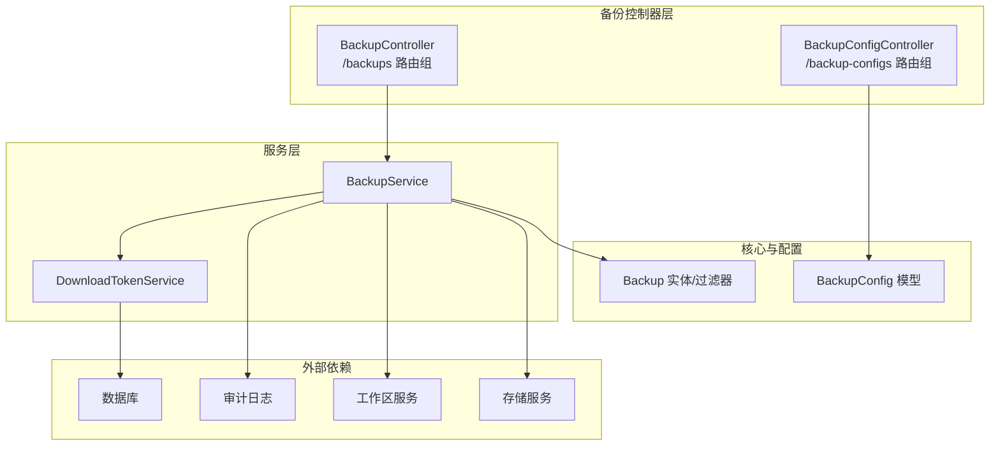
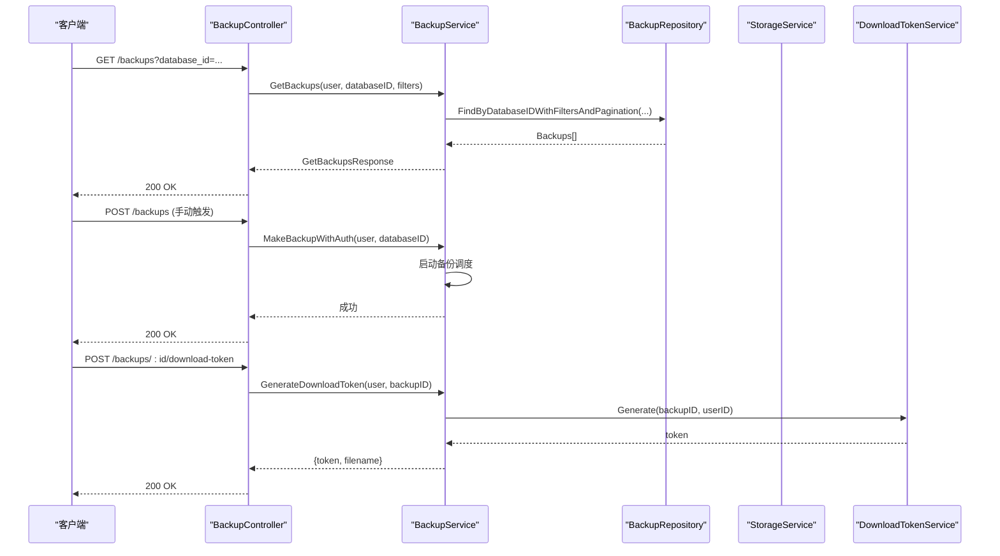
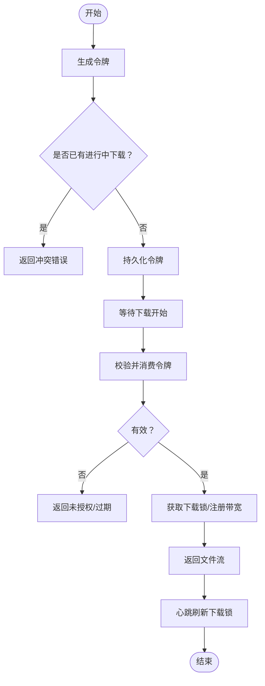
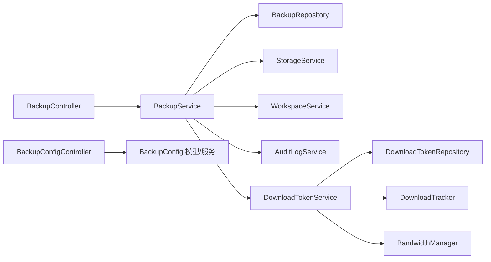

# 备份管理API

<cite>
**本文档引用的文件**
- [controller.go](file://backend/internal/features/backups/backups/controllers/controller.go)
- [dto.go](file://backend/internal/features/backups/backups/dto/dto.go)
- [service.go](file://backend/internal/features/backups/backups/services/service.go)
- [model.go](file://backend/internal/features/backups/backups/core/model.go)
- [controller.go](file://backend/internal/features/backups/config/controller.go)
- [model.go](file://backend/internal/features/backups/config/model.go)
- [dto.go](file://backend/internal/features/backups/config/dto.go)
- [service.go](file://backend/internal/features/backups/backups/download/service.go)
- [dto.go](file://backend/internal/features/backups/backups/common/dto.go)
</cite>

## 目录
1. [简介](#简介)
2. [项目结构](#项目结构)
3. [核心组件](#核心组件)
4. [架构总览](#架构总览)
5. [详细组件分析](#详细组件分析)
6. [依赖关系分析](#依赖关系分析)
7. [性能考虑](#性能考虑)
8. [故障排除指南](#故障排除指南)
9. [结论](#结论)

## 简介
本文件为备份管理模块的详细API文档，覆盖备份配置管理、备份执行、备份监控、备份下载等核心能力。文档同时说明逻辑备份与物理备份在API层面的差异，并涵盖备份计划调度、备份状态查询、备份文件下载、备份生命周期管理、备份加密/压缩/传输配置以及WAL归档与增量备份的特殊接口。

## 项目结构
备份管理模块位于后端服务的备份功能域内，主要由以下层次组成：
- 控制器层：对外暴露REST接口，负责请求参数解析与响应封装
- DTO层：定义请求/响应数据结构
- 服务层：业务编排与跨领域协作（数据库、存储、通知、下载令牌等）
- 核心模型与仓库：备份实体、过滤条件、状态枚举等
- 配置模块：备份策略、保留策略、通知开关、迁移转移等
- 下载子系统：下载令牌生成与校验、并发控制、速率限制

图表来源
- [controller.go:27-39](file://backend/internal/features/backups/backups/controllers/controller.go#L27-L39)
- [controller.go:17-23](file://backend/internal/features/backups/config/controller.go#L17-L23)
- [service.go:31-53](file://backend/internal/features/backups/backups/services/service.go#L31-L53)
- [model.go:20-48](file://backend/internal/features/backups/backups/core/model.go#L20-L48)
- [model.go:16-44](file://backend/internal/features/backups/config/model.go#L16-L44)

章节来源
- [controller.go:1-399](file://backend/internal/features/backups/backups/controllers/controller.go#L1-L399)
- [controller.go:1-210](file://backend/internal/features/backups/config/controller.go#L1-L210)
- [service.go:1-538](file://backend/internal/features/backups/backups/services/service.go#L1-L538)

## 核心组件
- 备份控制器：提供备份列表查询、手动触发备份、删除备份、取消备份、生成下载令牌、公开下载接口等
- 备份配置控制器：保存备份配置、按数据库获取配置、检查存储使用情况、统计使用存储的数据库数量、数据库迁移转移
- 备份服务：权限校验、备份调度、文件读取与解密、下载令牌发放与校验、审计日志写入、清理与删除
- 下载令牌服务：令牌生成/消费、并发下载控制、心跳刷新、带宽管理、过期清理
- 核心模型：备份实体、过滤器、PostgreSQL WAL类型、状态枚举
- 配置模型：备份策略、保留策略、通知开关、重试机制、加密选项

章节来源
- [controller.go:23-399](file://backend/internal/features/backups/backups/controllers/controller.go#L23-L399)
- [controller.go:13-210](file://backend/internal/features/backups/config/controller.go#L13-L210)
- [service.go:31-538](file://backend/internal/features/backups/backups/services/service.go#L31-L538)
- [service.go:11-106](file://backend/internal/features/backups/backups/download/service.go#L11-L106)
- [model.go:13-60](file://backend/internal/features/backups/backups/core/model.go#L13-L60)
- [model.go:16-156](file://backend/internal/features/backups/config/model.go#L16-L156)

## 架构总览
备份管理API采用分层架构，控制器负责路由与鉴权，服务层编排业务流程并协调外部组件（存储、工作区、通知、审计）。下载流程通过独立的令牌与跟踪服务实现并发控制与带宽管理。

图表来源
- [controller.go:41-118](file://backend/internal/features/backups/backups/controllers/controller.go#L41-L118)
- [service.go:84-114](file://backend/internal/features/backups/backups/services/service.go#L84-L114)
- [service.go:385-429](file://backend/internal/features/backups/backups/services/service.go#L385-L429)
- [service.go:18-39](file://backend/internal/features/backups/backups/download/service.go#L18-L39)

## 详细组件分析

### 备份控制器 API
- 路由注册
  - 私有路由组：/backups
    - GET /backups：查询备份列表（支持分页与过滤）
    - POST /backups：手动触发备份
    - DELETE /backups/:id：删除备份
    - POST /backups/:id/cancel：取消进行中的备份
    - POST /backups/:id/download-token：生成下载令牌
  - 公开路由组：/backups
    - GET /backups/:id/file：下载备份文件（需令牌）

- 请求与响应要点
  - 查询备份：支持按状态、时间窗口、PostgreSQL WAL类型过滤；返回总数、分页信息
  - 手动触发：校验用户对数据库所在工作区的访问权限后启动备份调度
  - 删除备份：仅允许管理权限用户删除已完成或失败的备份
  - 取消备份：仅进行中的备份可取消
  - 下载令牌：有效期5分钟，同一用户并发下载互斥
  - 文件下载：支持速率限制、心跳续期、审计日志

章节来源
- [controller.go:27-39](file://backend/internal/features/backups/backups/controllers/controller.go#L27-L39)
- [controller.go:41-85](file://backend/internal/features/backups/backups/controllers/controller.go#L41-L85)
- [controller.go:87-118](file://backend/internal/features/backups/backups/controllers/controller.go#L87-L118)
- [controller.go:120-180](file://backend/internal/features/backups/backups/controllers/controller.go#L120-L180)
- [controller.go:182-221](file://backend/internal/features/backups/backups/controllers/controller.go#L182-L221)
- [controller.go:223-320](file://backend/internal/features/backups/backups/controllers/controller.go#L223-L320)

### 备份服务 API
- 备份查询与分页：根据数据库ID与过滤条件查询备份列表与总数
- 权限校验：基于工作区访问/管理权限
- 手动触发：启动备份调度并写入审计日志
- 删除与取消：删除前检查状态，取消通过任务取消管理器
- 文件读取与解密：根据备份加密状态选择明文或解密流
- 下载令牌：生成、验证、并发控制、心跳刷新、带宽注册与释放

章节来源
- [service.go:116-164](file://backend/internal/features/backups/backups/services/service.go#L116-L164)
- [service.go:84-114](file://backend/internal/features/backups/backups/services/service.go#L84-L114)
- [service.go:166-203](file://backend/internal/features/backups/backups/services/service.go#L166-L203)
- [service.go:209-250](file://backend/internal/features/backups/backups/services/service.go#L209-L250)
- [service.go:297-383](file://backend/internal/features/backups/backups/services/service.go#L297-L383)
- [service.go:385-435](file://backend/internal/features/backups/backups/services/service.go#L385-L435)

### 备份下载令牌服务
- 令牌生成：5分钟有效期，首次生成成功后同一用户并发下载互斥
- 令牌验证与消费：校验有效性、标记已使用、建立下载锁与带宽配额
- 并发控制：基于用户维度的下载锁与心跳刷新
- 带宽管理：为每个下载会话分配独立速率限制器
- 过期清理：定期清理过期令牌

图表来源
- [service.go:18-78](file://backend/internal/features/backups/backups/download/service.go#L18-L78)
- [service.go:80-96](file://backend/internal/features/backups/backups/download/service.go#L80-L96)

章节来源
- [service.go:11-106](file://backend/internal/features/backups/backups/download/service.go#L11-L106)

### 备份配置控制器 API
- 保存备份配置：支持设置加密模式（NONE/ENCRYPTED）、保留策略、通知开关、重试策略
- 获取备份配置：按数据库ID查询当前配置
- 存储使用检查：判断某存储是否被任何备份配置使用
- 统计使用存储的数据库数量
- 数据库迁移转移：支持在同一工作区或跨工作区转移，可选择转移存储与通知器

章节来源
- [controller.go:17-23](file://backend/internal/features/backups/config/controller.go#L17-L23)
- [controller.go:25-60](file://backend/internal/features/backups/config/controller.go#L25-L60)
- [controller.go:62-93](file://backend/internal/features/backups/config/controller.go#L62-L93)
- [controller.go:95-126](file://backend/internal/features/backups/config/controller.go#L95-L126)
- [controller.go:128-159](file://backend/internal/features/backups/config/controller.go#L128-L159)
- [controller.go:161-209](file://backend/internal/features/backups/config/controller.go#L161-L209)

### 备份配置模型与规则
- 关键字段：启用开关、保留策略类型与时长/数量/GFS、备份间隔、存储、通知开关、重试策略、加密模式
- 校验规则：
  - 保留策略类型必须为时间周期/数量/GFS之一，对应字段需满足约束
  - 加密模式必须为NONE或ENCRYPTED，云环境强制加密
  - 重试策略需指定最大失败次数
  - 通知开关数组序列化为逗号分隔字符串

章节来源
- [model.go:16-44](file://backend/internal/features/backups/config/model.go#L16-L44)
- [model.go:83-108](file://backend/internal/features/backups/config/model.go#L83-L108)
- [model.go:132-155](file://backend/internal/features/backups/config/model.go#L132-L155)

### 备份实体与过滤
- 备份实体关键字段：文件名、数据库ID、存储ID、状态、失败信息、大小、时长、加密元数据、PostgreSQL WAL相关字段、上传完成时间、创建时间
- 过滤器：支持状态集合、截止日期、PostgreSQL WAL类型
- WAL类型枚举：全量备份、WAL段

章节来源
- [model.go:20-48](file://backend/internal/features/backups/backups/core/model.go#L20-L48)
- [model.go:13-18](file://backend/internal/features/backups/backups/core/model.go#L13-L18)

### 备份元数据与加密
- 备份元数据：包含备份ID、加密盐值、初始化向量、加密模式
- 校验规则：当加密模式为ENCRYPTED时，盐值与IV为必填

章节来源
- [dto.go:11-38](file://backend/internal/features/backups/backups/common/dto.go#L11-L38)

### 备份生命周期管理
- 创建：手动触发或按计划调度
- 执行：调度器启动，备份写入存储
- 状态：进行中/已完成/失败/已取消
- 清理：按保留策略自动清理旧备份
- 删除：管理员可删除已完成/失败备份
- 取消：仅进行中备份可取消

章节来源
- [service.go:84-114](file://backend/internal/features/backups/backups/services/service.go#L84-L114)
- [service.go:116-164](file://backend/internal/features/backups/backups/services/service.go#L116-L164)
- [service.go:166-203](file://backend/internal/features/backups/backups/services/service.go#L166-L203)
- [service.go:209-250](file://backend/internal/features/backups/backups/services/service.go#L209-L250)

### 备份加密、压缩与传输配置
- 加密：支持NONE与ENCRYPTED两种模式，ENCRYPTED时需要盐值与IV
- 压缩：不同数据库类型的默认扩展名表明压缩格式（如PostgreSQL使用自定义格式）
- 传输：通过存储服务抽象，支持多种后端（本地、S3、Azure Blob、FTP/SFTP、NAS、Rclone等）

章节来源
- [controller.go:27-35](file://backend/internal/features/backups/config/controller.go#L27-L35)
- [model.go:43-43](file://backend/internal/features/backups/config/model.go#L43-L43)
- [service.go:316-383](file://backend/internal/features/backups/backups/services/service.go#L316-L383)
- [controller.go:338-352](file://backend/internal/features/backups/backups/controllers/controller.go#L338-L352)

### WAL归档与增量备份接口
- 查询恢复计划：返回全量备份与WAL段列表，便于恢复规划
- WAL链有效性校验：返回链路连续性与最后连续段信息
- 上传基准备份：上传完成后最终确认接口，设置起止WAL段

章节来源
- [dto.go:56-82](file://backend/internal/features/backups/backups/dto/dto.go#L56-L82)
- [dto.go:50-54](file://backend/internal/features/backups/backups/dto/dto.go#L50-L54)
- [dto.go:84-93](file://backend/internal/features/backups/backups/dto/dto.go#L84-L93)

## 依赖关系分析
- 控制器依赖服务层进行业务处理
- 服务层依赖仓库、存储、工作区、通知、审计、下载令牌等子系统
- 下载令牌服务依赖令牌仓库、下载跟踪器与带宽管理器
- 配置控制器依赖备份配置服务与工作区权限校验

图表来源
- [controller.go:23-25](file://backend/internal/features/backups/backups/controllers/controller.go#L23-L25)
- [service.go:31-53](file://backend/internal/features/backups/backups/services/service.go#L31-L53)
- [service.go:11-16](file://backend/internal/features/backups/backups/download/service.go#L11-L16)

章节来源
- [controller.go:1-399](file://backend/internal/features/backups/backups/controllers/controller.go#L1-L399)
- [service.go:1-538](file://backend/internal/features/backups/backups/services/service.go#L1-L538)
- [service.go:1-106](file://backend/internal/features/backups/backups/download/service.go#L1-L106)

## 性能考虑
- 下载并发控制：同一用户仅允许一个下载任务，避免资源争用
- 心跳保活：下载过程中定期刷新锁，防止异常中断导致资源泄露
- 速率限制：为每个下载会话分配独立带宽配额，保障整体吞吐稳定
- 分页查询：备份列表查询支持limit/offset，建议前端分页加载
- 解密流式处理：对加密备份采用边读边解密，降低内存占用

## 故障排除指南
- 下载冲突：若提示“已有下载进行中”，请等待或取消后再试
- 令牌失效：下载令牌有效期5分钟，过期需重新生成
- 权限不足：删除/取消备份需具备数据库管理权限
- 加密元数据缺失：标记为加密但缺少盐值/IV会导致读取失败
- 存储变更：若存储正在被使用，需先删除相关备份或迁移数据库

章节来源
- [controller.go:227-232](file://backend/internal/features/backups/backups/controllers/controller.go#L227-L232)
- [service.go:431-435](file://backend/internal/features/backups/backups/services/service.go#L431-L435)
- [service.go:166-203](file://backend/internal/features/backups/backups/services/service.go#L166-L203)
- [service.go:329-334](file://backend/internal/features/backups/backups/services/service.go#L329-L334)

## 结论
备份管理API提供了从配置到执行、从监控到下载的完整闭环。通过明确的权限控制、并发与带宽管理、灵活的保留策略与加密选项，以及针对PostgreSQL WAL的专项接口，能够满足多数据库场景下的备份需求。建议在生产环境中结合工作区权限与审计日志，确保操作可追溯与资源安全。