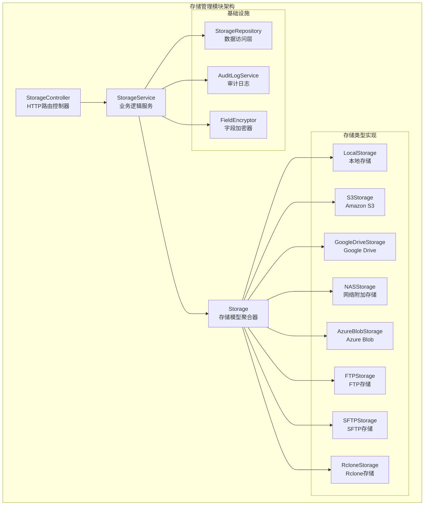
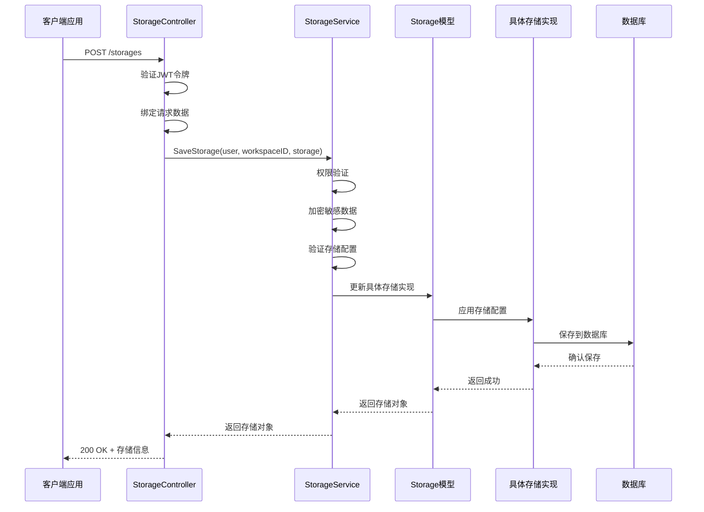
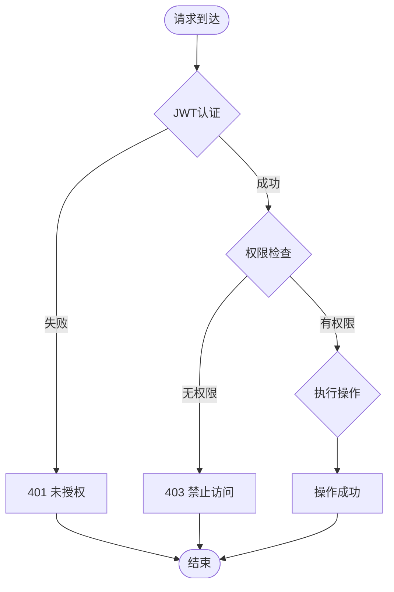
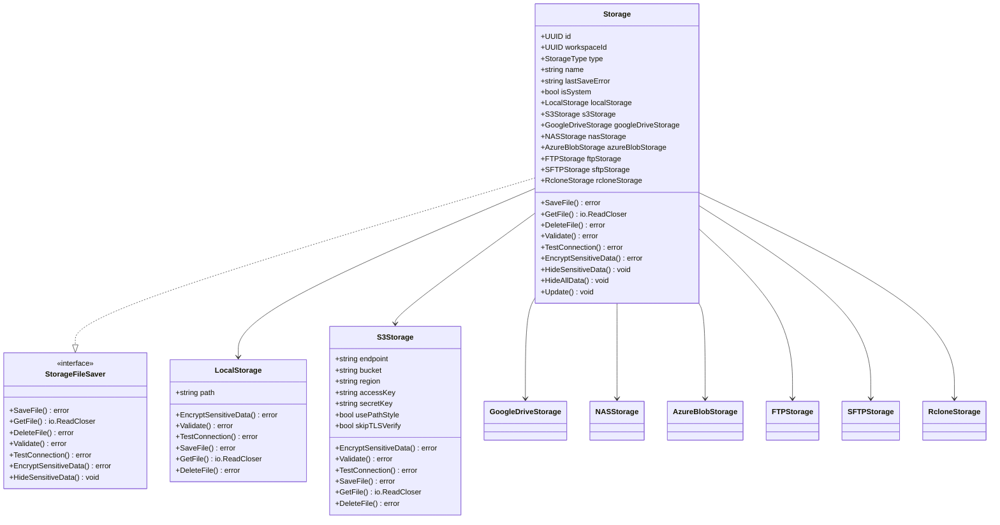
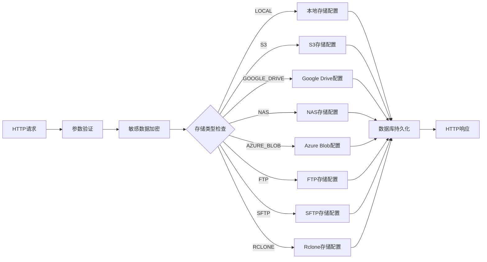

# 存储管理API

<cite>
**本文档引用的文件**
- [controller.go](file://backend/internal/features/storages/controller.go)
- [service.go](file://backend/internal/features/storages/service.go)
- [model.go](file://backend/internal/features/storages/model.go)
- [enums.go](file://backend/internal/features/storages/enums.go)
- [dto.go](file://backend/internal/features/storages/dto.go)
- [model_test.go](file://backend/internal/features/storages/model_test.go)
- [StorageType.ts](file://frontend/src/entity/storages/models/StorageType.ts)
</cite>

## 目录
1. [简介](#简介)
2. [项目结构](#项目结构)
3. [核心组件](#核心组件)
4. [架构概览](#架构概览)
5. [详细组件分析](#详细组件分析)
6. [依赖关系分析](#依赖关系分析)
7. [性能考虑](#性能考虑)
8. [故障排除指南](#故障排除指南)
9. [结论](#结论)

## 简介

存储管理API是数据库备份系统中的核心组件，负责管理各种存储后端的配置和操作。该API支持多种存储类型，包括S3、Azure Blob、Google Drive、本地存储、FTP、SFTP、NAS和Rclone等，为用户提供统一的存储管理界面。

本API提供了完整的存储生命周期管理功能，包括存储配置、连接测试、存储迁移、容量检查和可用性验证等。所有操作都遵循严格的安全策略和权限控制机制。

## 项目结构

存储管理模块采用分层架构设计，主要包含以下核心组件：

**图表来源**
- [controller.go:19-27](file://backend/internal/features/storages/controller.go#L19-L27)
- [service.go:16-22](file://backend/internal/features/storages/service.go#L16-L22)
- [model.go:22-39](file://backend/internal/features/storages/model.go#L22-L39)

**章节来源**
- [controller.go:1-340](file://backend/internal/features/storages/controller.go#L1-L340)
- [service.go:1-409](file://backend/internal/features/storages/service.go#L1-L409)
- [model.go:1-185](file://backend/internal/features/storages/model.go#L1-L185)

## 核心组件

### 存储类型枚举

系统支持8种不同的存储类型，每种类型都有其特定的配置要求和使用场景：

| 存储类型 | 枚举值 | 描述 | 主要用途 |
|---------|--------|------|----------|
| 本地存储 | LOCAL | 文件系统本地路径 | 开发环境、测试环境、小规模部署 |
| S3兼容存储 | S3 | Amazon S3或其他兼容服务 | 云存储、生产环境、大规模部署 |
| Google Drive | GOOGLE_DRIVE | Google云端硬盘 | 协作共享、个人用户 |
| 网络附加存储 | NAS | 网络文件系统 | 企业内部网络存储 |
| Azure Blob | AZURE_BLOB | Microsoft Azure Blob存储 | 云存储、混合云环境 |
| FTP存储 | FTP | 文件传输协议 | 传统文件服务器、跨平台兼容 |
| SFTP存储 | SFTP | 安全文件传输协议 | 安全文件传输、企业环境 |
| Rclone存储 | RCLONE | Rclone多后端支持 | 多云集成、复杂存储场景 |

**章节来源**
- [enums.go:1-15](file://backend/internal/features/storages/enums.go#L1-L15)
- [StorageType.ts:1-10](file://frontend/src/entity/storages/models/StorageType.ts#L1-L10)

### HTTP API端点

存储管理API提供以下RESTful端点：

| 方法 | 路径 | 描述 | 权限要求 |
|------|------|------|----------|
| POST | /storages | 创建或更新存储配置 | 管理数据库权限 |
| GET | /storages | 获取工作区内的所有存储 | 查看存储权限 |
| GET | /storages/{id} | 获取指定存储详情 | 查看存储权限 |
| DELETE | /storages/{id} | 删除存储配置 | 管理数据库权限 |
| POST | /storages/{id}/test | 测试存储连接 | 测试存储权限 |
| POST | /storages/{id}/transfer | 存储迁移 | 源和目标工作区管理权限 |
| POST | /storages/direct-test | 直接测试存储连接 | 工作区查看权限 |

**章节来源**
- [controller.go:19-27](file://backend/internal/features/storages/controller.go#L19-L27)

## 架构概览

存储管理模块采用典型的三层架构模式，实现了关注点分离和高内聚低耦合的设计原则。

**图表来源**
- [controller.go:42-71](file://backend/internal/features/storages/controller.go#L42-L71)
- [service.go:54-147](file://backend/internal/features/storages/service.go#L54-L147)
- [model.go:106-161](file://backend/internal/features/storages/model.go#L106-L161)

### 权限控制机制

系统实现了多层次的权限控制机制：

**图表来源**
- [controller.go:43-68](file://backend/internal/features/storages/controller.go#L43-L68)
- [service.go:58-65](file://backend/internal/features/storages/service.go#L58-L65)

**章节来源**
- [controller.go:42-340](file://backend/internal/features/storages/controller.go#L42-L340)
- [service.go:54-409](file://backend/internal/features/storages/service.go#L54-L409)

## 详细组件分析

### StorageController - HTTP路由控制器

StorageController负责处理所有存储相关的HTTP请求，实现了RESTful API规范，并集成了完整的错误处理和权限验证机制。

#### 核心方法分析

**SaveStorage方法**
- 支持创建新存储和更新现有存储
- 验证工作区ID和用户权限
- 处理存储配置的加密和验证
- 记录审计日志

**TestStorageConnection方法**
- 测试指定存储的连接状态
- 执行存储后端的连通性检查
- 更新最后保存错误状态

**TransferStorageToWorkspace方法**
- 支持在不同工作区间迁移存储
- 验证源和目标工作区的管理权限
- 确保存储没有被数据库关联

**章节来源**
- [controller.go:29-340](file://backend/internal/features/storages/controller.go#L29-L340)

### StorageService - 业务逻辑服务

StorageService是存储管理的核心业务逻辑层，负责协调存储操作、权限验证和数据持久化。

#### 关键业务流程

**存储生命周期管理**
- 创建：验证权限 → 加密敏感数据 → 验证配置 → 保存到数据库
- 更新：权限验证 → 加密更新数据 → 验证配置 → 保存变更
- 删除：权限验证 → 检查数据库关联 → 删除存储

**连接测试流程**
- 权限验证 → 加载存储配置 → 执行连接测试 → 更新状态

**存储迁移流程**
- 验证系统存储限制 → 源工作区权限验证 → 目标工作区权限验证 → 检查数据库关联 → 执行迁移

**章节来源**
- [service.go:54-409](file://backend/internal/features/storages/service.go#L54-L409)

### Storage模型 - 存储聚合器

Storage模型采用了聚合器模式，统一管理不同类型存储的配置和操作。

**图表来源**
- [model.go:22-185](file://backend/internal/features/storages/model.go#L22-L185)

#### 存储类型特定配置

**本地存储配置**
- `path`: 存储根目录路径
- 适用场景：开发测试、小规模部署

**S3兼容存储配置**
- `endpoint`: S3服务端点URL
- `bucket`: 存储桶名称
- `region`: 区域标识
- `accessKey`: 访问密钥
- `secretKey`: 秘密密钥
- `usePathStyle`: 是否使用路径样式
- `skipTLSVerify`: 是否跳过TLS验证
- 适用场景：云存储、生产环境

**Google Drive配置**
- 基于OAuth2认证的配置
- 支持服务账户和用户账户
- 适用场景：协作共享、个人用户

**NAS存储配置**
- `host`: NAS主机地址
- `share`: 共享目录名
- `username`: 用户名
- `password`: 密码
- 适用场景：企业内部网络存储

**Azure Blob配置**
- `accountName`: 存储账户名
- `accountKey`: 存储密钥
- `container`: 容器名称
- 适用场景：Microsoft Azure云存储

**FTP存储配置**
- `host`: FTP服务器地址
- `port`: 端口号
- `username`: 用户名
- `password`: 密码
- `basePath`: 基础路径
- 适用场景：传统文件服务器

**SFTP存储配置**
- `host`: SFTP服务器地址
- `port`: 端口号
- `username`: 用户名
- `password`: 密码
- `privateKey`: 私钥内容
- `passphrase`: 私钥密码短语
- 适用场景：安全文件传输

**Rclone存储配置**
- `remote`: Rclone远程配置
- `path`: 远程路径
- `commandOptions`: 命令行选项
- 适用场景：多云集成、复杂存储场景

**章节来源**
- [model.go:163-184](file://backend/internal/features/storages/model.go#L163-L184)

### 错误处理和异常情况

存储管理模块实现了完善的错误处理机制，针对不同类型的错误返回相应的HTTP状态码：

| 错误类型 | HTTP状态码 | 描述 | 处理建议 |
|----------|------------|------|----------|
| 未认证访问 | 401 | JWT令牌无效或缺失 | 检查认证头和令牌有效性 |
| 权限不足 | 403 | 用户无权执行操作 | 验证用户角色和工作区权限 |
| 请求格式错误 | 400 | JSON格式或参数验证失败 | 检查请求格式和必填字段 |
| 资源不存在 | 404 | 存储或工作区不存在 | 验证ID的有效性和存在性 |
| 内部服务器错误 | 500 | 服务器内部错误 | 检查日志和系统状态 |

**章节来源**
- [controller.go:43-68](file://backend/internal/features/storages/controller.go#L43-L68)
- [service.go:58-65](file://backend/internal/features/storages/service.go#L58-L65)

## 依赖关系分析

存储管理模块的依赖关系清晰明确，遵循依赖倒置原则：

```mermaid
graph TB
subgraph "外部依赖"
Gin[Gin Web框架]
UUID[UUID库]
Azure[Azure SDK]
MinIO[MinIO客户端]
Google[Google API客户端]
end
subgraph "内部模块"
Users[用户服务]
Workspaces[工作区服务]
Audit[审计日志服务]
Encryption[加密服务]
Config[配置服务]
end
subgraph "存储实现"
Local[本地存储实现]
S3[S3存储实现]
GDrive[Google Drive实现]
NAS[NAS存储实现]
AzureBlob[Azure Blob实现]
FTP[FTP存储实现]
SFTP[SFTP存储实现]
Rclone[Rclone存储实现]
end
Controller --> Gin
Controller --> UUID
Controller --> Users
Controller --> Workspaces
Service --> Audit
Service --> Encryption
Service --> Config
Service --> Users
Service --> Workspaces
Model --> Local
Model --> S3
Model --> GDrive
Model --> NAS
Model --> AzureBlob
Model --> FTP
Model --> SFTP
Model --> Rclone
```

**图表来源**
- [controller.go:3-12](file://backend/internal/features/storages/controller.go#L3-L12)
- [service.go:3-14](file://backend/internal/features/storages/service.go#L3-L14)
- [model.go:3-20](file://backend/internal/features/storages/model.go#L3-L20)

### 数据流分析

存储配置的数据流从HTTP请求开始，经过验证和处理，最终持久化到数据库：

**图表来源**
- [service.go:282-315](file://backend/internal/features/storages/service.go#L282-L315)
- [model.go:106-161](file://backend/internal/features/storages/model.go#L106-L161)

**章节来源**
- [controller.go:1-340](file://backend/internal/features/storages/controller.go#L1-L340)
- [service.go:1-409](file://backend/internal/features/storages/service.go#L1-L409)
- [model.go:1-185](file://backend/internal/features/storages/model.go#L1-L185)

## 性能考虑

存储管理API在设计时充分考虑了性能优化和可扩展性：

### 缓存策略
- 存储配置缓存：减少重复的数据库查询
- 权限检查缓存：避免频繁的权限验证
- 连接池管理：复用存储连接，减少资源消耗

### 异步处理
- 大文件上传：支持分块上传和断点续传
- 后台任务：连接测试和迁移操作异步执行
- 批量操作：支持批量删除和批量迁移

### 资源管理
- 连接超时控制：防止长时间阻塞
- 内存使用优化：流式处理大文件
- 并发控制：限制同时进行的操作数量

## 故障排除指南

### 常见问题诊断

**连接测试失败**
1. 检查网络连通性
2. 验证认证凭据
3. 确认防火墙设置
4. 检查TLS证书配置

**权限相关错误**
1. 验证用户角色是否为管理员
2. 检查工作区成员身份
3. 确认存储是否为系统存储
4. 验证目标工作区权限

**存储迁移失败**
1. 检查存储是否被数据库关联
2. 验证源和目标工作区权限
3. 确认存储类型兼容性
4. 检查磁盘空间和配额

### 日志和监控

系统提供了详细的日志记录和监控指标：

- **审计日志**：记录所有存储操作的历史
- **性能指标**：监控API响应时间和吞吐量
- **错误统计**：跟踪常见错误类型和频率
- **存储使用**：监控存储空间使用情况

**章节来源**
- [service.go:249-280](file://backend/internal/features/storages/service.go#L249-L280)
- [model.go:47-57](file://backend/internal/features/storages/model.go#L47-L57)

## 结论

存储管理API提供了完整、安全、高效的存储后端管理解决方案。通过统一的接口设计和严格的权限控制，用户可以轻松管理各种类型的存储后端，满足从开发测试到生产环境的各种需求。

模块的主要优势包括：

1. **多后端支持**：支持8种主流存储类型，适应不同场景需求
2. **安全可靠**：完善的权限控制和数据加密机制
3. **易于使用**：直观的API设计和丰富的错误处理
4. **高性能**：优化的性能设计和资源管理
5. **可扩展性**：模块化的架构设计便于功能扩展

未来的发展方向包括支持更多存储后端、增强监控能力、优化性能表现等。该API为数据库备份系统的稳定运行提供了坚实的基础。