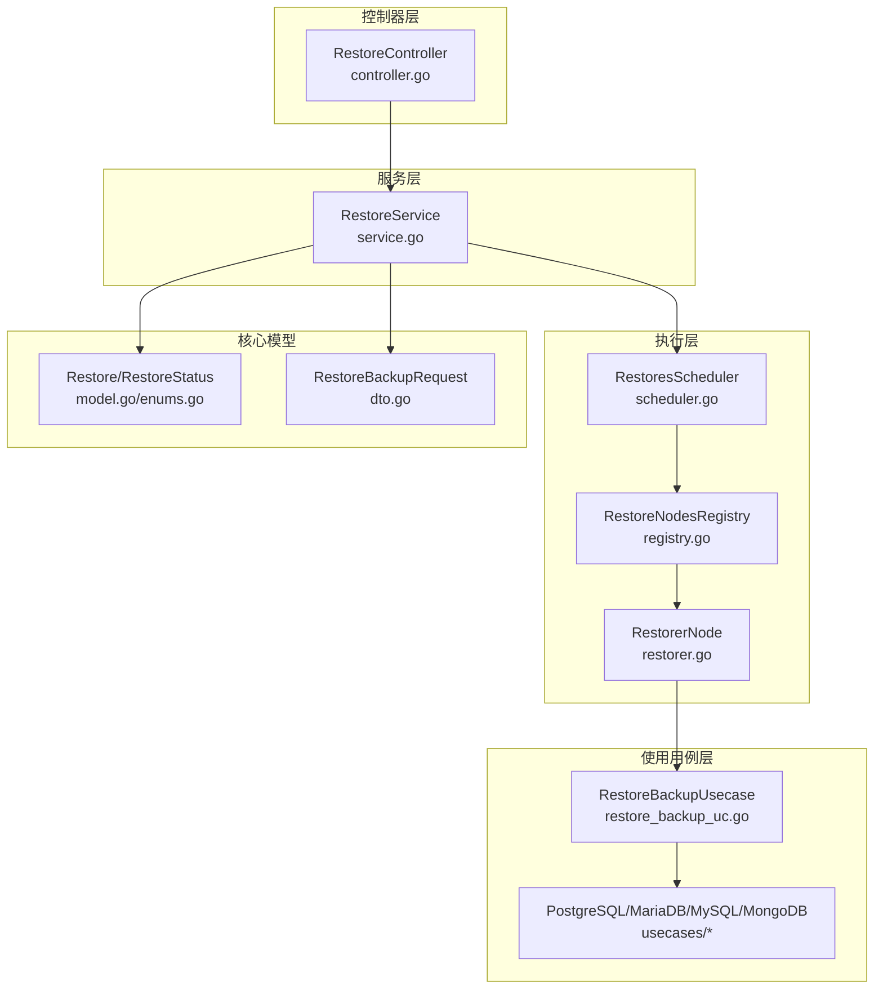
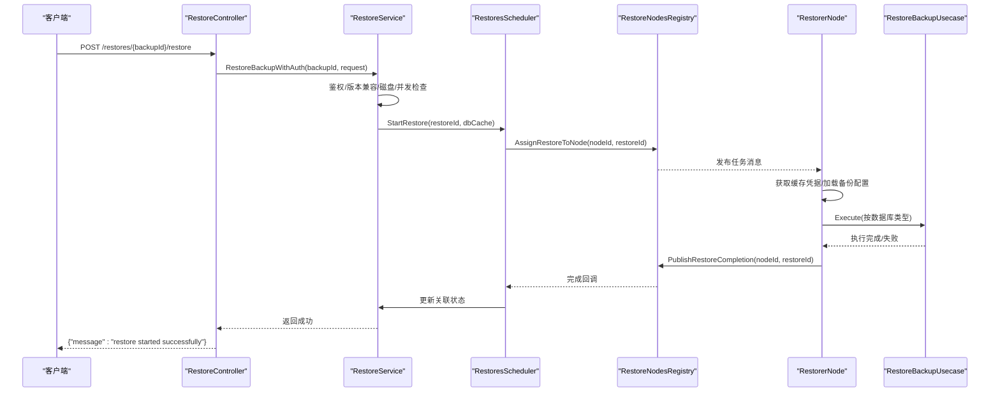
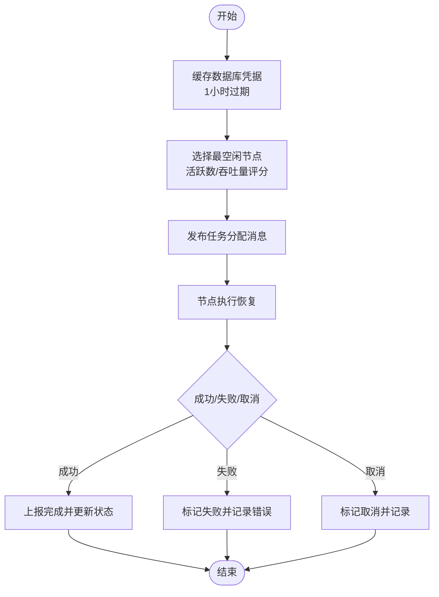
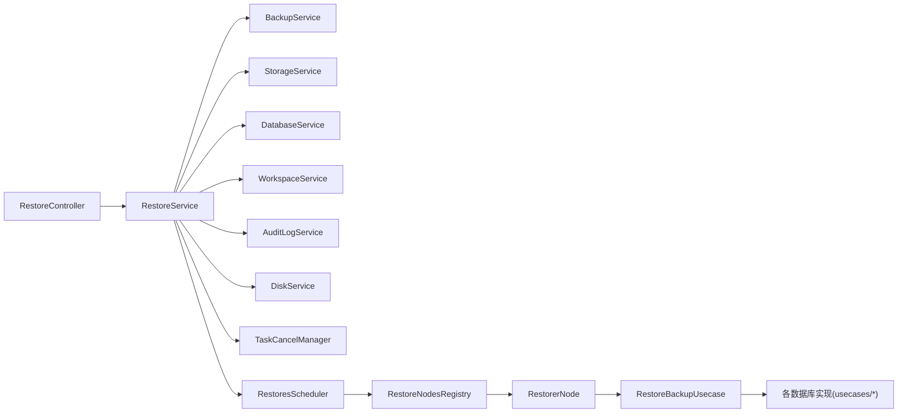

# 恢复管理API

<cite>
**本文档引用的文件**
- [controller.go](file://backend/internal/features/restores/controller.go)
- [service.go](file://backend/internal/features/restores/service.go)
- [di.go](file://backend/internal/features/restores/di.go)
- [model.go](file://backend/internal/features/restores/core/model.go)
- [enums.go](file://backend/internal/features/restores/core/enums.go)
- [dto.go](file://backend/internal/features/restores/core/dto.go)
- [interfaces.go](file://backend/internal/features/restores/core/interfaces.go)
- [restorer.go](file://backend/internal/features/restores/restoring/restorer.go)
- [scheduler.go](file://backend/internal/features/restores/restoring/scheduler.go)
- [registry.go](file://backend/internal/features/restores/restoring/registry.go)
- [restore_backup_uc.go](file://backend/internal/features/restores/usecases/restore_backup_uc.go)
</cite>

## 目录
1. [简介](#简介)
2. [项目结构](#项目结构)
3. [核心组件](#核心组件)
4. [架构总览](#架构总览)
5. [详细组件分析](#详细组件分析)
6. [依赖关系分析](#依赖关系分析)
7. [性能考虑](#性能考虑)
8. [故障排除指南](#故障排除指南)
9. [结论](#结论)

## 简介
本文件为恢复管理模块的完整API文档，覆盖备份恢复的全生命周期：恢复计划（提交）、恢复执行（调度与节点处理）、恢复监控（状态与进度）。文档同时说明不同数据库类型的恢复接口差异、恢复预检查（版本兼容性、磁盘空间、并发限制）、恢复过程中的进度跟踪与状态查询、失败处理与重试机制，以及性能优化与并发控制选项。

## 项目结构
恢复管理模块位于后端服务的 `restores` 子系统中，采用分层设计：
- 控制器层：暴露REST接口，负责请求参数解析与鉴权
- 服务层：业务编排，执行预检查、权限校验、持久化与调度
- 使用用例层：按数据库类型拆分具体恢复逻辑
- 执行层：调度器与恢复节点，负责任务分配、执行与状态上报
- 核心模型与枚举：定义数据结构与状态

**图表来源**
- [controller.go:17-21](file://backend/internal/features/restores/controller.go#L17-L21)
- [service.go:29-42](file://backend/internal/features/restores/service.go#L29-L42)
- [scheduler.go:26-40](file://backend/internal/features/restores/restoring/scheduler.go#L26-L40)
- [restorer.go:30-48](file://backend/internal/features/restores/restoring/restorer.go#L30-L48)
- [restore_backup_uc.go:18-23](file://backend/internal/features/restores/usecases/restore_backup_uc.go#L18-L23)
- [model.go:15-31](file://backend/internal/features/restores/core/model.go#L15-L31)
- [enums.go:3-10](file://backend/internal/features/restores/core/enums.go#L3-L10)
- [dto.go:10-15](file://backend/internal/features/restores/core/dto.go#L10-L15)

**章节来源**
- [controller.go:17-21](file://backend/internal/features/restores/controller.go#L17-L21)
- [service.go:29-42](file://backend/internal/features/restores/service.go#L29-L42)
- [scheduler.go:26-40](file://backend/internal/features/restores/restoring/scheduler.go#L26-L40)
- [restorer.go:30-48](file://backend/internal/features/restores/restoring/restorer.go#L30-L48)
- [restore_backup_uc.go:18-23](file://backend/internal/features/restores/usecases/restore_backup_uc.go#L18-L23)
- [model.go:15-31](file://backend/internal/features/restores/core/model.go#L15-L31)
- [enums.go:3-10](file://backend/internal/features/restores/core/enums.go#L3-L10)
- [dto.go:10-15](file://backend/internal/features/restores/core/dto.go#L10-L15)

## 核心组件
- 控制器：提供恢复相关接口，进行用户鉴权与参数校验
- 服务：执行权限校验、版本兼容性检查、磁盘空间检查、并发限制检查、创建恢复记录并触发调度
- 调度器：选择最合适的恢复节点，缓存数据库凭据，发布任务分配消息
- 恢复节点：接收任务，拉取凭据，执行具体数据库类型的恢复，更新状态并上报完成
- 使用用例：按数据库类型分发到对应恢复实现
- 核心模型：恢复实体、状态枚举、请求DTO

**章节来源**
- [controller.go:13-15](file://backend/internal/features/restores/controller.go#L13-L15)
- [service.go:29-42](file://backend/internal/features/restores/service.go#L29-L42)
- [scheduler.go:26-40](file://backend/internal/features/restores/restoring/scheduler.go#L26-L40)
- [restorer.go:30-48](file://backend/internal/features/restores/restoring/restorer.go#L30-L48)
- [restore_backup_uc.go:18-23](file://backend/internal/features/restores/usecases/restore_backup_uc.go#L18-L23)
- [model.go:15-31](file://backend/internal/features/restores/core/model.go#L15-L31)
- [enums.go:3-10](file://backend/internal/features/restores/core/enums.go#L3-L10)
- [dto.go:10-15](file://backend/internal/features/restores/core/dto.go#L10-L15)

## 架构总览
恢复流程从控制器接收请求，服务层完成鉴权与预检查后，由调度器将任务分配给恢复节点，节点执行具体数据库类型的恢复操作，并通过注册表上报完成状态。

**图表来源**
- [controller.go:64-89](file://backend/internal/features/restores/controller.go#L64-L89)
- [service.go:97-203](file://backend/internal/features/restores/service.go#L97-L203)
- [scheduler.go:96-189](file://backend/internal/features/restores/restoring/scheduler.go#L96-L189)
- [registry.go:359-422](file://backend/internal/features/restores/restoring/registry.go#L359-L422)
- [restorer.go:121-294](file://backend/internal/features/restores/restoring/restorer.go#L121-L294)
- [restore_backup_uc.go:25-80](file://backend/internal/features/restores/usecases/restore_backup_uc.go#L25-L80)

## 详细组件分析

### 接口定义与路由
- 获取指定备份的所有恢复记录
  - 方法：GET
  - 路径：/restores/{backupId}
  - 认证：需要登录
  - 成功响应：数组，元素为恢复对象
  - 失败响应：400 参数无效或业务错误；401 未认证
- 提交恢复任务
  - 方法：POST
  - 路径：/restores/{backupId}/restore
  - 请求体：RestoreBackupRequest（包含各数据库类型的恢复配置）
  - 成功响应：{"message":"restore started successfully"}
  - 失败响应：400 参数或业务错误；401 未认证
- 取消进行中的恢复
  - 方法：POST
  - 路径：/restores/cancel/{restoreId}
  - 成功响应：204 No Content
  - 失败响应：400 参数或业务错误；401 未认证

请求体字段（RestoreBackupRequest）：
- postgresqlDatabase：PostgreSQL数据库恢复配置
- mysqlDatabase：MySQL数据库恢复配置
- mariadbDatabase：MariaDB数据库恢复配置
- mongodbDatabase：MongoDB数据库恢复配置

注意：每个数据库类型的配置在服务层会进行版本填充与兼容性校验，且仅在目标数据库类型匹配时生效。

**章节来源**
- [controller.go:17-21](file://backend/internal/features/restores/controller.go#L17-L21)
- [controller.go:23-53](file://backend/internal/features/restores/controller.go#L23-L53)
- [controller.go:55-89](file://backend/internal/features/restores/controller.go#L55-L89)
- [controller.go:91-119](file://backend/internal/features/restores/controller.go#L91-L119)
- [dto.go:10-15](file://backend/internal/features/restores/core/dto.go#L10-L15)

### 服务层预检查与执行
- 权限校验：确保用户对工作区有访问权限
- 版本兼容性检查：根据备份数据库版本，校验目标数据库版本不更低
- 磁盘空间检查：针对PostgreSQL特定场景（多线程或TOC过滤），计算所需空间并校验可用空间
- 并发控制：同一数据库禁止并行恢复
- 创建恢复记录：保存初始状态为“进行中”
- 触发调度：缓存数据库凭据（1小时有效期），选择最合适的节点并分配任务

返回错误示例（非穷尽）：
- 无法获取备份或数据库信息
- 用户无权限访问该备份
- 目标数据库版本低于备份版本
- 磁盘空间不足
- 同一数据库已有进行中的恢复
- 云模式下不允许多线程恢复

**章节来源**
- [service.go:65-95](file://backend/internal/features/restores/service.go#L65-L95)
- [service.go:97-203](file://backend/internal/features/restores/service.go#L97-L203)
- [service.go:253-351](file://backend/internal/features/restores/service.go#L253-L351)
- [service.go:353-406](file://backend/internal/features/restores/service.go#L353-L406)
- [service.go:408-422](file://backend/internal/features/restores/service.go#L408-L422)

### 数据库类型差异与使用用例
- PostgreSQL：支持CPU线程数、扩展排除等高级选项；当多线程或启用扩展排除时，可能需要文件型恢复，从而触发磁盘空间检查
- MySQL/MariaDB：需满足版本兼容性要求
- MongoDB：需满足版本兼容性要求

使用用例根据原始数据库类型分发到对应实现，统一接口签名，便于扩展新数据库类型。

**章节来源**
- [restore_backup_uc.go:18-80](file://backend/internal/features/restores/usecases/restore_backup_uc.go#L18-L80)
- [service.go:132-140](file://backend/internal/features/restores/service.go#L132-L140)
- [service.go:253-351](file://backend/internal/features/restores/service.go#L253-L351)

### 调度器与恢复节点
- 调度器：
  - 启动时清理“进行中”但因应用重启导致的任务
  - 周期性检测不可用节点并标记其恢复失败
  - 选择最空闲节点（综合活跃恢复数量与吞吐量）并分配任务
  - 缓存数据库凭据（1小时），用于节点侧安全取用
- 恢复节点：
  - 订阅任务分配消息，拉取凭据与备份配置
  - 执行具体数据库类型的恢复
  - 支持取消：基于上下文取消与任务取消管理器
  - 上报完成状态，调度器更新关联关系

**图表来源**
- [scheduler.go:96-189](file://backend/internal/features/restores/restoring/scheduler.go#L96-L189)
- [scheduler.go:300-402](file://backend/internal/features/restores/restoring/scheduler.go#L300-L402)
- [registry.go:359-422](file://backend/internal/features/restores/restoring/registry.go#L359-L422)
- [restorer.go:121-294](file://backend/internal/features/restores/restoring/restorer.go#L121-L294)

**章节来源**
- [scheduler.go:42-90](file://backend/internal/features/restores/restoring/scheduler.go#L42-L90)
- [scheduler.go:191-237](file://backend/internal/features/restores/restoring/scheduler.go#L191-L237)
- [registry.go:303-357](file://backend/internal/features/restores/restoring/registry.go#L303-L357)
- [registry.go:424-480](file://backend/internal/features/restores/restoring/registry.go#L424-L480)
- [restorer.go:50-115](file://backend/internal/features/restores/restoring/restorer.go#L50-L115)
- [restorer.go:121-294](file://backend/internal/features/restores/restoring/restorer.go#L121-L294)

### 状态模型与进度跟踪
- 状态枚举：IN_PROGRESS、COMPLETED、FAILED、CANCELED
- 恢复实体包含：
  - 标识与状态
  - 关联备份
  - 各数据库类型的恢复配置
  - 失败信息与耗时（毫秒）
  - 创建时间

进度跟踪方式：
- 通过查询恢复记录的状态与耗时了解当前进度
- 取消接口可中断进行中的恢复，状态变为CANCELED

**章节来源**
- [enums.go:3-10](file://backend/internal/features/restores/core/enums.go#L3-L10)
- [model.go:15-31](file://backend/internal/features/restores/core/model.go#L15-L31)

### 错误处理与重试机制
- 预检查失败：直接返回错误（如版本不兼容、磁盘不足、并发冲突）
- 调度失败：记录失败原因并回滚状态
- 执行失败：区分取消与异常，分别标记CANCELED或FAILED
- 节点不可用：调度器检测后将节点上的恢复标记为FAILED
- 重试建议：
  - 修复版本不兼容问题后重新提交
  - 释放磁盘空间或调整并发策略
  - 等待节点恢复后自动重试（由调度器与节点心跳机制保障）

**章节来源**
- [service.go:184-194](file://backend/internal/features/restores/service.go#L184-L194)
- [restorer.go:232-278](file://backend/internal/features/restores/restoring/restorer.go#L232-L278)
- [scheduler.go:321-402](file://backend/internal/features/restores/restoring/scheduler.go#L321-L402)

## 依赖关系分析
- 控制器依赖服务层
- 服务层依赖备份、存储、数据库、工作区、审计日志、磁盘、任务取消等服务
- 调度器依赖恢复节点注册表与缓存工具
- 恢复节点依赖使用用例与备份配置、存储、数据库服务
- 使用用例按数据库类型分发到具体实现

**图表来源**
- [di.go:21-36](file://backend/internal/features/restores/di.go#L21-L36)
- [service.go:29-42](file://backend/internal/features/restores/service.go#L29-L42)
- [scheduler.go:26-40](file://backend/internal/features/restores/restoring/scheduler.go#L26-L40)
- [registry.go:45-53](file://backend/internal/features/restores/restoring/registry.go#L45-L53)
- [restorer.go:30-48](file://backend/internal/features/restores/restoring/restorer.go#L30-L48)
- [restore_backup_uc.go:18-23](file://backend/internal/features/restores/usecases/restore_backup_uc.go#L18-L23)

**章节来源**
- [di.go:21-50](file://backend/internal/features/restores/di.go#L21-L50)
- [service.go:29-42](file://backend/internal/features/restores/service.go#L29-L42)
- [scheduler.go:26-40](file://backend/internal/features/restores/restoring/scheduler.go#L26-L40)
- [registry.go:45-53](file://backend/internal/features/restores/restoring/registry.go#L45-L53)
- [restorer.go:30-48](file://backend/internal/features/restores/restoring/restorer.go#L30-L48)
- [restore_backup_uc.go:18-23](file://backend/internal/features/restores/usecases/restore_backup_uc.go#L18-L23)

## 性能考虑
- 节点负载均衡：调度器以“活跃恢复数/吞吐量”为评分，优先选择更空闲的节点
- 磁盘空间预留：PostgreSQL在特定场景下需要额外空间与缓冲，避免执行期间失败
- 凭据缓存：凭据缓存在调度阶段写入缓存，节点侧按需读取，减少重复查询
- 取消与健康检查：节点定期发送心跳，调度器周期性检测节点存活，及时失败不可用节点上的任务

优化建议：
- 在高并发场景下，合理设置节点吞吐量参数，避免单节点过载
- 对PostgreSQL启用多线程或扩展排除时，提前准备充足的磁盘空间
- 使用取消接口快速终止长时间卡住的任务，释放资源

**章节来源**
- [scheduler.go:191-237](file://backend/internal/features/restores/restoring/scheduler.go#L191-L237)
- [service.go:353-406](file://backend/internal/features/restores/service.go#L353-L406)
- [restorer.go:50-115](file://backend/internal/features/restores/restoring/restorer.go#L50-L115)
- [scheduler.go:42-90](file://backend/internal/features/restores/restoring/scheduler.go#L42-L90)

## 故障排除指南
常见问题与处理：
- 400 参数无效：检查备份ID格式与请求体字段是否正确
- 401 未认证：确认登录状态与令牌有效
- 版本不兼容：调整目标数据库版本至等于或高于备份版本
- 磁盘空间不足：清理空间或降低并发，满足PostgreSQL的额外空间需求
- 并发冲突：等待同数据库的恢复完成后重试
- 节点不可用：等待节点恢复或手动干预；调度器会自动标记失败并清理

定位手段：
- 查询恢复记录状态与失败信息
- 检查节点心跳与活跃恢复计数
- 使用取消接口终止长时间运行的任务

**章节来源**
- [controller.go:33-52](file://backend/internal/features/restores/controller.go#L33-L52)
- [service.go:102-154](file://backend/internal/features/restores/service.go#L102-L154)
- [service.go:253-351](file://backend/internal/features/restores/service.go#L253-L351)
- [service.go:353-406](file://backend/internal/features/restores/service.go#L353-L406)
- [registry.go:303-357](file://backend/internal/features/restores/restoring/registry.go#L303-L357)
- [restorer.go:232-278](file://backend/internal/features/restores/restoring/restorer.go#L232-L278)

## 结论
恢复管理API提供了从计划到执行再到监控的完整能力，具备完善的预检查、并发控制与错误处理机制。通过调度器与恢复节点的分布式协作，系统能够高效、稳定地完成多数据库类型的备份恢复任务。建议在生产环境中结合版本兼容性、磁盘空间与节点吞吐量进行合理规划，并利用取消与状态查询接口进行精细化运维。