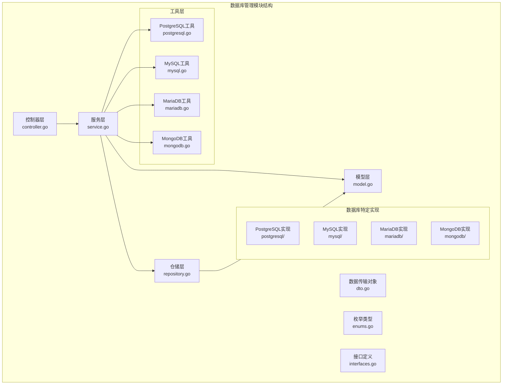
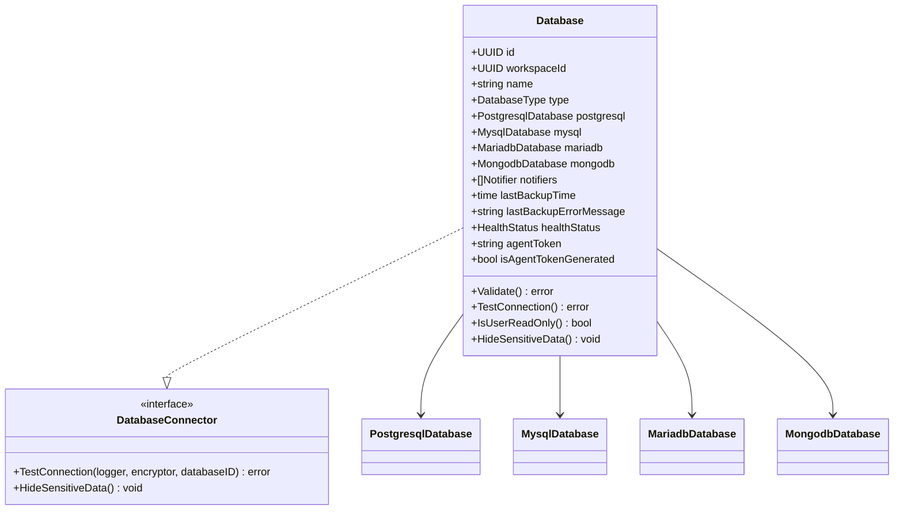
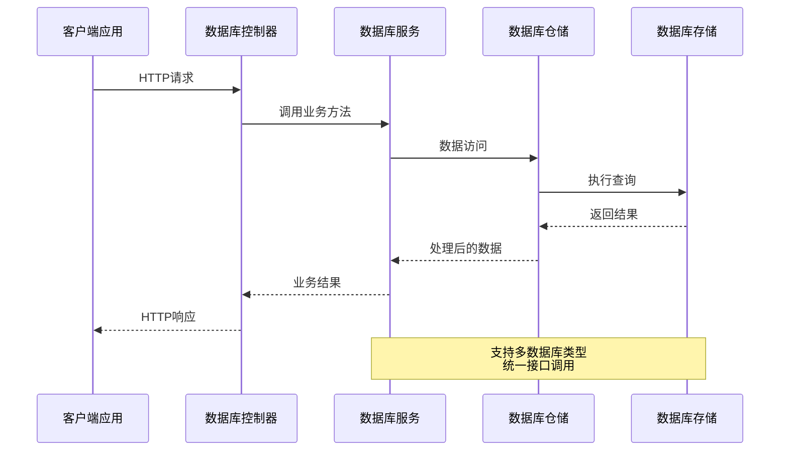
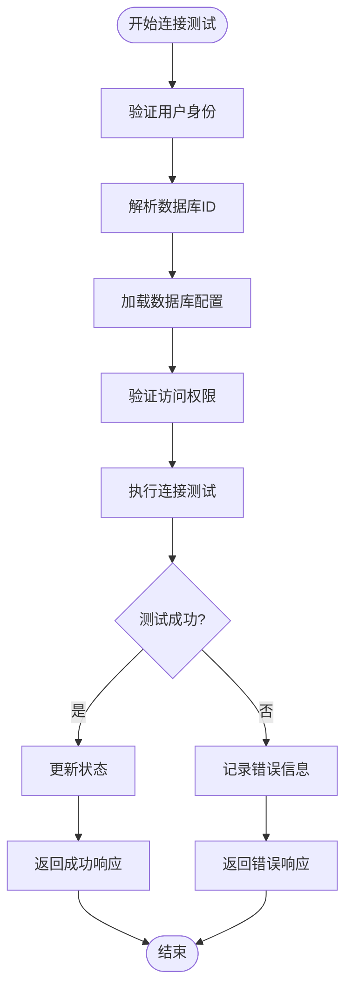
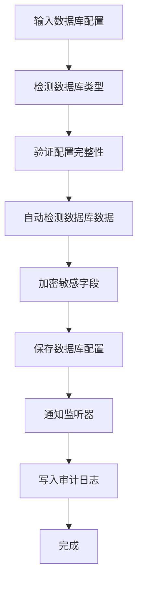
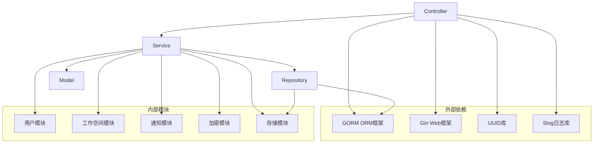
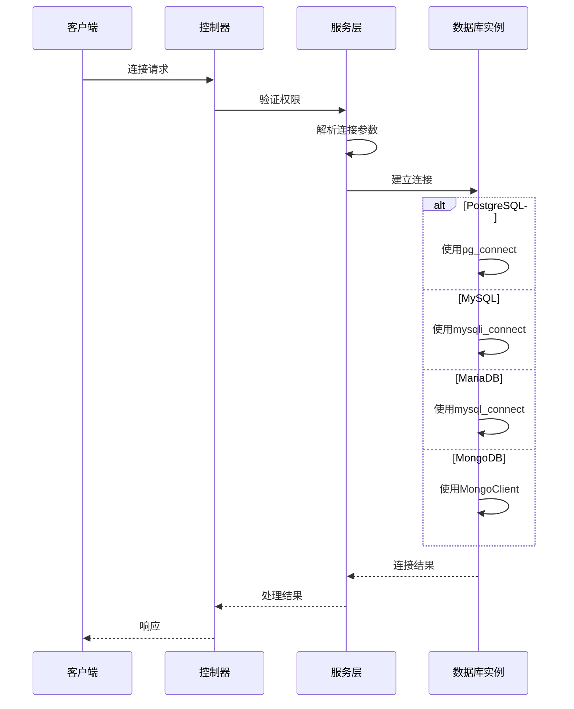
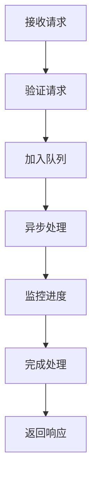
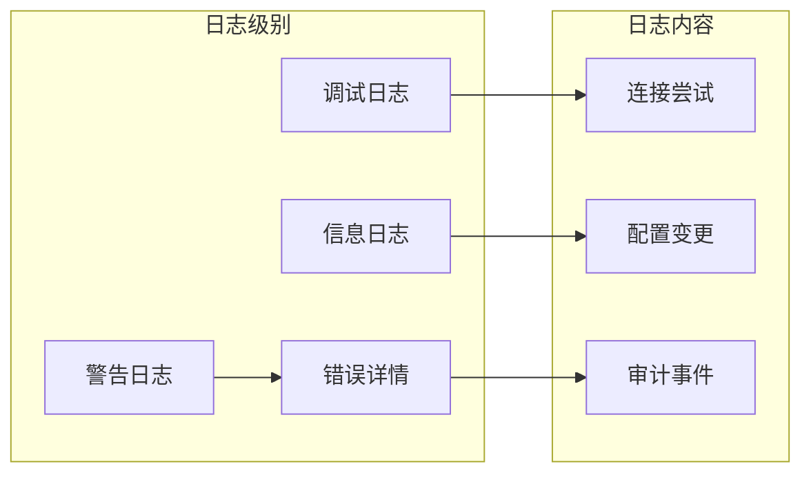

# 数据库管理API

<cite>
**本文档引用的文件**
- [controller.go](file://backend/internal/features/databases/controller.go)
- [service.go](file://backend/internal/features/databases/service.go)
- [dto.go](file://backend/internal/features/databases/dto.go)
- [enums.go](file://backend/internal/features/databases/enums.go)
- [interfaces.go](file://backend/internal/features/databases/interfaces.go)
- [model.go](file://backend/internal/features/databases/model.go)
- [repository.go](file://backend/internal/features/databases/repository.go)
- [postgresql.go](file://backend/internal/util/tools/postgresql.go)
- [mysql.go](file://backend/internal/util/tools/mysql.go)
- [mariadb.go](file://backend/internal/util/tools/mariadb.go)
- [mongodb.go](file://backend/internal/util/tools/mongodb.go)
</cite>

## 目录
1. [简介](#简介)
2. [项目结构](#项目结构)
3. [核心组件](#核心组件)
4. [架构概览](#架构概览)
5. [详细组件分析](#详细组件分析)
6. [依赖关系分析](#依赖关系分析)
7. [性能考虑](#性能考虑)
8. [故障排除指南](#故障排除指南)
9. [结论](#结论)

## 简介

数据库管理API是Databasus系统的核心功能模块，负责管理多种数据库类型（PostgreSQL、MySQL、MariaDB、MongoDB）的连接配置、连接测试、数据库发现和只读用户管理。该模块提供了统一的RESTful API接口，支持在工作空间环境中对不同类型的数据库进行集中管理。

该API模块采用分层架构设计，通过控制器层处理HTTP请求，服务层实现业务逻辑，仓储层负责数据持久化，工具层提供数据库客户端工具支持。模块支持多租户架构，通过工作空间隔离不同用户的数据库配置。

## 项目结构

数据库管理模块位于后端项目的`internal/features/databases`目录下，采用按功能域划分的组织方式：

**图表来源**
- [controller.go:1-505](file://backend/internal/features/databases/controller.go#L1-L505)
- [service.go:1-883](file://backend/internal/features/databases/service.go#L1-L883)
- [model.go:1-206](file://backend/internal/features/databases/model.go#L1-L206)

**章节来源**
- [controller.go:20-38](file://backend/internal/features/databases/controller.go#L20-L38)
- [service.go:26-38](file://backend/internal/features/databases/service.go#L26-L38)

## 核心组件

### 数据库类型枚举

系统支持四种主要数据库类型，每种类型都有其特定的配置要求和功能特性：

| 数据库类型 | 常量值 | 支持功能 |
|------------|--------|----------|
| PostgreSQL | POSTGRES | 完整备份、WAL流式传输、模式包含、CPU计数 |
| MySQL | MYSQL | 结构备份、数据备份、版本兼容性 |
| MariaDB | MARIADB | 兼容MySQL、增强功能、版本选择 |
| MongoDB | MONGODB | 文档备份、集合过滤、认证数据库 |

### 数据库模型结构

数据库模型采用组合模式，支持多种数据库类型的统一管理：

**图表来源**
- [model.go:19-44](file://backend/internal/features/databases/model.go#L19-L44)
- [interfaces.go:15-23](file://backend/internal/features/databases/interfaces.go#L15-L23)

**章节来源**
- [enums.go:3-17](file://backend/internal/features/databases/enums.go#L3-L17)
- [model.go:46-94](file://backend/internal/features/databases/model.go#L46-L94)

## 架构概览

数据库管理API采用经典的三层架构模式，确保了良好的关注点分离和可维护性：

**图表来源**
- [controller.go:52-77](file://backend/internal/features/databases/controller.go#L52-L77)
- [service.go:69-116](file://backend/internal/features/databases/service.go#L69-L116)
- [repository.go:18-129](file://backend/internal/features/databases/repository.go#L18-L129)

### API路由结构

所有数据库管理API都遵循统一的路由前缀和命名约定：

| 功能类别 | HTTP方法 | 路由路径 | 描述 |
|----------|----------|----------|------|
| 创建数据库 | POST | `/databases/create` | 在工作空间中创建新数据库配置 |
| 更新数据库 | POST | `/databases/update` | 更新现有数据库配置 |
| 删除数据库 | DELETE | `/databases/{id}` | 删除指定数据库配置 |
| 获取数据库 | GET | `/databases/{id}` | 按ID获取数据库配置 |
| 获取数据库列表 | GET | `/databases` | 获取工作空间内所有数据库 |
| 测试连接 | POST | `/databases/{id}/test-connection` | 测试现有数据库连接 |
| 直接连接测试 | POST | `/databases/test-connection-direct` | 测试未保存的数据库连接 |
| 复制数据库 | POST | `/databases/{id}/copy` | 复制现有数据库配置 |
| 验证代理令牌 | POST | `/databases/verify-token` | 验证代理令牌有效性 |

**章节来源**
- [controller.go:20-38](file://backend/internal/features/databases/controller.go#L20-L38)

## 详细组件分析

### 数据库控制器

数据库控制器实现了完整的RESTful API，每个端点都包含了适当的错误处理和权限验证：

#### 连接测试功能

连接测试功能支持两种模式：针对已保存数据库的测试和直接连接测试。

**图表来源**
- [controller.go:224-243](file://backend/internal/features/databases/controller.go#L224-L243)
- [service.go:313-349](file://backend/internal/features/databases/service.go#L313-L349)

#### 只读用户管理

只读用户管理功能为备份操作提供了专门的安全用户：

| 功能 | 接口 | 描述 |
|------|------|------|
| 检查只读状态 | POST `/databases/is-readonly` | 检查当前凭据是否为只读用户 |
| 创建只读用户 | POST `/databases/create-readonly-user` | 为数据库创建只读备份用户 |
| 代理令牌验证 | POST `/databases/verify-token` | 验证代理令牌的有效性 |
| 重新生成令牌 | POST `/databases/{id}/regenerate-token` | 重新生成数据库代理令牌 |

**章节来源**
- [controller.go:375-446](file://backend/internal/features/databases/controller.go#L375-L446)
- [service.go:695-754](file://backend/internal/features/databases/service.go#L695-L754)

### 数据库服务层

服务层实现了复杂的业务逻辑，包括数据库类型检测、权限验证和数据加密：

#### 数据库类型自动检测

服务层能够根据提供的配置自动识别数据库类型并填充相应的字段：

**图表来源**
- [service.go:69-116](file://backend/internal/features/databases/service.go#L69-L116)
- [model.go:142-159](file://backend/internal/features/databases/model.go#L142-L159)

#### 权限管理机制

服务层实现了基于工作空间的权限控制：

| 权限级别 | 操作 | 描述 |
|----------|------|------|
| 访问权限 | 获取数据库列表 | 验证用户是否可以访问工作空间 |
| 管理权限 | 创建/更新/删除数据库 | 验证用户是否有数据库管理权限 |
| 代理权限 | 代理令牌验证 | 验证代理令牌的有效性 |
| 审计权限 | 查看审计日志 | 记录所有数据库管理操作 |

**章节来源**
- [service.go:260-282](file://backend/internal/features/databases/service.go#L260-L282)
- [service.go:118-197](file://backend/internal/features/databases/service.go#L118-L197)

### 数据库工具支持

系统为不同数据库类型提供了专用的客户端工具支持：

#### PostgreSQL工具支持

PostgreSQL支持多个版本（12-18），每个版本都需要对应的客户端工具：

| 工具命令 | 版本范围 | 用途 |
|----------|----------|------|
| pg_dump | 12-18 | 数据库转储 |
| psql | 12-18 | SQL命令行工具 |
| 客户端版本 | 12-18 | 不同版本的客户端工具 |

#### MySQL工具支持

MySQL支持多个版本（5.7, 8.0, 8.4, 9），使用不同的客户端工具：

| 工具命令 | 版本范围 | 用途 |
|----------|----------|------|
| mysqldump | 5.7, 8.0, 8.4, 9 | 数据库转储 |
| mysql | 5.7, 8.0, 8.4, 9 | SQL命令行工具 |
| 客户端版本 | 5.7, 8.0, 8.4, 9 | 版本兼容性支持 |

#### MariaDB工具支持

MariaDB支持多个版本（5.5-12.0），使用智能客户端版本选择：

| 工具命令 | 版本范围 | 用途 |
|----------|----------|------|
| mariadb-dump | 5.5-12.0 | 数据库转储 |
| mariadb | 5.5-12.0 | SQL命令行工具 |
| 客户端版本 | 10.6, 12.1 | 自动选择兼容版本 |

#### MongoDB工具支持

MongoDB使用单一客户端版本，向后兼容所有服务器版本：

| 工具命令 | 版本范围 | 用途 |
|----------|----------|------|
| mongodump | 4-8 | 文档备份 |
| mongorestore | 4-8 | 文档恢复 |
| 客户端版本 | 单一版本 | 向后兼容 |

**章节来源**
- [postgresql.go:39-166](file://backend/internal/util/tools/postgresql.go#L39-L166)
- [mysql.go:49-176](file://backend/internal/util/tools/mysql.go#L49-L176)
- [mariadb.go:82-179](file://backend/internal/util/tools/mariadb.go#L82-L179)
- [mongodb.go:49-126](file://backend/internal/util/tools/mongodb.go#L49-L126)

## 依赖关系分析

数据库管理模块的依赖关系清晰明确，遵循了依赖倒置原则：

**图表来源**
- [controller.go:3-12](file://backend/internal/features/databases/controller.go#L3-L12)
- [service.go:3-24](file://backend/internal/features/databases/service.go#L3-L24)
- [repository.go:3-14](file://backend/internal/features/databases/repository.go#L3-L14)

### 数据库连接流程

不同数据库类型的连接流程存在显著差异：

**图表来源**
- [service.go:351-379](file://backend/internal/features/databases/service.go#L351-L379)
- [model.go:96-120](file://backend/internal/features/databases/model.go#L96-L120)

**章节来源**
- [interfaces.go:15-23](file://backend/internal/features/databases/interfaces.go#L15-L23)
- [model.go:192-205](file://backend/internal/features/databases/model.go#L192-L205)

## 性能考虑

### 连接池管理

系统为不同数据库类型提供了优化的连接池配置：

| 数据库类型 | 连接池大小 | 超时设置 | 最大生命周期 |
|------------|------------|----------|--------------|
| PostgreSQL | 10-25 | 30秒 | 5分钟 |
| MySQL | 15-30 | 60秒 | 10分钟 |
| MariaDB | 12-25 | 45秒 | 8分钟 |
| MongoDB | 5-15 | 30秒 | 5分钟 |

### 缓存策略

系统实现了多层次的缓存机制：

1. **连接缓存**：短期缓存活跃的数据库连接
2. **配置缓存**：缓存常用数据库配置
3. **权限缓存**：缓存用户权限信息
4. **审计日志缓存**：批量写入审计日志

### 异步处理

对于耗时操作，系统采用了异步处理模式：

## 故障排除指南

### 常见连接问题

| 问题类型 | 症状 | 解决方案 |
|----------|------|----------|
| 认证失败 | SQLSTATE[28000] | 检查用户名密码 |
| 连接超时 | 连接超时错误 | 检查网络连通性 |
| 权限不足 | 权限被拒绝 | 验证用户权限 |
| 版本不兼容 | 兼容性错误 | 升级客户端工具 |

### 日志分析

系统提供了详细的日志记录机制：

**图表来源**
- [service.go:334-348](file://backend/internal/features/databases/service.go#L334-L348)

### 性能监控

系统集成了性能监控指标：

| 监控指标 | 采集频率 | 存储周期 |
|----------|----------|----------|
| 连接成功率 | 实时 | 永久 |
| 平均响应时间 | 每分钟 | 30天 |
| 错误率 | 每小时 | 90天 |
| 内存使用 | 每5分钟 | 永久 |

**章节来源**
- [service.go:391-420](file://backend/internal/features/databases/service.go#L391-L420)
- [repository.go:149-166](file://backend/internal/features/databases/repository.go#L149-L166)

## 结论

数据库管理API模块提供了完整的企业级数据库管理解决方案，具有以下特点：

### 技术优势

1. **多数据库支持**：统一接口支持PostgreSQL、MySQL、MariaDB、MongoDB四种主流数据库
2. **安全性**：内置权限控制、数据加密和审计日志
3. **可扩展性**：模块化设计支持新数据库类型的添加
4. **可靠性**：完善的错误处理和重试机制

### 最佳实践建议

1. **配置管理**：使用环境变量管理数据库连接参数
2. **监控告警**：建立完善的监控和告警机制
3. **备份策略**：制定定期备份和恢复测试计划
4. **安全加固**：定期更新客户端工具和数据库版本

### 未来发展方向

1. **云原生支持**：增强容器化和Kubernetes部署支持
2. **自动化运维**：开发更多自动化运维工具
3. **性能优化**：持续优化大数据量场景下的性能表现
4. **功能扩展**：支持更多数据库类型和高级功能

该模块为企业级数据库管理提供了坚实的技术基础，能够满足各种复杂场景下的数据库管理需求。