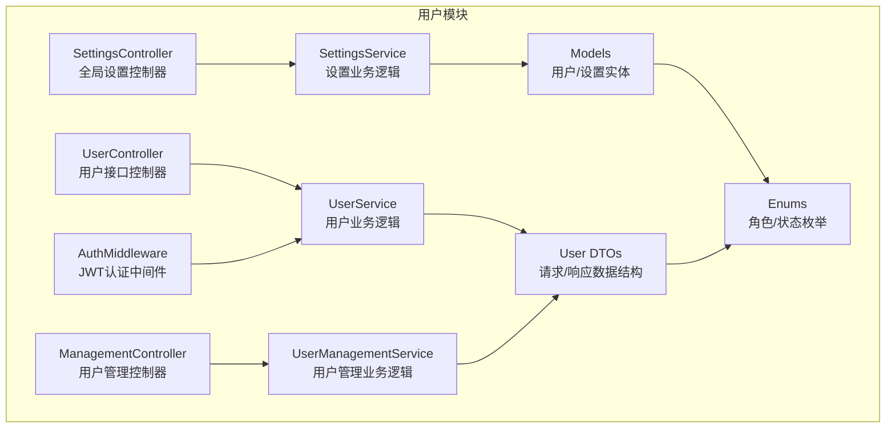
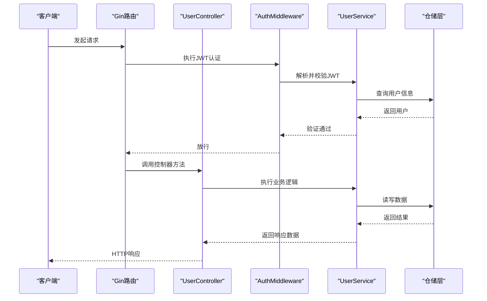
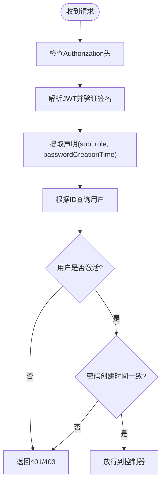
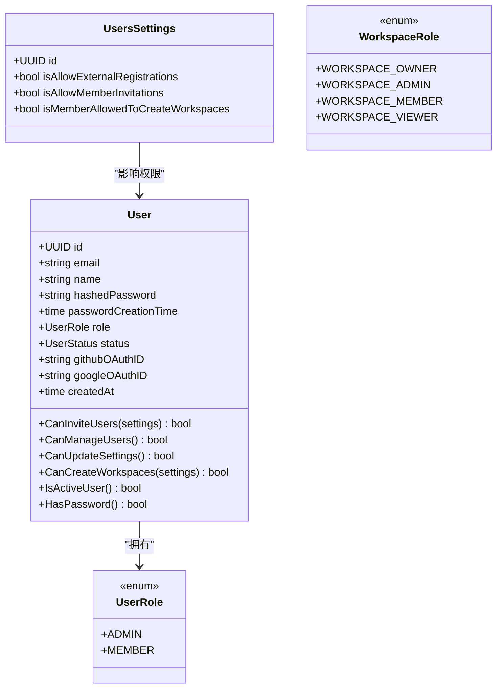
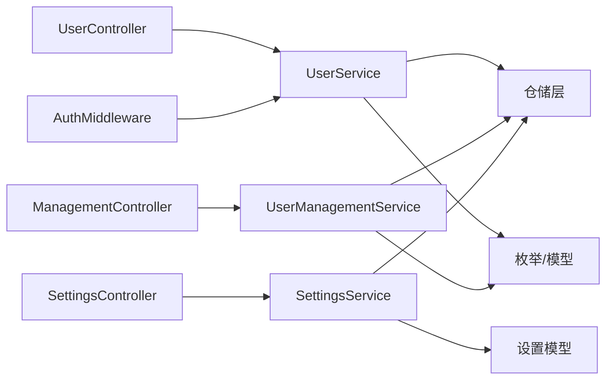

# 用户管理API

<cite>
**本文档引用的文件**
- [backend/internal/features/users/controllers/user_controller.go](file://backend/internal/features/users/controllers/user_controller.go)
- [backend/internal/features/users/controllers/management_controller.go](file://backend/internal/features/users/controllers/management_controller.go)
- [backend/internal/features/users/controllers/settings_controller.go](file://backend/internal/features/users/controllers/settings_controller.go)
- [backend/internal/features/users/middleware/middleware.go](file://backend/internal/features/users/middleware/middleware.go)
- [backend/internal/features/users/models/user.go](file://backend/internal/features/users/models/user.go)
- [backend/internal/features/users/models/users_settings.go](file://backend/internal/features/users/models/users_settings.go)
- [backend/internal/features/users/dto/dto.go](file://backend/internal/features/users/dto/dto.go)
- [backend/internal/features/users/enums/user_role.go](file://backend/internal/features/users/enums/user_role.go)
- [backend/internal/features/users/enums/workspace_role.go](file://backend/internal/features/users/enums/workspace_role.go)
- [backend/internal/features/users/services/user_services.go](file://backend/internal/features/users/services/user_services.go)
- [backend/internal/features/users/services/management_service.go](file://backend/internal/features/users/services/management_service.go)
- [backend/internal/features/users/services/settings_service.go](file://backend/internal/features/users/services/settings_service.go)
- [backend/internal/features/users/errors/errors.go](file://backend/internal/features/users/errors/errors.go)
</cite>

## 目录
1. [简介](#简介)
2. [项目结构](#项目结构)
3. [核心组件](#核心组件)
4. [架构总览](#架构总览)
5. [详细组件分析](#详细组件分析)
6. [依赖关系分析](#依赖关系分析)
7. [性能考虑](#性能考虑)
8. [故障排除指南](#故障排除指南)
9. [结论](#结论)

## 简介
本文件为用户管理模块的完整API文档，覆盖用户注册、登录、登出（通过JWT失效机制）、密码重置、个人信息管理、管理员功能与全局设置等功能。文档详细说明每个端点的HTTP方法、URL路径、请求参数、响应格式，并解释JWT令牌认证机制、权限验证流程、错误码与异常处理，以及用户角色权限系统与工作空间访问控制。

## 项目结构
用户管理相关代码位于后端模块的 users 子目录中，采用控制器-服务-模型-枚举-DTO的分层设计，配合中间件实现认证与授权。

图表来源
- [backend/internal/features/users/controllers/user_controller.go:24-46](file://backend/internal/features/users/controllers/user_controller.go#L24-L46)
- [backend/internal/features/users/controllers/management_controller.go:20-38](file://backend/internal/features/users/controllers/management_controller.go#L20-L38)
- [backend/internal/features/users/controllers/settings_controller.go:18-25](file://backend/internal/features/users/controllers/settings_controller.go#L18-L25)
- [backend/internal/features/users/middleware/middleware.go:14-38](file://backend/internal/features/users/middleware/middleware.go#L14-L38)
- [backend/internal/features/users/services/user_services.go:30-37](file://backend/internal/features/users/services/user_services.go#L30-L37)
- [backend/internal/features/users/services/management_service.go:16-19](file://backend/internal/features/users/services/management_service.go#L16-L19)
- [backend/internal/features/users/services/settings_service.go:11-14](file://backend/internal/features/users/services/settings_service.go#L11-L14)
- [backend/internal/features/users/dto/dto.go:11-108](file://backend/internal/features/users/dto/dto.go#L11-L108)
- [backend/internal/features/users/enums/user_role.go:3-17](file://backend/internal/features/users/enums/user_role.go#L3-L17)
- [backend/internal/features/users/enums/workspace_role.go:3-21](file://backend/internal/features/users/enums/workspace_role.go#L3-L21)
- [backend/internal/features/users/models/user.go:11-59](file://backend/internal/features/users/models/user.go#L11-L59)
- [backend/internal/features/users/models/users_settings.go:5-17](file://backend/internal/features/users/models/users_settings.go#L5-L17)

章节来源
- [backend/internal/features/users/controllers/user_controller.go:24-46](file://backend/internal/features/users/controllers/user_controller.go#L24-L46)
- [backend/internal/features/users/controllers/management_controller.go:20-38](file://backend/internal/features/users/controllers/management_controller.go#L20-L38)
- [backend/internal/features/users/controllers/settings_controller.go:18-25](file://backend/internal/features/users/controllers/settings_controller.go#L18-L25)

## 核心组件
- 控制器层：负责路由注册、请求绑定、调用服务层、返回响应与错误码。
- 中间件层：JWT认证中间件负责从请求头提取令牌并校验有效性；角色中间件用于权限控制。
- 服务层：封装业务逻辑，包括用户注册/登录/密码变更/邀请/信息更新、OAuth回调、密码重置、用户管理与设置更新。
- 模型与DTO：定义用户实体、设置实体、请求/响应数据结构与枚举类型。
- 枚举：用户角色（ADMIN/MEMBER）与工作空间角色（OWNER/ADMIN/MEMBER/VIEWER）。

章节来源
- [backend/internal/features/users/middleware/middleware.go:14-64](file://backend/internal/features/users/middleware/middleware.go#L14-L64)
- [backend/internal/features/users/services/user_services.go:30-37](file://backend/internal/features/users/services/user_services.go#L30-L37)
- [backend/internal/features/users/services/management_service.go:16-19](file://backend/internal/features/users/services/management_service.go#L16-L19)
- [backend/internal/features/users/services/settings_service.go:11-14](file://backend/internal/features/users/services/settings_service.go#L11-L14)
- [backend/internal/features/users/models/user.go:11-59](file://backend/internal/features/users/models/user.go#L11-L59)
- [backend/internal/features/users/models/users_settings.go:5-17](file://backend/internal/features/users/models/users_settings.go#L5-L17)
- [backend/internal/features/users/dto/dto.go:11-108](file://backend/internal/features/users/dto/dto.go#L11-L108)
- [backend/internal/features/users/enums/user_role.go:3-17](file://backend/internal/features/users/enums/user_role.go#L3-L17)
- [backend/internal/features/users/enums/workspace_role.go:3-21](file://backend/internal/features/users/enums/workspace_role.go#L3-L21)

## 架构总览
用户管理API采用Gin框架路由，通过中间件完成JWT认证与角色授权，控制器调用服务层执行业务逻辑，服务层与仓库层交互持久化数据。

图表来源
- [backend/internal/features/users/controllers/user_controller.go:113-157](file://backend/internal/features/users/controllers/user_controller.go#L113-L157)
- [backend/internal/features/users/middleware/middleware.go:14-38](file://backend/internal/features/users/middleware/middleware.go#L14-L38)
- [backend/internal/features/users/services/user_services.go:185-239](file://backend/internal/features/users/services/user_services.go#L185-L239)

## 详细组件分析

### 认证与授权机制
- JWT令牌生成：服务层使用对称签名算法生成含用户ID、角色、密码创建时间等声明的令牌，有效期为十年。
- 令牌解析与校验：中间件从Authorization头提取令牌，去除“Bearer ”前缀后进行签名验证与声明解析；同时检查用户状态与密码创建时间一致性。
- 角色中间件：要求特定端点仅限ADMIN或具备相应权限的用户访问。
- 登出：通过服务端不主动撤销令牌实现；当用户修改密码时，旧令牌因密码创建时间不一致而被拒绝。

图表来源
- [backend/internal/features/users/middleware/middleware.go:14-38](file://backend/internal/features/users/middleware/middleware.go#L14-L38)
- [backend/internal/features/users/services/user_services.go:185-239](file://backend/internal/features/users/services/user_services.go#L185-L239)

章节来源
- [backend/internal/features/users/middleware/middleware.go:14-64](file://backend/internal/features/users/middleware/middleware.go#L14-L64)
- [backend/internal/features/users/services/user_services.go:241-269](file://backend/internal/features/users/services/user_services.go#L241-L269)

### 用户注册 /users/signup
- 方法与路径：POST /users/signup
- 请求体：包含邮箱、密码、姓名、可选Cloudflare Turnstile令牌
- 成功响应：返回包含用户ID、邮箱与JWT令牌的结构
- 失败响应：400（请求格式无效/用户名已存在/外部注册未开启）
- 速率限制：无
- 安全增强：可选启用Cloudflare Turnstile人机验证

章节来源
- [backend/internal/features/users/controllers/user_controller.go:48-100](file://backend/internal/features/users/controllers/user_controller.go#L48-L100)
- [backend/internal/features/users/dto/dto.go:11-16](file://backend/internal/features/users/dto/dto.go#L11-L16)
- [backend/internal/features/users/services/user_services.go:47-133](file://backend/internal/features/users/services/user_services.go#L47-L133)

### 用户登录 /users/signin
- 方法与路径：POST /users/signin
- 请求体：包含邮箱、密码、可选Cloudflare Turnstile令牌
- 成功响应：返回包含用户ID、邮箱与JWT令牌的结构
- 失败响应：400（用户不存在/账户未激活/密码错误），429（登录尝试频率过高）
- 速率限制：按邮箱维度每分钟最多10次尝试
- 安全增强：可选启用Cloudflare Turnstile人机验证

章节来源
- [backend/internal/features/users/controllers/user_controller.go:102-158](file://backend/internal/features/users/controllers/user_controller.go#L102-L158)
- [backend/internal/features/users/dto/dto.go:18-22](file://backend/internal/features/users/dto/dto.go#L18-L22)
- [backend/internal/features/users/services/user_services.go:135-183](file://backend/internal/features/users/services/user_services.go#L135-L183)

### 管理员密码设置 /users/admin/*
- 获取管理员是否已有密码：GET /users/admin/has-password
- 设置管理员密码：POST /users/admin/set-password
- 用途：首次部署或重置根管理员密码
- 权限：无需认证

章节来源
- [backend/internal/features/users/controllers/user_controller.go:160-187](file://backend/internal/features/users/controllers/user_controller.go#L160-L187)
- [backend/internal/features/users/services/user_services.go:271-320](file://backend/internal/features/users/services/user_services.go#L271-L320)

### 密码重置 /users/send-reset-password-code 与 /users/reset-password
- 发送重置码：POST /users/send-reset-password-code
  - 请求体：邮箱、可选Cloudflare Turnstile令牌
  - 速率限制：按邮箱每小时最多3次
  - 响应：静默成功（避免枚举攻击）
- 重置密码：POST /users/reset-password
  - 请求体：邮箱、验证码、新密码
  - 响应：成功消息

章节来源
- [backend/internal/features/users/controllers/user_controller.go:399-486](file://backend/internal/features/users/controllers/user_controller.go#L399-L486)
- [backend/internal/features/users/dto/dto.go:98-107](file://backend/internal/features/users/dto/dto.go#L98-L107)
- [backend/internal/features/users/services/user_services.go:506-665](file://backend/internal/features/users/services/user_services.go#L506-L665)

### OAuth回调 /auth/github/callback 与 /auth/google/callback
- GitHub回调：POST /auth/github/callback
- Google回调：POST /auth/google/callback
- 请求体：授权码与重定向URI
- 响应：包含用户ID、邮箱、JWT令牌与是否新用户的结构
- 权限：无需认证；需在环境变量中配置对应ClientID/ClientSecret

章节来源
- [backend/internal/features/users/controllers/user_controller.go:333-397](file://backend/internal/features/users/controllers/user_controller.go#L333-L397)
- [backend/internal/features/users/dto/dto.go:86-96](file://backend/internal/features/users/dto/dto.go#L86-L96)
- [backend/internal/features/users/services/user_services.go:484-504](file://backend/internal/features/users/services/user_services.go#L484-L504)

### 当前用户信息 /users/me
- 获取信息：GET /users/me
  - 需要：Bearer JWT
  - 响应：用户档案（ID、邮箱、姓名、角色、是否激活、创建时间）
- 更新信息：PUT /users/me
  - 需要：Bearer JWT
  - 请求体：可选姓名与邮箱（邮箱需唯一）
  - 响应：成功消息

章节来源
- [backend/internal/features/users/controllers/user_controller.go:274-331](file://backend/internal/features/users/controllers/user_controller.go#L274-L331)
- [backend/internal/features/users/dto/dto.go:42-45](file://backend/internal/features/users/dto/dto.go#L42-L45)
- [backend/internal/features/users/services/user_services.go:416-482](file://backend/internal/features/users/services/user_services.go#L416-L482)

### 修改密码 /users/change-password
- 方法与路径：PUT /users/change-password
- 需要：Bearer JWT
- 请求体：新密码（至少8位）
- 响应：成功消息

章节来源
- [backend/internal/features/users/controllers/user_controller.go:189-233](file://backend/internal/features/users/controllers/user_controller.go#L189-L233)
- [backend/internal/features/users/dto/dto.go:38-40](file://backend/internal/features/users/dto/dto.go#L38-L40)
- [backend/internal/features/users/services/user_services.go:331-348](file://backend/internal/features/users/services/user_services.go#L331-L348)

### 用户邀请 /users/invite
- 方法与路径：POST /users/invite
- 需要：Bearer JWT
- 请求体：受邀者邮箱、可选目标工作空间ID与目标工作空间角色
- 响应：邀请记录（ID、邮箱、目标工作空间信息、创建时间）
- 权限：ADMIN或满足设置允许的MEMBER

章节来源
- [backend/internal/features/users/controllers/user_controller.go:235-272](file://backend/internal/features/users/controllers/user_controller.go#L235-L272)
- [backend/internal/features/users/dto/dto.go:47-59](file://backend/internal/features/users/dto/dto.go#L47-L59)
- [backend/internal/features/users/services/user_services.go:350-406](file://backend/internal/features/users/services/user_services.go#L350-L406)
- [backend/internal/features/users/models/user.go:28-35](file://backend/internal/features/users/models/user.go#L28-L35)

### 管理员用户管理 /users/*
- 列表用户：GET /users?limit=&offset=&beforeDate=&query=
  - 需要：Bearer JWT + ADMIN
  - 响应：用户列表与总数
- 查看用户档案：GET /users/{id}
  - 需要：Bearer JWT
  - 权限：用户本人或ADMIN
- 冻结账户：POST /users/{id}/deactivate
  - 需要：Bearer JWT + ADMIN
  - 权限：不可冻结自身；非root admin不可冻结ADMIN
- 激活账户：POST /users/{id}/activate
  - 需要：Bearer JWT + ADMIN
  - 权限：不可激活自身；非root admin不可激活ADMIN
- 变更角色：PUT /users/{id}/role
  - 需要：Bearer JWT + ADMIN
  - 权限：不可变更自身角色；非root admin不可提升或降级ADMIN

章节来源
- [backend/internal/features/users/controllers/management_controller.go:20-38](file://backend/internal/features/users/controllers/management_controller.go#L20-L38)
- [backend/internal/features/users/controllers/management_controller.go:40-108](file://backend/internal/features/users/controllers/management_controller.go#L40-L108)
- [backend/internal/features/users/controllers/management_controller.go:110-152](file://backend/internal/features/users/controllers/management_controller.go#L110-L152)
- [backend/internal/features/users/controllers/management_controller.go:154-185](file://backend/internal/features/users/controllers/management_controller.go#L154-L185)
- [backend/internal/features/users/controllers/management_controller.go:187-218](file://backend/internal/features/users/controllers/management_controller.go#L187-L218)
- [backend/internal/features/users/controllers/management_controller.go:220-260](file://backend/internal/features/users/controllers/management_controller.go#L220-L260)
- [backend/internal/features/users/services/management_service.go:25-166](file://backend/internal/features/users/services/management_service.go#L25-L166)

### 全局用户设置 /users/settings
- 获取设置：GET /users/settings
  - 需要：Bearer JWT + ADMIN
  - 响应：全局设置对象
- 更新设置：PUT /users/settings
  - 需要：Bearer JWT + ADMIN
  - 请求体：设置项（外部注册、成员邀请、成员创建工作空间）
  - 响应：更新后的设置对象

章节来源
- [backend/internal/features/users/controllers/settings_controller.go:18-25](file://backend/internal/features/users/controllers/settings_controller.go#L18-L25)
- [backend/internal/features/users/controllers/settings_controller.go:27-46](file://backend/internal/features/users/controllers/settings_controller.go#L27-L46)
- [backend/internal/features/users/controllers/settings_controller.go:48-81](file://backend/internal/features/users/controllers/settings_controller.go#L48-L81)
- [backend/internal/features/users/models/users_settings.go:5-17](file://backend/internal/features/users/models/users_settings.go#L5-L17)
- [backend/internal/features/users/services/settings_service.go:20-80](file://backend/internal/features/users/services/settings_service.go#L20-L80)

### 数据模型与枚举
- 用户模型：包含ID、邮箱、姓名、哈希密码、密码创建时间、角色、状态、OAuth ID、创建时间；提供权限判断方法。
- 用户设置模型：包含外部注册开关、成员邀请开关、成员创建工作空间开关。
- 用户角色：ADMIN、MEMBER
- 工作空间角色：WORKSPACE_OWNER、WORKSPACE_ADMIN、WORKSPACE_MEMBER、WORKSPACE_VIEWER

图表来源
- [backend/internal/features/users/models/user.go:11-59](file://backend/internal/features/users/models/user.go#L11-L59)
- [backend/internal/features/users/models/users_settings.go:5-17](file://backend/internal/features/users/models/users_settings.go#L5-L17)
- [backend/internal/features/users/enums/user_role.go:3-17](file://backend/internal/features/users/enums/user_role.go#L3-L17)
- [backend/internal/features/users/enums/workspace_role.go:3-21](file://backend/internal/features/users/enums/workspace_role.go#L3-L21)

章节来源
- [backend/internal/features/users/models/user.go:11-59](file://backend/internal/features/users/models/user.go#L11-L59)
- [backend/internal/features/users/models/users_settings.go:5-17](file://backend/internal/features/users/models/users_settings.go#L5-L17)
- [backend/internal/features/users/enums/user_role.go:3-17](file://backend/internal/features/users/enums/user_role.go#L3-L17)
- [backend/internal/features/users/enums/workspace_role.go:3-21](file://backend/internal/features/users/enums/workspace_role.go#L3-L21)

## 依赖关系分析
- 控制器依赖服务层；服务层依赖仓储层与工具服务（如密钥服务、邮件发送、审计日志）。
- 中间件依赖服务层以解析与校验JWT。
- 权限控制通过角色中间件与业务方法中的权限判断共同实现。

图表来源
- [backend/internal/features/users/controllers/user_controller.go:19-22](file://backend/internal/features/users/controllers/user_controller.go#L19-L22)
- [backend/internal/features/users/controllers/management_controller.go:16-18](file://backend/internal/features/users/controllers/management_controller.go#L16-L18)
- [backend/internal/features/users/controllers/settings_controller.go:14-16](file://backend/internal/features/users/controllers/settings_controller.go#L14-L16)
- [backend/internal/features/users/middleware/middleware.go:14-38](file://backend/internal/features/users/middleware/middleware.go#L14-L38)
- [backend/internal/features/users/services/user_services.go:30-37](file://backend/internal/features/users/services/user_services.go#L30-L37)
- [backend/internal/features/users/services/management_service.go:16-19](file://backend/internal/features/users/services/management_service.go#L16-L19)
- [backend/internal/features/users/services/settings_service.go:11-14](file://backend/internal/features/users/services/settings_service.go#L11-L14)

章节来源
- [backend/internal/features/users/services/user_services.go:30-37](file://backend/internal/features/users/services/user_services.go#L30-L37)
- [backend/internal/features/users/services/management_service.go:16-19](file://backend/internal/features/users/services/management_service.go#L16-L19)
- [backend/internal/features/users/services/settings_service.go:11-14](file://backend/internal/features/users/services/settings_service.go#L11-L14)

## 性能考虑
- 登录与重置码发送均内置速率限制，防止暴力破解与滥用。
- JWT令牌有效期较长（十年），减少频繁刷新开销；但密码变更会强制旧令牌失效。
- 服务层对敏感操作（密码重置、用户管理）进行审计日志记录，便于追踪与合规。

## 故障排除指南
- 400 错误
  - 请求格式无效：检查请求体字段与类型。
  - 用户已存在/邮箱已被占用：更换邮箱或联系管理员。
  - 外部注册未开启：联系管理员开启或使用邀请链接。
  - 密码重置失败：确认验证码有效且未过期；仅激活用户可重置。
- 401 未授权
  - 缺少Authorization头或令牌无效：重新登录获取新令牌。
  - 密码已变更：需要重新登录。
- 403 权限不足
  - 非ADMIN访问管理员端点：确保账户角色为ADMIN。
  - 尝试冻结/激活/变更ADMIN：仅root admin可操作。
  - 成员邀请/设置更新权限不足：检查全局设置与账户角色。
- 429 频率限制
  - 登录/重置码发送过于频繁：等待冷却时间或降低请求频率。

章节来源
- [backend/internal/features/users/controllers/user_controller.go:113-158](file://backend/internal/features/users/controllers/user_controller.go#L113-L158)
- [backend/internal/features/users/controllers/user_controller.go:399-460](file://backend/internal/features/users/controllers/user_controller.go#L399-L460)
- [backend/internal/features/users/controllers/management_controller.go:154-218](file://backend/internal/features/users/controllers/management_controller.go#L154-L218)
- [backend/internal/features/users/controllers/settings_controller.go:48-81](file://backend/internal/features/users/controllers/settings_controller.go#L48-L81)
- [backend/internal/features/users/services/user_services.go:135-183](file://backend/internal/features/users/services/user_services.go#L135-L183)
- [backend/internal/features/users/services/user_services.go:506-665](file://backend/internal/features/users/services/user_services.go#L506-L665)
- [backend/internal/features/users/services/management_service.go:50-166](file://backend/internal/features/users/services/management_service.go#L50-L166)
- [backend/internal/features/users/errors/errors.go:5-5](file://backend/internal/features/users/errors/errors.go#L5-L5)

## 结论
用户管理API提供了完善的用户生命周期管理能力，涵盖注册、登录、密码管理、个人信息维护、管理员用户管理与全局设置。通过JWT认证与角色中间件实现细粒度权限控制，并结合速率限制与审计日志保障安全与可追溯性。建议在生产环境中启用Cloudflare Turnstile、合理配置全局设置，并严格遵循权限最小化原则。