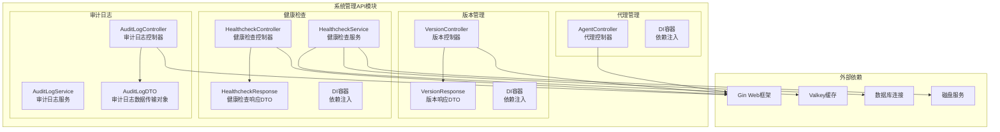
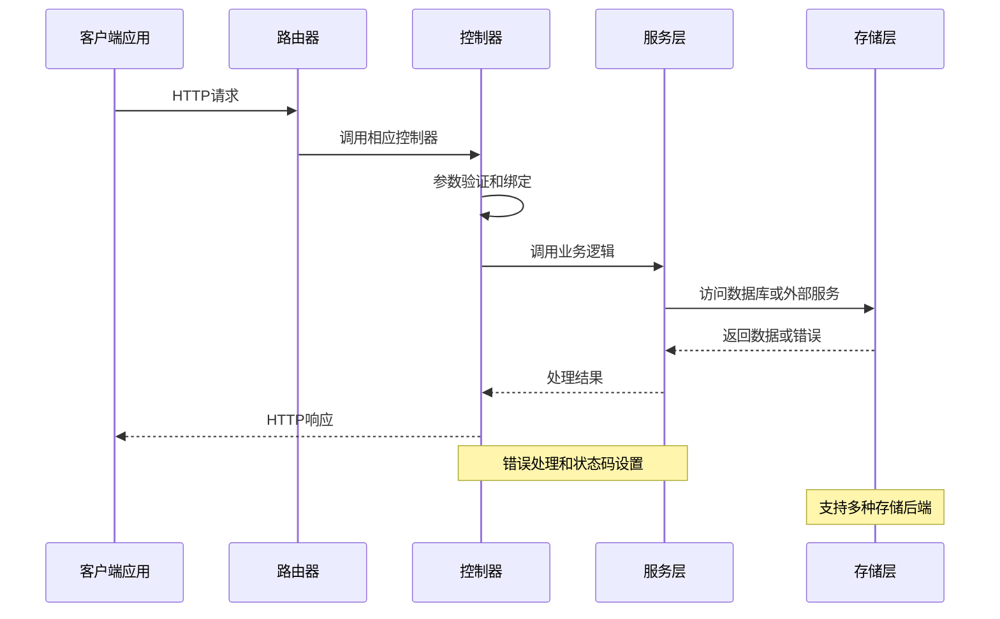
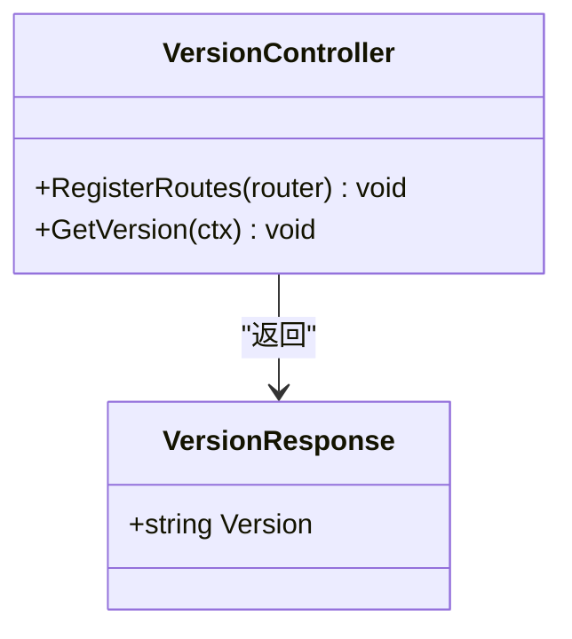
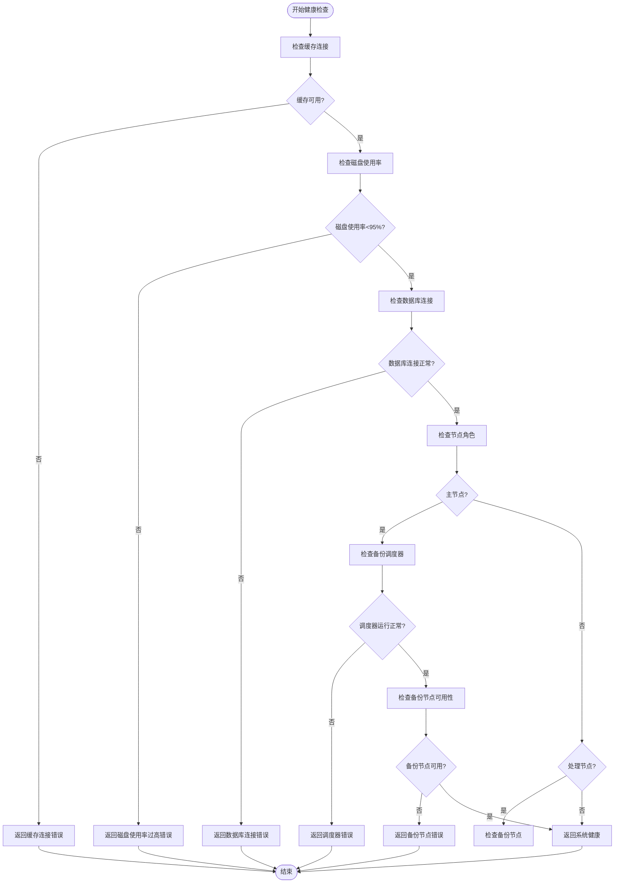
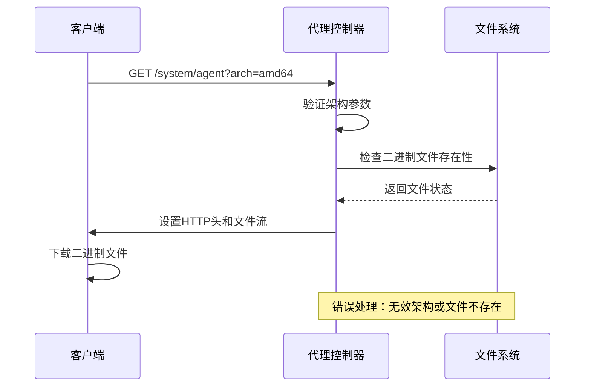
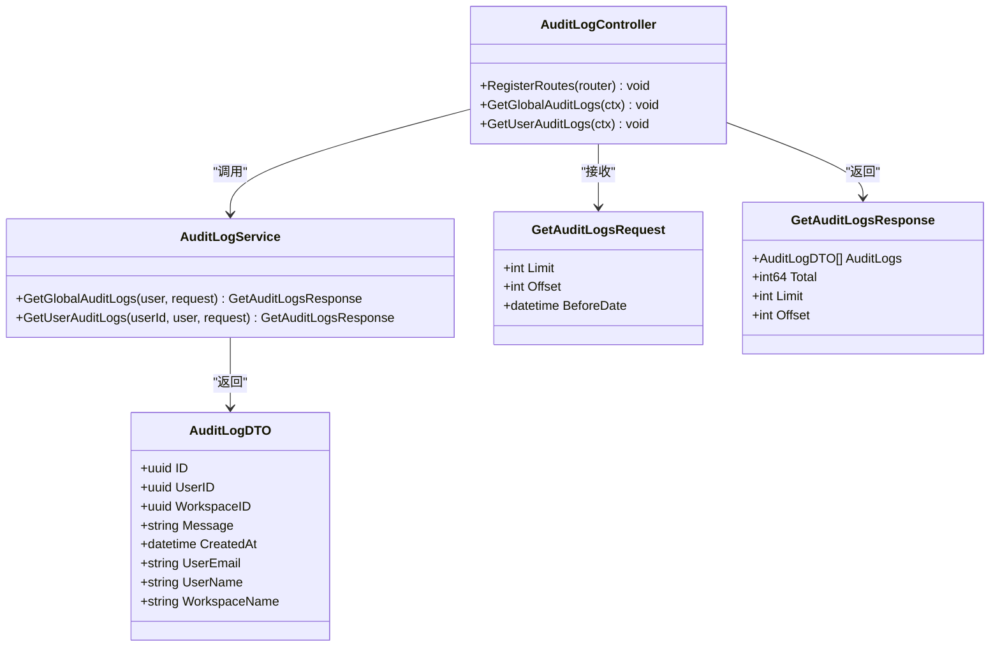
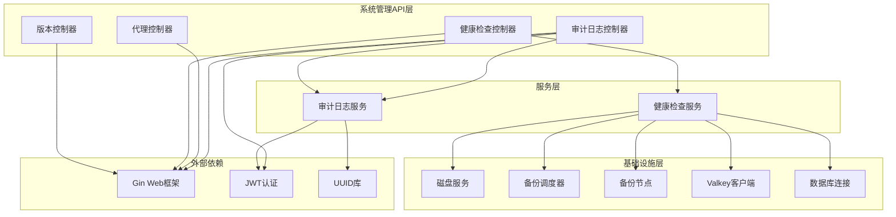

# 系统管理API

<cite>
**本文档引用的文件**
- [backend/internal/features/system/version/controller.go](file://backend/internal/features/system/version/controller.go)
- [backend/internal/features/system/version/dto.go](file://backend/internal/features/system/version/dto.go)
- [backend/internal/features/system/version/di.go](file://backend/internal/features/system/version/di.go)
- [backend/internal/features/system/healthcheck/controller.go](file://backend/internal/features/system/healthcheck/controller.go)
- [backend/internal/features/system/healthcheck/dto.go](file://backend/internal/features/system/healthcheck/dto.go)
- [backend/internal/features/system/healthcheck/service.go](file://backend/internal/features/system/healthcheck/service.go)
- [backend/internal/features/system/healthcheck/di.go](file://backend/internal/features/system/healthcheck/di.go)
- [backend/internal/features/system/agent/controller.go](file://backend/internal/features/system/agent/controller.go)
- [backend/internal/features/system/agent/di.go](file://backend/internal/features/system/agent/di.go)
- [backend/internal/features/audit_logs/controller.go](file://backend/internal/features/audit_logs/controller.go)
- [backend/internal/features/audit_logs/dto.go](file://backend/internal/features/audit_logs/dto.go)
</cite>

## 目录
1. [简介](#简介)
2. [项目结构](#项目结构)
3. [核心组件](#核心组件)
4. [架构概览](#架构概览)
5. [详细组件分析](#详细组件分析)
6. [依赖关系分析](#依赖关系分析)
7. [性能考虑](#性能考虑)
8. [故障排除指南](#故障排除指南)
9. [结论](#结论)

## 简介

系统管理API模块提供了数据库管理系统的核心运维接口，包括系统版本查询、健康检查、代理管理、审计日志等系统级功能。该模块采用Gin框架构建RESTful API，支持完整的系统监控、状态管理和维护操作。

本模块主要服务于系统管理员和运维人员，提供以下核心功能：
- 系统版本信息查询
- 健康状态检查
- 数据库代理下载
- 审计日志管理
- 系统状态监控
- 性能指标获取
- 日志查询和分析

## 项目结构

系统管理API模块位于后端服务的内部特性目录中，采用按功能分层的组织方式：

**图表来源**
- [backend/internal/features/system/version/controller.go:1-39](file://backend/internal/features/system/version/controller.go#L1-L39)
- [backend/internal/features/system/healthcheck/controller.go:1-52](file://backend/internal/features/system/healthcheck/controller.go#L1-L52)
- [backend/internal/features/system/agent/controller.go:1-49](file://backend/internal/features/system/agent/controller.go#L1-L49)
- [backend/internal/features/audit_logs/controller.go:1-113](file://backend/internal/features/audit_logs/controller.go#L1-L113)

**章节来源**
- [backend/internal/features/system/version/controller.go:1-39](file://backend/internal/features/system/version/controller.go#L1-L39)
- [backend/internal/features/system/healthcheck/controller.go:1-52](file://backend/internal/features/system/healthcheck/controller.go#L1-L52)
- [backend/internal/features/system/agent/controller.go:1-49](file://backend/internal/features/system/agent/controller.go#L1-L49)
- [backend/internal/features/audit_logs/controller.go:1-113](file://backend/internal/features/audit_logs/controller.go#L1-L113)

## 核心组件

系统管理API模块包含四个核心组件，每个组件负责特定的系统管理功能：

### 版本管理组件
- **VersionController**: 处理系统版本查询请求
- **VersionResponse**: 版本信息响应数据结构
- **依赖注入**: 提供版本控制器实例

### 健康检查组件
- **HealthcheckController**: 处理系统健康状态检查
- **HealthcheckService**: 执行综合健康检查逻辑
- **HealthcheckResponse**: 健康状态响应数据结构

### 代理管理组件
- **AgentController**: 处理数据库代理下载请求
- **架构支持**: 支持amd64和arm64架构
- **二进制分发**: 提供预编译的代理二进制文件

### 审计日志组件
- **AuditLogController**: 管理全局和用户审计日志
- **权限控制**: 支持管理员和用户级别的日志访问
- **分页查询**: 支持大规模审计日志的分页检索

**章节来源**
- [backend/internal/features/system/version/dto.go:1-6](file://backend/internal/features/system/version/dto.go#L1-L6)
- [backend/internal/features/system/healthcheck/dto.go:1-6](file://backend/internal/features/system/healthcheck/dto.go#L1-L6)
- [backend/internal/features/audit_logs/dto.go:1-32](file://backend/internal/features/audit_logs/dto.go#L1-L32)

## 架构概览

系统管理API采用分层架构设计，确保关注点分离和代码可维护性：

**图表来源**
- [backend/internal/features/system/version/controller.go:14-27](file://backend/internal/features/system/version/controller.go#L14-L27)
- [backend/internal/features/system/healthcheck/controller.go:25-51](file://backend/internal/features/system/healthcheck/controller.go#L25-L51)
- [backend/internal/features/system/agent/controller.go:27-48](file://backend/internal/features/system/agent/controller.go#L27-L48)

系统架构特点：
- **中间件集成**: 所有系统管理API都通过统一的认证中间件
- **CORS配置**: 健康检查端点支持跨域访问
- **错误处理**: 统一的错误响应格式
- **依赖注入**: 使用DI容器管理组件生命周期

## 详细组件分析

### 版本查询API

版本查询API提供系统当前版本信息的查询功能，支持环境变量配置和默认值回退机制。

#### API规范
- **端点**: `GET /system/version`
- **功能**: 返回当前应用程序版本
- **响应**: JSON格式的版本信息
- **默认版本**: 3.26.0（当环境变量未设置时）

#### 实现细节
版本控制器通过环境变量获取版本信息，如果环境变量为空则使用硬编码的默认版本。这种设计允许在不同部署环境中灵活配置版本信息。

**图表来源**
- [backend/internal/features/system/version/controller.go:12-27](file://backend/internal/features/system/version/controller.go#L12-L27)
- [backend/internal/features/system/version/dto.go:3-5](file://backend/internal/features/system/version/dto.go#L3-L5)

**章节来源**
- [backend/internal/features/system/version/controller.go:18-38](file://backend/internal/features/system/version/controller.go#L18-L38)
- [backend/internal/features/system/version/dto.go:1-6](file://backend/internal/features/system/version/dto.go#L1-L6)

### 健康检查API

健康检查API提供系统综合健康状态评估，包括数据库连接、磁盘使用率、缓存服务等多个维度的检查。

#### API规范
- **端点**: `GET /system/health`
- **功能**: 检查系统整体健康状态
- **响应**: JSON格式的健康状态信息
- **CORS支持**: 允许跨域访问，便于监控工具集成

#### 健康检查流程
系统健康检查执行以下步骤：

**图表来源**
- [backend/internal/features/system/healthcheck/service.go:25-68](file://backend/internal/features/system/healthcheck/service.go#L25-L68)

#### 健康检查服务实现
健康检查服务依赖多个系统组件进行综合评估：
- **Valkey缓存**: 验证缓存服务可用性
- **磁盘服务**: 检查磁盘使用率阈值
- **数据库连接**: 验证主数据库连接
- **备份服务**: 根据节点角色检查备份功能

**章节来源**
- [backend/internal/features/system/healthcheck/controller.go:17-51](file://backend/internal/features/system/healthcheck/controller.go#L17-L51)
- [backend/internal/features/system/healthcheck/service.go:21-68](file://backend/internal/features/system/healthcheck/service.go#L21-L68)
- [backend/internal/features/system/healthcheck/dto.go:1-6](file://backend/internal/features/system/healthcheck/dto.go#L1-L6)

### 代理管理API

代理管理API提供数据库代理程序的下载功能，支持多架构二进制文件分发。

#### API规范
- **端点**: `GET /system/agent`
- **功能**: 下载指定架构的数据库代理
- **参数**: 
  - `arch`: 目标架构 (amd64 或 arm64)
- **响应**: 二进制文件流

#### 支持的架构
- **amd64**: x86_64架构的Linux二进制文件
- **arm64**: ARM64架构的Linux二进制文件

#### 文件命名规则
二进制文件按照以下命名模式存储：
- `databasus-agent-linux-amd64`
- `databasus-agent-linux-arm64`

**图表来源**
- [backend/internal/features/system/agent/controller.go:27-48](file://backend/internal/features/system/agent/controller.go#L27-L48)

**章节来源**
- [backend/internal/features/system/agent/controller.go:17-48](file://backend/internal/features/system/agent/controller.go#L17-L48)

### 审计日志API

审计日志API提供系统操作记录的查询和管理功能，支持全局审计日志和用户特定审计日志的访问。

#### API规范
- **端点**: `GET /audit-logs/global`
- **端点**: `GET /audit-logs/users/{userId}`
- **功能**: 查询系统审计日志
- **认证**: 需要Bearer Token认证
- **权限**: 
  - 全局日志：仅管理员可访问
  - 用户日志：用户本人或管理员可访问

#### 查询参数
- **limit**: 结果数量限制，默认100
- **offset**: 分页偏移量，默认0
- **beforeDate**: 日期过滤器（RFC3339格式）

#### 审计日志数据模型
审计日志包含以下关键字段：
- **ID**: 唯一标识符
- **UserID**: 操作用户ID（可选）
- **WorkspaceID**: 工作空间ID（可选）
- **Message**: 操作描述
- **CreatedAt**: 创建时间
- **UserEmail**: 用户邮箱（可选）
- **UserName**: 用户名（可选）
- **WorkspaceName**: 工作空间名称（可选）

**图表来源**
- [backend/internal/features/audit_logs/controller.go:13-112](file://backend/internal/features/audit_logs/controller.go#L13-L112)
- [backend/internal/features/audit_logs/dto.go:9-31](file://backend/internal/features/audit_logs/dto.go#L9-L31)

**章节来源**
- [backend/internal/features/audit_logs/controller.go:25-112](file://backend/internal/features/audit_logs/controller.go#L25-L112)
- [backend/internal/features/audit_logs/dto.go:1-32](file://backend/internal/features/audit_logs/dto.go#L1-L32)

## 依赖关系分析

系统管理API模块的依赖关系体现了清晰的关注点分离和模块化设计：

**图表来源**
- [backend/internal/features/system/healthcheck/service.go:15-19](file://backend/internal/features/system/healthcheck/service.go#L15-L19)
- [backend/internal/features/audit_logs/controller.go:10-15](file://backend/internal/features/audit_logs/controller.go#L10-L15)

### 关键依赖说明

#### 健康检查依赖
- **Valkey缓存**: 用于检查缓存服务可用性
- **磁盘服务**: 获取磁盘使用情况
- **备份服务**: 根据节点角色检查备份功能
- **数据库连接**: 验证主数据库连通性

#### 审计日志依赖
- **JWT认证**: 确保API访问安全性
- **UUID库**: 处理用户和工作空间标识符
- **数据库ORM**: 提供数据持久化能力

**章节来源**
- [backend/internal/features/system/healthcheck/service.go:3-13](file://backend/internal/features/system/healthcheck/service.go#L3-L13)
- [backend/internal/features/audit_logs/controller.go:3-11](file://backend/internal/features/audit_logs/controller.go#L3-L11)

## 性能考虑

系统管理API在设计时充分考虑了性能优化和资源使用效率：

### 缓存策略
- **健康检查超时**: 使用2秒超时避免长时间阻塞
- **Valkey PING测试**: 快速检测缓存服务状态
- **磁盘使用率阈值**: 95%阈值防止磁盘满载影响系统性能

### 连接管理
- **上下文超时**: 健康检查使用独立的超时上下文
- **连接池复用**: 数据库连接采用连接池管理
- **异步操作**: 备份调度器和备份节点采用异步检查机制

### 资源优化
- **二进制文件压缩**: 代理二进制文件采用压缩存储
- **分页查询**: 审计日志支持分页避免大数据量查询
- **条件过滤**: 支持日期范围过滤减少数据传输

## 故障排除指南

### 常见问题诊断

#### 健康检查失败
**症状**: 健康检查返回503状态码
**可能原因**:
- 缓存服务不可用
- 磁盘使用率超过95%
- 数据库连接失败
- 备份服务异常

**解决方案**:
1. 检查Valkey服务状态
2. 清理磁盘空间
3. 验证数据库连接配置
4. 检查备份服务进程

#### 代理下载失败
**症状**: 代理下载返回404错误
**可能原因**:
- 架构参数不正确
- 二进制文件缺失
- 文件路径配置错误

**解决方案**:
1. 验证架构参数（amd64/arm64）
2. 检查agent-binaries目录
3. 确认文件权限设置

#### 审计日志访问受限
**症状**: 审计日志查询返回403错误
**可能原因**:
- 权限不足
- 用户ID格式错误
- 认证令牌过期

**解决方案**:
1. 确认用户具有管理员权限
2. 验证UUID格式正确性
3. 重新生成认证令牌

**章节来源**
- [backend/internal/features/system/healthcheck/controller.go:38-50](file://backend/internal/features/system/healthcheck/controller.go#L38-L50)
- [backend/internal/features/system/agent/controller.go:37-43](file://backend/internal/features/system/agent/controller.go#L37-L43)
- [backend/internal/features/audit_logs/controller.go:54-58](file://backend/internal/features/audit_logs/controller.go#L54-L58)

## 结论

系统管理API模块提供了全面的系统运维管理能力，涵盖了版本管理、健康监控、代理分发、审计日志等核心功能。模块采用清晰的分层架构设计，确保了良好的可维护性和扩展性。

### 主要优势
- **功能完整性**: 涵盖系统管理的所有关键方面
- **架构清晰**: 分层设计便于理解和维护
- **安全性**: 完整的认证授权机制
- **可扩展性**: 模块化设计支持功能扩展

### 技术特点
- **现代化框架**: 基于Gin框架构建高性能Web服务
- **依赖注入**: 使用DI容器管理组件生命周期
- **错误处理**: 统一的错误响应格式
- **监控友好**: 健康检查端点支持外部监控

该模块为数据库管理系统的日常运维提供了强有力的技术支撑，能够有效提升系统的可管理性和可靠性。