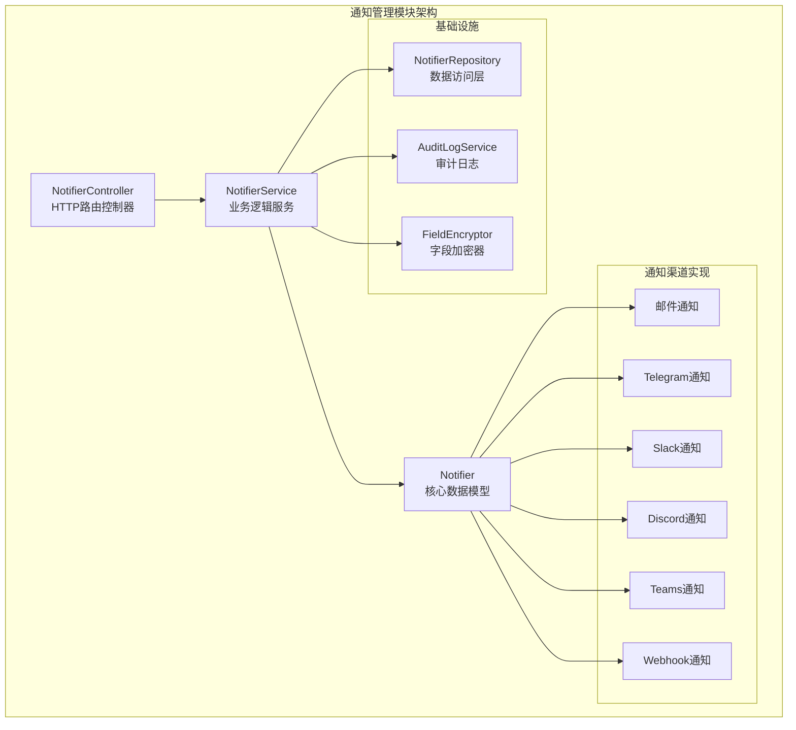
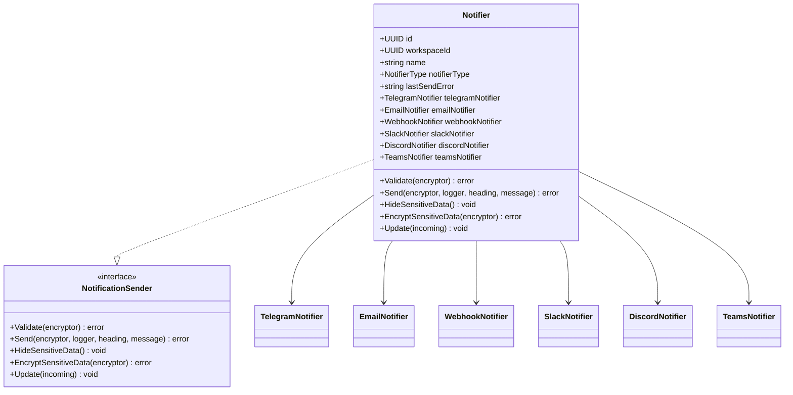
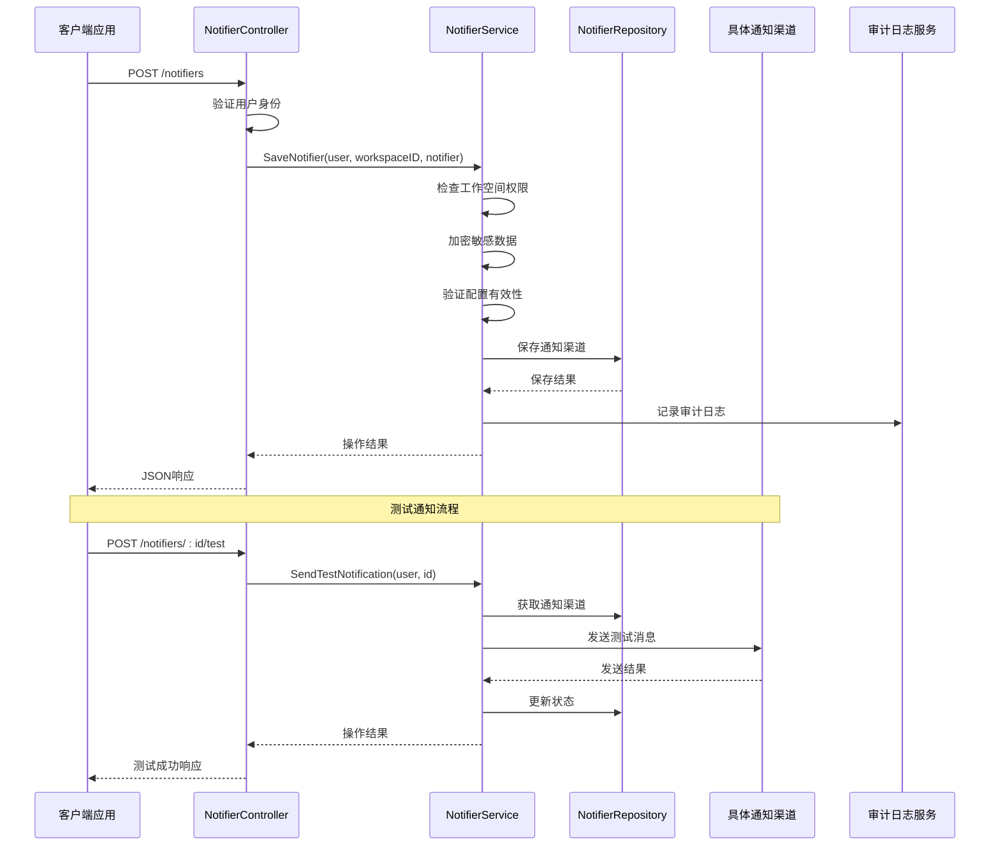
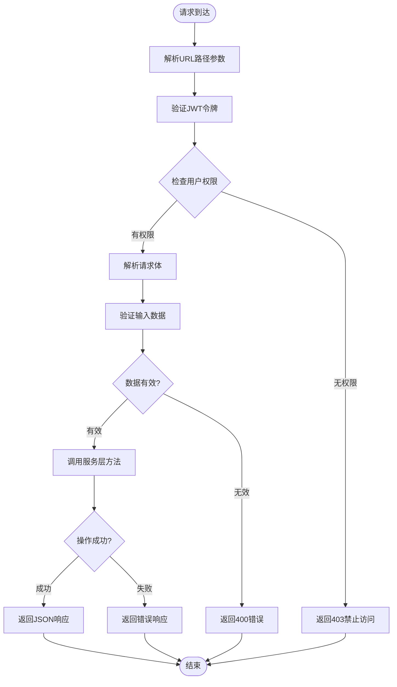
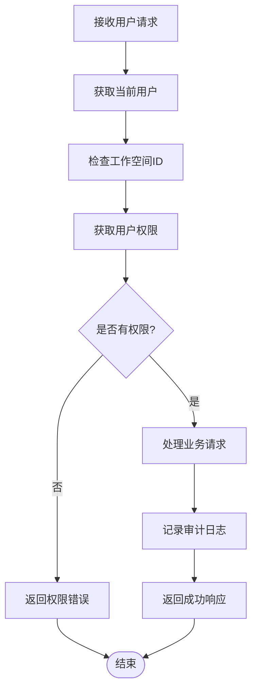
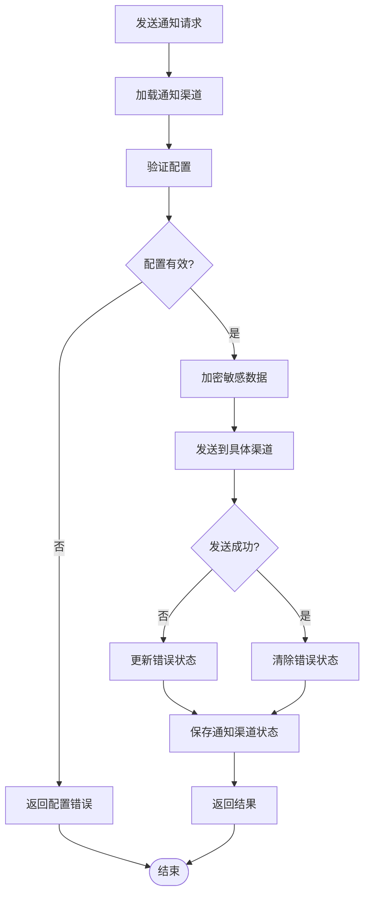
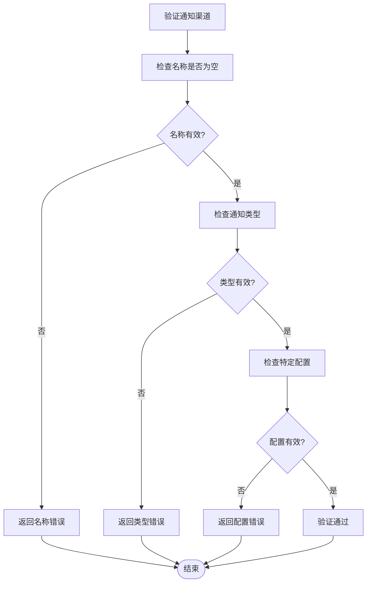
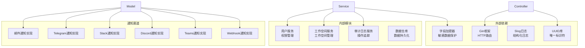

# 通知管理API

<cite>
**本文档引用的文件**
- [controller.go](file://backend/internal/features/notifiers/controller.go)
- [dto.go](file://backend/internal/features/notifiers/dto.go)
- [model.go](file://backend/internal/features/notifiers/model.go)
- [service.go](file://backend/internal/features/notifiers/service.go)
</cite>

## 目录
1. [简介](#简介)
2. [项目结构](#项目结构)
3. [核心组件](#核心组件)
4. [架构概览](#架构概览)
5. [详细组件分析](#详细组件分析)
6. [依赖关系分析](#依赖关系分析)
7. [性能考虑](#性能考虑)
8. [故障排除指南](#故障排除指南)
9. [结论](#结论)

## 简介

通知管理模块是数据库备份系统中的关键组件，负责管理各种通知渠道的配置和发送。该模块支持多种通知类型，包括邮件、Telegram、Slack、Discord、Teams和Webhook等，为用户提供灵活的告警和通知解决方案。

本模块提供了完整的REST API接口，允许用户创建、配置、测试和管理各种通知渠道。所有敏感信息（如API密钥、令牌等）都会被安全加密存储，并提供审计日志功能来跟踪所有通知操作。

## 项目结构

通知管理模块位于后端服务的`notifiers`包中，采用分层架构设计：

**图表来源**
- [controller.go:19-27](file://backend/internal/features/notifiers/controller.go#L19-L27)
- [service.go:15-22](file://backend/internal/features/notifiers/service.go#L15-L22)
- [model.go:18-32](file://backend/internal/features/notifiers/model.go#L18-L32)

**章节来源**
- [controller.go:19-27](file://backend/internal/features/notifiers/controller.go#L19-L27)
- [service.go:15-22](file://backend/internal/features/notifiers/service.go#L15-L22)
- [model.go:18-32](file://backend/internal/features/notifiers/model.go#L18-L32)

## 核心组件

### 主要API端点

通知管理模块提供以下核心API端点：

| 方法 | 路径 | 描述 | 权限要求 |
|------|------|------|----------|
| POST | `/notifiers` | 创建或更新通知渠道 | 管理权限 |
| GET | `/notifiers` | 获取工作空间内的所有通知渠道 | 查看权限 |
| GET | `/notifiers/:id` | 获取指定通知渠道详情 | 查看权限 |
| DELETE | `/notifiers/:id` | 删除通知渠道 | 管理权限 |
| POST | `/notifiers/:id/test` | 发送测试通知 | 测试权限 |
| POST | `/notifiers/:id/transfer` | 转移通知渠道到其他工作空间 | 管理权限 |
| POST | `/notifiers/direct-test` | 直接测试通知配置 | 测试权限 |

### 数据模型

通知管理的核心数据模型定义如下：

**图表来源**
- [model.go:18-122](file://backend/internal/features/notifiers/model.go#L18-L122)

**章节来源**
- [model.go:18-122](file://backend/internal/features/notifiers/model.go#L18-L122)

## 架构概览

通知管理模块采用清晰的分层架构，确保关注点分离和可维护性：

**图表来源**
- [controller.go:42-70](file://backend/internal/features/notifiers/controller.go#L42-L70)
- [service.go:30-113](file://backend/internal/features/notifiers/service.go#L30-L113)
- [service.go:209-237](file://backend/internal/features/notifiers/service.go#L209-L237)

## 详细组件分析

### 控制器层 (NotifierController)

控制器层负责处理HTTP请求和响应，提供RESTful API接口：

**图表来源**
- [controller.go:42-70](file://backend/internal/features/notifiers/controller.go#L42-L70)
- [controller.go:122-152](file://backend/internal/features/notifiers/controller.go#L122-L152)

### 服务层 (NotifierService)

服务层包含核心业务逻辑，处理复杂的业务规则和数据操作：

#### 权限管理流程

**图表来源**
- [service.go:30-113](file://backend/internal/features/notifiers/service.go#L30-L113)
- [service.go:156-175](file://backend/internal/features/notifiers/service.go#L156-L175)

#### 通知发送流程

**图表来源**
- [service.go:276-308](file://backend/internal/features/notifiers/service.go#L276-L308)

**章节来源**
- [controller.go:19-335](file://backend/internal/features/notifiers/controller.go#L19-L335)
- [service.go:15-396](file://backend/internal/features/notifiers/service.go#L15-L396)

### 数据模型层

通知管理模块支持多种通知渠道类型，每种渠道都有特定的配置要求：

#### 支持的通知渠道类型

| 渠道类型 | 功能特性 | 主要用途 |
|----------|----------|----------|
| 邮件通知 | SMTP配置、TLS/SSL支持、附件支持 | 邮件告警、报告发送 |
| Telegram | Bot令牌、聊天ID、Markdown格式 | 即时消息通知 |
| Slack | Webhook URL、频道配置、富文本支持 | 团队协作平台通知 |
| Discord | Webhook URL、嵌入消息、自定义头像 | 游戏社区、开发者社区 |
| Teams | Webhook URL、卡片模板、多格式支持 | 企业Microsoft 365集成 |
| Webhook | 自定义URL、请求头、请求体模板 | 第三方系统集成 |

#### 数据验证流程

**图表来源**
- [model.go:38-44](file://backend/internal/features/notifiers/model.go#L38-L44)

**章节来源**
- [model.go:18-122](file://backend/internal/features/notifiers/model.go#L18-L122)

## 依赖关系分析

通知管理模块的依赖关系清晰明确，遵循依赖倒置原则：

**图表来源**
- [controller.go:3-12](file://backend/internal/features/notifiers/controller.go#L3-L12)
- [service.go:3-13](file://backend/internal/features/notifiers/service.go#L3-L13)
- [model.go:3-16](file://backend/internal/features/notifiers/model.go#L3-L16)

**章节来源**
- [controller.go:3-12](file://backend/internal/features/notifiers/controller.go#L3-L12)
- [service.go:3-13](file://backend/internal/features/notifiers/service.go#L3-L13)
- [model.go:3-16](file://backend/internal/features/notifiers/model.go#L3-L16)

## 性能考虑

通知管理模块在设计时充分考虑了性能优化：

### 内存管理
- 使用延迟初始化避免不必要的内存分配
- 批量操作支持减少数据库往返次数
- 连接池管理优化数据库连接复用

### 缓存策略
- 工作空间权限缓存减少重复查询
- 最近使用通知渠道缓存提升响应速度
- 审计日志批量写入优化I/O性能

### 错误处理优化
- 异步错误处理避免阻塞主流程
- 重试机制处理临时性网络问题
- 超时控制防止资源泄露

## 故障排除指南

### 常见错误及解决方案

| 错误类型 | 错误代码 | 可能原因 | 解决方案 |
|----------|----------|----------|----------|
| 权限不足 | 403 | 用户无权访问或管理通知渠道 | 检查用户工作空间权限 |
| 数据验证失败 | 400 | 通知配置不完整或格式错误 | 验证所有必填字段 |
| 通知发送失败 | 500 | 第三方服务不可达或配置错误 | 检查网络连接和API密钥 |
| 资源不存在 | 404 | 通知渠道ID无效 | 验证通知渠道存在性 |

### 调试建议

1. **启用详细日志**：检查服务端日志获取详细错误信息
2. **测试连接**：使用测试接口验证配置正确性
3. **检查网络**：确认防火墙和代理设置
4. **验证凭据**：重新生成和验证API密钥

**章节来源**
- [controller.go:42-70](file://backend/internal/features/notifiers/controller.go#L42-L70)
- [service.go:209-237](file://backend/internal/features/notifiers/service.go#L209-L237)

## 结论

通知管理模块提供了完整、安全、可扩展的通知解决方案。通过清晰的API设计、强大的权限管理和完善的安全措施，该模块能够满足各种通知场景的需求。

模块的主要优势包括：
- 多渠道支持，适应不同使用场景
- 完善的权限控制和审计日志
- 安全的数据存储和传输
- 易于扩展的新渠道添加机制
- 友好的API设计和错误处理

未来可以考虑的功能增强包括：
- 更丰富的通知模板系统
- 批量通知发送功能
- 更细粒度的权限控制
- 通知统计和分析功能