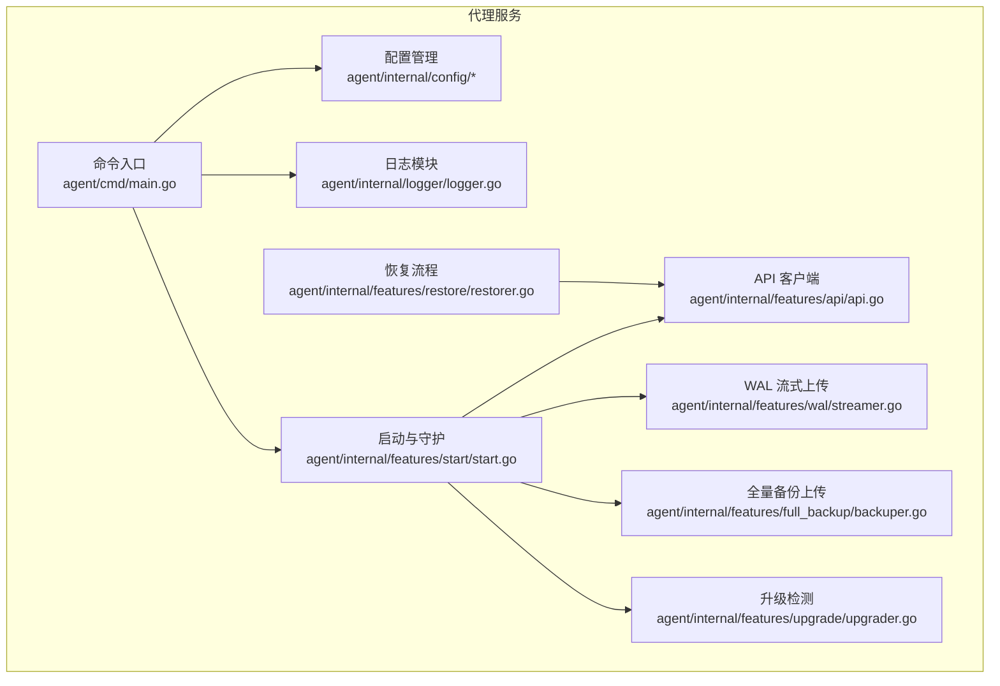
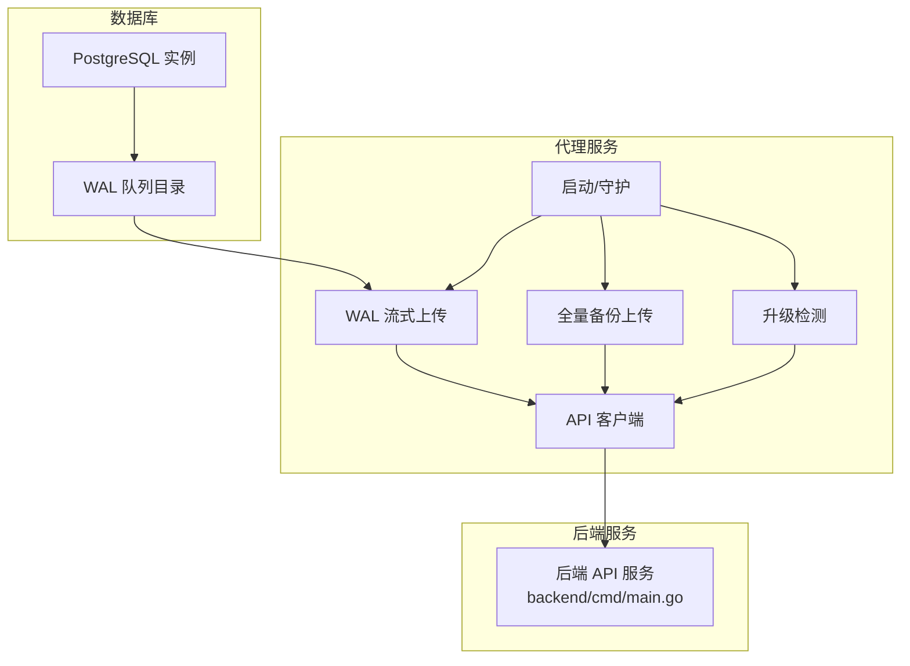
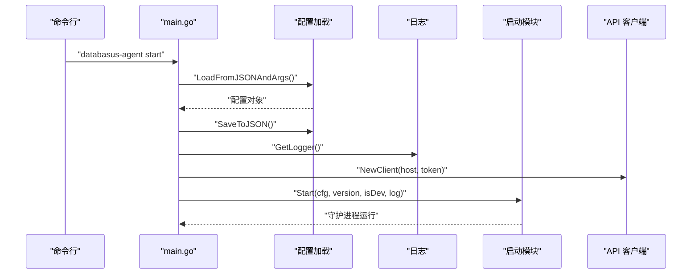
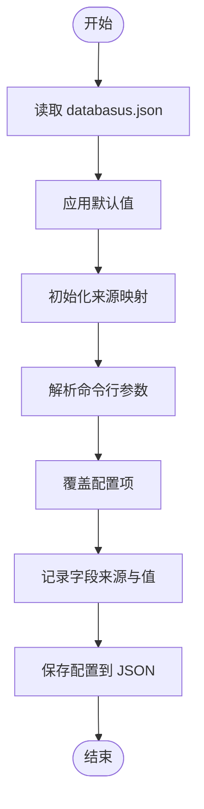
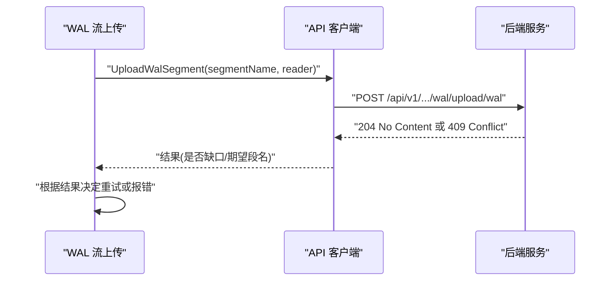
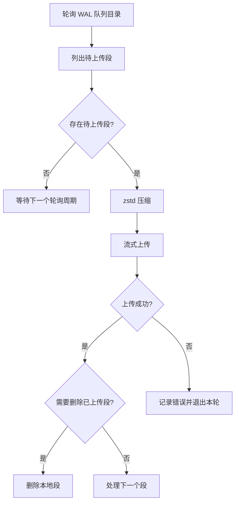
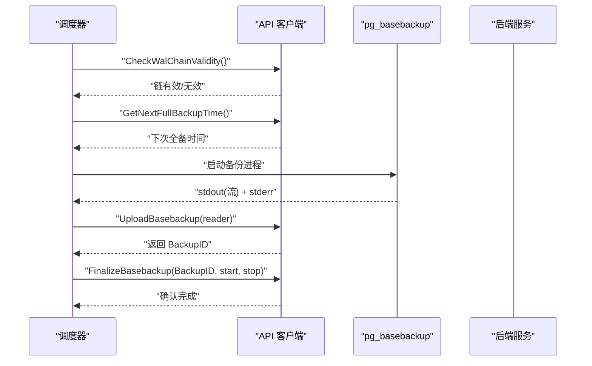
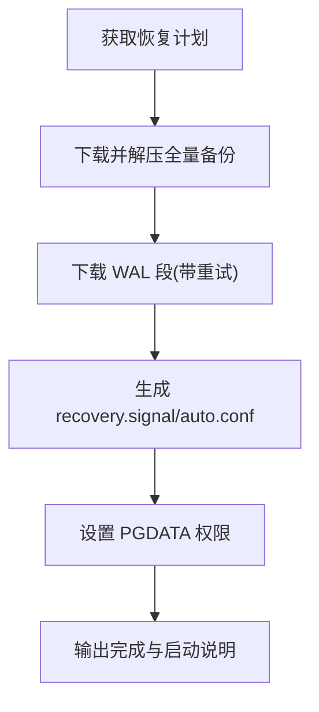
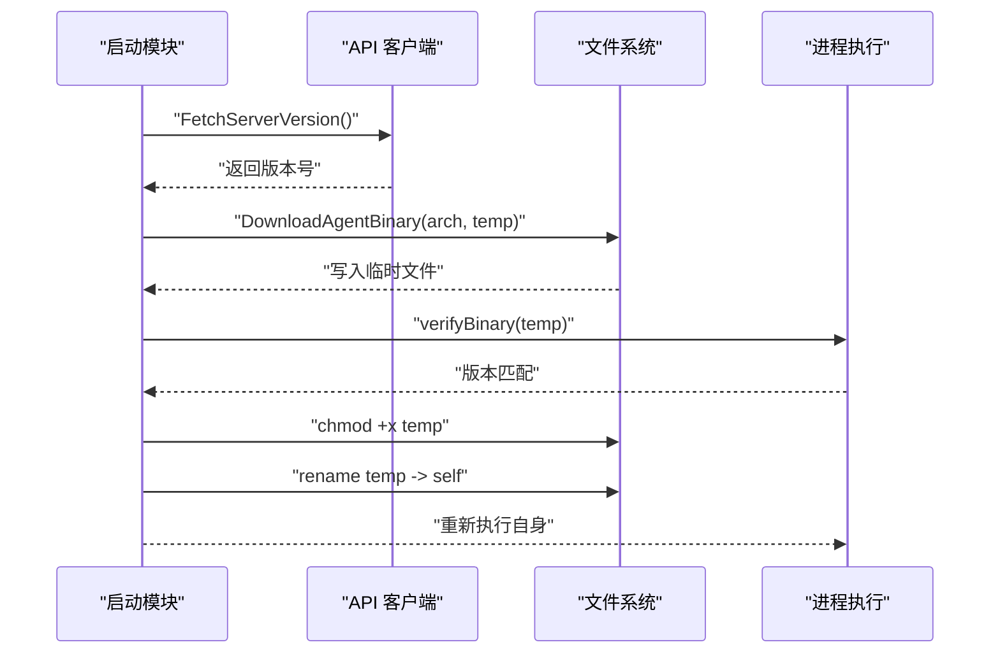
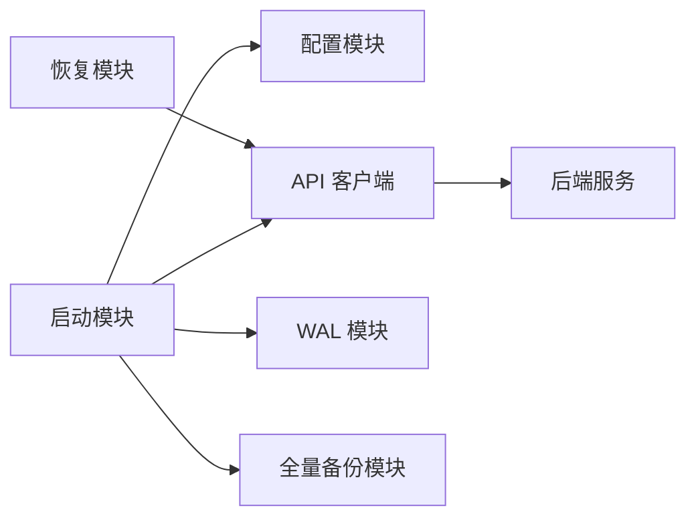

# 代理服务设计

<cite>
**本文档引用的文件**
- [agent/cmd/main.go](file://agent/cmd/main.go)
- [agent/internal/config/config.go](file://agent/internal/config/config.go)
- [agent/internal/config/dto.go](file://agent/internal/config/dto.go)
- [agent/internal/features/api/api.go](file://agent/internal/features/api/api.go)
- [agent/internal/features/start/start.go](file://agent/internal/features/start/start.go)
- [agent/internal/features/wal/streamer.go](file://agent/internal/features/wal/streamer.go)
- [agent/internal/features/full_backup/backuper.go](file://agent/internal/features/full_backup/backuper.go)
- [agent/internal/features/restore/restorer.go](file://agent/internal/features/restore/restorer.go)
- [agent/internal/features/upgrade/upgrader.go](file://agent/internal/features/upgrade/upgrader.go)
- [agent/internal/logger/logger.go](file://agent/internal/logger/logger.go)
- [agent/docker-compose.yml.example](file://agent/docker-compose.yml.example)
- [agent/e2e/Dockerfile.agent-runner](file://agent/e2e/Dockerfile.agent-runner)
- [backend/cmd/main.go](file://backend/cmd/main.go)
- [install-databasus.sh](file://install-databasus.sh)
- [README.md](file://README.md)
</cite>

## 目录
1. [简介](#简介)
2. [项目结构](#项目结构)
3. [核心组件](#核心组件)
4. [架构总览](#架构总览)
5. [详细组件分析](#详细组件分析)
6. [依赖关系分析](#依赖关系分析)
7. [性能考虑](#性能考虑)
8. [故障排除指南](#故障排除指南)
9. [结论](#结论)
10. [附录](#附录)

## 简介
本文件为 Databasus 代理服务（Agent）的架构设计文档，聚焦于轻量级 Go 实现、与数据库的直接通信、与后端 API 的协调机制、配置管理、通信协议、监控与日志、部署模式以及安装配置与故障排除。代理以“主机安装”和“Docker 容器化”两种方式运行，支持 PostgreSQL 主机直连与容器内直连两种模式，并通过 WAL 流式上传与全量备份上传实现物理备份与点时间恢复（PITR）能力。

## 项目结构
代理服务位于 agent 目录，采用分层与功能模块化组织：
- 命令入口：解析命令行参数与子命令，加载配置，启动守护进程或执行一次性任务（如恢复）
- 配置模块：从 JSON 文件与命令行参数加载配置，支持默认值与来源追踪
- 功能模块：API 客户端、WAL 流式上传、全量备份上传、恢复流程、升级检测
- 日志模块：结构化日志与轮转写入
- 集成测试与示例：提供 Docker 编排示例与端到端测试镜像

图表来源
- [agent/cmd/main.go:1-246](file://agent/cmd/main.go#L1-L246)
- [agent/internal/config/config.go:1-272](file://agent/internal/config/config.go#L1-L272)
- [agent/internal/logger/logger.go:1-116](file://agent/internal/logger/logger.go#L1-L116)
- [agent/internal/features/api/api.go:1-377](file://agent/internal/features/api/api.go#L1-L377)
- [agent/internal/features/start/start.go:1-326](file://agent/internal/features/start/start.go#L1-L326)
- [agent/internal/features/wal/streamer.go:1-205](file://agent/internal/features/wal/streamer.go#L1-L205)
- [agent/internal/features/full_backup/backuper.go:1-317](file://agent/internal/features/full_backup/backuper.go#L1-L317)
- [agent/internal/features/restore/restorer.go:1-445](file://agent/internal/features/restore/restorer.go#L1-L445)
- [agent/internal/features/upgrade/upgrader.go:1-90](file://agent/internal/features/upgrade/upgrader.go#L1-L90)

章节来源
- [agent/cmd/main.go:1-246](file://agent/cmd/main.go#L1-L246)
- [agent/internal/config/config.go:1-272](file://agent/internal/config/config.go#L1-L272)
- [agent/internal/logger/logger.go:1-116](file://agent/internal/logger/logger.go#L1-L116)
- [agent/internal/features/api/api.go:1-377](file://agent/internal/features/api/api.go#L1-L377)
- [agent/internal/features/start/start.go:1-326](file://agent/internal/features/start/start.go#L1-L326)
- [agent/internal/features/wal/streamer.go:1-205](file://agent/internal/features/wal/streamer.go#L1-L205)
- [agent/internal/features/full_backup/backuper.go:1-317](file://agent/internal/features/full_backup/backuper.go#L1-L317)
- [agent/internal/features/restore/restorer.go:1-445](file://agent/internal/features/restore/restorer.go#L1-L445)
- [agent/internal/features/upgrade/upgrader.go:1-90](file://agent/internal/features/upgrade/upgrader.go#L1-L90)

## 核心组件
- 命令入口与生命周期
  - 支持 start、stop、status、restore、version 等子命令
  - 启动时加载配置、保存配置、可选自动更新检查、进入守护进程
  - 恢复模式下直接下载备份并配置恢复信号文件
- 配置管理
  - 从 JSON 文件与命令行参数加载，支持默认值与来源追踪
  - 关键参数：后端地址、数据库标识、令牌、PostgreSQL 连接参数、类型（host/docker）、WAL 队列目录、是否删除已上传 WAL
- API 客户端
  - 提供 WAL 链有效性检查、下次全备时间查询、WAL 与全量备份上传、错误上报、恢复计划与下载、版本查询与二进制下载
  - 使用独立流式 HTTP 客户端进行大体积数据传输，避免内存缓冲
- WAL 流式上传
  - 轮询 WAL 队列目录，按名称排序逐段压缩上传；支持空闲超时读取器防止阻塞
- 全量备份上传
  - 周期性检查 WAL 链有效性与计划时间，触发 pg_basebackup 并将压缩输出流式上传；解析 stderr 获取起止 WAL 段并最终确认
- 恢复流程
  - 从服务器获取恢复计划，下载并解压全量备份，下载所需 WAL 段，生成 recovery.signal 与 postgresql.auto.conf，支持 PITR 时间点
- 升级检测
  - 检查服务器版本，下载新二进制并替换当前进程
- 日志模块
  - 结构化日志，带时间戳与级别过滤，文件轮转（5MB），多路输出至标准输出与文件

章节来源
- [agent/cmd/main.go:24-171](file://agent/cmd/main.go#L24-L171)
- [agent/internal/config/config.go:16-74](file://agent/internal/config/config.go#L16-L74)
- [agent/internal/config/config.go:103-115](file://agent/internal/config/config.go#L103-L115)
- [agent/internal/features/api/api.go:34-70](file://agent/internal/features/api/api.go#L34-L70)
- [agent/internal/features/wal/streamer.go:30-61](file://agent/internal/features/wal/streamer.go#L30-L61)
- [agent/internal/features/full_backup/backuper.go:46-83](file://agent/internal/features/full_backup/backuper.go#L46-L83)
- [agent/internal/features/restore/restorer.go:31-102](file://agent/internal/features/restore/restorer.go#L31-L102)
- [agent/internal/features/upgrade/upgrader.go:15-73](file://agent/internal/features/upgrade/upgrader.go#L15-L73)
- [agent/internal/logger/logger.go:18-115](file://agent/internal/logger/logger.go#L18-L115)

## 架构总览
代理服务在主机或容器中运行，负责：
- 与数据库建立连接（主机直连或容器内直连）
- 通过 WAL 队列目录持续上传 WAL 段
- 在 WAL 链断裂或到达计划时间时触发全量备份
- 与后端 API 协作完成备份元数据、恢复计划与二进制升级

图表来源
- [agent/internal/features/start/start.go:60-101](file://agent/internal/features/start/start.go#L60-L101)
- [agent/internal/features/wal/streamer.go:44-61](file://agent/internal/features/wal/streamer.go#L44-L61)
- [agent/internal/features/full_backup/backuper.go:66-83](file://agent/internal/features/full_backup/backuper.go#L66-L83)
- [agent/internal/features/api/api.go:17-32](file://agent/internal/features/api/api.go#L17-L32)
- [backend/cmd/main.go:213-257](file://backend/cmd/main.go#L213-L257)

## 详细组件分析

### 命令入口与生命周期
- 子命令解析与执行
  - start：加载配置、保存 JSON、可选跳过更新、启动守护进程
  - _run：内部守护进程模式，获取锁、启动后台升级器、启动全量备份与 WAL 流上传
  - stop/status：停止与查询状态
  - restore：校验参数、构建 API 客户端、执行恢复流程
  - version：打印版本
- 自动更新检查
  - 若未跳过且后端地址有效，则检查服务器版本并下载新二进制，必要时重新执行自身

图表来源
- [agent/cmd/main.go:50-97](file://agent/cmd/main.go#L50-L97)
- [agent/internal/features/start/start.go:33-58](file://agent/internal/features/start/start.go#L33-L58)
- [agent/internal/features/api/api.go:44-70](file://agent/internal/features/api/api.go#L44-L70)

章节来源
- [agent/cmd/main.go:24-171](file://agent/cmd/main.go#L24-L171)
- [agent/cmd/main.go:173-193](file://agent/cmd/main.go#L173-L193)
- [agent/internal/features/start/start.go:33-101](file://agent/internal/features/start/start.go#L33-L101)

### 配置管理
- 数据结构
  - 包含后端地址、数据库 ID、令牌、PostgreSQL 主机/端口/用户/密码、类型（host/docker）、主机客户端路径、容器名、WAL 队列目录、上传后删除 WAL 的开关等
- 加载策略
  - 优先从 JSON 文件加载，应用默认值，再用命令行参数覆盖
  - 记录每个字段的来源（JSON 或命令行），便于调试与审计
- 敏感信息掩码
  - 日志输出时对令牌与密码进行掩码处理

图表来源
- [agent/internal/config/config.go:35-64](file://agent/internal/config/config.go#L35-L64)
- [agent/internal/config/config.go:103-177](file://agent/internal/config/config.go#L103-L177)
- [agent/internal/config/config.go:179-234](file://agent/internal/config/config.go#L179-L234)
- [agent/internal/config/config.go:236-271](file://agent/internal/config/config.go#L236-L271)

章节来源
- [agent/internal/config/config.go:16-31](file://agent/internal/config/config.go#L16-L31)
- [agent/internal/config/config.go:35-74](file://agent/internal/config/config.go#L35-L74)
- [agent/internal/config/dto.go:3-17](file://agent/internal/config/dto.go#L3-L17)

### API 客户端与通信协议
- 接口定义
  - WAL 链有效性检查、下次全备时间、WAL 段上传、全量备份开始/结束、错误上报、恢复计划与下载、版本查询与二进制下载
- 传输特性
  - JSON 请求使用 resty 客户端，具备超时、重试与条件判断
  - 大体积数据（WAL/全量备份）使用独立 http.Client，设置 Authorization 头，避免内存缓冲
- 错误处理
  - 对非 2xx 响应返回错误；WAL 上传遇到冲突时解析期望段名与接收段名，用于检测链路缺口

图表来源
- [agent/internal/features/api/api.go:200-242](file://agent/internal/features/api/api.go#L200-L242)
- [agent/internal/features/wal/streamer.go:123-173](file://agent/internal/features/wal/streamer.go#L123-L173)

章节来源
- [agent/internal/features/api/api.go:17-32](file://agent/internal/features/api/api.go#L17-L32)
- [agent/internal/features/api/api.go:34-70](file://agent/internal/features/api/api.go#L34-L70)
- [agent/internal/features/api/api.go:364-376](file://agent/internal/features/api/api.go#L364-L376)

### WAL 流式上传
- 工作流程
  - 定期轮询 WAL 队列目录，按名称排序逐段处理
  - 使用 zstd 压缩，通过管道流式上传，设置空闲超时读取器防止长时间无数据导致阻塞
  - 成功后可选择删除本地已上传的 WAL 段
- 性能与可靠性
  - 分段压缩与流式传输降低内存占用
  - 空闲超时避免长时间阻塞，结合错误返回进行重试或告警

图表来源
- [agent/internal/features/wal/streamer.go:63-90](file://agent/internal/features/wal/streamer.go#L63-L90)
- [agent/internal/features/wal/streamer.go:123-173](file://agent/internal/features/wal/streamer.go#L123-L173)

章节来源
- [agent/internal/features/wal/streamer.go:21-26](file://agent/internal/features/wal/streamer.go#L21-L26)
- [agent/internal/features/wal/streamer.go:44-61](file://agent/internal/features/wal/streamer.go#L44-L61)
- [agent/internal/features/wal/streamer.go:175-205](file://agent/internal/features/wal/streamer.go#L175-L205)

### 全量备份上传
- 触发条件
  - WAL 链无效或到达计划的全量备份时间
- 执行流程
  - 调用 pg_basebackup（主机或容器内），将 tar 输出通过 zstd 压缩并流式上传
  - 解析 stderr 获取起止 WAL 段，最终确认备份
  - 失败时上报错误并按指数退避重试
- 并发控制
  - 使用原子布尔量确保同一时刻仅有一个全量备份在运行

图表来源
- [agent/internal/features/full_backup/backuper.go:85-124](file://agent/internal/features/full_backup/backuper.go#L85-L124)
- [agent/internal/features/full_backup/backuper.go:164-245](file://agent/internal/features/full_backup/backuper.go#L164-L245)
- [agent/internal/features/full_backup/backuper.go:277-316](file://agent/internal/features/full_backup/backuper.go#L277-L316)

章节来源
- [agent/internal/features/full_backup/backuper.go:21-42](file://agent/internal/features/full_backup/backuper.go#L21-L42)
- [agent/internal/features/full_backup/backuper.go:66-83](file://agent/internal/features/full_backup/backuper.go#L66-L83)
- [agent/internal/features/full_backup/backuper.go:164-245](file://agent/internal/features/full_backup/backuper.go#L164-L245)

### 恢复流程
- 步骤
  - 从服务器获取恢复计划（全量备份 ID、WAL 列表、大小统计）
  - 下载并解压全量备份，下载所需 WAL 段
  - 写入 recovery.signal 与 postgresql.auto.conf，配置 restore_command、recovery_end_command、recovery_target_time（可选）
  - 设置目标 PGDATA 权限，输出完成提示与启动建议
- 错误处理
  - 对下载失败进行重试，支持指数退避
  - 对路径遍历攻击进行防护（仅允许相对路径）

图表来源
- [agent/internal/features/restore/restorer.go:58-102](file://agent/internal/features/restore/restorer.go#L58-L102)
- [agent/internal/features/restore/restorer.go:165-181](file://agent/internal/features/restore/restorer.go#L165-L181)
- [agent/internal/features/restore/restorer.go:245-258](file://agent/internal/features/restore/restorer.go#L245-L258)
- [agent/internal/features/restore/restorer.go:329-363](file://agent/internal/features/restore/restorer.go#L329-L363)

章节来源
- [agent/internal/features/restore/restorer.go:20-30](file://agent/internal/features/restore/restorer.go#L20-L30)
- [agent/internal/features/restore/restorer.go:130-146](file://agent/internal/features/restore/restorer.go#L130-L146)
- [agent/internal/features/restore/restorer.go:260-299](file://agent/internal/features/restore/restorer.go#L260-L299)

### 升级检测
- 流程
  - 开发模式跳过检查；否则拉取服务器版本，若不一致则下载对应架构的二进制，验证版本后替换当前进程
- 重启策略
  - 返回“需重启”信号，由上层逻辑重新执行自身

图表来源
- [agent/internal/features/upgrade/upgrader.go:18-73](file://agent/internal/features/upgrade/upgrader.go#L18-L73)
- [agent/cmd/main.go:232-245](file://agent/cmd/main.go#L232-L245)

章节来源
- [agent/internal/features/upgrade/upgrader.go:15-90](file://agent/internal/features/upgrade/upgrader.go#L15-L90)
- [agent/cmd/main.go:173-193](file://agent/cmd/main.go#L173-L193)

### 日志与监控
- 日志
  - 使用 slog，统一时间格式与级别过滤，禁用级别字段，保留时间字段
  - 文件轮转：单文件最大 5MB，旧日志文件名 .old，多路输出至 stdout 与文件
- 监控
  - 后端服务提供健康检查与版本接口，代理侧通过 API 客户端进行可用性与版本校验
  - 建议在生产环境启用外部日志收集（如 VictoriaLogs Writer）并在后端统一采集

章节来源
- [agent/internal/logger/logger.go:76-92](file://agent/internal/logger/logger.go#L76-L92)
- [agent/internal/logger/logger.go:94-115](file://agent/internal/logger/logger.go#L94-L115)
- [backend/cmd/main.go:213-257](file://backend/cmd/main.go#L213-L257)

## 依赖关系分析
- 组件耦合
  - 启动模块依赖配置、API 客户端、WAL 与全量备份模块
  - API 客户端与后端服务通过 HTTP 接口交互，采用 JSON 与流式传输
  - 恢复模块依赖 API 客户端与文件系统操作
- 外部依赖
  - PostgreSQL 客户端工具（pg_basebackup、pgx 连接库）
  - Docker 命令（容器模式）
  - zstd 压缩库
- 循环依赖
  - 未发现循环依赖，模块职责清晰

图表来源
- [agent/internal/features/start/start.go:76-88](file://agent/internal/features/start/start.go#L76-L88)
- [agent/internal/features/api/api.go:34-70](file://agent/internal/features/api/api.go#L34-L70)
- [agent/internal/features/restore/restorer.go:31-56](file://agent/internal/features/restore/restorer.go#L31-L56)
- [backend/cmd/main.go:213-257](file://backend/cmd/main.go#L213-L257)

章节来源
- [agent/internal/features/start/start.go:33-101](file://agent/internal/features/start/start.go#L33-L101)
- [agent/internal/features/api/api.go:17-32](file://agent/internal/features/api/api.go#L17-L32)
- [agent/internal/features/restore/restorer.go:31-56](file://agent/internal/features/restore/restorer.go#L31-L56)

## 性能考虑
- 压缩与传输
  - 使用 zstd 压缩，平衡压缩比与 CPU 开销；流式传输避免内存峰值
- 超时与重试
  - API 调用设置超时与重试；WAL 上传设置空闲超时，防止长时间阻塞
- 并发与节流
  - 全量备份并发控制（原子布尔量），避免重复执行
  - 恢复下载采用指数退避重试，降低瞬时压力
- 数据库连接
  - 使用只读连接与最小权限原则，避免写操作影响业务

## 故障排除指南
- 启动失败
  - 检查配置文件与命令行参数来源，确认必填项（后端地址、数据库 ID、令牌、PostgreSQL 参数）
  - 查看日志文件轮转与输出，定位具体错误
- WAL 上传失败
  - 检查 WAL 队列目录权限与磁盘空间
  - 关注 409 冲突响应，确认期望段名与链路缺口
- 全量备份失败
  - 查看 pg_basebackup stderr 输出，确认 WAL 段解析与最终确认阶段错误
  - 检查数据库连接与版本要求（最低主版本）
- 恢复失败
  - 确认目标 PGDATA 目录为空且可写
  - 检查恢复计划中的 WAL 段是否完整下载
  - 核对 postgresql.auto.conf 中路径与权限
- 升级失败
  - 确认服务器可达与二进制下载成功
  - 验证新二进制版本号与预期一致

章节来源
- [agent/internal/config/config.go:103-141](file://agent/internal/config/config.go#L103-L141)
- [agent/internal/features/wal/streamer.go:142-173](file://agent/internal/features/wal/streamer.go#L142-L173)
- [agent/internal/features/full_backup/backuper.go:133-162](file://agent/internal/features/full_backup/backuper.go#L133-L162)
- [agent/internal/features/restore/restorer.go:104-128](file://agent/internal/features/restore/restorer.go#L104-L128)
- [agent/internal/features/upgrade/upgrader.go:54-73](file://agent/internal/features/upgrade/upgrader.go#L54-L73)

## 结论
Databasus 代理服务以轻量 Go 实现为核心，围绕 WAL 流式上传与全量备份上传构建高可靠备份链路，配合恢复流程与自动升级机制，满足生产环境对低侵入、高性能与易运维的需求。通过清晰的模块划分与严格的错误处理，代理可在主机与容器环境中稳定运行，并与后端 API 协同实现完整的备份与恢复闭环。

## 附录
- 部署模式
  - 主机安装：直接运行二进制，配置 WAL 队列目录与 PostgreSQL 连接参数
  - Docker 容器化：使用官方镜像或自建镜像，挂载数据卷与 WAL 目录
  - Kubernetes：通过 Helm Chart 部署，支持 ClusterIP/LoadBalancer/Ingress
- 安装脚本
  - 自动安装 Docker 与 Compose，创建 docker-compose.yml 并启动服务
- 示例编排
  - 提供开发用 Postgres 与 WAL 生成器示例，便于端到端测试

章节来源
- [install-databasus.sh:1-141](file://install-databasus.sh#L1-L141)
- [agent/docker-compose.yml.example:1-59](file://agent/docker-compose.yml.example#L1-L59)
- [agent/e2e/Dockerfile.agent-runner:1-15](file://agent/e2e/Dockerfile.agent-runner#L1-L15)
- [README.md:124-222](file://README.md#L124-L222)