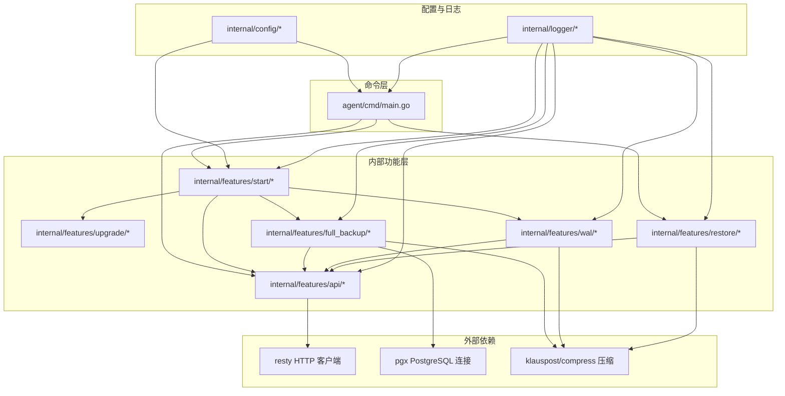
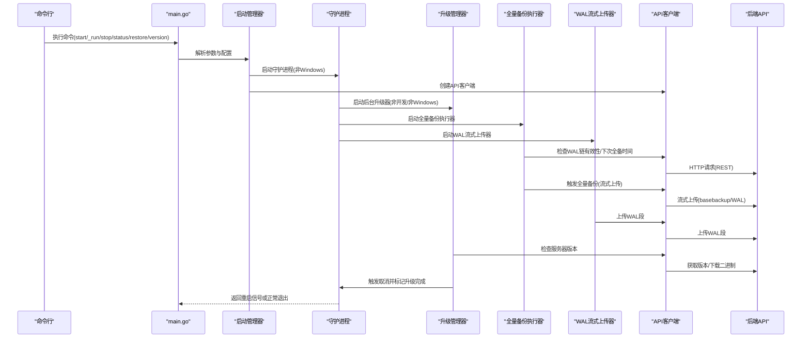
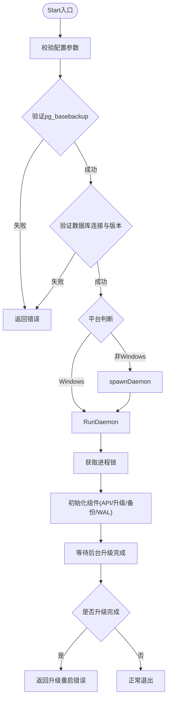
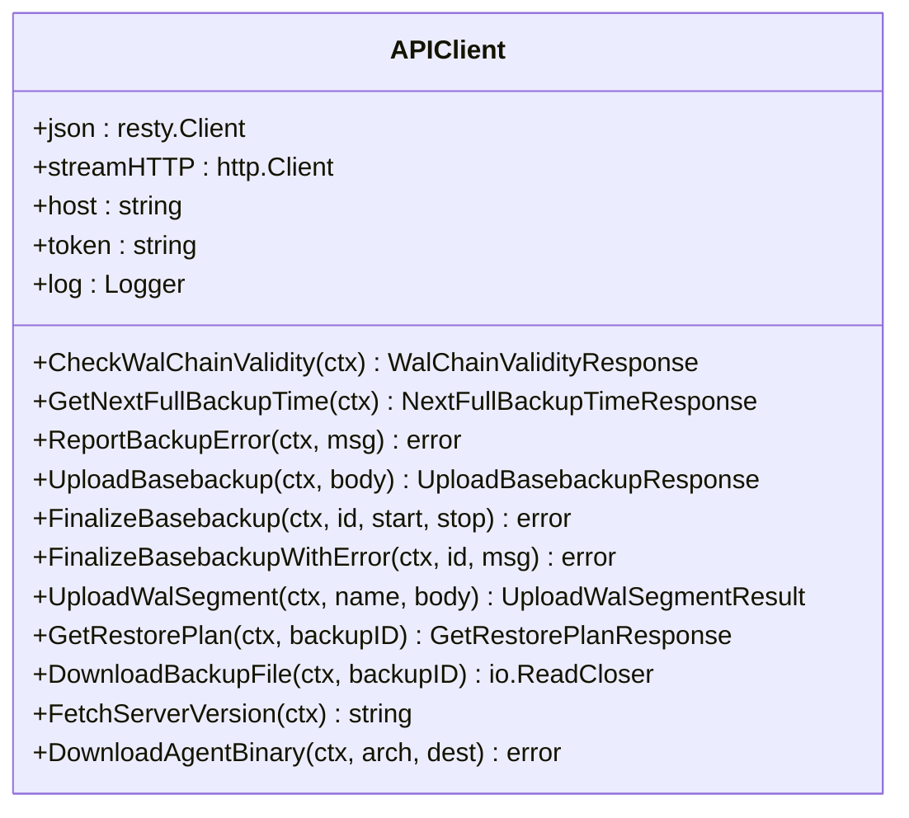
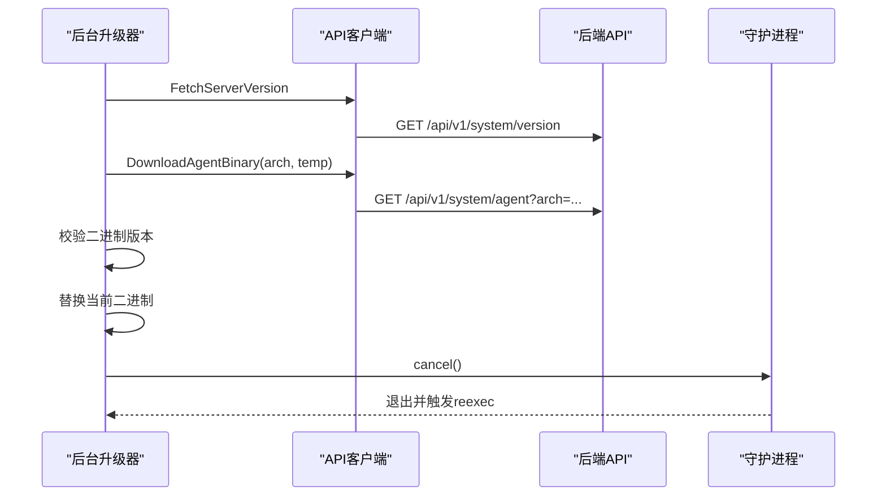
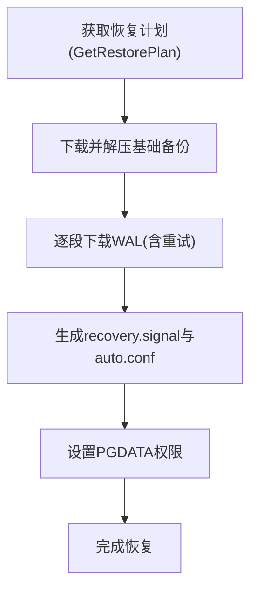
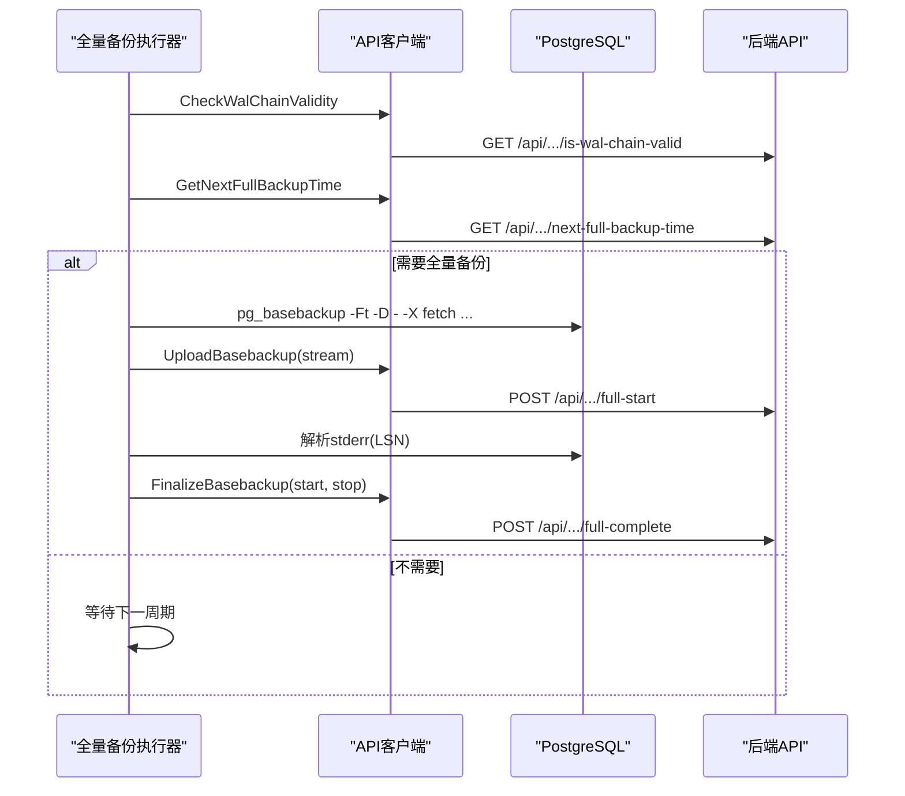
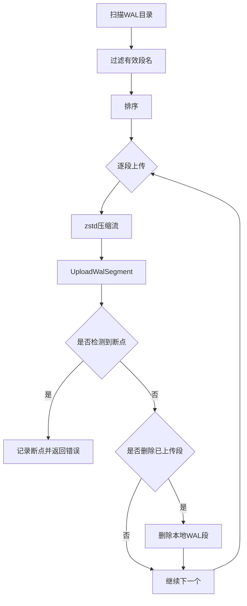
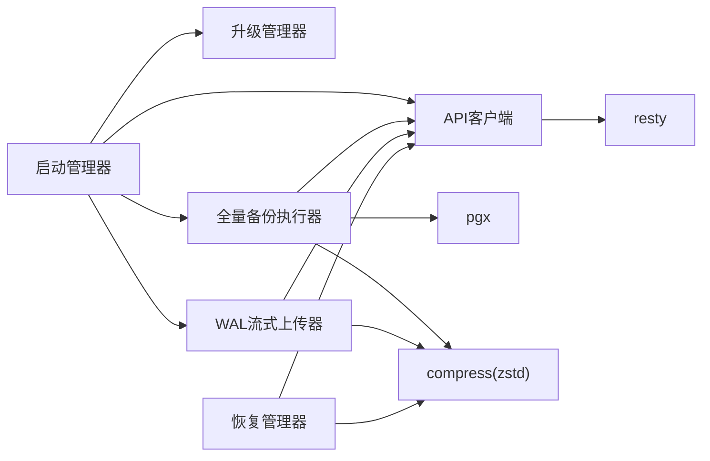

# 代理架构设计

<cite>
**本文档引用的文件**
- [main.go](file://agent/cmd/main.go)
- [config.go](file://agent/internal/config/config.go)
- [dto.go](file://agent/internal/config/dto.go)
- [start.go](file://agent/internal/features/start/start.go)
- [daemon.go](file://agent/internal/features/start/daemon.go)
- [lock.go](file://agent/internal/features/start/lock.go)
- [api.go](file://agent/internal/features/api/api.go)
- [dto.go](file://agent/internal/features/api/dto.go)
- [idle_timeout_reader.go](file://agent/internal/features/api/idle_timeout_reader.go)
- [upgrader.go](file://agent/internal/features/upgrade/upgrader.go)
- [background_upgrader.go](file://agent/internal/features/upgrade/background_upgrader.go)
- [restorer.go](file://agent/internal/features/restore/restorer.go)
- [backuper.go](file://agent/internal/features/full_backup/backuper.go)
- [stderr_parser.go](file://agent/internal/features/full_backup/stderr_parser.go)
- [streamer.go](file://agent/internal/features/wal/streamer.go)
- [logger.go](file://agent/internal/logger/logger.go)
- [go.mod](file://agent/go.mod)
</cite>

## 目录
1. [引言](#引言)
2. [项目结构](#项目结构)
3. [核心组件](#核心组件)
4. [架构总览](#架构总览)
5. [详细组件分析](#详细组件分析)
6. [依赖关系分析](#依赖关系分析)
7. [性能考量](#性能考量)
8. [故障排查指南](#故障排查指南)
9. [结论](#结论)

## 引言
本文件面向Databasus代理（Agent）的架构设计与实现，聚焦于其轻量级Go语言实现、进程管理模式与守护进程机制，系统化阐述代理的核心组件（启动管理器、API客户端、升级管理器、恢复管理器）、生命周期管理（启动、停止、状态查询、自动重启）、与后端API的交互模式（HTTP通信、认证机制、错误重试策略），以及进程隔离与资源管理（内存限制、CPU亲和性、文件描述符管理）。同时提供扩展性与性能优化建议，帮助读者快速理解并安全地部署与运维该代理。

## 项目结构
代理模块采用按功能域分层的组织方式：命令入口位于cmd目录，核心业务逻辑分布在internal/features下，配置与日志分别在internal/config与internal/logger中。整体结构清晰、职责分离明确，便于维护与扩展。

**图表来源**
- [main.go:1-246](file://agent/cmd/main.go#L1-L246)
- [config.go:1-272](file://agent/internal/config/config.go#L1-L272)
- [start.go:1-326](file://agent/internal/features/start/start.go#L1-L326)
- [api.go:1-377](file://agent/internal/features/api/api.go#L1-L377)
- [upgrader.go:1-90](file://agent/internal/features/upgrade/upgrader.go#L1-L90)
- [background_upgrader.go:1-89](file://agent/internal/features/upgrade/background_upgrader.go#L1-L89)
- [backuper.go:1-317](file://agent/internal/features/full_backup/backuper.go#L1-L317)
- [streamer.go:1-205](file://agent/internal/features/wal/streamer.go#L1-L205)
- [restorer.go:1-445](file://agent/internal/features/restore/restorer.go#L1-L445)
- [logger.go:1-116](file://agent/internal/logger/logger.go#L1-L116)
- [go.mod:1-23](file://agent/go.mod#L1-L23)

**章节来源**
- [main.go:1-246](file://agent/cmd/main.go#L1-L246)
- [config.go:1-272](file://agent/internal/config/config.go#L1-L272)
- [go.mod:1-23](file://agent/go.mod#L1-L23)

## 核心组件
- 启动管理器：负责参数解析、配置加载、前置校验（PostgreSQL连接与版本、pg_basebackup可用性）、守护进程启动与信号处理、后台升级器集成。
- API客户端：封装REST与流式上传/下载的HTTP调用，统一鉴权头、超时与重试策略，支持WAL链有效性检查、全量备份触发与完成上报、增量WAL上传、恢复计划获取与文件下载、版本查询与二进制下载。
- 升级管理器：在开发模式外进行版本检查与二进制替换，支持后台轮询升级并在升级完成后触发优雅退出与进程自重启。
- 恢复管理器：根据后端提供的恢复计划下载基础备份与WAL段，解压到目标PGDATA目录，生成recovery.signal与postgresql.auto.conf，支持PITR时间点恢复。
- 全量备份执行器：周期性检查WAL链有效性与下次全备时间，必要时调用pg_basebackup进行压缩流式上传，解析LSN并上报起止WAL段，失败时上报错误并定时重试。
- WAL流式上传器：扫描WAL队列目录，按顺序压缩上传，检测断点并上报预期/实际段名，支持上传空闲超时保护。
- 日志系统：提供带大小轮转的日志写入器，避免单文件过大，确保运维可观测性。

**章节来源**
- [start.go:33-101](file://agent/internal/features/start/start.go#L33-L101)
- [api.go:34-70](file://agent/internal/features/api/api.go#L34-L70)
- [upgrader.go:15-73](file://agent/internal/features/upgrade/upgrader.go#L15-L73)
- [background_upgrader.go:12-58](file://agent/internal/features/upgrade/background_upgrader.go#L12-L58)
- [restorer.go:31-56](file://agent/internal/features/restore/restorer.go#L31-L56)
- [backuper.go:46-64](file://agent/internal/features/full_backup/backuper.go#L46-L64)
- [streamer.go:30-42](file://agent/internal/features/wal/streamer.go#L30-L42)
- [logger.go:18-65](file://agent/internal/logger/logger.go#L18-L65)

## 架构总览
代理以“命令入口 + 多个后台子系统”的模式运行。命令入口负责参数解析与子命令分发；守护进程模式下，启动管理器协调API客户端、全量备份执行器、WAL流式上传器与升级管理器并发运行；恢复流程独立于守护进程，通过API客户端直接拉取恢复计划与数据文件。

**图表来源**
- [main.go:24-97](file://agent/cmd/main.go#L24-L97)
- [start.go:60-101](file://agent/internal/features/start/start.go#L60-L101)
- [background_upgrader.go:42-58](file://agent/internal/features/upgrade/background_upgrader.go#L42-L58)
- [backuper.go:66-83](file://agent/internal/features/full_backup/backuper.go#L66-L83)
- [streamer.go:44-61](file://agent/internal/features/wal/streamer.go#L44-L61)
- [api.go:72-358](file://agent/internal/features/api/api.go#L72-L358)

## 详细组件分析

### 启动管理器（Start Manager）
- 职责：参数解析、配置加载、前置校验（数据库连通性与版本、pg_basebackup可用性）、守护进程启动、信号处理、后台升级器集成。
- 关键流程：
  - 非Windows平台：通过spawnDaemon创建会话并后台运行_run子命令。
  - Windows平台：直接进入守护进程逻辑。
  - 后台升级器仅在非开发且非Windows环境下启用。
  - 启动后并发运行全量备份执行器与WAL流式上传器，守护进程等待升级器完成或正常退出。
- 错误处理：严格区分升级重启与普通错误，升级场景返回特定错误类型以便上层重新执行自身。

**图表来源**
- [start.go:33-101](file://agent/internal/features/start/start.go#L33-L101)
- [daemon.go:78-121](file://agent/internal/features/start/daemon.go#L78-L121)
- [lock.go:18-49](file://agent/internal/features/start/lock.go#L18-L49)

**章节来源**
- [start.go:33-101](file://agent/internal/features/start/start.go#L33-L101)
- [daemon.go:23-76](file://agent/internal/features/start/daemon.go#L23-L76)
- [lock.go:18-70](file://agent/internal/features/start/lock.go#L18-L70)

### API客户端（API Client）
- 职责：封装REST与流式HTTP调用，统一鉴权头、超时与重试策略，支持WAL链有效性检查、全量备份触发与完成上报、增量WAL上传、恢复计划获取与文件下载、版本查询与二进制下载。
- HTTP特性：
  - REST接口使用resty客户端，设置超时、最大重试次数与等待时间，对5xx与网络错误自动重试。
  - 流式上传/下载使用标准http.Client，避免大体积数据缓冲，配合IdleTimeoutReader检测空闲超时。
  - 统一鉴权：Authorization头由构造函数注入。
- 错误处理：对非2xx响应抛出错误，对流式上传/下载读取响应体内容辅助诊断。

**图表来源**
- [api.go:34-70](file://agent/internal/features/api/api.go#L34-L70)
- [api.go:72-358](file://agent/internal/features/api/api.go#L72-L358)

**章节来源**
- [api.go:17-70](file://agent/internal/features/api/api.go#L17-L70)
- [api.go:72-358](file://agent/internal/features/api/api.go#L72-L358)
- [idle_timeout_reader.go:10-61](file://agent/internal/features/api/idle_timeout_reader.go#L10-L61)

### 升级管理器（Upgrade Manager）
- 背景升级器：周期性检查服务器版本，若发现新版本则下载并替换当前二进制，随后通过取消上下文触发守护进程退出，实现平滑重启。
- 即时升级器：在启动前可选择性执行一次版本检查与更新，若已升级则重新执行自身以加载新版本。

**图表来源**
- [background_upgrader.go:42-58](file://agent/internal/features/upgrade/background_upgrader.go#L42-L58)
- [upgrader.go:15-73](file://agent/internal/features/upgrade/upgrader.go#L15-L73)
- [api.go:311-358](file://agent/internal/features/api/api.go#L311-L358)

**章节来源**
- [background_upgrader.go:12-89](file://agent/internal/features/upgrade/background_upgrader.go#L12-L89)
- [upgrader.go:15-90](file://agent/internal/features/upgrade/upgrader.go#L15-L90)
- [main.go:173-193](file://agent/cmd/main.go#L173-L193)

### 恢复管理器（Restore Manager）
- 职责：根据后端恢复计划下载基础备份与WAL段，解压到目标PGDATA目录，生成recovery.signal与postgresql.auto.conf，支持PITR时间点恢复。
- 关键点：
  - 恢复计划包含基础备份信息与WAL段列表，按顺序下载并解压。
  - WAL段下载具备指数回退重试策略，提升网络抖动下的成功率。
  - 生成recovery配置，指定restore_command与recovery_end_command，确保恢复结束后清理临时目录。

**图表来源**
- [restorer.go:58-102](file://agent/internal/features/restore/restorer.go#L58-L102)
- [restorer.go:245-258](file://agent/internal/features/restore/restorer.go#L245-L258)
- [restorer.go:297-327](file://agent/internal/features/restore/restorer.go#L297-L327)

**章节来源**
- [restorer.go:58-102](file://agent/internal/features/restore/restorer.go#L58-L102)
- [restorer.go:245-363](file://agent/internal/features/restore/restorer.go#L245-L363)

### 全量备份执行器（Full Backuper）
- 职责：周期性检查WAL链有效性与下次全备时间，必要时调用pg_basebackup进行压缩流式上传，解析LSN并上报起止WAL段，失败时上报错误并定时重试。
- 并发控制：使用原子布尔值保证同一时刻仅有一个全量备份任务在运行。
- 空闲超时：通过IdleTimeoutReader检测上传停滞，避免长时间阻塞。

**图表来源**
- [backuper.go:66-83](file://agent/internal/features/full_backup/backuper.go#L66-L83)
- [backuper.go:164-245](file://agent/internal/features/full_backup/backuper.go#L164-L245)
- [api.go:120-198](file://agent/internal/features/api/api.go#L120-L198)
- [stderr_parser.go:18-45](file://agent/internal/features/full_backup/stderr_parser.go#L18-L45)

**章节来源**
- [backuper.go:46-83](file://agent/internal/features/full_backup/backuper.go#L46-L83)
- [backuper.go:164-245](file://agent/internal/features/full_backup/backuper.go#L164-L245)
- [stderr_parser.go:18-98](file://agent/internal/features/full_backup/stderr_parser.go#L18-L98)

### WAL流式上传器（WAL Streamer）
- 职责：扫描WAL队列目录，按顺序压缩上传，检测断点并上报预期/实际段名，支持上传空闲超时保护。
- 目录过滤：仅处理符合WAL段命名规范的文件，跳过.tmp临时文件。
- 断点检测：当后端返回冲突状态时，解析期望与接收段名，触发错误并终止当前循环。

**图表来源**
- [streamer.go:63-90](file://agent/internal/features/wal/streamer.go#L63-L90)
- [streamer.go:123-173](file://agent/internal/features/wal/streamer.go#L123-L173)
- [api.go:200-242](file://agent/internal/features/api/api.go#L200-L242)

**章节来源**
- [streamer.go:44-90](file://agent/internal/features/wal/streamer.go#L44-L90)
- [streamer.go:123-173](file://agent/internal/features/wal/streamer.go#L123-L173)
- [api.go:200-242](file://agent/internal/features/api/api.go#L200-L242)

### 日志系统（Logger）
- 职责：提供带大小轮转的日志写入器，避免单文件过大，确保运维可观测性。
- 特性：多路输出（stdout与轮转文件），时间格式化，大小阈值触发轮转。

**章节来源**
- [logger.go:18-65](file://agent/internal/logger/logger.go#L18-L65)
- [logger.go:76-116](file://agent/internal/logger/logger.go#L76-L116)

## 依赖关系分析
- 内部依赖：各功能模块间耦合度低，主要通过API客户端进行后端通信；启动管理器作为编排者协调多个子系统。
- 外部依赖：resty用于REST调用，pgx用于PostgreSQL连接，klauspost/compress用于zstd压缩。
- 版本与平台：Windows平台不使用Unix风格的守护进程与锁文件机制，而是直接运行守护逻辑。

**图表来源**
- [start.go:60-101](file://agent/internal/features/start/start.go#L60-L101)
- [api.go:1-377](file://agent/internal/features/api/api.go#L1-L377)
- [backuper.go:1-317](file://agent/internal/features/full_backup/backuper.go#L1-L317)
- [streamer.go:1-205](file://agent/internal/features/wal/streamer.go#L1-L205)
- [restorer.go:1-445](file://agent/internal/features/restore/restorer.go#L1-L445)
- [go.mod:5-10](file://agent/go.mod#L5-L10)

**章节来源**
- [go.mod:1-23](file://agent/go.mod#L1-L23)

## 性能考量
- 压缩与传输
  - 使用zstd进行压缩，平衡压缩比与CPU开销；全量备份与WAL上传均采用流式传输，避免大对象内存占用。
- 超时与重试
  - REST调用设置固定超时与有限重试；流式上传引入空闲超时检测，防止网络或源端停滞导致资源浪费。
- 调度与并发
  - 全量备份执行器与WAL上传器各自独立调度，互不影响；升级器后台轮询，不影响主工作负载。
- 存储与I/O
  - WAL上传完成后可选删除本地文件，降低磁盘占用；恢复流程严格校验目标目录为空，避免覆盖现有数据。
- 可观测性
  - 日志轮转与结构化字段输出，便于问题定位与容量规划。

[本节为通用性能指导，无需具体文件分析]

## 故障排查指南
- 启动失败
  - 检查配置文件与命令行参数，确认数据库连接字符串、端口、用户、密码与pg_type设置正确。
  - 验证pg_basebackup在host或容器内可用，必要时设置pg_host_bin_dir或容器名。
  - 查看守护进程日志文件，确认锁文件状态与进程PID。
- 上传失败
  - 对于WAL断点：根据API返回的期望/实际段名定位上游问题；检查WAL队列目录与段命名规范。
  - 对于全量备份：查看pg_basebackup stderr解析结果与最终完成上报状态；关注错误重试间隔。
- 恢复异常
  - 确认目标PGDATA目录为空且可写；检查生成的recovery.signal与postgresql.auto.conf配置项。
  - 若使用Docker，确保挂载路径与容器内pgdata一致。
- 升级相关
  - 开发模式下跳过版本检查；升级后需重新执行代理以加载新版本。
  - 若升级失败，保留原二进制并手动重试，必要时使用--skip-update跳过自动检查。

**章节来源**
- [start.go:103-141](file://agent/internal/features/start/start.go#L103-L141)
- [streamer.go:151-159](file://agent/internal/features/wal/streamer.go#L151-L159)
- [backuper.go:146-161](file://agent/internal/features/full_backup/backuper.go#L146-L161)
- [restorer.go:104-128](file://agent/internal/features/restore/restorer.go#L104-L128)
- [daemon.go:23-55](file://agent/internal/features/start/daemon.go#L23-L55)

## 结论
Databasus代理采用轻量级Go实现，通过清晰的功能分层与严格的进程/文件隔离机制，实现了高可靠性的数据库备份与恢复能力。其守护进程模式、后台升级器与流式上传/下载策略，兼顾了性能与稳定性。结合完善的日志与错误处理机制，能够在复杂环境中保持长期稳定运行，并为后续扩展（如资源限制、CPU亲和性等）提供良好基础。