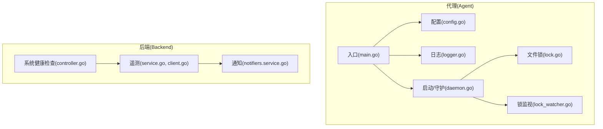
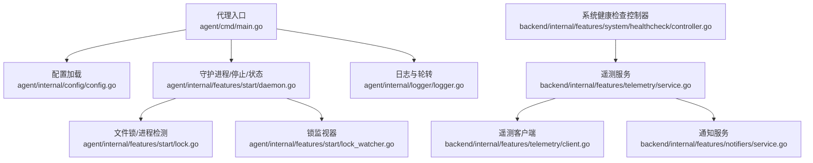
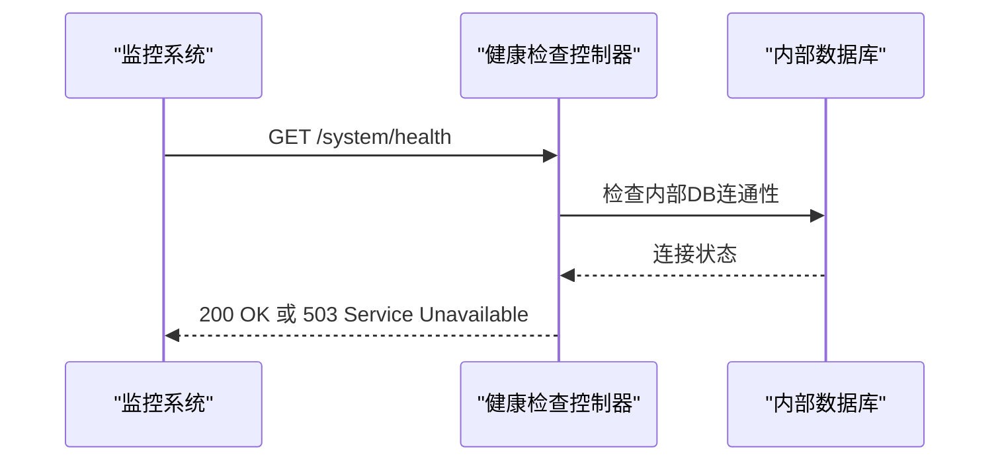
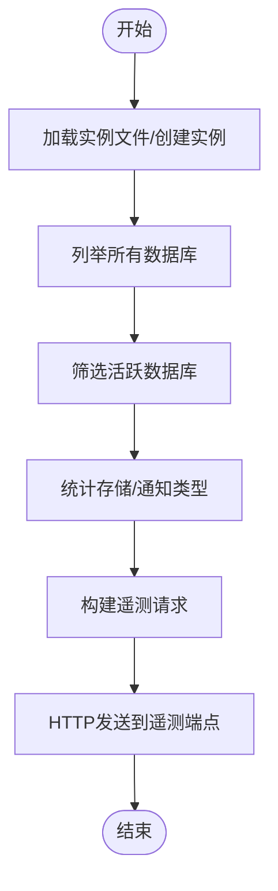
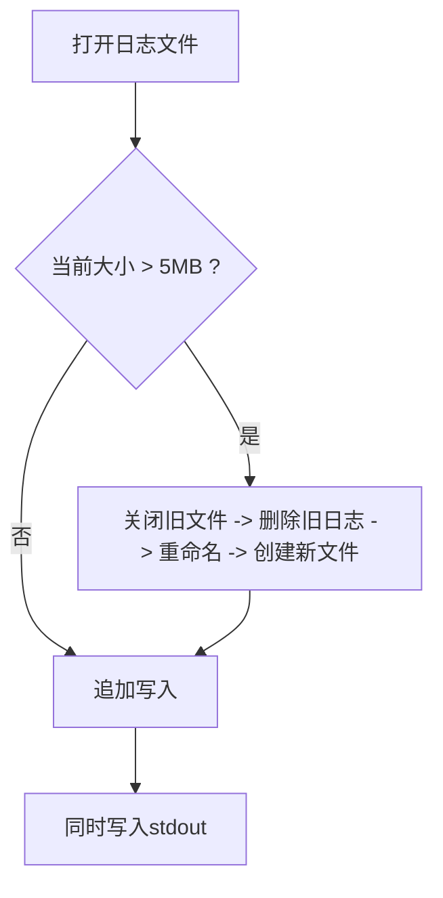
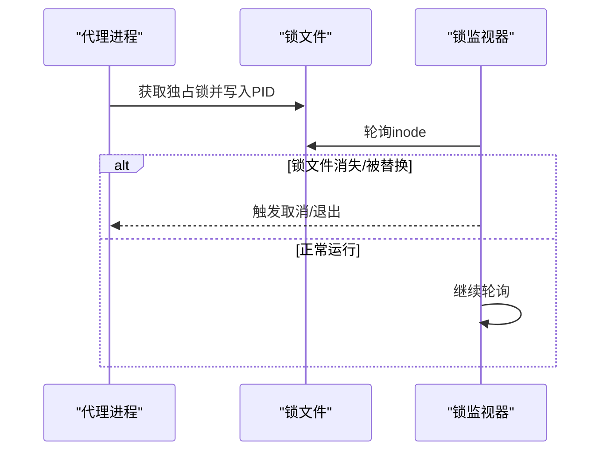
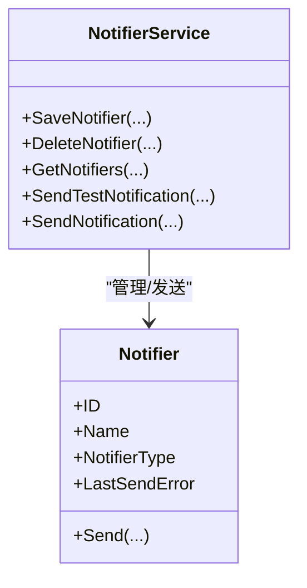
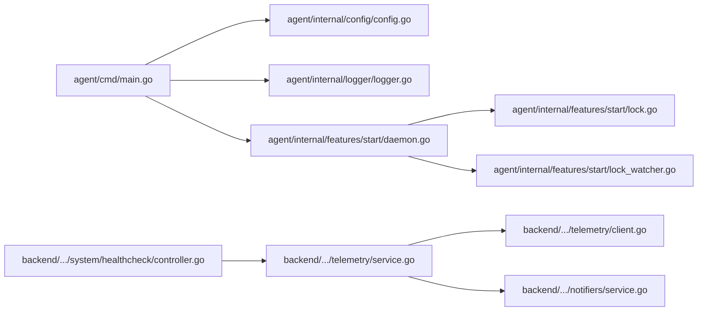

# 代理监控机制

<cite>
**本文引用的文件**
- [agent/cmd/main.go](file://agent/cmd/main.go)
- [agent/internal/config/config.go](file://agent/internal/config/config.go)
- [agent/internal/logger/logger.go](file://agent/internal/logger/logger.go)
- [agent/internal/features/start/lock.go](file://agent/internal/features/start/lock.go)
- [agent/internal/features/start/lock_watcher.go](file://agent/internal/features/start/lock_watcher.go)
- [agent/internal/features/start/daemon.go](file://agent/internal/features/start/daemon.go)
- [backend/internal/features/system/healthcheck/controller.go](file://backend/internal/features/system/healthcheck/controller.go)
- [backend/internal/features/telemetry/service.go](file://backend/internal/features/telemetry/service.go)
- [backend/internal/features/telemetry/client.go](file://backend/internal/features/telemetry/client.go)
- [backend/internal/features/notifiers/service.go](file://backend/internal/features/notifiers/service.go)
</cite>

## 目录
1. [简介](#简介)
2. [项目结构](#项目结构)
3. [核心组件](#核心组件)
4. [架构总览](#架构总览)
5. [详细组件分析](#详细组件分析)
6. [依赖分析](#依赖分析)
7. [性能考虑](#性能考虑)
8. [故障排查指南](#故障排查指南)
9. [结论](#结论)
10. [附录](#附录)

## 简介
本文件面向Databasus代理（Agent）的监控与可观测性，系统性梳理代理的健康检查机制、性能监控指标采集、日志记录策略、锁管理与进程协调、监控告警配置以及监控仪表板与故障诊断工具的使用方法。文档以仓库中实际代码为依据，避免臆造信息，确保技术细节可追溯。

## 项目结构
Databasus由“代理（Agent）”和“后端（Backend）”两部分组成。代理负责在目标主机上运行，执行WAL归档、全量备份、恢复等任务；后端提供Web API、健康检查、遥测上报、通知通道等功能。监控与可观测性涉及代理侧的进程/文件锁、日志轮转，以及后端侧的健康检查接口、遥测服务、通知通道等。

图表来源
- [agent/cmd/main.go:1-246](file://agent/cmd/main.go#L1-L246)
- [agent/internal/config/config.go:1-272](file://agent/internal/config/config.go#L1-L272)
- [agent/internal/logger/logger.go:1-116](file://agent/internal/logger/logger.go#L1-L116)
- [agent/internal/features/start/daemon.go:1-122](file://agent/internal/features/start/daemon.go#L1-L122)
- [agent/internal/features/start/lock.go:1-133](file://agent/internal/features/start/lock.go#L1-L133)
- [agent/internal/features/start/lock_watcher.go:1-91](file://agent/internal/features/start/lock_watcher.go#L1-L91)
- [backend/internal/features/system/healthcheck/controller.go:1-52](file://backend/internal/features/system/healthcheck/controller.go#L1-L52)
- [backend/internal/features/telemetry/service.go:1-253](file://backend/internal/features/telemetry/service.go#L1-L253)
- [backend/internal/features/telemetry/client.go:1-61](file://backend/internal/features/telemetry/client.go#L1-L61)
- [backend/internal/features/notifiers/service.go:1-396](file://backend/internal/features/notifiers/service.go#L1-L396)

章节来源
- [agent/cmd/main.go:1-246](file://agent/cmd/main.go#L1-L246)
- [agent/internal/config/config.go:1-272](file://agent/internal/config/config.go#L1-L272)
- [agent/internal/logger/logger.go:1-116](file://agent/internal/logger/logger.go#L1-L116)
- [agent/internal/features/start/daemon.go:1-122](file://agent/internal/features/start/daemon.go#L1-L122)
- [agent/internal/features/start/lock.go:1-133](file://agent/internal/features/start/lock.go#L1-L133)
- [agent/internal/features/start/lock_watcher.go:1-91](file://agent/internal/features/start/lock_watcher.go#L1-L91)
- [backend/internal/features/system/healthcheck/controller.go:1-52](file://backend/internal/features/system/healthcheck/controller.go#L1-L52)
- [backend/internal/features/telemetry/service.go:1-253](file://backend/internal/features/telemetry/service.go#L1-L253)
- [backend/internal/features/telemetry/client.go:1-61](file://backend/internal/features/telemetry/client.go#L1-L61)
- [backend/internal/features/notifiers/service.go:1-396](file://backend/internal/features/notifiers/service.go#L1-L396)

## 核心组件
- 健康检查与进程协调
  - 进程存活检测：通过文件锁与进程PID检测实现，支持查询/停止/状态检查。
  - 锁文件与锁监视：使用系统级文件锁防止多实例冲突，监视锁文件inode变化以感知异常退出。
- 性能监控指标
  - 后端遥测服务收集数据库类型/版本、存储类型、通知类型等元数据，用于统计与报表。
  - 代理侧未内置CPU/内存/磁盘I/O/网络带宽指标采集逻辑，建议结合系统监控工具或自定义指标导出器。
- 日志记录策略
  - 结构化日志：采用标准结构化日志格式，统一时间戳与输出格式。
  - 日志级别：默认INFO级别，便于生产环境观测。
  - 日志轮转：按大小轮转，保留旧日志文件，避免单文件过大。
  - 远程日志传输：未在代理侧直接实现，可通过外部日志收集方案对接。
- 监控告警配置
  - 健康检查接口：后端提供系统健康检查HTTP端点，返回可用/不可用状态。
  - 通知通道：后端提供多种通知方式（Discord、Slack、Teams、Telegram、Webhook、邮件），可用于告警推送。
  - 阈值与规则：未在代码中内置阈值常量，需在部署层或UI层进行配置与联动。
- 监控仪表板与故障诊断
  - 健康检查端点：可被任意CORS源访问，便于外部监控系统抓取。
  - 遥测上报：后端定期汇总实例与配置信息，辅助运营分析与容量规划。
  - 故障诊断：结合日志轮转、锁文件状态、健康检查响应与通知发送结果进行定位。

章节来源
- [agent/internal/features/start/daemon.go:1-122](file://agent/internal/features/start/daemon.go#L1-L122)
- [agent/internal/features/start/lock.go:1-133](file://agent/internal/features/start/lock.go#L1-L133)
- [agent/internal/features/start/lock_watcher.go:1-91](file://agent/internal/features/start/lock_watcher.go#L1-L91)
- [agent/internal/logger/logger.go:1-116](file://agent/internal/logger/logger.go#L1-L116)
- [backend/internal/features/system/healthcheck/controller.go:1-52](file://backend/internal/features/system/healthcheck/controller.go#L1-L52)
- [backend/internal/features/telemetry/service.go:1-253](file://backend/internal/features/telemetry/service.go#L1-L253)
- [backend/internal/features/notifiers/service.go:1-396](file://backend/internal/features/notifiers/service.go#L1-L396)

## 架构总览
下图展示代理与后端在监控与可观测性方面的交互关系：代理负责进程/文件锁与日志；后端提供健康检查、遥测与通知能力。

图表来源
- [agent/cmd/main.go:1-246](file://agent/cmd/main.go#L1-L246)
- [agent/internal/config/config.go:1-272](file://agent/internal/config/config.go#L1-L272)
- [agent/internal/features/start/lock.go:1-133](file://agent/internal/features/start/lock.go#L1-L133)
- [agent/internal/features/start/lock_watcher.go:1-91](file://agent/internal/features/start/lock_watcher.go#L1-L91)
- [agent/internal/features/start/daemon.go:1-122](file://agent/internal/features/start/daemon.go#L1-L122)
- [agent/internal/logger/logger.go:1-116](file://agent/internal/logger/logger.go#L1-L116)
- [backend/internal/features/system/healthcheck/controller.go:1-52](file://backend/internal/features/system/healthcheck/controller.go#L1-L52)
- [backend/internal/features/telemetry/service.go:1-253](file://backend/internal/features/telemetry/service.go#L1-L253)
- [backend/internal/features/telemetry/client.go:1-61](file://backend/internal/features/telemetry/client.go#L1-L61)
- [backend/internal/features/notifiers/service.go:1-396](file://backend/internal/features/notifiers/service.go#L1-L396)

## 详细组件分析

### 健康检查机制
- 进程存活检测
  - 通过读取锁文件中的PID并调用信号检测进程是否存活，支持“状态查询”和“优雅停止”。
  - 若锁文件不存在或对应进程不存在，清理陈旧锁文件并提示未运行。
- 数据库连接状态
  - 后端提供系统健康检查接口，返回内部数据库工作状态与磁盘使用率阈值（低于阈值视为健康）。
  - 该检查可作为外部监控系统对应用健康度的统一入口。
- 存储可用性检查
  - 代理侧未直接实现存储可用性检查逻辑；建议结合后端存储配置与通知通道，在备份/恢复失败时触发告警。

图表来源
- [backend/internal/features/system/healthcheck/controller.go:1-52](file://backend/internal/features/system/healthcheck/controller.go#L1-L52)

章节来源
- [agent/internal/features/start/daemon.go:1-122](file://agent/internal/features/start/daemon.go#L1-L122)
- [backend/internal/features/system/healthcheck/controller.go:1-52](file://backend/internal/features/system/healthcheck/controller.go#L1-L52)

### 性能监控指标
- 后端遥测指标
  - 收集活跃数据库类型/版本、存储类型、通知类型等，限制数组长度上限，避免超大数据包。
  - 通过HTTP客户端定时上报至指定端点，包含实例ID、安装时间、操作系统与架构等元信息。
- 代理侧指标现状
  - 未内置CPU/内存/磁盘I/O/网络带宽等指标采集逻辑；如需采集，建议引入系统监控工具或自定义指标导出器。

图表来源
- [backend/internal/features/telemetry/service.go:75-108](file://backend/internal/features/telemetry/service.go#L75-L108)
- [backend/internal/features/telemetry/client.go:31-60](file://backend/internal/features/telemetry/client.go#L31-L60)

章节来源
- [backend/internal/features/telemetry/service.go:1-253](file://backend/internal/features/telemetry/service.go#L1-L253)
- [backend/internal/features/telemetry/client.go:1-61](file://backend/internal/features/telemetry/client.go#L1-L61)

### 日志记录策略
- 结构化日志
  - 使用标准结构化处理器，统一时间格式，屏蔽级别键，保证日志可解析性。
- 日志级别
  - 默认INFO级别，兼顾可观测性与性能。
- 日志轮转
  - 单文件最大5MB，超过则重命名当前日志为旧日志并创建新文件；同时输出到stdout，便于容器/系统日志收集。
- 远程日志传输
  - 代理侧未直接实现远程传输；可通过外部日志收集器（如Fluent Bit/Filebeat）采集本地日志文件并转发。

图表来源
- [agent/internal/logger/logger.go:18-65](file://agent/internal/logger/logger.go#L18-L65)
- [agent/internal/logger/logger.go:94-115](file://agent/internal/logger/logger.go#L94-L115)

章节来源
- [agent/internal/logger/logger.go:1-116](file://agent/internal/logger/logger.go#L1-L116)

### 锁管理与进程协调
- 文件锁
  - 以独占非阻塞方式获取锁，成功后写入PID；若已有锁且无法获取，则解析锁文件中的PID判断是否已有实例运行。
- 锁监视
  - 定期轮询锁文件inode，若消失或被替换（inode变化）则判定异常并触发退出。
- 进程停止与状态
  - 通过SIGTERM优雅停止，轮询进程存活状态，超时则判定卡死；状态查询显示PID或“未运行”。

图表来源
- [agent/internal/features/start/lock.go:18-49](file://agent/internal/features/start/lock.go#L18-L49)
- [agent/internal/features/start/lock_watcher.go:34-72](file://agent/internal/features/start/lock_watcher.go#L34-L72)
- [agent/internal/features/start/daemon.go:23-55](file://agent/internal/features/start/daemon.go#L23-L55)

章节来源
- [agent/internal/features/start/lock.go:1-133](file://agent/internal/features/start/lock.go#L1-L133)
- [agent/internal/features/start/lock_watcher.go:1-91](file://agent/internal/features/start/lock_watcher.go#L1-L91)
- [agent/internal/features/start/daemon.go:1-122](file://agent/internal/features/start/daemon.go#L1-L122)

### 监控告警配置
- 健康检查端点
  - 允许任意CORS源访问，便于外部监控系统抓取健康状态。
- 通知通道
  - 支持Discord、Slack、MS Teams、Telegram、Webhook、邮件等多种通知方式；通知服务提供测试消息发送与错误回写。
- 阈值与规则
  - 未在代码中内置阈值常量；建议在部署层或UI层进行阈值配置，并与健康检查端点及通知通道联动。

图表来源
- [backend/internal/features/notifiers/service.go:15-396](file://backend/internal/features/notifiers/service.go#L15-L396)

章节来源
- [backend/internal/features/system/healthcheck/controller.go:1-52](file://backend/internal/features/system/healthcheck/controller.go#L1-L52)
- [backend/internal/features/notifiers/service.go:1-396](file://backend/internal/features/notifiers/service.go#L1-L396)

### 监控仪表板与故障诊断工具使用指南
- 健康检查端点
  - 可直接在浏览器或监控系统中访问，无需鉴权；返回“健康”或“不可用”状态。
- 遥测数据
  - 后端定期汇总实例与配置信息，可用于运营仪表板与容量分析。
- 故障诊断步骤
  - 检查日志文件大小与轮转情况，确认最近日志片段。
  - 使用“状态”命令确认代理进程PID与锁文件状态。
  - 若出现“锁文件被替换”，结合锁监视器日志定位异常退出原因。
  - 对照健康检查端点响应，判断内部数据库连通性与磁盘使用率问题。

章节来源
- [agent/internal/logger/logger.go:1-116](file://agent/internal/logger/logger.go#L1-L116)
- [agent/internal/features/start/daemon.go:1-122](file://agent/internal/features/start/daemon.go#L1-L122)
- [agent/internal/features/start/lock_watcher.go:1-91](file://agent/internal/features/start/lock_watcher.go#L1-L91)
- [backend/internal/features/system/healthcheck/controller.go:1-52](file://backend/internal/features/system/healthcheck/controller.go#L1-L52)
- [backend/internal/features/telemetry/service.go:1-253](file://backend/internal/features/telemetry/service.go#L1-L253)

## 依赖分析
- 组件耦合
  - 代理入口依赖配置、日志、守护进程与锁模块；守护进程依赖文件锁与锁监视器。
  - 后端健康检查控制器依赖健康检查服务；遥测服务依赖实例文件加载器、发送器与各领域服务；通知服务依赖工作区权限与审计日志。
- 外部集成
  - 遥测通过HTTP客户端发送；通知通过各通知实现（Discord/Slack/Teams/Telegram/Webhook/邮件）。
- 循环依赖
  - 未发现循环依赖迹象；模块职责清晰，接口边界明确。

图表来源
- [agent/cmd/main.go:1-246](file://agent/cmd/main.go#L1-L246)
- [agent/internal/config/config.go:1-272](file://agent/internal/config/config.go#L1-L272)
- [agent/internal/logger/logger.go:1-116](file://agent/internal/logger/logger.go#L1-L116)
- [agent/internal/features/start/daemon.go:1-122](file://agent/internal/features/start/daemon.go#L1-L122)
- [agent/internal/features/start/lock.go:1-133](file://agent/internal/features/start/lock.go#L1-L133)
- [agent/internal/features/start/lock_watcher.go:1-91](file://agent/internal/features/start/lock_watcher.go#L1-L91)
- [backend/internal/features/system/healthcheck/controller.go:1-52](file://backend/internal/features/system/healthcheck/controller.go#L1-L52)
- [backend/internal/features/telemetry/service.go:1-253](file://backend/internal/features/telemetry/service.go#L1-L253)
- [backend/internal/features/telemetry/client.go:1-61](file://backend/internal/features/telemetry/client.go#L1-L61)
- [backend/internal/features/notifiers/service.go:1-396](file://backend/internal/features/notifiers/service.go#L1-L396)

章节来源
- [agent/cmd/main.go:1-246](file://agent/cmd/main.go#L1-L246)
- [agent/internal/config/config.go:1-272](file://agent/internal/config/config.go#L1-L272)
- [agent/internal/logger/logger.go:1-116](file://agent/internal/logger/logger.go#L1-L116)
- [agent/internal/features/start/daemon.go:1-122](file://agent/internal/features/start/daemon.go#L1-L122)
- [agent/internal/features/start/lock.go:1-133](file://agent/internal/features/start/lock.go#L1-L133)
- [agent/internal/features/start/lock_watcher.go:1-91](file://agent/internal/features/start/lock_watcher.go#L1-L91)
- [backend/internal/features/system/healthcheck/controller.go:1-52](file://backend/internal/features/system/healthcheck/controller.go#L1-L52)
- [backend/internal/features/telemetry/service.go:1-253](file://backend/internal/features/telemetry/service.go#L1-L253)
- [backend/internal/features/telemetry/client.go:1-61](file://backend/internal/features/telemetry/client.go#L1-L61)
- [backend/internal/features/notifiers/service.go:1-396](file://backend/internal/features/notifiers/service.go#L1-L396)

## 性能考虑
- 日志轮转
  - 5MB阈值适中，建议结合磁盘空间与IO能力评估；在高并发场景下可考虑异步写入或缓冲策略。
- 遥测上报
  - HTTP客户端设置5秒超时，建议在高延迟网络环境下适当放宽或增加重试策略。
- 进程协调
  - 锁监视轮询间隔为5秒，可在资源紧张环境中调整；同时注意inode读取的系统开销。
- 指标采集
  - 代理侧未内置系统指标采集，建议在独立监控代理或Sidecar中实现，避免影响主流程。

## 故障排查指南
- 代理无法启动/重复实例
  - 检查锁文件是否存在与inode是否变化；查看日志中“获取锁失败/另一个实例已运行”的提示。
- 代理停止无效
  - 使用“停止”命令后轮询进程状态；若超时，确认进程是否卡死或被外部信号阻断。
- 健康检查持续不可用
  - 查看健康检查端点返回内容；检查内部数据库连通性与磁盘使用率是否超过阈值。
- 通知未送达
  - 使用“测试通知”功能验证配置；查看通知实体的最后发送错误字段，定位具体失败原因。
- 日志过大/无法轮转
  - 检查日志文件权限与磁盘空间；确认旧日志文件是否被外部工具删除导致轮转失败。

章节来源
- [agent/internal/features/start/lock.go:18-49](file://agent/internal/features/start/lock.go#L18-L49)
- [agent/internal/features/start/lock_watcher.go:34-72](file://agent/internal/features/start/lock_watcher.go#L34-L72)
- [agent/internal/features/start/daemon.go:23-55](file://agent/internal/features/start/daemon.go#L23-L55)
- [backend/internal/features/system/healthcheck/controller.go:25-51](file://backend/internal/features/system/healthcheck/controller.go#L25-L51)
- [backend/internal/features/notifiers/service.go:209-237](file://backend/internal/features/notifiers/service.go#L209-L237)

## 结论
Databasus代理通过文件锁与锁监视器实现了可靠的进程存活检测与异常退出防护；后端提供了系统健康检查、遥测上报与通知通道，构成完整的可观测性闭环。代理侧日志轮转与结构化输出满足生产环境需求。对于CPU/内存/磁盘I/O/网络带宽等系统指标，建议结合外部监控体系实现。通过健康检查端点、遥测数据与通知通道，用户可快速建立可视化仪表板与告警规则，提升运维效率与系统稳定性。

## 附录
- 命令与用途
  - start：启动代理（WAL归档+基础备份）
  - stop：停止正在运行的代理
  - status：查询代理状态（运行中/未运行）
  - restore：从备份恢复数据库
  - version：打印代理版本
- 关键配置项
  - DatabasusHost、Token、DbID：后端地址与认证
  - PgHost/PgPort/PgUser/PgPassword/PgType：PostgreSQL连接参数与模式
  - PgHostBinDir/PgDockerContainerName/PgWalDir：主机/容器模式与WAL目录
  - deleteWalAfterUpload：上传后是否删除WAL文件

章节来源
- [agent/cmd/main.go:162-171](file://agent/cmd/main.go#L162-L171)
- [agent/internal/config/config.go:16-31](file://agent/internal/config/config.go#L16-L31)
- [agent/internal/config/config.go:35-64](file://agent/internal/config/config.go#L35-L64)