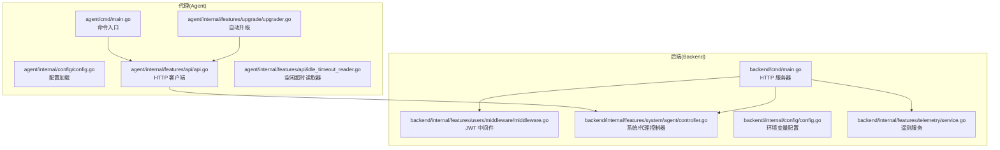
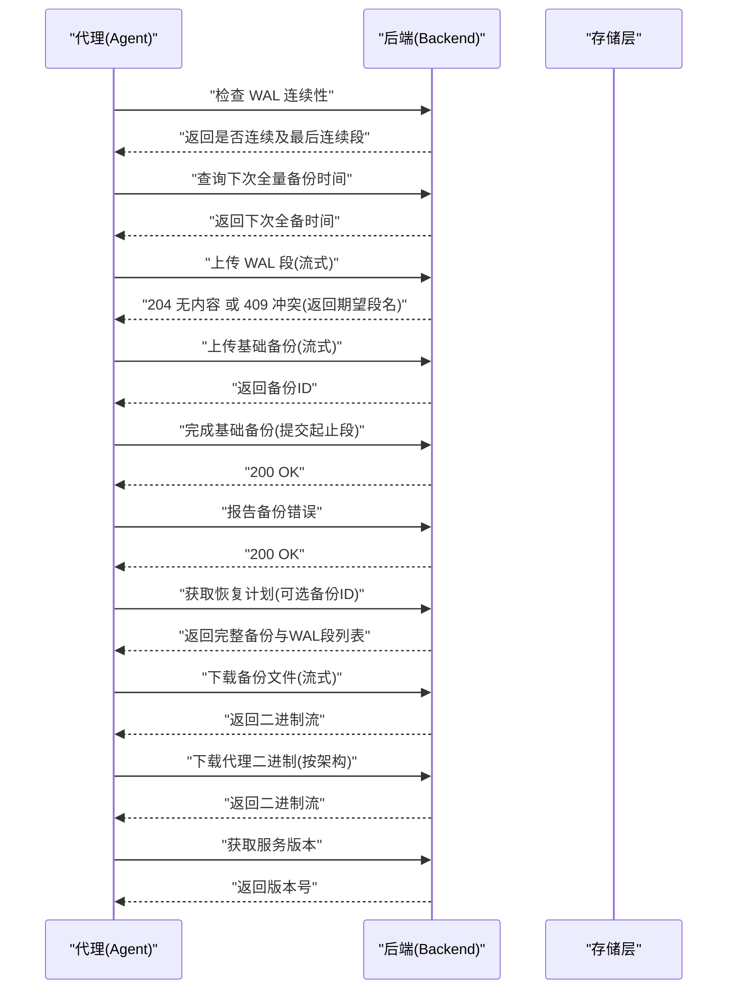
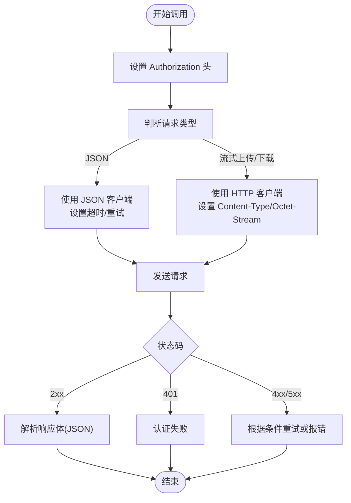
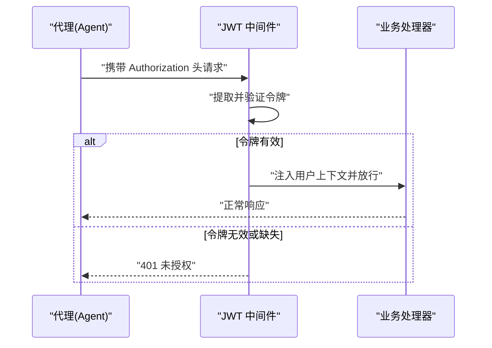
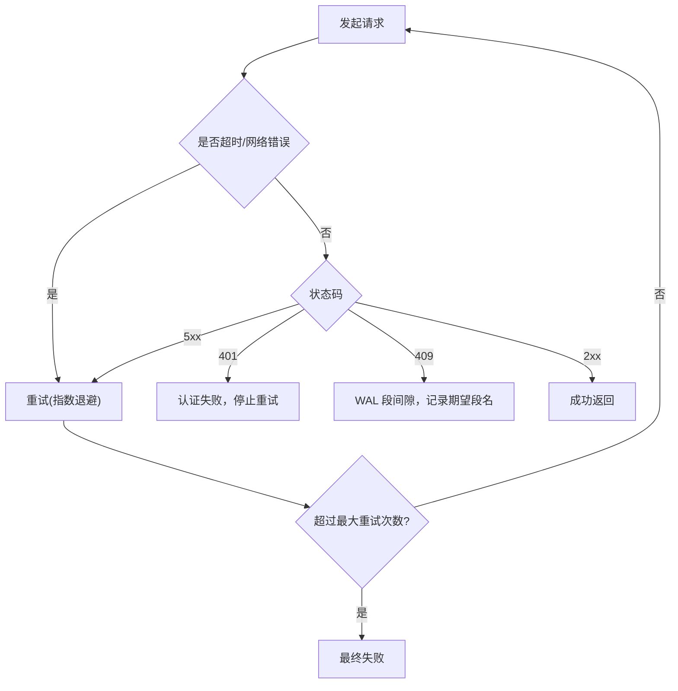
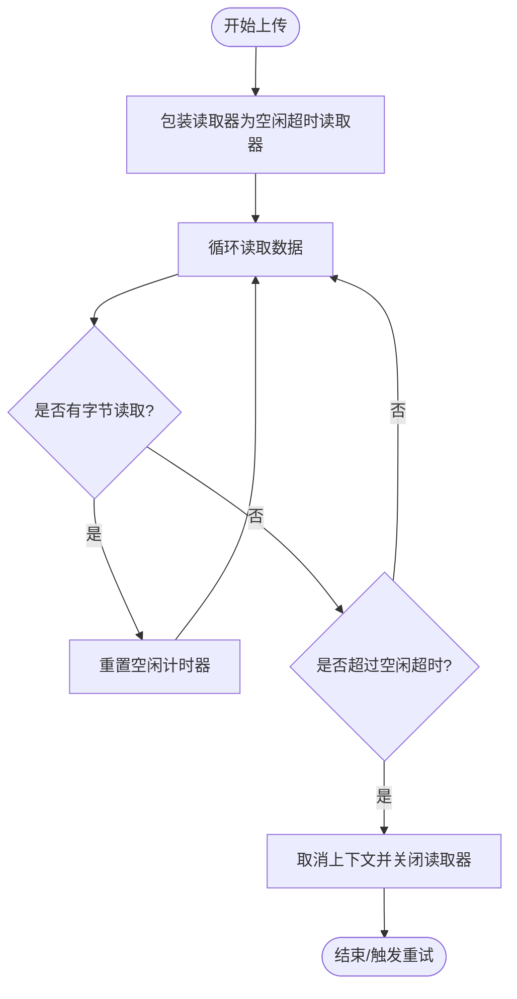
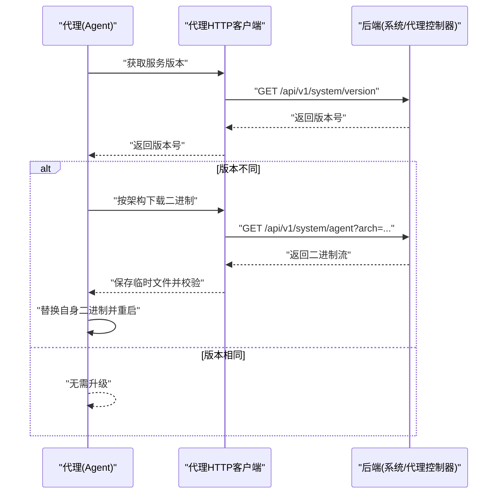
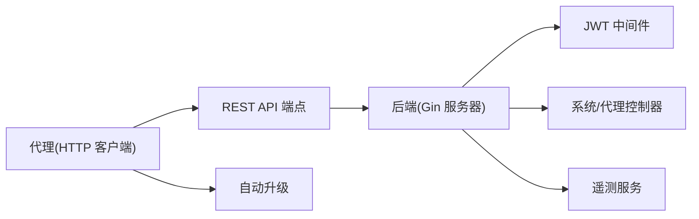

# 代理通信协议

<cite>
**本文档引用的文件**
- [agent/cmd/main.go](file://agent/cmd/main.go)
- [backend/cmd/main.go](file://backend/cmd/main.go)
- [agent/internal/config/config.go](file://agent/internal/config/config.go)
- [backend/internal/config/config.go](file://backend/internal/config/config.go)
- [agent/internal/features/api/api.go](file://agent/internal/features/api/api.go)
- [agent/internal/features/api/dto.go](file://agent/internal/features/api/dto.go)
- [agent/internal/features/api/idle_timeout_reader.go](file://agent/internal/features/api/idle_timeout_reader.go)
- [agent/internal/features/upgrade/upgrader.go](file://agent/internal/features/upgrade/upgrader.go)
- [backend/internal/features/system/agent/controller.go](file://backend/internal/features/system/agent/controller.go)
- [backend/internal/features/users/middleware/middleware.go](file://backend/internal/features/users/middleware/middleware.go)
- [backend/internal/features/telemetry/service.go](file://backend/internal/features/telemetry/service.go)
</cite>

## 目录
1. [简介](#简介)
2. [项目结构](#项目结构)
3. [核心组件](#核心组件)
4. [架构总览](#架构总览)
5. [详细组件分析](#详细组件分析)
6. [依赖关系分析](#依赖关系分析)
7. [性能考虑](#性能考虑)
8. [故障排查指南](#故障排查指南)
9. [结论](#结论)
10. [附录](#附录)

## 简介
本文件为 Databasus 代理通信协议的权威规范，面向后端服务与数据库代理（Agent）之间的通信，覆盖以下方面：
- HTTP REST API 规范：端点、请求/响应模式、认证头、内容类型、状态码约定
- WebSocket 实时通信：当前仓库未实现 WebSocket，仅记录现状
- 消息格式定义：请求体与响应体的数据结构
- 安全机制：JWT 令牌传递、HTTPS 加密、证书验证
- 错误处理与重试策略：超时设置、指数退避、故障转移
- 心跳检测与连接保活：空闲超时、连接池管理、断线重连
- 调试工具与监控指标：日志、指标采集与可观测性

## 项目结构
Databasus 采用前后端分离的二进制应用：
- 后端（backend）：基于 Gin 的 HTTP 服务器，提供 REST API、静态资源托管与后台任务
- 代理（agent）：独立二进制，负责 WAL 归档、基础备份上传、恢复计划与下载、自动升级等

**图表来源**
- [agent/cmd/main.go:1-246](file://agent/cmd/main.go#L1-L246)
- [backend/cmd/main.go:1-491](file://backend/cmd/main.go#L1-L491)
- [agent/internal/features/api/api.go:1-377](file://agent/internal/features/api/api.go#L1-L377)
- [backend/internal/features/system/agent/controller.go:1-49](file://backend/internal/features/system/agent/controller.go#L1-L49)

**章节来源**
- [agent/cmd/main.go:1-246](file://agent/cmd/main.go#L1-L246)
- [backend/cmd/main.go:1-491](file://backend/cmd/main.go#L1-L491)

## 核心组件
- 代理 HTTP 客户端：封装 REST API 调用、流式上传/下载、重试与超时控制
- 后端 Gin 服务器：路由注册、CORS/GZIP、JWT 认证中间件、静态资源托管
- 系统/代理控制器：提供代理二进制下载接口
- 配置模块：代理配置持久化与加载、后端环境变量解析
- 自动升级：从后端拉取新版本二进制并校验替换
- 遥测服务：匿名遥测数据收集与发送

**章节来源**
- [agent/internal/features/api/api.go:1-377](file://agent/internal/features/api/api.go#L1-L377)
- [backend/internal/features/system/agent/controller.go:1-49](file://backend/internal/features/system/agent/controller.go#L1-L49)
- [agent/internal/config/config.go:1-272](file://agent/internal/config/config.go#L1-L272)
- [backend/internal/config/config.go:1-422](file://backend/internal/config/config.go#L1-L422)
- [agent/internal/features/upgrade/upgrader.go:1-90](file://agent/internal/features/upgrade/upgrader.go#L1-L90)
- [backend/internal/features/telemetry/service.go:1-253](file://backend/internal/features/telemetry/service.go#L1-L253)

## 架构总览
代理与后端通过 HTTP REST 协议通信，代理在本地执行数据库操作并向后端上报状态；后端提供统一的 API 命名空间与认证保护。

**图表来源**
- [agent/internal/features/api/api.go:72-327](file://agent/internal/features/api/api.go#L72-L327)
- [backend/internal/features/system/agent/controller.go:27-48](file://backend/internal/features/system/agent/controller.go#L27-L48)

## 详细组件分析

### HTTP REST API 规范
- 基础路径：/api/v1
- 认证方式：Authorization 头，支持 Bearer 令牌或直接令牌值（代理客户端会自动添加前缀）
- 内容类型：
  - JSON 请求/响应：application/json
  - 流式上传/下载：application/octet-stream
- 超时与重试：
  - API 调用超时：固定超时
  - 重试次数：固定最大重试次数
  - 重试条件：服务端内部错误或网络异常
- 端点概览：
  - 检查 WAL 连续性：GET /api/v1/backups/postgres/wal/is-wal-chain-valid-since-last-full-backup
  - 查询下次全备时间：GET /api/v1/backups/postgres/wal/next-full-backup-time
  - 上传 WAL 段：POST /api/v1/backups/postgres/wal/upload/wal（流式，需设置 X-Wal-Segment-Name）
  - 上传基础备份：POST /api/v1/backups/postgres/wal/upload/full-start（流式）
  - 完成基础备份：POST /api/v1/backups/postgres/wal/upload/full-complete（JSON）
  - 报告备份错误：POST /api/v1/backups/postgres/wal/error（JSON）
  - 获取恢复计划：GET /api/v1/backups/postgres/wal/restore/plan（可带 backupId 查询参数）
  - 下载备份文件：GET /api/v1/backups/postgres/wal/restore/download（流式）
  - 下载代理二进制：GET /api/v1/system/agent（流式，查询参数 arch=amd64|arm64）
  - 获取服务版本：GET /api/v1/system/version

**图表来源**
- [agent/internal/features/api/api.go:44-70](file://agent/internal/features/api/api.go#L44-L70)
- [agent/internal/features/api/api.go:120-175](file://agent/internal/features/api/api.go#L120-L175)
- [agent/internal/features/api/api.go:200-242](file://agent/internal/features/api/api.go#L200-L242)
- [agent/internal/features/api/api.go:282-309](file://agent/internal/features/api/api.go#L282-L309)
- [agent/internal/features/api/api.go:329-358](file://agent/internal/features/api/api.go#L329-L358)

**章节来源**
- [agent/internal/features/api/api.go:17-32](file://agent/internal/features/api/api.go#L17-L32)
- [agent/internal/features/api/api.go:44-70](file://agent/internal/features/api/api.go#L44-L70)
- [agent/internal/features/api/api.go:72-327](file://agent/internal/features/api/api.go#L72-L327)
- [agent/internal/features/api/dto.go:1-73](file://agent/internal/features/api/dto.go#L1-L73)

### 认证与安全机制
- 认证头：Authorization
  - 代理客户端会在每次请求中设置 Authorization 头
  - 后端中间件要求 Authorization 头存在，支持 Bearer 前缀
- JWT 令牌传递：后端中间件从令牌解析用户上下文
- HTTPS 加密与证书验证：后端监听 4005 端口，默认 HTTP；仓库未显式启用 TLS 配置
- CORS：开发模式下允许跨域访问
- GZIP 压缩：对非二进制资源进行压缩以降低带宽

**图表来源**
- [backend/internal/features/users/middleware/middleware.go:14-38](file://backend/internal/features/users/middleware/middleware.go#L14-L38)

**章节来源**
- [backend/internal/features/users/middleware/middleware.go:14-38](file://backend/internal/features/users/middleware/middleware.go#L14-L38)
- [backend/cmd/main.go:434-457](file://backend/cmd/main.go#L434-L457)
- [backend/cmd/main.go:117-125](file://backend/cmd/main.go#L117-L125)

### 错误处理与重试策略
- 超时设置：固定 API 调用超时
- 重试策略：固定最大重试次数，基于状态码与错误条件触发
- 错误响应：
  - 401 未授权：认证失败
  - 400 错误请求：如恢复计划查询参数错误
  - 409 冲突：WAL 上传检测到段间隙，返回期望段名
  - 5xx：服务端内部错误，触发重试
- 断线重连：代理在 WAL 上传过程中使用空闲超时读取器检测停滞，必要时取消并重试

**图表来源**
- [agent/internal/features/api/api.go:58-61](file://agent/internal/features/api/api.go#L58-L61)
- [agent/internal/features/api/api.go:220-241](file://agent/internal/features/api/api.go#L220-L241)

**章节来源**
- [agent/internal/features/api/api.go:29-32](file://agent/internal/features/api/api.go#L29-L32)
- [agent/internal/features/api/api.go:58-61](file://agent/internal/features/api/api.go#L58-L61)
- [agent/internal/features/api/api.go:220-241](file://agent/internal/features/api/api.go#L220-L241)

### 心跳检测与连接保活
- 空闲超时：代理在流式上传时使用空闲超时读取器，若长时间无数据传输则取消上下文并关闭底层读取器
- 连接池管理：代理使用标准 HTTP 客户端进行流式上传/下载，未见自定义连接池配置
- 断线重连：结合重试策略与空闲超时，代理在检测到停滞或错误后重新发起请求

**图表来源**
- [agent/internal/features/api/idle_timeout_reader.go:16-61](file://agent/internal/features/api/idle_timeout_reader.go#L16-L61)

**章节来源**
- [agent/internal/features/api/idle_timeout_reader.go:16-61](file://agent/internal/features/api/idle_timeout_reader.go#L16-L61)

### WebSocket 实时通信
- 当前仓库未实现 WebSocket 实时通信功能，代理与后端之间通过 HTTP REST 协议交互。

[此部分为概念性说明，不直接分析具体文件]

### 消息格式定义
- 响应体示例（摘要）：
  - WAL 连续性检查：包含 isValid、error、lastContiguousSegment
  - 下次全备时间：包含 nextFullBackupTime
  - 上传 WAL 段结果：包含是否检测到间隙、期望段名、实际收到段名
  - 基础备份上传：返回 backupId
  - 恢复计划：包含完整备份信息、WAL 段列表、总大小、最新可用段
  - 服务版本：包含 version 字段
- 请求体示例（摘要）：
  - 完成基础备份：包含 backupId、startSegment、stopSegment、可选 error
  - 报告备份错误：包含 error 字段
  - 恢复计划查询：可选 backupId 查询参数

**章节来源**
- [agent/internal/features/api/dto.go:1-73](file://agent/internal/features/api/dto.go#L1-L73)

### 自动升级流程
- 代理启动时检查服务端版本，若不同则下载对应架构的二进制并校验，随后替换自身二进制并重启

**图表来源**
- [agent/internal/features/upgrade/upgrader.go:18-73](file://agent/internal/features/upgrade/upgrader.go#L18-L73)
- [agent/internal/features/api/api.go:311-327](file://agent/internal/features/api/api.go#L311-L327)
- [agent/internal/features/api/api.go:329-358](file://agent/internal/features/api/api.go#L329-L358)
- [backend/internal/features/system/agent/controller.go:27-48](file://backend/internal/features/system/agent/controller.go#L27-L48)

**章节来源**
- [agent/internal/features/upgrade/upgrader.go:18-73](file://agent/internal/features/upgrade/upgrader.go#L18-L73)
- [agent/internal/features/api/api.go:311-358](file://agent/internal/features/api/api.go#L311-L358)
- [backend/internal/features/system/agent/controller.go:27-48](file://backend/internal/features/system/agent/controller.go#L27-L48)

### 遥测与监控
- 匿名遥测：后端在主节点收集数据库、存储与通知器类型等信息，限制数组长度并发送
- 遥测指标：活跃数据库判定、存储类型与通知器类型统计
- 日志：代理与后端均使用 slog 记录关键事件与错误

**章节来源**
- [backend/internal/features/telemetry/service.go:75-108](file://backend/internal/features/telemetry/service.go#L75-L108)
- [backend/internal/features/telemetry/service.go:110-155](file://backend/internal/features/telemetry/service.go#L110-L155)
- [backend/internal/features/telemetry/service.go:184-236](file://backend/internal/features/telemetry/service.go#L184-L236)

## 依赖关系分析
- 代理依赖后端提供的 REST API 与系统/代理控制器
- 后端通过 Gin 注册路由并应用 JWT 中间件保护受保护路由
- 配置模块分别在代理与后端侧加载并解析运行所需参数

**图表来源**
- [agent/internal/features/api/api.go:44-70](file://agent/internal/features/api/api.go#L44-L70)
- [backend/cmd/main.go:213-257](file://backend/cmd/main.go#L213-L257)
- [backend/internal/features/users/middleware/middleware.go:14-38](file://backend/internal/features/users/middleware/middleware.go#L14-L38)
- [backend/internal/features/system/agent/controller.go:13-15](file://backend/internal/features/system/agent/controller.go#L13-L15)

**章节来源**
- [agent/internal/features/api/api.go:44-70](file://agent/internal/features/api/api.go#L44-L70)
- [backend/cmd/main.go:213-257](file://backend/cmd/main.go#L213-L257)

## 性能考虑
- 压缩：后端启用 GZIP 压缩以减少文本类响应体积
- 流式传输：WAL 与基础备份上传使用流式 HTTP 客户端，避免内存缓冲
- 超时与重试：合理设置超时与重试，避免长时间阻塞
- 空闲超时：检测上传停滞，及时释放资源并触发重试

[本节为通用建议，不直接分析具体文件]

## 故障排查指南
- 认证失败（401）：确认 Authorization 头正确设置且令牌有效
- 409 冲突（WAL 上传）：根据返回的期望段名补齐缺失段后再重试
- 5xx 错误：检查后端日志与网络连通性，等待自动重试或手动重试
- 上传停滞：检查网络稳定性与源数据提供方，代理会触发空闲超时并取消
- 代理二进制下载失败：确认后端系统/代理控制器可访问且架构参数正确

**章节来源**
- [agent/internal/features/api/api.go:220-241](file://agent/internal/features/api/api.go#L220-L241)
- [backend/internal/features/system/agent/controller.go:27-48](file://backend/internal/features/system/agent/controller.go#L27-L48)

## 结论
本协议规范明确了代理与后端之间的 HTTP REST 通信细节，包括认证、消息格式、错误处理与重试、空闲保活与自动升级等关键机制。当前仓库未实现 WebSocket，后续可在此基础上扩展实时通信能力。建议在生产环境中配合 HTTPS 与严格的访问控制策略，确保通信安全与稳定性。

## 附录
- 端点清单与参数：
  - GET /api/v1/backups/postgres/wal/is-wal-chain-valid-since-last-full-backup
  - GET /api/v1/backups/postgres/wal/next-full-backup-time
  - POST /api/v1/backups/postgres/wal/upload/wal（需设置 X-Wal-Segment-Name）
  - POST /api/v1/backups/postgres/wal/upload/full-start（流式）
  - POST /api/v1/backups/postgres/wal/upload/full-complete（JSON）
  - POST /api/v1/backups/postgres/wal/error（JSON）
  - GET /api/v1/backups/postgres/wal/restore/plan（可选 backupId）
  - GET /api/v1/backups/postgres/wal/restore/download（流式）
  - GET /api/v1/system/agent（查询参数 arch=amd64|arm64）
  - GET /api/v1/system/version

**章节来源**
- [agent/internal/features/api/api.go:17-32](file://agent/internal/features/api/api.go#L17-L32)
- [agent/internal/features/api/api.go:72-327](file://agent/internal/features/api/api.go#L72-L327)
- [backend/internal/features/system/agent/controller.go:13-15](file://backend/internal/features/system/agent/controller.go#L13-L15)