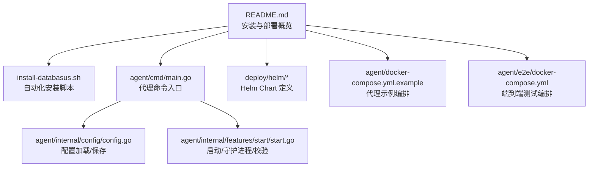
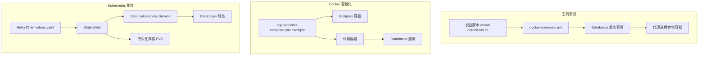
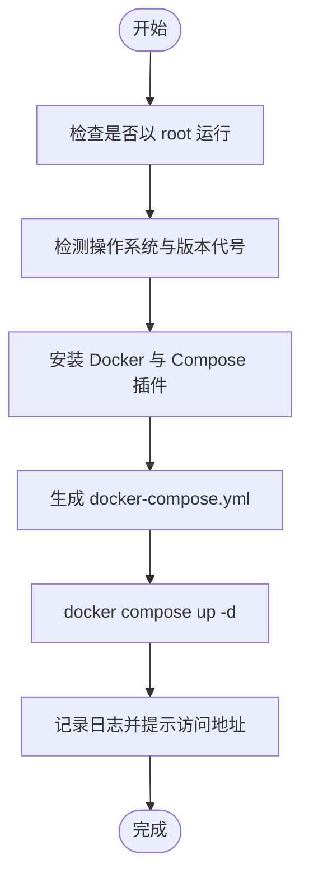
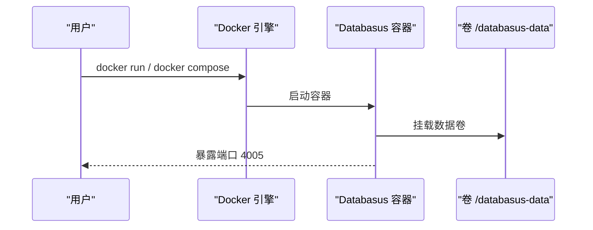
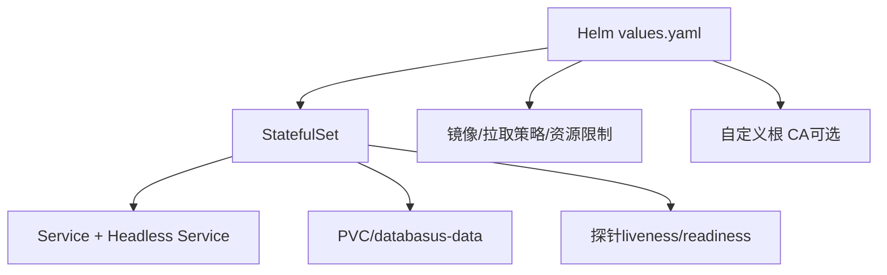
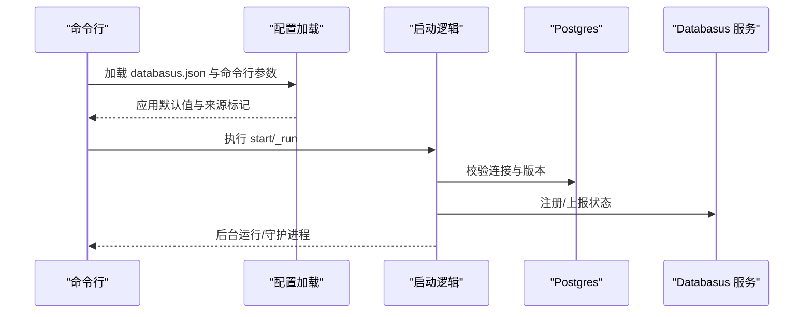
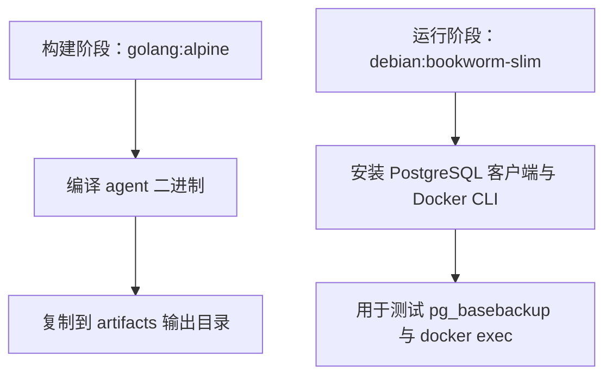
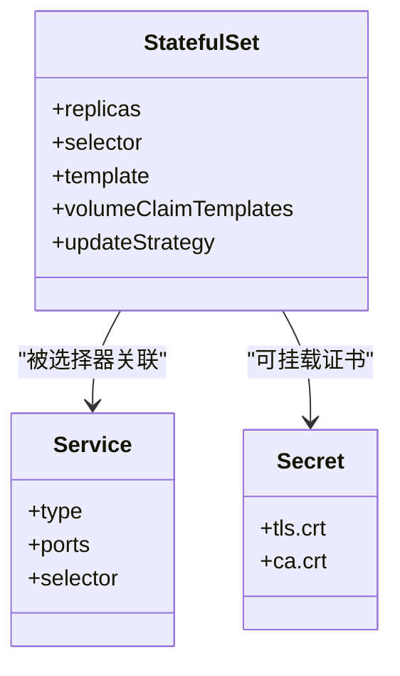
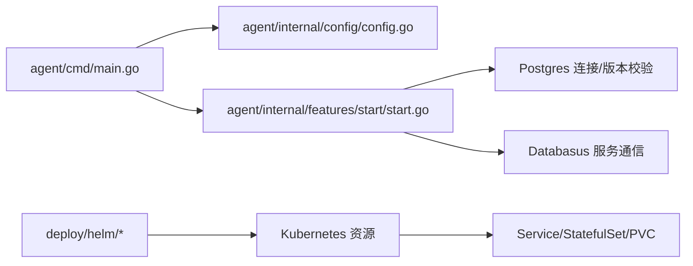

# 代理部署模式

<cite>
**本文引用的文件**
- [README.md](file://README.md)
- [install-databasus.sh](file://install-databasus.sh)
- [agent/cmd/main.go](file://agent/cmd/main.go)
- [agent/internal/config/config.go](file://agent/internal/config/config.go)
- [agent/internal/features/start/start.go](file://agent/internal/features/start/start.go)
- [agent/docker-compose.yml.example](file://agent/docker-compose.yml.example)
- [agent/e2e/docker-compose.yml](file://agent/e2e/docker-compose.yml)
- [agent/e2e/Dockerfile.agent-builder](file://agent/e2e/Dockerfile.agent-builder)
- [agent/e2e/Dockerfile.agent-docker](file://agent/e2e/Dockerfile.agent-docker)
- [agent/e2e/Dockerfile.agent-runner](file://agent/e2e/Dockerfile.agent-runner)
- [deploy/helm/Chart.yaml](file://deploy/helm/Chart.yaml)
- [deploy/helm/values.yaml](file://deploy/helm/values.yaml)
- [deploy/helm/templates/statefulset.yaml](file://deploy/helm/templates/statefulset.yaml)
- [deploy/helm/templates/service.yaml](file://deploy/helm/templates/service.yaml)
</cite>

## 目录
1. [简介](#简介)
2. [项目结构](#项目结构)
3. [核心组件](#核心组件)
4. [架构总览](#架构总览)
5. [详细组件分析](#详细组件分析)
6. [依赖关系分析](#依赖关系分析)
7. [性能考虑](#性能考虑)
8. [故障排除指南](#故障排除指南)
9. [结论](#结论)
10. [附录](#附录)

## 简介
本指南面向在生产环境中部署 Databasus 代理（Agent）的工程师与运维人员，覆盖三种主流部署方式：主机安装、Docker 容器化、Kubernetes 集群部署。文档同时给出部署前准备、系统要求、依赖安装、网络与权限配置、镜像与容器配置、卷挂载与环境变量、Kubernetes 资源定义（Deployment/StatefulSet、Service、ConfigMap、Secret）、安装脚本与自动化工具、部署验证、故障排除与维护操作等完整流程。

## 项目结构
Databasus 仓库包含后端服务、前端界面、代理（Agent）以及 Helm Chart 等模块。与代理部署直接相关的关键目录与文件如下：
- 代理二进制入口与命令行接口位于 agent/cmd/main.go
- 代理配置加载与持久化位于 agent/internal/config/config.go
- 代理启动逻辑（守护进程、升级、备份与 WAL 流式传输）位于 agent/internal/features/start/start.go
- 代理部署示例与测试编排位于 agent/docker-compose.yml.example 与 agent/e2e/docker-compose.yml
- Helm Chart 定义位于 deploy/helm/，包含 Chart.yaml、values.yaml 与模板（StatefulSet、Service）

**图表来源**
- [README.md:124-222](file://README.md#L124-L222)
- [install-databasus.sh:1-141](file://install-databasus.sh#L1-L141)
- [agent/cmd/main.go:1-246](file://agent/cmd/main.go#L1-L246)
- [agent/internal/config/config.go:1-272](file://agent/internal/config/config.go#L1-L272)
- [agent/internal/features/start/start.go:1-326](file://agent/internal/features/start/start.go#L1-L326)
- [deploy/helm/Chart.yaml:1-23](file://deploy/helm/Chart.yaml#L1-L23)
- [agent/docker-compose.yml.example:1-59](file://agent/docker-compose.yml.example#L1-L59)
- [agent/e2e/docker-compose.yml:1-85](file://agent/e2e/docker-compose.yml#L1-L85)

**章节来源**
- [README.md:124-222](file://README.md#L124-L222)

## 核心组件
- 代理命令行接口：支持 start、stop、status、restore、version 等命令；支持从 JSON 配置与命令行参数加载配置；支持自动更新检查与重启。
- 配置管理：读取/写入 databasus.json；支持默认值、敏感信息掩码日志输出；记录配置来源（JSON 或命令行）。
- 启动与守护：根据平台选择后台运行或 Windows 模式；守护进程内含锁文件、信号处理、后台升级器、全量备份与 WAL 流式传输。
- 部署与编排：提供 Docker Compose 示例与端到端测试编排；Helm Chart 提供 StatefulSet/Service 及探针配置。

**章节来源**
- [agent/cmd/main.go:24-171](file://agent/cmd/main.go#L24-L171)
- [agent/internal/config/config.go:16-115](file://agent/internal/config/config.go#L16-L115)
- [agent/internal/features/start/start.go:33-101](file://agent/internal/features/start/start.go#L33-L101)

## 架构总览
下图展示代理在不同部署模式下的交互关系与数据流：

**图表来源**
- [install-databasus.sh:113-124](file://install-databasus.sh#L113-L124)
- [agent/docker-compose.yml.example:1-59](file://agent/docker-compose.yml.example#L1-L59)
- [deploy/helm/values.yaml:1-107](file://deploy/helm/values.yaml#L1-L107)
- [deploy/helm/templates/statefulset.yaml:1-106](file://deploy/helm/templates/statefulset.yaml#L1-L106)
- [deploy/helm/templates/service.yaml:1-41](file://deploy/helm/templates/service.yaml#L1-L41)

## 详细组件分析

### 主机安装部署
- 自动化安装脚本会检测并安装 Docker 与 Compose 插件，生成 docker-compose.yml 并启动服务。
- 建议在 root 权限下执行，日志输出至 /var/log/databasus-install.log。
- 生成的 compose 文件将映射宿主机目录 ./databasus-data 到容器内的 /databasus-data。

**图表来源**
- [install-databasus.sh:5-141](file://install-databasus.sh#L5-L141)

**章节来源**
- [install-databasus.sh:1-141](file://install-databasus.sh#L1-L141)
- [README.md:128-141](file://README.md#L128-L141)

### Docker 容器化部署
- 使用官方镜像 databasus/databasus:latest，映射宿主机目录 ./databasus-data 到容器 /databasus-data。
- 支持通过 docker run 或 docker compose 启动；容器暴露 4005 端口。
- 代理示例编排包含 Postgres 容器与 WAL 队列目录挂载，便于 WAL 归档与测试。

**图表来源**
- [README.md:142-182](file://README.md#L142-L182)
- [agent/docker-compose.yml.example:1-59](file://agent/docker-compose.yml.example#L1-L59)

**章节来源**
- [README.md:142-182](file://README.md#L142-L182)
- [agent/docker-compose.yml.example:1-59](file://agent/docker-compose.yml.example#L1-L59)

### Kubernetes 集群部署
- 使用 Helm Chart 从 OCI 仓库安装，支持 ClusterIP、LoadBalancer、Ingress/Gateway API 等多种 Service 类型。
- 默认使用 StatefulSet，启用就绪/存活探针，配置持久化存储（PVC），可选自定义根 CA。
- values.yaml 提供镜像、资源、存储、探针、更新策略、节点亲和等配置项。

**图表来源**
- [deploy/helm/values.yaml:1-107](file://deploy/helm/values.yaml#L1-L107)
- [deploy/helm/templates/statefulset.yaml:1-106](file://deploy/helm/templates/statefulset.yaml#L1-L106)
- [deploy/helm/templates/service.yaml:1-41](file://deploy/helm/templates/service.yaml#L1-L41)

**章节来源**
- [README.md:183-222](file://README.md#L183-L222)
- [deploy/helm/Chart.yaml:1-23](file://deploy/helm/Chart.yaml#L1-L23)
- [deploy/helm/values.yaml:1-107](file://deploy/helm/values.yaml#L1-L107)
- [deploy/helm/templates/statefulset.yaml:1-106](file://deploy/helm/templates/statefulset.yaml#L1-L106)
- [deploy/helm/templates/service.yaml:1-41](file://deploy/helm/templates/service.yaml#L1-L41)

### 代理命令与配置
- 命令行支持 start、stop、status、restore、version；restore 子命令需要目标目录、备份 ID、PITR 时间等参数。
- 配置文件 databasus.json 支持从 JSON 与命令行参数加载，自动应用默认值，记录配置来源，敏感字段掩码输出。
- 启动时进行数据库连接与版本校验，支持主机与容器两种模式；Windows 平台直接进入守护进程模式。

**图表来源**
- [agent/cmd/main.go:50-97](file://agent/cmd/main.go#L50-L97)
- [agent/internal/config/config.go:35-115](file://agent/internal/config/config.go#L35-L115)
- [agent/internal/features/start/start.go:33-101](file://agent/internal/features/start/start.go#L33-L101)

**章节来源**
- [agent/cmd/main.go:24-171](file://agent/cmd/main.go#L24-L171)
- [agent/internal/config/config.go:16-115](file://agent/internal/config/config.go#L16-L115)
- [agent/internal/features/start/start.go:33-101](file://agent/internal/features/start/start.go#L33-L101)

### Docker 部署方案（镜像构建、容器配置、卷挂载、环境变量）
- 镜像构建：示例中使用官方 golang 镜像构建代理二进制，最终产物复制到 artifacts 目录，便于测试与发布。
- 容器配置：示例编排中 Postgres 容器开启 WAL 归档与队列目录挂载，代理容器通过脚本驱动测试流程。
- 卷挂载：示例中将 wal-queue 与数据目录挂载到宿主机，确保 WAL 可被归档与恢复验证。
- 环境变量：Helm Chart 中可通过环境变量设置自定义根 CA 的证书路径。

**图表来源**
- [agent/e2e/Dockerfile.agent-builder:1-14](file://agent/e2e/Dockerfile.agent-builder#L1-L14)
- [agent/e2e/Dockerfile.agent-docker:1-23](file://agent/e2e/Dockerfile.agent-docker#L1-L23)
- [agent/e2e/Dockerfile.agent-runner:1-15](file://agent/e2e/Dockerfile.agent-runner#L1-L15)

**章节来源**
- [agent/e2e/Dockerfile.agent-builder:1-14](file://agent/e2e/Dockerfile.agent-builder#L1-L14)
- [agent/e2e/Dockerfile.agent-docker:1-23](file://agent/e2e/Dockerfile.agent-docker#L1-L23)
- [agent/e2e/Dockerfile.agent-runner:1-15](file://agent/e2e/Dockerfile.agent-runner#L1-L15)
- [agent/docker-compose.yml.example:1-59](file://agent/docker-compose.yml.example#L1-L59)
- [deploy/helm/templates/statefulset.yaml:46-63](file://deploy/helm/templates/statefulset.yaml#L46-L63)

### Kubernetes 部署配置（Deployment/StatefulSet、Service、ConfigMap、Secret）
- StatefulSet：保证稳定网络标识与持久化存储；支持滚动更新策略；可配置节点选择、亲和性与容忍度。
- Service：ClusterIP 与 Headless Service 组合，满足服务发现与无头访问需求。
- ConfigMap/Secret：Helm Chart 中未直接定义 ConfigMap/Secret，但可通过自定义 values 将密钥注入为 Secret 并挂载到容器；也可通过镜像拉取密钥（imagePullSecrets）实现私有仓库访问。
- 探针：提供就绪与存活探针，指向 /api/v1/system/health。

**图表来源**
- [deploy/helm/templates/statefulset.yaml:1-106](file://deploy/helm/templates/statefulset.yaml#L1-L106)
- [deploy/helm/templates/service.yaml:1-41](file://deploy/helm/templates/service.yaml#L1-L41)
- [deploy/helm/values.yaml:1-107](file://deploy/helm/values.yaml#L1-L107)

**章节来源**
- [deploy/helm/templates/statefulset.yaml:1-106](file://deploy/helm/templates/statefulset.yaml#L1-L106)
- [deploy/helm/templates/service.yaml:1-41](file://deploy/helm/templates/service.yaml#L1-L41)
- [deploy/helm/values.yaml:1-107](file://deploy/helm/values.yaml#L1-L107)

### 安装脚本与自动化部署工具
- 自动化脚本 install-databasus.sh：检测 root 权限、安装 Docker 与 Compose、生成 docker-compose.yml 并启动；日志输出到 /var/log/databasus-install.log。
- README 提供一键安装脚本示例与 docker run/compose 示例，适合快速部署与演示。

**章节来源**
- [install-databasus.sh:1-141](file://install-databasus.sh#L1-L141)
- [README.md:128-182](file://README.md#L128-L182)

## 依赖关系分析
- 代理启动依赖数据库连接与版本校验，主机模式需 pg_basebackup 可用，容器模式需在目标容器内可用。
- 守护进程依赖锁文件与信号处理，支持后台升级器与 WAL 流式传输。
- Kubernetes 部署依赖 Helm Chart 的 values.yaml 与模板，StatefulSet 与 Service 的联动确保稳定访问与持久化。

**图表来源**
- [agent/cmd/main.go:1-246](file://agent/cmd/main.go#L1-L246)
- [agent/internal/config/config.go:1-272](file://agent/internal/config/config.go#L1-L272)
- [agent/internal/features/start/start.go:1-326](file://agent/internal/features/start/start.go#L1-L326)
- [deploy/helm/Chart.yaml:1-23](file://deploy/helm/Chart.yaml#L1-L23)
- [deploy/helm/values.yaml:1-107](file://deploy/helm/values.yaml#L1-L107)

**章节来源**
- [agent/cmd/main.go:1-246](file://agent/cmd/main.go#L1-L246)
- [agent/internal/config/config.go:1-272](file://agent/internal/config/config.go#L1-L272)
- [agent/internal/features/start/start.go:1-326](file://agent/internal/features/start/start.go#L1-L326)
- [deploy/helm/Chart.yaml:1-23](file://deploy/helm/Chart.yaml#L1-L23)
- [deploy/helm/values.yaml:1-107](file://deploy/helm/values.yaml#L1-L107)

## 性能考虑
- 资源请求与限制：建议在 values.yaml 中为容器设置合理的 CPU/内存请求与限制，避免资源争抢。
- 存储性能：持久化大小与存储类（storageClassName）应匹配业务 IO 负载；对 WAL 队列与备份存储建议使用高性能块存储。
- 探针配置：就绪探针延迟与超时应结合实例规模与启动时间调整，避免误判导致频繁重启。
- 更新策略：滚动更新的分区策略可用于灰度发布，降低升级风险。

## 故障排除指南
- 安装脚本失败
  - 确认以 root 权限运行；检查 /etc/os-release 是否存在；确认网络可达 Docker 官方仓库。
  - 查看 /var/log/databasus-install.log 获取详细错误。
- Docker Compose 启动失败
  - 检查端口占用（默认 4005）与卷权限；确认镜像拉取成功。
- 代理无法连接数据库
  - 主机模式：确认 pg_basebackup 可用且 PATH 正确；检查数据库连接参数与凭据。
  - 容器模式：确认目标容器已运行且内部安装了 PostgreSQL 客户端工具。
- Kubernetes 部署异常
  - 检查 PVC 绑定状态与存储类可用性；查看 Pod 日志与事件；确认 Service 选择器与标签一致。
- 探针失败
  - 确认 /api/v1/system/health 可访问；适当调整探针初始延迟与超时。

**章节来源**
- [install-databasus.sh:32-109](file://install-databasus.sh#L32-L109)
- [agent/internal/features/start/start.go:143-310](file://agent/internal/features/start/start.go#L143-L310)
- [deploy/helm/values.yaml:71-91](file://deploy/helm/values.yaml#L71-L91)

## 结论
Databasus 代理提供了灵活的多模式部署能力：主机安装脚本简化了环境准备与启动流程；Docker 编排便于快速验证与演示；Kubernetes Helm Chart 则满足生产级高可用与弹性扩展需求。通过合理的资源配置、持久化策略与健康检查，可在不同环境中稳定运行代理并完成数据库备份与恢复任务。

## 附录
- 访问地址：安装完成后可通过 http://localhost:4005 访问 Databasus 控制台。
- 密码重置：如需重置管理员密码，可使用内置命令行工具执行重置。
- 备份自身：建议对 Databasus 实例进行备份，保护加密密钥与配置。

**章节来源**
- [README.md:225-248](file://README.md#L225-L248)