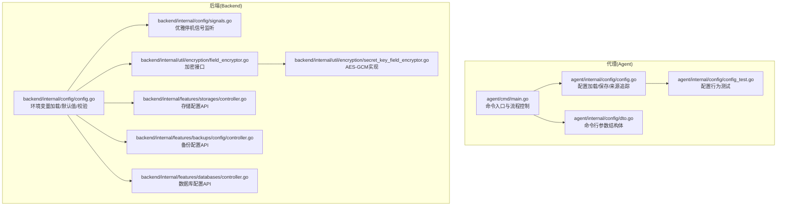
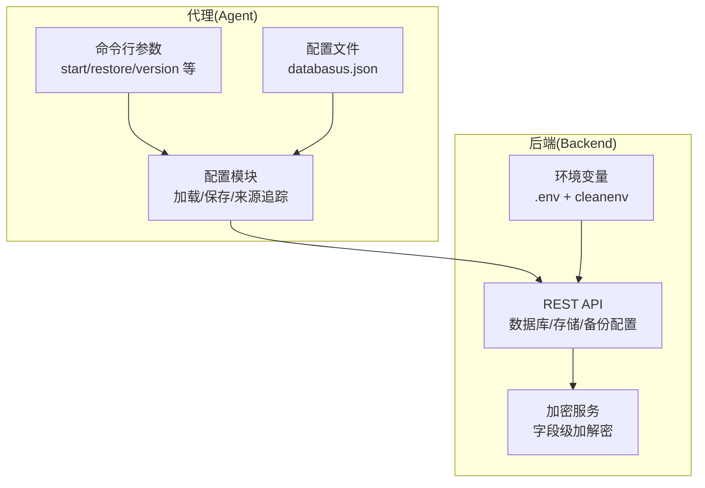
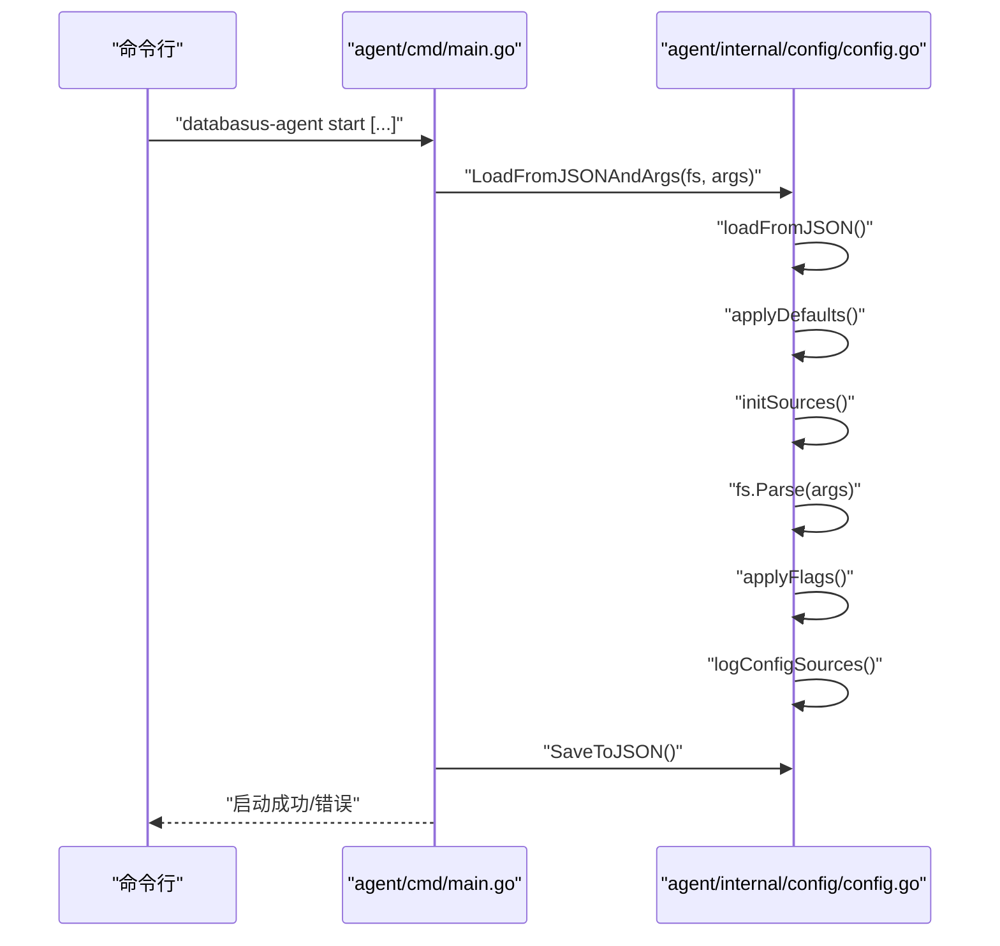
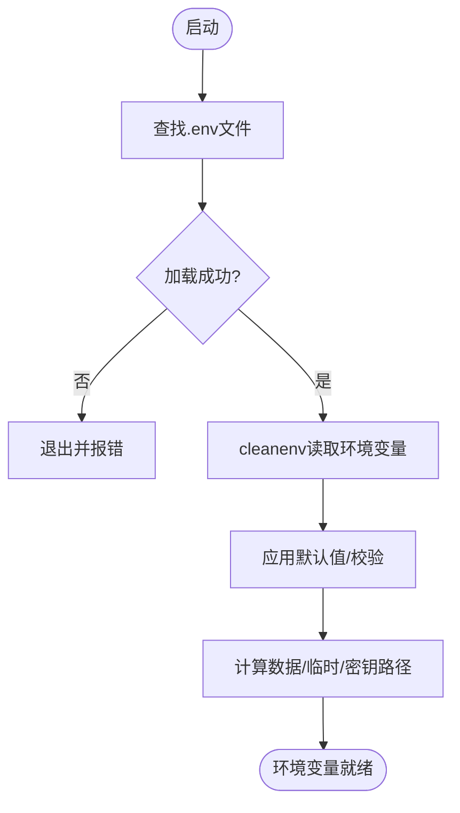
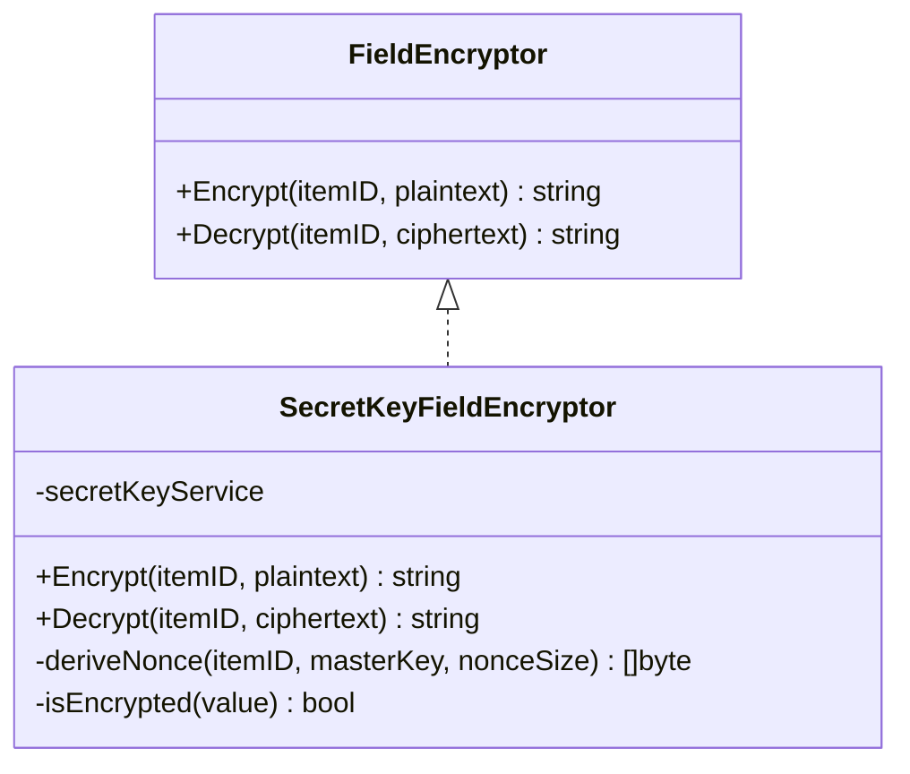
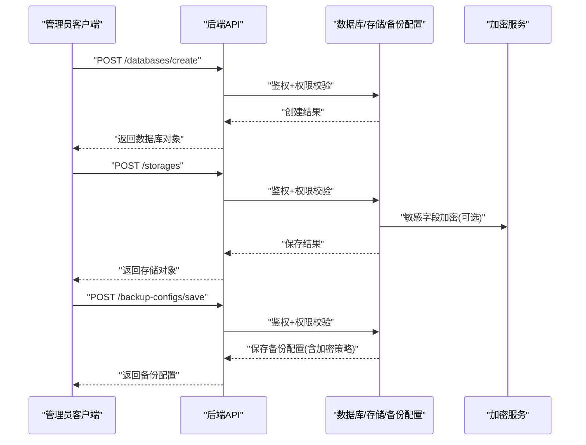
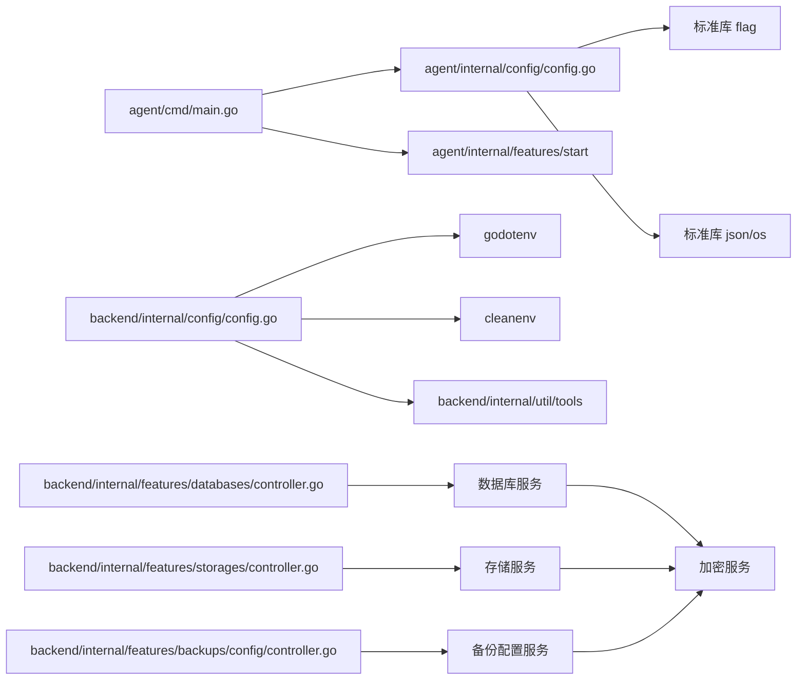

# 代理配置管理

<cite>
**本文引用的文件**
- [agent/cmd/main.go](file://agent/cmd/main.go)
- [agent/internal/config/config.go](file://agent/internal/config/config.go)
- [agent/internal/config/dto.go](file://agent/internal/config/dto.go)
- [agent/internal/config/config_test.go](file://agent/internal/config/config_test.go)
- [backend/internal/config/config.go](file://backend/internal/config/config.go)
- [backend/internal/config/signals.go](file://backend/internal/config/signals.go)
- [backend/internal/util/encryption/field_encryptor.go](file://backend/internal/util/encryption/field_encryptor.go)
- [backend/internal/util/encryption/secret_key_field_encryptor.go](file://backend/internal/util/encryption/secret_key_field_encryptor.go)
- [backend/internal/features/storages/controller.go](file://backend/internal/features/storages/controller.go)
- [backend/internal/features/backups/config/controller.go](file://backend/internal/features/backups/config/controller.go)
- [backend/internal/features/databases/controller.go](file://backend/internal/features/databases/controller.go)
</cite>

## 目录
1. [简介](#简介)
2. [项目结构](#项目结构)
3. [核心组件](#核心组件)
4. [架构总览](#架构总览)
5. [详细组件分析](#详细组件分析)
6. [依赖分析](#依赖分析)
7. [性能考虑](#性能考虑)
8. [故障排查指南](#故障排查指南)
9. [结论](#结论)
10. [附录](#附录)

## 简介
本文件面向Databasus代理（Agent）与后端（Backend）的配置管理，系统性阐述代理配置文件格式、命令行参数与环境变量解析、配置层次结构（全局、数据库特定、存储配置）、配置验证与默认值、动态更新能力、安全配置（敏感信息加密、访问控制、TLS相关）、以及最佳实践与常见场景。内容基于仓库中实际实现进行归纳总结，帮助开发者与运维人员正确、安全地部署与维护系统。

## 项目结构
- 代理侧（agent）
  - 命令入口：解析命令与子命令，加载配置并启动功能模块
  - 配置模块：读取/保存JSON配置，合并命令行参数，记录来源
- 后端侧（backend）
  - 环境变量加载：通过dotenv与cleanenv加载环境变量，含默认值与校验
  - 安全与加密：字段级加解密接口与实现
  - 配置管理API：数据库、备份配置、存储等资源的CRUD与权限控制

图表来源
- [agent/cmd/main.go:1-246](file://agent/cmd/main.go#L1-L246)
- [agent/internal/config/config.go:1-272](file://agent/internal/config/config.go#L1-L272)
- [agent/internal/config/dto.go:1-18](file://agent/internal/config/dto.go#L1-L18)
- [agent/internal/config/config_test.go:1-302](file://agent/internal/config/config_test.go#L1-L302)
- [backend/internal/config/config.go:1-422](file://backend/internal/config/config.go#L1-L422)
- [backend/internal/config/signals.go:1-24](file://backend/internal/config/signals.go#L1-L24)
- [backend/internal/util/encryption/field_encryptor.go:1-16](file://backend/internal/util/encryption/field_encryptor.go#L1-L16)
- [backend/internal/util/encryption/secret_key_field_encryptor.go:1-122](file://backend/internal/util/encryption/secret_key_field_encryptor.go#L1-L122)
- [backend/internal/features/storages/controller.go:1-200](file://backend/internal/features/storages/controller.go#L1-L200)
- [backend/internal/features/backups/config/controller.go:1-200](file://backend/internal/features/backups/config/controller.go#L1-L200)
- [backend/internal/features/databases/controller.go:1-200](file://backend/internal/features/databases/controller.go#L1-L200)

章节来源
- [agent/cmd/main.go:1-246](file://agent/cmd/main.go#L1-L246)
- [agent/internal/config/config.go:1-272](file://agent/internal/config/config.go#L1-L272)
- [agent/internal/config/dto.go:1-18](file://agent/internal/config/dto.go#L1-L18)
- [agent/internal/config/config_test.go:1-302](file://agent/internal/config/config_test.go#L1-L302)
- [backend/internal/config/config.go:1-422](file://backend/internal/config/config.go#L1-L422)
- [backend/internal/config/signals.go:1-24](file://backend/internal/config/signals.go#L1-L24)
- [backend/internal/util/encryption/field_encryptor.go:1-16](file://backend/internal/util/encryption/field_encryptor.go#L1-L16)
- [backend/internal/util/encryption/secret_key_field_encryptor.go:1-122](file://backend/internal/util/encryption/secret_key_field_encryptor.go#L1-L122)
- [backend/internal/features/storages/controller.go:1-200](file://backend/internal/features/storages/controller.go#L1-L200)
- [backend/internal/features/backups/config/controller.go:1-200](file://backend/internal/features/backups/config/controller.go#L1-L200)
- [backend/internal/features/databases/controller.go:1-200](file://backend/internal/features/databases/controller.go#L1-L200)

## 核心组件
- 代理配置模型与加载
  - 支持从JSON文件加载配置，支持命令行参数覆盖，支持默认值应用与来源追踪
  - 提供保存当前配置到JSON的能力，便于持久化
- 后端环境变量加载
  - 自动查找并加载.env文件，使用cleanenv映射到结构体
  - 多处默认值与严格校验（如ENV_MODE、DATABASE_DSN、Valkey参数等）
- 加密与安全
  - 字段级加解密接口定义与AES-GCM实现
  - 通过主密钥服务获取密钥，结合nonce派生确保同一实体ID下的可重复解密
- API与权限
  - 数据库、存储、备份配置API均包含鉴权与权限校验逻辑
  - 涵盖创建、更新、删除、连接测试、转移等操作

章节来源
- [agent/internal/config/config.go:16-115](file://agent/internal/config/config.go#L16-L115)
- [agent/internal/config/dto.go:3-17](file://agent/internal/config/dto.go#L3-L17)
- [backend/internal/config/config.go:25-146](file://backend/internal/config/config.go#L25-L146)
- [backend/internal/util/encryption/field_encryptor.go:5-15](file://backend/internal/util/encryption/field_encryptor.go#L5-L15)
- [backend/internal/util/encryption/secret_key_field_encryptor.go:20-122](file://backend/internal/util/encryption/secret_key_field_encryptor.go#L20-L122)
- [backend/internal/features/databases/controller.go:14-38](file://backend/internal/features/databases/controller.go#L14-L38)
- [backend/internal/features/storages/controller.go:14-27](file://backend/internal/features/storages/controller.go#L14-L27)
- [backend/internal/features/backups/config/controller.go:13-23](file://backend/internal/features/backups/config/controller.go#L13-L23)

## 架构总览
下图展示代理与后端在配置管理上的交互与职责边界：

图表来源
- [agent/cmd/main.go:24-75](file://agent/cmd/main.go#L24-L75)
- [agent/internal/config/config.go:33-115](file://agent/internal/config/config.go#L33-L115)
- [backend/internal/config/config.go:157-421](file://backend/internal/config/config.go#L157-L421)
- [backend/internal/features/databases/controller.go:40-110](file://backend/internal/features/databases/controller.go#L40-L110)
- [backend/internal/features/storages/controller.go:29-71](file://backend/internal/features/storages/controller.go#L29-L71)
- [backend/internal/features/backups/config/controller.go:25-60](file://backend/internal/features/backups/config/controller.go#L25-L60)
- [backend/internal/util/encryption/secret_key_field_encryptor.go:24-106](file://backend/internal/util/encryption/secret_key_field_encryptor.go#L24-L106)

## 详细组件分析

### 代理配置加载与来源追踪
- 配置来源优先级
  - JSON文件：首次加载时读取databasus.json
  - 默认值：未设置时应用合理默认（如PostgreSQL端口、类型、WAL删除策略）
  - 命令行参数：最终覆盖JSON中的对应项，并记录“来源”用于日志
- 关键行为
  - 保存配置：将当前内存中的配置写回databasus.json
  - 来源日志：输出每个配置项的值与来源（JSON或命令行），并对敏感信息做掩码
- 测试覆盖
  - 覆盖JSON加载、参数覆盖、部分参数覆盖、默认值应用、PG相关字段加载与保存等场景

图表来源
- [agent/cmd/main.go:50-75](file://agent/cmd/main.go#L50-L75)
- [agent/internal/config/config.go:33-115](file://agent/internal/config/config.go#L33-L115)
- [agent/internal/config/config.go:179-261](file://agent/internal/config/config.go#L179-L261)

章节来源
- [agent/internal/config/config.go:16-115](file://agent/internal/config/config.go#L16-L115)
- [agent/internal/config/config.go:179-261](file://agent/internal/config/config.go#L179-L261)
- [agent/internal/config/config_test.go:13-230](file://agent/internal/config/config_test.go#L13-L230)

### 后端环境变量加载与校验
- .env加载策略
  - 在当前工作目录与向上遍历至go.mod所在目录寻找.env
  - 成功加载后使用cleanenv读取映射到结构体
- 默认值与校验
  - ENV_MODE必须为development或production
  - DATABASE_DSN、Valkey主机/端口等关键参数为空则直接退出
  - 多个布尔与数值型参数提供默认值
- 特殊覆盖
  - 支持危险模式的外部数据库/Valkey覆盖变量
- 其他
  - 计算数据与临时目录路径、节点模式默认值、测试端口校验等

图表来源
- [backend/internal/config/config.go:157-421](file://backend/internal/config/config.go#L157-L421)

章节来源
- [backend/internal/config/config.go:157-421](file://backend/internal/config/config.go#L157-L421)

### 加密接口与实现
- 接口设计
  - 定义字段级加解密接口，支持空字符串与已加密字符串的透明处理
- AES-GCM实现
  - 使用主密钥服务获取密钥，派生nonce（基于实体ID与密钥），使用GCM模式加解密
  - 密文前缀标识已加密，解密时先判断格式再处理
- 应用场景
  - 可用于存储敏感字段（如令牌、密码、连接串等）在数据库中的持久化

图表来源
- [backend/internal/util/encryption/field_encryptor.go:5-15](file://backend/internal/util/encryption/field_encryptor.go#L5-L15)
- [backend/internal/util/encryption/secret_key_field_encryptor.go:20-122](file://backend/internal/util/encryption/secret_key_field_encryptor.go#L20-L122)

章节来源
- [backend/internal/util/encryption/field_encryptor.go:5-15](file://backend/internal/util/encryption/field_encryptor.go#L5-L15)
- [backend/internal/util/encryption/secret_key_field_encryptor.go:24-106](file://backend/internal/util/encryption/secret_key_field_encryptor.go#L24-L106)

### API与权限控制（数据库/存储/备份配置）
- 数据库配置API
  - 创建/更新/删除/查询/连接测试/复制/只读用户等
  - 包含鉴权中间件与工作区权限校验
- 存储配置API
  - 保存/查询/删除/连接测试/工作区转移
  - 包含权限不足与本地存储限制等错误处理
- 备份配置API
  - 保存备份配置（含加密策略枚举）、按数据库查询、存储使用情况统计、数据库转移

图表来源
- [backend/internal/features/databases/controller.go:40-110](file://backend/internal/features/databases/controller.go#L40-L110)
- [backend/internal/features/storages/controller.go:29-71](file://backend/internal/features/storages/controller.go#L29-L71)
- [backend/internal/features/backups/config/controller.go:25-60](file://backend/internal/features/backups/config/controller.go#L25-L60)
- [backend/internal/util/encryption/secret_key_field_encryptor.go:24-56](file://backend/internal/util/encryption/secret_key_field_encryptor.go#L24-L56)

章节来源
- [backend/internal/features/databases/controller.go:14-38](file://backend/internal/features/databases/controller.go#L14-L38)
- [backend/internal/features/storages/controller.go:14-27](file://backend/internal/features/storages/controller.go#L14-L27)
- [backend/internal/features/backups/config/controller.go:13-23](file://backend/internal/features/backups/config/controller.go#L13-L23)

## 依赖分析
- 代理配置模块
  - 依赖flag解析命令行参数，依赖slog记录日志，依赖JSON编解码
  - 与命令入口紧密耦合，负责将配置传递给后续启动流程
- 后端环境变量模块
  - 依赖godotenv加载.env，依赖cleanenv映射结构体
  - 依赖工具模块进行数据库安装路径校验
- 加密模块
  - 依赖主密钥服务获取密钥，依赖标准库crypto/*与base64编码
- API控制器
  - 依赖Gin路由框架、JWT中间件、工作区/用户服务、业务服务

图表来源
- [agent/internal/config/config.go:3-12](file://agent/internal/config/config.go#L3-L12)
- [agent/cmd/main.go:3-20](file://agent/cmd/main.go#L3-L20)
- [backend/internal/config/config.go:3-16](file://backend/internal/config/config.go#L3-L16)
- [backend/internal/features/databases/controller.go:1-18](file://backend/internal/features/databases/controller.go#L1-L18)
- [backend/internal/features/storages/controller.go:1-17](file://backend/internal/features/storages/controller.go#L1-L17)
- [backend/internal/features/backups/config/controller.go:1-15](file://backend/internal/features/backups/config/controller.go#L1-L15)

章节来源
- [agent/internal/config/config.go:3-12](file://agent/internal/config/config.go#L3-L12)
- [agent/cmd/main.go:3-20](file://agent/cmd/main.go#L3-L20)
- [backend/internal/config/config.go:3-16](file://backend/internal/config/config.go#L3-L16)
- [backend/internal/features/databases/controller.go:1-18](file://backend/internal/features/databases/controller.go#L1-L18)
- [backend/internal/features/storages/controller.go:1-17](file://backend/internal/features/storages/controller.go#L1-L17)
- [backend/internal/features/backups/config/controller.go:1-15](file://backend/internal/features/backups/config/controller.go#L1-L15)

## 性能考虑
- 配置加载
  - JSON读取与反序列化开销极低；默认值与来源追踪为常量时间操作
  - 建议仅在启动阶段加载一次，避免频繁I/O
- 环境变量加载
  - dotenv读取与cleanenv映射为一次性初始化；建议在进程启动时完成
- 加密性能
  - AES-GCM加解密成本与数据大小线性相关；对大字段建议分批处理或异步化
- API响应
  - 连接测试与存储/数据库操作可能涉及外部资源，建议设置超时与重试策略

## 故障排查指南
- 代理配置问题
  - 无法读取databasus.json：检查文件是否存在与权限；查看日志提示
  - 参数覆盖无效：确认命令行参数拼写与位置；检查来源日志
  - 保存失败：检查写入权限与磁盘空间
- 后端环境变量问题
  - .env未加载：确认路径存在且包含所需键；查看加载日志
  - 校验失败：根据错误提示补齐DATABASE_DSN、ENV_MODE、Valkey参数等
- 加密问题
  - 解密失败：确认密文格式、主密钥服务可用、实体ID一致
- API权限问题
  - 401/403：确认JWT有效、用户角色与工作区权限
  - 400：检查请求体格式与必填字段

章节来源
- [agent/internal/config/config.go:81-101](file://agent/internal/config/config.go#L81-L101)
- [agent/internal/config/config.go:236-261](file://agent/internal/config/config.go#L236-L261)
- [backend/internal/config/config.go:184-203](file://backend/internal/config/config.go#L184-L203)
- [backend/internal/util/encryption/secret_key_field_encryptor.go:58-106](file://backend/internal/util/encryption/secret_key_field_encryptor.go#L58-L106)
- [backend/internal/features/storages/controller.go:60-68](file://backend/internal/features/storages/controller.go#L60-L68)
- [backend/internal/features/backups/config/controller.go:53-57](file://backend/internal/features/backups/config/controller.go#L53-L57)

## 结论
Databasus的配置管理在代理侧以JSON为主、命令行为辅，具备清晰的来源追踪与默认值策略；在后端侧通过.env与cleanenv实现集中式环境变量管理，并提供严格的默认值与校验。加密模块采用AES-GCM与主密钥服务，满足字段级敏感信息保护需求。API层通过鉴权与权限控制保障资源安全。整体设计简洁可靠，适合生产环境部署与运维。

## 附录

### 配置层次结构与示例
- 全局配置（代理）
  - 服务器地址、数据库ID、代理令牌、WAL目录、是否上传后删除WAL等
  - 示例：databasusHost、dbId、token、pgWalDir、deleteWalAfterUpload
- 数据库特定配置（后端API）
  - 数据库连接参数、备份策略、加密选项、只读用户、连接测试等
  - 示例：数据库对象、备份配置对象、存储对象
- 存储配置（后端API）
  - 各类云/本地存储参数、连接测试、工作区归属、转移操作等
  - 示例：S3/Azure/FTP/NAS/SFTP/Rclone等存储模型

章节来源
- [agent/internal/config/config.go:16-31](file://agent/internal/config/config.go#L16-L31)
- [backend/internal/features/databases/controller.go:40-110](file://backend/internal/features/databases/controller.go#L40-L110)
- [backend/internal/features/backups/config/controller.go:25-60](file://backend/internal/features/backups/config/controller.go#L25-L60)
- [backend/internal/features/storages/controller.go:29-71](file://backend/internal/features/storages/controller.go#L29-L71)

### 配置验证与默认值
- 代理
  - 默认端口、默认pgType、默认WAL删除策略
  - 来源追踪与敏感信息掩码日志
- 后端
  - ENV_MODE校验、DATABASE_DSN/Valkey参数校验、默认值与测试端口校验

章节来源
- [agent/internal/config/config.go:103-115](file://agent/internal/config/config.go#L103-L115)
- [agent/internal/config/config.go:236-261](file://agent/internal/config/config.go#L236-L261)
- [backend/internal/config/config.go:240-248](file://backend/internal/config/config.go#L240-L248)
- [backend/internal/config/config.go:295-324](file://backend/internal/config/config.go#L295-L324)

### 动态更新与运行时调整
- 代理
  - 通过命令行参数覆盖JSON配置；启动后不支持热重载，需重启生效
- 后端
  - 环境变量在启动时加载；可通过重启容器/进程应用新配置
  - 优雅停机信号监听可用于平滑关闭

章节来源
- [agent/cmd/main.go:50-75](file://agent/cmd/main.go#L50-L75)
- [backend/internal/config/signals.go:11-23](file://backend/internal/config/signals.go#L11-L23)

### 安全配置要点
- 敏感信息加密
  - 字段级加解密接口与AES-GCM实现，密文前缀标识
- 访问控制
  - API均包含鉴权中间件与工作区权限校验
- TLS与连接
  - 后端环境变量中存在与TLS相关的开关（如跳过验证），请按需配置并遵循最小暴露原则

章节来源
- [backend/internal/util/encryption/secret_key_field_encryptor.go:18-56](file://backend/internal/util/encryption/secret_key_field_encryptor.go#L18-L56)
- [backend/internal/features/databases/controller.go:40-110](file://backend/internal/features/databases/controller.go#L40-L110)
- [backend/internal/features/storages/controller.go:29-71](file://backend/internal/features/storages/controller.go#L29-L71)
- [backend/internal/features/backups/config/controller.go:25-60](file://backend/internal/features/backups/config/controller.go#L25-L60)
- [backend/internal/config/config.go:137-146](file://backend/internal/config/config.go#L137-L146)