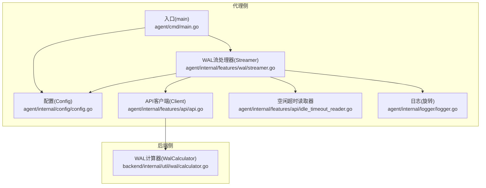
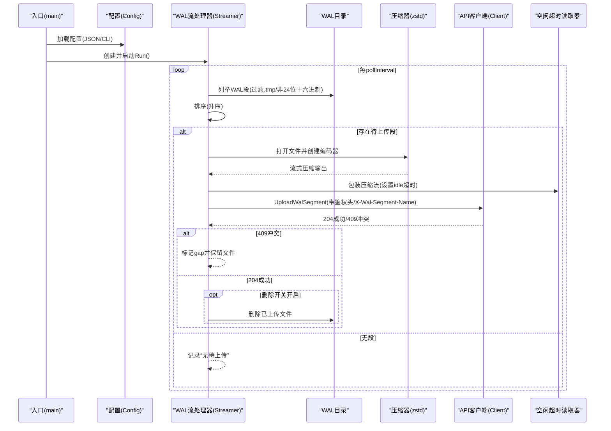
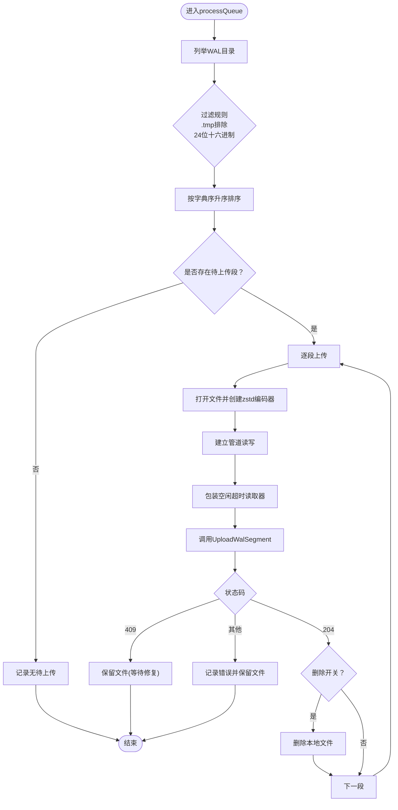
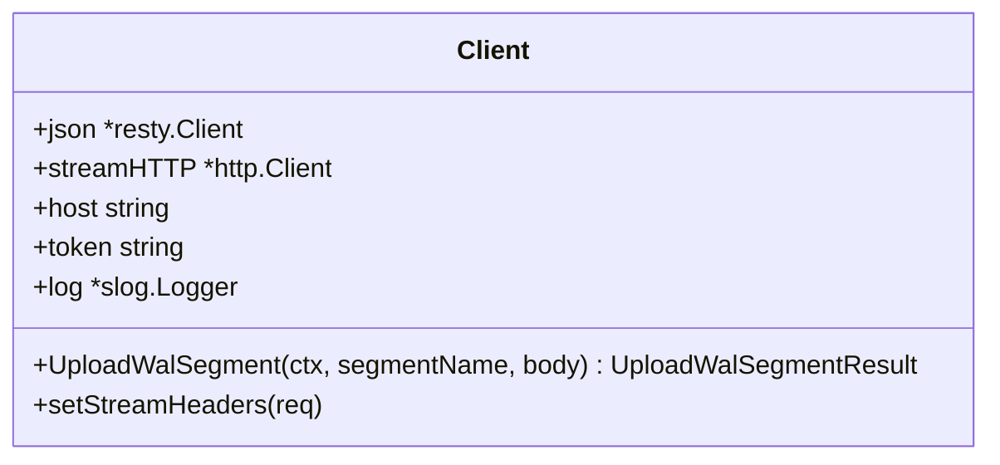
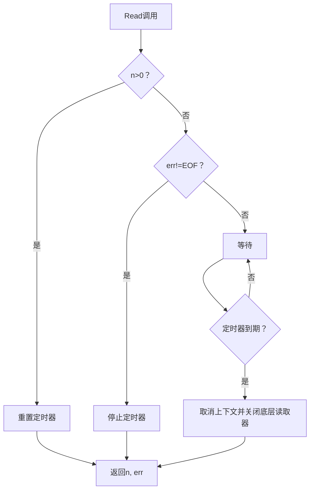
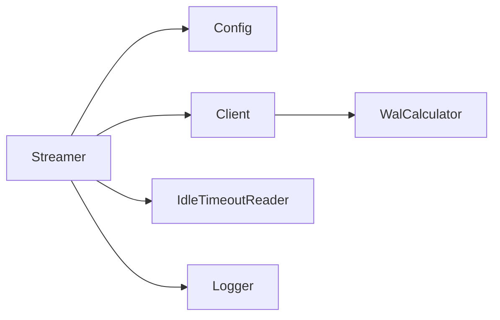
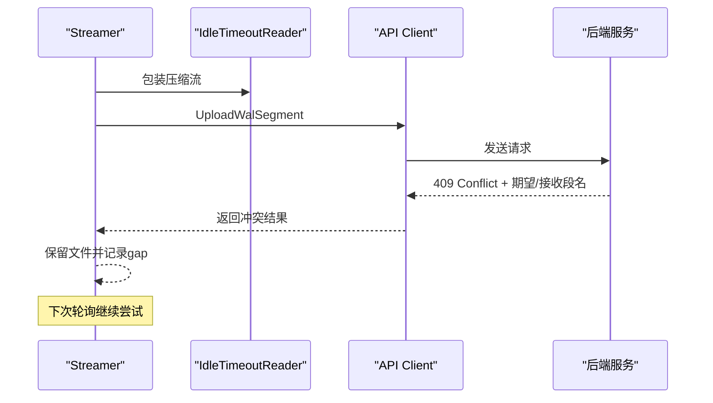

# WAL流处理

<cite>
**本文引用的文件**
- [agent/internal/features/wal/streamer.go](file://agent/internal/features/wal/streamer.go)
- [agent/internal/features/wal/streamer_test.go](file://agent/internal/features/wal/streamer_test.go)
- [agent/internal/config/config.go](file://agent/internal/config/config.go)
- [agent/internal/features/api/api.go](file://agent/internal/features/api/api.go)
- [agent/internal/features/api/idle_timeout_reader.go](file://agent/internal/features/api/idle_timeout_reader.go)
- [agent/cmd/main.go](file://agent/cmd/main.go)
- [agent/internal/logger/logger.go](file://agent/internal/logger/logger.go)
- [backend/internal/util/wal/calculator.go](file://backend/internal/util/wal/calculator.go)
</cite>

## 目录
1. [简介](#简介)
2. [项目结构](#项目结构)
3. [核心组件](#核心组件)
4. [架构总览](#架构总览)
5. [详细组件分析](#详细组件分析)
6. [依赖分析](#依赖分析)
7. [性能考虑](#性能考虑)
8. [故障排查指南](#故障排查指南)
9. [结论](#结论)
10. [附录](#附录)

## 简介
本文件面向Databasus代理的WAL流处理能力，系统性阐述WAL归档与流式传输的实现机制，覆盖文件监控、增量传输、断点续传、完整性校验、安全机制（认证、传输加密）、性能优化（压缩、批量、并发）、错误处理（网络中断、存储失败、数据损坏）以及监控与调试（idle超时、进度跟踪、错误报告）。内容基于仓库中实际代码进行分析，确保技术细节可追溯至具体源码位置。

## 项目结构
围绕WAL流处理的相关模块主要分布在agent侧的配置、API客户端、WAL流处理器以及日志轮转；后端侧提供WAL段名计算工具以辅助链路一致性判断。

**图表来源**
- [agent/internal/config/config.go:16-31](file://agent/internal/config/config.go#L16-L31)
- [agent/internal/features/api/api.go:36-42](file://agent/internal/features/api/api.go#L36-L42)
- [agent/internal/features/api/idle_timeout_reader.go:16-21](file://agent/internal/features/api/idle_timeout_reader.go#L16-L21)
- [agent/internal/features/wal/streamer.go:30-42](file://agent/internal/features/wal/streamer.go#L30-L42)
- [agent/internal/logger/logger.go:67-92](file://agent/internal/logger/logger.go#L67-L92)
- [agent/cmd/main.go:24-48](file://agent/cmd/main.go#L24-L48)
- [backend/internal/util/wal/calculator.go:27-43](file://backend/internal/util/wal/calculator.go#L27-L43)

**章节来源**
- [agent/internal/config/config.go:16-115](file://agent/internal/config/config.go#L16-L115)
- [agent/internal/features/api/api.go:36-70](file://agent/internal/features/api/api.go#L36-L70)
- [agent/internal/features/api/idle_timeout_reader.go:16-41](file://agent/internal/features/api/idle_timeout_reader.go#L16-L41)
- [agent/internal/features/wal/streamer.go:30-61](file://agent/internal/features/wal/streamer.go#L30-L61)
- [agent/internal/logger/logger.go:67-92](file://agent/internal/logger/logger.go#L67-L92)
- [agent/cmd/main.go:24-48](file://agent/cmd/main.go#L24-L48)
- [backend/internal/util/wal/calculator.go:27-43](file://backend/internal/util/wal/calculator.go#L27-L43)

## 核心组件
- 配置(Config): 负责加载/保存JSON配置、解析命令行参数、设置默认值、记录配置来源与敏感信息掩码。
- API客户端(Client): 提供REST与流式上传接口，支持重试、鉴权头注入、WAL段上传、链路有效性检查等。
- 空闲超时读取器(IdleTimeoutReader): 包装io.Reader，在指定时间内无数据传输则取消上下文并关闭底层读取器，用于检测网络或上游停滞。
- WAL流处理器(Streamer): 周期扫描WAL目录、按序上传zstd压缩后的WAL段，支持删除策略、gap检测、idle超时处理。
- 日志(旋转): 提供带大小限制的日志轮转，便于生产环境问题定位。
- 入口(main): 启动命令分发，调用启动流程并执行守护进程。

**章节来源**
- [agent/internal/config/config.go:35-115](file://agent/internal/config/config.go#L35-L115)
- [agent/internal/features/api/api.go:44-70](file://agent/internal/features/api/api.go#L44-L70)
- [agent/internal/features/api/idle_timeout_reader.go:25-41](file://agent/internal/features/api/idle_timeout_reader.go#L25-L41)
- [agent/internal/features/wal/streamer.go:36-61](file://agent/internal/features/wal/streamer.go#L36-L61)
- [agent/internal/logger/logger.go:67-92](file://agent/internal/logger/logger.go#L67-L92)
- [agent/cmd/main.go:50-75](file://agent/cmd/main.go#L50-L75)

## 架构总览
WAL流处理采用“轮询扫描 + 流式压缩上传”的模式：代理周期性扫描WAL目录，对满足条件的段进行zstd压缩并通过HTTP流式发送到后端。上传过程包含鉴权头、空闲超时检测、gap冲突处理与可选的本地删除策略。

**图表来源**
- [agent/internal/features/wal/streamer.go:44-90](file://agent/internal/features/wal/streamer.go#L44-L90)
- [agent/internal/features/wal/streamer.go:123-173](file://agent/internal/features/wal/streamer.go#L123-L173)
- [agent/internal/features/wal/streamer.go:175-204](file://agent/internal/features/wal/streamer.go#L175-L204)
- [agent/internal/features/api/api.go:200-242](file://agent/internal/features/api/api.go#L200-L242)
- [agent/internal/features/api/idle_timeout_reader.go:25-41](file://agent/internal/features/api/idle_timeout_reader.go#L25-L41)

## 详细组件分析

### WAL流处理器(Streamer)
- 职责
  - 定时轮询WAL目录，识别可上传段（排除.tmp、仅接受24位十六进制文件名）。
  - 对段进行zstd压缩并以流式方式上传，设置上传超时与空闲超时。
  - 处理后端返回的冲突响应（gap检测），保留文件等待后续修复。
  - 可选删除已成功上传的本地文件。
- 关键行为
  - 列表与排序：按字典序升序保证连续性。
  - 压缩：使用固定压缩等级与CRC校验，避免额外元数据开销。
  - 上传：设置Content-Type与自定义头部X-Wal-Segment-Name，便于后端识别。
  - 错误处理：区分idle超时、网络错误与业务冲突，分别采取不同策略。
- 并发与批量
  - 单个段内使用单goroutine压缩与上传；多段按顺序串行上传，避免乱序导致的gap。
  - 通过轮询间隔平衡吞吐与资源占用。

**图表来源**
- [agent/internal/features/wal/streamer.go:92-121](file://agent/internal/features/wal/streamer.go#L92-L121)
- [agent/internal/features/wal/streamer.go:123-173](file://agent/internal/features/wal/streamer.go#L123-L173)
- [agent/internal/features/wal/streamer.go:175-204](file://agent/internal/features/wal/streamer.go#L175-L204)
- [agent/internal/features/api/api.go:200-242](file://agent/internal/features/api/api.go#L200-L242)

**章节来源**
- [agent/internal/features/wal/streamer.go:44-90](file://agent/internal/features/wal/streamer.go#L44-L90)
- [agent/internal/features/wal/streamer.go:92-121](file://agent/internal/features/wal/streamer.go#L92-L121)
- [agent/internal/features/wal/streamer.go:123-173](file://agent/internal/features/wal/streamer.go#L123-L173)
- [agent/internal/features/wal/streamer.go:175-204](file://agent/internal/features/wal/streamer.go#L175-L204)

### API客户端(Client)
- 职责
  - 提供REST与流式上传两类接口，统一注入Authorization头。
  - WAL段上传：POST /api/v1/.../wal/upload/wal，设置Content-Type与X-Wal-Segment-Name。
  - 冲突响应解析：当后端返回409时，解析期望段名与接收段名，驱动前端gap修复。
- 重试与超时
  - REST请求具备最大重试次数与基础退避，服务端5xx自动重试。
  - 上传请求使用独立HTTP客户端，避免内存缓冲带来的大对象压力。

**图表来源**
- [agent/internal/features/api/api.go:36-70](file://agent/internal/features/api/api.go#L36-L70)
- [agent/internal/features/api/api.go:200-242](file://agent/internal/features/api/api.go#L200-L242)

**章节来源**
- [agent/internal/features/api/api.go:36-70](file://agent/internal/features/api/api.go#L36-L70)
- [agent/internal/features/api/api.go:200-242](file://agent/internal/features/api/api.go#L200-L242)

### 空闲超时读取器(IdleTimeoutReader)
- 职责
  - 在指定时间内未读取到任何字节时触发取消，同时尝试关闭底层读取器以解除阻塞。
  - 每次成功读取会重置定时器，避免正常传输被误判。
- 应用场景
  - 检测网络拥塞、对端不发送、上游文件卡住等导致的“假死”上传。

**图表来源**
- [agent/internal/features/api/idle_timeout_reader.go:43-60](file://agent/internal/features/api/idle_timeout_reader.go#L43-L60)

**章节来源**
- [agent/internal/features/api/idle_timeout_reader.go:10-41](file://agent/internal/features/api/idle_timeout_reader.go#L10-L41)
- [agent/internal/features/api/idle_timeout_reader.go:43-60](file://agent/internal/features/api/idle_timeout_reader.go#L43-L60)

### 配置(Config)
- 职责
  - 从JSON与命令行加载配置，应用默认值，记录各字段来源，掩码敏感信息。
  - 关键WAL相关字段：DatabasusHost、DbID、Token、PgWalDir、IsDeleteWalAfterUpload。
- 默认策略
  - 未显式配置时，默认删除上传后的WAL文件，降低磁盘占用。

**章节来源**
- [agent/internal/config/config.go:16-31](file://agent/internal/config/config.go#L16-L31)
- [agent/internal/config/config.go:103-115](file://agent/internal/config/config.go#L103-L115)
- [agent/internal/config/config.go:236-271](file://agent/internal/config/config.go#L236-L271)

### 后端WAL计算器(WalCalculator)
- 职责
  - 提供WAL段名算术：计算下一个段名、校验段名格式、比较段名大小。
  - 支持不同段大小（默认16MB），用于链路一致性与gap修复判断。
- 用途
  - 与后端配合，确保段名序列连续，便于检测缺失或错序。

**章节来源**
- [backend/internal/util/wal/calculator.go:18-43](file://backend/internal/util/wal/calculator.go#L18-L43)
- [backend/internal/util/wal/calculator.go:45-73](file://backend/internal/util/wal/calculator.go#L45-L73)
- [backend/internal/util/wal/calculator.go:75-112](file://backend/internal/util/wal/calculator.go#L75-L112)

## 依赖分析
- 组件耦合
  - Streamer依赖Config提供后端地址、数据库标识、令牌与WAL目录路径。
  - Streamer通过API Client进行流式上传，使用IdleTimeoutReader保障稳定性。
  - 后端WAL计算器为链路一致性提供数学基础。
- 外部依赖
  - zstd压缩库用于流式压缩。
  - resty用于通用REST调用与重试。
  - 标准库net/http用于流式上传。
- 潜在循环依赖
  - 当前结构清晰，无明显循环导入。

**图表来源**
- [agent/internal/features/wal/streamer.go:36-42](file://agent/internal/features/wal/streamer.go#L36-L42)
- [agent/internal/config/config.go:16-31](file://agent/internal/config/config.go#L16-L31)
- [agent/internal/features/api/api.go:36-42](file://agent/internal/features/api/api.go#L36-L42)
- [agent/internal/features/api/idle_timeout_reader.go:16-21](file://agent/internal/features/api/idle_timeout_reader.go#L16-L21)
- [backend/internal/util/wal/calculator.go:27-43](file://backend/internal/util/wal/calculator.go#L27-L43)

**章节来源**
- [agent/internal/features/wal/streamer.go:36-42](file://agent/internal/features/wal/streamer.go#L36-L42)
- [agent/internal/config/config.go:16-31](file://agent/internal/config/config.go#L16-L31)
- [agent/internal/features/api/api.go:36-42](file://agent/internal/features/api/api.go#L36-L42)
- [agent/internal/features/api/idle_timeout_reader.go:16-21](file://agent/internal/features/api/idle_timeout_reader.go#L16-L21)
- [backend/internal/util/wal/calculator.go:27-43](file://backend/internal/util/wal/calculator.go#L27-L43)

## 性能考虑
- 压缩策略
  - 使用zstd流式压缩，设置固定压缩等级与CRC校验，兼顾压缩比与CPU开销。
- 传输模型
  - 采用HTTP流式上传，避免一次性加载整个WAL段到内存，降低峰值内存占用。
- 扫描与批处理
  - 通过轮询间隔平衡吞吐与延迟；按序串行上传，避免并发导致的乱序与重复。
- 并发控制
  - 单段内压缩与上传为单goroutine；多段间串行，避免竞争与锁开销。
- 存储清理
  - 成功上传后可选择删除本地文件，减少磁盘压力。

**章节来源**
- [agent/internal/features/wal/streamer.go:175-204](file://agent/internal/features/wal/streamer.go#L175-L204)
- [agent/internal/features/api/api.go:120-150](file://agent/internal/features/api/api.go#L120-L150)
- [agent/internal/features/wal/streamer.go:23-26](file://agent/internal/features/wal/streamer.go#L23-L26)

## 故障排查指南
- 网络中断/上传停滞
  - 现象：上传长时间无进展后失败。
  - 机制：IdleTimeoutReader在超时后取消上下文并关闭底层读取器，触发错误。
  - 处理：保持文件在队列中，待网络恢复后自动重试。
- 存储失败/权限不足
  - 现象：无法打开文件或删除文件失败。
  - 机制：打开失败直接报错；删除失败仅记录警告，不影响整体流程。
- 数据损坏/段名异常
  - 现象：非24位十六进制或临时文件名被忽略。
  - 机制：列表阶段严格过滤，避免异常文件干扰。
- Gap检测与断点续传
  - 现象：后端返回409，携带期望段名与接收段名。
  - 机制：Streamer记录gap并保留文件，等待修复后继续。
- 进度跟踪与错误报告
  - 日志：包含开始/完成、空闲超时、gap检测、删除失败等关键事件。
  - 错误上报：可通过API客户端的错误上报接口向后端报告备份错误（适用于全量备份场景）。

**图表来源**
- [agent/internal/features/wal/streamer.go:142-159](file://agent/internal/features/wal/streamer.go#L142-L159)
- [agent/internal/features/api/api.go:224-235](file://agent/internal/features/api/api.go#L224-L235)

**章节来源**
- [agent/internal/features/wal/streamer.go:123-173](file://agent/internal/features/wal/streamer.go#L123-L173)
- [agent/internal/features/api/idle_timeout_reader.go:32-38](file://agent/internal/features/api/idle_timeout_reader.go#L32-L38)
- [agent/internal/features/api/api.go:224-235](file://agent/internal/features/api/api.go#L224-L235)
- [agent/internal/features/wal/streamer_test.go:292-333](file://agent/internal/features/wal/streamer_test.go#L292-L333)

## 结论
Databasus代理的WAL流处理以“轮询扫描 + 流式压缩 + 空闲超时检测 + gap冲突处理”为核心，结合zstd压缩与可选删除策略，在保证数据完整性的同时兼顾性能与可靠性。通过严格的过滤与日志记录，能够有效应对网络波动、存储异常与链路不连续等问题。建议在生产环境中启用日志轮转与定期健康检查，配合后端的WAL计算器进行链路一致性验证。

## 附录
- 监控与调试要点
  - 观察日志：关注“WAL segments pending upload”、“Uploading WAL segment”、“WAL segment uploaded”、“WAL chain gap detected”、“Failed to delete uploaded WAL segment”等关键条目。
  - idle超时：若出现“upload idle timeout”，检查网络质量、上游文件生成速率与TCP缓冲区状态。
  - 进度跟踪：通过WAL目录中文件数量变化与日志中的段名顺序确认上传进度。
  - 错误报告：在需要时使用错误上报接口向后端反馈异常。

**章节来源**
- [agent/internal/logger/logger.go:67-92](file://agent/internal/logger/logger.go#L67-L92)
- [agent/internal/features/wal/streamer.go:142-159](file://agent/internal/features/wal/streamer.go#L142-L159)
- [agent/internal/features/api/api.go:108-118](file://agent/internal/features/api/api.go#L108-L118)