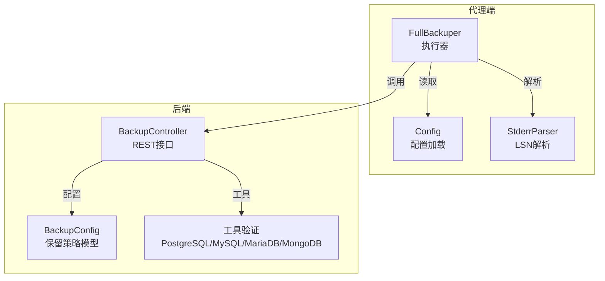
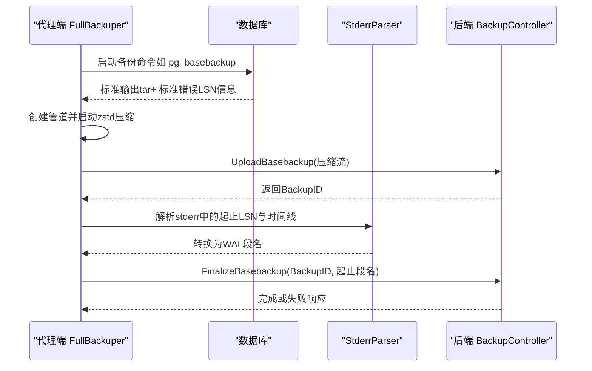
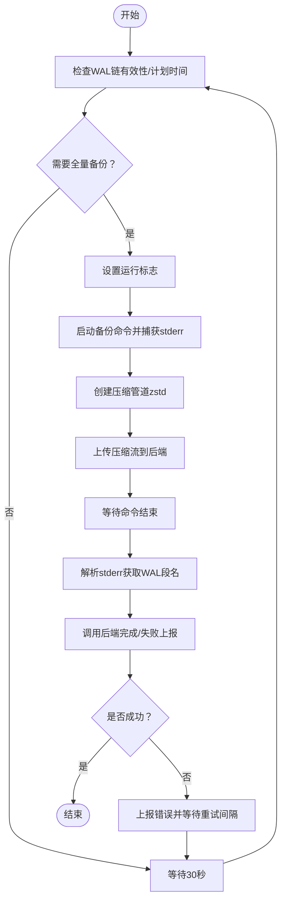
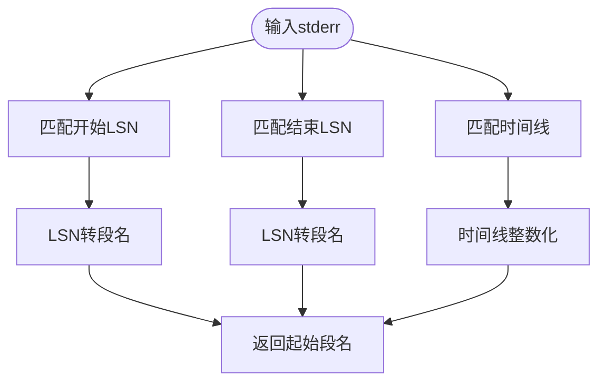
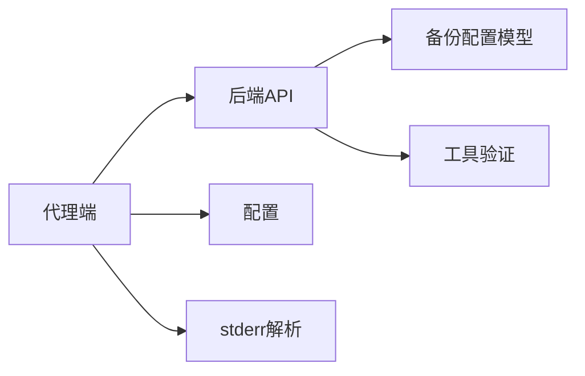

# 全量备份实现

<cite>
**本文档引用的文件**
- [agent\internal\features\full_backup\backuper.go](file://agent/internal/features/full_backup/backuper.go)
- [agent\internal\features\full_backup\stderr_parser.go](file://agent/internal/features/full_backup/stderr_parser.go)
- [agent\internal\config\config.go](file://agent/internal/config/config.go)
- [backend\internal\features\backups\config\model.go](file://backend/internal/features/backups/config/model.go)
- [backend\internal\features\backups\backups\controllers\controller.go](file://backend/internal/features/backups/backups/controllers/controller.go)
- [backend\internal\util\tools\postgresql.go](file://backend/internal/util/tools/postgresql.go)
- [backend\internal\util\tools\mysql.go](file://backend/internal/util/tools/mysql.go)
- [backend\internal\util\tools\mariadb.go](file://backend/internal/util/tools/mariadb.go)
- [backend\internal\util\tools\mongodb.go](file://backend/internal/util/tools/mongodb.go)
</cite>

## 目录
1. [简介](#简介)
2. [项目结构](#项目结构)
3. [核心组件](#核心组件)
4. [架构总览](#架构总览)
5. [详细组件分析](#详细组件分析)
6. [依赖关系分析](#依赖关系分析)
7. [性能考虑](#性能考虑)
8. [故障排除指南](#故障排除指南)
9. [结论](#结论)

## 简介
本文件面向Databasus代理的全量备份功能，系统性阐述其技术实现与运行机制。内容覆盖：
- 执行流程：数据库连接、备份命令生成、输出解析、状态跟踪
- 工具集成：PostgreSQL pg_basebackup、MySQL/MariaDB mysqldump/mariadb-dump、MongoDB mongodump 的调用方式与版本适配
- 输出解析：标准错误流处理、LSN到WAL段名转换、错误检测
- 数据处理：zstd压缩、上传到服务器、完成态与失败态上报
- 配置管理：备份参数、调度策略、保留策略
- 性能优化与故障排除：并发控制、资源管理、进度跟踪

## 项目结构
Databasus的全量备份由代理端与后端共同协作完成：
- 代理端负责实际执行数据库备份命令、压缩、上传，并与后端API交互
- 后端负责备份配置、保留策略、下载令牌、文件存储等

**图表来源**
- [agent\internal\features\full_backup\backuper.go:1-317](file://agent/internal/features/full_backup/backuper.go#L1-L317)
- [agent\internal\features\full_backup\stderr_parser.go:1-98](file://agent/internal/features/full_backup/stderr_parser.go#L1-L98)
- [agent\internal\config\config.go:1-272](file://agent/internal/config/config.go#L1-L272)
- [backend\internal\features\backups\backups\controllers\controller.go:1-399](file://backend/internal/features/backups/backups/controllers/controller.go#L1-L399)
- [backend\internal\features\backups\config\model.go:1-156](file://backend/internal/features/backups/config/model.go#L1-L156)
- [backend\internal\util\tools\postgresql.go:1-208](file://backend/internal/util/tools/postgresql.go#L1-L208)
- [backend\internal\util\tools\mysql.go:1-231](file://backend/internal/util/tools/mysql.go#L1-L231)
- [backend\internal\util\tools\mariadb.go:1-251](file://backend/internal/util/tools/mariadb.go#L1-L251)
- [backend\internal\util\tools\mongodb.go:1-179](file://backend/internal/util/tools/mongodb.go#L1-L179)

**章节来源**
- [agent\internal\features\full_backup\backuper.go:1-317](file://agent/internal/features/full_backup/backuper.go#L1-L317)
- [agent\internal\features\full_backup\stderr_parser.go:1-98](file://agent/internal/features/full_backup/stderr_parser.go#L1-L98)
- [agent\internal\config\config.go:1-272](file://agent/internal/config/config.go#L1-L272)
- [backend\internal\features\backups\backups\controllers\controller.go:1-399](file://backend/internal/features/backups/backups/controllers/controller.go#L1-L399)
- [backend\internal\features\backups\config\model.go:1-156](file://backend/internal/features/backups/config/model.go#L1-L156)
- [backend\internal\util\tools\postgresql.go:1-208](file://backend/internal/util/tools/postgresql.go#L1-L208)
- [backend\internal\util\tools\mysql.go:1-231](file://backend/internal/util/tools/mysql.go#L1-L231)
- [backend\internal\util\tools\mariadb.go:1-251](file://backend/internal/util/tools/mariadb.go#L1-L251)
- [backend\internal\util\tools\mongodb.go:1-179](file://backend/internal/util/tools/mongodb.go#L1-L179)

## 核心组件
- FullBackuper：定时检查WAL链有效性与计划备份时间，触发并执行全量备份；负责压缩、上传、错误上报与重试
- StderrParser：从pg_basebackup标准错误中解析起止LSN与时间线，换算为WAL段名
- Config：代理端配置加载与参数来源追踪
- BackupController：后端REST接口，提供备份查询、触发、取消、删除、下载等能力
- BackupConfig：备份配置模型，包含保留策略、通知、重试次数、加密等
- 工具验证模块：PostgreSQL/MySQL/MariaDB/MongoDB客户端工具路径解析与安装校验

**章节来源**
- [agent\internal\features\full_backup\backuper.go:33-52](file://agent/internal/features/full_backup/backuper.go#L33-L52)
- [agent\internal\features\full_backup\stderr_parser.go:12-16](file://agent/internal/features/full_backup/stderr_parser.go#L12-L16)
- [agent\internal\config\config.go:16-31](file://agent/internal/config/config.go#L16-L31)
- [backend\internal\features\backups\backups\controllers\controller.go:23-33](file://backend/internal/features/backups/backups/controllers/controller.go#L23-L33)
- [backend\internal\features\backups\config\model.go:16-44](file://backend/internal/features/backups/config/model.go#L16-L44)
- [backend\internal\util\tools\postgresql.go:14-32](file://backend/internal/util/tools/postgresql.go#L14-L32)
- [backend\internal\util\tools\mysql.go:23-47](file://backend/internal/util/tools/mysql.go#L23-L47)
- [backend\internal\util\tools\mariadb.go:41-80](file://backend/internal/util/tools/mariadb.go#L41-L80)
- [backend\internal\util\tools\mongodb.go:24-47](file://backend/internal/util/tools/mongodb.go#L24-L47)

## 架构总览
全量备份在代理端以周期性检查的方式触发，执行数据库命令并将输出通过管道压缩后直接上传至后端。后端负责持久化备份元数据、保留策略与下载令牌。

**图表来源**
- [agent\internal\features\full_backup\backuper.go:164-245](file://agent/internal/features/full_backup/backuper.go#L164-L245)
- [agent\internal\features\full_backup\stderr_parser.go:18-45](file://agent/internal/features/full_backup/stderr_parser.go#L18-L45)
- [backend\internal\features\backups\backups\controllers\controller.go:27-33](file://backend/internal/features/backups/backups/controllers/controller.go#L27-L33)

## 详细组件分析

### 执行器：FullBackuper
- 周期检查：每30秒检查WAL链有效性与下次全量备份时间
- 并发控制：使用原子布尔值确保同一时刻仅有一个备份任务运行
- 失败重试：默认1分钟重试间隔，可被外部覆盖；错误会上报后端
- 命令构建：支持“主机模式”与“Docker模式”，自动拼接连接参数与环境变量
- 流式上传：标准输出通过管道与zstd编码器连接，直接上传至后端；设置上传超时与空闲超时
- 结束处理：等待命令退出，解析stderr中的WAL段名，最终调用后端完成或失败上报

**图表来源**
- [agent\internal\features\full_backup\backuper.go:66-162](file://agent/internal/features/full_backup/backuper.go#L66-L162)
- [agent\internal\features\full_backup\backuper.go:164-245](file://agent/internal/features/full_backup/backuper.go#L164-L245)

**章节来源**
- [agent\internal\features\full_backup\backuper.go:66-162](file://agent/internal/features/full_backup/backuper.go#L66-L162)
- [agent\internal\features\full_backup\backuper.go:164-245](file://agent/internal/features/full_backup/backuper.go#L164-L245)
- [agent\internal\features\full_backup\backuper.go:277-317](file://agent/internal/features/full_backup/backuper.go#L277-L317)

### 输出解析：StderrParser
- 正则匹配：从stderr中提取“写入开始LSN”“写入结束LSN”“时间线”
- 时间线解析：若缺失则回退为1
- LSN转段名：根据LSN与WAL段大小计算段名，格式为“时间线高32位/低32位/段偏移”

**图表来源**
- [agent\internal\features\full_backup\stderr_parser.go:18-45](file://agent/internal/features/full_backup/stderr_parser.go#L18-L45)
- [agent\internal\features\full_backup\stderr_parser.go:63-78](file://agent/internal/features/full_backup/stderr_parser.go#L63-L78)

**章节来源**
- [agent\internal\features\full_backup\stderr_parser.go:18-45](file://agent/internal/features/full_backup/stderr_parser.go#L18-L45)
- [agent\internal\features\full_backup\stderr_parser.go:63-78](file://agent/internal/features/full_backup/stderr_parser.go#L63-L78)

### 配置管理：Config
- 支持从JSON文件与命令行参数加载配置
- 默认值：PostgreSQL端口默认5432，类型默认host，WAL删除策略默认启用
- 参数来源追踪：记录每个配置项来自JSON还是命令行，便于审计与排障

**章节来源**
- [agent\internal\config\config.go:33-115](file://agent/internal/config/config.go#L33-L115)
- [agent\internal\config\config.go:236-272](file://agent/internal/config/config.go#L236-L272)

### 后端控制器：BackupController
- 提供备份查询、触发、取消、删除、下载等REST接口
- 下载令牌：生成短期有效令牌，限制单用户并发下载
- 文件扩展名：根据数据库类型选择扩展名（如.sql.zst、.dump、.archive）

**章节来源**
- [backend\internal\features\backups\backups\controllers\controller.go:27-33](file://backend/internal/features/backups/backups/controllers/controller.go#L27-L33)
- [backend\internal\features\backups\backups\controllers\controller.go:322-352](file://backend/internal/features/backups/backups/controllers/controller.go#L322-L352)

### 备份配置模型：BackupConfig
- 包含启用开关、保留策略类型（按时间、数量、GFS）、通知类型、重试策略、加密选项
- 校验规则：保留策略字段合法性、重试次数必须大于0、云存储下必须加密

**章节来源**
- [backend\internal\features\backups\config\model.go:16-44](file://backend/internal/features/backups/config/model.go#L16-L44)
- [backend\internal\features\backups\config\model.go:83-108](file://backend/internal/features/backups/config/model.go#L83-L108)
- [backend\internal\features\backups\config\model.go:132-155](file://backend/internal/features/backups/config/model.go#L132-L155)

### 工具集成与版本适配
- PostgreSQL：按版本定位pg_dump、psql等工具，开发/生产环境路径不同
- MySQL：支持5.7、8.0、8.4、9，按版本定位mysqldump/mysql
- MariaDB：根据服务器版本选择10.6（兼容旧版）或12.1（现代），定位mariadb-dump/mariadb
- MongoDB：统一客户端工具目录，支持mongodump/mongorestore

**章节来源**
- [backend\internal\util\tools\postgresql.go:39-166](file://backend/internal/util/tools/postgresql.go#L39-L166)
- [backend\internal\util\tools\mysql.go:49-176](file://backend/internal/util/tools/mysql.go#L49-L176)
- [backend\internal\util\tools\mariadb.go:82-179](file://backend/internal/util/tools/mariadb.go#L82-L179)
- [backend\internal\util\tools\mongodb.go:49-126](file://backend/internal/util/tools/mongodb.go#L49-L126)

## 依赖关系分析
- 代理端依赖后端API进行上传、完成上报、错误上报
- 代理端依赖配置模块读取数据库连接参数与行为开关
- 代理端依赖stderr解析模块将LSN转换为WAL段名
- 后端依赖工具验证模块确保各数据库客户端可用
- 后端依赖备份配置模型进行保留策略与通知控制

**图表来源**
- [agent\internal\features\full_backup\backuper.go:1-317](file://agent/internal/features/full_backup/backuper.go#L1-L317)
- [agent\internal\features\full_backup\stderr_parser.go:1-98](file://agent/internal/features/full_backup/stderr_parser.go#L1-L98)
- [agent\internal\config\config.go:1-272](file://agent/internal/config/config.go#L1-L272)
- [backend\internal\features\backups\backups\controllers\controller.go:1-399](file://backend/internal/features/backups/backups/controllers/controller.go#L1-L399)
- [backend\internal\features\backups\config\model.go:1-156](file://backend/internal/features/backups/config/model.go#L1-L156)
- [backend\internal\util\tools\postgresql.go:1-208](file://backend/internal/util/tools/postgresql.go#L1-L208)
- [backend\internal\util\tools\mysql.go:1-231](file://backend/internal/util/tools/mysql.go#L1-L231)
- [backend\internal\util\tools\mariadb.go:1-251](file://backend/internal/util/tools/mariadb.go#L1-L251)
- [backend\internal\util\tools\mongodb.go:1-179](file://backend/internal/util/tools/mongodb.go#L1-L179)

**章节来源**
- [agent\internal\features\full_backup\backuper.go:1-317](file://agent/internal/features/full_backup/backuper.go#L1-L317)
- [agent\internal\features\full_backup\stderr_parser.go:1-98](file://agent/internal/features/full_backup/stderr_parser.go#L1-L98)
- [agent\internal\config\config.go:1-272](file://agent/internal/config/config.go#L1-L272)
- [backend\internal\features\backups\backups\controllers\controller.go:1-399](file://backend/internal/features/backups/backups/controllers/controller.go#L1-L399)
- [backend\internal\features\backups\config\model.go:1-156](file://backend/internal/features/backups/config/model.go#L1-L156)
- [backend\internal\util\tools\postgresql.go:1-208](file://backend/internal/util/tools/postgresql.go#L1-L208)
- [backend\internal\util\tools\mysql.go:1-231](file://backend/internal/util/tools/mysql.go#L1-L231)
- [backend\internal\util\tools\mariadb.go:1-251](file://backend/internal/util/tools/mariadb.go#L1-L251)
- [backend\internal\util\tools\mongodb.go:1-179](file://backend/internal/util/tools/mongodb.go#L1-L179)

## 性能考虑
- 压缩级别：zstd编码器采用固定压缩等级，兼顾速度与压缩比
- 上传超时与空闲超时：避免长时间阻塞，提升资源回收效率
- 并发控制：单实例仅允许一个备份任务运行，防止资源争用
- 进度跟踪：stderr解析提供WAL段范围，可用于估算进度与完整性
- 工具版本：按数据库版本选择对应客户端工具，减少兼容性问题导致的性能损耗

[本节为通用指导，无需列出具体文件来源]

## 故障排除指南
- WAL链无效或缺失：代理端会触发立即全量备份；检查数据库连接参数与权限
- 计划时间已过：确认后端调度配置与系统时间
- 上传失败：检查网络连通性、后端API可达性、上传超时设置；查看stderr错误信息
- 命令退出错误：解析stderr中的错误文本并上报后端；核对数据库连接与认证
- 重试策略：默认1分钟重试，可通过外部配置覆盖；关注错误日志与通知
- 下载冲突：后端对单用户并发下载有保护，避免重复下载造成资源浪费

**章节来源**
- [agent\internal\features\full_backup\backuper.go:85-124](file://agent/internal/features/full_backup/backuper.go#L85-L124)
- [agent\internal\features\full_backup\backuper.go:126-162](file://agent/internal/features/full_backup/backuper.go#L126-L162)
- [agent\internal\features\full_backup\backuper.go:164-245](file://agent/internal/features/full_backup/backuper.go#L164-L245)
- [backend\internal\features\backups\backups\controllers\controller.go:222-320](file://backend/internal/features/backups/backups/controllers/controller.go#L222-L320)

## 结论
Databasus的全量备份通过代理端与后端的协同，实现了从命令执行、流式压缩上传到元数据管理与保留策略的完整闭环。通过对不同数据库工具的版本适配、严格的错误处理与重试机制、以及对WAL段范围的精确解析，系统在保证可靠性的同时兼顾了性能与可观测性。建议在生产环境中结合保留策略与通知机制，持续监控备份健康状况并优化资源使用。