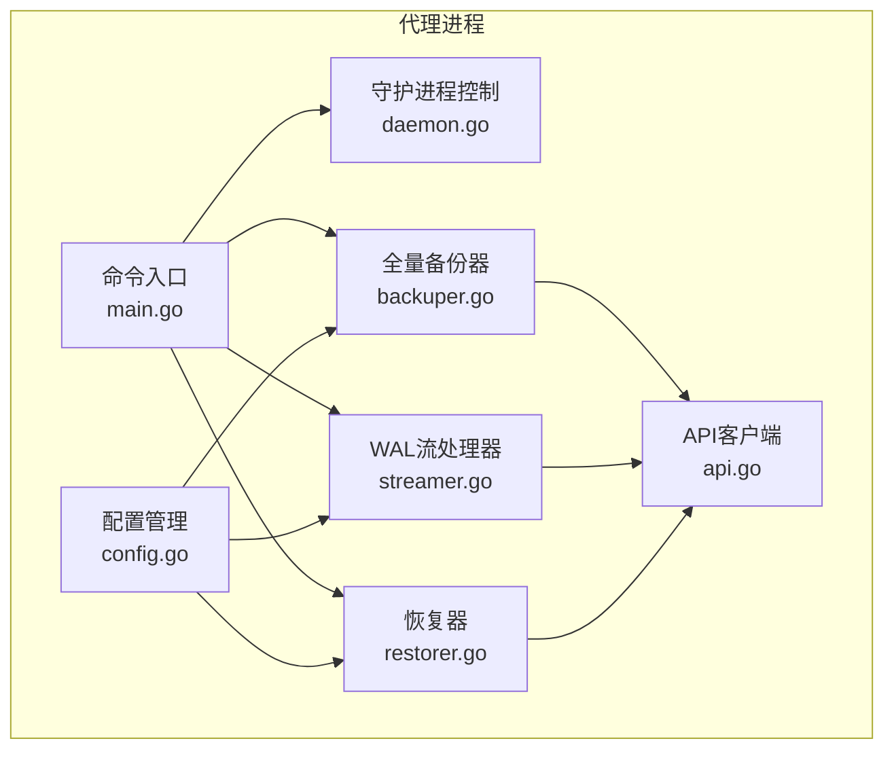
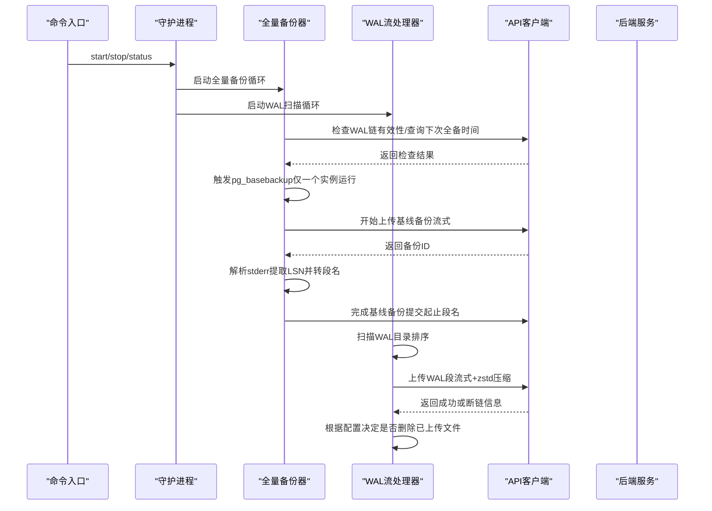
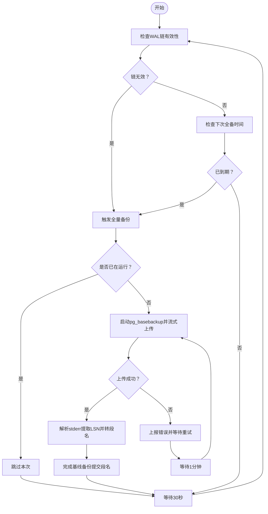
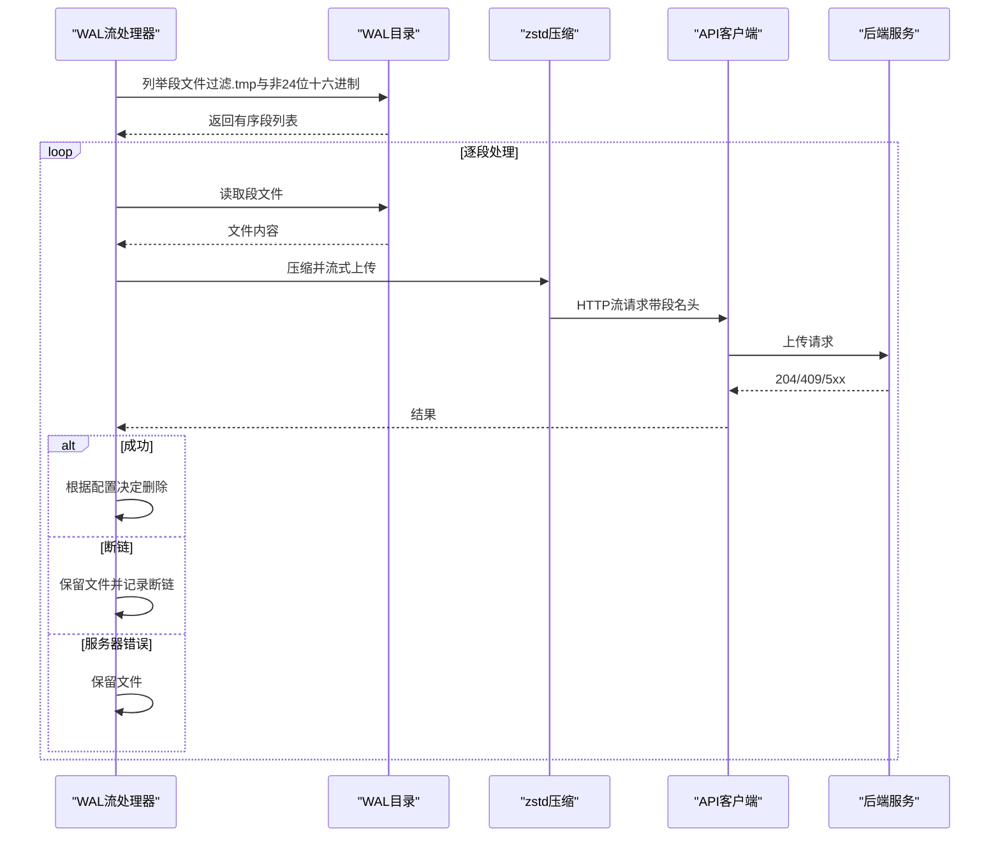
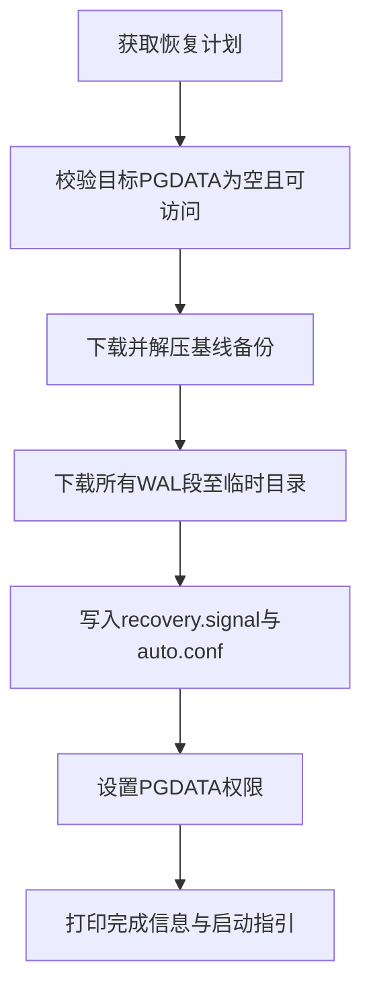
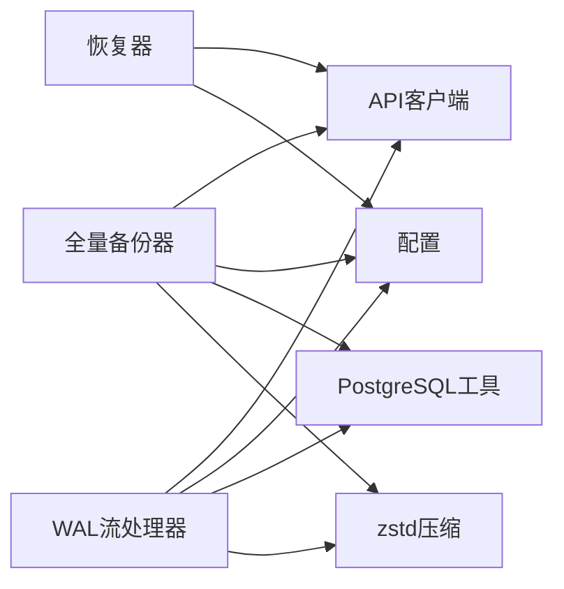

# 备份功能实现

<cite>
**本文档引用的文件**
- [main.go](file://agent/cmd/main.go)
- [backuper.go](file://agent/internal/features/full_backup/backuper.go)
- [streamer.go](file://agent/internal/features/wal/streamer.go)
- [restorer.go](file://agent/internal/features/restore/restorer.go)
- [config.go](file://agent/internal/config/config.go)
- [stderr_parser.go](file://agent/internal/features/full_backup/stderr_parser.go)
- [api.go](file://agent/internal/features/api/api.go)
- [dto.go](file://agent/internal/features/api/dto.go)
- [daemon.go](file://agent/internal/features/start/daemon.go)
- [model.go](file://backend/internal/features/backups/config/model.go)
- [README.md](file://README.md)
- [AGENTS.md](file://AGENTS.md)
</cite>

## 目录
1. [简介](#简介)
2. [项目结构](#项目结构)
3. [核心组件](#核心组件)
4. [架构总览](#架构总览)
5. [详细组件分析](#详细组件分析)
6. [依赖关系分析](#依赖关系分析)
7. [性能考虑](#性能考虑)
8. [故障排查指南](#故障排查指南)
9. [结论](#结论)

## 简介
本文件面向Databasus代理的备份功能，系统性阐述代理如何执行全量备份、增量备份与WAL归档，以及备份流程控制、并发与资源管理、进度跟踪、数据处理（压缩、传输、完整性校验、元数据管理）、WAL流处理机制（流式传输、缓冲管理、错误恢复、流量控制）、备份恢复支持（PITR时间点恢复、目标数据库切换、恢复验证）等。同时提供性能优化与故障处理的最佳实践。

## 项目结构
Databasus代理位于agent目录，核心备份能力由以下模块组成：
- 全量备份：负责触发并上传pg_basebackup生成的物理基线备份，解析LSN并完成备份元数据收尾
- WAL流：负责扫描WAL目录，按序压缩上传WAL段，检测断链并进行删除策略
- 恢复：从后端拉取基线备份与WAL，配置PostgreSQL恢复参数，支持PITR
- 配置：统一加载与持久化代理配置
- API客户端：封装与后端交互的REST与流式上传接口
- 启动与守护：提供start/stop/status命令与后台运行能力

**图表来源**
- [main.go:24-171](file://agent/cmd/main.go#L24-L171)
- [config.go:16-31](file://agent/internal/config/config.go#L16-L31)
- [api.go:36-70](file://agent/internal/features/api/api.go#L36-L70)
- [backuper.go:46-64](file://agent/internal/features/full_backup/backuper.go#L46-L64)
- [streamer.go:30-42](file://agent/internal/features/wal/streamer.go#L30-L42)
- [restorer.go:31-56](file://agent/internal/features/restore/restorer.go#L31-L56)
- [daemon.go:78-121](file://agent/internal/features/start/daemon.go#L78-L121)

**章节来源**
- [main.go:24-171](file://agent/cmd/main.go#L24-L171)
- [config.go:16-31](file://agent/internal/config/config.go#L16-L31)
- [api.go:36-70](file://agent/internal/features/api/api.go#L36-L70)

## 核心组件
- 全量备份器（FullBackuper）
  - 周期性检查WAL链有效性与下次全备时间，必要时启动pg_basebackup
  - 流式zstd压缩输出并通过IdleTimeoutReader监控空闲超时
  - 解析stderr中的LSN，转换为WAL段名，调用后端完成基线备份元数据
- WAL流处理器（Streamer）
  - 定期扫描WAL目录，按名称排序逐个上传
  - 对每个段进行zstd压缩，设置超时与空闲超时，处理断链与冲突
  - 支持上传后删除策略
- 恢复器（Restorer）
  - 获取恢复计划，下载并解压基线备份，批量下载WAL段
  - 写入recovery.signal与postgresql.auto.conf，支持PITR与自动清理
- 配置管理（Config）
  - 统一加载/保存配置，覆盖优先级：CLI参数 > JSON配置
- API客户端（Client）
  - 封装REST接口与流式上传，支持重试、超时、鉴权头
- 守护进程（Daemon）
  - 提供start/stop/status命令，后台运行日志与锁文件管理

**章节来源**
- [backuper.go:33-124](file://agent/internal/features/full_backup/backuper.go#L33-L124)
- [streamer.go:44-90](file://agent/internal/features/wal/streamer.go#L44-L90)
- [restorer.go:58-102](file://agent/internal/features/restore/restorer.go#L58-L102)
- [config.go:35-74](file://agent/internal/config/config.go#L35-L74)
- [api.go:120-198](file://agent/internal/features/api/api.go#L120-L198)
- [daemon.go:78-121](file://agent/internal/features/start/daemon.go#L78-L121)

## 架构总览
代理通过命令入口启动，分别运行全量备份器与WAL流处理器两个后台任务。两者均通过API客户端与后端通信，前者负责基线备份的上传与元数据收尾，后者负责WAL段的持续归档。恢复器在需要时从后端拉取数据并配置PostgreSQL恢复环境。

**图表来源**
- [main.go:50-75](file://agent/cmd/main.go#L50-L75)
- [backuper.go:66-83](file://agent/internal/features/full_backup/backuper.go#L66-L83)
- [streamer.go:44-61](file://agent/internal/features/wal/streamer.go#L44-L61)
- [api.go:72-106](file://agent/internal/features/api/api.go#L72-L106)
- [api.go:120-198](file://agent/internal/features/api/api.go#L120-L198)

## 详细组件分析

### 全量备份器（FullBackuper）
- 调度与并发控制
  - 每30秒轮询一次：检查WAL链有效性；检查下次全备时间
  - 使用原子布尔值确保同一时刻仅有一个备份进程运行
- 数据处理
  - 使用zstd压缩（编码级别与CRC校验）直接将pg_basebackup stdout流式写入后端
  - 通过IdleTimeoutReader在上传空闲超时（默认5分钟）时主动取消，避免阻塞
  - 上传超时（默认23小时），防止长时间卡死
- 错误处理与重试
  - 上传失败时记录错误并向后端上报；等待1分钟（可配置）后重试
  - 进程上下文取消时立即停止
- 元数据管理
  - 解析pg_basebackup stderr中的LSN，转换为WAL段名
  - 调用后端完成基线备份，提交起止段名或错误信息

**图表来源**
- [backuper.go:85-124](file://agent/internal/features/full_backup/backuper.go#L85-L124)
- [backuper.go:164-245](file://agent/internal/features/full_backup/backuper.go#L164-L245)
- [stderr_parser.go:18-45](file://agent/internal/features/full_backup/stderr_parser.go#L18-L45)

**章节来源**
- [backuper.go:33-124](file://agent/internal/features/full_backup/backuper.go#L33-L124)
- [backuper.go:164-245](file://agent/internal/features/full_backup/backuper.go#L164-L245)
- [stderr_parser.go:18-45](file://agent/internal/features/full_backup/stderr_parser.go#L18-L45)

### WAL流处理器（Streamer）
- 流式传输与缓冲管理
  - 逐段读取WAL文件，使用zstd压缩后通过HTTP流式上传
  - 设置上传超时（5分钟）与空闲超时（5分钟），避免网络拥塞与死连接
- 错误恢复与断链检测
  - 若后端返回409冲突，携带期望段名与实际收到段名，标记断链并保留文件
  - 服务器内部错误时不删除文件，保持队列一致性
- 流量控制与删除策略
  - 可配置上传后删除WAL文件，减少磁盘占用
  - 严格过滤目录项：忽略.tmp临时文件，仅接受24位十六进制段名
- 并发与顺序
  - 串行上传单个段，但按名称升序处理多个段，保证接收端顺序一致性

**图表来源**
- [streamer.go:92-121](file://agent/internal/features/wal/streamer.go#L92-L121)
- [streamer.go:123-173](file://agent/internal/features/wal/streamer.go#L123-L173)
- [api.go:200-242](file://agent/internal/features/api/api.go#L200-L242)

**章节来源**
- [streamer.go:44-90](file://agent/internal/features/wal/streamer.go#L44-L90)
- [streamer.go:123-173](file://agent/internal/features/wal/streamer.go#L123-L173)
- [api.go:200-242](file://agent/internal/features/api/api.go#L200-L242)

### 恢复器（Restorer）
- 计划获取与校验
  - 从后端获取恢复计划，包含基线备份与WAL段清单
  - 若存在断链，返回最后连续段信息，便于定位问题
- 基线恢复
  - 下载zstd压缩的tar归档，解压到目标PGDATA目录
  - 严格路径遍历防护，仅允许安全解压
- WAL恢复与PITR
  - 在目标PGDATA下创建databasus-wal-restore目录，下载所有WAL段
  - 写入recovery.signal与postgresql.auto.conf，配置restore_command、recovery_end_command、recovery_target_action与可选的recovery_target_time
  - 支持Docker与宿主两种部署方式的路径映射
- 验证与提示
  - 输出恢复完成信息与启动建议，包含Docker与宿主启动命令

**图表来源**
- [restorer.go:130-146](file://agent/internal/features/restore/restorer.go#L130-L146)
- [restorer.go:165-181](file://agent/internal/features/restore/restorer.go#L165-L181)
- [restorer.go:245-258](file://agent/internal/features/restore/restorer.go#L245-L258)
- [restorer.go:299-327](file://agent/internal/features/restore/restorer.go#L299-L327)
- [restorer.go:329-363](file://agent/internal/features/restore/restorer.go#L329-L363)

**章节来源**
- [restorer.go:58-102](file://agent/internal/features/restore/restorer.go#L58-L102)
- [restorer.go:130-146](file://agent/internal/features/restore/restorer.go#L130-L146)
- [restorer.go:165-181](file://agent/internal/features/restore/restorer.go#L165-L181)
- [restorer.go:245-258](file://agent/internal/features/restore/restorer.go#L245-L258)
- [restorer.go:299-327](file://agent/internal/features/restore/restorer.go#L299-L327)
- [restorer.go:329-363](file://agent/internal/features/restore/restorer.go#L329-L363)

### 配置管理（Config）
- 加载与保存
  - 从databasus.json加载，支持默认值与CLI参数覆盖
  - 保存当前配置到JSON文件，便于后续启动
- 关键字段
  - 后端地址、数据库ID、令牌
  - PostgreSQL主机、端口、用户、密码、类型（host/docker）、容器名、WAL目录
  - 是否上传后删除WAL文件

**章节来源**
- [config.go:35-74](file://agent/internal/config/config.go#L35-L74)
- [config.go:103-115](file://agent/internal/config/config.go#L103-L115)
- [config.go:16-31](file://agent/internal/config/config.go#L16-L31)

### API客户端（Client）
- 接口定义
  - WAL链有效性检查、下次全备时间查询
  - 基线备份上传（流式）、完成（提交段名或错误）
  - WAL段上传（流式，带段名头）、断链检测
  - 恢复计划获取、下载备份文件（流式）
- 超时与重试
  - REST接口设置超时与最大重试次数
  - 流式上传使用独立HTTP客户端，避免内存缓存

**章节来源**
- [api.go:17-32](file://agent/internal/features/api/api.go#L17-L32)
- [api.go:72-106](file://agent/internal/features/api/api.go#L72-L106)
- [api.go:120-198](file://agent/internal/features/api/api.go#L120-L198)
- [api.go:200-242](file://agent/internal/features/api/api.go#L200-L242)
- [api.go:244-309](file://agent/internal/features/api/api.go#L244-L309)
- [dto.go:5-19](file://agent/internal/features/api/dto.go#L5-L19)
- [dto.go:29-38](file://agent/internal/features/api/dto.go#L29-L38)
- [dto.go:46-72](file://agent/internal/features/api/dto.go#L46-L72)

### 守护进程（Daemon）
- 启动
  - 以_detached_模式启动子进程，设置会话ID，重定向标准错误到日志文件
- 停止
  - 读取锁文件中的PID，发送SIGTERM；若超时未退出则报错
- 状态
  - 读取锁文件判断运行状态，清理陈旧锁文件

**章节来源**
- [daemon.go:23-55](file://agent/internal/features/start/daemon.go#L23-L55)
- [daemon.go:57-76](file://agent/internal/features/start/daemon.go#L57-L76)
- [daemon.go:78-121](file://agent/internal/features/start/daemon.go#L78-L121)

## 依赖关系分析
- 组件耦合
  - 全量备份器与WAL流处理器均依赖API客户端与配置模块
  - 恢复器依赖API客户端与本地文件系统
- 外部依赖
  - PostgreSQL工具：pg_basebackup（host或docker exec）
  - 压缩库：zstd
  - 网络库：HTTP客户端与REST客户端
- 循环依赖
  - 未发现直接循环依赖；各模块通过接口与配置解耦

**图表来源**
- [backuper.go:15-19](file://agent/internal/features/full_backup/backuper.go#L15-L19)
- [streamer.go:15-19](file://agent/internal/features/wal/streamer.go#L15-L19)
- [restorer.go:15-18](file://agent/internal/features/restore/restorer.go#L15-L18)
- [config.go:16-31](file://agent/internal/config/config.go#L16-L31)
- [api.go:36-70](file://agent/internal/features/api/api.go#L36-L70)

**章节来源**
- [backuper.go:15-19](file://agent/internal/features/full_backup/backuper.go#L15-L19)
- [streamer.go:15-19](file://agent/internal/features/wal/streamer.go#L15-L19)
- [restorer.go:15-18](file://agent/internal/features/restore/restorer.go#L15-L18)
- [config.go:16-31](file://agent/internal/config/config.go#L16-L31)
- [api.go:36-70](file://agent/internal/features/api/api.go#L36-L70)

## 性能考虑
- 压缩与传输
  - 使用zstd压缩，平衡压缩比与CPU开销；编码级别与CRC校验可提升可靠性
  - 流式传输避免大文件内存占用，结合超时与空闲超时控制带宽
- 调度与时序
  - 全量备份每30秒检查一次，WAL扫描每10秒一次，兼顾及时性与开销
  - 上传超时（23小时）与断链检测（409）降低长尾风险
- 存储与清理
  - 可选上传后删除WAL文件，缓解磁盘压力
- 并发与资源
  - 全量备份互斥执行，避免重复IO与CPU竞争
  - 恢复阶段严格路径校验与权限设置，减少I/O异常

[本节为通用指导，无需特定文件引用]

## 故障排查指南
- 全量备份失败
  - 检查WAL链有效性与下次全备时间；确认pg_basebackup命令可用与凭据正确
  - 查看stderr解析结果与后端返回的错误信息；关注上传空闲超时与重试间隔
- WAL上传失败
  - 断链（409）：根据期望段名与实际段名定位缺失范围；保留文件等待后续补齐
  - 服务器错误（5xx）：保留文件，待服务恢复后重试
  - 空闲超时：检查网络稳定性与带宽；适当增大空闲超时或降低压缩强度
- 恢复异常
  - 确认目标PGDATA为空且可写；检查recovery.signal与postgresql.auto.conf配置
  - 若使用Docker，确保卷挂载路径与容器内pgdata一致
- 配置问题
  - 使用SaveToJSON生成配置文件；通过CLI参数覆盖关键字段（如pg-host、pg-port、pg-type）

**章节来源**
- [backuper.go:133-162](file://agent/internal/features/full_backup/backuper.go#L133-L162)
- [streamer.go:140-173](file://agent/internal/features/wal/streamer.go#L140-L173)
- [restorer.go:104-128](file://agent/internal/features/restore/restorer.go#L104-L128)
- [config.go:67-74](file://agent/internal/config/config.go#L67-L74)

## 结论
Databasus代理通过“全量备份+WAL归档”的组合实现了高可靠、低侵入的物理备份方案。全量备份器与WAL流处理器采用流式压缩与严格的超时/空闲超时策略，配合断链检测与重试机制，确保在复杂网络环境下稳定运行。恢复器提供完整的PITR支持与自动化配置，简化了灾难恢复流程。通过合理的并发控制、资源管理与进度跟踪，代理能够在生产环境中安全高效地执行备份与恢复任务。