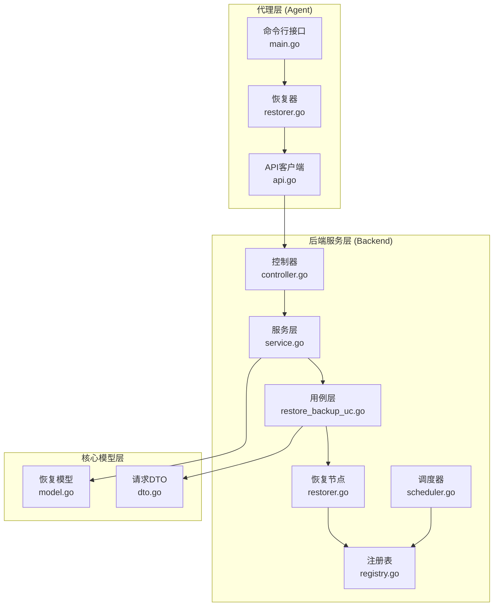
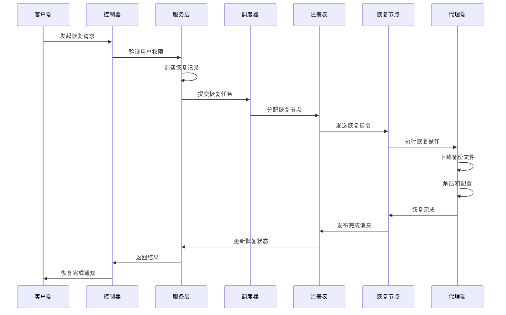
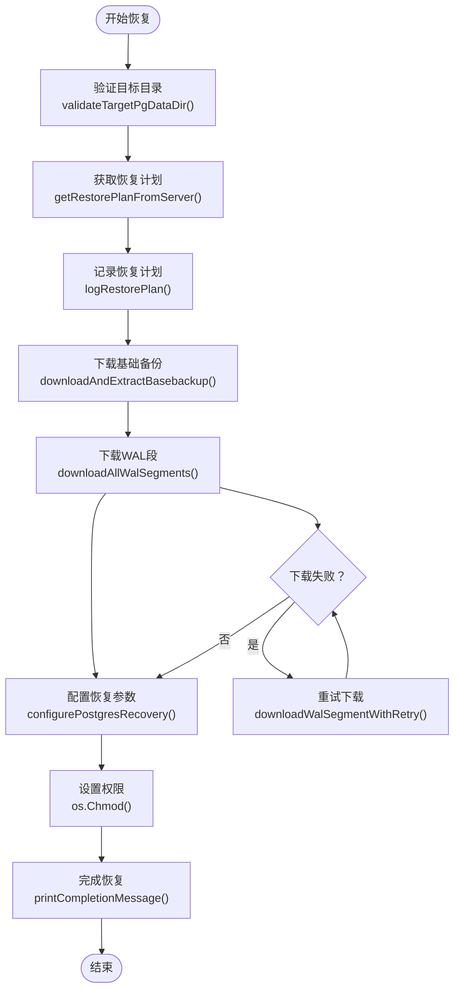
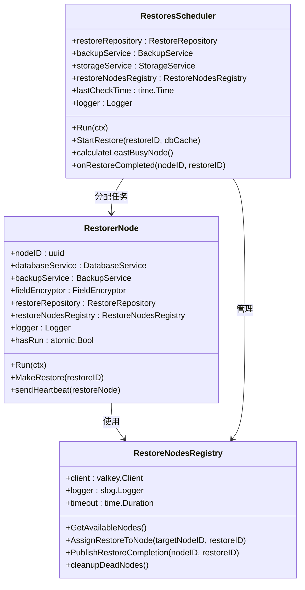
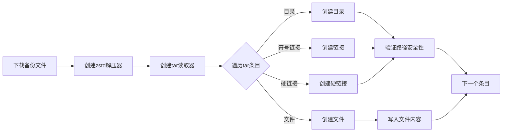
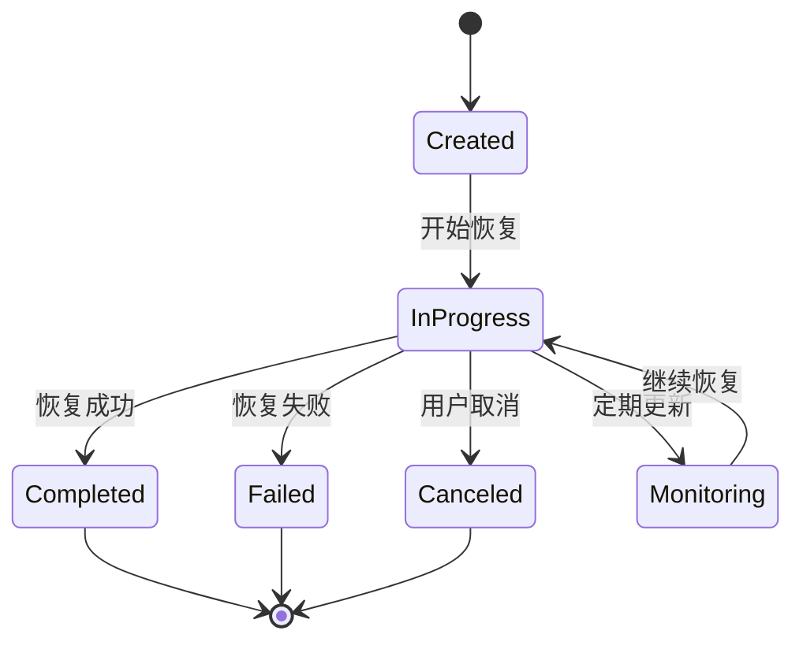
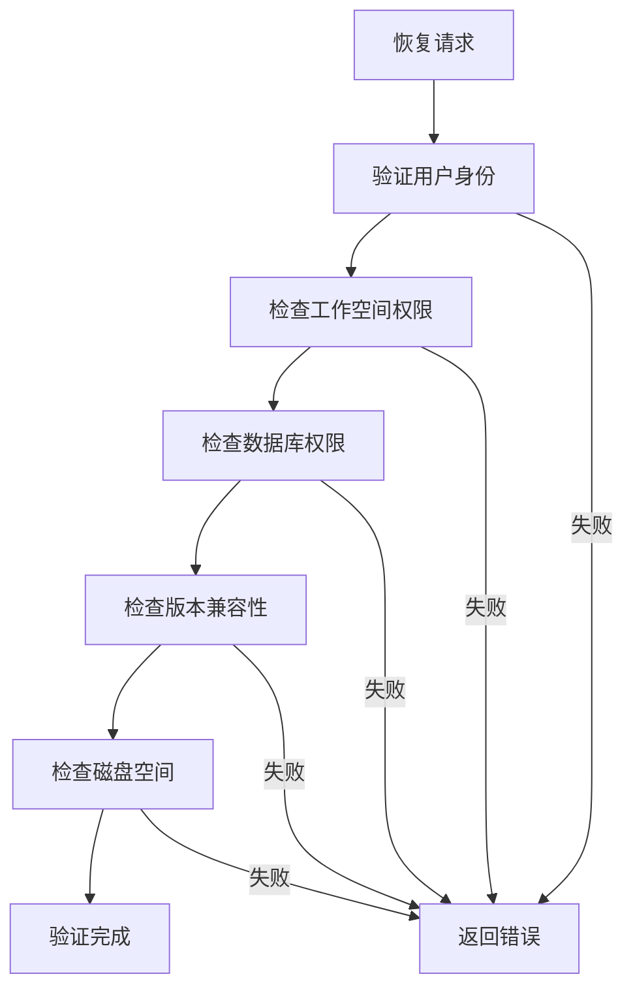
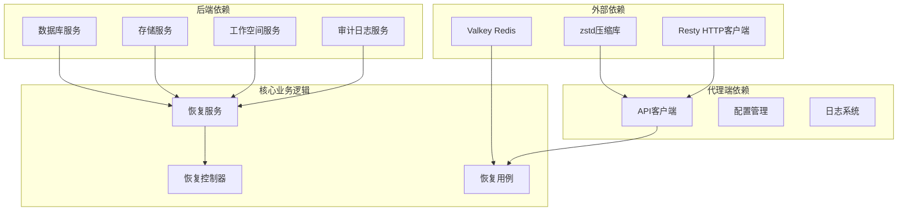
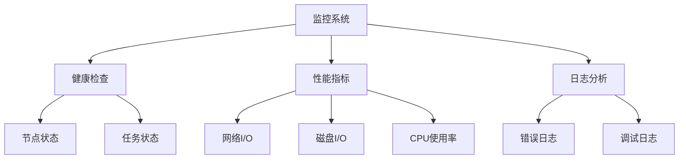

# 恢复功能实现

<cite>
**本文档引用的文件**
- [restorer.go](file://agent/internal/features/restore/restorer.go)
- [restorer_test.go](file://agent/internal/features/restore/restorer_test.go)
- [api.go](file://agent/internal/features/api/api.go)
- [main.go](file://agent/cmd/main.go)
- [restorer.go](file://backend/internal/features/restores/restoring/restorer.go)
- [scheduler.go](file://backend/internal/features/restores/restoring/scheduler.go)
- [registry.go](file://backend/internal/features/restores/restoring/registry.go)
- [restore_backup_uc.go](file://backend/internal/features/restores/usecases/restore_backup_uc.go)
- [service.go](file://backend/internal/features/restores/service.go)
- [controller.go](file://backend/internal/features/restores/controller.go)
- [model.go](file://backend/internal/features/restores/core/model.go)
- [dto.go](file://backend/internal/features/restores/core/dto.go)
</cite>

## 目录
1. [简介](#简介)
2. [项目结构](#项目结构)
3. [核心组件](#核心组件)
4. [架构概览](#架构概览)
5. [详细组件分析](#详细组件分析)
6. [依赖关系分析](#依赖关系分析)
7. [性能考虑](#性能考虑)
8. [故障排除指南](#故障排除指南)
9. [结论](#结论)

## 简介

Databasus 的恢复功能是一个完整的数据库恢复解决方案，支持从备份中恢复数据库、执行时间点恢复（PITR）以及目标数据库配置。该系统采用分布式架构，包含代理端和后端服务两个主要部分。

恢复功能的核心特性包括：
- 支持 PostgreSQL、MySQL、MariaDB 和 MongoDB 的数据库恢复
- 时间点恢复（PITR）功能，可恢复到任意时间点
- 分布式恢复节点管理，支持多节点并行恢复
- 完整的错误处理和重试机制
- 实时进度监控和状态报告
- 安全的数据验证和权限检查

## 项目结构

Databasus 恢复功能采用分层架构设计，主要分为三个层次：

**图表来源**
- [main.go:117-160](file://agent/cmd/main.go#L117-L160)
- [restorer.go:58-102](file://agent/internal/features/restore/restorer.go#L58-L102)
- [service.go:97-203](file://backend/internal/features/restores/service.go#L97-L203)

**章节来源**
- [main.go:1-246](file://agent/cmd/main.go#L1-L246)
- [restorer.go:1-445](file://agent/internal/features/restore/restorer.go#L1-L445)
- [service.go:1-423](file://backend/internal/features/restores/service.go#L1-L423)

## 核心组件

### 代理端恢复器 (Agent Restorer)

代理端恢复器是恢复功能的核心执行组件，负责直接与数据库交互并执行实际的恢复操作。

**主要职责：**
- 验证目标数据库目录状态
- 从服务器获取恢复计划
- 下载和解压备份文件
- 配置 PostgreSQL 恢复参数
- 处理 WAL 段文件
- 启动数据库服务

**关键特性：**
- 支持 zstd 压缩格式
- 实现了完整的路径遍历防护
- 提供重试机制处理网络异常
- 支持 Docker 和主机两种部署模式

### 后端恢复服务 (Backend Restore Service)

后端服务层负责协调整个恢复过程，包括任务调度、资源管理和状态跟踪。

**主要功能：**
- 用户权限验证和访问控制
- 恢复任务的创建和调度
- 节点负载均衡和分配
- 恢复进度监控和状态更新
- 错误处理和故障转移

**章节来源**
- [restorer.go:30-48](file://agent/internal/features/restore/restorer.go#L30-L48)
- [service.go:29-42](file://backend/internal/features/restores/service.go#L29-L42)

## 架构概览

Databasus 恢复系统采用分布式架构，通过 Redis 进行节点间通信和状态同步。

**图表来源**
- [controller.go:64-89](file://backend/internal/features/restores/controller.go#L64-L89)
- [service.go:157-194](file://backend/internal/features/restores/service.go#L157-L194)
- [scheduler.go:148-189](file://backend/internal/features/restores/scheduler.go#L148-L189)
- [registry.go:359-383](file://backend/internal/features/restores/registry.go#L359-L383)

## 详细组件分析

### 代理端恢复流程

代理端恢复器实现了完整的数据库恢复流程，从备份下载到数据库启动的全过程管理。

**图表来源**
- [restorer.go:58-102](file://agent/internal/features/restore/restorer.go#L58-L102)
- [restorer.go:260-299](file://agent/internal/features/restore/restorer.go#L260-L299)

#### 恢复流程控制

恢复流程严格按照以下步骤执行：

1. **备份选择阶段**
   - 从服务器获取恢复计划
   - 验证备份完整性
   - 计算总下载大小

2. **恢复验证阶段**
   - 检查目标目录状态
   - 验证目录为空且可写
   - 确认数据库版本兼容性

3. **数据处理阶段**
   - 下载基础备份文件
   - 解压 zstd 压缩包
   - 提取 tar 归档内容
   - 下载所有 WAL 段文件

4. **数据库启动阶段**
   - 创建 recovery.signal 文件
   - 配置 postgresql.auto.conf
   - 设置适当的文件权限

**章节来源**
- [restorer.go:104-128](file://agent/internal/features/restore/restorer.go#L104-L128)
- [restorer.go:130-146](file://agent/internal/features/restore/restorer.go#L130-L146)
- [restorer.go:165-181](file://agent/internal/features/restore/restorer.go#L165-L181)

### 后端恢复管理

后端服务层提供了完整的恢复管理功能，包括任务调度、节点管理和状态跟踪。

#### 恢复节点管理

**图表来源**
- [restorer.go:30-48](file://backend/internal/features/restores/restoring/restorer.go#L30-L48)
- [scheduler.go:26-40](file://backend/internal/features/restores/restoring/scheduler.go#L26-L40)
- [registry.go:45-53](file://backend/internal/features/restores/restoring/registry.go#L45-L53)

#### 恢复任务调度算法

调度器使用基于负载和吞吐量的智能分配算法：

1. **节点发现**：扫描可用的恢复节点
2. **负载计算**：计算每个节点的活跃恢复任务数量
3. **吞吐量评估**：考虑节点的网络吞吐能力
4. **最优选择**：选择负载最小且吞吐量最高的节点

**章节来源**
- [scheduler.go:191-237](file://backend/internal/features/restores/scheduler.go#L191-L237)
- [registry.go:79-147](file://backend/internal/features/restores/registry.go#L79-L147)

### 数据处理机制

#### 备份下载和解压

代理端实现了高效的备份文件处理机制：

**图表来源**
- [restorer.go:165-181](file://agent/internal/features/restore/restorer.go#L165-L181)
- [restorer.go:183-243](file://agent/internal/features/restore/restorer.go#L183-L243)

#### WAL 段处理

WAL 段文件的处理采用了增量恢复机制：

1. **WAL 段下载**：按顺序下载所有必要的 WAL 段
2. **重试机制**：对失败的下载进行自动重试
3. **完整性验证**：确保 WAL 链的连续性
4. **增量应用**：在数据库启动时自动应用 WAL 变更

**章节来源**
- [restorer.go:245-258](file://agent/internal/features/restore/restorer.go#L245-L258)
- [restorer.go:260-299](file://agent/internal/features/restore/restorer.go#L260-L299)

### 恢复监控和状态报告

#### 实时进度跟踪

系统提供了多层次的进度监控机制：

1. **API 层监控**：REST API 提供实时状态查询
2. **日志监控**：详细的恢复过程日志记录
3. **节点心跳**：恢复节点定期发送健康检查信号
4. **Redis 状态**：使用 Redis 存储和同步恢复状态

#### 状态报告机制

**图表来源**
- [model.go:15-31](file://backend/internal/features/restores/core/model.go#L15-L31)
- [service.go:157-169](file://backend/internal/features/restores/service.go#L157-L169)

**章节来源**
- [service.go:205-251](file://backend/internal/features/restores/service.go#L205-L251)
- [registry.go:303-332](file://backend/internal/features/restores/registry.go#L303-L332)

### 安全机制

#### 数据验证

系统实施了多层安全验证机制：

1. **路径遍历防护**：防止恶意路径遍历攻击
2. **文件权限验证**：确保只处理受支持的文件类型
3. **备份完整性检查**：验证下载文件的完整性
4. **权限验证**：确保用户有权限访问目标数据库

#### 权限检查

**图表来源**
- [service.go:97-144](file://backend/internal/features/restores/service.go#L97-L144)

**章节来源**
- [restorer.go:196-199](file://agent/internal/features/restore/restorer.go#L196-L199)
- [service.go:253-351](file://backend/internal/features/restores/service.go#L253-L351)

## 依赖关系分析

Databasus 恢复功能的依赖关系体现了清晰的分层架构：

**图表来源**
- [restorer.go:15-18](file://agent/internal/features/restore/restorer.go#L15-L18)
- [service.go:11-27](file://backend/internal/features/restores/service.go#L11-L27)

**章节来源**
- [registry.go:12-23](file://backend/internal/features/restores/restoring/registry.go#L12-L23)
- [restore_backup_uc.go:3-23](file://backend/internal/features/restores/usecases/restore_backup_uc.go#L3-L23)

## 性能考虑

### 并发处理

系统支持多节点并发恢复，通过智能调度算法优化资源利用：

1. **负载均衡**：根据节点吞吐量和活跃任务数分配恢复任务
2. **资源隔离**：每个恢复任务独立运行，避免相互影响
3. **动态调整**：根据节点健康状况动态调整任务分配

### 网络优化

1. **流式传输**：使用 HTTP 流式传输减少内存占用
2. **断点续传**：支持 WAL 段的断点续传功能
3. **压缩传输**：使用 zstd 压缩减少网络带宽消耗

### 存储优化

1. **并行下载**：多个 WAL 段可以并行下载
2. **增量恢复**：只应用必要的 WAL 变更
3. **缓存策略**：合理使用系统缓存提高 I/O 性能

## 故障排除指南

### 常见问题及解决方案

#### 恢复失败问题

**问题1：目标目录非空**
- **症状**：恢复过程中报错提示目录不为空
- **解决方案**：清理目标目录或选择其他目录进行恢复

**问题2：备份文件下载失败**
- **症状**：下载过程中出现网络错误
- **解决方案**：检查网络连接，重试下载，确认服务器可达性

**问题3：WAL 链不完整**
- **症状**：恢复计划返回 WAL 链断裂错误
- **解决方案**：选择更早的备份点，或检查存储系统的完整性

#### 性能问题

**问题4：恢复速度慢**
- **症状**：恢复过程耗时过长
- **解决方案**：检查网络带宽，增加节点数量，并发下载 WAL 段

**问题5：内存使用过高**
- **症状**：系统内存占用过高
- **解决方案**：调整 zstd 压缩级别，优化网络传输参数

### 调试工具和方法

#### 日志分析

系统提供了详细的日志记录功能：

1. **API 请求日志**：记录所有与服务器的通信
2. **恢复进度日志**：跟踪恢复过程的每个步骤
3. **错误日志**：记录详细的错误信息和堆栈跟踪

#### 状态监控

**图表来源**
- [restorer.go:277-284](file://agent/internal/features/restore/restorer.go#L277-L284)
- [service.go:205-251](file://backend/internal/features/restores/service.go#L205-L251)

**章节来源**
- [restorer_test.go:224-296](file://agent/internal/features/restore/restorer_test.go#L224-L296)
- [registry.go:539-642](file://backend/internal/features/restores/registry.go#L539-L642)

## 结论

Databasus 的恢复功能实现了企业级的数据库恢复解决方案，具有以下显著特点：

1. **完整的功能覆盖**：支持多种数据库类型的恢复，包括时间点恢复
2. **高可用架构**：采用分布式设计，支持多节点并行处理
3. **强大的监控能力**：提供实时的状态跟踪和性能监控
4. **严格的安全机制**：实施多层次的安全验证和权限控制
5. **优秀的用户体验**：简洁的命令行接口和详细的进度反馈

该系统特别适合需要高可靠性和快速恢复能力的企业环境，能够满足灾难恢复和日常维护的各种需求。通过合理的配置和监控，可以确保数据库恢复过程的稳定性和可靠性。