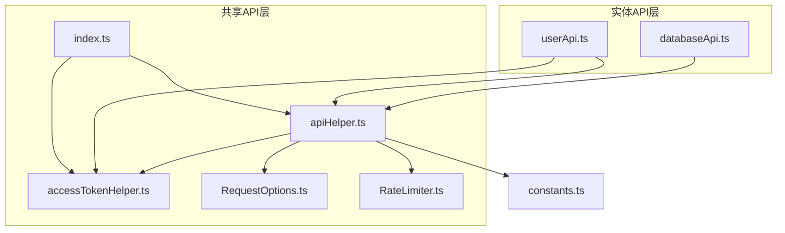
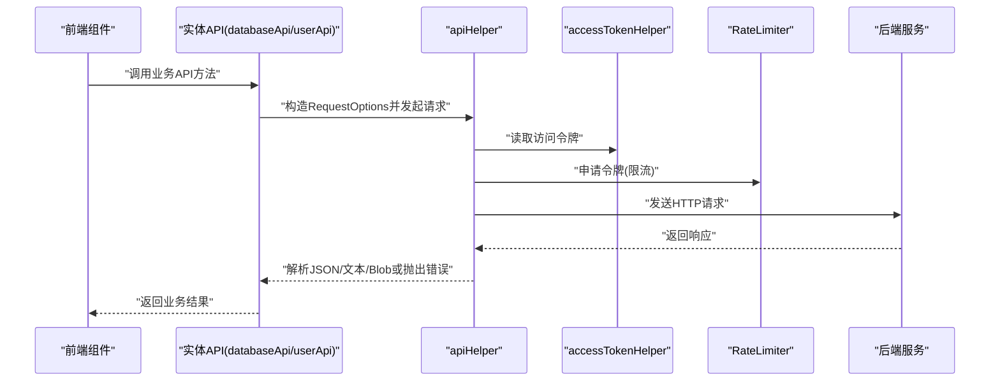
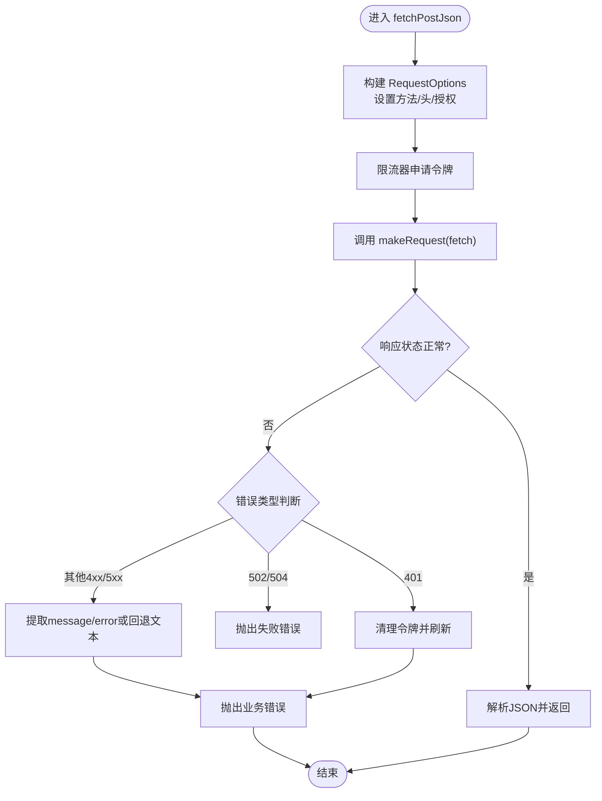
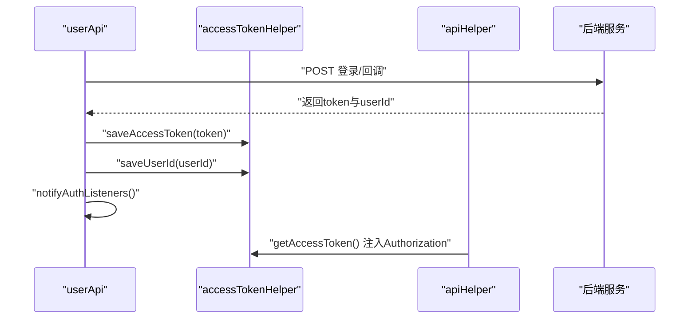
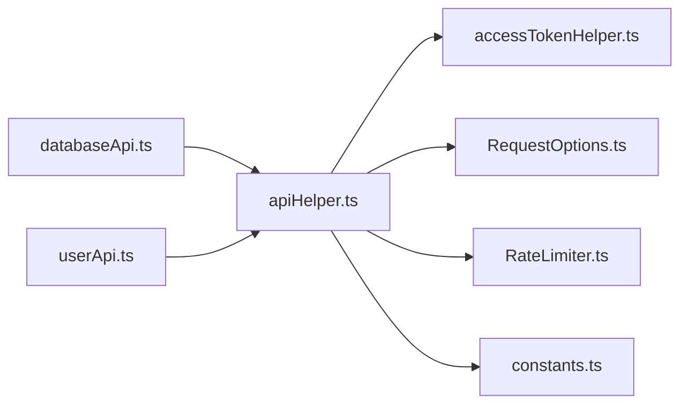

# API集成模式

<cite>
**本文引用的文件**
- [apiHelper.ts](file://frontend/src/shared/api/apiHelper.ts)
- [accessTokenHelper.ts](file://frontend/src/shared/api/accessTokenHelper.ts)
- [RequestOptions.ts](file://frontend/src/shared/api/RequestOptions.ts)
- [RateLimiter.ts](file://frontend/src/shared/api/RateLimiter.ts)
- [index.ts](file://frontend/src/shared/api/index.ts)
- [databaseApi.ts](file://frontend/src/entity/databases/api/databaseApi.ts)
- [userApi.ts](file://frontend/src/entity/users/api/userApi.ts)
- [constants.ts](file://frontend/src/constants.ts)
</cite>

## 目录
1. [简介](#简介)
2. [项目结构](#项目结构)
3. [核心组件](#核心组件)
4. [架构总览](#架构总览)
5. [详细组件分析](#详细组件分析)
6. [依赖关系分析](#依赖关系分析)
7. [性能考量](#性能考量)
8. [故障排查指南](#故障排查指南)
9. [结论](#结论)
10. [附录](#附录)

## 简介
本文件系统性阐述 Databasus 前端的 API 集成模式，覆盖以下主题：
- RESTful 调用模式：请求拦截与响应处理、错误处理机制
- API 客户端设计：apiHelper 的统一封装、accessTokenHelper 的认证处理、RequestOptions 的配置管理
- 实体模型设计：DTO 对象的定义、数据转换与类型安全
- 生命周期管理：请求队列、重试机制、超时策略
- 最佳实践：缓存策略、批量请求、并发控制
- 典型调用示例与错误处理案例

## 项目结构
Databasus 前端采用“共享 API 层 + 实体 API 层”的分层组织方式：
- 共享 API 层位于 frontend/src/shared/api，提供通用的请求封装、认证令牌管理、限流与重试逻辑
- 实体 API 层位于 frontend/src/entity/*/api，按业务域（如数据库、用户、备份等）组织具体 API 方法
- 常量与运行时配置位于 frontend/src/constants.ts，用于决定服务端地址与环境变量

图表来源
- [apiHelper.ts:1-264](file://frontend/src/shared/api/apiHelper.ts#L1-L264)
- [accessTokenHelper.ts:1-45](file://frontend/src/shared/api/accessTokenHelper.ts#L1-L45)
- [RequestOptions.ts:1-68](file://frontend/src/shared/api/RequestOptions.ts#L1-L68)
- [RateLimiter.ts:1-37](file://frontend/src/shared/api/RateLimiter.ts#L1-L37)
- [index.ts:1-5](file://frontend/src/shared/api/index.ts#L1-L5)
- [databaseApi.ts:1-130](file://frontend/src/entity/databases/api/databaseApi.ts#L1-L130)
- [userApi.ts:1-189](file://frontend/src/entity/users/api/userApi.ts#L1-L189)
- [constants.ts:19-30](file://frontend/src/constants.ts#L19-L30)

章节来源
- [apiHelper.ts:1-264](file://frontend/src/shared/api/apiHelper.ts#L1-L264)
- [databaseApi.ts:1-130](file://frontend/src/entity/databases/api/databaseApi.ts#L1-L130)
- [userApi.ts:1-189](file://frontend/src/entity/users/api/userApi.ts#L1-L189)
- [constants.ts:19-30](file://frontend/src/constants.ts#L19-L30)

## 核心组件
本节聚焦共享 API 层的三大核心构件及其职责与交互。

- apiHelper：统一的 REST 客户端，提供 GET/POST/PUT/DELETE 的 JSON/Raw/Blob 三类返回形式，并内置重试、速率限制与错误处理
- accessTokenHelper：基于 localStorage 的访问令牌与用户 ID 存取工具，负责认证状态的持久化与清理
- RequestOptions：对 fetch RequestInit 的轻量封装，支持方法、凭证、头信息与请求体的链式配置
- RateLimiter：令牌桶式限流器，保障并发请求在可接受速率内执行

章节来源
- [apiHelper.ts:63-263](file://frontend/src/shared/api/apiHelper.ts#L63-L263)
- [accessTokenHelper.ts:4-44](file://frontend/src/shared/api/accessTokenHelper.ts#L4-L44)
- [RequestOptions.ts:1-68](file://frontend/src/shared/api/RequestOptions.ts#L1-L68)
- [RateLimiter.ts:1-37](file://frontend/src/shared/api/RateLimiter.ts#L1-L37)

## 架构总览
下图展示从实体 API 到共享 API 再到后端服务的整体调用路径，以及认证与限流的关键节点。

图表来源
- [databaseApi.ts:8-129](file://frontend/src/entity/databases/api/databaseApi.ts#L8-L129)
- [userApi.ts:33-188](file://frontend/src/entity/users/api/userApi.ts#L33-L188)
- [apiHelper.ts:42-61](file://frontend/src/shared/api/apiHelper.ts#L42-L61)
- [accessTokenHelper.ts:13-18](file://frontend/src/shared/api/accessTokenHelper.ts#L13-L18)
- [RateLimiter.ts:26-35](file://frontend/src/shared/api/RateLimiter.ts#L26-L35)

## 详细组件分析

### 组件一：apiHelper（统一请求封装）
- 设计要点
  - 通过 RequestOptions 统一封装请求参数，避免重复设置头信息与方法
  - 在每次请求前执行限流 acquire，确保全局并发速率可控
  - 统一错误处理：对 4xx/5xx 响应提取 message/error 或回退文本；对 502/504 抛出统一错误；对 401 清理令牌并刷新页面
  - 支持重试：默认关闭，可通过 isRetryOnError 参数开启，内部递归等待固定间隔后重试
  - 返回类型：提供 fetchGetJson/fetchPostJson 等多形态方法，自动解析 JSON/Raw/Blob
- 关键流程（带重试的 POST JSON 请求）

图表来源
- [apiHelper.ts:63-263](file://frontend/src/shared/api/apiHelper.ts#L63-L263)
- [apiHelper.ts:10-40](file://frontend/src/shared/api/apiHelper.ts#L10-L40)
- [apiHelper.ts:42-61](file://frontend/src/shared/api/apiHelper.ts#L42-L61)

章节来源
- [apiHelper.ts:63-263](file://frontend/src/shared/api/apiHelper.ts#L63-L263)

### 组件二：accessTokenHelper（认证令牌管理）
- 设计要点
  - 使用 localStorage 持久化访问令牌与用户 ID，提供保存、读取、清理能力
  - 在 401 错误时由 apiHelper 调用清理，确保后续请求不再携带无效令牌
  - userApi 中在登录/回调成功后写入令牌与用户 ID，并通知认证监听者
- 认证流程（登录/回调成功后）

图表来源
- [userApi.ts:22-24](file://frontend/src/entity/users/api/userApi.ts#L22-L24)
- [userApi.ts:123-130](file://frontend/src/entity/users/api/userApi.ts#L123-L130)
- [accessTokenHelper.ts:5-18](file://frontend/src/shared/api/accessTokenHelper.ts#L5-L18)
- [apiHelper.ts:74](file://frontend/src/shared/api/apiHelper.ts#L74)

章节来源
- [accessTokenHelper.ts:4-44](file://frontend/src/shared/api/accessTokenHelper.ts#L4-L44)
- [userApi.ts:22-24](file://frontend/src/entity/users/api/userApi.ts#L22-L24)
- [userApi.ts:123-130](file://frontend/src/entity/users/api/userApi.ts#L123-L130)

### 组件三：RequestOptions（请求配置管理）
- 设计要点
  - 链式 API：setMethod/setCredentials/setBody/addHeader/toRequestInit
  - 将内部头列表转为 fetch 所需的二维数组格式
  - 默认禁用缓存（no-cache），确保接口幂等与数据新鲜度
- 使用场景
  - databaseApi 中对数据库 CRUD、连接测试、只读检测等均通过 RequestOptions 组装请求体与头信息

章节来源
- [RequestOptions.ts:1-68](file://frontend/src/shared/api/RequestOptions.ts#L1-L68)
- [databaseApi.ts:10-15](file://frontend/src/entity/databases/api/databaseApi.ts#L10-L15)
- [databaseApi.ts:18-24](file://frontend/src/entity/databases/api/databaseApi.ts#L18-L24)

### 组件四：RateLimiter（并发与速率控制）
- 设计要点
  - 固定容量与周期性补充，采用队列排队释放，避免饥饿
  - 在 apiHelper 发起每次请求前 acquire，确保全局速率不超过设定上限
  - 根据部署环境（IS_CLOUD）调整速率上限，以适配云端与自建环境差异

章节来源
- [RateLimiter.ts:1-37](file://frontend/src/shared/api/RateLimiter.ts#L1-L37)
- [apiHelper.ts:8](file://frontend/src/shared/api/apiHelper.ts#L8)

### 组件五：实体 API（数据库与用户）
- 数据库 API（databaseApi）
  - 提供创建、更新、查询、删除、复制、连接测试、只读检测、生成代理令牌等方法
  - 大多数方法使用 fetchGetJson/fetchPostJson 并传入 RequestOptions
  - 部分方法启用 isRetryOnError 参数以增强稳定性
- 用户 API（userApi）
  - 提供注册、登录、当前用户信息、修改密码、邀请用户、OAuth 回调、登出等方法
  - 登录/回调成功后写入令牌与用户 ID，并触发认证监听者

章节来源
- [databaseApi.ts:8-129](file://frontend/src/entity/databases/api/databaseApi.ts#L8-L129)
- [userApi.ts:33-188](file://frontend/src/entity/users/api/userApi.ts#L33-L188)

## 依赖关系分析
- 组件耦合
  - 实体 API 仅依赖共享 API 层（apiHelper、RequestOptions），不直接依赖 fetch 或浏览器 API
  - apiHelper 依赖 accessTokenHelper、RequestOptions、RateLimiter 与 constants（运行时配置）
- 可能的循环依赖
  - 当前结构清晰，无循环导入风险
- 外部依赖
  - 浏览器原生 fetch 与 localStorage
  - 运行时配置（IS_CLOUD、端口推断等）

图表来源
- [databaseApi.ts:1-3](file://frontend/src/entity/databases/api/databaseApi.ts#L1-L3)
- [userApi.ts:1-4](file://frontend/src/entity/users/api/userApi.ts#L1-L4)
- [apiHelper.ts:1-4](file://frontend/src/shared/api/apiHelper.ts#L1-L4)
- [constants.ts:19-30](file://frontend/src/constants.ts#L19-L30)

章节来源
- [databaseApi.ts:1-3](file://frontend/src/entity/databases/api/databaseApi.ts#L1-L3)
- [userApi.ts:1-4](file://frontend/src/entity/users/api/userApi.ts#L1-L4)
- [apiHelper.ts:1-4](file://frontend/src/shared/api/apiHelper.ts#L1-L4)
- [constants.ts:19-30](file://frontend/src/constants.ts#L19-L30)

## 性能考量
- 速率限制
  - 通过 RateLimiter 控制并发请求速率，避免对后端造成瞬时压力
  - IS_CLOUD 环境下速率更高，以适应云服务的高可用特性
- 重试策略
  - 默认关闭重试，降低重复请求带来的负载
  - 对特定接口可显式开启 isRetryOnError，提升弱网或偶发错误下的成功率
- 缓存策略
  - RequestOptions 默认禁用缓存，确保接口幂等与数据一致性
  - 如需缓存，请在实体 API 层自行实现（例如内存缓存或浏览器缓存），并明确失效策略
- 批量请求与并发控制
  - 建议在业务层合并多次小请求为一次批量请求（若后端支持）
  - 对高频接口使用 RateLimiter 限制并发，避免资源争用

章节来源
- [RateLimiter.ts:1-37](file://frontend/src/shared/api/RateLimiter.ts#L1-L37)
- [apiHelper.ts:6-8](file://frontend/src/shared/api/apiHelper.ts#L6-L8)
- [apiHelper.ts:76-80](file://frontend/src/shared/api/apiHelper.ts#L76-L80)
- [RequestOptions.ts:50](file://frontend/src/shared/api/RequestOptions.ts#L50)

## 故障排查指南
- 401 未授权
  - 现象：页面刷新并提示未授权
  - 处理：确认 accessTokenHelper 是否存在有效令牌；检查后端 JWT 签发与过期时间
  - 触发点：apiHelper 在响应 401 时清理令牌并刷新页面
- 502/504 网关错误
  - 现象：统一抛出“failed to fetch”错误
  - 处理：检查后端服务健康状态与网关配置；必要时开启 isRetryOnError
- 4xx/5xx 业务错误
  - 现象：尝试读取响应体中的 message/error 字段，否则回退为文本
  - 处理：根据错误消息定位问题；对可恢复错误可结合重试
- 本地存储不可用
  - 现象：localStorage 不存在时，令牌读写为空操作
  - 处理：确认运行环境是否支持 localStorage；在无痕/受限环境下考虑替代方案

章节来源
- [apiHelper.ts:10-40](file://frontend/src/shared/api/apiHelper.ts#L10-L40)
- [accessTokenHelper.ts:6-8](file://frontend/src/shared/api/accessTokenHelper.ts#L6-L8)

## 结论
Databasus 的 API 集成模式通过“共享 API 层 + 实体 API 层”的清晰分层，实现了：
- 统一的请求封装与错误处理
- 明确的认证与令牌管理
- 合理的并发与速率控制
- 可扩展的 DTO 类型体系与实体 API

该模式既保证了代码复用与维护性，也为性能优化与故障排查提供了清晰的切入点。

## 附录

### A. API 调用示例（路径指引）
- 创建数据库
  - [databaseApi.ts:9-16](file://frontend/src/entity/databases/api/databaseApi.ts#L9-L16)
- 获取数据库列表（启用重试）
  - [databaseApi.ts:36-43](file://frontend/src/entity/databases/api/databaseApi.ts#L36-L43)
- 用户登录（写入令牌与用户 ID）
  - [userApi.ts:48-60](file://frontend/src/entity/users/api/userApi.ts#L48-L60)
- GitHub OAuth 回调（写入令牌与用户 ID）
  - [userApi.ts:119-131](file://frontend/src/entity/users/api/userApi.ts#L119-L131)

章节来源
- [databaseApi.ts:9-16](file://frontend/src/entity/databases/api/databaseApi.ts#L9-L16)
- [databaseApi.ts:36-43](file://frontend/src/entity/databases/api/databaseApi.ts#L36-L43)
- [userApi.ts:48-60](file://frontend/src/entity/users/api/userApi.ts#L48-L60)
- [userApi.ts:119-131](file://frontend/src/entity/users/api/userApi.ts#L119-L131)

### B. 错误处理案例（路径指引）
- 401 未授权处理
  - [apiHelper.ts:15-18](file://frontend/src/shared/api/apiHelper.ts#L15-L18)
- 502/504 错误处理
  - [apiHelper.ts:20-22](file://frontend/src/shared/api/apiHelper.ts#L20-L22)
- 4xx/5xx 业务错误提取
  - [apiHelper.ts:24-39](file://frontend/src/shared/api/apiHelper.ts#L24-L39)

章节来源
- [apiHelper.ts:15-18](file://frontend/src/shared/api/apiHelper.ts#L15-L18)
- [apiHelper.ts:20-22](file://frontend/src/shared/api/apiHelper.ts#L20-L22)
- [apiHelper.ts:24-39](file://frontend/src/shared/api/apiHelper.ts#L24-L39)