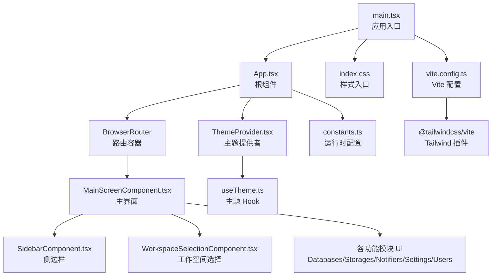
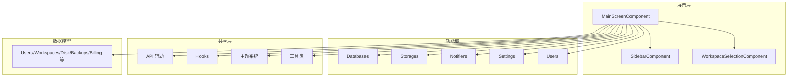
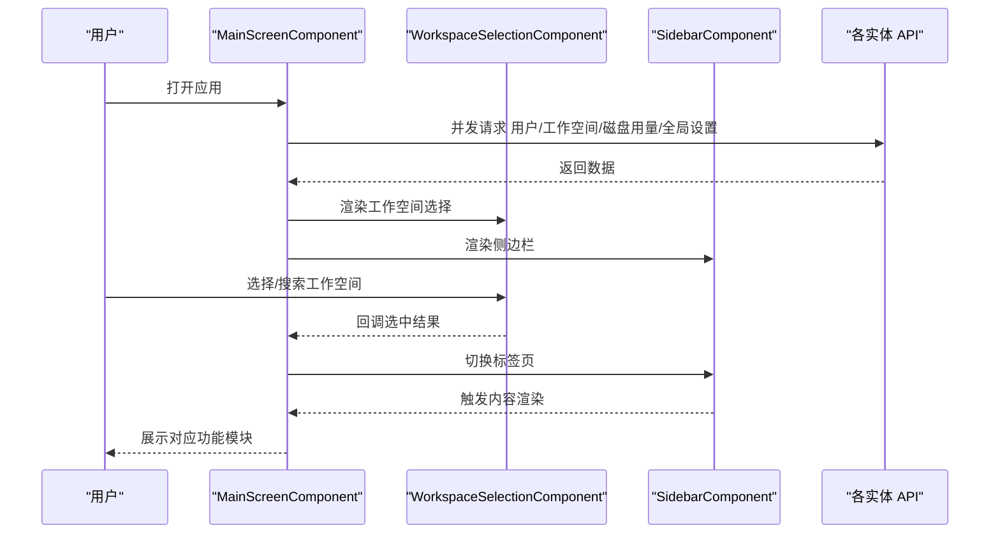
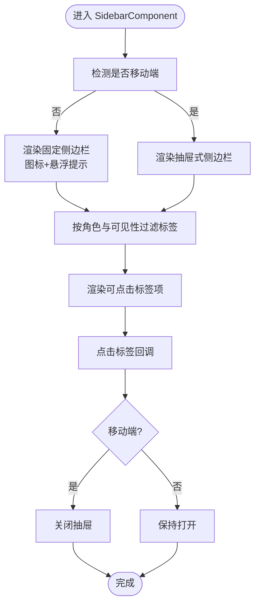
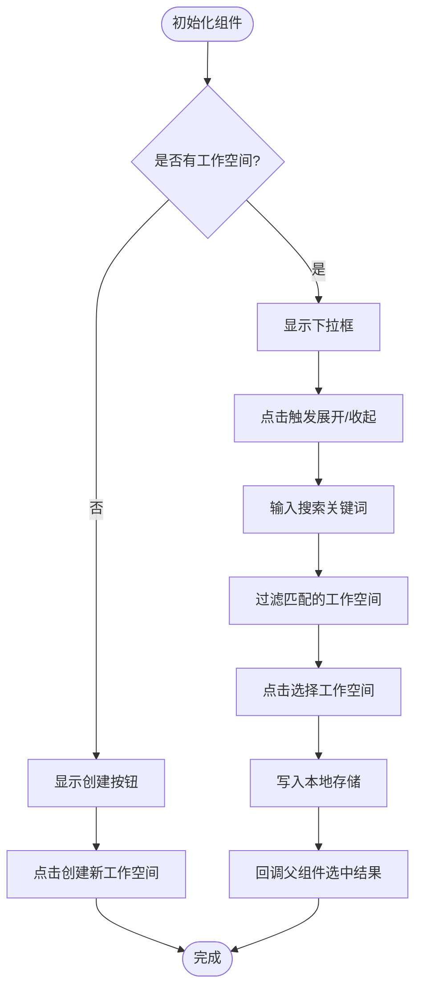
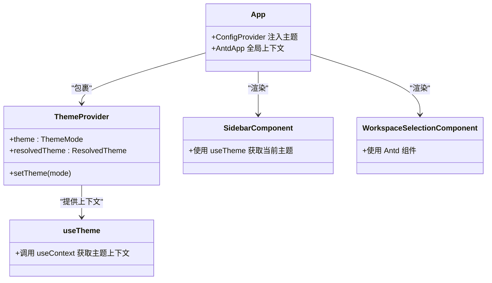
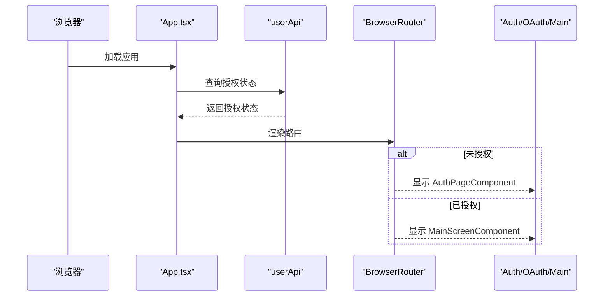
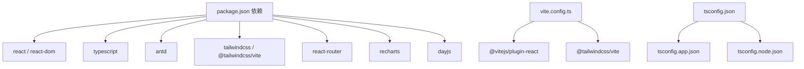

# 前端架构概览

<cite>
**本文档引用的文件**
- [package.json](file://frontend/package.json)
- [vite.config.ts](file://frontend/vite.config.ts)
- [tsconfig.json](file://frontend/tsconfig.json)
- [main.tsx](file://frontend/src/main.tsx)
- [App.tsx](file://frontend/src/App.tsx)
- [MainScreenComponent.tsx](file://frontend/src/widgets/main/MainScreenComponent.tsx)
- [SidebarComponent.tsx](file://frontend/src/widgets/main/SidebarComponent.tsx)
- [WorkspaceSelectionComponent.tsx](file://frontend/src/widgets/main/WorkspaceSelectionComponent.tsx)
- [ThemeProvider.tsx](file://frontend/src/shared/theme/ThemeProvider.tsx)
- [useTheme.ts](file://frontend/src/shared/theme/useTheme.ts)
- [index.css](file://frontend/src/index.css)
- [constants.ts](file://frontend/src/constants.ts)
- [index.ts](file://frontend/src/shared/api/index.ts)
</cite>

## 目录
1. [简介](#简介)
2. [项目结构](#项目结构)
3. [核心组件](#核心组件)
4. [架构总览](#架构总览)
5. [详细组件分析](#详细组件分析)
6. [依赖关系分析](#依赖关系分析)
7. [性能考虑](#性能考虑)
8. [故障排除指南](#故障排除指南)
9. [结论](#结论)

## 简介
本文件为 Databasus 前端架构概览，聚焦于现代前端技术栈（React 19 + TypeScript）的选择动机、应用整体布局与路由结构、主题系统与 UI 组件库集成（Ant Design + TailwindCSS）、前后端交互模式（API 调用策略、认证流程、错误处理），以及架构决策的技术考量与权衡。

## 项目结构
前端采用 Vite + React 19 + TypeScript 的现代化构建体系，使用 TailwindCSS 作为实用工具类系统，并通过 Ant Design 提供企业级 UI 组件。项目按功能域与共享层组织：widgets 展示层、features 功能模块、entity 数据模型、shared 共享能力（API、Hooks、主题、工具等）。入口文件负责初始化国际化与主题，根组件负责路由与全局配置。

图表来源
- [main.tsx:1-14](file://frontend/src/main.tsx#L1-L14)
- [App.tsx:1-77](file://frontend/src/App.tsx#L1-L77)
- [MainScreenComponent.tsx:1-405](file://frontend/src/widgets/main/MainScreenComponent.tsx#L1-L405)
- [SidebarComponent.tsx:1-227](file://frontend/src/widgets/main/SidebarComponent.tsx#L1-L227)
- [WorkspaceSelectionComponent.tsx:1-140](file://frontend/src/widgets/main/WorkspaceSelectionComponent.tsx#L1-L140)
- [ThemeProvider.tsx:1-79](file://frontend/src/shared/theme/ThemeProvider.tsx#L1-L79)
- [useTheme.ts:1-12](file://frontend/src/shared/theme/useTheme.ts#L1-L12)
- [index.css:1-80](file://frontend/src/index.css#L1-L80)
- [vite.config.ts:1-9](file://frontend/vite.config.ts#L1-L9)
- [constants.ts:1-72](file://frontend/src/constants.ts#L1-L72)

章节来源
- [package.json:1-46](file://frontend/package.json#L1-L46)
- [vite.config.ts:1-9](file://frontend/vite.config.ts#L1-L9)
- [tsconfig.json:1-5](file://frontend/tsconfig.json#L1-L5)
- [main.tsx:1-14](file://frontend/src/main.tsx#L1-L14)
- [App.tsx:1-77](file://frontend/src/App.tsx#L1-L77)

## 核心组件
- 应用入口与初始化：在入口中引入 dayjs 插件、样式与根组件，挂载 React 根节点。
- 根组件与路由：使用 ConfigProvider + AntdApp 包裹，BrowserRouter 管理路由；根据授权状态切换登录页或主界面。
- 主屏幕组件：负责加载用户、工作空间、磁盘用量与全局设置，管理侧边栏、工作空间选择、标签页导航与内容渲染。
- 侧边栏组件：支持桌面固定导航与移动端抽屉，动态过滤可见标签，响应式控制滚动与关闭行为。
- 工作空间选择组件：下拉筛选、点击外部关闭、本地存储选中工作空间 ID。
- 主题系统：提供者读取系统偏好与本地存储，计算解析主题并在文档根元素上应用 dark 类名。

章节来源
- [main.tsx:1-14](file://frontend/src/main.tsx#L1-L14)
- [App.tsx:16-77](file://frontend/src/App.tsx#L16-L77)
- [MainScreenComponent.tsx:31-405](file://frontend/src/widgets/main/MainScreenComponent.tsx#L31-L405)
- [SidebarComponent.tsx:34-227](file://frontend/src/widgets/main/SidebarComponent.tsx#L34-L227)
- [WorkspaceSelectionComponent.tsx:14-140](file://frontend/src/widgets/main/WorkspaceSelectionComponent.tsx#L14-L140)
- [ThemeProvider.tsx:32-79](file://frontend/src/shared/theme/ThemeProvider.tsx#L32-L79)

## 架构总览
整体采用“展示层 + 功能域 + 共享层”的分层架构：
- 展示层（widgets）：负责页面布局与交互，如主屏幕、侧边栏、工作空间选择。
- 功能域（features）：按业务模块划分，如数据库、存储、通知器、设置等。
- 共享层（shared）：API 辅助、Hook、主题、工具类、Toast 等横切关注点。
- 数据模型（entity）：定义 API 模型与 DTO，隔离后端接口细节。

图表来源
- [MainScreenComponent.tsx:15-29](file://frontend/src/widgets/main/MainScreenComponent.tsx#L15-L29)
- [SidebarComponent.tsx:1-12](file://frontend/src/widgets/main/SidebarComponent.tsx#L1-L12)
- [WorkspaceSelectionComponent.tsx:1-5](file://frontend/src/widgets/main/WorkspaceSelectionComponent.tsx#L1-L5)

## 详细组件分析

### 主屏幕组件分析
主屏幕组件承担应用的主要布局职责：顶部区域包含 Logo、工作空间选择、云服务提示、磁盘用量提示与主题切换；左侧为固定/抽屉式侧边栏；右侧根据选中标签动态渲染对应功能模块。组件通过并发加载多个 API 数据，统一错误提示，并持久化工作空间选择。

图表来源
- [MainScreenComponent.tsx:53-111](file://frontend/src/widgets/main/MainScreenComponent.tsx#L53-L111)
- [WorkspaceSelectionComponent.tsx:31-35](file://frontend/src/widgets/main/WorkspaceSelectionComponent.tsx#L31-L35)
- [SidebarComponent.tsx:70-75](file://frontend/src/widgets/main/SidebarComponent.tsx#L70-L75)

章节来源
- [MainScreenComponent.tsx:31-405](file://frontend/src/widgets/main/MainScreenComponent.tsx#L31-L405)

### 侧边栏组件分析
侧边栏在桌面端以紧凑图标导航呈现，在移动端以抽屉形式出现。组件根据用户角色过滤仅管理员可见的标签，支持磁盘用量提示与响应式滚动控制。

图表来源
- [SidebarComponent.tsx:77-109](file://frontend/src/widgets/main/SidebarComponent.tsx#L77-L109)
- [SidebarComponent.tsx:111-225](file://frontend/src/widgets/main/SidebarComponent.tsx#L111-L225)

章节来源
- [SidebarComponent.tsx:34-227](file://frontend/src/widgets/main/SidebarComponent.tsx#L34-L227)

### 工作空间选择组件分析
该组件实现下拉选择、输入搜索、点击外部关闭与创建新工作空间的能力。通过本地存储持久化上次选中的工作空间 ID，提升用户体验。

图表来源
- [WorkspaceSelectionComponent.tsx:50-61](file://frontend/src/widgets/main/WorkspaceSelectionComponent.tsx#L50-L61)
- [WorkspaceSelectionComponent.tsx:91-135](file://frontend/src/widgets/main/WorkspaceSelectionComponent.tsx#L91-L135)

章节来源
- [WorkspaceSelectionComponent.tsx:14-140](file://frontend/src/widgets/main/WorkspaceSelectionComponent.tsx#L14-L140)

### 主题系统与 UI 组件库集成
- Ant Design 集成：根组件通过 ConfigProvider 注入主题算法与主色，AntdApp 提供全局上下文；侧边栏与工作空间选择等组件直接使用 Antd 组件。
- TailwindCSS 集成：Vite 通过 @tailwindcss/vite 插件启用，样式入口使用 @import 'tailwindcss' 并开启暗色变体策略；通过类名实现响应式布局与颜色体系。
- 主题提供者：ThemeProvider 读取系统偏好与本地存储，计算解析主题，应用到文档根元素的 dark 类，实现自动切换与持久化。

图表来源
- [ThemeProvider.tsx:32-79](file://frontend/src/shared/theme/ThemeProvider.tsx#L32-L79)
- [useTheme.ts:5-11](file://frontend/src/shared/theme/useTheme.ts#L5-L11)
- [App.tsx:44-65](file://frontend/src/App.tsx#L44-L65)
- [SidebarComponent.tsx:44](file://frontend/src/widgets/main/SidebarComponent.tsx#L44)
- [WorkspaceSelectionComponent.tsx:1](file://frontend/src/widgets/main/WorkspaceSelectionComponent.tsx#L1)

章节来源
- [App.tsx:16-77](file://frontend/src/App.tsx#L16-L77)
- [ThemeProvider.tsx:1-79](file://frontend/src/shared/theme/ThemeProvider.tsx#L1-L79)
- [useTheme.ts:1-12](file://frontend/src/shared/theme/useTheme.ts#L1-L12)
- [index.css:1-80](file://frontend/src/index.css#L1-L80)
- [vite.config.ts:1-9](file://frontend/vite.config.ts#L1-L9)

### 前后端交互模式
- API 辅助：通过共享 API 辅助模块封装访问令牌与通用请求逻辑，集中处理认证头、重试、超时等策略。
- 运行时配置：constants.ts 提供运行时配置读取与服务器地址推导，支持开发环境与生产环境端口差异。
- 认证流程：根组件监听用户授权状态变化，未授权时渲染登录页，授权后渲染主界面；OAuth 回调与第三方存储授权页面独立路由。
- 错误处理：主屏幕组件在并发加载失败时统一弹出错误提示；各功能模块内部也应遵循一致的错误上报与用户反馈策略。

图表来源
- [App.tsx:34-41](file://frontend/src/App.tsx#L34-L41)
- [App.tsx:55-61](file://frontend/src/App.tsx#L55-L61)
- [constants.ts:19-30](file://frontend/src/constants.ts#L19-L30)

章节来源
- [App.tsx:16-77](file://frontend/src/App.tsx#L16-L77)
- [constants.ts:1-72](file://frontend/src/constants.ts#L1-L72)
- [index.ts:1-5](file://frontend/src/shared/api/index.ts#L1-L5)

## 依赖关系分析
- 技术栈依赖：React 19、TypeScript、Ant Design、TailwindCSS、Recharts、dayjs、react-router 等。
- 构建工具：Vite + @vitejs/plugin-react + @tailwindcss/vite。
- 类型安全：tsconfig 采用多引用配置，分别指向应用与 Node 工具链配置。

图表来源
- [package.json:15-44](file://frontend/package.json#L15-L44)
- [vite.config.ts:1-9](file://frontend/vite.config.ts#L1-L9)
- [tsconfig.json:1-5](file://frontend/tsconfig.json#L1-L5)

章节来源
- [package.json:1-46](file://frontend/package.json#L1-L46)
- [vite.config.ts:1-9](file://frontend/vite.config.ts#L1-L9)
- [tsconfig.json:1-5](file://frontend/tsconfig.json#L1-L5)

## 性能考虑
- 并发加载：主屏幕组件对多个初始数据进行并发请求，减少首屏等待时间。
- 响应式布局：通过 Tailwind 实现移动端与桌面端差异化 UI，降低额外样式体积。
- 主题切换：基于 CSS 变量与 dark 类策略，避免重复渲染与闪烁。
- 代码分割：建议按功能域拆分路由级组件，结合 React.lazy 优化首屏体积。
- 图标与资源：使用 SVG 资源与懒加载策略，减少主线程阻塞。

## 故障排除指南
- 授权状态异常：检查用户 API 的授权监听与状态更新逻辑，确认回调触发时机。
- 路由跳转问题：确认 BrowserRouter 使用与路由路径配置，OAuth 回调与存储授权页面路径正确。
- 主题不生效：检查 ThemeProvider 是否包裹根组件，文档根元素是否正确添加/移除 dark 类。
- 样式冲突：确认 Tailwind 插件已正确安装与启用，暗色变体声明与类名策略一致。
- 环境变量缺失：核对 constants.ts 中的运行时配置读取逻辑，确保开发与生产环境端口推导正确。

章节来源
- [App.tsx:34-41](file://frontend/src/App.tsx#L34-L41)
- [ThemeProvider.tsx:54-61](file://frontend/src/shared/theme/ThemeProvider.tsx#L54-L61)
- [constants.ts:19-30](file://frontend/src/constants.ts#L19-L30)

## 结论
Databasus 前端采用 React 19 + TypeScript 的现代化技术栈，结合 Ant Design 与 TailwindCSS 实现高一致性与高效率的 UI 开发。通过清晰的分层架构、主题系统与路由策略，以及对并发加载与响应式设计的重视，整体具备良好的可维护性与扩展性。后续可在路由级代码分割、错误边界与监控埋点方面进一步完善，以提升用户体验与可观测性。