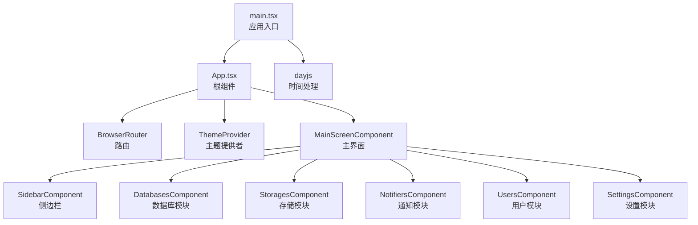
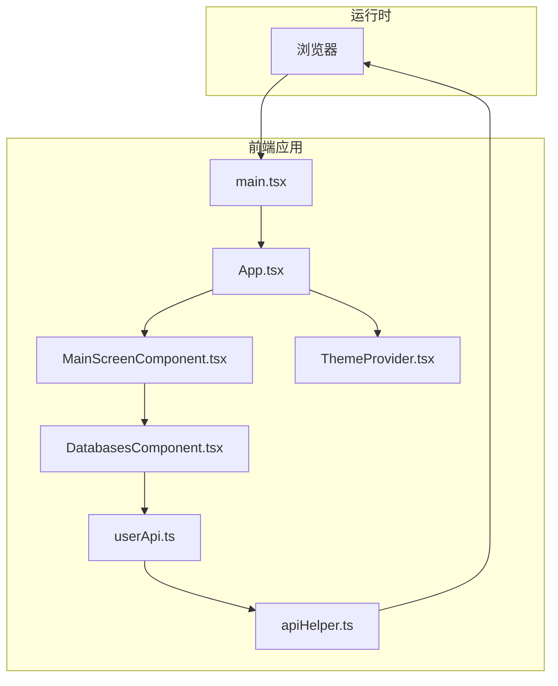
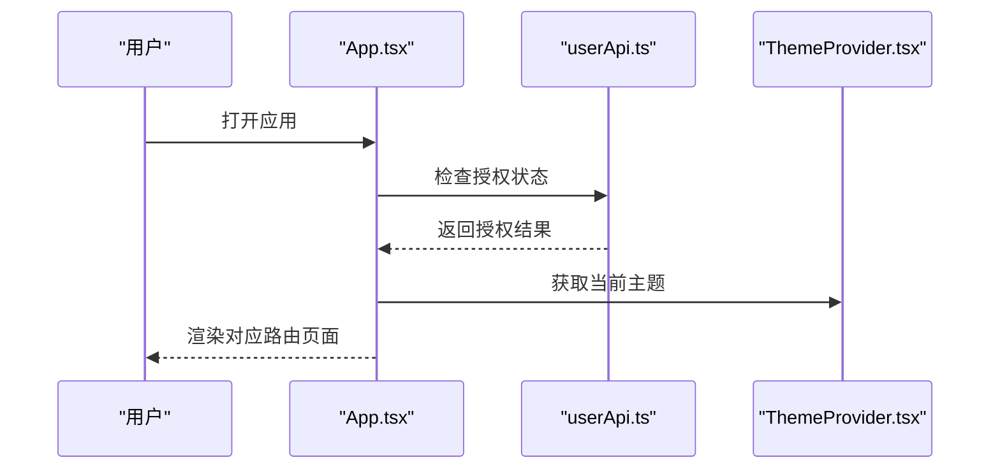
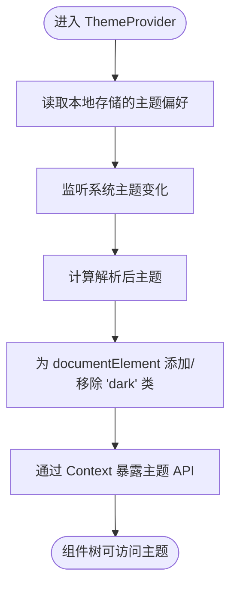
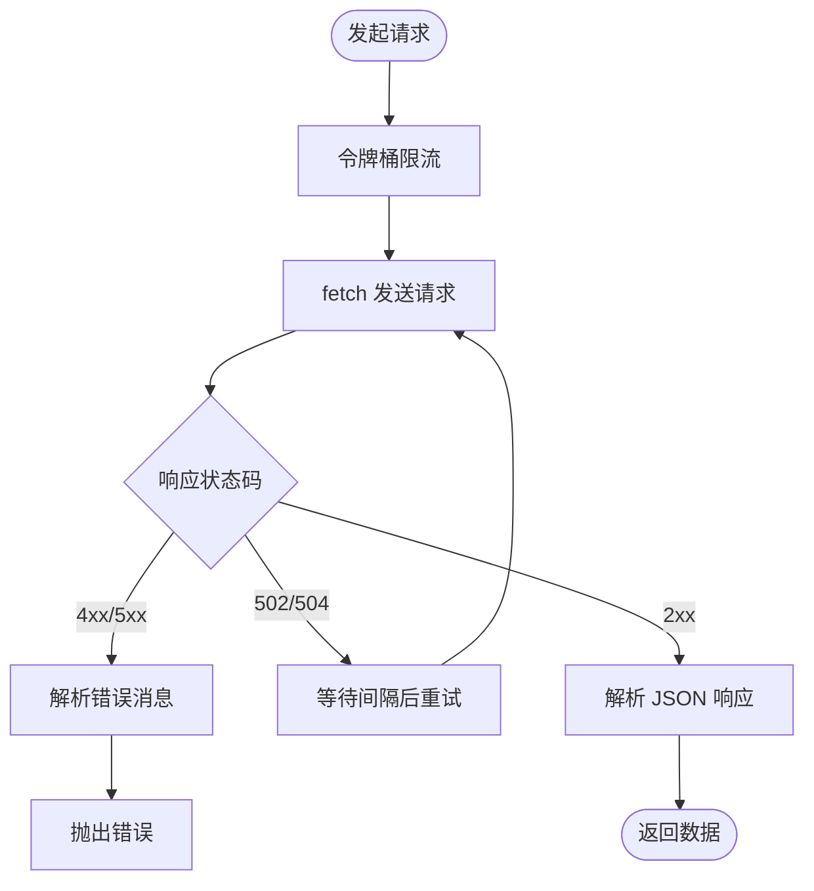
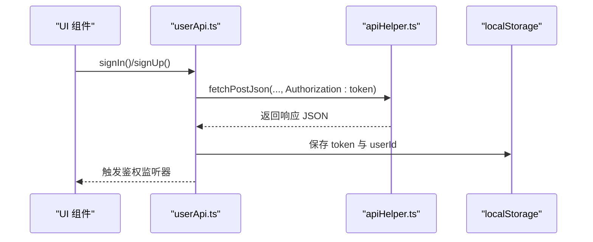
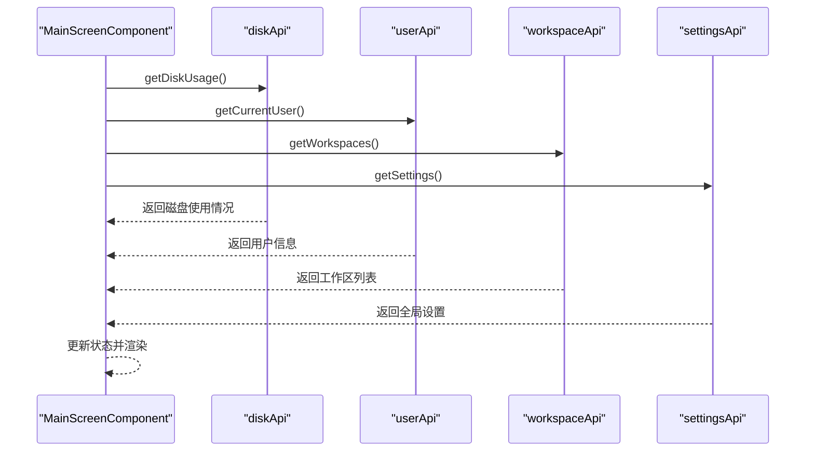
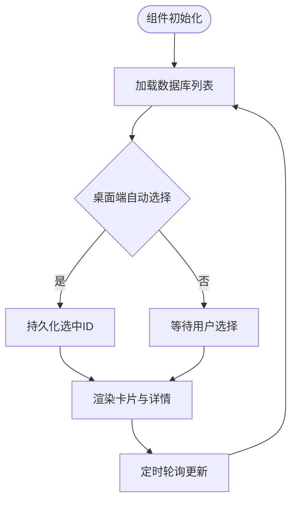
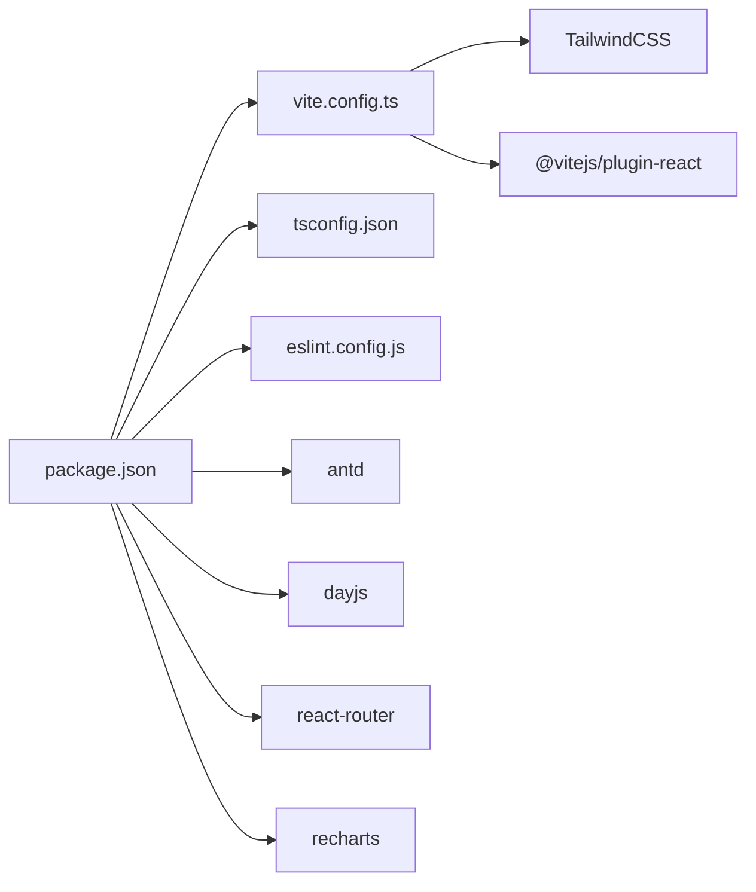

# 前端架构设计

<cite>
**本文档引用的文件**
- [package.json](file://frontend/package.json)
- [vite.config.ts](file://frontend/vite.config.ts)
- [tsconfig.json](file://frontend/tsconfig.json)
- [tsconfig.app.json](file://frontend/tsconfig.app.json)
- [tsconfig.node.json](file://frontend/tsconfig.node.json)
- [main.tsx](file://frontend/src/main.tsx)
- [App.tsx](file://frontend/src/App.tsx)
- [ThemeProvider.tsx](file://frontend/src/shared/theme/ThemeProvider.tsx)
- [apiHelper.ts](file://frontend/src/shared/api/apiHelper.ts)
- [userApi.ts](file://frontend/src/entity/users/api/userApi.ts)
- [DatabasesComponent.tsx](file://frontend/src/features/databases/ui/DatabasesComponent.tsx)
- [MainScreenComponent.tsx](file://frontend/src/widgets/main/MainScreenComponent.tsx)
- [constants.ts](file://frontend/src/constants.ts)
- [eslint.config.js](file://frontend/eslint.config.js)
- [useVersionCheck.ts](file://frontend/src/shared/hooks/useVersionCheck.ts)
</cite>

## 目录
1. [引言](#引言)
2. [项目结构](#项目结构)
3. [核心组件](#核心组件)
4. [架构总览](#架构总览)
5. [详细组件分析](#详细组件分析)
6. [依赖关系分析](#依赖关系分析)
7. [性能考虑](#性能考虑)
8. [故障排除指南](#故障排除指南)
9. [结论](#结论)
10. [附录](#附录)

## 引言
本文件为 Databasus 前端架构设计文档，面向 React 19 + TypeScript 的现代前端栈，采用组件化设计与分层架构，结合 Ant Design 组件库与 TailwindCSS 样式系统，实现响应式布局与主题切换。前端通过统一的 API 层进行 RESTful 调用，内置鉴权监听、版本检查、限流与重试机制，并通过 Vite 构建工具与 TypeScript/ESLint 配置保障开发体验与代码质量。

## 项目结构
前端采用按功能域（feature）与实体（entity）分层的组织方式，配合共享层（shared）复用通用能力（API、Hooks、UI、主题、工具）。入口文件负责初始化第三方库与根组件挂载；应用根组件负责路由、主题与鉴权状态管理；主界面组件负责工作区选择、侧边栏导航与各功能模块的渲染。

**图表来源**
- [main.tsx:1-14](file://frontend/src/main.tsx#L1-L14)
- [App.tsx:1-77](file://frontend/src/App.tsx#L1-L77)
- [MainScreenComponent.tsx:1-405](file://frontend/src/widgets/main/MainScreenComponent.tsx#L1-L405)

**章节来源**
- [main.tsx:1-14](file://frontend/src/main.tsx#L1-L14)
- [App.tsx:1-77](file://frontend/src/App.tsx#L1-L77)
- [vite.config.ts:1-9](file://frontend/vite.config.ts#L1-L9)

## 核心组件
- 应用入口与初始化：在入口文件中引入 dayjs 插件并挂载根组件，确保国际化与相对时间格式化可用。
- 根组件与路由：根组件负责 Ant Design 主题配置、路由注册与鉴权状态监听，根据登录状态决定渲染认证页或主界面。
- 主界面容器：负责工作区加载、磁盘空间监控、用户信息与全局设置获取，以及侧边栏与内容区域的协调展示。
- 数据库模块：支持数据库列表、搜索、详情与新增流程，具备移动端自适应与本地持久化选中项。
- API 抽象层：统一封装 REST 请求、鉴权头注入、错误处理、重试与限流策略。
- 主题系统：支持系统/浅色/深色三种模式，持久化用户偏好并通过 DOM 类名驱动 Tailwind 暗色主题。

**章节来源**
- [main.tsx:1-14](file://frontend/src/main.tsx#L1-L14)
- [App.tsx:16-77](file://frontend/src/App.tsx#L16-L77)
- [MainScreenComponent.tsx:31-405](file://frontend/src/widgets/main/MainScreenComponent.tsx#L31-L405)
- [DatabasesComponent.tsx:22-204](file://frontend/src/features/databases/ui/DatabasesComponent.tsx#L22-L204)
- [apiHelper.ts:63-264](file://frontend/src/shared/api/apiHelper.ts#L63-L264)
- [ThemeProvider.tsx:32-79](file://frontend/src/shared/theme/ThemeProvider.tsx#L32-L79)

## 架构总览
前端采用“入口 -> 根组件 -> 功能域组件”的分层架构，数据流从 API 层流向实体层，再由实体层驱动 UI 组件更新。鉴权状态通过用户 API 的监听器在根组件中集中管理，主题状态通过 Context 在组件树中传播。

**图表来源**
- [main.tsx:1-14](file://frontend/src/main.tsx#L1-L14)
- [App.tsx:1-77](file://frontend/src/App.tsx#L1-L77)
- [MainScreenComponent.tsx:1-405](file://frontend/src/widgets/main/MainScreenComponent.tsx#L1-L405)
- [DatabasesComponent.tsx:1-204](file://frontend/src/features/databases/ui/DatabasesComponent.tsx#L1-L204)
- [userApi.ts:1-189](file://frontend/src/entity/users/api/userApi.ts#L1-L189)
- [apiHelper.ts:1-264](file://frontend/src/shared/api/apiHelper.ts#L1-L264)
- [ThemeProvider.tsx:1-79](file://frontend/src/shared/theme/ThemeProvider.tsx#L1-L79)

## 详细组件分析

### 应用入口与初始化
- 初始化 dayjs 插件（UTC、相对时间），保证时间显示一致性。
- 创建根节点并渲染根组件，确保应用启动顺序正确。

**章节来源**
- [main.tsx:1-14](file://frontend/src/main.tsx#L1-L14)

### 根组件与路由
- 使用 Ant Design ConfigProvider 注入主题算法与主色调。
- 集成 Paddle 支付回调事件（云版特性），通过自定义事件桥接。
- 监听鉴权状态变化，动态切换路由元素（认证页或主界面）。
- 将主题提供者包裹根组件，使子树可访问主题上下文。

**图表来源**
- [App.tsx:16-77](file://frontend/src/App.tsx#L16-L77)
- [userApi.ts:165-189](file://frontend/src/entity/users/api/userApi.ts#L165-L189)
- [ThemeProvider.tsx:32-79](file://frontend/src/shared/theme/ThemeProvider.tsx#L32-L79)

**章节来源**
- [App.tsx:16-77](file://frontend/src/App.tsx#L16-L77)

### 主题系统（ThemeProvider）
- 支持系统/浅色/深色三种模式，优先级为用户选择 > 系统偏好。
- 监听系统主题变化，自动更新解析后的主题。
- 将主题模式持久化到本地存储，并通过 documentElement 类名控制暗色样式。
- 提供 setTheme 方法以供 UI 组件触发主题切换。

**图表来源**
- [ThemeProvider.tsx:32-79](file://frontend/src/shared/theme/ThemeProvider.tsx#L32-L79)

**章节来源**
- [ThemeProvider.tsx:32-79](file://frontend/src/shared/theme/ThemeProvider.tsx#L32-L79)

### API 抽象层（apiHelper）
- 统一封装 GET/POST/PUT/DELETE 等请求方法，自动注入鉴权头与 JSON 头。
- 内置错误处理：对 4xx/5xx 响应提取 message 或 error 字段作为错误信息；对 502/504 进行重试。
- 限流策略：根据是否云版设置不同速率限制，避免后端过载。
- 重试机制：失败时按固定间隔重试指定次数，提升网络波动下的稳定性。

**图表来源**
- [apiHelper.ts:42-61](file://frontend/src/shared/api/apiHelper.ts#L42-L61)
- [apiHelper.ts:10-40](file://frontend/src/shared/api/apiHelper.ts#L10-L40)

**章节来源**
- [apiHelper.ts:63-264](file://frontend/src/shared/api/apiHelper.ts#L63-L264)

### 用户 API（userApi）
- 提供登录、注册、邀请、密码修改、OAuth 回调等用户相关接口。
- 自动保存访问令牌与用户 ID，触发鉴权监听器以更新全局状态。
- 提供 isAuthorized、logout、鉴权监听器注册/移除等能力，便于根组件集中管理。

**图表来源**
- [userApi.ts:33-60](file://frontend/src/entity/users/api/userApi.ts#L33-L60)
- [apiHelper.ts:63-83](file://frontend/src/shared/api/apiHelper.ts#L63-L83)

**章节来源**
- [userApi.ts:1-189](file://frontend/src/entity/users/api/userApi.ts#L1-L189)

### 主屏幕组件（MainScreenComponent）
- 并行加载磁盘使用情况、当前用户、工作区列表与全局设置，提升首屏性能。
- 管理工作区选择与本地持久化，支持创建新工作区并自动跳转数据库页。
- 根据角色权限控制功能可见性（如仅查看者不可管理数据库）。
- 集成磁盘空间告警逻辑，超过阈值时提示空间不足风险。

**图表来源**
- [MainScreenComponent.tsx:53-77](file://frontend/src/widgets/main/MainScreenComponent.tsx#L53-L77)

**章节来源**
- [MainScreenComponent.tsx:31-405](file://frontend/src/widgets/main/MainScreenComponent.tsx#L31-L405)

### 数据库模块（DatabasesComponent）
- 支持数据库列表展示、搜索过滤、移动端自适应布局。
- 自动轮询刷新数据库状态，保持 UI 与后端一致。
- 本地持久化当前选中的数据库 ID，避免频繁重新选择。
- 提供新增数据库弹窗与详情页联动，支持删除后自动切换下一个数据库。

**图表来源**
- [DatabasesComponent.tsx:40-75](file://frontend/src/features/databases/ui/DatabasesComponent.tsx#L40-L75)

**章节来源**
- [DatabasesComponent.tsx:22-204](file://frontend/src/features/databases/ui/DatabasesComponent.tsx#L22-L204)

### 版本检查 Hook（useVersionCheck）
- 定期向系统 API 查询最新版本，若发现新版本则在冷却时间后强制刷新页面。
- 开发模式下跳过版本检查，避免干扰本地调试。

**章节来源**
- [useVersionCheck.ts:10-41](file://frontend/src/shared/hooks/useVersionCheck.ts#L10-L41)

## 依赖关系分析
- 构建与工具链：Vite 作为开发服务器与打包工具，TailwindCSS 作为原子化样式框架，TypeScript 提供类型安全。
- 运行时依赖：React 19 与 React Router 7 实现组件化与路由；Ant Design 提供企业级 UI 组件；dayjs 提供时间处理；recharts 用于可视化。
- 开发依赖：ESLint + TypeScript ESLint + Prettier 保证代码风格与质量；Vitest 用于单元测试。

**图表来源**
- [package.json:1-46](file://frontend/package.json#L1-L46)
- [vite.config.ts:1-9](file://frontend/vite.config.ts#L1-L9)
- [tsconfig.json:1-5](file://frontend/tsconfig.json#L1-L5)
- [eslint.config.js:1-36](file://frontend/eslint.config.js#L1-L36)

**章节来源**
- [package.json:1-46](file://frontend/package.json#L1-L46)
- [vite.config.ts:1-9](file://frontend/vite.config.ts#L1-L9)
- [tsconfig.json:1-5](file://frontend/tsconfig.json#L1-L5)
- [eslint.config.js:1-36](file://frontend/eslint.config.js#L1-L36)

## 性能考虑
- 并行数据加载：主界面使用 Promise.all 同时获取磁盘、用户、工作区与设置，减少首屏等待时间。
- 本地持久化：主题、工作区与数据库选中项均持久化到 localStorage，降低重复请求与状态丢失。
- 轮询与节流：数据库列表每 5 分钟轮询一次，API 层内置令牌桶限流，避免突发流量冲击后端。
- 移动端优化：移动端默认不自动选择数据库，先展示列表再进入详情，减少首屏复杂度。
- 暗色主题：通过 documentElement 类名切换，避免运行时样式计算开销。

[本节为通用性能建议，无需特定文件引用]

## 故障排除指南
- 鉴权失败：当后端返回 401 时，API 层会清理本地令牌并刷新页面，需确认登录状态与令牌有效性。
- 网络异常：502/504 将触发重试，若仍失败请检查后端服务可用性与网络连通性。
- 版本不一致：版本检查发现新版本会强制刷新，若频繁刷新请检查冷却时间与缓存策略。
- 主题不生效：确认系统主题变化监听是否正常，以及 documentElement 是否包含 'dark' 类名。

**章节来源**
- [apiHelper.ts:10-40](file://frontend/src/shared/api/apiHelper.ts#L10-L40)
- [useVersionCheck.ts:10-41](file://frontend/src/shared/hooks/useVersionCheck.ts#L10-L41)
- [ThemeProvider.tsx:32-79](file://frontend/src/shared/theme/ThemeProvider.tsx#L32-L79)

## 结论
Databasus 前端以 React 19 + TypeScript 为基础，结合 Ant Design 与 TailwindCSS 实现高一致性与可维护性的 UI 体系；通过统一 API 层与鉴权监听机制，确保数据流清晰、状态可控；借助 Vite、ESLint 与 TypeScript 配置，提供良好的开发体验与代码质量保障。整体架构在性能、可扩展性与用户体验之间取得平衡，适合长期演进与团队协作。

[本节为总结性内容，无需特定文件引用]

## 附录

### 开发环境搭建指南
- 安装依赖：使用包管理器安装项目依赖，确保 Node.js 版本满足要求。
- 启动开发服务器：执行 dev 脚本启动 Vite 开发服务器，支持热重载。
- 构建产物：执行 build 脚本进行类型检查与打包。
- 代码格式化与校验：使用 lint 与 format 脚本统一代码风格与质量。
- 测试：使用 test 与 test:watch 脚本运行单元测试。

**章节来源**
- [package.json:6-14](file://frontend/package.json#L6-L14)

### TypeScript 配置概览
- 多 tsconfig 文件：通过 references 将应用与 Node 工具链分开配置，提升编译效率与类型隔离。
- 应用配置：启用严格模式与 JSX 支持，适配 React 19 新特性。
- Node 配置：针对构建脚本与工具链的独立配置。

**章节来源**
- [tsconfig.json:1-5](file://frontend/tsconfig.json#L1-L5)
- [tsconfig.app.json](file://frontend/tsconfig.app.json)
- [tsconfig.node.json](file://frontend/tsconfig.node.json)

### ESLint 规则要点
- 推荐规则集：基于 @eslint/js 与 typescript-eslint，启用 React 与 React Hooks 推荐规则。
- React Refresh：允许常量导出，避免不必要的刷新。
- 关闭严格依赖检查：在开发阶段降低误报，提升开发效率。

**章节来源**
- [eslint.config.js:8-36](file://frontend/eslint.config.js#L8-L36)