# 功能模块架构

<cite>
**本文档引用的文件**
- [backups_config/controller.go](file://backend/internal/features/backups/config/controller.go)
- [backups_config/model.go](file://backend/internal/features/backups/config/model.go)
- [backups_config/service.go](file://backend/internal/features/backups/config/service.go)
- [databases/controller.go](file://backend/internal/features/databases/controller.go)
- [databases/model.go](file://backend/internal/features/databases/model.go)
- [databases/service.go](file://backend/internal/features/databases/service.go)
- [storages/controller.go](file://backend/internal/features/storages/controller.go)
- [storages/model.go](file://backend/internal/features/storages/model.go)
- [notifiers/controller.go](file://backend/internal/features/notifiers/controller.go)
- [notifiers/model.go](file://backend/internal/features/notifiers/model.go)
- [audit_logs/controller.go](file://backend/internal/features/audit_logs/controller.go)
- [audit_logs/models.go](file://backend/internal/features/audit_logs/models.go)
- [encryption/field_encryptor.go](file://backend/internal/util/encryption/field_encryptor.go)
- [cache/cache.go](file://backend/internal/util/cache/cache.go)
- [logger/logger.go](file://backend/internal/util/logger/logger.go)
</cite>

## 目录
1. [简介](#简介)
2. [项目结构](#项目结构)
3. [核心组件](#核心组件)
4. [架构概览](#架构概览)
5. [详细组件分析](#详细组件分析)
6. [依赖关系分析](#依赖关系分析)
7. [性能考虑](#性能考虑)
8. [故障排除指南](#故障排除指南)
9. [结论](#结论)

## 简介

Databasus 是一个现代化的数据库备份和管理平台，采用模块化架构设计。该系统通过清晰的功能模块分离，实现了数据库备份配置、存储管理、通知系统等功能的独立维护和扩展。

本架构文档重点关注后端功能模块的设计与实现，包括：
- **功能模块组织**：features目录下的核心业务模块
- **实体模型设计**：基于GORM的数据库实体映射
- **共享库设计**：通用工具函数和基础设施组件
- **模块间通信**：服务层的依赖注入和事件处理机制

## 项目结构

Databasus 后端采用分层架构，主要分为以下层次：

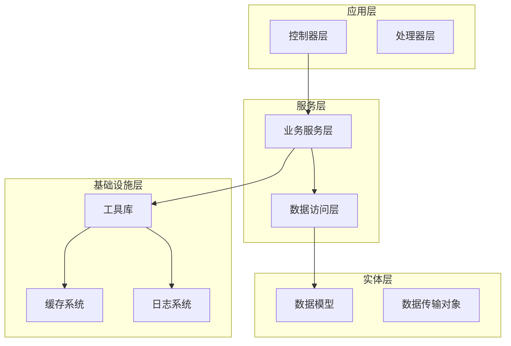

**图表来源**
- [databases/controller.go:14-38](file://backend/internal/features/databases/controller.go#L14-L38)
- [databases/service.go:26-38](file://backend/internal/features/databases/service.go#L26-L38)
- [cache/cache.go:13-45](file://backend/internal/util/cache/cache.go#L13-L45)

**章节来源**
- [databases/controller.go:1-505](file://backend/internal/features/databases/controller.go#L1-L505)
- [storages/controller.go:1-340](file://backend/internal/features/storages/controller.go#L1-L340)
- [notifiers/controller.go:1-335](file://backend/internal/features/notifiers/controller.go#L1-L335)

## 核心组件

### 功能模块架构

系统采用功能模块化设计，每个功能模块包含完整的三层结构：

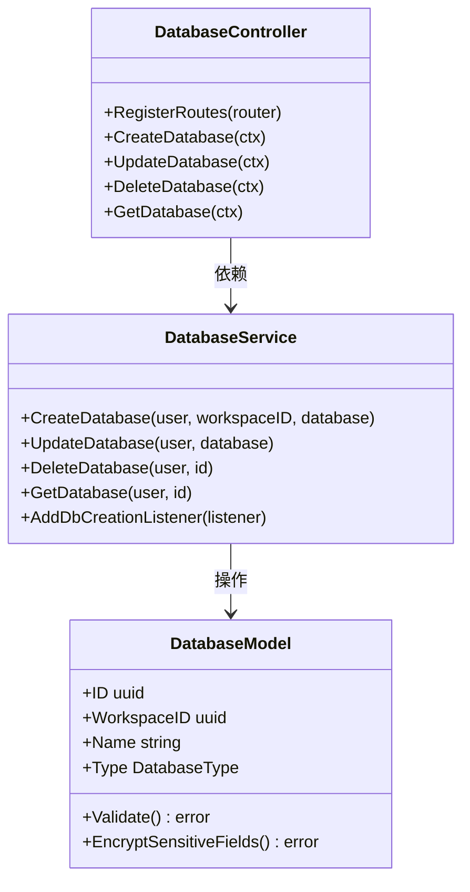

**图表来源**
- [databases/controller.go:14-38](file://backend/internal/features/databases/controller.go#L14-L38)
- [databases/service.go:26-38](file://backend/internal/features/databases/service.go#L26-L38)
- [databases/model.go:19-44](file://backend/internal/features/databases/model.go#L19-L44)

### 实体模型设计

所有核心实体都采用统一的模式设计，支持多态存储和敏感数据加密：

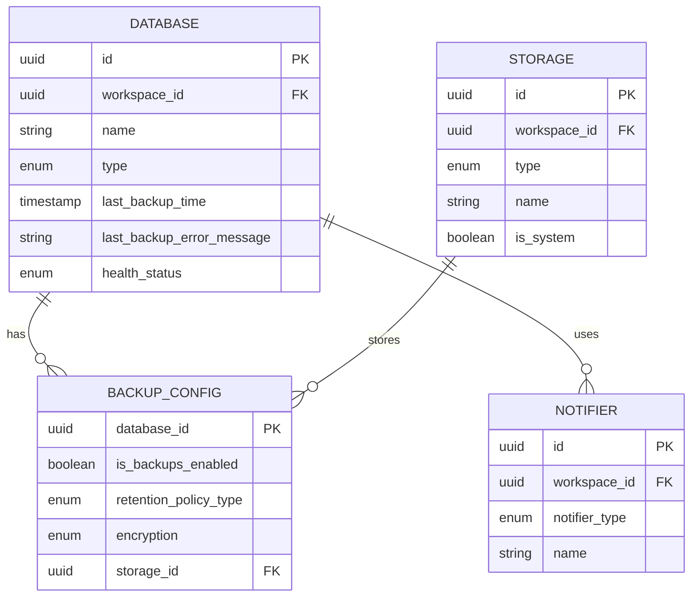

**图表来源**
- [databases/model.go:19-44](file://backend/internal/features/databases/model.go#L19-L44)
- [storages/model.go:22-39](file://backend/internal/features/storages/model.go#L22-L39)
- [notifiers/model.go:18-32](file://backend/internal/features/notifiers/model.go#L18-L32)
- [backups_config/model.go:16-44](file://backend/internal/features/backups/config/model.go#L16-L44)

**章节来源**
- [databases/model.go:1-206](file://backend/internal/features/databases/model.go#L1-L206)
- [storages/model.go:1-185](file://backend/internal/features/storages/model.go#L1-L185)
- [notifiers/model.go:1-122](file://backend/internal/features/notifiers/model.go#L1-L122)
- [backups_config/model.go:1-156](file://backend/internal/features/backups/config/model.go#L1-L156)

## 架构概览

### 模块间通信机制

系统采用事件驱动和依赖注入相结合的通信模式：

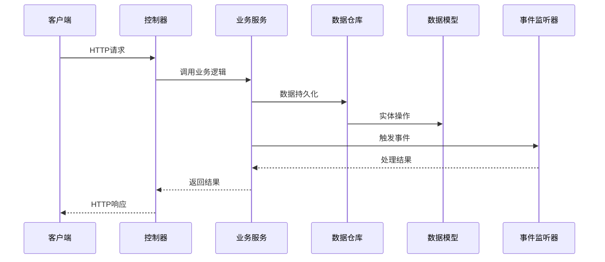

**图表来源**
- [databases/service.go:40-56](file://backend/internal/features/databases/service.go#L40-L56)
- [backups_config/service.go:27-31](file://backend/internal/features/backups/config/service.go#L27-L31)

### 权限控制架构

系统实现了严格的权限控制机制：

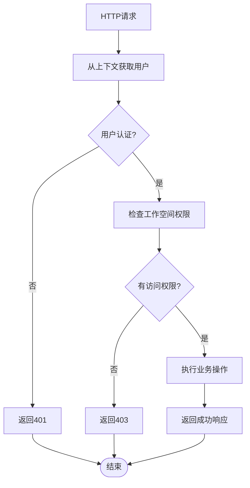

**图表来源**
- [databases/controller.go:52-77](file://backend/internal/features/databases/controller.go#L52-L77)
- [storages/controller.go:42-71](file://backend/internal/features/storages/controller.go#L42-L71)

**章节来源**
- [databases/controller.go:1-505](file://backend/internal/features/databases/controller.go#L1-L505)
- [storages/controller.go:1-340](file://backend/internal/features/storages/controller.go#L1-L340)
- [notifiers/controller.go:1-335](file://backend/internal/features/notifiers/controller.go#L1-L335)

## 详细组件分析

### 备份配置模块

备份配置模块提供了完整的备份策略管理功能：

#### 核心组件关系

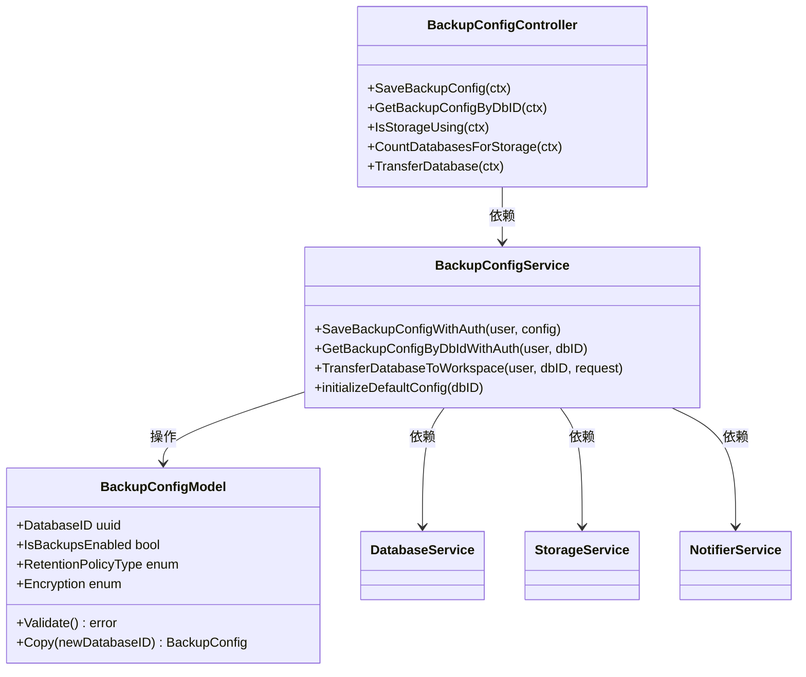

**图表来源**
- [backups_config/controller.go:13-23](file://backend/internal/features/backups/config/controller.go#L13-L23)
- [backups_config/service.go:17-25](file://backend/internal/features/backups/config/service.go#L17-L25)
- [backups_config/model.go:16-44](file://backend/internal/features/backups/config/model.go#L16-L44)

#### 配置验证流程

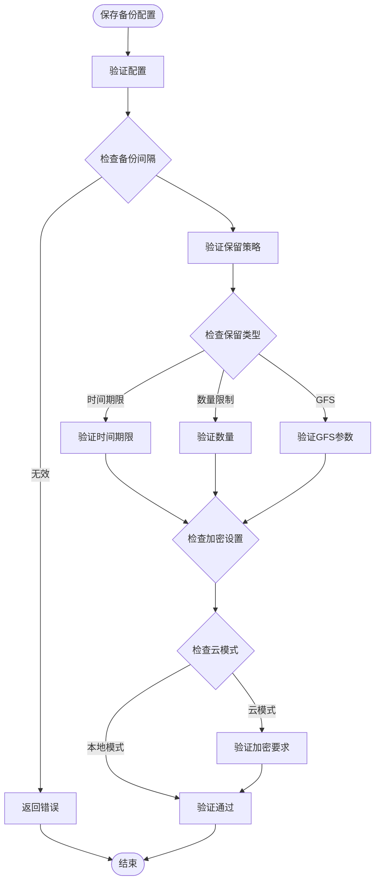

**图表来源**
- [backups_config/model.go:83-108](file://backend/internal/features/backups/config/model.go#L83-L108)

**章节来源**
- [backups_config/controller.go:1-210](file://backend/internal/features/backups/config/controller.go#L1-L210)
- [backups_config/service.go:1-381](file://backend/internal/features/backups/config/service.go#L1-L381)
- [backups_config/model.go:1-156](file://backend/internal/features/backups/config/model.go#L1-L156)

### 数据库管理模块

数据库管理模块提供了统一的数据库抽象层：

#### 多数据库类型支持

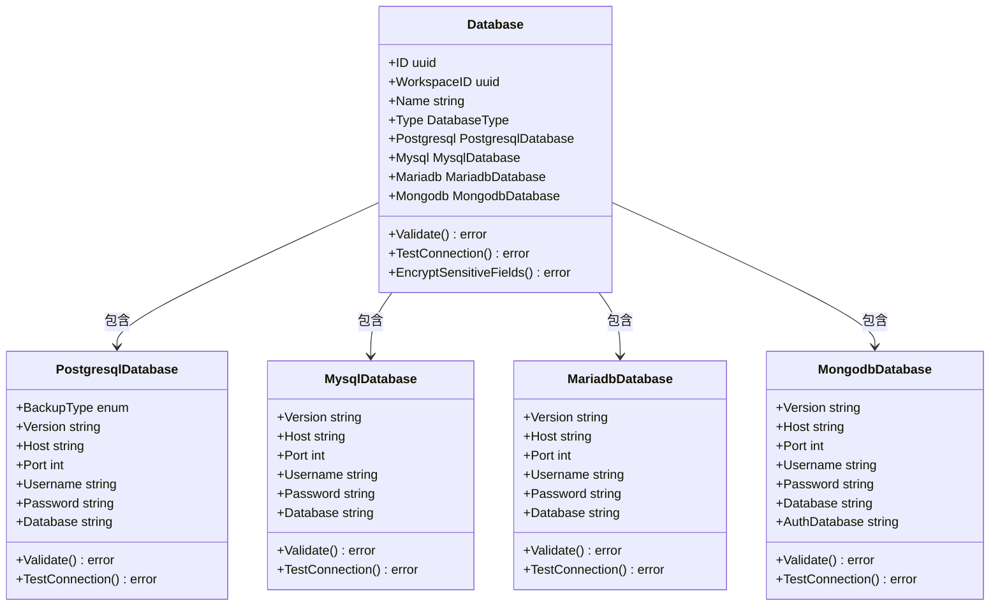

**图表来源**
- [databases/model.go:19-33](file://backend/internal/features/databases/model.go#L19-L33)

#### 数据库操作流程

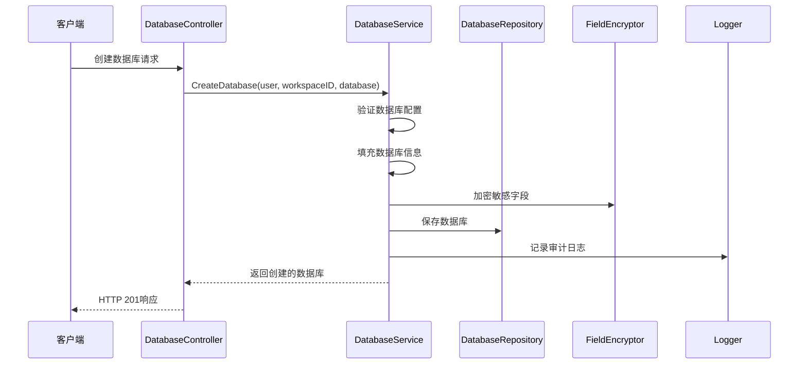

**图表来源**
- [databases/service.go:69-116](file://backend/internal/features/databases/service.go#L69-L116)

**章节来源**
- [databases/controller.go:1-505](file://backend/internal/features/databases/controller.go#L1-L505)
- [databases/service.go:1-883](file://backend/internal/features/databases/service.go#L1-L883)
- [databases/model.go:1-206](file://backend/internal/features/databases/model.go#L1-L206)

### 存储管理模块

存储管理模块支持多种存储类型，包括本地存储、云存储等：

#### 存储类型抽象

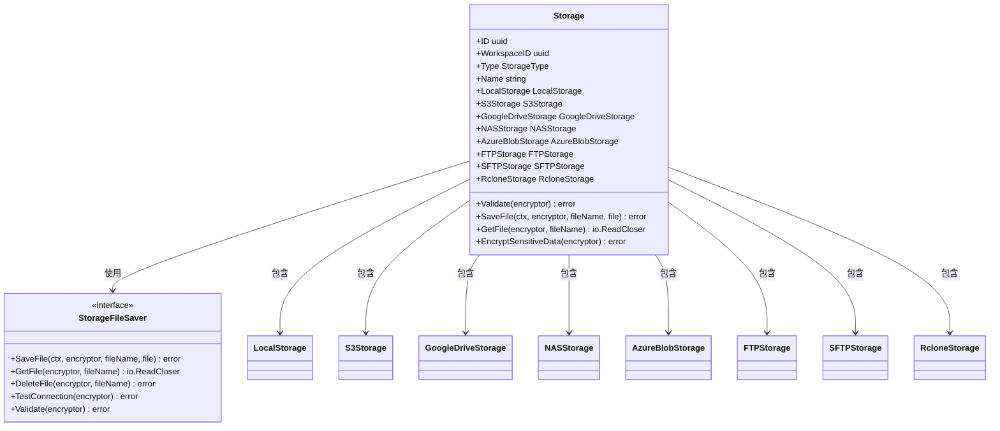

**图表来源**
- [storages/model.go:22-39](file://backend/internal/features/storages/model.go#L22-L39)

**章节来源**
- [storages/controller.go:1-340](file://backend/internal/features/storages/controller.go#L1-L340)
- [storages/model.go:1-185](file://backend/internal/features/storages/model.go#L1-L185)

### 通知系统模块

通知系统支持多种通知渠道，包括邮件、Slack、Discord等：

#### 通知渠道抽象

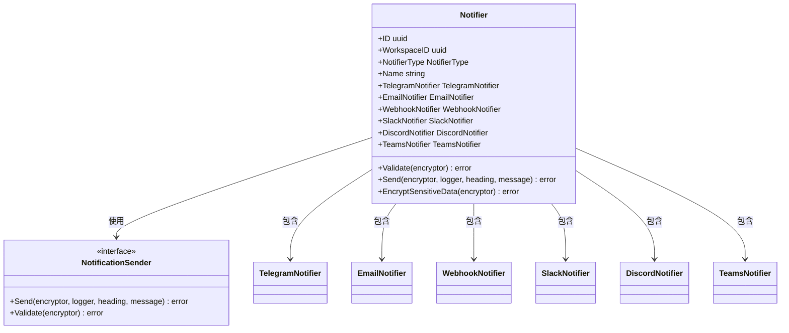

**图表来源**
- [notifiers/model.go:18-32](file://backend/internal/features/notifiers/model.go#L18-L32)

**章节来源**
- [notifiers/controller.go:1-335](file://backend/internal/features/notifiers/controller.go#L1-L335)
- [notifiers/model.go:1-122](file://backend/internal/features/notifiers/model.go#L1-L122)

### 审计日志模块

审计日志模块提供完整的操作记录功能：

#### 审计日志设计

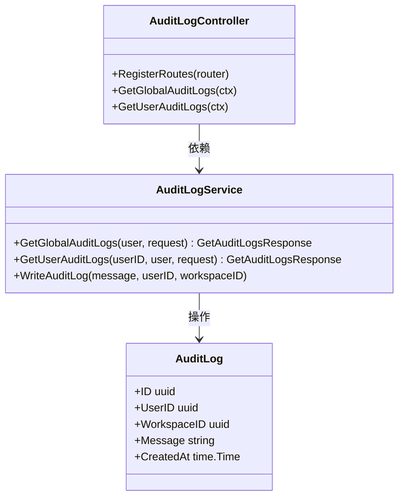

**图表来源**
- [audit_logs/controller.go:13-23](file://backend/internal/features/audit_logs/controller.go#L13-L23)
- [audit_logs/models.go:9-19](file://backend/internal/features/audit_logs/models.go#L9-L19)

**章节来源**
- [audit_logs/controller.go:1-113](file://backend/internal/features/audit_logs/controller.go#L1-L113)
- [audit_logs/models.go:1-20](file://backend/internal/features/audit_logs/models.go#L1-L20)

## 依赖关系分析

### 组件耦合度分析

系统采用松耦合设计，通过接口和依赖注入实现模块隔离：

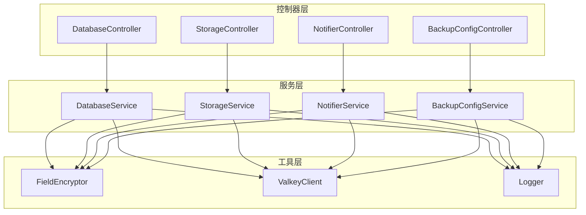

**图表来源**
- [databases/service.go:26-38](file://backend/internal/features/databases/service.go#L26-L38)
- [cache/cache.go:13-45](file://backend/internal/util/cache/cache.go#L13-L45)
- [encryption/field_encryptor.go:5-15](file://backend/internal/util/encryption/field_encryptor.go#L5-L15)

### 数据流分析

系统中的数据流向遵循单向原则，确保数据一致性：

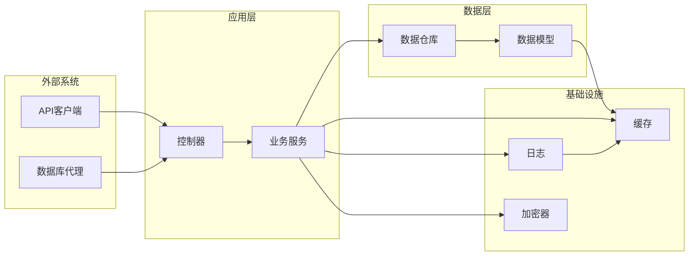

**图表来源**
- [databases/controller.go:20-38](file://backend/internal/features/databases/controller.go#L20-L38)
- [databases/service.go:26-38](file://backend/internal/features/databases/service.go#L26-L38)

**章节来源**
- [databases/service.go:1-883](file://backend/internal/features/databases/service.go#L1-L883)
- [cache/cache.go:1-125](file://backend/internal/util/cache/cache.go#L1-L125)
- [logger/logger.go:1-131](file://backend/internal/util/logger/logger.go#L1-L131)

## 性能考虑

### 缓存策略

系统采用多级缓存策略优化性能：

1. **Valkey缓存**：用于热点数据缓存
2. **内存缓存**：用于临时数据存储
3. **数据库连接池**：优化数据库访问性能

### 加密性能优化

敏感数据加密采用异步处理机制，避免阻塞主业务流程：

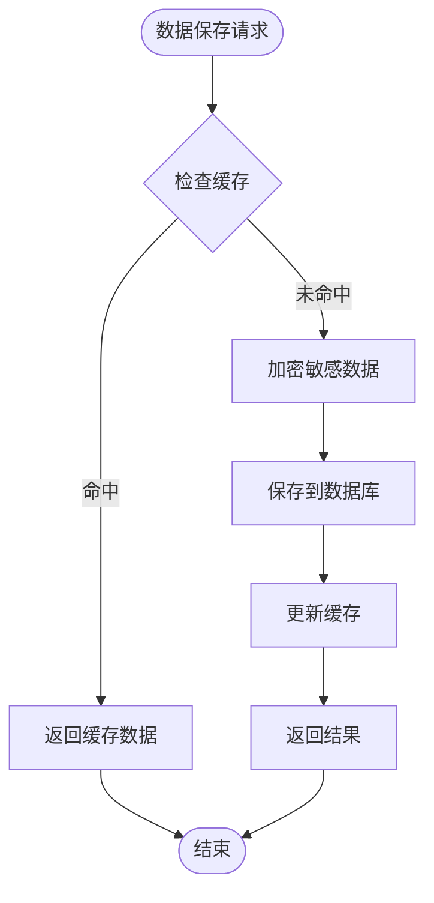

### 并发处理

系统支持高并发场景，通过以下机制保证性能：
- **goroutine池**：限制并发数量
- **信号量**：控制资源使用
- **超时机制**：防止长时间阻塞

## 故障排除指南

### 常见错误处理

系统实现了完善的错误处理机制：

#### 权限相关错误
- `ErrInsufficientPermissionsToManageDBs`：数据库管理权限不足
- `ErrInsufficientPermissionsToViewStorage`：存储查看权限不足
- `ErrInsufficientPermissionsToTestNotifier`：通知测试权限不足

#### 配置验证错误
- `ErrDatabaseHasNoWorkspace`：数据库无工作空间
- `ErrStorageHasOtherAttachedDatabases`：存储被其他数据库使用
- `ErrTargetStorageNotInTargetWorkspace`：目标存储不在指定工作空间

#### 连接测试错误
- `ErrLocalStorageNotAllowedInCloudMode`：云模式下不允许本地存储
- `ErrInvalidAgentToken`：代理令牌无效

**章节来源**
- [databases/controller.go:123-141](file://backend/internal/features/databases/controller.go#L123-L141)
- [storages/controller.go:179-187](file://backend/internal/features/storages/controller.go#L179-L187)
- [notifiers/controller.go:179-187](file://backend/internal/features/notifiers/controller.go#L179-L187)

### 日志记录策略

系统采用结构化日志记录，便于问题诊断：

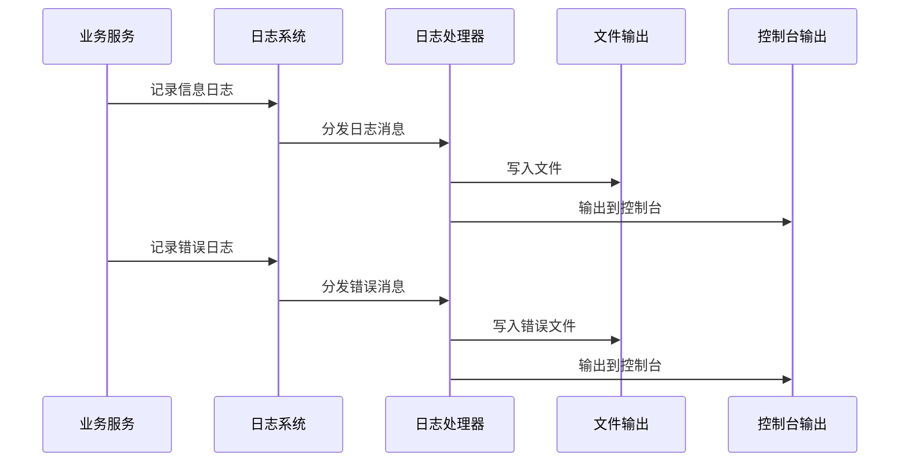

**图表来源**
- [logger/logger.go:19-55](file://backend/internal/util/logger/logger.go#L19-L55)

## 结论

Databasus 功能模块架构展现了现代Go语言项目的最佳实践：

### 设计优势

1. **模块化设计**：每个功能模块职责明确，便于维护和扩展
2. **抽象层次清晰**：通过接口和抽象类实现松耦合设计
3. **数据安全**：内置加密机制保护敏感数据
4. **可观测性**：完整的日志和审计功能
5. **性能优化**：多级缓存和异步处理机制

### 最佳实践建议

1. **代码复用**：通过接口抽象实现代码复用
2. **错误处理**：统一的错误类型和处理机制
3. **测试策略**：单元测试、集成测试和端到端测试相结合
4. **文档维护**：保持代码注释和API文档的同步更新
5. **监控告警**：建立完善的监控和告警机制

该架构为数据库备份管理系统的开发提供了坚实的基础，支持未来的功能扩展和技术演进。