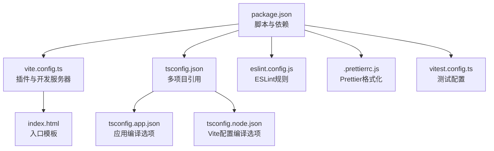
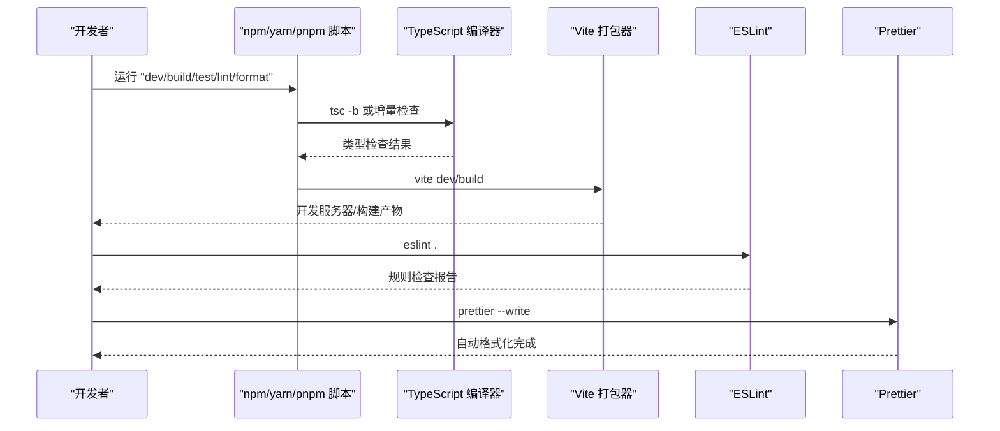
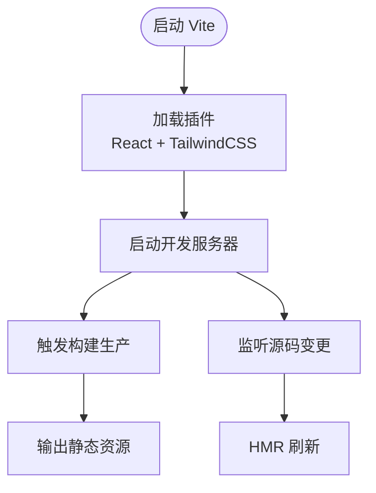
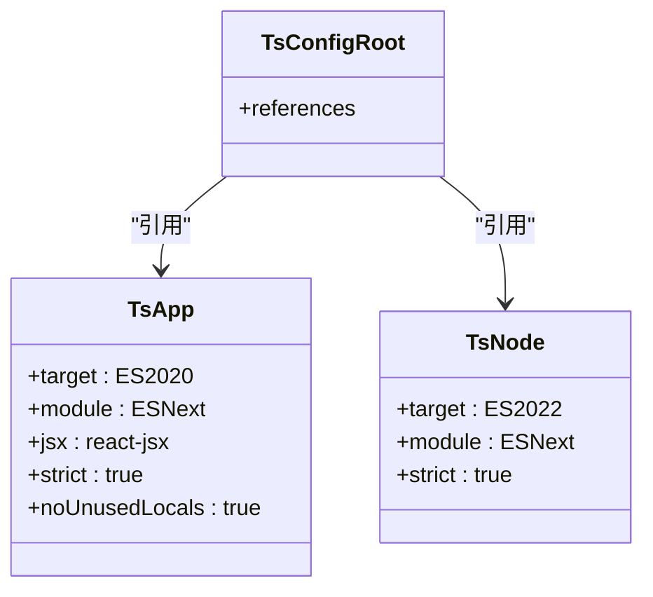
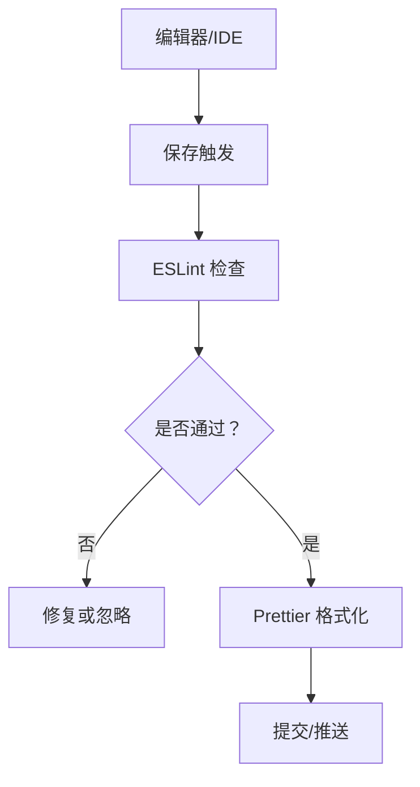
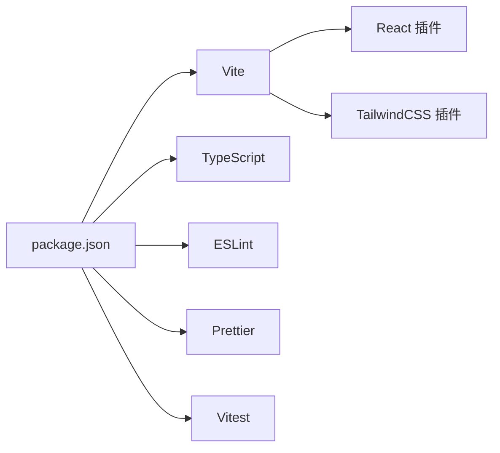

# 构建配置

<cite>
**本文引用的文件**
- [vite.config.ts](file://frontend/vite.config.ts)
- [package.json](file://frontend/package.json)
- [tsconfig.json](file://frontend/tsconfig.json)
- [tsconfig.app.json](file://frontend/tsconfig.app.json)
- [tsconfig.node.json](file://frontend/tsconfig.node.json)
- [eslint.config.js](file://frontend/eslint.config.js)
- [.prettierrc.js](file://frontend/.prettierrc.js)
- [vitest.config.ts](file://frontend/vitest.config.ts)
- [index.html](file://frontend/index.html)
</cite>

## 目录
1. [简介](#简介)
2. [项目结构](#项目结构)
3. [核心组件](#核心组件)
4. [架构总览](#架构总览)
5. [详细组件分析](#详细组件分析)
6. [依赖关系分析](#依赖关系分析)
7. [性能考虑](#性能考虑)
8. [故障排查指南](#故障排查指南)
9. [结论](#结论)
10. [附录](#附录)

## 简介
本文件面向Databasus前端团队与贡献者，系统性梳理前端构建配置，覆盖Vite开发服务器与构建优化、TypeScript编译与类型检查、ESLint与Prettier代码质量保障、包管理与脚本命令、以及开发与生产部署最佳实践。内容以仓库中实际配置为依据，确保可操作、可复现。

## 项目结构
前端工程位于仓库根目录下的 frontend 子目录，采用Vite作为构建工具，TypeScript提供类型安全，ESLint与Prettier保障代码风格与质量，Vitest用于单元测试。关键配置文件如下：

图表来源
- [package.json:1-46](file://frontend/package.json#L1-L46)
- [vite.config.ts:1-9](file://frontend/vite.config.ts#L1-L9)
- [tsconfig.json:1-5](file://frontend/tsconfig.json#L1-L5)
- [tsconfig.app.json:1-27](file://frontend/tsconfig.app.json#L1-L27)
- [tsconfig.node.json:1-25](file://frontend/tsconfig.node.json#L1-L25)
- [eslint.config.js:1-36](file://frontend/eslint.config.js#L1-L36)
- [.prettierrc.js:1-25](file://frontend/.prettierrc.js#L1-L25)
- [vitest.config.ts:1-9](file://frontend/vitest.config.ts#L1-L9)
- [index.html:1-27](file://frontend/index.html#L1-L27)

章节来源
- [package.json:1-46](file://frontend/package.json#L1-L46)
- [vite.config.ts:1-9](file://frontend/vite.config.ts#L1-L9)
- [tsconfig.json:1-5](file://frontend/tsconfig.json#L1-L5)
- [tsconfig.app.json:1-27](file://frontend/tsconfig.app.json#L1-L27)
- [tsconfig.node.json:1-25](file://frontend/tsconfig.node.json#L1-L25)
- [eslint.config.js:1-36](file://frontend/eslint.config.js#L1-L36)
- [.prettierrc.js:1-25](file://frontend/.prettierrc.js#L1-L25)
- [vitest.config.ts:1-9](file://frontend/vitest.config.ts#L1-L9)
- [index.html:1-27](file://frontend/index.html#L1-L27)

## 核心组件
- Vite构建与开发服务器：通过插件体系扩展能力，支持React与TailwindCSS。
- TypeScript多项目配置：分别针对应用与Vite配置文件设定编译目标与严格规则。
- ESLint与Prettier：统一代码规范与自动格式化，结合TypeScript规则提升质量。
- 包管理与脚本：集中定义开发、构建、预览、测试、格式化与代码检查任务。
- 测试：Vitest配置指定运行环境与测试范围。

章节来源
- [vite.config.ts:1-9](file://frontend/vite.config.ts#L1-L9)
- [tsconfig.app.json:1-27](file://frontend/tsconfig.app.json#L1-L27)
- [tsconfig.node.json:1-25](file://frontend/tsconfig.node.json#L1-L25)
- [eslint.config.js:1-36](file://frontend/eslint.config.js#L1-L36)
- [.prettierrc.js:1-25](file://frontend/.prettierrc.js#L1-L25)
- [package.json:1-46](file://frontend/package.json#L1-L46)
- [vitest.config.ts:1-9](file://frontend/vitest.config.ts#L1-L9)

## 架构总览
下图展示从开发到生产的典型流程：开发者执行脚本触发TypeScript增量编译与Vite打包；ESLint/Prettier在提交前或CI阶段进行质量把关；最终产物由Vite生成并在本地预览或部署。

图表来源
- [package.json:6-14](file://frontend/package.json#L6-L14)
- [tsconfig.app.json:18-23](file://frontend/tsconfig.app.json#L18-L23)
- [eslint.config.js:8-35](file://frontend/eslint.config.js#L8-L35)
- [.prettierrc.js:1-25](file://frontend/.prettierrc.js#L1-L25)

## 详细组件分析

### Vite 配置与开发服务器
- 插件体系
  - React插件：启用React JSX转换与开发期特性。
  - TailwindCSS插件：集成TailwindCSS按需扫描与样式生成。
- 开发服务器
  - 默认端口与热更新由Vite提供；未显式配置代理、HTTPS等参数时，遵循Vite默认行为。
- 构建优化
  - 未在配置中显式声明rollupOptions、plugins等高级选项，构建策略以Vite默认值为主。
- 入口模板
  - HTML模板提供基础meta、字体预连接与运行时配置脚本注入点，确保页面加载与主题初始化。

图表来源
- [vite.config.ts:6-8](file://frontend/vite.config.ts#L6-L8)
- [index.html:21-26](file://frontend/index.html#L21-L26)

章节来源
- [vite.config.ts:1-9](file://frontend/vite.config.ts#L1-L9)
- [index.html:1-27](file://frontend/index.html#L1-L27)

### TypeScript 配置
- 多项目引用
  - 顶层tsconfig.json通过references组织子配置，避免重复声明。
- 应用编译配置（tsconfig.app.json）
  - 目标与模块：ES2020与ESNext，配合bundler模式与严格类型规则。
  - 语言特性：JSX使用react-jsx，DOM/DOM.Iterable库启用。
  - 严格性：开启严格模式与未使用变量/参数等规则，减少潜在问题。
- Node配置（tsconfig.node.json）
  - 目标与模块：ES2022与ESNext，聚焦于Vite配置文件的类型检查。
  - 严格性：与应用一致的严格规则集。

图表来源
- [tsconfig.json:2-4](file://frontend/tsconfig.json#L2-L4)
- [tsconfig.app.json:2-26](file://frontend/tsconfig.app.json#L2-L26)
- [tsconfig.node.json:2-24](file://frontend/tsconfig.node.json#L2-L24)

章节来源
- [tsconfig.json:1-5](file://frontend/tsconfig.json#L1-L5)
- [tsconfig.app.json:1-27](file://frontend/tsconfig.app.json#L1-L27)
- [tsconfig.node.json:1-25](file://frontend/tsconfig.node.json#L1-L25)

### ESLint 与 Prettier
- ESLint
  - 使用typescript-eslint配置，继承推荐规则集。
  - 语言选项启用2020生态与浏览器全局，支持JSX。
  - 插件：react、react-hooks、react-refresh。
  - 规则：关闭react-refresh仅允许常量导出限制，关闭react-hooks exhaustive-deps建议，保留其他推荐规则。
- Prettier
  - 统一分号、尾逗号、单引号、行长、缩进与箭头函数括号。
  - 导入顺序：第三方模块优先，随后按约定层级排序，支持SVG/PNG等资源导入。
  - 插件：导入排序与TailwindCSS插件，确保类名排序与后处理。

图表来源
- [eslint.config.js:8-35](file://frontend/eslint.config.js#L8-L35)
- [.prettierrc.js:1-25](file://frontend/.prettierrc.js#L1-L25)

章节来源
- [eslint.config.js:1-36](file://frontend/eslint.config.js#L1-L36)
- [.prettierrc.js:1-25](file://frontend/.prettierrc.js#L1-L25)

### 包管理与脚本命令
- 开发：vite 启动本地服务。
- 构建：先执行tsc -b进行类型检查与增量编译，再由vite build产出生产包。
- 预览：vite preview本地预览构建产物。
- 测试：vitest run执行一次性测试；vitest进入监听模式。
- 质量：eslint .检查代码规范；prettier --write批量格式化。

章节来源
- [package.json:6-14](file://frontend/package.json#L6-L14)

### 测试配置（Vitest）
- 运行环境：node。
- 测试范围：src/**/*.test.ts。
- 可结合覆盖率工具（@vitest/coverage-v8）在CI中启用覆盖率统计。

章节来源
- [vitest.config.ts:1-9](file://frontend/vitest.config.ts#L1-L9)

## 依赖关系分析
- 依赖与开发依赖
  - 运行时依赖：React、React DOM、Ant Design、Recharts、Day.js、Cron Parser等。
  - 开发依赖：Vite、React插件、TailwindCSS与Vite插件、TypeScript、ESLint及其插件、Prettier与TailwindCSS插件、Vitest等。
- 版本策略
  - TypeScript与ESLint/TS规则版本保持兼容，Vite与React插件版本匹配当前主流生态。
- 脚本与工具链
  - 通过npm/yarn/pnpm统一调度，确保开发与CI一致性。

图表来源
- [package.json:15-44](file://frontend/package.json#L15-L44)

章节来源
- [package.json:1-46](file://frontend/package.json#L1-L46)

## 性能考虑
- 构建优化建议（基于现有配置的可选增强）
  - 代码分割：通过路由懒加载与动态导入减少首屏体积。
  - Tree Shaking：确保模块化与无副作用标记，配合bundler模式最大化剔除未使用代码。
  - 静态资源：对图片与字体使用合适格式与尺寸，结合CDN加速。
  - 压缩与缓存：生产构建默认启用压缩；结合HTTP缓存策略与长效缓存命名。
  - 分析与监控：使用Vite可视化分析工具定位大包与重复依赖。
- 开发体验
  - HMR：保持热更新快速反馈；避免在插件中引入阻塞逻辑。
  - 并行任务：TypeScript增量编译与Vite并行执行，缩短等待时间。

## 故障排查指南
- TypeScript错误
  - 症状：构建失败或IDE提示类型错误。
  - 排查：确认tsconfig.app.json与tsconfig.node.json的严格规则是否导致误报；必要时在局部放宽规则。
- ESLint警告/错误
  - 症状：提交被拒绝或IDE高亮。
  - 排查：根据规则调整代码；若确需例外，使用注释禁用规则并记录原因。
- Prettier格式冲突
  - 症状：保存后格式反复变化。
  - 排查：统一编辑器格式化设置，确保Prettier插件生效；检查.prettierrc.js中的导入顺序与插件配置。
- Vite开发服务器异常
  - 症状：端口占用、HMR不生效、资源无法加载。
  - 排查：更换端口、清理缓存、检查插件顺序与HTML模板引用；确认index.html中脚本注入位置正确。
- 测试失败
  - 症状：单元测试报错或覆盖率不足。
  - 排查：检查vitest.config.ts的环境与测试范围；确保测试文件命名与路径匹配。

章节来源
- [tsconfig.app.json:18-23](file://frontend/tsconfig.app.json#L18-L23)
- [eslint.config.js:27-33](file://frontend/eslint.config.js#L27-L33)
- [.prettierrc.js:8-23](file://frontend/.prettierrc.js#L8-L23)
- [index.html:21-26](file://frontend/index.html#L21-L26)
- [vitest.config.ts:4-7](file://frontend/vitest.config.ts#L4-L7)

## 结论
Databasus前端构建配置以Vite为核心，结合TypeScript严格类型、ESLint与Prettier统一规范，辅以Vitest测试，形成完整的开发与交付流水线。建议在现有基础上完善生产构建优化（如代码分割、缓存策略）与CI质量门禁，持续提升开发效率与产物质量。

## 附录
- 开发环境搭建步骤
  - 安装Node.js与包管理器（建议使用与项目一致的版本）。
  - 在frontend目录安装依赖：npm install 或 yarn 或 pnpm install。
  - 启动开发服务器：npm run dev 或 yarn dev 或 pnpm dev。
  - 预览生产构建：npm run build 与 npm run preview。
- 生产构建与部署最佳实践
  - 使用CI缓存依赖与构建产物，缩短流水线时间。
  - 对静态资源启用CDN与Gzip/Brotli压缩。
  - 通过HTML模板注入运行时配置，确保不同环境变量正确注入。
  - 在部署前执行一次ESLint与Prettier检查，确保代码质量达标。