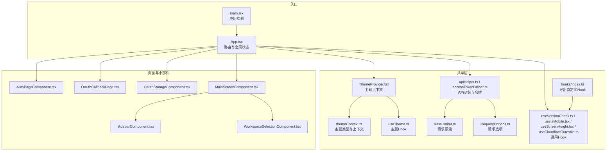
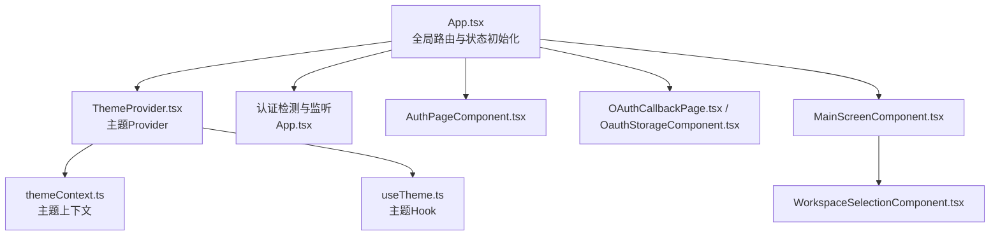
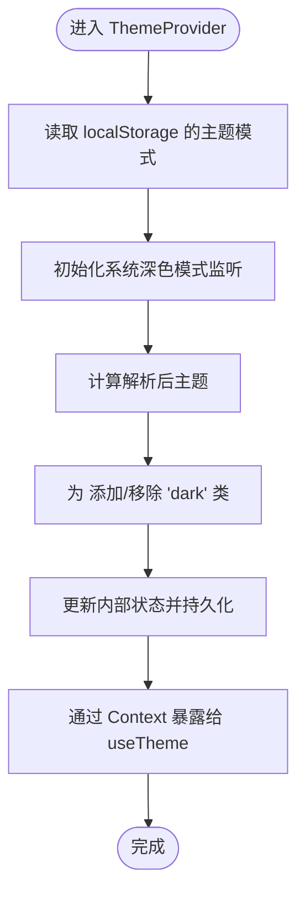
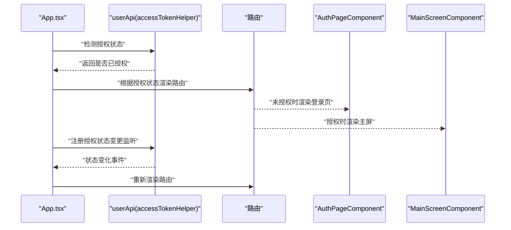
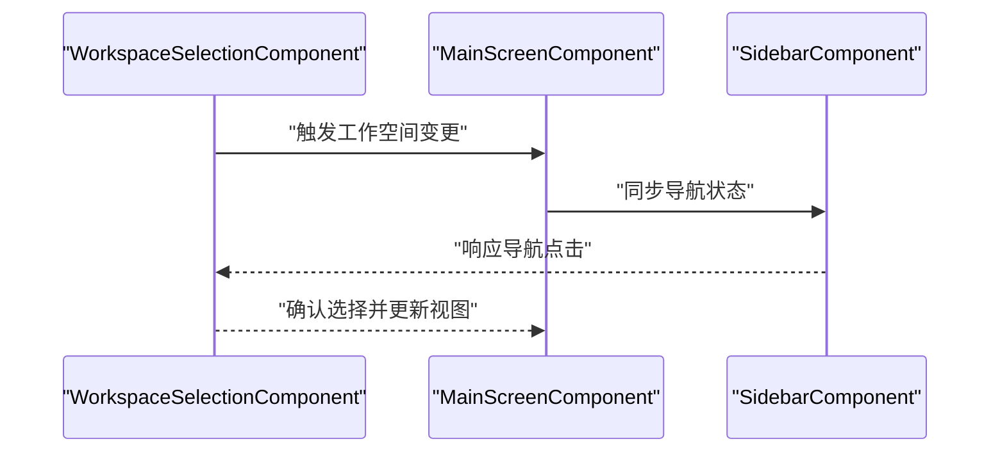
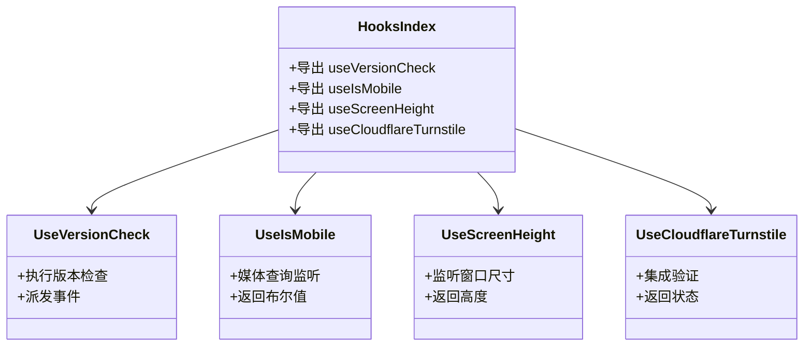
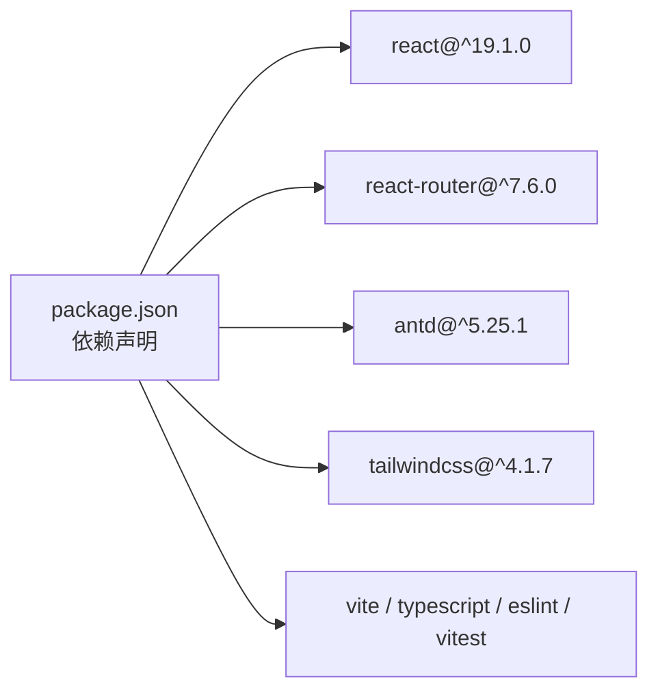

# 状态管理策略

<cite>
**本文引用的文件**
- [frontend/src/main.tsx](file://frontend/src/main.tsx)
- [frontend/src/App.tsx](file://frontend/src/App.tsx)
- [frontend/src/shared/theme/ThemeProvider.tsx](file://frontend/src/shared/theme/ThemeProvider.tsx)
- [frontend/src/shared/theme/themeContext.ts](file://frontend/src/shared/theme/themeContext.ts)
- [frontend/src/shared/theme/useTheme.ts](file://frontend/src/shared/theme/useTheme.ts)
- [frontend/src/widgets/main/MainScreenComponent.tsx](file://frontend/src/widgets/main/MainScreenComponent.tsx)
- [frontend/src/widgets/main/SidebarComponent.tsx](file://frontend/src/widgets/main/SidebarComponent.tsx)
- [frontend/src/widgets/main/WorkspaceSelectionComponent.tsx](file://frontend/src/widgets/main/WorkspaceSelectionComponent.tsx)
- [frontend/src/pages/AuthPageComponent.tsx](file://frontend/src/pages/AuthPageComponent.tsx)
- [frontend/src/pages/OAuthCallbackPage.tsx](file://frontend/src/pages/OAuthCallbackPage.tsx)
- [frontend/src/pages/OauthStorageComponent.tsx](file://frontend/src/pages/OauthStorageComponent.tsx)
- [frontend/src/shared/hooks/index.ts](file://frontend/src/shared/hooks/index.ts)
- [frontend/src/shared/hooks/useVersionCheck.ts](file://frontend/src/shared/hooks/useVersionCheck.ts)
- [frontend/src/shared/hooks/useIsMobile.tsx](file://frontend/src/shared/hooks/useIsMobile.tsx)
- [frontend/src/shared/hooks/useScreenHeight.tsx](file://frontend/src/shared/hooks/useScreenHeight.tsx)
- [frontend/src/shared/hooks/useCloudflareTurnstile.ts](file://frontend/src/shared/hooks/useCloudflareTurnstile.ts)
- [frontend/src/shared/api/accessTokenHelper.ts](file://frontend/src/shared/api/accessTokenHelper.ts)
- [frontend/src/shared/api/apiHelper.ts](file://frontend/src/shared/api/apiHelper.ts)
- [frontend/src/shared/api/RateLimiter.ts](file://frontend/src/shared/api/RateLimiter.ts)
- [frontend/src/shared/api/RequestOptions.ts](file://frontend/src/shared/api/RequestOptions.ts)
- [frontend/src/constants.ts](file://frontend/src/constants.ts)
- [frontend/package.json](file://frontend/package.json)
</cite>

## 目录
1. [引言](#引言)
2. [项目结构](#项目结构)
3. [核心组件](#核心组件)
4. [架构总览](#架构总览)
5. [详细组件分析](#详细组件分析)
6. [依赖关系分析](#依赖关系分析)
7. [性能考量](#性能考量)
8. [故障排查指南](#故障排查指南)
9. [结论](#结论)
10. [附录](#附录)

## 引言
本文件系统性梳理 Databasus 前端在 React 19 中的状态管理策略，覆盖 Hooks 使用、Context API 应用、自定义 Hook 设计模式，并重点阐述全局状态（认证、主题、工作空间）的实现方式与持久化策略。同时给出异步状态（loading/error/success）管理建议、最佳实践（状态提升、状态隔离、性能优化）以及可直接定位到源码位置的示例路径。

## 项目结构
前端采用以功能域为中心的组织方式：页面层（pages）、共享层（shared：api、hooks、theme、ui、lib、toast、time）、实体层（entity：按业务域划分）、特性层（features：按功能域划分）、小部件层（widgets：主屏、侧边栏、工作空间选择器等）。路由在应用顶层集中配置，主题与认证状态贯穿全局。

图示来源
- [frontend/src/main.tsx:1-14](file://frontend/src/main.tsx#L1-L14)
- [frontend/src/App.tsx:1-77](file://frontend/src/App.tsx#L1-L77)
- [frontend/src/shared/theme/ThemeProvider.tsx:1-79](file://frontend/src/shared/theme/ThemeProvider.tsx#L1-L79)
- [frontend/src/shared/theme/themeContext.ts:1-13](file://frontend/src/shared/theme/themeContext.ts#L1-L13)
- [frontend/src/shared/theme/useTheme.ts:1-12](file://frontend/src/shared/theme/useTheme.ts#L1-L12)
- [frontend/src/shared/hooks/index.ts](file://frontend/src/shared/hooks/index.ts)
- [frontend/src/shared/hooks/useVersionCheck.ts](file://frontend/src/shared/hooks/useVersionCheck.ts)
- [frontend/src/shared/hooks/useIsMobile.tsx](file://frontend/src/shared/hooks/useIsMobile.tsx)
- [frontend/src/shared/hooks/useScreenHeight.tsx](file://frontend/src/shared/hooks/useScreenHeight.tsx)
- [frontend/src/shared/hooks/useCloudflareTurnstile.ts](file://frontend/src/shared/hooks/useCloudflareTurnstile.ts)
- [frontend/src/shared/api/apiHelper.ts](file://frontend/src/shared/api/apiHelper.ts)
- [frontend/src/shared/api/accessTokenHelper.ts](file://frontend/src/shared/api/accessTokenHelper.ts)
- [frontend/src/shared/api/RateLimiter.ts](file://frontend/src/shared/api/RateLimiter.ts)
- [frontend/src/shared/api/RequestOptions.ts](file://frontend/src/shared/api/RequestOptions.ts)
- [frontend/src/pages/AuthPageComponent.tsx](file://frontend/src/pages/AuthPageComponent.tsx)
- [frontend/src/pages/OAuthCallbackPage.tsx](file://frontend/src/pages/OAuthCallbackPage.tsx)
- [frontend/src/pages/OauthStorageComponent.tsx](file://frontend/src/pages/OauthStorageComponent.tsx)
- [frontend/src/widgets/main/MainScreenComponent.tsx](file://frontend/src/widgets/main/MainScreenComponent.tsx)
- [frontend/src/widgets/main/SidebarComponent.tsx](file://frontend/src/widgets/main/SidebarComponent.tsx)
- [frontend/src/widgets/main/WorkspaceSelectionComponent.tsx](file://frontend/src/widgets/main/WorkspaceSelectionComponent.tsx)

章节来源
- [frontend/src/main.tsx:1-14](file://frontend/src/main.tsx#L1-L14)
- [frontend/src/App.tsx:1-77](file://frontend/src/App.tsx#L1-L77)
- [frontend/package.json:1-46](file://frontend/package.json#L1-L46)

## 核心组件
- 主题状态（Theme）
  - 提供者：ThemeProvider.tsx
  - 上下文：themeContext.ts
  - Hook：useTheme.ts
  - 持久化：localStorage
  - 同步：系统深色模式监听与类名注入
- 认证状态（Auth）
  - 入口：App.tsx 中的授权检测与监听
  - API 辅助：accessTokenHelper.ts、apiHelper.ts
  - 页面：AuthPageComponent.tsx、OAuthCallbackPage.tsx、OauthStorageComponent.tsx
- 工作空间状态（Workspace）
  - 小部件：WorkspaceSelectionComponent.tsx
  - 与主屏联动：MainScreenComponent.tsx
- 自定义 Hook
  - 版本检查：useVersionCheck.ts
  - 移动端判断：useIsMobile.tsx
  - 屏幕高度：useScreenHeight.tsx
  - Cloudflare Turnstile：useCloudflareTurnstile.ts
  - 导出聚合：hooks/index.ts

章节来源
- [frontend/src/shared/theme/ThemeProvider.tsx:1-79](file://frontend/src/shared/theme/ThemeProvider.tsx#L1-L79)
- [frontend/src/shared/theme/themeContext.ts:1-13](file://frontend/src/shared/theme/themeContext.ts#L1-L13)
- [frontend/src/shared/theme/useTheme.ts:1-12](file://frontend/src/shared/theme/useTheme.ts#L1-L12)
- [frontend/src/App.tsx:16-66](file://frontend/src/App.tsx#L16-L66)
- [frontend/src/shared/api/accessTokenHelper.ts](file://frontend/src/shared/api/accessTokenHelper.ts)
- [frontend/src/shared/api/apiHelper.ts](file://frontend/src/shared/api/apiHelper.ts)
- [frontend/src/widgets/main/WorkspaceSelectionComponent.tsx](file://frontend/src/widgets/main/WorkspaceSelectionComponent.tsx)
- [frontend/src/widgets/main/MainScreenComponent.tsx](file://frontend/src/widgets/main/MainScreenComponent.tsx)
- [frontend/src/shared/hooks/index.ts](file://frontend/src/shared/hooks/index.ts)
- [frontend/src/shared/hooks/useVersionCheck.ts](file://frontend/src/shared/hooks/useVersionCheck.ts)
- [frontend/src/shared/hooks/useIsMobile.tsx](file://frontend/src/shared/hooks/useIsMobile.tsx)
- [frontend/src/shared/hooks/useScreenHeight.tsx](file://frontend/src/shared/hooks/useScreenHeight.tsx)
- [frontend/src/shared/hooks/useCloudflareTurnstile.ts](file://frontend/src/shared/hooks/useCloudflareTurnstile.ts)

## 架构总览
React 19 在 Databasus 中采用“函数式 + Hooks + Context”的组合模式：
- 全局状态通过 Context Provider 包裹在应用根部，确保跨组件访问一致性
- 认证状态与主题状态分别由独立 Provider 管理，避免耦合
- 页面级路由根据认证状态动态切换，实现条件渲染
- 自定义 Hook 负责副作用与跨组件复用逻辑，保持组件纯净

图示来源
- [frontend/src/App.tsx:16-66](file://frontend/src/App.tsx#L16-L66)
- [frontend/src/shared/theme/ThemeProvider.tsx:32-78](file://frontend/src/shared/theme/ThemeProvider.tsx#L32-L78)
- [frontend/src/shared/theme/themeContext.ts:1-13](file://frontend/src/shared/theme/themeContext.ts#L1-L13)
- [frontend/src/shared/theme/useTheme.ts:5-11](file://frontend/src/shared/theme/useTheme.ts#L5-L11)
- [frontend/src/pages/AuthPageComponent.tsx](file://frontend/src/pages/AuthPageComponent.tsx)
- [frontend/src/pages/OAuthCallbackPage.tsx](file://frontend/src/pages/OAuthCallbackPage.tsx)
- [frontend/src/pages/OauthStorageComponent.tsx](file://frontend/src/pages/OauthStorageComponent.tsx)
- [frontend/src/widgets/main/MainScreenComponent.tsx](file://frontend/src/widgets/main/MainScreenComponent.tsx)
- [frontend/src/widgets/main/WorkspaceSelectionComponent.tsx](file://frontend/src/widgets/main/WorkspaceSelectionComponent.tsx)

## 详细组件分析

### 主题状态管理（Theme）
- 状态结构
  - 当前模式：light/dark/system
  - 解析后模式：light/dark
  - 系统模式监听：matchMedia
- 持久化策略
  - localStorage 存储当前模式，刷新后恢复
- 同步机制
  - 系统深色模式变更时自动更新解析后模式
  - 文档根节点添加/移除 dark 类名，驱动样式切换
- 自定义 Hook
  - useTheme 返回当前模式、解析后模式与设置方法

图示来源
- [frontend/src/shared/theme/ThemeProvider.tsx:32-78](file://frontend/src/shared/theme/ThemeProvider.tsx#L32-L78)
- [frontend/src/shared/theme/themeContext.ts:6-10](file://frontend/src/shared/theme/themeContext.ts#L6-L10)
- [frontend/src/shared/theme/useTheme.ts:5-11](file://frontend/src/shared/theme/useTheme.ts#L5-L11)

章节来源
- [frontend/src/shared/theme/ThemeProvider.tsx:1-79](file://frontend/src/shared/theme/ThemeProvider.tsx#L1-L79)
- [frontend/src/shared/theme/themeContext.ts:1-13](file://frontend/src/shared/theme/themeContext.ts#L1-L13)
- [frontend/src/shared/theme/useTheme.ts:1-12](file://frontend/src/shared/theme/useTheme.ts#L1-L12)

### 认证状态管理（Auth）
- 初始化流程
  - 应用启动时检测是否已授权
  - 注册授权状态变更监听，实时更新
- 页面映射
  - 未授权：显示登录页
  - 授权：显示主界面
- OAuth 流程
  - 回调页与存储授权页用于处理第三方授权
- API 辅助
  - accessTokenHelper.ts：令牌获取/存储/清理
  - apiHelper.ts：统一请求封装与错误处理

图示来源
- [frontend/src/App.tsx:34-41](file://frontend/src/App.tsx#L34-L41)
- [frontend/src/App.tsx:57-60](file://frontend/src/App.tsx#L57-L60)
- [frontend/src/pages/AuthPageComponent.tsx](file://frontend/src/pages/AuthPageComponent.tsx)
- [frontend/src/pages/OAuthCallbackPage.tsx](file://frontend/src/pages/OAuthCallbackPage.tsx)
- [frontend/src/pages/OauthStorageComponent.tsx](file://frontend/src/pages/OauthStorageComponent.tsx)
- [frontend/src/shared/api/accessTokenHelper.ts](file://frontend/src/shared/api/accessTokenHelper.ts)
- [frontend/src/shared/api/apiHelper.ts](file://frontend/src/shared/api/apiHelper.ts)

章节来源
- [frontend/src/App.tsx:16-66](file://frontend/src/App.tsx#L16-L66)
- [frontend/src/pages/AuthPageComponent.tsx](file://frontend/src/pages/AuthPageComponent.tsx)
- [frontend/src/pages/OAuthCallbackPage.tsx](file://frontend/src/pages/OAuthCallbackPage.tsx)
- [frontend/src/pages/OauthStorageComponent.tsx](file://frontend/src/pages/OauthStorageComponent.tsx)
- [frontend/src/shared/api/accessTokenHelper.ts](file://frontend/src/shared/api/accessTokenHelper.ts)
- [frontend/src/shared/api/apiHelper.ts](file://frontend/src/shared/api/apiHelper.ts)

### 工作空间状态管理（Workspace）
- 组件职责
  - WorkspaceSelectionComponent.tsx：工作空间选择器
  - MainScreenComponent.tsx：主屏容器，承载侧边栏与内容区
  - SidebarComponent.tsx：导航与功能入口
- 状态流转
  - 用户选择工作空间后，主屏根据选中项更新内容
  - 可结合路由参数或全局状态进行同步

图示来源
- [frontend/src/widgets/main/WorkspaceSelectionComponent.tsx](file://frontend/src/widgets/main/WorkspaceSelectionComponent.tsx)
- [frontend/src/widgets/main/MainScreenComponent.tsx](file://frontend/src/widgets/main/MainScreenComponent.tsx)
- [frontend/src/widgets/main/SidebarComponent.tsx](file://frontend/src/widgets/main/SidebarComponent.tsx)

章节来源
- [frontend/src/widgets/main/WorkspaceSelectionComponent.tsx](file://frontend/src/widgets/main/WorkspaceSelectionComponent.tsx)
- [frontend/src/widgets/main/MainScreenComponent.tsx](file://frontend/src/widgets/main/MainScreenComponent.tsx)
- [frontend/src/widgets/main/SidebarComponent.tsx](file://frontend/src/widgets/main/SidebarComponent.tsx)

### 自定义 Hook 设计模式
- useVersionCheck：版本检查与事件派发
- useIsMobile：移动端断点判断
- useScreenHeight：屏幕高度适配
- useCloudflareTurnstile：验证码集成
- hooks/index.ts：统一导出，便于消费方按需引入

图示来源
- [frontend/src/shared/hooks/index.ts](file://frontend/src/shared/hooks/index.ts)
- [frontend/src/shared/hooks/useVersionCheck.ts](file://frontend/src/shared/hooks/useVersionCheck.ts)
- [frontend/src/shared/hooks/useIsMobile.tsx](file://frontend/src/shared/hooks/useIsMobile.tsx)
- [frontend/src/shared/hooks/useScreenHeight.tsx](file://frontend/src/shared/hooks/useScreenHeight.tsx)
- [frontend/src/shared/hooks/useCloudflareTurnstile.ts](file://frontend/src/shared/hooks/useCloudflareTurnstile.ts)

章节来源
- [frontend/src/shared/hooks/index.ts](file://frontend/src/shared/hooks/index.ts)
- [frontend/src/shared/hooks/useVersionCheck.ts](file://frontend/src/shared/hooks/useVersionCheck.ts)
- [frontend/src/shared/hooks/useIsMobile.tsx](file://frontend/src/shared/hooks/useIsMobile.tsx)
- [frontend/src/shared/hooks/useScreenHeight.tsx](file://frontend/src/shared/hooks/useScreenHeight.tsx)
- [frontend/src/shared/hooks/useCloudflareTurnstile.ts](file://frontend/src/shared/hooks/useCloudflareTurnstile.ts)

### API 状态管理与异步处理
- 请求封装
  - apiHelper.ts：统一请求、错误处理、重试策略
  - accessTokenHelper.ts：令牌获取/刷新/清理
  - RequestOptions.ts：请求默认配置
  - RateLimiter.ts：请求限流控制
- 异步状态建模建议
  - loading：请求开始时置为 true，结束时置为 false
  - error：捕获异常并记录，支持用户可见提示
  - success：请求成功后的数据更新与反馈
- 状态同步
  - 结合 Context 或本地状态，在页面组件中统一消费
  - 对于跨页面共享的状态，优先使用 Context Provider

章节来源
- [frontend/src/shared/api/apiHelper.ts](file://frontend/src/shared/api/apiHelper.ts)
- [frontend/src/shared/api/accessTokenHelper.ts](file://frontend/src/shared/api/accessTokenHelper.ts)
- [frontend/src/shared/api/RequestOptions.ts](file://frontend/src/shared/api/RequestOptions.ts)
- [frontend/src/shared/api/RateLimiter.ts](file://frontend/src/shared/api/RateLimiter.ts)

## 依赖关系分析
- 运行时依赖
  - React 19、React Router 7、Ant Design 5、TailwindCSS 4
- 开发依赖
  - Vite、TypeScript、ESLint、Prettier、Vitest
- 关键导入链
  - main.tsx -> App.tsx -> ThemeProvider.tsx/useTheme.ts
  - App.tsx -> AuthPageComponent.tsx / MainScreenComponent.tsx
  - MainScreenComponent.tsx -> SidebarComponent.tsx / WorkspaceSelectionComponent.tsx
  - hooks/index.ts -> 各自 Hook 实现

图示来源
- [frontend/package.json:15-44](file://frontend/package.json#L15-L44)

章节来源
- [frontend/package.json:1-46](file://frontend/package.json#L1-L46)

## 性能考量
- 状态提升与隔离
  - 将高频更新且跨组件共享的状态提升至最近公共祖先，减少重复订阅
  - 对局部稳定状态使用组件内 useState，避免不必要的重渲染
- Context 使用
  - 将大对象拆分为多个 Context，降低无关更新的影响范围
  - 使用 useMemo/useCallback 缓存 Provider 值与回调
- 渲染优化
  - 利用 React.memo、useMemo、useCallback 避免不必要渲染
  - 将重型计算放入 Web Worker 或后台线程
- 请求与缓存
  - 合理设置超时与重试，避免阻塞 UI
  - 对静态资源与接口结果进行缓存，减少重复请求

## 故障排查指南
- 主题不生效
  - 检查 ThemeProvider 是否包裹根组件
  - 确认 localStorage 中的主题键值有效
  - 验证系统深色模式监听是否正常
  - 参考路径：[frontend/src/shared/theme/ThemeProvider.tsx:32-78](file://frontend/src/shared/theme/ThemeProvider.tsx#L32-L78)
- 登录状态异常
  - 确认 accessTokenHelper 的令牌存储与过期处理
  - 检查 App.tsx 中的授权检测与监听逻辑
  - 参考路径：[frontend/src/App.tsx:34-41](file://frontend/src/App.tsx#L34-L41)、[frontend/src/shared/api/accessTokenHelper.ts](file://frontend/src/shared/api/accessTokenHelper.ts)
- 工作空间选择无效
  - 检查 WorkspaceSelectionComponent 与 MainScreen 的状态同步逻辑
  - 参考路径：[frontend/src/widgets/main/WorkspaceSelectionComponent.tsx](file://frontend/src/widgets/main/WorkspaceSelectionComponent.tsx)、[frontend/src/widgets/main/MainScreenComponent.tsx](file://frontend/src/widgets/main/MainScreenComponent.tsx)
- Hook 使用报错
  - 确保在 ThemeProvider 内部使用 useTheme
  - 参考路径：[frontend/src/shared/theme/useTheme.ts:5-11](file://frontend/src/shared/theme/useTheme.ts#L5-L11)

章节来源
- [frontend/src/shared/theme/ThemeProvider.tsx:32-78](file://frontend/src/shared/theme/ThemeProvider.tsx#L32-L78)
- [frontend/src/shared/theme/useTheme.ts:5-11](file://frontend/src/shared/theme/useTheme.ts#L5-L11)
- [frontend/src/App.tsx:34-41](file://frontend/src/App.tsx#L34-L41)
- [frontend/src/shared/api/accessTokenHelper.ts](file://frontend/src/shared/api/accessTokenHelper.ts)
- [frontend/src/widgets/main/WorkspaceSelectionComponent.tsx](file://frontend/src/widgets/main/WorkspaceSelectionComponent.tsx)
- [frontend/src/widgets/main/MainScreenComponent.tsx](file://frontend/src/widgets/main/MainScreenComponent.tsx)

## 结论
Databasus 在 React 19 中采用清晰的分层与职责分离：主题与认证作为全局状态通过 Context 管理，页面与小部件按功能域组织，自定义 Hook 抽离通用逻辑。通过 localStorage 持久化与系统监听实现状态同步，结合 API 辅助模块形成一致的异步状态处理范式。建议在后续迭代中进一步细化 Context 分割、引入更细粒度的状态选择器与缓存策略，以提升复杂场景下的性能与可维护性。

## 附录
- 常用示例路径（仅路径，不含代码内容）
  - 主题 Provider 与 Hook 使用：[frontend/src/shared/theme/ThemeProvider.tsx:32-78](file://frontend/src/shared/theme/ThemeProvider.tsx#L32-L78)、[frontend/src/shared/theme/useTheme.ts:5-11](file://frontend/src/shared/theme/useTheme.ts#L5-11)
  - 认证初始化与监听：[frontend/src/App.tsx:34-41](file://frontend/src/App.tsx#L34-L41)
  - 页面路由与条件渲染：[frontend/src/App.tsx:57-60](file://frontend/src/App.tsx#L57-L60)
  - 工作空间选择器：[frontend/src/widgets/main/WorkspaceSelectionComponent.tsx](file://frontend/src/widgets/main/WorkspaceSelectionComponent.tsx)
  - 主屏容器与侧边栏：[frontend/src/widgets/main/MainScreenComponent.tsx](file://frontend/src/widgets/main/MainScreenComponent.tsx)、[frontend/src/widgets/main/SidebarComponent.tsx](file://frontend/src/widgets/main/SidebarComponent.tsx)
  - 自定义 Hook 聚合导出：[frontend/src/shared/hooks/index.ts](file://frontend/src/shared/hooks/index.ts)
  - API 封装与令牌：[frontend/src/shared/api/apiHelper.ts](file://frontend/src/shared/api/apiHelper.ts)、[frontend/src/shared/api/accessTokenHelper.ts](file://frontend/src/shared/api/accessTokenHelper.ts)
  - 请求限流与默认选项：[frontend/src/shared/api/RateLimiter.ts](file://frontend/src/shared/api/RateLimiter.ts)、[frontend/src/shared/api/RequestOptions.ts](file://frontend/src/shared/api/RequestOptions.ts)