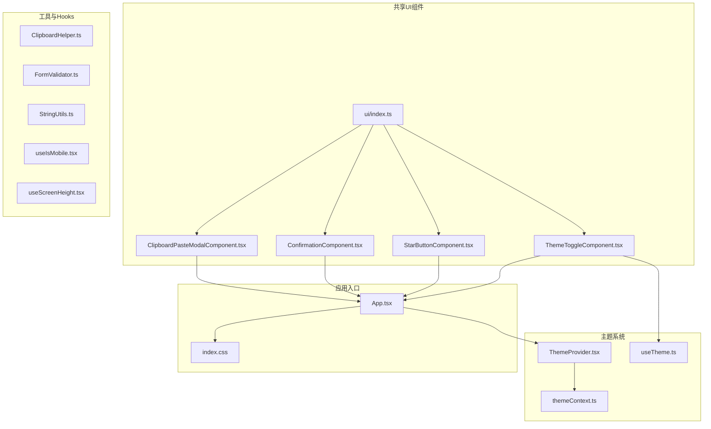
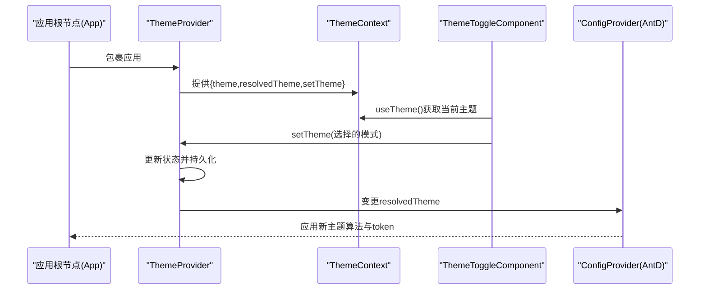
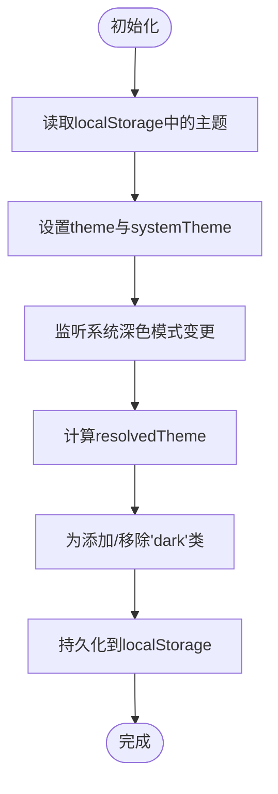
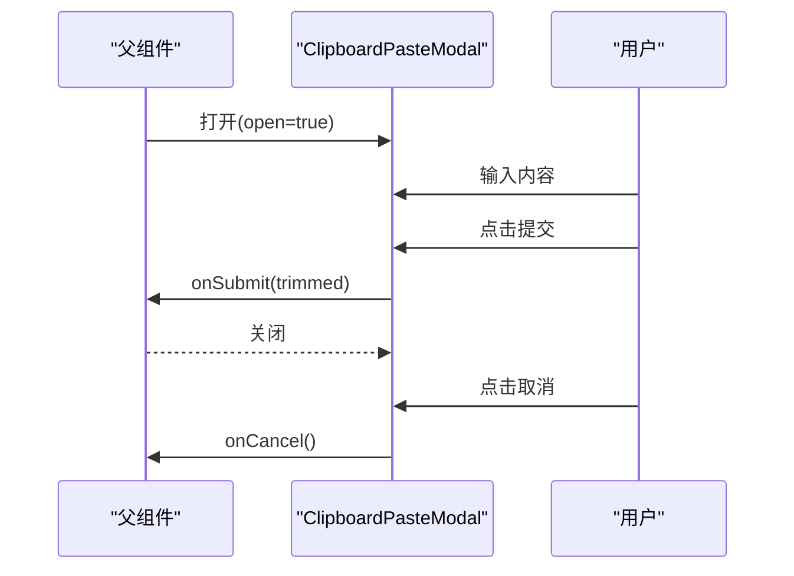
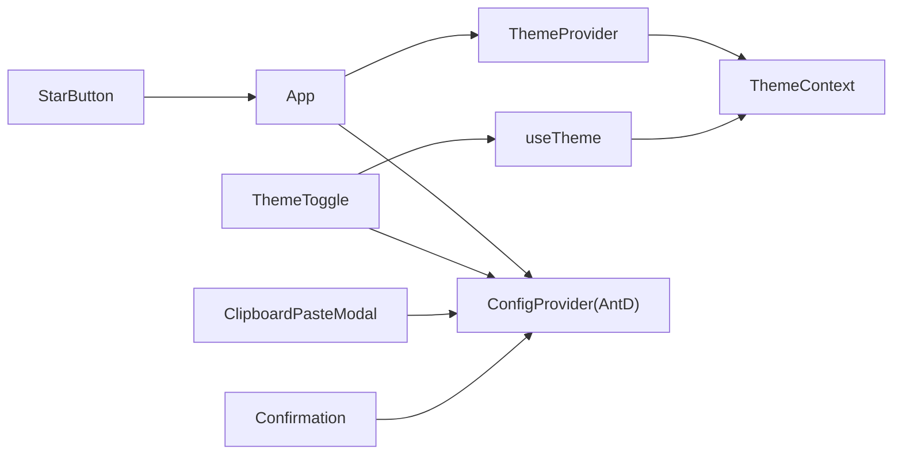

# 组件设计系统

<cite>
**本文引用的文件**
- [frontend/src/shared/theme/ThemeProvider.tsx](file://frontend/src/shared/theme/ThemeProvider.tsx)
- [frontend/src/shared/theme/themeContext.ts](file://frontend/src/shared/theme/themeContext.ts)
- [frontend/src/shared/theme/useTheme.ts](file://frontend/src/shared/theme/useTheme.ts)
- [frontend/src/shared/ui/index.ts](file://frontend/src/shared/ui/index.ts)
- [frontend/src/shared/ui/ClipboardPasteModalComponent.tsx](file://frontend/src/shared/ui/ClipboardPasteModalComponent.tsx)
- [frontend/src/shared/ui/ConfirmationComponent.tsx](file://frontend/src/shared/ui/ConfirmationComponent.tsx)
- [frontend/src/shared/ui/StarButtonComponent.tsx](file://frontend/src/shared/ui/StarButtonComponent.tsx)
- [frontend/src/shared/ui/ThemeToggleComponent.tsx](file://frontend/src/shared/ui/ThemeToggleComponent.tsx)
- [frontend/src/shared/lib/ClipboardHelper.ts](file://frontend/src/shared/lib/ClipboardHelper.ts)
- [frontend/src/shared/lib/FormValidator.ts](file://frontend/src/shared/lib/FormValidator.ts)
- [frontend/src/shared/lib/StringUtils.ts](file://frontend/src/shared/lib/StringUtils.ts)
- [frontend/src/shared/hooks/useIsMobile.tsx](file://frontend/src/shared/hooks/useIsMobile.tsx)
- [frontend/src/shared/hooks/useScreenHeight.tsx](file://frontend/src/shared/hooks/useScreenHeight.tsx)
- [frontend/src/App.tsx](file://frontend/src/App.tsx)
- [frontend/src/index.css](file://frontend/src/index.css)
</cite>

## 目录
1. [引言](#引言)
2. [项目结构](#项目结构)
3. [核心组件](#核心组件)
4. [架构总览](#架构总览)
5. [详细组件分析](#详细组件分析)
6. [依赖关系分析](#依赖关系分析)
7. [性能考量](#性能考量)
8. [故障排查指南](#故障排查指南)
9. [结论](#结论)
10. [附录](#附录)

## 引言
本文件面向Databasus前端组件设计系统，聚焦UI组件库的设计原则与实现规范，涵盖以下方面：
- Ant Design组件的定制化使用与主题系统集成
- 主题系统设计：ThemeProvider、主题切换机制、颜色与字体规范
- 共享组件设计模式：ClipboardPasteModal、Confirmation、StarButton等
- 组件可复用性设计：props接口、事件处理、样式定制
- 最佳实践与代码规范

## 项目结构
前端采用按功能域分层的组织方式，组件设计系统主要位于shared目录下，包含主题、UI共享组件、工具库与Hooks。

图表来源
- [frontend/src/App.tsx:1-77](file://frontend/src/App.tsx#L1-L77)
- [frontend/src/shared/theme/ThemeProvider.tsx:1-79](file://frontend/src/shared/theme/ThemeProvider.tsx#L1-L79)
- [frontend/src/shared/theme/themeContext.ts:1-13](file://frontend/src/shared/theme/themeContext.ts#L1-L13)
- [frontend/src/shared/theme/useTheme.ts:1-12](file://frontend/src/shared/theme/useTheme.ts#L1-L12)
- [frontend/src/shared/ui/ClipboardPasteModalComponent.tsx:1-53](file://frontend/src/shared/ui/ClipboardPasteModalComponent.tsx#L1-L53)
- [frontend/src/shared/ui/ConfirmationComponent.tsx:1-59](file://frontend/src/shared/ui/ConfirmationComponent.tsx#L1-L59)
- [frontend/src/shared/ui/StarButtonComponent.tsx:1-62](file://frontend/src/shared/ui/StarButtonComponent.tsx#L1-L62)
- [frontend/src/shared/ui/ThemeToggleComponent.tsx:1-130](file://frontend/src/shared/ui/ThemeToggleComponent.tsx#L1-L130)
- [frontend/src/shared/ui/index.ts:1-6](file://frontend/src/shared/ui/index.ts#L1-L6)
- [frontend/src/shared/lib/ClipboardHelper.ts:1-27](file://frontend/src/shared/lib/ClipboardHelper.ts#L1-L27)
- [frontend/src/shared/lib/FormValidator.ts:1-17](file://frontend/src/shared/lib/FormValidator.ts#L1-L17)
- [frontend/src/shared/lib/StringUtils.ts:1-6](file://frontend/src/shared/lib/StringUtils.ts#L1-L6)
- [frontend/src/shared/hooks/useIsMobile.tsx:1-27](file://frontend/src/shared/hooks/useIsMobile.tsx#L1-L27)
- [frontend/src/shared/hooks/useScreenHeight.tsx:1-39](file://frontend/src/shared/hooks/useScreenHeight.tsx#L1-L39)
- [frontend/src/index.css:1-80](file://frontend/src/index.css#L1-L80)

章节来源
- [frontend/src/App.tsx:1-77](file://frontend/src/App.tsx#L1-L77)
- [frontend/src/index.css:1-80](file://frontend/src/index.css#L1-L80)

## 核心组件
本节概述组件设计系统的关键构件及其职责：
- 主题系统：提供主题上下文、状态管理与持久化，支持light/dark/system三种模式，并通过CSS类名驱动暗色模式。
- 共享UI组件：提供可复用的对话框、确认弹窗、主题切换按钮与星标展示组件。
- 工具与Hooks：封装剪贴板读写、表单校验、字符串处理以及移动端与屏幕高度检测等通用能力。

章节来源
- [frontend/src/shared/theme/ThemeProvider.tsx:1-79](file://frontend/src/shared/theme/ThemeProvider.tsx#L1-L79)
- [frontend/src/shared/theme/themeContext.ts:1-13](file://frontend/src/shared/theme/themeContext.ts#L1-L13)
- [frontend/src/shared/theme/useTheme.ts:1-12](file://frontend/src/shared/theme/useTheme.ts#L1-L12)
- [frontend/src/shared/ui/ClipboardPasteModalComponent.tsx:1-53](file://frontend/src/shared/ui/ClipboardPasteModalComponent.tsx#L1-L53)
- [frontend/src/shared/ui/ConfirmationComponent.tsx:1-59](file://frontend/src/shared/ui/ConfirmationComponent.tsx#L1-L59)
- [frontend/src/shared/ui/StarButtonComponent.tsx:1-62](file://frontend/src/shared/ui/StarButtonComponent.tsx#L1-L62)
- [frontend/src/shared/ui/ThemeToggleComponent.tsx:1-130](file://frontend/src/shared/ui/ThemeToggleComponent.tsx#L1-L130)
- [frontend/src/shared/lib/ClipboardHelper.ts:1-27](file://frontend/src/shared/lib/ClipboardHelper.ts#L1-L27)
- [frontend/src/shared/lib/FormValidator.ts:1-17](file://frontend/src/shared/lib/FormValidator.ts#L1-L17)
- [frontend/src/shared/lib/StringUtils.ts:1-6](file://frontend/src/shared/lib/StringUtils.ts#L1-L6)
- [frontend/src/shared/hooks/useIsMobile.tsx:1-27](file://frontend/src/shared/hooks/useIsMobile.tsx#L1-L27)
- [frontend/src/shared/hooks/useScreenHeight.tsx:1-39](file://frontend/src/shared/hooks/useScreenHeight.tsx#L1-L39)

## 架构总览
应用在根节点注入ThemeProvider，向全局提供主题上下文；Ant Design通过ConfigProvider接入主题算法与主色调；共享UI组件通过useTheme消费上下文并响应主题变化。

图表来源
- [frontend/src/App.tsx:44-51](file://frontend/src/App.tsx#L44-L51)
- [frontend/src/shared/theme/ThemeProvider.tsx:32-78](file://frontend/src/shared/theme/ThemeProvider.tsx#L32-L78)
- [frontend/src/shared/theme/useTheme.ts:5-11](file://frontend/src/shared/theme/useTheme.ts#L5-L11)
- [frontend/src/shared/ui/ThemeToggleComponent.tsx:64-129](file://frontend/src/shared/ui/ThemeToggleComponent.tsx#L64-L129)

## 详细组件分析

### 主题系统（ThemeProvider）
- 设计要点
  - 支持三种模式：light、dark、system；当为system时跟随系统配色。
  - 使用localStorage持久化用户选择，避免刷新丢失。
  - 通过documentElement添加/移除“dark”类名，配合Tailwind dark变体实现样式切换。
  - 响应系统主题变化监听，动态更新resolvedTheme。
- 数据流
  - 状态：theme（用户选择）、systemTheme（系统偏好）、resolvedTheme（最终生效）。
  - 计算：resolvedTheme = theme===system ? systemTheme : theme。
  - 副作用：根据resolvedTheme设置DOM类名。
- 复杂度
  - 状态计算与副作用均为O(1)，内存占用极低。
- 错误处理
  - 在无window环境或不支持matchMedia时，默认light。
- 可扩展性
  - 可在ConfigProvider中进一步扩展token以适配更多视觉变量。

图表来源
- [frontend/src/shared/theme/ThemeProvider.tsx:9-61](file://frontend/src/shared/theme/ThemeProvider.tsx#L9-L61)

章节来源
- [frontend/src/shared/theme/ThemeProvider.tsx:1-79](file://frontend/src/shared/theme/ThemeProvider.tsx#L1-L79)
- [frontend/src/shared/theme/themeContext.ts:1-13](file://frontend/src/shared/theme/themeContext.ts#L1-L13)
- [frontend/src/shared/theme/useTheme.ts:1-12](file://frontend/src/shared/theme/useTheme.ts#L1-L12)

### Ant Design主题集成
- 设计要点
  - 在ConfigProvider中根据resolvedTheme选择算法（暗色/默认），并设置主色调。
  - 将主题注入AntD全局，确保所有AntD组件遵循统一风格。
- 集成点
  - AppContent中读取resolvedTheme并传入ConfigProvider。
  - 与ThemeProvider联动，实现主题切换即时生效。

章节来源
- [frontend/src/App.tsx:44-51](file://frontend/src/App.tsx#L44-L51)

### 字体与颜色规范
- 字体
  - 根元素与常见标签统一使用Jost及系统字体栈，保证跨平台一致性。
- 暗色模式
  - 通过Tailwind dark变体与“dark”类名控制，组件内使用dark:前缀类名适配。
- 滚动条
  - 使用CSS变量控制滚动条颜色，便于主题一致化。

章节来源
- [frontend/src/index.css:6-22](file://frontend/src/index.css#L6-L22)
- [frontend/src/index.css:4](file://frontend/src/index.css#L4)
- [frontend/src/index.css:57-79](file://frontend/src/index.css#L57-L79)

### 共享UI组件设计模式

#### ClipboardPasteModal（粘贴对话框）
- 设计目标
  - 在无法自动访问剪贴板时，提供手动粘贴入口。
- 接口与行为
  - props：open（是否显示）、onSubmit（提交回调）、onCancel（取消回调）。
  - 内部状态：输入值value；提交前trim并校验非空。
  - 交互：取消时清空输入；提交后调用onSubmit并清空输入。
- 样式与可定制
  - 使用AntD Modal与Input.TextArea；按钮禁用态基于输入是否为空。
  - 支持通过父组件传入样式覆盖（如容器样式）。
- 可复用性
  - 无副作用依赖，仅依赖props与内部状态；适合多处复用。

图表来源
- [frontend/src/shared/ui/ClipboardPasteModalComponent.tsx:10-24](file://frontend/src/shared/ui/ClipboardPasteModalComponent.tsx#L10-L24)

章节来源
- [frontend/src/shared/ui/ClipboardPasteModalComponent.tsx:1-53](file://frontend/src/shared/ui/ClipboardPasteModalComponent.tsx#L1-L53)

#### Confirmation（确认弹窗）
- 设计目标
  - 提供可配置的确认/取消操作，支持危险按钮颜色与隐藏取消按钮。
- 接口与行为
  - props：onConfirm、onDecline、description、actionButtonColor（red/blue）、actionText、cancelText、hideCancelButton。
  - 渲染：danger属性由actionButtonColor决定；footer为空以便自定义布局。
  - 安全：danger与type均按约定设置，避免误用。
- 可复用性
  - 通过枚举与布尔参数控制外观与行为，适合多种业务场景。

章节来源
- [frontend/src/shared/ui/ConfirmationComponent.tsx:4-24](file://frontend/src/shared/ui/ConfirmationComponent.tsx#L4-L24)
- [frontend/src/shared/ui/ConfirmationComponent.tsx:25-58](file://frontend/src/shared/ui/ConfirmationComponent.tsx#L25-L58)

#### StarButton（GitHub Star展示）
- 设计目标
  - 展示仓库Star数量，带加载态与错误兜底。
- 接口与行为
  - 无props；内部fetch GitHub API，失败时记录日志并结束加载。
  - 使用SVG图标与链接打开外部页面。
- 可复用性
  - 纯展示型组件，适合放置于页脚或导航区域。

章节来源
- [frontend/src/shared/ui/StarButtonComponent.tsx:19-39](file://frontend/src/shared/ui/StarButtonComponent.tsx#L19-L39)
- [frontend/src/shared/ui/StarButtonComponent.tsx:41-61](file://frontend/src/shared/ui/StarButtonComponent.tsx#L41-L61)

#### ThemeToggle（主题切换按钮）
- 设计目标
  - 下拉菜单形式切换主题，显示当前模式图标与名称。
- 接口与行为
  - 通过useTheme获取theme与setTheme；菜单项包含light/dark/system三类。
  - 图标随当前模式动态变化；selectedKeys高亮当前选中项。
- 可复用性
  - 作为导航栏或设置面板的独立控件，易于嵌入不同页面。

章节来源
- [frontend/src/shared/ui/ThemeToggleComponent.tsx:64-129](file://frontend/src/shared/ui/ThemeToggleComponent.tsx#L64-L129)

### UI导出聚合
- 通过ui/index.ts集中导出共享组件，便于上层按需引入与统一管理。

章节来源
- [frontend/src/shared/ui/index.ts:1-6](file://frontend/src/shared/ui/index.ts#L1-L6)

### 工具与Hooks

#### 剪贴板与表单校验
- ClipboardHelper：封装clipboard API可用性判断、复制/读取逻辑，兼容非安全上下文。
- FormValidator：提供邮箱与URL格式校验，规则清晰且可扩展。
- StringUtils：提供首字母大写等简单字符串处理。

章节来源
- [frontend/src/shared/lib/ClipboardHelper.ts:1-27](file://frontend/src/shared/lib/ClipboardHelper.ts#L1-L27)
- [frontend/src/shared/lib/FormValidator.ts:1-17](file://frontend/src/shared/lib/FormValidator.ts#L1-L17)
- [frontend/src/shared/lib/StringUtils.ts:1-6](file://frontend/src/shared/lib/StringUtils.ts#L1-L6)

#### 移动端与屏幕高度检测
- useIsMobile：基于窗口宽度判断移动端，动态响应resize。
- useScreenHeight：优先使用visualViewport以适配iOS键盘弹出场景。

章节来源
- [frontend/src/shared/hooks/useIsMobile.tsx:9-26](file://frontend/src/shared/hooks/useIsMobile.tsx#L9-L26)
- [frontend/src/shared/hooks/useScreenHeight.tsx:12-38](file://frontend/src/shared/hooks/useScreenHeight.tsx#L12-L38)

## 依赖关系分析
- 组件耦合
  - ThemeProvider与ThemeContext强耦合，ThemeToggle依赖useTheme消费上下文。
  - App通过ConfigProvider将主题传递给AntD生态。
- 外部依赖
  - Ant Design：Modal、Dropdown、App、ConfigProvider、theme算法。
  - 浏览器API：localStorage、matchMedia、clipboard、visualViewport。
- 潜在循环依赖
  - 当前结构未见循环导入；ThemeProvider与UI组件通过上下文解耦。

图表来源
- [frontend/src/App.tsx:13-14](file://frontend/src/App.tsx#L13-L14)
- [frontend/src/shared/theme/ThemeProvider.tsx:4-5](file://frontend/src/shared/theme/ThemeProvider.tsx#L4-L5)
- [frontend/src/shared/theme/useTheme.ts:3](file://frontend/src/shared/theme/useTheme.ts#L3)
- [frontend/src/shared/ui/ThemeToggleComponent.tsx:4](file://frontend/src/shared/ui/ThemeToggleComponent.tsx#L4)
- [frontend/src/shared/ui/ClipboardPasteModalComponent.tsx:1](file://frontend/src/shared/ui/ClipboardPasteModalComponent.tsx#L1)
- [frontend/src/shared/ui/ConfirmationComponent.tsx:1](file://frontend/src/shared/ui/ConfirmationComponent.tsx#L1)
- [frontend/src/shared/ui/StarButtonComponent.tsx:1](file://frontend/src/shared/ui/StarButtonComponent.tsx#L1)

## 性能考量
- 主题切换
  - 仅更新documentElement类名与ConfigProvider参数，开销极小。
- 组件渲染
  - ClipboardPasteModal与Confirmation均为轻量组件，props稳定时重渲染成本低。
- 资源加载
  - StarButton在挂载时发起一次网络请求，建议结合缓存策略或定时刷新。
- 交互体验
  - 使用useIsMobile与useScreenHeight提升移动端适配质量，减少布局抖动。

## 故障排查指南
- 主题未生效
  - 检查documentElement是否正确添加/移除“dark”类；确认resolvedTheme计算逻辑。
  - 确认ConfigProvider已包裹应用根节点。
- 系统主题监听无效
  - 确保浏览器支持matchMedia；在无window环境下默认light属预期。
- 剪贴板不可用
  - 非HTTPS或非安全上下文会导致clipboard API不可用；回退至textarea方案。
- 移动端高度异常
  - iOS设备请确认visualViewport存在并已监听其resize事件。
- 确认弹窗危险按钮颜色不符
  - 确认actionButtonColor传入red或blue；danger由该参数决定。

章节来源
- [frontend/src/shared/theme/ThemeProvider.tsx:37-46](file://frontend/src/shared/theme/ThemeProvider.tsx#L37-L46)
- [frontend/src/shared/theme/ThemeProvider.tsx:54-61](file://frontend/src/shared/theme/ThemeProvider.tsx#L54-L61)
- [frontend/src/shared/lib/ClipboardHelper.ts:2-4](file://frontend/src/shared/lib/ClipboardHelper.ts#L2-L4)
- [frontend/src/shared/hooks/useScreenHeight.tsx:24-27](file://frontend/src/shared/hooks/useScreenHeight.tsx#L24-L27)
- [frontend/src/shared/ui/ConfirmationComponent.tsx:9-13](file://frontend/src/shared/ui/ConfirmationComponent.tsx#L9-L13)

## 结论
Databasus组件设计系统以“上下文+AntD主题集成”为核心，辅以简洁的共享UI组件与实用工具/Hooks，形成高内聚、低耦合的前端组件体系。通过明确的props接口、事件处理模式与样式定制选项，组件具备良好的可复用性与可维护性。建议后续在以下方向持续优化：
- 扩展主题token以覆盖更多视觉变量
- 为共享组件增加测试用例与类型约束
- 对网络型组件（如StarButton）增加缓存与错误重试策略

## 附录
- 组件导出清单
  - ClipboardPasteModalComponent
  - ConfirmationComponent
  - StarButtonComponent
  - ThemeToggleComponent
  - CloudflareTurnstileWidget（由ui/index.ts导出）

章节来源
- [frontend/src/shared/ui/index.ts:1-6](file://frontend/src/shared/ui/index.ts#L1-L6)