# 路由导航系统

<cite>
**本文档引用的文件**
- [App.tsx](file://frontend/src/App.tsx)
- [main.tsx](file://frontend/src/main.tsx)
- [MainScreenComponent.tsx](file://frontend/src/widgets/main/MainScreenComponent.tsx)
- [SidebarComponent.tsx](file://frontend/src/widgets/main/SidebarComponent.tsx)
- [WorkspaceSelectionComponent.tsx](file://frontend/src/widgets/main/WorkspaceSelectionComponent.tsx)
- [AuthPageComponent.tsx](file://frontend/src/pages/AuthPageComponent.tsx)
- [OAuthCallbackPage.tsx](file://frontend/src/pages/OAuthCallbackPage.tsx)
- [constants.ts](file://frontend/src/constants.ts)
- [users/index.ts](file://frontend/src/entity/users/index.ts)
</cite>

## 目录
1. [简介](#简介)
2. [项目结构](#项目结构)
3. [核心组件](#核心组件)
4. [架构概览](#架构概览)
5. [详细组件分析](#详细组件分析)
6. [依赖关系分析](#依赖关系分析)
7. [性能考虑](#性能考虑)
8. [故障排除指南](#故障排除指南)
9. [结论](#结论)

## 简介

Databasus路由导航系统基于React Router 7构建，采用现代前端架构设计，实现了完整的单页应用路由管理。该系统通过精心设计的路由层级、嵌套路由结构和动态路由机制，为用户提供了流畅的导航体验。

系统的核心特点包括：
- 基于React Router 7的声明式路由配置
- 动态路由参数和查询字符串处理
- 嵌套布局组件的灵活组合
- 完整的认证状态管理和权限控制
- 响应式导航组件设计
- 工作空间多租户支持

## 项目结构

前端路由系统主要位于`frontend/src`目录下，采用功能模块化的组织方式：

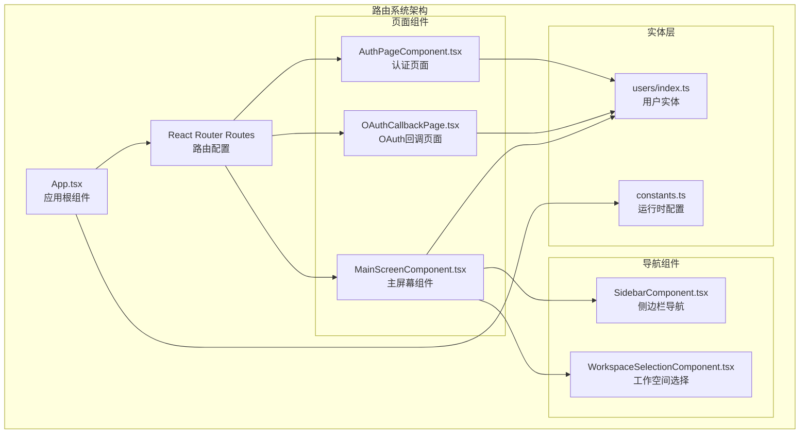

**图表来源**
- [App.tsx:1-77](file://frontend/src/App.tsx#L1-L77)
- [main.tsx:1-14](file://frontend/src/main.tsx#L1-L14)

**章节来源**
- [App.tsx:1-77](file://frontend/src/App.tsx#L1-L77)
- [main.tsx:1-14](file://frontend/src/main.tsx#L1-L14)

## 核心组件

### 应用根组件

应用根组件`App.tsx`负责全局路由配置和状态管理。它使用`BrowserRouter`作为路由容器，定义了三个主要路由：

1. **根路径路由** (`/`)：根据认证状态动态渲染不同组件
2. **OAuth回调路由** (`/auth/callback`)：处理第三方认证回调
3. **存储OAuth路由** (`/storages/google-oauth`)：处理存储服务OAuth

### 认证状态管理

应用通过`userApi.isAuthorized()`方法检查用户认证状态，并监听认证状态变化：

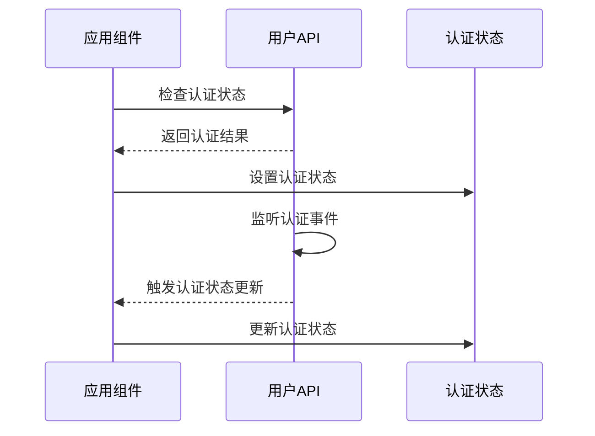

**图表来源**
- [App.tsx:34-41](file://frontend/src/App.tsx#L34-L41)

**章节来源**
- [App.tsx:16-66](file://frontend/src/App.tsx#L16-L66)

## 架构概览

Databasus路由导航系统采用分层架构设计，实现了清晰的关注点分离：

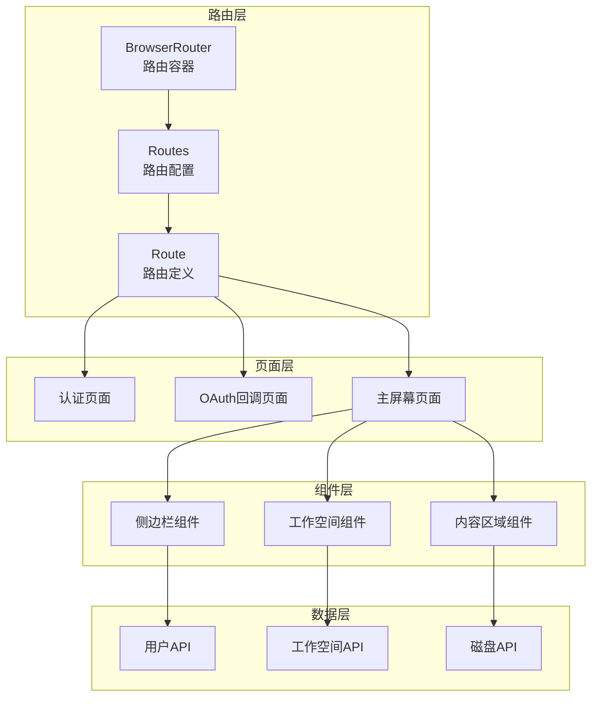

**图表来源**
- [App.tsx:53-61](file://frontend/src/App.tsx#L53-L61)
- [MainScreenComponent.tsx:15-29](file://frontend/src/widgets/main/MainScreenComponent.tsx#L15-L29)

## 详细组件分析

### 主屏幕组件分析

主屏幕组件`MainScreenComponent.tsx`是整个应用的核心导航容器，实现了复杂的嵌套路由结构：

#### 组件架构设计

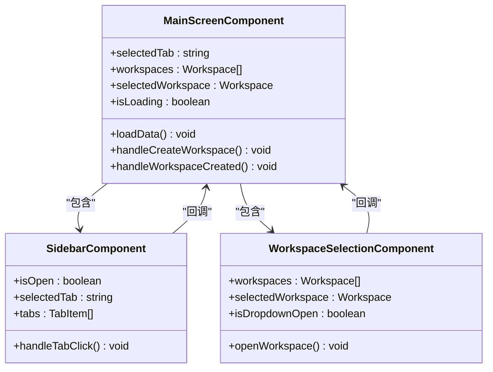

**图表来源**
- [MainScreenComponent.tsx:31-405](file://frontend/src/widgets/main/MainScreenComponent.tsx#L31-L405)
- [SidebarComponent.tsx:34-227](file://frontend/src/widgets/main/SidebarComponent.tsx#L34-L227)
- [WorkspaceSelectionComponent.tsx:14-140](file://frontend/src/widgets/main/WorkspaceSelectionComponent.tsx#L14-L140)

#### 工作空间管理机制

主屏幕组件实现了智能的工作空间选择和持久化机制：

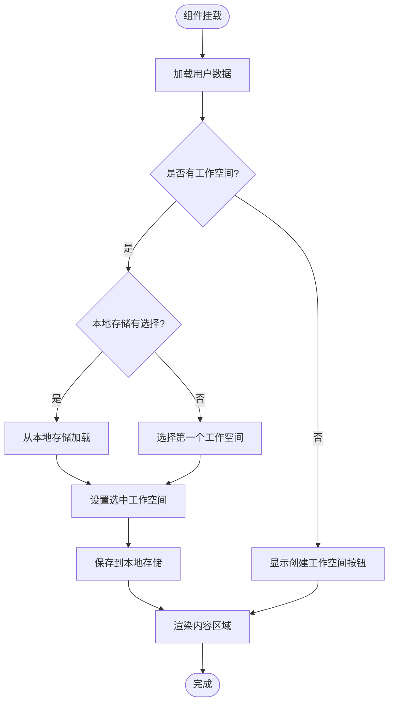

**图表来源**
- [MainScreenComponent.tsx:75-96](file://frontend/src/widgets/main/MainScreenComponent.tsx#L75-L96)

**章节来源**
- [MainScreenComponent.tsx:31-405](file://frontend/src/widgets/main/MainScreenComponent.tsx#L31-L405)

### 侧边栏组件分析

侧边栏组件`SidebarComponent.tsx`实现了响应式的导航菜单系统：

#### 导航标签管理

侧边栏组件维护了一个复杂的标签数组，每个标签都包含以下属性：
- 文本标签和图标路径
- 权限控制（管理员专用）
- 可见性控制
- 点击处理函数

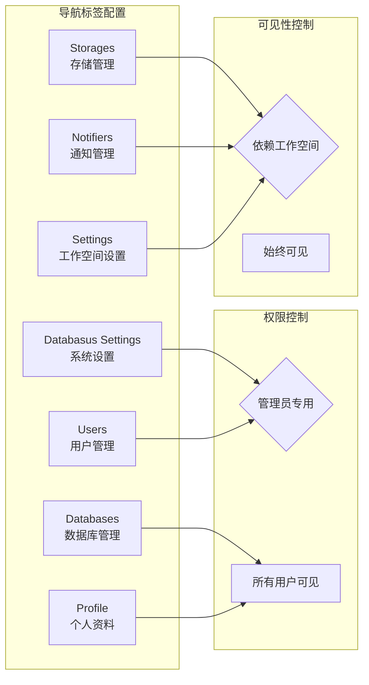

**图表来源**
- [MainScreenComponent.tsx:121-192](file://frontend/src/widgets/main/MainScreenComponent.tsx#L121-L192)

#### 响应式设计实现

侧边栏组件支持桌面和移动设备的不同布局模式：

**桌面端布局**：固定宽度的垂直导航栏，使用图标和颜色状态表示选中状态

**移动端布局**：抽屉式导航，提供完整的导航列表和搜索功能

**章节来源**
- [SidebarComponent.tsx:34-227](file://frontend/src/widgets/main/SidebarComponent.tsx#L34-L227)

### 工作空间选择组件分析

工作空间选择组件`WorkspaceSelectionComponent.tsx`提供了智能的工作空间切换功能：

#### 搜索和过滤机制

组件实现了实时搜索功能，支持按工作空间名称进行过滤：

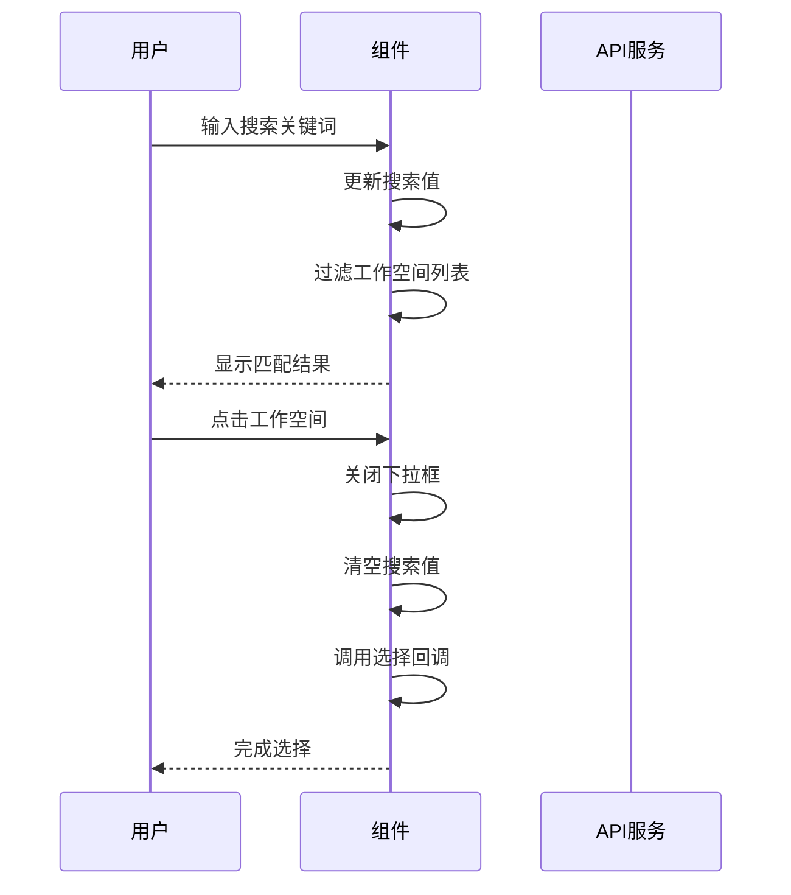

**图表来源**
- [WorkspaceSelectionComponent.tsx:25-48](file://frontend/src/widgets/main/WorkspaceSelectionComponent.tsx#L25-L48)

**章节来源**
- [WorkspaceSelectionComponent.tsx:14-140](file://frontend/src/widgets/main/WorkspaceSelectionComponent.tsx#L14-L140)

### 认证页面组件分析

认证页面组件`AuthPageComponent.tsx`提供了完整的用户认证流程：

#### 多模式认证界面

组件支持四种不同的认证模式：
1. **注册模式** (`signUp`)：新用户注册
2. **登录模式** (`signIn`)：现有用户登录
3. **请求重置** (`requestReset`)：密码重置请求
4. **重置密码** (`resetPassword`)：执行密码重置

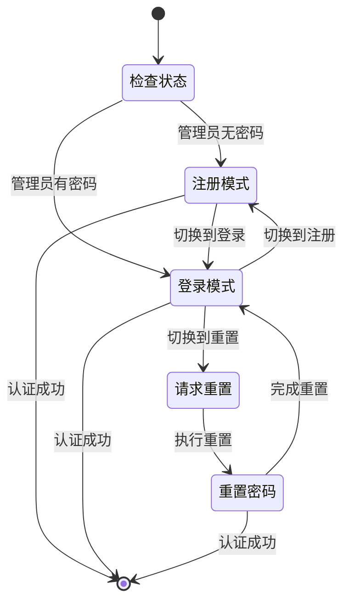

**图表来源**
- [AuthPageComponent.tsx:17-85](file://frontend/src/pages/AuthPageComponent.tsx#L17-L85)

**章节来源**
- [AuthPageComponent.tsx:17-115](file://frontend/src/pages/AuthPageComponent.tsx#L17-L115)

### OAuth回调页面分析

OAuth回调页面`OAuthCallbackPage.tsx`处理第三方认证流程：

#### OAuth认证流程

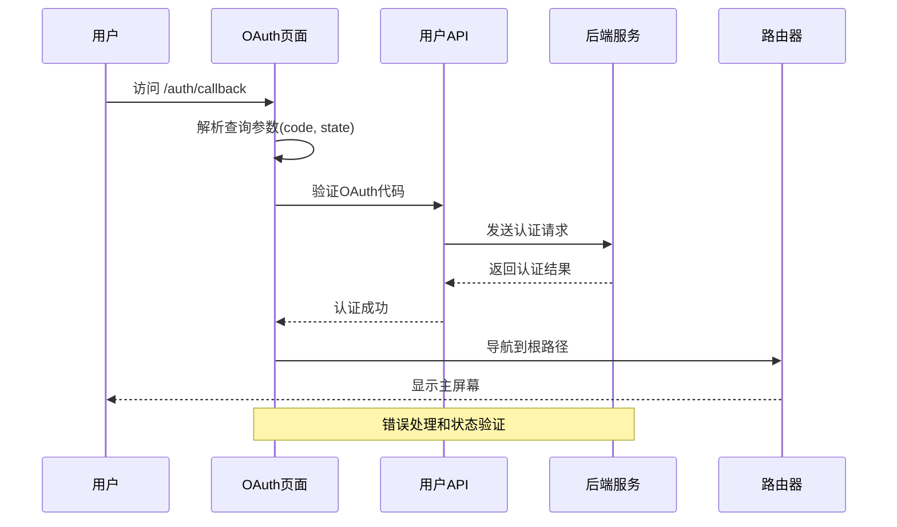

**图表来源**
- [OAuthCallbackPage.tsx:14-48](file://frontend/src/pages/OAuthCallbackPage.tsx#L14-L48)

**章节来源**
- [OAuthCallbackPage.tsx:9-77](file://frontend/src/pages/OAuthCallbackPage.tsx#L9-L77)

## 依赖关系分析

### 组件依赖图

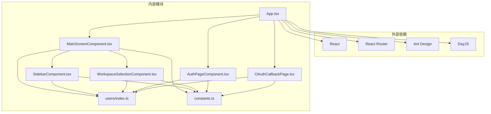

**图表来源**
- [App.tsx:1-15](file://frontend/src/App.tsx#L1-L15)
- [MainScreenComponent.tsx:15-29](file://frontend/src/widgets/main/MainScreenComponent.tsx#L15-L29)

### 数据流分析

系统采用单向数据流设计，确保状态管理的可预测性和可维护性：

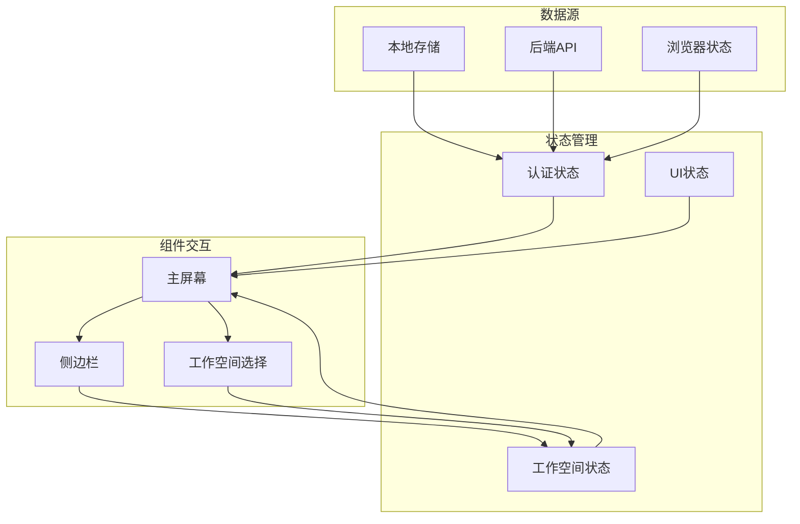

**图表来源**
- [MainScreenComponent.tsx:80-96](file://frontend/src/widgets/main/MainScreenComponent.tsx#L80-L96)

**章节来源**
- [users/index.ts:1-25](file://frontend/src/entity/users/index.ts#L1-L25)

## 性能考虑

### 路由性能优化

系统在多个层面实现了性能优化策略：

1. **懒加载和代码分割**：通过动态导入实现组件懒加载
2. **状态缓存**：使用本地存储缓存认证状态和工作空间选择
3. **并发数据加载**：使用Promise.all并行加载多个API请求
4. **条件渲染**：根据权限和状态条件性渲染组件

### 内存管理

- 使用useEffect清理函数避免内存泄漏
- 合理的组件卸载时机
- 事件监听器的正确移除

## 故障排除指南

### 常见问题诊断

#### 认证状态问题

**症状**：用户已登录但显示认证页面
**解决方案**：
1. 检查`userApi.isAuthorized()`返回值
2. 验证认证监听器是否正常工作
3. 确认本地存储中的认证令牌

#### 工作空间加载失败

**症状**：主屏幕显示空白或加载指示器
**解决方案**：
1. 检查网络连接和API可用性
2. 验证工作空间API响应格式
3. 查看控制台错误日志

#### OAuth认证失败

**症状**：OAuth回调页面显示错误信息
**解决方案**：
1. 验证OAuth回调参数完整性
2. 检查后端OAuth服务配置
3. 确认重定向URI配置正确

**章节来源**
- [OAuthCallbackPage.tsx:14-48](file://frontend/src/pages/OAuthCallbackPage.tsx#L14-L48)

## 结论

Databasus路由导航系统展现了现代前端应用的最佳实践，通过精心设计的架构和组件化开发，实现了：

1. **清晰的路由层次结构**：基于React Router 7的声明式路由配置
2. **灵活的嵌套组件设计**：支持复杂的页面布局和导航需求
3. **完善的权限控制系统**：基于角色的访问控制和动态权限验证
4. **优秀的用户体验**：响应式设计和流畅的导航交互
5. **可靠的性能表现**：优化的数据加载和状态管理机制

该系统为类似的企业级应用提供了可扩展的路由导航解决方案，具有良好的可维护性和扩展性。