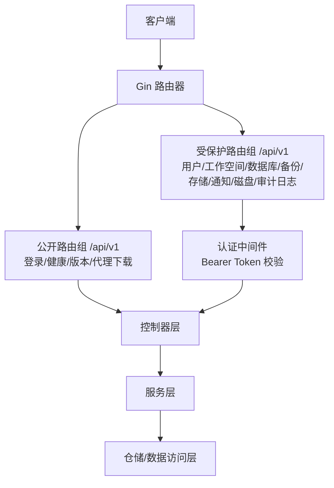
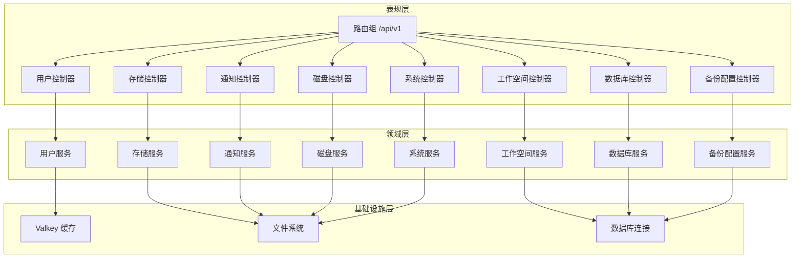
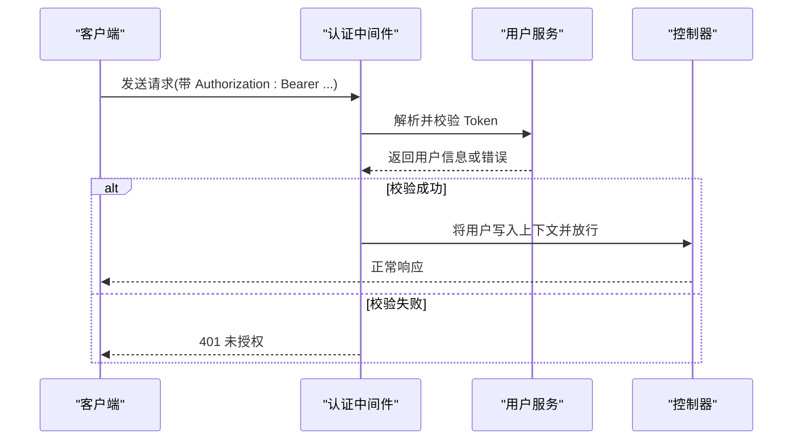
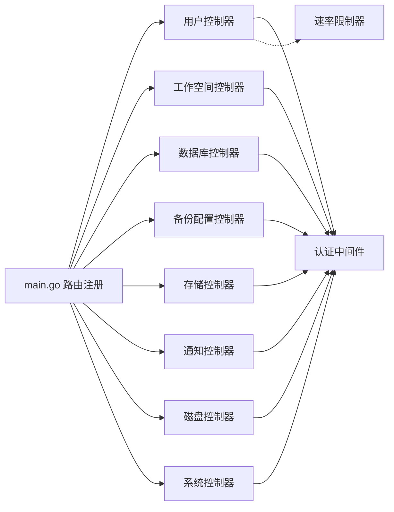

# 后端API设计

<cite>
**本文档引用的文件**
- [main.go](file://backend/cmd/main.go)
- [controller.go](file://backend/internal/features/users/controllers/user_controller.go)
- [di.go](file://backend/internal/features/users/controllers/di.go)
- [middleware.go](file://backend/internal/features/users/middleware/middleware.go)
- [rate_limiter.go](file://backend/internal/util/cache/rate_limiter.go)
- [controller.go](file://backend/internal/features/databases/controller.go)
- [controller.go](file://backend/internal/features/backups/config/controller.go)
- [controller.go](file://backend/internal/features/storages/controller.go)
- [controller.go](file://backend/internal/features/notifiers/controller.go)
- [controller.go](file://backend/internal/features/workspaces/controllers/workspace_controller.go)
- [controller.go](file://backend/internal/features/workspaces/controllers/membership_controller.go)
- [controller.go](file://backend/internal/features/disk/controller.go)
- [controller.go](file://backend/internal/features/system/healthcheck/controller.go)
- [controller.go](file://backend/internal/features/system/version/controller.go)
- [controller.go](file://backend/internal/features/system/agent/controller.go)
</cite>

## 目录
1. [简介](#简介)
2. [项目结构](#项目结构)
3. [核心组件](#核心组件)
4. [架构总览](#架构总览)
5. [详细组件分析](#详细组件分析)
6. [依赖关系分析](#依赖关系分析)
7. [性能考虑](#性能考虑)
8. [故障排除指南](#故障排除指南)
9. [结论](#结论)
10. [附录](#附录)

## 简介
本文件为 Databasus 后端 API 的设计与实现文档，覆盖 RESTful API 的整体架构、URL 模式、HTTP 方法、请求/响应格式、状态码约定、认证授权流程（含 JWT 令牌管理、权限验证机制、会话管理策略）、公共 API 端点清单（用户管理、数据库管理、备份管理、存储管理、通知管理、工作空间管理、系统管理等），以及速率限制、安全考虑、SDK 使用建议与性能优化实践。

## 项目结构
后端采用 Gin Web 框架，通过路由组 /api/v1 提供统一前缀的 REST API；在启动时注册公开端点（如登录、健康检查、版本信息、代理下载）与受保护端点（需 JWT 认证）。认证中间件负责从请求头提取并校验 Bearer Token，并将用户上下文注入到后续处理链中。部分控制器内置速率限制器以保护敏感接口（如登录、重置密码）。

图表来源
- [main.go:213-257](file://backend/cmd/main.go#L213-L257)
- [middleware.go:13-38](file://backend/internal/features/users/middleware/middleware.go#L13-L38)

章节来源
- [main.go:213-257](file://backend/cmd/main.go#L213-L257)
- [main.go:434-457](file://backend/cmd/main.go#L434-L457)

## 核心组件
- 路由与分组：根路由下挂载 /api/v1，公开路由与受保护路由分别注册。
- 认证中间件：从 Authorization 头部读取 Bearer Token，校验失败返回 401。
- 权限中间件：基于用户角色的授权拦截（如管理员专用端点）。
- 速率限制：基于 Valkey 的滑动窗口限流，用于登录与密码重置等敏感操作。
- 控制器：按功能域划分（用户、工作空间、数据库、备份、存储、通知、磁盘、系统），每个控制器定义一组 REST 接口。
- 服务层：封装业务逻辑，控制器仅做参数绑定、鉴权与调用服务。
- 数据模型：各模块 DTO/Model 定义了请求/响应结构，Swagger 注解用于生成文档。

章节来源
- [main.go:213-257](file://backend/cmd/main.go#L213-L257)
- [middleware.go:13-38](file://backend/internal/features/users/middleware/middleware.go#L13-L38)
- [rate_limiter.go:22-53](file://backend/internal/util/cache/rate_limiter.go#L22-L53)
- [di.go:8-31](file://backend/internal/features/users/controllers/di.go#L8-L31)

## 架构总览
Databasus 后端采用清晰的分层架构：
- 表现层：Gin 路由与控制器
- 领域层：服务与业务规则
- 基础设施层：缓存（Valkey）、文件系统、外部工具（数据库客户端）

图表来源
- [main.go:213-257](file://backend/cmd/main.go#L213-L257)
- [controller.go:19-22](file://backend/internal/features/users/controllers/user_controller.go#L19-L22)
- [controller.go:18-20](file://backend/internal/features/workspaces/controllers/workspace_controller.go#L18-L20)
- [controller.go:14-18](file://backend/internal/features/databases/controller.go#L14-L18)
- [controller.go:13-15](file://backend/internal/features/backups/config/controller.go#L13-L15)
- [controller.go:14-17](file://backend/internal/features/storages/controller.go#L14-L17)
- [controller.go:14-17](file://backend/internal/features/notifiers/controller.go#L14-L17)
- [controller.go:9-11](file://backend/internal/features/disk/controller.go#L9-L11)
- [controller.go:9-11](file://backend/internal/features/system/healthcheck/controller.go#L9-L11)

## 详细组件分析

### 认证与授权
- 认证方式：Bearer JWT 令牌，从 Authorization 头部读取。
- 中间件行为：
  - 若缺少令牌或无效，返回 401。
  - 成功解析后将用户对象写入上下文，后续控制器可直接获取。
- 角色授权：对特定端点使用 RequireRole 中间件进行管理员级权限校验。
- 速率限制：登录与重置密码接口使用基于 Valkey 的滑动窗口限流，防止暴力破解。

图表来源
- [middleware.go:13-38](file://backend/internal/features/users/middleware/middleware.go#L13-L38)
- [user_controller.go:113-158](file://backend/internal/features/users/controllers/user_controller.go#L113-L158)

章节来源
- [middleware.go:13-38](file://backend/internal/features/users/middleware/middleware.go#L13-L38)
- [rate_limiter.go:22-53](file://backend/internal/util/cache/rate_limiter.go#L22-L53)
- [user_controller.go:113-158](file://backend/internal/features/users/controllers/user_controller.go#L113-L158)

### 用户管理
- 公开端点（无需认证）
  - POST /api/v1/users/signup：注册新用户，支持 Cloudflare Turnstile 校验。
  - POST /api/v1/users/signin：登录，内置速率限制。
  - GET /api/v1/users/admin/has-password：判断是否已设置管理员密码。
  - POST /api/v1/users/admin/set-password：设置管理员密码（无认证）。
  - POST /api/v1/users/send-reset-password-code：发送重置码，支持 Turnstile。
  - POST /api/v1/users/reset-password：使用验证码重置密码。
  - POST /api/v1/auth/github/callback：GitHub OAuth 回调。
  - POST /api/v1/auth/google/callback：Google OAuth 回调。
- 受保护端点（需认证）
  - GET /api/v1/users/me：获取当前用户资料。
  - PUT /api/v1/users/me：更新当前用户信息（名称/邮箱）。
  - PUT /api/v1/users/change-password：修改当前用户密码。
  - POST /api/v1/users/invite：邀请新用户（管理员）。

请求/响应与错误码约定
- 成功：200；创建：201；无内容：204；未授权：401；禁止：403；过多请求：429；错误：400/500。
- 登录与重置密码接口内置速率限制，超限返回 429。

章节来源
- [controller.go:24-39](file://backend/internal/features/users/controllers/user_controller.go#L24-L39)
- [controller.go:58-100](file://backend/internal/features/users/controllers/user_controller.go#L58-L100)
- [controller.go:113-158](file://backend/internal/features/users/controllers/user_controller.go#L113-158)
- [controller.go:161-187](file://backend/internal/features/users/controllers/user_controller.go#L161-187)
- [controller.go:399-460](file://backend/internal/features/users/controllers/user_controller.go#L399-460)
- [controller.go:462-486](file://backend/internal/features/users/controllers/user_controller.go#L462-486)
- [controller.go:274-331](file://backend/internal/features/users/controllers/user_controller.go#L274-331)
- [controller.go:333-397](file://backend/internal/features/users/controllers/user_controller.go#L333-397)
- [di.go:8-31](file://backend/internal/features/users/controllers/di.go#L8-L31)

### 工作空间管理
- 公开端点：无
- 受保护端点
  - POST /api/v1/workspaces：创建工作空间（管理员/拥有者）。
  - GET /api/v1/workspaces：列出用户所属工作空间。
  - GET /api/v1/workspaces/:id：获取工作空间详情。
  - PUT /api/v1/workspaces/:id：更新工作空间（管理员/拥有者）。
  - DELETE /api/v1/workspaces/:id：删除工作空间（仅拥有者/管理员）。
  - GET /api/v1/workspaces/:id/audit-logs：获取工作空间审计日志（成员可访问）。

章节来源
- [controller.go:22-31](file://backend/internal/features/workspaces/controllers/workspace_controller.go#L22-L31)
- [controller.go:46-71](file://backend/internal/features/workspaces/controllers/workspace_controller.go#L46-71)
- [controller.go:82-96](file://backend/internal/features/workspaces/controllers/workspace_controller.go#L82-96)
- [controller.go:110-135](file://backend/internal/features/workspaces/controllers/workspace_controller.go#L110-135)
- [controller.go:152-182](file://backend/internal/features/workspaces/controllers/workspace_controller.go#L152-182)
- [controller.go:196-219](file://backend/internal/features/workspaces/controllers/workspace_controller.go#L196-219)
- [controller.go:237-268](file://backend/internal/features/workspaces/controllers/workspace_controller.go#L237-268)

### 工作空间成员管理
- 受保护端点
  - GET /api/v1/workspaces/memberships/:id/members：列出成员。
  - POST /api/v1/workspaces/memberships/:id/members：添加成员（支持现有/新用户）。
  - PUT /api/v1/workspaces/memberships/:id/members/:userId/role：变更成员角色。
  - DELETE /api/v1/workspaces/memberships/:id/members/:userId：移除成员。
  - POST /api/v1/workspaces/memberships/:id/transfer-ownership：转移所有权。

章节来源
- [controller.go:20-28](file://backend/internal/features/workspaces/controllers/membership_controller.go#L20-L28)
- [controller.go:42-67](file://backend/internal/features/workspaces/controllers/membership_controller.go#L42-67)
- [controller.go:83-120](file://backend/internal/features/workspaces/controllers/membership_controller.go#L83-120)
- [controller.go:137-180](file://backend/internal/features/workspaces/controllers/membership_controller.go#L137-180)
- [controller.go:194-226](file://backend/internal/features/workspaces/controllers/membership_controller.go#L194-226)
- [controller.go:242-272](file://backend/internal/features/workspaces/controllers/membership_controller.go#L242-272)

### 数据库管理
- 公开端点
  - POST /api/v1/databases/verify-token：验证代理令牌有效性。
- 受保护端点
  - POST /api/v1/databases/create：创建工作空间内的数据库配置。
  - POST /api/v1/databases/update：更新数据库配置。
  - DELETE /api/v1/databases/:id：删除数据库配置。
  - GET /api/v1/databases/:id：按 ID 获取数据库配置。
  - GET /api/v1/databases：按工作空间查询数据库列表。
  - POST /api/v1/databases/:id/test-connection：测试现有配置连接。
  - POST /api/v1/databases/test-connection-direct：不保存直接测试连接。
  - POST /api/v1/databases/:id/copy：复制数据库配置。
  - GET /api/v1/databases/notifier/:id/is-using：检查通知器是否被使用。
  - GET /api/v1/databases/notifier/:id/databases-count：统计使用该通知器的数据库数量。
  - POST /api/v1/databases/is-readonly：检测数据库用户是否只读。
  - POST /api/v1/databases/create-readonly-user：为备份创建只读用户。
  - POST /api/v1/databases/:id/regenerate-token：重新生成代理令牌。

章节来源
- [controller.go:20-38](file://backend/internal/features/databases/controller.go#L20-L38)
- [controller.go:52-77](file://backend/internal/features/databases/controller.go#L52-77)
- [controller.go:91-110](file://backend/internal/features/databases/controller.go#L91-110)
- [controller.go:122-141](file://backend/internal/features/databases/controller.go#L122-141)
- [controller.go:153-173](file://backend/internal/features/databases/controller.go#L153-173)
- [controller.go:186-212](file://backend/internal/features/databases/controller.go#L186-212)
- [controller.go:224-243](file://backend/internal/features/databases/controller.go#L224-243)
- [controller.go:255-274](file://backend/internal/features/databases/controller.go#L255-274)
- [controller.go:353-373](file://backend/internal/features/databases/controller.go#L353-373)
- [controller.go:287-307](file://backend/internal/features/databases/controller.go#L287-307)
- [controller.go:320-339](file://backend/internal/features/databases/controller.go#L320-339)
- [controller.go:388-408](file://backend/internal/features/databases/controller.go#L388-408)
- [controller.go:423-446](file://backend/internal/features/databases/controller.go#L423-446)
- [controller.go:459-479](file://backend/internal/features/databases/controller.go#L459-479)
- [controller.go:491-504](file://backend/internal/features/databases/controller.go#L491-504)

### 备份配置管理
- 受保护端点
  - POST /api/v1/backup-configs/save：保存/更新数据库备份配置（支持加密类型 NONE/ENCRYPTED）。
  - GET /api/v1/backup-configs/database/:id：按数据库 ID 查询备份配置。
  - GET /api/v1/backup-configs/storage/:id/is-using：检查存储是否被使用。
  - GET /api/v1/backup-configs/storage/:id/databases-count：统计使用该存储的数据库数量。
  - POST /api/v1/backup-configs/database/:id/transfer：将数据库转移到其他工作空间（可连同存储一并转移）。

章节来源
- [controller.go:17-23](file://backend/internal/features/backups/config/controller.go#L17-L23)
- [controller.go:37-60](file://backend/internal/features/backups/config/controller.go#L37-60)
- [controller.go:73-93](file://backend/internal/features/backups/config/controller.go#L73-93)
- [controller.go:106-126](file://backend/internal/features/backups/config/controller.go#L106-126)
- [controller.go:139-159](file://backend/internal/features/backups/config/controller.go#L139-159)
- [controller.go:174-209](file://backend/internal/features/backups/config/controller.go#L174-209)

### 存储管理
- 受保护端点
  - POST /api/v1/storages：创建/更新存储（需工作空间 ID）。
  - GET /api/v1/storages：按工作空间查询存储列表。
  - GET /api/v1/storages/:id：按 ID 查询存储。
  - DELETE /api/v1/storages/:id：删除存储。
  - POST /api/v1/storages/:id/test：测试存储连接。
  - POST /api/v1/storages/:id/transfer：将存储转移到其他工作空间。
  - POST /api/v1/storages/direct-test：不保存直接测试存储连接（需工作空间权限）。

章节来源
- [controller.go:19-27](file://backend/internal/features/storages/controller.go#L19-L27)
- [controller.go:42-71](file://backend/internal/features/storages/controller.go#L42-71)
- [controller.go:85-109](file://backend/internal/features/storages/controller.go#L85-109)
- [controller.go:123-153](file://backend/internal/features/storages/controller.go#L123-153)
- [controller.go:174-189](file://backend/internal/features/storages/controller.go#L174-189)
- [controller.go:204-227](file://backend/internal/features/storages/controller.go#L204-227)
- [controller.go:243-283](file://backend/internal/features/storages/controller.go#L243-283)
- [controller.go:298-339](file://backend/internal/features/storages/controller.go#L298-339)

### 通知管理
- 受保护端点
  - POST /api/v1/notifiers：创建/更新通知器（需工作空间 ID）。
  - GET /api/v1/notifiers：按工作空间查询通知器列表。
  - GET /api/v1/notifiers/:id：按 ID 查询通知器。
  - DELETE /api/v1/notifiers/:id：删除通知器。
  - POST /api/v1/notifiers/:id/test：测试通知器连接。
  - POST /api/v1/notifiers/:id/transfer：将通知器转移到其他工作空间。
  - POST /api/v1/notifiers/direct-test：不保存直接测试通知器（需工作空间权限）。

章节来源
- [controller.go:19-27](file://backend/internal/features/notifiers/controller.go#L19-L27)
- [controller.go:42-70](file://backend/internal/features/notifiers/controller.go#L42-70)
- [controller.go:84-108](file://backend/internal/features/notifiers/controller.go#L84-108)
- [controller.go:122-152](file://backend/internal/features/notifiers/controller.go#L122-152)
- [controller.go:173-189](file://backend/internal/features/notifiers/controller.go#L173-189)
- [controller.go:204-226](file://backend/internal/features/notifiers/controller.go#L204-226)
- [controller.go:242-282](file://backend/internal/features/notifiers/controller.go#L242-282)
- [controller.go:297-334](file://backend/internal/features/notifiers/controller.go#L297-334)

### 磁盘管理
- 受保护端点
  - GET /api/v1/disk/usage：获取磁盘使用情况。

章节来源
- [controller.go:13-15](file://backend/internal/features/disk/controller.go#L13-L15)
- [controller.go:25-33](file://backend/internal/features/disk/controller.go#L25-33)

### 系统管理
- 公开端点
  - GET /api/v1/system/health：系统健康检查（允许跨域预检）。
  - GET /api/v1/system/version：获取应用版本。
  - GET /api/v1/system/agent：下载指定架构的代理二进制（amd64/arm64）。

章节来源
- [controller.go:13-15](file://backend/internal/features/system/healthcheck/controller.go#L13-L15)
- [controller.go:25-51](file://backend/internal/features/system/healthcheck/controller.go#L25-51)
- [controller.go:14-16](file://backend/internal/features/system/version/controller.go#L14-L16)
- [controller.go:25-38](file://backend/internal/features/system/version/controller.go#L25-38)
- [controller.go:13-15](file://backend/internal/features/system/agent/controller.go#L13-L15)
- [controller.go:27-48](file://backend/internal/features/system/agent/controller.go#L27-48)

## 依赖关系分析
- 路由注册集中在入口文件，按模块控制器注册，形成清晰的模块边界。
- 认证中间件贯穿受保护路由，权限中间件用于管理员端点。
- 速率限制器依赖 Valkey，用于登录与密码重置等敏感接口。
- 控制器依赖服务层，服务层依赖仓储与基础设施（文件系统、数据库连接）。

图表来源
- [main.go:213-257](file://backend/cmd/main.go#L213-L257)
- [middleware.go:13-38](file://backend/internal/features/users/middleware/middleware.go#L13-L38)
- [rate_limiter.go:16-20](file://backend/internal/util/cache/rate_limiter.go#L16-L20)

章节来源
- [main.go:213-257](file://backend/cmd/main.go#L213-L257)
- [rate_limiter.go:16-20](file://backend/internal/util/cache/rate_limiter.go#L16-L20)

## 性能考虑
- 压缩：启用 GZIP 中间件，对常见静态资源跳过压缩，减少带宽占用。
- 缓存：Valkey 用于速率限制与会话相关缓存，建议合理设置 TTL 与键命名。
- 并发：控制器仅做薄层编排，耗时逻辑下沉至服务层，避免阻塞请求线程。
- 数据库：查询时使用分页参数（如审计日志接口的 limit/offset），避免一次性返回大量数据。
- 文件系统：临时目录与数据目录在启动时确保存在，避免运行期 IO 错误。

章节来源
- [main.go:117-124](file://backend/cmd/main.go#L117-L124)
- [rate_limiter.go:22-53](file://backend/internal/util/cache/rate_limiter.go#L22-L53)
- [workspace_controller.go:251-255](file://backend/internal/features/workspaces/controllers/workspace_controller.go#L251-L255)

## 故障排除指南
- 401 未授权：检查 Authorization 头是否包含有效的 Bearer Token。
- 403 禁止：确认用户角色满足端点所需权限（如管理员）。
- 429 过多请求：登录与重置密码接口有速率限制，稍后再试。
- 400 参数错误：检查请求体 JSON 结构与字段类型，确保必填项齐全。
- 健康检查：/api/v1/system/health 支持跨域预检，监控工具可直接访问。

章节来源
- [middleware.go:13-38](file://backend/internal/features/users/middleware/middleware.go#L13-L38)
- [user_controller.go:113-158](file://backend/internal/features/users/controllers/user_controller.go#L113-L158)
- [system_healthcheck_controller.go:25-51](file://backend/internal/features/system/healthcheck/controller.go#L25-51)

## 结论
Databasus 后端 API 采用清晰的模块化设计与严格的认证授权机制，结合速率限制与健康检查，提供了稳定可靠的 REST 接口。通过 Swagger 文档与统一的错误码约定，便于前端与第三方客户端集成。建议在生产环境中启用 HTTPS、合理配置 Valkey 与数据库连接池，并持续关注审计日志与系统监控指标。

## 附录

### API 版本控制策略
- 当前版本：/api/v1
- 建议：未来新增端点或变更现有行为时，保持向后兼容或引入新版本路径，逐步迁移客户端。

章节来源
- [main.go:62-64](file://backend/cmd/main.go#L62-L64)

### 速率限制策略
- 登录：基于邮箱标识的滑动窗口限流，默认 10 次/分钟。
- 密码重置：基于邮箱标识的滑动窗口限流，默认 3 次/小时。
- 实现：Valkey 键计数 + TTL，防抖算法保证窗口内请求数不超过阈值。

章节来源
- [rate_limiter.go:22-53](file://backend/internal/util/cache/rate_limiter.go#L22-L53)
- [user_controller.go:142-149](file://backend/internal/features/users/controllers/user_controller.go#L142-L149)
- [user_controller.go:439-451](file://backend/internal/features/users/controllers/user_controller.go#L439-L451)

### 安全考虑
- 传输安全：建议在生产环境启用 HTTPS。
- 认证：始终使用 Bearer Token，避免明文密码传输。
- 输入校验：控制器对请求体进行绑定校验，服务层进一步验证业务规则。
- 权限最小化：管理员端点使用 RequireRole 中间件，避免越权访问。
- 敏感操作审计：工作空间审计日志接口支持分页与时间过滤。

章节来源
- [middleware.go:40-64](file://backend/internal/features/users/middleware/middleware.go#L40-L64)
- [workspace_controller.go:237-268](file://backend/internal/features/workspaces/controllers/workspace_controller.go#L237-L268)

### SDK 使用指南与客户端实现建议
- 认证流程
  - 登录：POST /api/v1/users/signin，接收 JWT Token。
  - 设置 Authorization 头：Authorization: Bearer <token>。
  - 刷新/续期：根据业务需要在 Token 过期前刷新。
- 速率限制
  - 在调用登录/重置密码接口时，注意 429 返回码，实现退避重试。
- 错误处理
  - 统一捕获 400/401/403/429/500 等状态码，提示用户或记录日志。
- 健康检查
  - 使用 /api/v1/system/health 进行系统可用性探测。
- 版本与代理
  - 使用 /api/v1/system/version 获取版本信息。
  - 使用 /api/v1/system/agent 下载对应架构的代理二进制。

章节来源
- [user_controller.go:113-158](file://backend/internal/features/users/controllers/user_controller.go#L113-158)
- [system_healthcheck_controller.go:25-51](file://backend/internal/features/system/healthcheck/controller.go#L25-51)
- [system_version_controller.go:25-38](file://backend/internal/features/system/version/controller.go#L25-38)
- [system_agent_controller.go:27-48](file://backend/internal/features/system/agent/controller.go#L27-48)