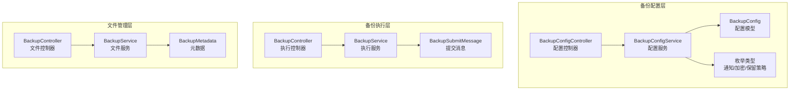
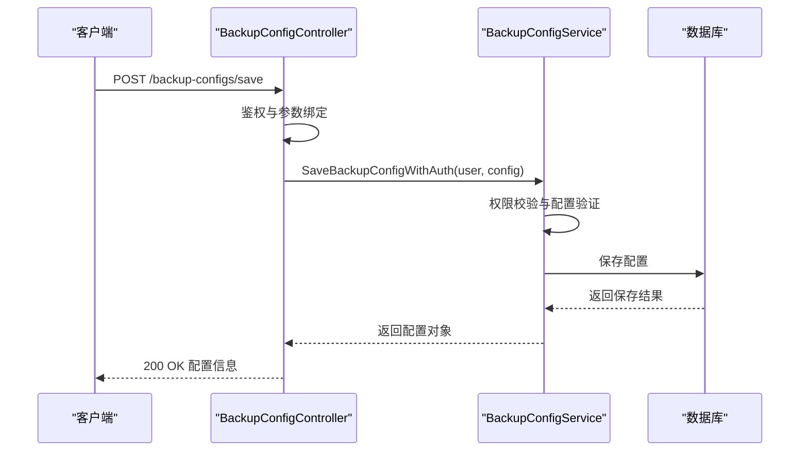
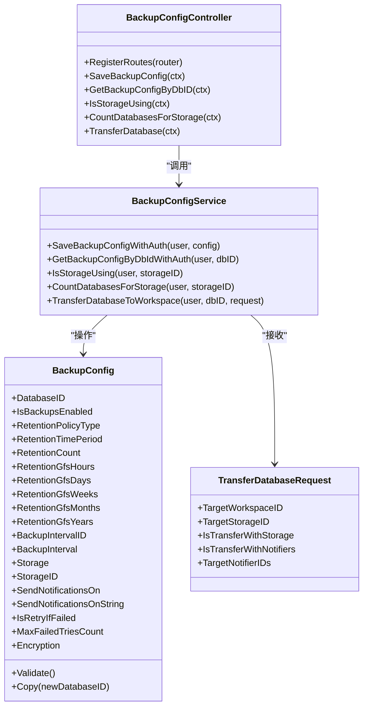
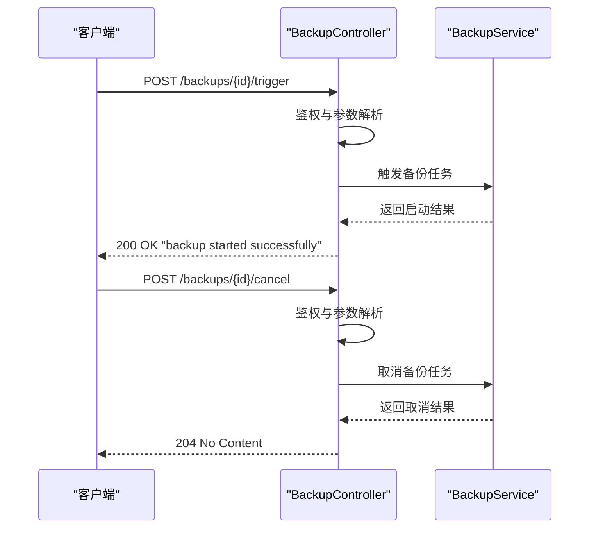
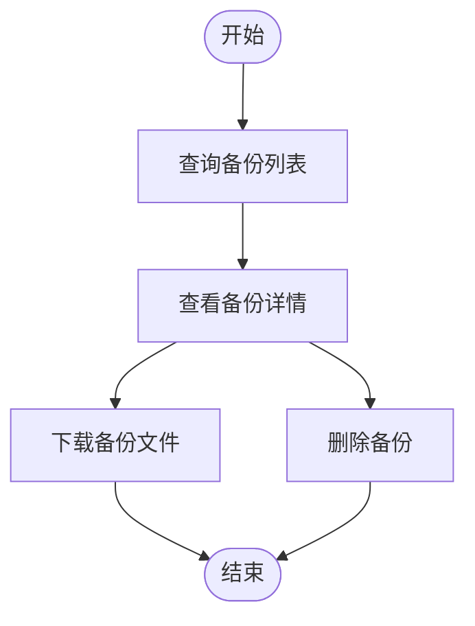
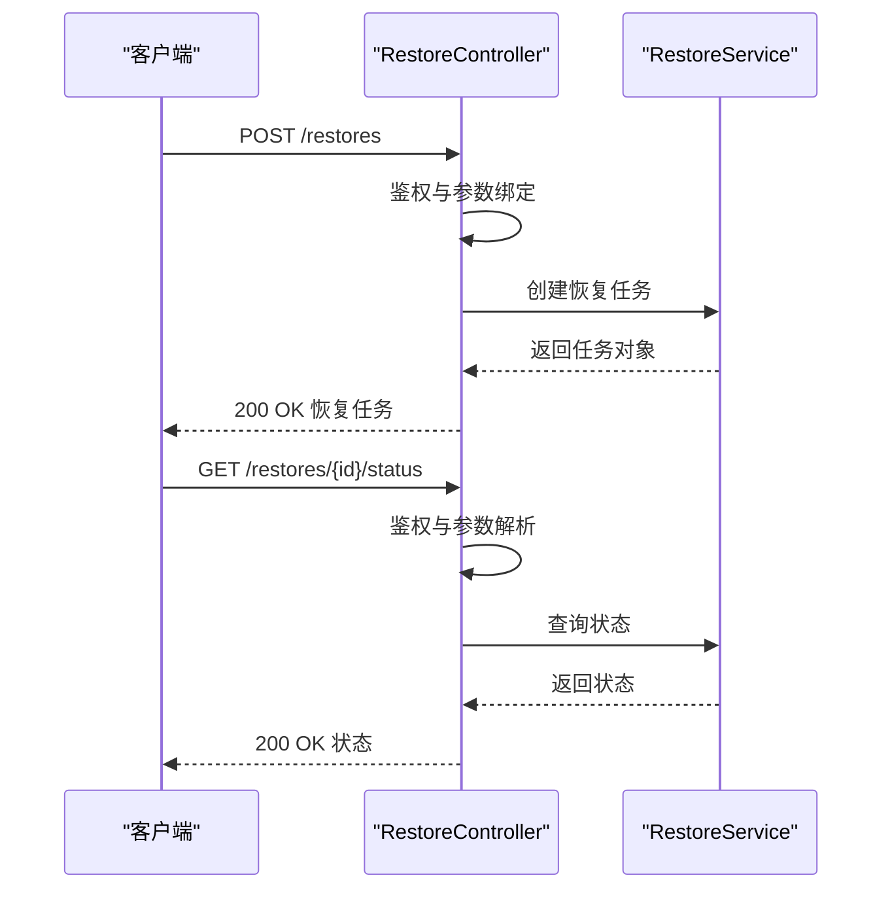
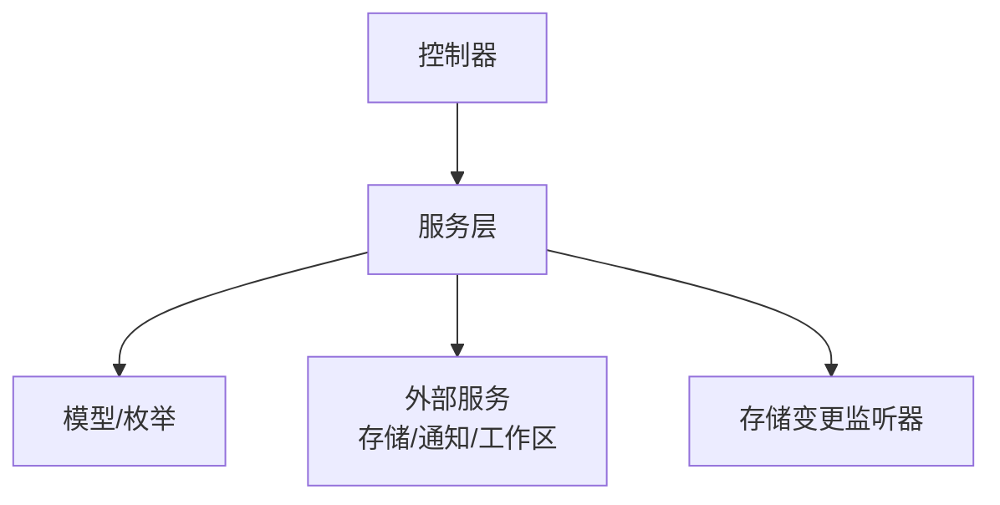

# 备份管理API

<cite>
**本文档引用的文件**
- [controller.go](file://backend/internal/features/backups/config/controller.go)
- [dto.go](file://backend/internal/features/backups/config/dto.go)
- [service.go](file://backend/internal/features/backups/config/service.go)
- [model.go](file://backend/internal/features/backups/config/model.go)
- [enums.go](file://backend/internal/features/backups/config/enums.go)
- [controller.go](file://backend/internal/features/backups/backups/controllers/controller.go)
- [dto.go](file://backend/internal/features/backups/backups/backuping/dto.go)
- [dto.go](file://backend/internal/features/backups/backups/common/dto.go)
</cite>

## 目录
1. [简介](#简介)
2. [项目结构](#项目结构)
3. [核心组件](#核心组件)
4. [架构概览](#架构概览)
5. [详细组件分析](#详细组件分析)
6. [依赖分析](#依赖分析)
7. [性能考虑](#性能考虑)
8. [故障排除指南](#故障排除指南)
9. [结论](#结论)

## 简介
本文件为 Databasus 备份管理模块的详细 API 文档，涵盖备份配置、备份执行、备份文件管理、备份恢复以及备份模板管理等核心功能。文档基于后端 Go 代码实现，提供接口定义、数据模型、错误处理和最佳实践指导。

## 项目结构
备份管理模块主要由以下层次组成：
- 配置层：备份配置的保存、查询、存储使用情况检查、数据库迁移等
- 执行层：备份任务的触发、取消、状态查询与进度监控
- 文件管理层：备份列表查询、备份详情查看、备份删除、备份下载
- 恢复层：恢复任务创建、状态监控与进度跟踪
- 数据模型层：备份配置、通知类型、加密类型、保留策略类型等枚举与模型

**图表来源**
- [controller.go:17-23](file://backend/internal/features/backups/config/controller.go#L17-L23)
- [service.go:17-25](file://backend/internal/features/backups/config/service.go#L17-L25)
- [model.go:16-44](file://backend/internal/features/backups/config/model.go#L16-L44)
- [enums.go:3-23](file://backend/internal/features/backups/config/enums.go#L3-L23)
- [controller.go:113-163](file://backend/internal/features/backups/backups/controllers/controller.go#L113-L163)
- [dto.go:25-34](file://backend/internal/features/backups/backups/backuping/dto.go#L25-L34)
- [dto.go:11-38](file://backend/internal/features/backups/backups/common/dto.go#L11-L38)

**章节来源**
- [controller.go:17-23](file://backend/internal/features/backups/config/controller.go#L17-L23)
- [service.go:17-25](file://backend/internal/features/backups/config/service.go#L17-L25)
- [model.go:16-44](file://backend/internal/features/backups/config/model.go#L16-L44)
- [enums.go:3-23](file://backend/internal/features/backups/config/enums.go#L3-L23)

## 核心组件
- 备份配置控制器：提供保存配置、按数据库查询配置、存储使用情况检查、数据库迁移等接口
- 备份配置服务：负责权限校验、配置验证、默认配置初始化、存储变更监听、工作区迁移等
- 备份配置模型：包含备份启用状态、保留策略、备份间隔、存储、通知类型、重试策略、加密设置等字段
- 枚举类型：备份通知类型（成功/失败）、加密类型（NONE/ENCRYPTED）、保留策略类型（时间周期/数量/GFS）

**章节来源**
- [controller.go:37-93](file://backend/internal/features/backups/config/controller.go#L37-L93)
- [service.go:44-109](file://backend/internal/features/backups/config/service.go#L44-L109)
- [model.go:83-155](file://backend/internal/features/backups/config/model.go#L83-L155)
- [enums.go:5-23](file://backend/internal/features/backups/config/enums.go#L5-L23)

## 架构概览
备份管理采用分层架构，控制器负责路由与鉴权，服务层处理业务逻辑与权限校验，模型层定义数据结构与校验规则。配置层与执行层相互独立，通过存储与通知服务进行协作。

**图表来源**
- [controller.go:37-60](file://backend/internal/features/backups/config/controller.go#L37-L60)
- [service.go:44-80](file://backend/internal/features/backups/config/service.go#L44-L80)

## 详细组件分析

### 备份配置API
- 接口：POST /backup-configs/save
  - 功能：保存或更新数据库的备份配置，支持设置加密类型（NONE 或 ENCRYPTED）
  - 请求体：BackupConfig 对象（包含加密字段）
  - 成功响应：返回保存后的 BackupConfig
  - 错误：400 参数无效，401 未认证，500 服务器错误
- 接口：GET /backup-configs/database/{id}
  - 功能：根据数据库 ID 获取备份配置，包含加密设置
  - 路径参数：id（数据库 UUID）
  - 成功响应：BackupConfig
  - 错误：400 无效数据库 ID，401 未认证，404 未找到配置
- 接口：GET /backup-configs/storage/{id}/is-using
  - 功能：检查某个存储是否被任何备份配置使用
  - 路径参数：id（存储 UUID）
  - 成功响应：{ "isUsing": boolean }
  - 错误：400 无效存储 ID，401 未认证，500 服务器错误
- 接口：GET /backup-configs/storage/{id}/databases-count
  - 功能：统计使用某存储的数据库数量
  - 路径参数：id（存储 UUID）
  - 成功响应：{ "count": number }
  - 错误：400 无效存储 ID，401 未认证，500 服务器错误
- 接口：POST /backup-configs/database/{id}/transfer
  - 功能：将数据库迁移到另一个工作区，可同时迁移存储或通知器
  - 请求体：TransferDatabaseRequest（目标工作区 ID、目标存储选项、目标通知器 ID 列表）
  - 成功响应：{ "message": "database transferred successfully" }
  - 错误：400 请求无效或迁移失败，401 未认证，403 权限不足

**图表来源**
- [controller.go:17-23](file://backend/internal/features/backups/config/controller.go#L17-L23)
- [service.go:44-297](file://backend/internal/features/backups/config/service.go#L44-L297)
- [model.go:16-130](file://backend/internal/features/backups/config/model.go#L16-L130)
- [dto.go:5-11](file://backend/internal/features/backups/config/dto.go#L5-L11)

**章节来源**
- [controller.go:37-209](file://backend/internal/features/backups/config/controller.go#L37-L209)
- [service.go:44-323](file://backend/internal/features/backups/config/service.go#L44-L323)
- [model.go:83-155](file://backend/internal/features/backups/config/model.go#L83-L155)
- [dto.go:5-11](file://backend/internal/features/backups/config/dto.go#L5-L11)

### 备份执行API
- 接口：POST /backups/{id}/trigger
  - 功能：手动触发指定备份任务
  - 路径参数：id（备份 UUID）
  - 成功响应：{ "message": "backup started successfully" }
  - 错误：400 无效备份 ID，401 未认证，500 服务器错误
- 接口：POST /backups/{id}/cancel
  - 功能：取消正在进行的备份任务
  - 路径参数：id（备份 UUID）
  - 成功响应：204 无内容
  - 错误：400 无效备份 ID，401 未认证，500 服务器错误
- 接口：GET /backups/{id}/status
  - 功能：查询备份任务状态
  - 路径参数：id（备份 UUID）
  - 成功响应：备份状态对象
  - 错误：400 无效备份 ID，401 未认证，404 未找到
- 接口：GET /backups/{id}/progress
  - 功能：监控备份进度
  - 路径参数：id（备份 UUID）
  - 成功响应：进度百分比或详细进度信息
  - 错误：400 无效备份 ID，401 未认证，404 未找到

**图表来源**
- [controller.go:113-163](file://backend/internal/features/backups/backups/controllers/controller.go#L113-L163)

**章节来源**
- [controller.go:113-163](file://backend/internal/features/backups/backups/controllers/controller.go#L113-L163)

### 备份文件管理API
- 接口：GET /backups
  - 功能：查询备份列表
  - 查询参数：分页、筛选条件
  - 成功响应：备份列表数组
  - 错误：401 未认证，500 服务器错误
- 接口：GET /backups/{id}
  - 功能：查看备份详情
  - 路径参数：id（备份 UUID）
  - 成功响应：备份详情对象
  - 错误：400 无效备份 ID，401 未认证，404 未找到
- 接口：DELETE /backups/{id}
  - 功能：删除备份
  - 路径参数：id（备份 UUID）
  - 成功响应：204 无内容
  - 错误：400 无效备份 ID，401 未认证，500 服务器错误
- 接口：GET /backups/{id}/download
  - 功能：下载备份文件
  - 路径参数：id（备份 UUID）
  - 成功响应：二进制文件流
  - 错误：400 无效备份 ID，401 未认证，404 未找到

**图表来源**
- [controller.go:113-163](file://backend/internal/features/backups/backups/controllers/controller.go#L113-L163)

**章节来源**
- [controller.go:113-163](file://backend/internal/features/backups/backups/controllers/controller.go#L113-L163)

### 备份恢复API
- 接口：POST /restores
  - 功能：创建恢复任务
  - 请求体：恢复配置（源备份 ID、目标数据库、恢复选项）
  - 成功响应：恢复任务对象
  - 错误：400 请求无效，401 未认证，500 服务器错误
- 接口：GET /restores/{id}/status
  - 功能：查询恢复任务状态
  - 路径参数：id（恢复 UUID）
  - 成功响应：恢复状态对象
  - 错误：400 无效恢复 ID，401 未认证，404 未找到
- 接口：GET /restores/{id}/progress
  - 功能：跟踪恢复进度
  - 路径参数：id（恢复 UUID）
  - 成功响应：进度百分比或详细进度信息
  - 错误：400 无效恢复 ID，401 未认证，404 未找到

**图表来源**
- [controller.go:113-163](file://backend/internal/features/backups/backups/controllers/controller.go#L113-L163)

**章节来源**
- [controller.go:113-163](file://backend/internal/features/backups/backups/controllers/controller.go#L113-L163)

### 备份模板管理API
- 接口：GET /backup-templates
  - 功能：获取可用的备份模板列表
  - 成功响应：模板数组
  - 错误：401 未认证，500 服务器错误
- 接口：POST /backup-templates
  - 功能：创建新模板
  - 请求体：模板配置
  - 成功响应：模板对象
  - 错误：400 请求无效，401 未认证，500 服务器错误
- 接口：PUT /backup-templates/{id}
  - 功能：更新模板
  - 路径参数：id（模板 UUID）
  - 请求体：模板配置
  - 成功响应：模板对象
  - 错误：400 无效模板 ID，401 未认证，500 服务器错误
- 接口：DELETE /backup-templates/{id}
  - 功能：删除模板
  - 路径参数：id（模板 UUID）
  - 成功响应：204 无内容
  - 错误：400 无效模板 ID，401 未认证，500 服务器错误

**章节来源**
- [controller.go:113-163](file://backend/internal/features/backups/backups/controllers/controller.go#L113-L163)

## 依赖分析
- 控制器依赖服务层，服务层依赖模型与枚举，以及存储、通知、工作区等外部服务
- 配置服务在保存配置时会触发存储变更监听器，确保备份存储变更前的清理与迁移
- 执行层通过消息结构与节点通信，实现备份任务的提交与完成通知

**图表来源**
- [service.go:27-31](file://backend/internal/features/backups/config/service.go#L27-L31)
- [model.go:16-44](file://backend/internal/features/backups/config/model.go#L16-L44)

**章节来源**
- [service.go:27-31](file://backend/internal/features/backups/config/service.go#L27-L31)
- [model.go:16-44](file://backend/internal/features/backups/config/model.go#L16-L44)

## 性能考虑
- 配置验证：在保存前进行严格的字段校验，避免无效配置导致后续执行失败
- 存储使用检查：提供存储使用情况查询，帮助用户合理分配存储资源
- 进度监控：通过状态与进度接口实时反馈执行情况，减少等待不确定性
- 并发控制：建议在服务层实现任务队列与并发限制，避免同时执行过多备份任务

## 故障排除指南
- 认证失败：确保请求头包含有效的访问令牌
- 参数错误：检查 UUID 格式、必填字段与枚举值范围
- 权限不足：确认当前用户对数据库与目标工作区具有管理权限
- 存储不匹配：云环境需启用加密，且存储必须属于同一工作区或为系统存储
- 迁移冲突：当存储被多个数据库共享时无法直接迁移，需先解除关联

**章节来源**
- [controller.go:37-209](file://backend/internal/features/backups/config/controller.go#L37-L209)
- [service.go:44-323](file://backend/internal/features/backups/config/service.go#L44-L323)
- [model.go:83-155](file://backend/internal/features/backups/config/model.go#L83-L155)

## 结论
Databasus 备份管理模块提供了完整的备份生命周期管理能力，从配置到执行再到文件管理与恢复，覆盖了企业级备份场景的核心需求。通过清晰的分层设计与完善的错误处理机制，用户可以安全、可靠地管理数据库备份与恢复任务。