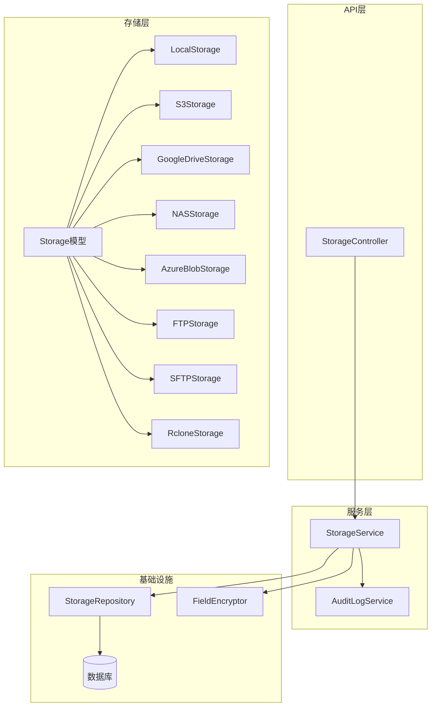
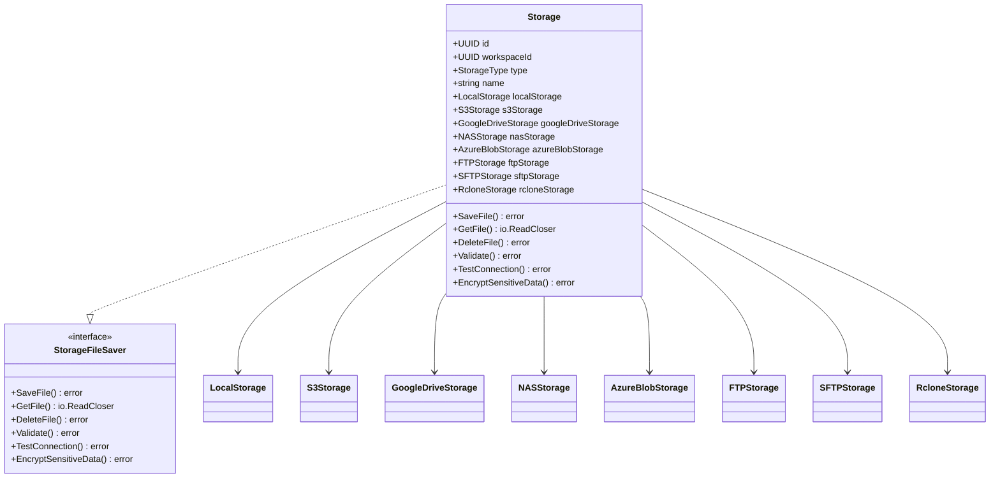
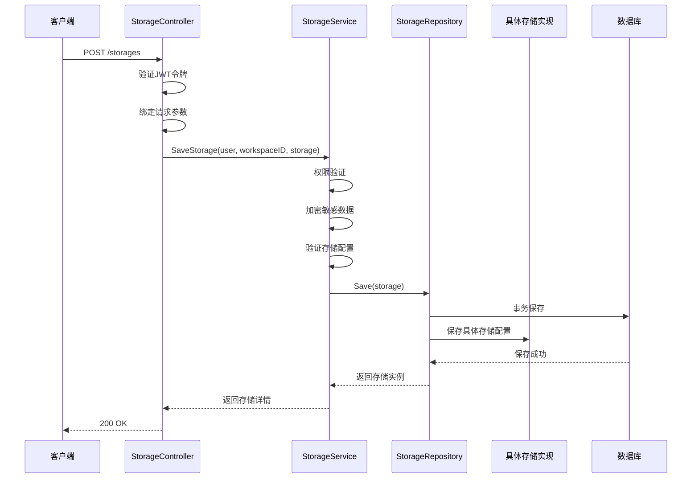
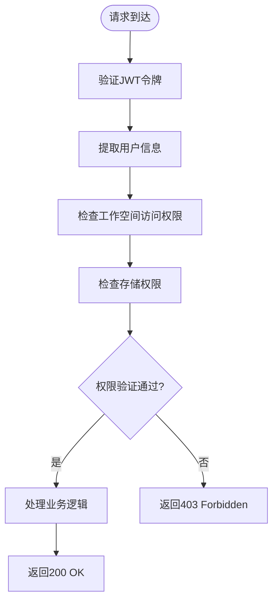
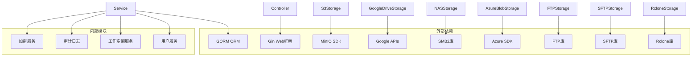
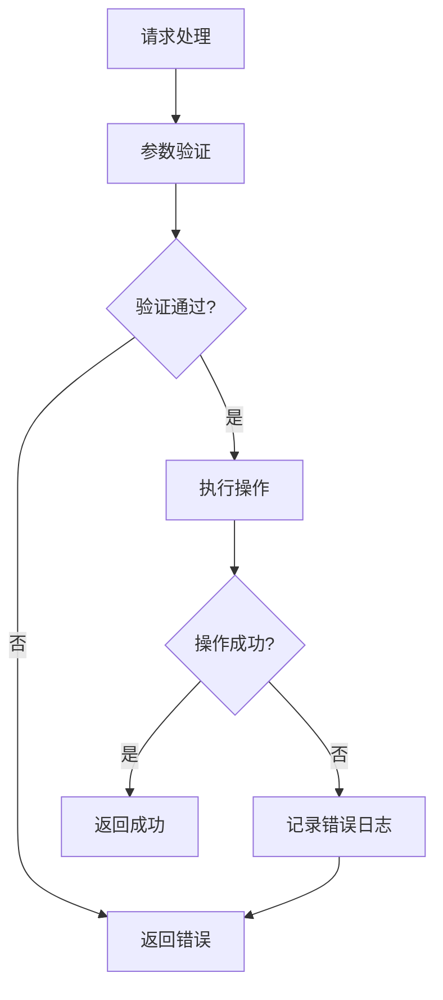

# 存储管理API

<cite>
**本文档引用的文件**
- [controller.go](file://backend/internal/features/storages/controller.go)
- [service.go](file://backend/internal/features/storages/service.go)
- [model.go](file://backend/internal/features/storages/model.go)
- [repository.go](file://backend/internal/features/storages/repository.go)
- [enums.go](file://backend/internal/features/storages/enums.go)
- [dto.go](file://backend/internal/features/storages/dto.go)
- [interfaces.go](file://backend/internal/features/storages/interfaces.go)
- [local/model.go](file://backend/internal/features/storages/models/local/model.go)
- [s3/model.go](file://backend/internal/features/storages/models/s3/model.go)
- [google_drive/model.go](file://backend/internal/features/storages/models/google_drive/model.go)
- [nas/model.go](file://backend/internal/features/storages/models/nas/model.go)
- [azure_blob/model.go](file://backend/internal/features/storages/models/azure_blob/model.go)
- [ftp/model.go](file://backend/internal/features/storages/models/ftp/model.go)
- [sftp/model.go](file://backend/internal/features/storages/models/sftp/model.go)
- [rclone/model.go](file://backend/internal/features/storages/models/rclone/model.go)
</cite>

## 目录
1. [简介](#简介)
2. [项目结构](#项目结构)
3. [核心组件](#核心组件)
4. [架构概览](#架构概览)
5. [详细组件分析](#详细组件分析)
6. [依赖关系分析](#依赖关系分析)
7. [性能考虑](#性能考虑)
8. [故障排除指南](#故障排除指南)
9. [结论](#结论)

## 简介

Databasus存储管理模块提供了统一的存储抽象层，支持多种存储后端包括本地存储、S3兼容对象存储、Azure Blob存储、Google Drive、FTP、SFTP、NAS共享存储和Rclone配置存储。该模块实现了完整的存储生命周期管理，包括配置、连接测试、文件操作、权限管理和审计日志记录。

## 项目结构

存储管理模块采用分层架构设计，主要包含以下层次：

**图表来源**
- [controller.go:19-27](file://backend/internal/features/storages/controller.go#L19-L27)
- [service.go:16-22](file://backend/internal/features/storages/service.go#L16-L22)
- [model.go:22-39](file://backend/internal/features/storages/model.go#L22-L39)

**章节来源**
- [controller.go:19-27](file://backend/internal/features/storages/controller.go#L19-L27)
- [service.go:16-22](file://backend/internal/features/storages/service.go#L16-L22)
- [model.go:22-39](file://backend/internal/features/storages/model.go#L22-L39)

## 核心组件

### 存储控制器 (StorageController)

存储控制器负责处理所有存储相关的HTTP请求，提供RESTful API接口：

- **存储配置管理**: 创建、更新、删除存储配置
- **存储查询**: 获取单个存储详情和存储列表
- **连接测试**: 验证存储连接性和权限
- **工作空间转移**: 在工作空间间转移存储所有权

### 存储服务 (StorageService)

存储服务实现业务逻辑，包含：

- **权限验证**: 基于用户角色和工作空间的权限检查
- **数据加密**: 敏感配置信息的加密存储
- **连接测试**: 统一的连接验证机制
- **审计日志**: 所有存储操作的审计记录

### 存储模型 (Storage)

统一的存储抽象模型，支持多态存储类型：

**图表来源**
- [model.go:22-89](file://backend/internal/features/storages/model.go#L22-L89)
- [interfaces.go:13-33](file://backend/internal/features/storages/interfaces.go#L13-L33)

**章节来源**
- [controller.go:29-71](file://backend/internal/features/storages/controller.go#L29-L71)
- [service.go:54-147](file://backend/internal/features/storages/service.go#L54-L147)
- [model.go:22-185](file://backend/internal/features/storages/model.go#L22-L185)

## 架构概览

存储管理模块采用分层架构，确保关注点分离和可扩展性：

**图表来源**
- [controller.go:42-71](file://backend/internal/features/storages/controller.go#L42-L71)
- [service.go:54-147](file://backend/internal/features/storages/service.go#L54-L147)
- [repository.go:12-131](file://backend/internal/features/storages/repository.go#L12-L131)

## 详细组件分析

### 存储类型与配置参数

#### 本地存储 (LOCAL)
本地存储使用服务器本地文件系统作为备份存储：

**配置参数**:
- `storageId`: 存储唯一标识符
- 无额外配置参数（使用服务器默认数据目录）

**特性**:
- 自动目录创建和清理
- 跨设备移动回退机制
- 内存友好的分块写入

#### S3兼容存储 (S3)
支持Amazon S3、MinIO、Ceph等S3兼容存储：

**配置参数**:
- `s3Bucket`: 存储桶名称
- `s3Region`: 区域标识
- `s3AccessKey`: 访问密钥
- `s3SecretKey`: 秘密密钥
- `s3Endpoint`: 自定义端点URL
- `s3Prefix`: 对象前缀路径
- `s3UseVirtualHostedStyle`: 使用虚拟主机样式
- `skipTLSVerify`: 跳过TLS证书验证
- `s3StorageClass`: 存储类别

**特性**:
- 分片上传支持
- 多部分上传恢复
- MD5校验和验证
- 自适应超时配置

#### Google云端硬盘 (GOOGLE_DRIVE)
基于Google Drive API的云存储：

**配置参数**:
- `clientId`: Google应用客户端ID
- `clientSecret`: 客户端密钥
- `tokenJson`: OAuth2令牌JSON

**特性**:
- 自动OAuth2令牌刷新
- 断线重连机制
- 分片上传支持
- 文件夹自动创建

#### NAS网络存储 (NAS)
通过SMB/CIFS协议访问网络附加存储：

**配置参数**:
- `host`: NAS主机地址
- `port`: 端口号（默认445）
- `share`: 共享名称
- `username`: 用户名
- `password`: 密码
- `useSsl`: 启用SSL
- `domain`: 域名
- `path`: 相对路径

**特性**:
- SMB2协议支持
- 自动会话管理
- 目录层级创建
- 资源自动清理

#### Azure Blob存储 (AZURE_BLOB)
Microsoft Azure Blob存储：

**配置参数**:
- `authMethod`: 认证方式（CONNECTION_STRING或ACCOUNT_KEY）
- `connectionString`: 连接字符串
- `accountName`: 存储账户名
- `accountKey`: 账户密钥
- `containerName`: 容器名称
- `endpoint`: 自定义端点
- `prefix`: Blob前缀

**认证方式**:
- **连接字符串模式**: 提供完整连接字符串
- **账户密钥模式**: 分别提供账户名和密钥

#### FTP存储 (FTP)
传统文件传输协议：

**配置参数**:
- `host`: FTP服务器地址
- `port`: 端口号（默认21）
- `username`: 用户名
- `password`: 密码
- `path`: 远程路径
- `useSsl`: 启用FTPS
- `skipTlsVerify`: 跳过TLS验证

**特性**:
- 支持显式FTPS
- 自动目录创建
- 分块上传支持

#### SFTP存储 (SFTP)
安全文件传输协议：

**配置参数**:
- `host`: SFTP服务器地址
- `port`: 端口号（默认22）
- `username`: 用户名
- `password`: 密码
- `privateKey`: 私钥内容
- `path`: 远程路径
- `skipHostKeyVerify`: 跳过主机密钥验证

**认证方式**:
- **密码认证**: 使用用户名+密码
- **密钥认证**: 使用私钥进行身份验证

#### Rclone存储 (RCLONE)
基于Rclone的通用存储适配器：

**配置参数**:
- `configContent`: Rclone配置内容（包含一个远程配置）
- `remotePath`: 远程路径前缀

**特性**:
- 支持所有Rclone后端
- 动态配置加载
- 并发安全的配置管理

### API接口规范

#### 存储配置API

**创建存储配置**
- 方法: POST `/storages`
- 请求体: Storage对象（包含workspaceId）
- 响应: 创建的Storage对象

**更新存储配置**
- 方法: PUT `/storages/{id}`
- 路径参数: id - 存储ID
- 请求体: Storage对象
- 响应: 更新后的Storage对象

**获取存储配置**
- 方法: GET `/storages/{id}`
- 路径参数: id - 存储ID
- 响应: Storage对象

**删除存储配置**
- 方法: DELETE `/storages/{id}`
- 路径参数: id - 存储ID
- 响应: 成功消息

**获取存储列表**
- 方法: GET `/storages`
- 查询参数: workspace_id - 工作空间ID
- 响应: Storage对象数组

#### 连接测试API

**测试存储连接**
- 方法: POST `/storages/{id}/test`
- 路径参数: id - 存储ID
- 响应: 测试结果消息

**直接测试存储连接**
- 方法: POST `/storages/direct-test`
- 请求体: Storage对象（包含workspaceId）
- 响应: 测试结果消息

#### 文件管理API

**上传文件**
- 方法: POST `/backups/{backupId}/files`
- 路径参数: backupId - 备份ID
- 请求体: 文件流
- 响应: 上传状态

**下载文件**
- 方法: GET `/backups/{backupId}/files/{fileName}`
- 路径参数: backupId - 备份ID, fileName - 文件名
- 响应: 文件流

**删除文件**
- 方法: DELETE `/backups/{backupId}/files/{fileName}`
- 路径参数: backupId - 备份ID, fileName - 文件名
- 响应: 删除状态

### 权限管理

存储管理模块实施严格的权限控制：

**权限规则**:
- **存储管理**: 需要工作空间管理权限
- **存储查看**: 需要工作空间访问权限
- **连接测试**: 需要存储查看权限
- **系统存储**: 仅管理员可管理

**章节来源**
- [local/model.go:30-197](file://backend/internal/features/storages/models/local/model.go#L30-L197)
- [s3/model.go:38-480](file://backend/internal/features/storages/models/s3/model.go#L38-L480)
- [google_drive/model.go:38-690](file://backend/internal/features/storages/models/google_drive/model.go#L38-L690)
- [nas/model.go:30-533](file://backend/internal/features/storages/models/nas/model.go#L30-L533)
- [azure_blob/model.go:53-420](file://backend/internal/features/storages/models/azure_blob/model.go#L53-L420)
- [ftp/model.go:26-374](file://backend/internal/features/storages/models/ftp/model.go#L26-L374)
- [sftp/model.go:26-431](file://backend/internal/features/storages/models/sftp/model.go#L26-L431)
- [rclone/model.go:30-324](file://backend/internal/features/storages/models/rclone/model.go#L30-L324)

## 依赖关系分析

存储管理模块的依赖关系清晰且职责分离：

**图表来源**
- [controller.go:3-12](file://backend/internal/features/storages/controller.go#L3-L12)
- [service.go:3-14](file://backend/internal/features/storages/service.go#L3-L14)
- [s3/model.go:18-23](file://backend/internal/features/storages/models/s3/model.go#L18-L23)
- [google_drive/model.go:15-23](file://backend/internal/features/storages/models/google_drive/model.go#L15-L23)

**章节来源**
- [repository.go:3-8](file://backend/internal/features/storages/repository.go#L3-L8)
- [service.go:3-22](file://backend/internal/features/storages/service.go#L3-L22)

## 性能考虑

### 存储后端性能特性

| 存储类型 | 上传模式 | 分片大小 | 最大并发 | 适用场景 |
|---------|----------|----------|----------|----------|
| 本地存储 | 直接写入 | 8MB | 单线程 | 本地服务器、高带宽网络 |
| S3兼容 | 分片上传 | 16MB | 多线程 | 云存储、跨地域备份 |
| Google Drive | 分片上传 | 16MB | 多线程 | 个人/小团队、高可用性 |
| NAS网络存储 | 流式传输 | 16MB | 多线程 | 企业内网、共享存储 |
| Azure Blob | 分片上传 | 16MB | 多线程 | 企业级、混合云 |
| FTP | 流式传输 | 16MB | 单线程 | 传统环境、简单部署 |
| SFTP | 流式传输 | 大文件 | 单线程 | 安全要求高的环境 |
| Rclone | 代理模式 | 可配置 | 取决于后端 | 多后端统一管理 |

### 优化建议

**网络优化**:
- 合理设置超时时间（连接超时、读写超时）
- 启用适当的缓冲区大小
- 实现断线重试机制

**存储优化**:
- 使用分片上传提高大文件传输效率
- 实现进度报告和取消机制
- 优化磁盘I/O操作

**安全性优化**:
- 敏感信息加密存储
- 最小权限原则
- 审计日志记录

## 故障排除指南

### 常见问题诊断

**连接失败**:
1. 检查网络连通性
2. 验证凭据正确性
3. 确认防火墙设置
4. 检查SSL/TLS配置

**权限错误**:
1. 确认用户具有相应的工作空间权限
2. 检查存储类型是否受支持
3. 验证系统存储限制

**性能问题**:
1. 监控网络带宽使用
2. 检查磁盘空间和I/O性能
3. 优化分片大小配置

### 错误处理流程

**章节来源**
- [service.go:249-280](file://backend/internal/features/storages/service.go#L249-L280)
- [local/model.go:175-190](file://backend/internal/features/storages/models/local/model.go#L175-L190)
- [s3/model.go:265-322](file://backend/internal/features/storages/models/s3/model.go#L265-L322)

## 结论

Databasus存储管理模块提供了功能完整、安全可靠的多存储后端解决方案。通过统一的抽象层和严格的权限控制，该模块能够满足从个人用户到企业级用户的多样化存储需求。模块的设计充分考虑了性能、安全性和可维护性，为数据库备份和恢复提供了坚实的基础。

未来可以考虑的功能增强包括：存储压缩支持、增量备份、存储配额管理、存储迁移工具等，以进一步提升用户体验和管理效率。