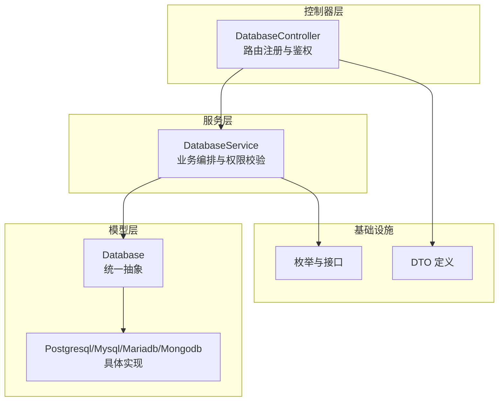
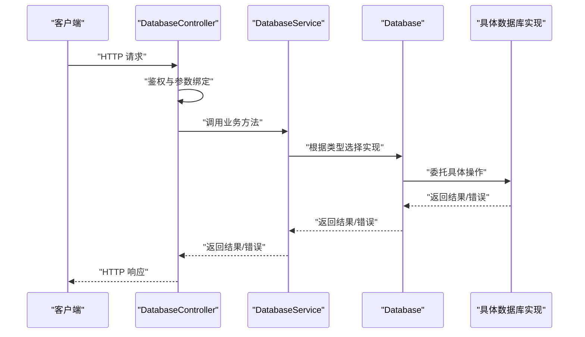
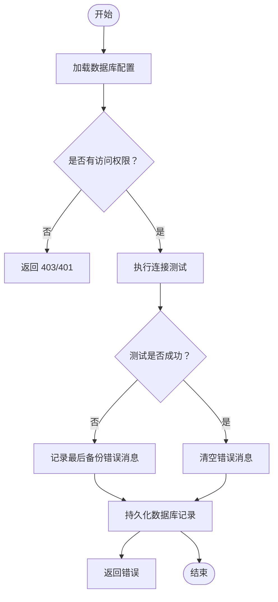
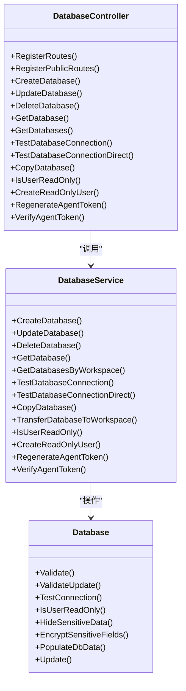

# 数据库管理API

<cite>
**本文引用的文件**
- [backend/internal/features/databases/controller.go](file://backend/internal/features/databases/controller.go)
- [backend/internal/features/databases/service.go](file://backend/internal/features/databases/service.go)
- [backend/internal/features/databases/model.go](file://backend/internal/features/databases/model.go)
- [backend/internal/features/databases/enums.go](file://backend/internal/features/databases/enums.go)
- [backend/internal/features/databases/interfaces.go](file://backend/internal/features/databases/interfaces.go)
- [backend/internal/features/databases/dto.go](file://backend/internal/features/databases/dto.go)
</cite>

## 目录
1. [简介](#简介)
2. [项目结构](#项目结构)
3. [核心组件](#核心组件)
4. [架构总览](#架构总览)
5. [详细组件分析](#详细组件分析)
6. [依赖关系分析](#依赖关系分析)
7. [性能考量](#性能考量)
8. [故障排查指南](#故障排查指南)
9. [结论](#结论)
10. [附录](#附录)

## 简介
本文件为 Databasus 数据库管理模块的详细 API 文档，覆盖数据库连接配置、健康检查、信息查询、配置更新、删除与转移、只读用户管理等能力。文档同时说明不同数据库类型（PostgreSQL、MySQL、MariaDB、MongoDB）在 API 层的共性与差异，并提供请求/响应示例与错误码说明。

## 项目结构
数据库管理模块位于后端工程的 features 子系统中，采用按功能域分层组织：
- 控制器层：定义 HTTP 路由与请求入口，负责鉴权与参数绑定
- 服务层：封装业务逻辑，协调工作区权限、审计日志、监听器与仓库访问
- 模型层：统一的 Database 抽象与各数据库类型的具体实现
- 枚举与接口：定义数据库类型、健康状态与通用接口契约
- DTO：用于只读用户与令牌校验等场景的请求/响应载体

图表来源
- [backend/internal/features/databases/controller.go:20-38](file://backend/internal/features/databases/controller.go#L20-L38)
- [backend/internal/features/databases/service.go:26-38](file://backend/internal/features/databases/service.go#L26-L38)
- [backend/internal/features/databases/model.go:19-44](file://backend/internal/features/databases/model.go#L19-L44)
- [backend/internal/features/databases/enums.go:3-17](file://backend/internal/features/databases/enums.go#L3-L17)
- [backend/internal/features/databases/dto.go:3-15](file://backend/internal/features/databases/dto.go#L3-L15)

章节来源
- [backend/internal/features/databases/controller.go:20-38](file://backend/internal/features/databases/controller.go#L20-L38)
- [backend/internal/features/databases/service.go:26-38](file://backend/internal/features/databases/service.go#L26-L38)
- [backend/internal/features/databases/model.go:19-44](file://backend/internal/features/databases/model.go#L19-L44)
- [backend/internal/features/databases/enums.go:3-17](file://backend/internal/features/databases/enums.go#L3-L17)
- [backend/internal/features/databases/dto.go:3-15](file://backend/internal/features/databases/dto.go#L3-L15)

## 核心组件
- 数据库控制器：负责注册所有数据库管理相关的 HTTP 路由，执行用户鉴权与参数绑定，并调用服务层完成业务处理。
- 数据库服务：实现权限控制、连接测试、只读用户检测与创建、代理令牌生成与校验、数据库复制与转移等核心业务。
- 统一数据库模型：通过嵌套各数据库类型的配置对象，实现多态操作；提供敏感字段加密、自动填充与隐藏、连接测试与只读检测等方法。
- 枚举与接口：定义数据库类型与健康状态，以及数据库验证、连接测试、数据隐藏等接口契约。
- DTO：定义只读用户返回体与代理令牌校验请求体。

章节来源
- [backend/internal/features/databases/controller.go:14-38](file://backend/internal/features/databases/controller.go#L14-L38)
- [backend/internal/features/databases/service.go:26-38](file://backend/internal/features/databases/service.go#L26-L38)
- [backend/internal/features/databases/model.go:19-44](file://backend/internal/features/databases/model.go#L19-L44)
- [backend/internal/features/databases/enums.go:3-17](file://backend/internal/features/databases/enums.go#L3-L17)
- [backend/internal/features/databases/interfaces.go:11-35](file://backend/internal/features/databases/interfaces.go#L11-L35)
- [backend/internal/features/databases/dto.go:3-15](file://backend/internal/features/databases/dto.go#L3-L15)

## 架构总览
下图展示数据库管理 API 的端到端交互流程：客户端发起请求 → 控制器进行鉴权与参数绑定 → 服务层执行权限校验与业务编排 → 模型层根据类型调用具体实现 → 返回结果或错误。

图表来源
- [backend/internal/features/databases/controller.go:52-77](file://backend/internal/features/databases/controller.go#L52-L77)
- [backend/internal/features/databases/service.go:69-116](file://backend/internal/features/databases/service.go#L69-L116)
- [backend/internal/features/databases/model.go:96-101](file://backend/internal/features/databases/model.go#L96-L101)

## 详细组件分析

### 数据库连接配置 API
- 功能概述
  - 创建数据库：支持在指定工作区中创建新的数据库配置，自动进行参数校验、敏感字段加密与自动填充。
  - 更新数据库：对现有数据库配置进行更新，禁止更改数据库类型，确保备份结构一致性。
  - 连接测试（已保存配置）：对已保存的数据库配置进行连接测试，记录最近一次备份错误信息。
  - 连接测试（直接测试）：对临时传入的数据库配置进行连接测试，无需持久化。
  - 复制数据库：基于现有数据库配置创建副本，保留通知器与健康状态等元信息。
  - 代理令牌校验：校验给定代理令牌是否有效，供代理侧使用。

- 请求/响应要点
  - 创建与更新均需携带工作区标识与完整数据库配置对象。
  - 连接测试成功返回“连接成功”，失败返回错误信息。
  - 复制数据库返回新创建的数据库对象。
  - 代理令牌校验返回“令牌有效”或“无效令牌”。

- 错误码说明
  - 400：参数校验失败、数据库类型不允许变更、连接失败、工作区不匹配等。
  - 401：未认证或会话无效。
  - 403：权限不足（非工作区管理员/成员）。
  - 500：服务器内部错误。

章节来源
- [backend/internal/features/databases/controller.go:40-110](file://backend/internal/features/databases/controller.go#L40-L110)
- [backend/internal/features/databases/controller.go:214-274](file://backend/internal/features/databases/controller.go#L214-L274)
- [backend/internal/features/databases/controller.go:342-373](file://backend/internal/features/databases/controller.go#L342-L373)
- [backend/internal/features/databases/controller.go:481-504](file://backend/internal/features/databases/controller.go#L481-L504)
- [backend/internal/features/databases/service.go:69-116](file://backend/internal/features/databases/service.go#L69-L116)
- [backend/internal/features/databases/service.go:118-197](file://backend/internal/features/databases/service.go#L118-L197)
- [backend/internal/features/databases/service.go:313-349](file://backend/internal/features/databases/service.go#L313-L349)
- [backend/internal/features/databases/service.go:351-379](file://backend/internal/features/databases/service.go#L351-L379)
- [backend/internal/features/databases/service.go:422-542](file://backend/internal/features/databases/service.go#L422-L542)
- [backend/internal/features/databases/service.go:657-666](file://backend/internal/features/databases/service.go#L657-L666)

### 数据库健康检查 API
- 功能概述
  - 连接测试：对已保存数据库配置进行连接测试，若失败则记录最后一次备份错误消息，成功则清空错误消息并持久化。
  - 健康状态：服务层提供设置健康状态的方法，可用于外部监控系统集成。

- 流程图

图表来源
- [backend/internal/features/databases/service.go:313-349](file://backend/internal/features/databases/service.go#L313-L349)

章节来源
- [backend/internal/features/databases/service.go:313-349](file://backend/internal/features/databases/service.go#L313-L349)

### 数据库信息查询 API
- 功能概述
  - 获取单个数据库：按 ID 查询数据库配置，自动隐藏敏感字段。
  - 获取工作区数据库列表：按工作区 ID 查询该工作区内所有数据库，隐藏敏感字段。
  - 代理令牌校验：公开路由，校验任意数据库代理令牌有效性。

- 请求/响应要点
  - 单个查询与列表查询均返回隐藏敏感字段后的数据库对象。
  - 代理令牌校验为公开接口，无需认证。

章节来源
- [backend/internal/features/databases/controller.go:143-173](file://backend/internal/features/databases/controller.go#L143-L173)
- [backend/internal/features/databases/controller.go:175-212](file://backend/internal/features/databases/controller.go#L175-L212)
- [backend/internal/features/databases/controller.go:481-504](file://backend/internal/features/databases/controller.go#L481-L504)
- [backend/internal/features/databases/service.go:235-282](file://backend/internal/features/databases/service.go#L235-L282)

### 数据库配置更新 API
- 功能概述
  - 更新数据库配置：支持更新名称、类型（不可变）、通知器、连接参数等；更新前进行权限校验与参数校验。
  - 敏感字段加密：更新时对密码等敏感字段进行加密存储。
  - 自动填充：根据连接信息自动推断数据库版本、模式等信息。

- 关键约束
  - 数据库类型不可变更；如需变更，请重新创建数据库。
  - 通知器必须属于同一工作区。

章节来源
- [backend/internal/features/databases/service.go:118-197](file://backend/internal/features/databases/service.go#L118-L197)
- [backend/internal/features/databases/model.go:46-94](file://backend/internal/features/databases/model.go#L46-L94)
- [backend/internal/features/databases/model.go:126-159](file://backend/internal/features/databases/model.go#L126-L159)

### 数据库删除与转移 API
- 功能概述
  - 删除数据库：执行删除前触发移除监听器，记录审计日志。
  - 工作区转移：将数据库从源工作区转移到目标工作区，记录审计日志。

- 注意事项
  - 删除前会触发监听器回调，可在此处执行清理或告警。
  - 转移时会校验工作区存在性并记录审计日志。

章节来源
- [backend/internal/features/databases/service.go:199-233](file://backend/internal/features/databases/service.go#L199-L233)
- [backend/internal/features/databases/service.go:544-579](file://backend/internal/features/databases/service.go#L544-L579)

### 只读用户管理 API
- 功能概述
  - 检查当前数据库用户是否仅具有只读权限（SELECT）。
  - 为数据库创建具备只读权限的新用户（当前仅 PostgreSQL 支持）。

- 请求/响应要点
  - 检查接口返回布尔值与权限列表。
  - 创建只读用户接口返回新用户名与密码（一次性可见）。

- 错误码说明
  - 400：参数校验失败、数据库类型不支持只读检测或创建。
  - 401：未认证。
  - 403：权限不足。

章节来源
- [backend/internal/features/databases/controller.go:375-408](file://backend/internal/features/databases/controller.go#L375-L408)
- [backend/internal/features/databases/controller.go:410-446](file://backend/internal/features/databases/controller.go#L410-L446)
- [backend/internal/features/databases/service.go:695-754](file://backend/internal/features/databases/service.go#L695-L754)
- [backend/internal/features/databases/service.go:756-800](file://backend/internal/features/databases/service.go#L756-L800)
- [backend/internal/features/databases/dto.go:3-11](file://backend/internal/features/databases/dto.go#L3-L11)

### 代理令牌 API
- 功能概述
  - 重新生成代理令牌：为指定数据库生成新的代理令牌，仅返回明文一次，后台仅保存哈希。
  - 校验代理令牌：校验令牌是否有效，用于代理侧认证。

- 安全说明
  - 明文令牌仅在生成时返回，后续无法再次获取。
  - 校验过程对令牌进行哈希比对。

章节来源
- [backend/internal/features/databases/controller.go:448-479](file://backend/internal/features/databases/controller.go#L448-L479)
- [backend/internal/features/databases/controller.go:481-504](file://backend/internal/features/databases/controller.go#L481-L504)
- [backend/internal/features/databases/service.go:614-666](file://backend/internal/features/databases/service.go#L614-L666)

### 数据库类型特定差异与兼容性
- 类型枚举
  - 支持类型：POSTGRES、MYSQL、MARIADB、MONGODB。
  - 健康状态：AVAILABLE、UNAVAILABLE。

- 兼容性与限制
  - 只读用户创建目前仅支持 PostgreSQL。
  - 连接测试与只读检测按类型分发至具体实现。
  - 数据库类型一旦确定不可变更，避免备份结构不一致。

章节来源
- [backend/internal/features/databases/enums.go:3-17](file://backend/internal/features/databases/enums.go#L3-L17)
- [backend/internal/features/databases/model.go:103-120](file://backend/internal/features/databases/model.go#L103-L120)
- [backend/internal/features/databases/model.go:186-190](file://backend/internal/features/databases/model.go#L186-L190)

## 依赖关系分析
- 控制器依赖服务层：控制器仅负责路由与鉴权，业务逻辑集中在服务层。
- 服务层依赖模型层：通过统一的 Database 抽象与具体数据库实现交互。
- 模型层依赖各数据库类型实现：通过嵌套结构实现多态操作。
- 接口契约：DatabaseValidator、DatabaseConnector、监听器接口保证扩展性与解耦。

图表来源
- [backend/internal/features/databases/controller.go:14-38](file://backend/internal/features/databases/controller.go#L14-L38)
- [backend/internal/features/databases/service.go:26-38](file://backend/internal/features/databases/service.go#L26-L38)
- [backend/internal/features/databases/model.go:19-44](file://backend/internal/features/databases/model.go#L19-L44)

章节来源
- [backend/internal/features/databases/controller.go:14-38](file://backend/internal/features/databases/controller.go#L14-L38)
- [backend/internal/features/databases/service.go:26-38](file://backend/internal/features/databases/service.go#L26-L38)
- [backend/internal/features/databases/model.go:19-44](file://backend/internal/features/databases/model.go#L19-L44)

## 性能考量
- 连接测试超时：只读用户检测默认使用 15 秒超时，避免长时间阻塞。
- 敏感字段加密：在保存前对密码等字段进行加密，降低泄露风险。
- 审计日志：关键操作（创建、更新、删除、令牌生成、转移）均写入审计日志，便于追踪与合规。

## 故障排查指南
- 常见错误与定位
  - 400 参数错误：检查请求体字段是否完整、工作区 ID 是否正确、数据库类型是否允许变更。
  - 401/403 权限错误：确认用户身份与工作区权限，确保为管理员或具备相应角色。
  - 连接测试失败：查看最后一次备份错误消息字段，结合数据库日志定位问题。
- 建议排查步骤
  - 使用“直接连接测试”接口快速验证配置正确性。
  - 检查代理令牌是否已生成且未过期。
  - 对于只读用户创建失败，确认数据库类型为 PostgreSQL。

章节来源
- [backend/internal/features/databases/service.go:313-349](file://backend/internal/features/databases/service.go#L313-L349)
- [backend/internal/features/databases/service.go:614-666](file://backend/internal/features/databases/service.go#L614-L666)
- [backend/internal/features/databases/service.go:695-754](file://backend/internal/features/databases/service.go#L695-L754)

## 结论
本 API 文档系统性地梳理了 Databasus 数据库管理模块的核心能力，涵盖配置、健康检查、查询、更新、删除与转移、只读用户管理及代理令牌校验。通过统一的 Database 抽象与类型分发机制，实现了对 PostgreSQL、MySQL、MariaDB、MongoDB 的一致化管理。建议在生产环境中配合审计日志与严格的权限控制，确保安全与可追溯性。

## 附录
- 请求/响应示例（路径）
  - 创建数据库：[backend/internal/features/databases/controller.go:52-77](file://backend/internal/features/databases/controller.go#L52-L77)
  - 更新数据库：[backend/internal/features/databases/controller.go:91-110](file://backend/internal/features/databases/controller.go#L91-L110)
  - 删除数据库：[backend/internal/features/databases/controller.go:122-141](file://backend/internal/features/databases/controller.go#L122-L141)
  - 获取数据库：[backend/internal/features/databases/controller.go:153-173](file://backend/internal/features/databases/controller.go#L153-L173)
  - 获取工作区数据库列表：[backend/internal/features/databases/controller.go:186-212](file://backend/internal/features/databases/controller.go#L186-L212)
  - 连接测试（已保存配置）：[backend/internal/features/databases/controller.go:224-243](file://backend/internal/features/databases/controller.go#L224-L243)
  - 连接测试（直接测试）：[backend/internal/features/databases/controller.go:255-274](file://backend/internal/features/databases/controller.go#L255-L274)
  - 复制数据库：[backend/internal/features/databases/controller.go:353-373](file://backend/internal/features/databases/controller.go#L353-L373)
  - 只读用户检查：[backend/internal/features/databases/controller.go:388-408](file://backend/internal/features/databases/controller.go#L388-L408)
  - 只读用户创建：[backend/internal/features/databases/controller.go:423-446](file://backend/internal/features/databases/controller.go#L423-L446)
  - 重新生成代理令牌：[backend/internal/features/databases/controller.go:459-479](file://backend/internal/features/databases/controller.go#L459-L479)
  - 代理令牌校验：[backend/internal/features/databases/controller.go:491-504](file://backend/internal/features/databases/controller.go#L491-L504)