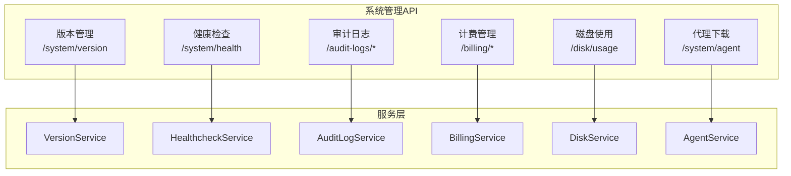
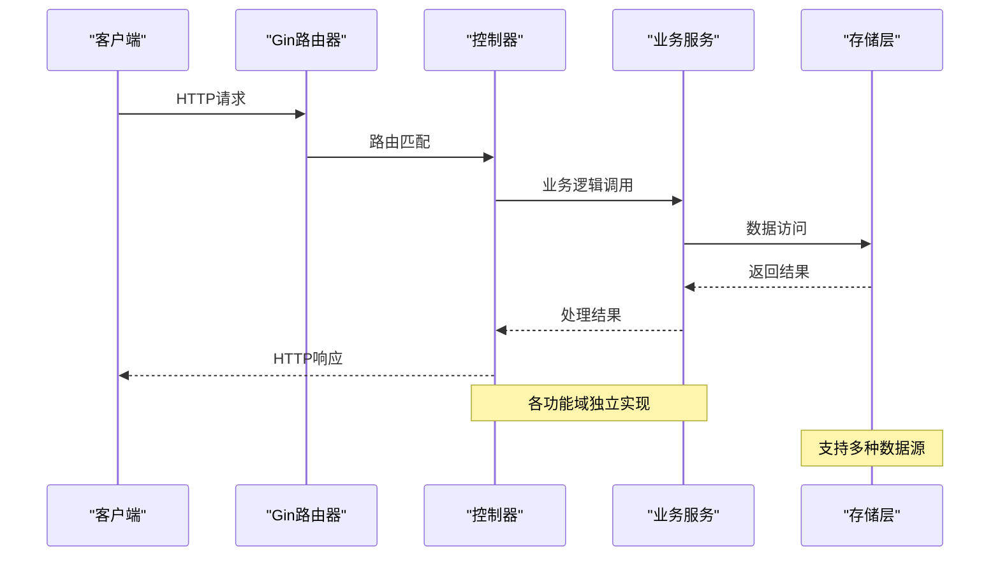
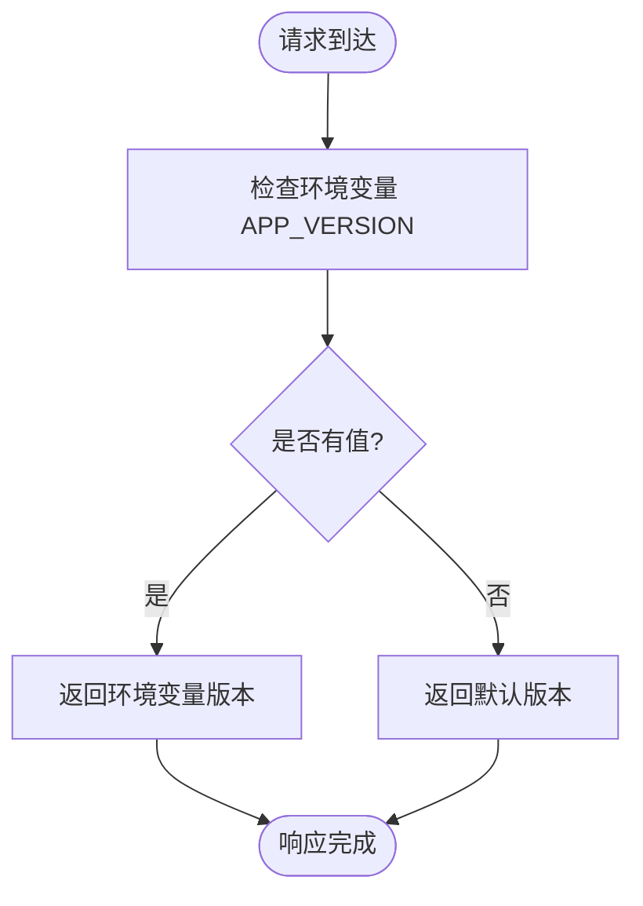
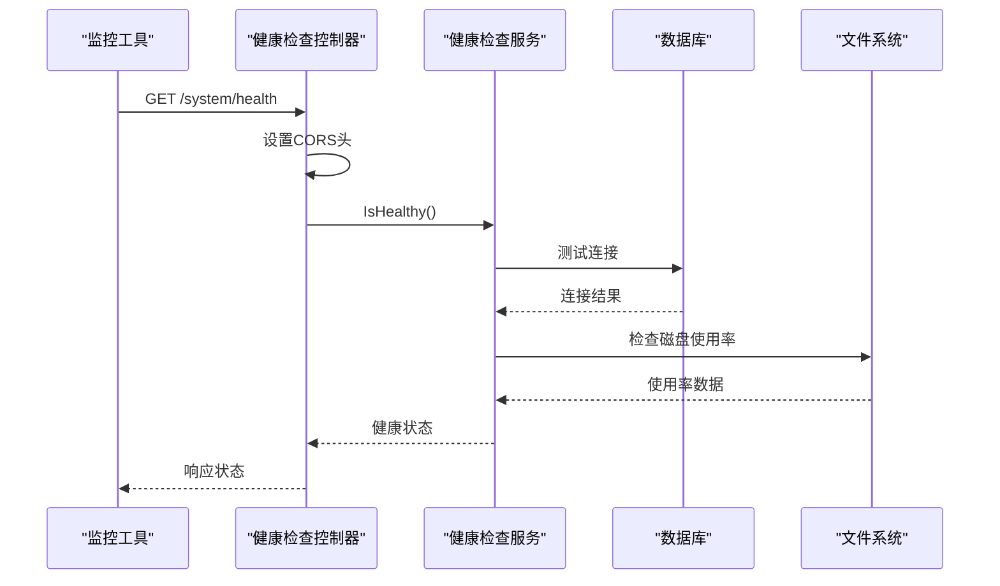
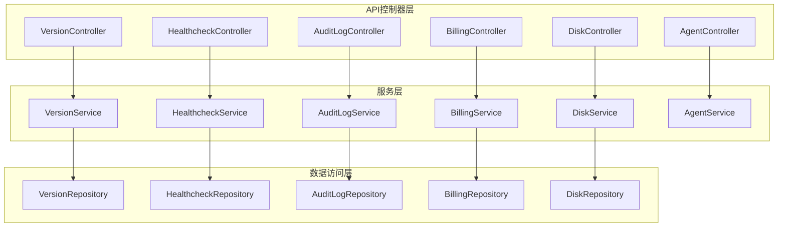

# 系统管理API

<cite>
**本文档引用的文件**
- [backend/internal/features/system/version/controller.go](file://backend/internal/features/system/version/controller.go)
- [backend/internal/features/system/version/dto.go](file://backend/internal/features/system/version/dto.go)
- [backend/internal/features/system/healthcheck/controller.go](file://backend/internal/features/system/healthcheck/controller.go)
- [backend/internal/features/system/healthcheck/dto.go](file://backend/internal/features/system/healthcheck/dto.go)
- [backend/internal/features/audit_logs/controller.go](file://backend/internal/features/audit_logs/controller.go)
- [backend/internal/features/audit_logs/dto.go](file://backend/internal/features/audit_logs/dto.go)
- [backend/internal/features/billing/controller.go](file://backend/internal/features/billing/controller.go)
- [backend/internal/features/billing/dto.go](file://backend/internal/features/billing/dto.go)
- [backend/internal/features/disk/controller.go](file://backend/internal/features/disk/controller.go)
- [backend/internal/features/disk/dto.go](file://backend/internal/features/disk/dto.go)
- [backend/internal/features/system/agent/controller.go](file://backend/internal/features/system/agent/controller.go)
- [backend/internal/features/telemetry/service.go](file://backend/internal/features/telemetry/service.go)
</cite>

## 目录
1. [简介](#简介)
2. [项目结构](#项目结构)
3. [核心组件](#核心组件)
4. [架构概览](#架构概览)
5. [详细组件分析](#详细组件分析)
6. [依赖关系分析](#依赖关系分析)
7. [性能考虑](#性能考虑)
8. [故障排除指南](#故障排除指南)
9. [结论](#结论)

## 简介
本文件为 Databasus 系统管理模块的详细 API 文档，涵盖以下管理功能：
- 版本管理：应用版本查询与更新检查
- 健康检查：服务状态监控、数据库连接检查、存储可用性验证
- 审计日志：操作日志查询、日志过滤、日志导出
- 计费管理：订阅状态查询、发票管理、支付状态跟踪
- 系统配置：全局设置、环境变量、运行时配置
- 系统监控指标：CPU 使用率、内存占用、磁盘空间
- 系统维护模式：紧急停机、故障恢复等管理功能

## 项目结构
系统管理相关 API 主要位于后端服务的 features 目录中，采用按功能域分层的组织方式：
- system/version：版本管理 API
- system/healthcheck：健康检查 API  
- audit_logs：审计日志 API
- billing：计费管理 API
- disk：磁盘使用情况 API
- system/agent：代理下载 API
- telemetry：遥测数据收集服务



**图表来源**
- [backend/internal/features/system/version/controller.go:14-27](file://backend/internal/features/system/version/controller.go#L14-L27)
- [backend/internal/features/system/healthcheck/controller.go:13-51](file://backend/internal/features/system/healthcheck/controller.go#L13-L51)
- [backend/internal/features/audit_logs/controller.go:17-112](file://backend/internal/features/audit_logs/controller.go#L17-L112)
- [backend/internal/features/billing/controller.go:18-305](file://backend/internal/features/billing/controller.go#L18-L305)
- [backend/internal/features/disk/controller.go:13-33](file://backend/internal/features/disk/controller.go#L13-L33)
- [backend/internal/features/system/agent/controller.go:13-48](file://backend/internal/features/system/agent/controller.go#L13-L48)

**章节来源**
- [backend/internal/features/system/version/controller.go:1-39](file://backend/internal/features/system/version/controller.go#L1-L39)
- [backend/internal/features/system/healthcheck/controller.go:1-52](file://backend/internal/features/system/healthcheck/controller.go#L1-L52)
- [backend/internal/features/audit_logs/controller.go:1-113](file://backend/internal/features/audit_logs/controller.go#L1-L113)
- [backend/internal/features/billing/controller.go:1-306](file://backend/internal/features/billing/controller.go#L1-L306)
- [backend/internal/features/disk/controller.go:1-34](file://backend/internal/features/disk/controller.go#L1-L34)
- [backend/internal/features/system/agent/controller.go:1-49](file://backend/internal/features/system/agent/controller.go#L1-L49)

## 核心组件
系统管理模块由多个独立但相互关联的组件构成：

### 版本管理组件
负责应用版本信息的查询与管理，支持从环境变量读取版本号或使用默认值。

### 健康检查组件  
提供系统健康状态检查，包括数据库连接测试和磁盘使用率验证。

### 审计日志组件
实现全局和用户级审计日志的查询功能，支持权限控制和分页过滤。

### 计费管理组件
处理订阅创建、存储变更、发票查询等计费相关操作。

### 磁盘监控组件
提供磁盘空间使用情况的实时查询。

### 代理管理组件
支持不同架构的代理二进制文件下载。

**章节来源**
- [backend/internal/features/system/version/controller.go:12-38](file://backend/internal/features/system/version/controller.go#L12-L38)
- [backend/internal/features/system/healthcheck/controller.go:9-51](file://backend/internal/features/system/healthcheck/controller.go#L9-L51)
- [backend/internal/features/audit_logs/controller.go:13-112](file://backend/internal/features/audit_logs/controller.go#L13-L112)
- [backend/internal/features/billing/controller.go:14-305](file://backend/internal/features/billing/controller.go#L14-L305)
- [backend/internal/features/disk/controller.go:9-33](file://backend/internal/features/disk/controller.go#L9-L33)
- [backend/internal/features/system/agent/controller.go:11-48](file://backend/internal/features/system/agent/controller.go#L11-L48)

## 架构概览
系统管理 API 采用分层架构设计，各功能域相对独立，通过统一的路由注册机制集成到主应用中。



**图表来源**
- [backend/internal/features/system/version/controller.go:14-27](file://backend/internal/features/system/version/controller.go#L14-L27)
- [backend/internal/features/system/healthcheck/controller.go:25-51](file://backend/internal/features/system/healthcheck/controller.go#L25-L51)
- [backend/internal/features/audit_logs/controller.go:39-112](file://backend/internal/features/audit_logs/controller.go#L39-L112)

## 详细组件分析

### 版本管理API

#### 接口定义
- **路径**: `/system/version`
- **方法**: GET
- **认证**: 无需认证
- **用途**: 查询当前应用版本信息

#### 请求参数
无参数

#### 响应格式
```json
{
  "version": "string"
}
```

#### 实现细节
版本信息优先从环境变量 `APP_VERSION` 获取，若未设置则使用内置默认版本。



**图表来源**
- [backend/internal/features/system/version/controller.go:29-38](file://backend/internal/features/system/version/controller.go#L29-L38)

**章节来源**
- [backend/internal/features/system/version/controller.go:14-38](file://backend/internal/features/system/version/controller.go#L14-L38)
- [backend/internal/features/system/version/dto.go:1-6](file://backend/internal/features/system/version/dto.go#L1-L6)

### 健康检查API

#### 接口定义
- **路径**: `/system/health`
- **方法**: GET
- **认证**: 无需认证（CORS 全开放）
- **用途**: 检查系统整体健康状态

#### 请求参数
无参数

#### 响应格式
```json
{
  "status": "string"
}
```

#### 实现细节
健康检查包含以下验证步骤：
1. 允许跨域访问（用于监控工具）
2. 处理预检请求
3. 执行数据库连接测试
4. 验证磁盘使用率（低于 95%）



**图表来源**
- [backend/internal/features/system/healthcheck/controller.go:25-51](file://backend/internal/features/system/healthcheck/controller.go#L25-L51)

**章节来源**
- [backend/internal/features/system/healthcheck/controller.go:13-51](file://backend/internal/features/system/healthcheck/controller.go#L13-L51)
- [backend/internal/features/system/healthcheck/dto.go:1-6](file://backend/internal/features/system/healthcheck/dto.go#L1-L6)

### 审计日志API

#### 接口定义
- **路径**: `/audit-logs/global`
- **方法**: GET
- **认证**: 需要 Bearer Token
- **权限**: 仅管理员
- **用途**: 查询全系统审计日志

##### 查询参数
- `limit`: 结果数量限制，默认 100
- `offset`: 分页偏移量，默认 0  
- `beforeDate`: 截止日期（RFC3339 格式）

#### 接口定义
- **路径**: `/audit-logs/users/{userId}`
- **方法**: GET
- **认证**: 需要 Bearer Token
- **权限**: 日志所有者或管理员
- **用途**: 查询指定用户的审计日志

##### 路径参数
- `userId`: 用户 UUID

##### 查询参数
- `limit`: 结果数量限制，默认 100
- `offset`: 分页偏移量，默认 0
- `beforeDate`: 截止日期（RFC3339 格式）

#### 响应格式
```json
{
  "auditLogs": [
    {
      "id": "uuid",
      "userId": "uuid/null",
      "workspaceId": "uuid/null", 
      "message": "string",
      "createdAt": "datetime",
      "userEmail": "string/null",
      "userName": "string/null",
      "workspaceName": "string/null"
    }
  ],
  "total": 0,
  "limit": 0,
  "offset": 0
}
```

#### 权限控制
- 全局日志查询仅管理员可访问
- 用户日志查询需要相应权限或为日志所有者

**章节来源**
- [backend/internal/features/audit_logs/controller.go:17-112](file://backend/internal/features/audit_logs/controller.go#L17-L112)
- [backend/internal/features/audit_logs/dto.go:9-31](file://backend/internal/features/audit_logs/dto.go#L9-L31)

### 计费管理API

#### 接口定义
- **路径**: `/billing/subscription`
- **方法**: POST
- **认证**: 需要 Bearer Token
- **用途**: 创建新的订阅

##### 请求体
```json
{
  "databaseId": "uuid",
  "storageGb": 0
}
```

##### 响应体
```json
{
  "paddleTransactionId": "string"
}
```

#### 接口定义
- **路径**: `/billing/subscription/change-storage`
- **方法**: POST
- **认证**: 需要 Bearer Token
- **用途**: 变更订阅存储容量

##### 请求体
```json
{
  "databaseId": "uuid", 
  "storageGb": 0
}
```

##### 响应体
```json
{
  "applyMode": "immediate|next_cycle",
  "currentGb": 0,
  "pendingGb": 0/null
}
```

#### 接口定义
- **路径**: `/billing/subscription/portal/{subscription_id}`
- **方法**: POST
- **认证**: 需要 Bearer Token
- **用途**: 获取计费门户会话

##### 路径参数
- `subscription_id`: 订阅 UUID

##### 响应体
```json
{
  "url": "string"
}
```

#### 接口定义
- **路径**: `/billing/subscription/events/{subscription_id}`
- **方法**: GET
- **认证**: 需要 Bearer Token
- **用途**: 获取订阅事件历史

##### 路径参数
- `subscription_id`: 订阅 UUID

##### 查询参数
- `limit`: 结果数量限制，默认 100
- `offset`: 分页偏移量，默认 0

##### 响应体
```json
{
  "events": ["*SubscriptionEvent"],
  "total": 0,
  "limit": 0,
  "offset": 0
}
```

#### 接口定义
- **路径**: `/billing/subscription/invoices/{subscription_id}`
- **方法**: GET
- **认证**: 需要 Bearer Token
- **用途**: 获取订阅发票

##### 路径参数
- `subscription_id`: 订阅 UUID

##### 查询参数
- `limit`: 结果数量限制，默认 100
- `offset`: 分页偏移量，默认 0

##### 响应体
```json
{
  "invoices": ["*Invoice"],
  "total": 0,
  "limit": 0,
  "offset": 0
}
```

#### 接口定义
- **路径**: `/billing/subscription/{database_id}`
- **方法**: GET
- **认证**: 需要 Bearer Token
- **用途**: 根据数据库获取订阅信息

##### 路径参数
- `database_id`: 数据库 UUID

##### 响应体
```json
{
  "*Subscription"
}
```

**章节来源**
- [backend/internal/features/billing/controller.go:18-305](file://backend/internal/features/billing/controller.go#L18-L305)
- [backend/internal/features/billing/dto.go:9-67](file://backend/internal/features/billing/dto.go#L9-L67)

### 磁盘使用API

#### 接口定义
- **路径**: `/disk/usage`
- **方法**: GET
- **认证**: 无需认证
- **用途**: 获取磁盘空间使用信息

#### 响应格式
```json
{
  "platform": "string",
  "totalSpaceBytes": 0,
  "usedSpaceBytes": 0,
  "freeSpaceBytes": 0
}
```

**章节来源**
- [backend/internal/features/disk/controller.go:13-33](file://backend/internal/features/disk/controller.go#L13-L33)
- [backend/internal/features/disk/dto.go:1-9](file://backend/internal/features/disk/dto.go#L1-L9)

### 代理下载API

#### 接口定义
- **路径**: `/system/agent`
- **方法**: GET
- **认证**: 无需认证
- **用途**: 下载指定架构的代理二进制文件

##### 查询参数
- `arch`: 目标架构，枚举值：`amd64` 或 `arm64`

#### 响应
- 成功：二进制文件流（Content-Type: application/octet-stream）
- 错误：JSON 错误信息

**章节来源**
- [backend/internal/features/system/agent/controller.go:13-48](file://backend/internal/features/system/agent/controller.go#L13-L48)

### 系统监控指标API

#### 遥测数据收集
系统通过遥测服务收集以下指标：
- 活跃数据库实例数量和类型分布
- 存储类型统计
- 通知器类型统计
- 应用版本和运行时信息

#### 指标收集规则
- 活跃数据库判定：健康状态可用或最近7天内有成功备份
- 数组条目上限：200条（防止数据过大）
- 平台信息：操作系统类型和架构

**章节来源**
- [backend/internal/features/telemetry/service.go:17-253](file://backend/internal/features/telemetry/service.go#L17-L253)

## 依赖关系分析



**图表来源**
- [backend/internal/features/system/version/controller.go:12-27](file://backend/internal/features/system/version/controller.go#L12-L27)
- [backend/internal/features/system/healthcheck/controller.go:9-15](file://backend/internal/features/system/healthcheck/controller.go#L9-L15)
- [backend/internal/features/audit_logs/controller.go:13-23](file://backend/internal/features/audit_logs/controller.go#L13-L23)
- [backend/internal/features/billing/controller.go:14-27](file://backend/internal/features/billing/controller.go#L14-L27)
- [backend/internal/features/disk/controller.go:9-15](file://backend/internal/features/disk/controller.go#L9-L15)
- [backend/internal/features/system/agent/controller.go:11-15](file://backend/internal/features/system/agent/controller.go#L11-L15)

## 性能考虑
- 健康检查接口对监控工具开放 CORS，便于外部监控系统调用
- 审计日志查询支持分页和时间过滤，避免大数据量查询影响性能
- 遥测数据收集包含数组长度限制，防止单次传输过大
- 磁盘使用查询直接访问系统 API，性能开销最小

## 故障排除指南

### 常见错误及解决方案

#### 健康检查失败
- **症状**: 返回 503 状态码
- **可能原因**: 数据库连接异常或磁盘使用率过高
- **解决方法**: 检查数据库连接配置和磁盘空间

#### 审计日志权限错误
- **症状**: 返回 403 状态码
- **可能原因**: 非管理员用户尝试访问全局日志
- **解决方法**: 使用管理员账户或确保有足够的权限

#### 计费API认证失败
- **症状**: 返回 401 状态码
- **可能原因**: 缺少有效的 Bearer Token
- **解决方法**: 在请求头中添加正确的认证令牌

#### 磁盘查询异常
- **症状**: 返回 500 状态码
- **可能原因**: 文件系统访问权限不足
- **解决方法**: 检查应用程序的文件系统权限

**章节来源**
- [backend/internal/features/system/healthcheck/controller.go:38-50](file://backend/internal/features/system/healthcheck/controller.go#L38-L50)
- [backend/internal/features/audit_logs/controller.go:54-60](file://backend/internal/features/audit_logs/controller.go#L54-L60)
- [backend/internal/features/billing/controller.go:43-47](file://backend/internal/features/billing/controller.go#L43-L47)
- [backend/internal/features/disk/controller.go:26-30](file://backend/internal/features/disk/controller.go#L26-L30)

## 结论
Databasus 系统管理模块提供了完整的运维管理能力，包括版本管理、健康检查、审计日志、计费管理、磁盘监控等功能。各组件采用清晰的分层架构设计，具有良好的可扩展性和维护性。通过标准化的 API 接口和完善的错误处理机制，为系统运维提供了可靠的技术支撑。