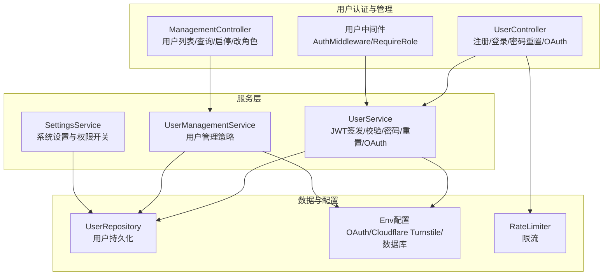
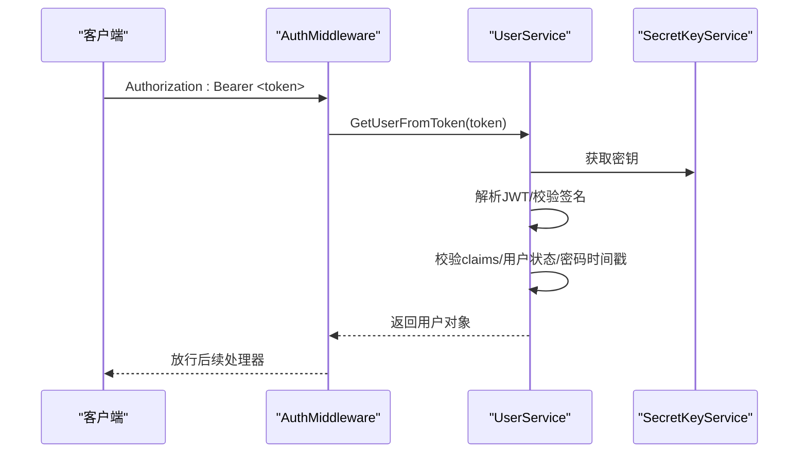
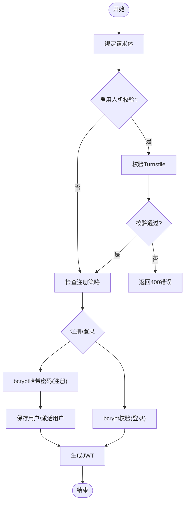
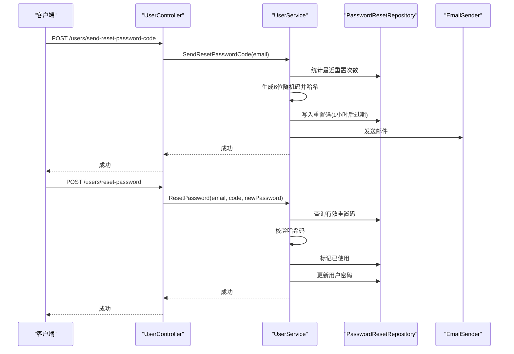
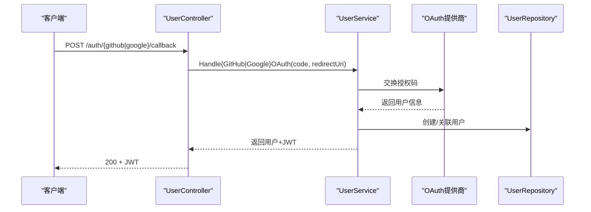
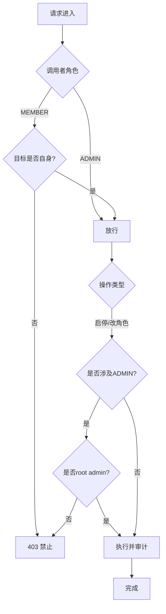
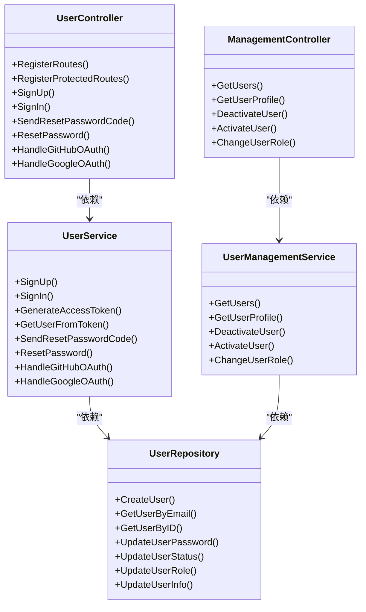

# 认证授权API

<cite>
**本文引用的文件**
- [backend/internal/features/users/controllers/user_controller.go](file://backend/internal/features/users/controllers/user_controller.go)
- [backend/internal/features/users/controllers/management_controller.go](file://backend/internal/features/users/controllers/management_controller.go)
- [backend/internal/features/users/middleware/middleware.go](file://backend/internal/features/users/middleware/middleware.go)
- [backend/internal/features/users/services/user_services.go](file://backend/internal/features/users/services/user_services.go)
- [backend/internal/features/users/services/management_service.go](file://backend/internal/features/users/services/management_service.go)
- [backend/internal/features/users/services/settings_service.go](file://backend/internal/features/users/services/settings_service.go)
- [backend/internal/features/users/models/user.go](file://backend/internal/features/users/models/user.go)
- [backend/internal/features/users/dto/dto.go](file://backend/internal/features/users/dto/dto.go)
- [backend/internal/features/users/enums/user_role.go](file://backend/internal/features/users/enums/user_role.go)
- [backend/internal/features/users/enums/workspace_role.go](file://backend/internal/features/users/enums/workspace_role.go)
- [backend/internal/features/users/enums/user_status.go](file://backend/internal/features/users/enums/user_status.go)
- [backend/internal/features/users/repositories/user_repository.go](file://backend/internal/features/users/repositories/user_repository.go)
- [backend/internal/util/cache/rate_limiter.go](file://backend/internal/util/cache/rate_limiter.go)
- [backend/internal/config/config.go](file://backend/internal/config/config.go)
</cite>

## 目录
1. [简介](#简介)
2. [项目结构](#项目结构)
3. [核心组件](#核心组件)
4. [架构总览](#架构总览)
5. [详细组件分析](#详细组件分析)
6. [依赖关系分析](#依赖关系分析)
7. [性能考量](#性能考量)
8. [故障排查指南](#故障排查指南)
9. [结论](#结论)
10. [附录](#附录)

## 简介
本文件为 Databasus 认证授权系统的详细 API 文档，覆盖以下主题：
- JWT 令牌生成与验证流程（登录、注册、密码重置、OAuth 回调）
- 用户管理 API（用户信息查询、修改、删除、邀请、角色变更、启用/停用）
- 权限控制机制（管理员权限、工作空间角色权限）
- 认证中间件与自定义权限检查
- 安全最佳实践（密码加密、令牌过期处理、防暴力破解）
- API 版本控制与向后兼容性建议

## 项目结构
认证授权模块位于后端子系统中，采用控制器-服务-仓储分层设计，并通过 Gin 路由暴露 REST 接口；权限控制通过中间件实现，数据模型与枚举集中于 users 子域。



图表来源
- [backend/internal/features/users/controllers/user_controller.go:24-39](file://backend/internal/features/users/controllers/user_controller.go#L24-L39)
- [backend/internal/features/users/controllers/management_controller.go:20-38](file://backend/internal/features/users/controllers/management_controller.go#L20-L38)
- [backend/internal/features/users/middleware/middleware.go:13-64](file://backend/internal/features/users/middleware/middleware.go#L13-L64)
- [backend/internal/features/users/services/user_services.go:30-37](file://backend/internal/features/users/services/user_services.go#L30-L37)
- [backend/internal/features/users/services/management_service.go:16-23](file://backend/internal/features/users/services/management_service.go#L16-L23)
- [backend/internal/features/users/services/settings_service.go:11-14](file://backend/internal/features/users/services/settings_service.go#L11-L14)
- [backend/internal/features/users/repositories/user_repository.go:16-25](file://backend/internal/features/users/repositories/user_repository.go#L16-L25)
- [backend/internal/util/cache/rate_limiter.go:12-20](file://backend/internal/util/cache/rate_limiter.go#L12-L20)
- [backend/internal/config/config.go:120-129](file://backend/internal/config/config.go#L120-L129)

章节来源
- [backend/internal/features/users/controllers/user_controller.go:24-39](file://backend/internal/features/users/controllers/user_controller.go#L24-L39)
- [backend/internal/features/users/controllers/management_controller.go:20-38](file://backend/internal/features/users/controllers/management_controller.go#L20-L38)
- [backend/internal/features/users/middleware/middleware.go:13-64](file://backend/internal/features/users/middleware/middleware.go#L13-L64)

## 核心组件
- 控制器层：负责路由注册与请求参数绑定，调用服务层执行业务逻辑。
- 服务层：封装 JWT 令牌签发与校验、密码哈希与比较、OAuth 第三方登录、密码重置、用户管理策略等。
- 中间件层：统一鉴权与角色校验，将用户上下文注入到请求上下文。
- 数据层：用户实体、权限枚举、仓储接口与实现。
- 配置与工具：环境变量（含 OAuth 凭据）、Cloudflare Turnstile、限流器。

章节来源
- [backend/internal/features/users/services/user_services.go:30-37](file://backend/internal/features/users/services/user_services.go#L30-L37)
- [backend/internal/features/users/services/management_service.go:16-23](file://backend/internal/features/users/services/management_service.go#L16-L23)
- [backend/internal/features/users/middleware/middleware.go:13-64](file://backend/internal/features/users/middleware/middleware.go#L13-L64)
- [backend/internal/features/users/models/user.go:11-26](file://backend/internal/features/users/models/user.go#L11-L26)
- [backend/internal/features/users/enums/user_role.go:3-8](file://backend/internal/features/users/enums/user_role.go#L3-L8)
- [backend/internal/features/users/enums/workspace_role.go:3-10](file://backend/internal/features/users/enums/workspace_role.go#L3-L10)
- [backend/internal/features/users/enums/user_status.go:3-9](file://backend/internal/features/users/enums/user_status.go#L3-L9)
- [backend/internal/util/cache/rate_limiter.go:12-20](file://backend/internal/util/cache/rate_limiter.go#L12-L20)
- [backend/internal/config/config.go:120-129](file://backend/internal/config/config.go#L120-L129)

## 架构总览
下图展示认证授权的关键交互流程：注册、登录、JWT 校验、密码重置、OAuth 登录以及用户管理。

```mermaid
sequenceDiagram
participant C as "客户端"
participant U as "UserController"
participant S as "UserService"
participant R as "UserRepository"
participant V as "Valkey(限流)"
participant T as "Cloudflare Turnstile"
participant O as "OAuth提供商(GitHub/Google)"
rect rgb(255,255,255)
Note over C,U : 注册/登录
C->>U : POST /users/signup 或 /users/signin
U->>T : 可选 : 验证人机校验
U->>S : 调用服务层
S->>R : 查询/创建用户
S-->>U : 返回用户信息
U->>S : 生成JWT
S-->>U : 返回JWT
U-->>C : 200 + JWT
end
rect rgb(255,255,255)
Note over C,S : JWT校验
C->>S : Authorization : Bearer <token>
S->>S : 解析/校验签名/过期时间/密码时间戳
S-->>C : 200 + 用户信息
end
rect rgb(255,255,255)
Note over C,U : 密码重置
C->>U : POST /users/send-reset-password-code
U->>V : 速率限制检查
U->>S : 发送重置码
S->>R : 写入重置码(带过期)
S-->>C : 成功
C->>U : POST /users/reset-password
U->>S : 验证并更新密码
S-->>C : 成功
end
rect rgb(255,255,255)
Note over C,U,O : OAuth回调
C->>U : POST /auth/{provider}/callback
U->>S : 处理OAuth回调
S->>O : 交换code换取用户信息
S->>R : 创建或关联用户
S-->>U : 返回JWT
U-->>C : 200 + JWT
end
```

图表来源
- [backend/internal/features/users/controllers/user_controller.go:58-100](file://backend/internal/features/users/controllers/user_controller.go#L58-L100)
- [backend/internal/features/users/controllers/user_controller.go:113-158](file://backend/internal/features/users/controllers/user_controller.go#L113-L158)
- [backend/internal/features/users/controllers/user_controller.go:399-460](file://backend/internal/features/users/controllers/user_controller.go#L399-L460)
- [backend/internal/features/users/controllers/user_controller.go:462-486](file://backend/internal/features/users/controllers/user_controller.go#L462-L486)
- [backend/internal/features/users/controllers/user_controller.go:344-396](file://backend/internal/features/users/controllers/user_controller.go#L344-L396)
- [backend/internal/features/users/services/user_services.go:185-239](file://backend/internal/features/users/services/user_services.go#L185-L239)
- [backend/internal/features/users/services/user_services.go:506-621](file://backend/internal/features/users/services/user_services.go#L506-L621)
- [backend/internal/features/users/services/user_services.go:623-665](file://backend/internal/features/users/services/user_services.go#L623-L665)
- [backend/internal/features/users/services/user_services.go:484-504](file://backend/internal/features/users/services/user_services.go#L484-L504)
- [backend/internal/util/cache/rate_limiter.go:22-53](file://backend/internal/util/cache/rate_limiter.go#L22-L53)
- [backend/internal/config/config.go:120-129](file://backend/internal/config/config.go#L120-L129)

## 详细组件分析

### JWT 令牌生成与验证
- 生成：服务层根据用户信息生成 JWT，包含 sub、exp、iat、role、passwordCreationTime 等声明，使用对称密钥签名。
- 校验：中间件从请求头提取 Bearer Token，解析并验证签名；同时校验用户状态与密码时间戳一致性，确保密码变更后旧令牌失效。
- 过期策略：当前实现使用较长有效期（约十年），但可通过配置调整；建议结合刷新令牌策略以降低长期有效令牌风险。



图表来源
- [backend/internal/features/users/middleware/middleware.go:13-38](file://backend/internal/features/users/middleware/middleware.go#L13-L38)
- [backend/internal/features/users/services/user_services.go:185-239](file://backend/internal/features/users/services/user_services.go#L185-L239)

章节来源
- [backend/internal/features/users/services/user_services.go:241-269](file://backend/internal/features/users/services/user_services.go#L241-L269)
- [backend/internal/features/users/services/user_services.go:185-239](file://backend/internal/features/users/services/user_services.go#L185-L239)
- [backend/internal/features/users/middleware/middleware.go:13-38](file://backend/internal/features/users/middleware/middleware.go#L13-L38)

### 登录与注册
- 注册：支持 Cloudflare Turnstile 人机校验；若存在“受邀”状态用户则激活并设置密码；否则按系统设置判断是否允许外部注册。
- 登录：bcrypt 校验密码；支持 Cloudflare Turnstile；登录前进行速率限制（每分钟最多 N 次）。



图表来源
- [backend/internal/features/users/controllers/user_controller.go:58-100](file://backend/internal/features/users/controllers/user_controller.go#L58-L100)
- [backend/internal/features/users/controllers/user_controller.go:113-158](file://backend/internal/features/users/controllers/user_controller.go#L113-L158)
- [backend/internal/features/users/services/user_services.go:47-133](file://backend/internal/features/users/services/user_services.go#L47-L133)
- [backend/internal/features/users/services/user_services.go:135-183](file://backend/internal/features/users/services/user_services.go#L135-L183)
- [backend/internal/util/cache/rate_limiter.go:22-53](file://backend/internal/util/cache/rate_limiter.go#L22-L53)

章节来源
- [backend/internal/features/users/controllers/user_controller.go:58-100](file://backend/internal/features/users/controllers/user_controller.go#L58-L100)
- [backend/internal/features/users/controllers/user_controller.go:113-158](file://backend/internal/features/users/controllers/user_controller.go#L113-L158)
- [backend/internal/features/users/services/user_services.go:47-133](file://backend/internal/features/users/services/user_services.go#L47-L133)
- [backend/internal/features/users/services/user_services.go:135-183](file://backend/internal/features/users/services/user_services.go#L135-L183)
- [backend/internal/util/cache/rate_limiter.go:22-53](file://backend/internal/util/cache/rate_limiter.go#L22-L53)

### 密码重置
- 发送重置码：支持 Cloudflare Turnstile；按用户维度进行速率限制（每小时最多 N 次）；生成 6 位随机码并哈希存储，1 小时后过期；发送邮件通知。
- 重置密码：验证用户与有效重置码，标记已使用，更新用户密码并审计日志。



图表来源
- [backend/internal/features/users/controllers/user_controller.go:399-460](file://backend/internal/features/users/controllers/user_controller.go#L399-L460)
- [backend/internal/features/users/controllers/user_controller.go:462-486](file://backend/internal/features/users/controllers/user_controller.go#L462-L486)
- [backend/internal/features/users/services/user_services.go:506-621](file://backend/internal/features/users/services/user_services.go#L506-L621)
- [backend/internal/features/users/services/user_services.go:623-665](file://backend/internal/features/users/services/user_services.go#L623-L665)

章节来源
- [backend/internal/features/users/controllers/user_controller.go:399-460](file://backend/internal/features/users/controllers/user_controller.go#L399-L460)
- [backend/internal/features/users/controllers/user_controller.go:462-486](file://backend/internal/features/users/controllers/user_controller.go#L462-L486)
- [backend/internal/features/users/services/user_services.go:506-621](file://backend/internal/features/users/services/user_services.go#L506-L621)
- [backend/internal/features/users/services/user_services.go:623-665](file://backend/internal/features/users/services/user_services.go#L623-L665)

### OAuth 回调（GitHub/Google）
- 根据环境变量中的 ClientID/ClientSecret 与 RedirectURI 交换授权码，拉取用户信息，创建或关联本地用户，返回 JWT。
- 若未配置对应 OAuth，返回 501 未实现。



图表来源
- [backend/internal/features/users/controllers/user_controller.go:344-396](file://backend/internal/features/users/controllers/user_controller.go#L344-L396)
- [backend/internal/features/users/services/user_services.go:484-504](file://backend/internal/features/users/services/user_services.go#L484-L504)
- [backend/internal/features/users/services/user_services.go:667-735](file://backend/internal/features/users/services/user_services.go#L667-L735)
- [backend/internal/features/users/services/user_services.go:737-800](file://backend/internal/features/users/services/user_services.go#L737-L800)
- [backend/internal/config/config.go:120-124](file://backend/internal/config/config.go#L120-L124)

章节来源
- [backend/internal/features/users/controllers/user_controller.go:344-396](file://backend/internal/features/users/controllers/user_controller.go#L344-L396)
- [backend/internal/features/users/services/user_services.go:484-504](file://backend/internal/features/users/services/user_services.go#L484-L504)
- [backend/internal/features/users/services/user_services.go:667-735](file://backend/internal/features/users/services/user_services.go#L667-L735)
- [backend/internal/features/users/services/user_services.go:737-800](file://backend/internal/features/users/services/user_services.go#L737-L800)
- [backend/internal/config/config.go:120-124](file://backend/internal/config/config.go#L120-L124)

### 用户管理 API
- 列表/查询：管理员可查看所有用户；普通用户仅能查看自身资料。
- 启用/停用/改角色：管理员可对非自身账户进行操作；对 ADMIN 角色变更需 root admin 执行。
- 邀请用户：基于系统设置决定是否允许成员邀请；邀请后状态为 INVITED。



图表来源
- [backend/internal/features/users/controllers/management_controller.go:54-108](file://backend/internal/features/users/controllers/management_controller.go#L54-L108)
- [backend/internal/features/users/controllers/management_controller.go:122-152](file://backend/internal/features/users/controllers/management_controller.go#L122-L152)
- [backend/internal/features/users/controllers/management_controller.go:165-185](file://backend/internal/features/users/controllers/management_controller.go#L165-L185)
- [backend/internal/features/users/controllers/management_controller.go:199-218](file://backend/internal/features/users/controllers/management_controller.go#L199-L218)
- [backend/internal/features/users/controllers/management_controller.go:234-260](file://backend/internal/features/users/controllers/management_controller.go#L234-L260)
- [backend/internal/features/users/services/management_service.go:50-86](file://backend/internal/features/users/services/management_service.go#L50-L86)
- [backend/internal/features/users/services/management_service.go:88-119](file://backend/internal/features/users/services/management_service.go#L88-L119)
- [backend/internal/features/users/services/management_service.go:121-166](file://backend/internal/features/users/services/management_service.go#L121-L166)
- [backend/internal/features/users/models/user.go:28-43](file://backend/internal/features/users/models/user.go#L28-L43)

章节来源
- [backend/internal/features/users/controllers/management_controller.go:20-38](file://backend/internal/features/users/controllers/management_controller.go#L20-L38)
- [backend/internal/features/users/controllers/management_controller.go:54-108](file://backend/internal/features/users/controllers/management_controller.go#L54-L108)
- [backend/internal/features/users/controllers/management_controller.go:122-152](file://backend/internal/features/users/controllers/management_controller.go#L122-L152)
- [backend/internal/features/users/controllers/management_controller.go:165-185](file://backend/internal/features/users/controllers/management_controller.go#L165-L185)
- [backend/internal/features/users/controllers/management_controller.go:199-218](file://backend/internal/features/users/controllers/management_controller.go#L199-L218)
- [backend/internal/features/users/controllers/management_controller.go:234-260](file://backend/internal/features/users/controllers/management_controller.go#L234-L260)
- [backend/internal/features/users/services/management_service.go:50-86](file://backend/internal/features/users/services/management_service.go#L50-L86)
- [backend/internal/features/users/services/management_service.go:88-119](file://backend/internal/features/users/services/management_service.go#L88-L119)
- [backend/internal/features/users/services/management_service.go:121-166](file://backend/internal/features/users/services/management_service.go#L121-L166)
- [backend/internal/features/users/models/user.go:28-43](file://backend/internal/features/users/models/user.go#L28-L43)

### 权限控制机制
- 用户角色：ADMIN、MEMBER。
- 工作空间角色：OWNER、ADMIN、MEMBER、VIEWER（用于工作空间级权限）。
- 用户状态：INVITED、ACTIVE、INACTIVE。
- 中间件：AuthMiddleware 校验 JWT 并注入用户上下文；RequireRole 校验角色。
- 策略：用户模型方法定义邀请、管理、设置更新、创建工作空间等权限边界；管理服务在执行敏感操作前进行权限校验。

章节来源
- [backend/internal/features/users/enums/user_role.go:3-8](file://backend/internal/features/users/enums/user_role.go#L3-L8)
- [backend/internal/features/users/enums/workspace_role.go:3-10](file://backend/internal/features/users/enums/workspace_role.go#L3-L10)
- [backend/internal/features/users/enums/user_status.go:3-9](file://backend/internal/features/users/enums/user_status.go#L3-L9)
- [backend/internal/features/users/middleware/middleware.go:40-64](file://backend/internal/features/users/middleware/middleware.go#L40-L64)
- [backend/internal/features/users/models/user.go:28-43](file://backend/internal/features/users/models/user.go#L28-L43)

### 认证中间件与自定义权限检查
- 使用方式：在路由上挂载 AuthMiddleware 获取用户上下文；对需要管理员权限的路由使用 RequireRole(UserRoleAdmin)。
- 自定义权限：通过 GetUserFromContext 提取用户对象，结合用户模型的权限方法（如 CanManageUsers、CanInviteUsers）实现细粒度控制。

章节来源
- [backend/internal/features/users/middleware/middleware.go:13-38](file://backend/internal/features/users/middleware/middleware.go#L13-L38)
- [backend/internal/features/users/middleware/middleware.go:40-64](file://backend/internal/features/users/middleware/middleware.go#L40-L64)
- [backend/internal/features/users/middleware/middleware.go:66-76](file://backend/internal/features/users/middleware/middleware.go#L66-L76)
- [backend/internal/features/users/models/user.go:28-43](file://backend/internal/features/users/models/user.go#L28-L43)

### 安全最佳实践
- 密码加密：bcrypt 哈希存储，登录时比较哈希。
- 令牌过期：当前实现使用较长有效期；建议引入短期访问令牌 + 刷新令牌策略。
- 防暴力破解：登录与重置码发送均使用限流器；支持 Cloudflare Turnstile 人机校验。
- 审计日志：关键操作（注册、登录、密码变更、重置、用户启停/改角色、邀请）均写入审计日志。
- OAuth 安全：严格校验授权码交换与用户信息；未配置 OAuth 时返回 501。

章节来源
- [backend/internal/features/users/services/user_services.go:57-60](file://backend/internal/features/users/services/user_services.go#L57-L60)
- [backend/internal/features/users/services/user_services.go:166-169](file://backend/internal/features/users/services/user_services.go#L166-L169)
- [backend/internal/features/users/services/user_services.go:506-621](file://backend/internal/features/users/services/user_services.go#L506-L621)
- [backend/internal/features/users/services/management_service.go:77-83](file://backend/internal/features/users/services/management_service.go#L77-L83)
- [backend/internal/features/users/controllers/user_controller.go:142-149](file://backend/internal/features/users/controllers/user_controller.go#L142-L149)
- [backend/internal/features/users/controllers/user_controller.go:439-451](file://backend/internal/features/users/controllers/user_controller.go#L439-L451)
- [backend/internal/util/cache/rate_limiter.go:22-53](file://backend/internal/util/cache/rate_limiter.go#L22-L53)
- [backend/internal/config/config.go:126-129](file://backend/internal/config/config.go#L126-L129)

### API 版本控制与向后兼容性
- 当前未见显式 API 版本号路径或 Accept 头版本协商；建议在路由前缀增加版本号（如 /api/v1/...），并在请求头中通过 Accept 指定版本。
- 向后兼容：新增字段应保持可选；变更现有字段时保留默认值与兼容解析；通过审计日志追踪破坏性变更影响。

[本节为通用指导，不直接分析具体文件]

## 依赖关系分析



图表来源
- [backend/internal/features/users/controllers/user_controller.go:19-46](file://backend/internal/features/users/controllers/user_controller.go#L19-L46)
- [backend/internal/features/users/controllers/management_controller.go:16-38](file://backend/internal/features/users/controllers/management_controller.go#L16-L38)
- [backend/internal/features/users/services/user_services.go:30-37](file://backend/internal/features/users/services/user_services.go#L30-L37)
- [backend/internal/features/users/services/management_service.go:16-23](file://backend/internal/features/users/services/management_service.go#L16-L23)
- [backend/internal/features/users/repositories/user_repository.go:16-25](file://backend/internal/features/users/repositories/user_repository.go#L16-L25)

章节来源
- [backend/internal/features/users/controllers/user_controller.go:19-46](file://backend/internal/features/users/controllers/user_controller.go#L19-L46)
- [backend/internal/features/users/controllers/management_controller.go:16-38](file://backend/internal/features/users/controllers/management_controller.go#L16-L38)
- [backend/internal/features/users/services/user_services.go:30-37](file://backend/internal/features/users/services/user_services.go#L30-L37)
- [backend/internal/features/users/services/management_service.go:16-23](file://backend/internal/features/users/services/management_service.go#L16-L23)
- [backend/internal/features/users/repositories/user_repository.go:16-25](file://backend/internal/features/users/repositories/user_repository.go#L16-L25)

## 性能考量
- 限流：登录与重置码发送使用 Valkey 实现滑动窗口限流，避免暴力破解与滥用。
- 密钥与令牌：JWT 使用对称密钥签名，解析与校验开销低；建议将密钥存储在安全位置并定期轮换。
- 数据库查询：用户查询与更新采用 GORM，注意索引与分页参数（列表接口支持 limit/offset/beforeDate/query）。
- OAuth：第三方 API 调用可能成为瓶颈，建议缓存用户信息并设置合理的超时与重试策略。

章节来源
- [backend/internal/util/cache/rate_limiter.go:22-53](file://backend/internal/util/cache/rate_limiter.go#L22-L53)
- [backend/internal/features/users/repositories/user_repository.go:88-127](file://backend/internal/features/users/repositories/user_repository.go#L88-L127)
- [backend/internal/features/users/services/user_services.go:667-735](file://backend/internal/features/users/services/user_services.go#L667-L735)
- [backend/internal/features/users/services/user_services.go:737-800](file://backend/internal/features/users/services/user_services.go#L737-L800)

## 故障排查指南
- 401 未授权：缺少 Authorization 头或无效 Token；检查 Bearer 前缀与密钥配置。
- 403 禁止：角色不足；确认调用者角色与目标资源权限。
- 429 请求过多：触发限流；检查 IP/邮箱维度的速率限制配置。
- 501 OAuth 未配置：未设置 GitHub/Google ClientID/ClientSecret；检查环境变量。
- 密码重置失败：重置码过期或不匹配；确认邮件接收与验证码输入。

章节来源
- [backend/internal/features/users/middleware/middleware.go:13-38](file://backend/internal/features/users/middleware/middleware.go#L13-L38)
- [backend/internal/features/users/controllers/management_controller.go:54-108](file://backend/internal/features/users/controllers/management_controller.go#L54-L108)
- [backend/internal/features/users/controllers/user_controller.go:142-149](file://backend/internal/features/users/controllers/user_controller.go#L142-L149)
- [backend/internal/features/users/controllers/user_controller.go:439-451](file://backend/internal/features/users/controllers/user_controller.go#L439-L451)
- [backend/internal/features/users/controllers/user_controller.go:344-396](file://backend/internal/features/users/controllers/user_controller.go#L344-L396)
- [backend/internal/features/users/services/user_services.go:506-621](file://backend/internal/features/users/services/user_services.go#L506-L621)

## 结论
Databasus 的认证授权体系以 JWT 为核心，结合 bcrypt、Cloudflare Turnstile、Valkey 限流与严格的权限策略，提供了较为完善的用户生命周期管理与安全防护。建议进一步引入短期访问令牌与刷新令牌机制、明确 API 版本策略，并持续优化审计与监控能力。

[本节为总结性内容，不直接分析具体文件]

## 附录

### API 端点一览（按功能分组）

- 认证与会话
  - POST /users/signup：注册（支持 Cloudflare Turnstile）
  - POST /users/signin：登录（支持 Cloudflare Turnstile + 速率限制）
  - POST /users/admin/has-password：检查管理员初始密码是否存在
  - POST /users/admin/set-password：设置管理员初始密码
  - POST /auth/github/callback：GitHub OAuth 回调
  - POST /auth/google/callback：Google OAuth 回调

- 密码与安全
  - POST /users/send-reset-password-code：发送重置码（支持 Cloudflare Turnstile + 速率限制）
  - POST /users/reset-password：使用重置码重置密码

- 用户资料与密码
  - GET /users/me：获取当前用户资料
  - PUT /users/me：更新当前用户资料（名称/邮箱）
  - PUT /users/change-password：修改当前用户密码

- 用户管理（管理员）
  - GET /users：列出用户（分页/搜索）
  - GET /users/:id：获取指定用户资料
  - POST /users/:id/deactivate：停用用户
  - POST /users/:id/activate：启用用户
  - PUT /users/:id/role：修改用户角色
  - POST /users/invite：邀请新用户（可选工作空间角色）

章节来源
- [backend/internal/features/users/controllers/user_controller.go:24-46](file://backend/internal/features/users/controllers/user_controller.go#L24-L46)
- [backend/internal/features/users/controllers/user_controller.go:344-396](file://backend/internal/features/users/controllers/user_controller.go#L344-L396)
- [backend/internal/features/users/controllers/user_controller.go:399-486](file://backend/internal/features/users/controllers/user_controller.go#L399-L486)
- [backend/internal/features/users/controllers/management_controller.go:20-38](file://backend/internal/features/users/controllers/management_controller.go#L20-L38)

### 请求/响应示例（路径指引）
- 注册请求体：[SignUpRequestDTO:11-16](file://backend/internal/features/users/dto/dto.go#L11-L16)
- 登录请求体：[SignInRequestDTO:18-22](file://backend/internal/features/users/dto/dto.go#L18-L22)
- 登录成功响应：[SignInResponseDTO:24-28](file://backend/internal/features/users/dto/dto.go#L24-L28)
- OAuth 回调请求体：[OAuthCallbackRequestDTO:86-89](file://backend/internal/features/users/dto/dto.go#L86-L89)
- OAuth 回调响应：[OAuthCallbackResponseDTO:91-96](file://backend/internal/features/users/dto/dto.go#L91-L96)
- 密码重置请求体：[ResetPasswordRequestDTO:103-107](file://backend/internal/features/users/dto/dto.go#L103-L107)
- 用户资料响应：[UserProfileResponseDTO:61-68](file://backend/internal/features/users/dto/dto.go#L61-L68)
- 管理员用户列表响应：[ListUsersResponseDTO:70-73](file://backend/internal/features/users/dto/dto.go#L70-L73)

章节来源
- [backend/internal/features/users/dto/dto.go:11-16](file://backend/internal/features/users/dto/dto.go#L11-L16)
- [backend/internal/features/users/dto/dto.go:18-22](file://backend/internal/features/users/dto/dto.go#L18-L22)
- [backend/internal/features/users/dto/dto.go:24-28](file://backend/internal/features/users/dto/dto.go#L24-L28)
- [backend/internal/features/users/dto/dto.go:86-89](file://backend/internal/features/users/dto/dto.go#L86-L89)
- [backend/internal/features/users/dto/dto.go:91-96](file://backend/internal/features/users/dto/dto.go#L91-L96)
- [backend/internal/features/users/dto/dto.go:103-107](file://backend/internal/features/users/dto/dto.go#L103-L107)
- [backend/internal/features/users/dto/dto.go:61-68](file://backend/internal/features/users/dto/dto.go#L61-L68)
- [backend/internal/features/users/dto/dto.go:70-73](file://backend/internal/features/users/dto/dto.go#L70-L73)