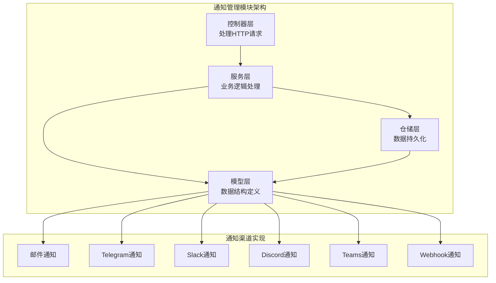
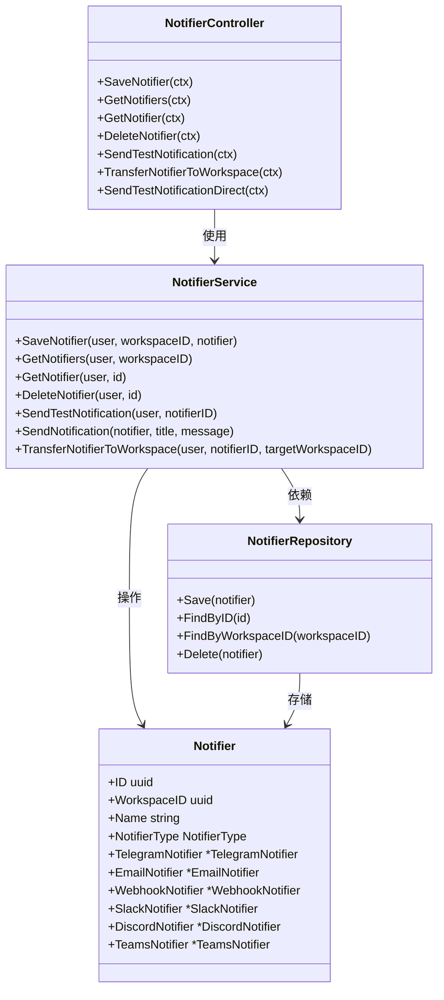
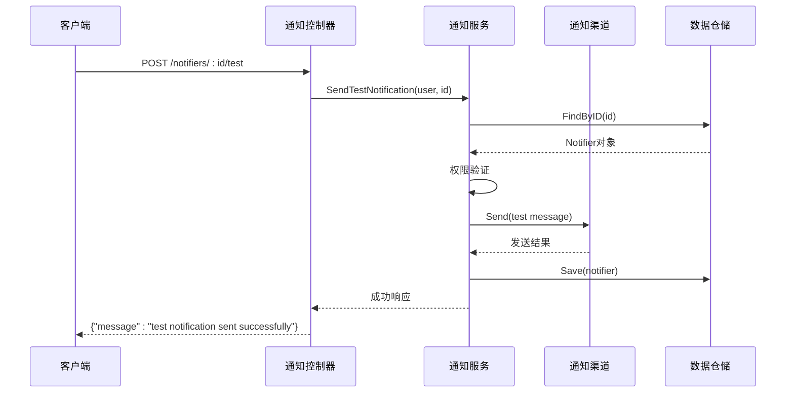
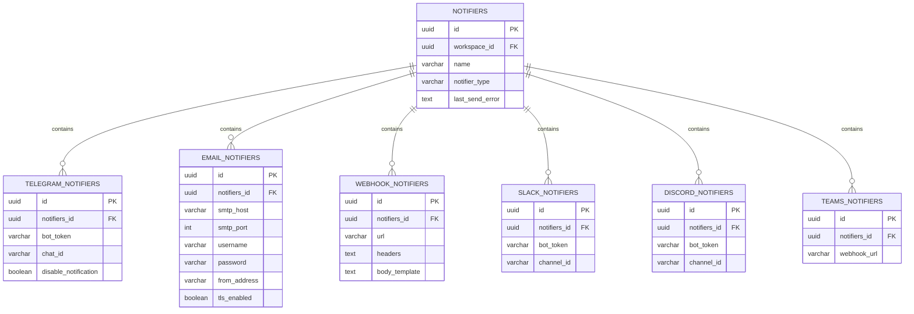
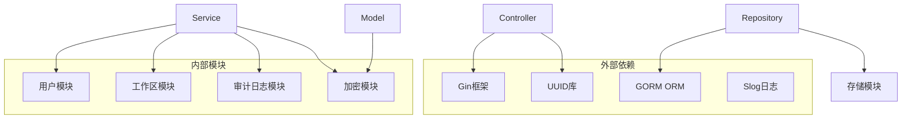

# 通知管理API

<cite>
**本文档引用的文件**
- [controller.go](file://backend/internal/features/notifiers/controller.go)
- [dto.go](file://backend/internal/features/notifiers/dto.go)
- [service.go](file://backend/internal/features/notifiers/service.go)
- [repository.go](file://backend/internal/features/notifiers/repository.go)
- [model.go](file://backend/internal/features/notifiers/model.go)
- [interfaces.go](file://backend/internal/features/notifiers/interfaces.go)
- [enums.go](file://backend/internal/features/notifiers/enums.go)
- [errors.go](file://backend/internal/features/notifiers/errors.go)
</cite>

## 目录
1. [简介](#简介)
2. [项目结构](#项目结构)
3. [核心组件](#核心组件)
4. [架构概览](#架构概览)
5. [详细组件分析](#详细组件分析)
6. [依赖关系分析](#依赖关系分析)
7. [性能考虑](#性能考虑)
8. [故障排除指南](#故障排除指南)
9. [结论](#结论)

## 简介

Databasus通知管理模块是一个功能完整的通知系统，支持多种通知渠道（邮件、Telegram、Slack、Discord、Teams、Webhook），提供完整的通知配置、测试、模板管理和历史记录功能。该模块采用分层架构设计，通过接口抽象实现了通知渠道的统一管理。

## 项目结构

通知管理模块位于后端项目的 `internal/features/notifiers` 目录下，采用清晰的分层架构：

**图表来源**
- [controller.go:19-27](file://backend/internal/features/notifiers/controller.go#L19-L27)
- [service.go:15-22](file://backend/internal/features/notifiers/service.go#L15-L22)
- [repository.go:10](file://backend/internal/features/notifiers/repository.go#L10)

**章节来源**
- [controller.go:19-27](file://backend/internal/features/notifiers/controller.go#L19-L27)
- [service.go:15-22](file://backend/internal/features/notifiers/service.go#L15-L22)
- [repository.go:10](file://backend/internal/features/notifiers/repository.go#L10)

## 核心组件

通知管理模块的核心组件包括：

### 1. 控制器层
- 负责HTTP路由注册和请求处理
- 实现通知配置、测试、删除等API
- 处理用户权限验证和错误响应

### 2. 服务层
- 实现业务逻辑和工作流程
- 管理通知渠道的生命周期
- 处理权限检查和审计日志

### 3. 仓储层
- 负责数据持久化操作
- 支持多种通知渠道的数据存储
- 提供事务性数据库操作

### 4. 模型层
- 定义通知配置的数据结构
- 实现通知渠道的统一接口
- 支持敏感数据加密和隐藏

**章节来源**
- [controller.go:14-17](file://backend/internal/features/notifiers/controller.go#L14-L17)
- [service.go:15-22](file://backend/internal/features/notifiers/service.go#L15-L22)
- [repository.go:10](file://backend/internal/features/notifiers/repository.go#L10)
- [model.go:18-32](file://backend/internal/features/notifiers/model.go#L18-L32)

## 架构概览

通知管理模块采用分层架构设计，通过接口抽象实现了通知渠道的统一管理：

**图表来源**
- [controller.go:14-335](file://backend/internal/features/notifiers/controller.go#L14-L335)
- [service.go:15-396](file://backend/internal/features/notifiers/service.go#L15-L396)
- [repository.go:10-218](file://backend/internal/features/notifiers/repository.go#L10-L218)
- [model.go:18-122](file://backend/internal/features/notifiers/model.go#L18-L122)

## 详细组件分析

### API路由定义

通知管理模块提供以下REST API：

#### 通知配置API
- `POST /notifiers` - 创建或更新通知配置
- `GET /notifiers` - 获取工作区内的所有通知配置
- `GET /notifiers/:id` - 根据ID获取单个通知配置
- `DELETE /notifiers/:id` - 删除通知配置

#### 通知测试API
- `POST /notifiers/:id/test` - 发送测试通知
- `POST /notifiers/direct-test` - 直接测试通知配置

#### 工作区转移API
- `POST /notifiers/:id/transfer` - 将通知配置转移到其他工作区

**章节来源**
- [controller.go:19-27](file://backend/internal/features/notifiers/controller.go#L19-L27)

### 通知配置API详解

#### 创建/更新通知配置 (`POST /notifiers`)
- **请求体**: 包含通知名称、类型和特定渠道配置
- **权限要求**: 需要工作区数据库管理权限
- **工作区绑定**: 必须指定目标工作区ID
- **数据验证**: 对通知配置进行完整性检查

#### 获取通知配置 (`GET /notifiers`)
- **查询参数**: `workspace_id` (必需)
- **权限要求**: 需要工作区访问权限
- **返回数据**: 当前工作区内所有通知配置列表

#### 获取单个通知配置 (`GET /notifiers/:id`)
- **路径参数**: 通知配置ID
- **权限要求**: 需要查看权限
- **安全处理**: 自动隐藏敏感数据

#### 删除通知配置 (`DELETE /notifiers/:id`)
- **路径参数**: 通知配置ID
- **权限要求**: 需要管理权限
- **约束检查**: 确保通知配置未被数据库使用

**章节来源**
- [controller.go:29-189](file://backend/internal/features/notifiers/controller.go#L29-L189)
- [service.go:30-154](file://backend/internal/features/notifiers/service.go#L30-L154)

### 通知测试API详解

#### 测试通知发送 (`POST /notifiers/:id/test`)
- **路径参数**: 通知配置ID
- **测试内容**: 发送固定格式的测试消息
- **权限要求**: 需要测试权限
- **结果记录**: 更新最后发送错误状态

#### 直接测试通知 (`POST /notifiers/direct-test`)
- **请求体**: 完整的通知配置对象
- **权限要求**: 需要在目标工作区内有访问权限
- **即时验证**: 不保存临时配置

**图表来源**
- [controller.go:191-226](file://backend/internal/features/notifiers/controller.go#L191-L226)
- [service.go:209-237](file://backend/internal/features/notifiers/service.go#L209-L237)

**章节来源**
- [controller.go:191-334](file://backend/internal/features/notifiers/controller.go#L191-L334)
- [service.go:209-274](file://backend/internal/features/notifiers/service.go#L209-L274)

### 通知转移API

#### 工作区转移 (`POST /notifiers/:id/transfer`)
- **请求体**: 目标工作区ID
- **权限要求**: 需要在源工作区和目标工作区都有管理权限
- **约束检查**: 确保通知配置未关联到任何数据库
- **审计记录**: 记录转移操作的审计日志

**章节来源**
- [controller.go:228-282](file://backend/internal/features/notifiers/controller.go#L228-L282)
- [service.go:310-380](file://backend/internal/features/notifiers/service.go#L310-L380)

### 通知渠道配置

通知管理模块支持以下通知渠道：

#### 邮件通知 (EMAIL)
- SMTP服务器配置
- 认证信息管理
- TLS/SSL连接支持

#### Telegram通知 (TELEGRAM)
- Bot令牌配置
- 聊天ID设置
- 消息格式化支持

#### Slack通知 (SLACK)
- 应用令牌配置
- 频道ID设置
- 消息块格式支持

#### Discord通知 (DISCORD)
- 应用令牌配置
- 服务器和频道设置
- 嵌入消息格式支持

#### Teams通知 (TEAMS)
- Webhook URL配置
- 消息卡片格式支持

#### Webhook通知 (WEBHOOK)
- HTTP端点配置
- 请求头自定义
- JSON负载模板

**章节来源**
- [enums.go:5-12](file://backend/internal/features/notifiers/enums.go#L5-L12)
- [model.go:25-31](file://backend/internal/features/notifiers/model.go#L25-L31)

### 数据模型设计

通知配置采用统一的数据模型设计：

**图表来源**
- [model.go:18-32](file://backend/internal/features/notifiers/model.go#L18-L32)
- [repository.go:16-41](file://backend/internal/features/notifiers/repository.go#L16-L41)

**章节来源**
- [model.go:18-122](file://backend/internal/features/notifiers/model.go#L18-L122)
- [repository.go:12-123](file://backend/internal/features/notifiers/repository.go#L12-L123)

## 依赖关系分析

通知管理模块的依赖关系清晰明确：

**图表来源**
- [controller.go:3-12](file://backend/internal/features/notifiers/controller.go#L3-L12)
- [service.go:3-13](file://backend/internal/features/notifiers/service.go#L3-L13)
- [repository.go:3-8](file://backend/internal/features/notifiers/repository.go#L3-L8)

**章节来源**
- [controller.go:3-12](file://backend/internal/features/notifiers/controller.go#L3-L12)
- [service.go:3-13](file://backend/internal/features/notifiers/service.go#L3-L13)
- [repository.go:3-8](file://backend/internal/features/notifiers/repository.go#L3-L8)

## 性能考虑

通知管理模块在设计时充分考虑了性能优化：

### 1. 数据库优化
- 使用预加载机制减少N+1查询问题
- 事务性操作确保数据一致性
- 索引优化支持按工作区查询

### 2. 缓存策略
- 敏感数据自动隐藏机制
- 加密字段的延迟处理
- 最后发送错误状态缓存

### 3. 错误处理
- 分层错误处理机制
- 具体的错误码定义
- 用户友好的错误消息

### 4. 扩展性设计
- 接口抽象支持新渠道添加
- 统一的配置管理
- 灵活的消息格式化

## 故障排除指南

### 常见错误及解决方案

#### 权限相关错误
- `ErrInsufficientPermissionsToManageNotifier`: 用户在当前工作区没有管理权限
- `ErrInsufficientPermissionsToViewNotifier`: 用户没有查看通知配置的权限
- `ErrInsufficientPermissionsToTestNotifier`: 用户没有测试通知的权限

#### 业务逻辑错误
- `ErrNotifierDoesNotBelongToWorkspace`: 通知配置不属于指定工作区
- `ErrNotifierHasAttachedDatabases`: 通知配置正在被数据库使用，无法删除
- `ErrNotifierHasAttachedDatabasesCannotTransfer`: 通知配置有附件数据库，无法转移

#### 数据验证错误
- 通知名称为空
- 无效的工作区ID格式
- 通知类型不支持

**章节来源**
- [errors.go:5-36](file://backend/internal/features/notifiers/errors.go#L5-L36)

### 调试建议

1. **启用详细日志**: 检查服务层的日志输出
2. **验证权限**: 确认用户在目标工作区的权限级别
3. **测试连接**: 使用测试API验证通知渠道连接
4. **检查配置**: 验证通知配置的完整性和正确性

## 结论

Databasus通知管理模块提供了完整、可扩展的通知解决方案。通过清晰的分层架构、完善的权限控制和灵活的通知渠道支持，该模块能够满足不同场景下的通知需求。模块的设计充分考虑了安全性、性能和可维护性，为后续的功能扩展奠定了良好的基础。