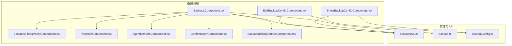
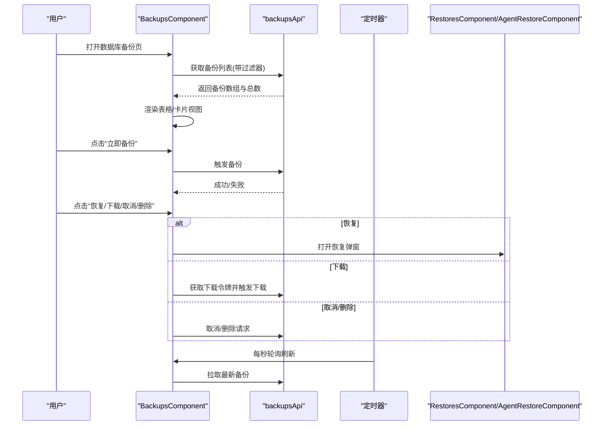
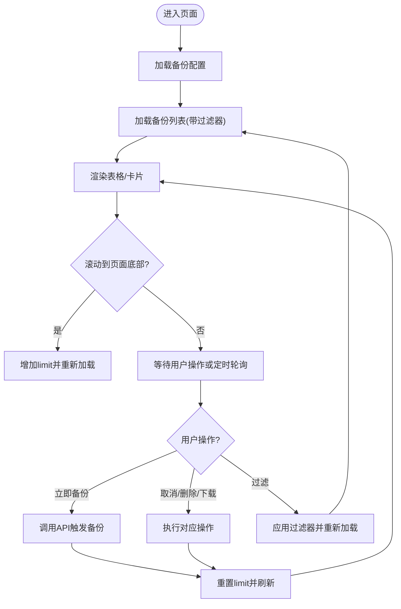
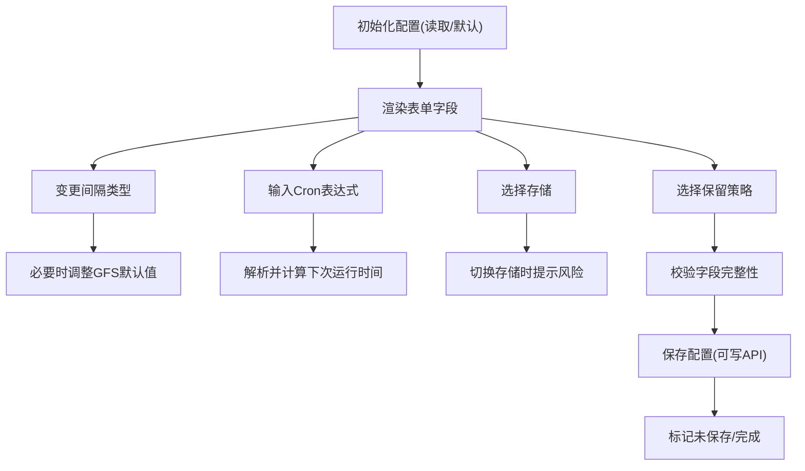
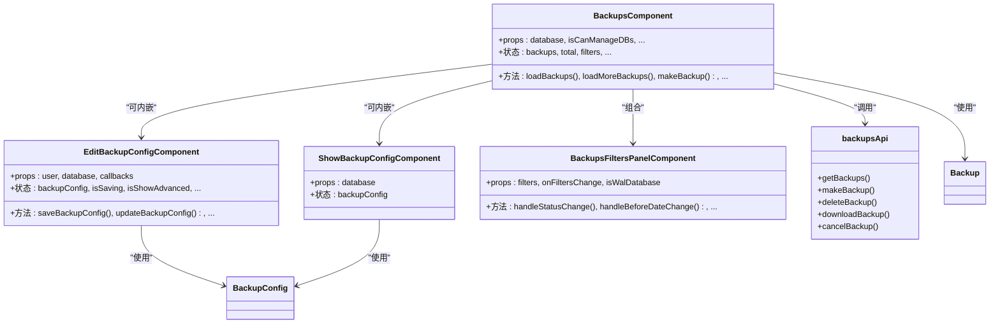

# 备份UI组件

<cite>
**本文引用的文件**   
- [BackupsComponent.tsx](file://frontend/src/features/backups/ui/BackupsComponent.tsx)
- [EditBackupConfigComponent.tsx](file://frontend/src/features/backups/ui/EditBackupConfigComponent.tsx)
- [ShowBackupConfigComponent.tsx](file://frontend/src/features/backups/ui/ShowBackupConfigComponent.tsx)
- [BackupsFiltersPanelComponent.tsx](file://frontend/src/features/backups/ui/BackupsFiltersPanelComponent.tsx)
- [backupsApi.ts](file://frontend/src/entity/backups/api/backupsApi.ts)
- [Backup.ts](file://frontend/src/entity/backups/model/Backup.ts)
- [BackupConfig.ts](file://frontend/src/entity/backups/model/BackupConfig.ts)
- [ConfirmationComponent.tsx](file://frontend/src/shared/ui/ConfirmationComponent.tsx)
- [RestoresComponent.tsx](file://frontend/src/features/restores/ui/RestoresComponent.tsx)
- [AgentRestoreComponent.tsx](file://frontend/src/features/backups/ui/AgentRestoreComponent.tsx)
- [BackupsBillingBannerComponent.tsx](file://frontend/src/features/backups/ui/BackupsBillingBannerComponent.tsx)
- [useTheme.ts](file://frontend/src/shared/theme/useTheme.ts)
- [ThemeProvider.tsx](file://frontend/src/shared/theme/ThemeProvider.tsx)
- [useIsMobile.tsx](file://frontend/src/shared/hooks/useIsMobile.tsx)
- [getUserTimeFormat.ts](file://frontend/src/shared/time/getUserTimeFormat.ts)
</cite>

## 目录
1. [简介](#简介)
2. [项目结构](#项目结构)
3. [核心组件](#核心组件)
4. [架构总览](#架构总览)
5. [组件详解](#组件详解)
6. [依赖关系分析](#依赖关系分析)
7. [性能与可扩展性](#性能与可扩展性)
8. [测试与调试](#测试与调试)
9. [结论](#结论)

## 简介
本文件面向前端开发者，系统化梳理 Databasus 备份管理界面的组件架构与实现细节，覆盖以下目标：
- 主界面 BackupsComponent.tsx 的数据流、状态管理与交互行为
- 配置编辑 EditBackupConfigComponent.tsx 的表单校验、时区转换与高级设置
- 配置展示 ShowBackupConfigComponent.tsx 的只读视图与格式化输出
- 过滤面板 BackupsFiltersPanelComponent.tsx 的筛选条件传递
- 组件间通信机制（props、状态共享、事件回调）
- 备份数据的渲染逻辑（表格/卡片、状态标识、大小与时长格式化、操作按钮）
- 用户交互设计（表单校验、确认对话框、滚动加载更多、移动端适配）
- 响应式设计与无障碍访问
- 可复用性与扩展性建议
- 测试策略与调试技巧

## 项目结构
备份UI位于前端工程的 features/backups/ui 目录下，围绕“备份列表 + 配置编辑/展示 + 过滤器 + 操作弹窗”构建，配合 entity 层的模型与 API 封装，形成清晰的分层职责。

**图表来源**
- [BackupsComponent.tsx:1-731](file://frontend/src/features/backups/ui/BackupsComponent.tsx#L1-L731)
- [EditBackupConfigComponent.tsx:1-859](file://frontend/src/features/backups/ui/EditBackupConfigComponent.tsx#L1-L859)
- [ShowBackupConfigComponent.tsx:1-283](file://frontend/src/features/backups/ui/ShowBackupConfigComponent.tsx#L1-L283)
- [BackupsFiltersPanelComponent.tsx:1-93](file://frontend/src/features/backups/ui/BackupsFiltersPanelComponent.tsx#L1-L93)
- [backupsApi.ts:1-75](file://frontend/src/entity/backups/api/backupsApi.ts#L1-L75)
- [Backup.ts:1-19](file://frontend/src/entity/backups/model/Backup.ts#L1-L19)
- [BackupConfig.ts:1-29](file://frontend/src/entity/backups/model/BackupConfig.ts#L1-L29)

**章节来源**
- [BackupsComponent.tsx:1-731](file://frontend/src/features/backups/ui/BackupsComponent.tsx#L1-L731)
- [EditBackupConfigComponent.tsx:1-859](file://frontend/src/features/backups/ui/EditBackupConfigComponent.tsx#L1-L859)
- [ShowBackupConfigComponent.tsx:1-283](file://frontend/src/features/backups/ui/ShowBackupConfigComponent.tsx#L1-L283)
- [BackupsFiltersPanelComponent.tsx:1-93](file://frontend/src/features/backups/ui/BackupsFiltersPanelComponent.tsx#L1-L93)
- [backupsApi.ts:1-75](file://frontend/src/entity/backups/api/backupsApi.ts#L1-L75)
- [Backup.ts:1-19](file://frontend/src/entity/backups/model/Backup.ts#L1-L19)
- [BackupConfig.ts:1-29](file://frontend/src/entity/backups/model/BackupConfig.ts#L1-L29)

## 核心组件
- BackupsComponent：备份列表主界面，负责加载备份、分页与滚动加载、状态渲染、操作按钮、过滤器面板、错误详情弹窗、恢复弹窗等。
- EditBackupConfigComponent：备份配置编辑表单，支持间隔类型、周/月参数、Cron 表达式、存储选择、保留策略、通知开关、高级重试设置等。
- ShowBackupConfigComponent：备份配置只读展示，格式化输出当前配置并提示下次运行时间。
- BackupsFiltersPanelComponent：备份列表过滤器面板，支持状态多选、截止日期、PostgreSQL WAL 类型筛选。
- backupsApi：封装备份相关后端接口，包括获取备份列表、触发备份、删除、下载、取消等。
- Backup/BackupConfig：备份与配置的数据模型，用于类型约束与渲染。

**章节来源**
- [BackupsComponent.tsx:40-731](file://frontend/src/features/backups/ui/BackupsComponent.tsx#L40-L731)
- [EditBackupConfigComponent.tsx:42-859](file://frontend/src/features/backups/ui/EditBackupConfigComponent.tsx#L42-L859)
- [ShowBackupConfigComponent.tsx:27-283](file://frontend/src/features/backups/ui/ShowBackupConfigComponent.tsx#L27-L283)
- [BackupsFiltersPanelComponent.tsx:8-93](file://frontend/src/features/backups/ui/BackupsFiltersPanelComponent.tsx#L8-L93)
- [backupsApi.ts:12-75](file://frontend/src/entity/backups/api/backupsApi.ts#L12-L75)
- [Backup.ts:7-19](file://frontend/src/entity/backups/model/Backup.ts#L7-L19)
- [BackupConfig.ts:8-29](file://frontend/src/entity/backups/model/BackupConfig.ts#L8-L29)

## 架构总览
备份UI采用“容器组件 + 展示组件”的分层模式：
- 容器组件（BackupsComponent、EditBackupConfigComponent）负责状态管理、副作用（定时轮询、滚动加载）、与API交互。
- 展示组件（BackupsFiltersPanelComponent、ShowBackupConfigComponent、ConfirmationComponent）专注UI呈现与受控输入。
- 共享工具（useTheme、useIsMobile、getUserTimeFormat）提供主题、设备与时间格式化能力。

**图表来源**
- [BackupsComponent.tsx:94-230](file://frontend/src/features/backups/ui/BackupsComponent.tsx#L94-L230)
- [backupsApi.ts:13-74](file://frontend/src/entity/backups/api/backupsApi.ts#L13-L74)
- [RestoresComponent.tsx](file://frontend/src/features/restores/ui/RestoresComponent.tsx)
- [AgentRestoreComponent.tsx](file://frontend/src/features/backups/ui/AgentRestoreComponent.tsx)

**章节来源**
- [BackupsComponent.tsx:94-230](file://frontend/src/features/backups/ui/BackupsComponent.tsx#L94-L230)
- [backupsApi.ts:13-74](file://frontend/src/entity/backups/api/backupsApi.ts#L13-L74)

## 组件详解

### BackupsComponent.tsx：备份列表主界面
- 负责：
  - 加载备份列表与总数，支持分页与滚动加载更多
  - 实时轮询更新（每秒），避免手动刷新
  - 渲染桌面表格与移动端卡片两种视图
  - 状态标识与图标：成功/失败/进行中/已取消/已删除，并在失败时提供错误详情弹窗
  - 操作按钮：取消进行中备份、删除已完成备份、从备份恢复、下载备份文件
  - 过滤器面板：状态、截止日期、PostgreSQL WAL 类型
  - 计费横幅（云环境）
- 关键状态与引用：
  - 列表数据、总数、是否还有更多、加载中标志
  - 当前过滤器、过滤面板可见性
  - 正在执行的操作（下载/取消/删除）ID
  - 错误详情与恢复弹窗的备份ID
  - 请求时间戳与防抖引用，避免竞态
- 数据格式化：
  - 备份大小：自动单位换算（MB/GB）
  - 持续时间：按小时/分钟/秒格式化
  - 时间：本地化格式与相对时间
- 交互要点：
  - 滚动到底部触发“加载更多”
  - 点击状态行可查看失败原因
  - 点击“恢复”根据数据库类型打开不同恢复组件
  - 点击“下载”通过临时令牌直链下载

**图表来源**
- [BackupsComponent.tsx:94-256](file://frontend/src/features/backups/ui/BackupsComponent.tsx#L94-L256)
- [backupsApi.ts:13-74](file://frontend/src/entity/backups/api/backupsApi.ts#L13-L74)

**章节来源**
- [BackupsComponent.tsx:48-731](file://frontend/src/features/backups/ui/BackupsComponent.tsx#L48-L731)
- [backupsApi.ts:12-75](file://frontend/src/entity/backups/api/backupsApi.ts#L12-L75)

### EditBackupConfigComponent.tsx：备份配置编辑
- 功能点：
  - 启用/禁用备份
  - 选择备份间隔类型（小时/日/周/月/Cron）
  - 周/月参数的本地化转换（UTC↔本地）
  - Cron 表达式校验与“下次运行时间”预览
  - 存储选择（含“新建存储”入口）
  - 加密策略（非云环境）
  - 保留策略（时间周期/数量/GFS）
  - 通知开关（成功/失败）
  - 高级设置：失败重试次数
- 关键交互：
  - 保存时可直接写入API或仅返回配置供上层处理
  - 字段完整性校验：启用备份时，保留策略、存储、加密、间隔参数均需满足
  - 与时间格式化工具集成，确保显示一致

**图表来源**
- [EditBackupConfigComponent.tsx:166-212](file://frontend/src/features/backups/ui/EditBackupConfigComponent.tsx#L166-L212)
- [EditBackupConfigComponent.tsx:251-277](file://frontend/src/features/backups/ui/EditBackupConfigComponent.tsx#L251-L277)

**章节来源**
- [EditBackupConfigComponent.tsx:76-859](file://frontend/src/features/backups/ui/EditBackupConfigComponent.tsx#L76-L859)

### ShowBackupConfigComponent.tsx：备份配置展示
- 功能点：
  - 以只读形式展示当前配置
  - 将UTC时间转换为本地时间显示
  - 格式化GFS保留策略、通知项、存储信息
  - 提示下次运行时间（基于Cron）
- 设计原则：
  - 无状态展示，便于复用到其他页面或弹窗

**章节来源**
- [ShowBackupConfigComponent.tsx:80-283](file://frontend/src/features/backups/ui/ShowBackupConfigComponent.tsx#L80-L283)

### BackupsFiltersPanelComponent.tsx：过滤器面板
- 功能点：
  - 多选状态过滤
  - 截止日期过滤（ISO字符串）
  - PostgreSQL WAL 备份类型过滤（全量/归档段）
- 交互：
  - 通过回调将过滤器对象回传给父组件，触发列表重新加载

**章节来源**
- [BackupsFiltersPanelComponent.tsx:26-93](file://frontend/src/features/backups/ui/BackupsFiltersPanelComponent.tsx#L26-L93)

### backupsApi.ts：备份API封装
- 接口能力：
  - 获取备份列表（支持limit/offset/多状态/截止日期/WAL类型）
  - 触发一次性备份
  - 删除备份
  - 下载备份（生成临时令牌并触发下载）
  - 取消进行中备份
- 设计要点：
  - 使用统一的请求辅助工具与服务地址常量
  - 下载流程包含令牌生成与直链下载

**章节来源**
- [backupsApi.ts:12-75](file://frontend/src/entity/backups/api/backupsApi.ts#L12-L75)

## 依赖关系分析

**图表来源**
- [BackupsComponent.tsx:48-731](file://frontend/src/features/backups/ui/BackupsComponent.tsx#L48-L731)
- [EditBackupConfigComponent.tsx:76-859](file://frontend/src/features/backups/ui/EditBackupConfigComponent.tsx#L76-L859)
- [ShowBackupConfigComponent.tsx:80-283](file://frontend/src/features/backups/ui/ShowBackupConfigComponent.tsx#L80-L283)
- [BackupsFiltersPanelComponent.tsx:26-93](file://frontend/src/features/backups/ui/BackupsFiltersPanelComponent.tsx#L26-L93)
- [backupsApi.ts:12-75](file://frontend/src/entity/backups/api/backupsApi.ts#L12-L75)
- [Backup.ts:7-19](file://frontend/src/entity/backups/model/Backup.ts#L7-L19)
- [BackupConfig.ts:8-29](file://frontend/src/entity/backups/model/BackupConfig.ts#L8-L29)

**章节来源**
- [BackupsComponent.tsx:48-731](file://frontend/src/features/backups/ui/BackupsComponent.tsx#L48-L731)
- [EditBackupConfigComponent.tsx:76-859](file://frontend/src/features/backups/ui/EditBackupConfigComponent.tsx#L76-L859)
- [ShowBackupConfigComponent.tsx:80-283](file://frontend/src/features/backups/ui/ShowBackupConfigComponent.tsx#L80-L283)
- [BackupsFiltersPanelComponent.tsx:26-93](file://frontend/src/features/backups/ui/BackupsFiltersPanelComponent.tsx#L26-L93)
- [backupsApi.ts:12-75](file://frontend/src/entity/backups/api/backupsApi.ts#L12-L75)
- [Backup.ts:7-19](file://frontend/src/entity/backups/model/Backup.ts#L7-L19)
- [BackupConfig.ts:8-29](file://frontend/src/entity/backups/model/BackupConfig.ts#L8-L29)

## 性能与可扩展性
- 性能优化
  - 请求去抖：使用请求时间戳与引用变量避免竞态与重复渲染
  - 分页与滚动加载：按需加载，减少初始渲染压力
  - 定时轮询：仅在列表存在时开启，避免后台持续请求
  - 本地化与格式化：在组件内部缓存格式化结果，减少重复计算
- 可扩展性
  - 过滤器可扩展：新增筛选维度时，仅需在过滤器面板与API参数中同步
  - 配置编辑可扩展：新增字段时，保持表单拆分与校验逻辑不变
  - 恢复流程可扩展：根据数据库类型路由到不同恢复组件
- 可维护性
  - 组件职责清晰：容器组件负责状态与副作用，展示组件负责UI
  - API封装统一：集中处理令牌、下载直链等通用逻辑

[本节为通用指导，无需列出具体文件来源]

## 测试与调试
- 单元测试建议
  - 对格式化函数（大小/时长/时间）进行边界测试
  - 对过滤器面板的参数拼接进行参数化测试
  - 对编辑表单的字段校验逻辑进行断言
- 集成测试建议
  - 模拟API返回，验证列表渲染、分页、滚动加载
  - 模拟失败场景，验证错误弹窗与重试逻辑
  - 模拟下载流程，验证令牌生成与下载触发
- 调试技巧
  - 使用浏览器网络面板观察请求参数与响应
  - 在容器组件中打印关键状态变化（如filters、backups、total）
  - 使用React DevTools追踪渲染路径与重渲染原因
  - 对滚动加载与定时轮询进行断点调试，确保触发时机正确

[本节为通用指导，无需列出具体文件来源]

## 结论
备份UI组件围绕“列表 + 配置 + 过滤 + 操作”的核心需求构建，具备良好的分层与可扩展性。通过统一的API封装、本地化与格式化工具以及清晰的组件职责划分，既保证了功能完整性，也为后续迭代提供了稳定基础。建议在后续版本中进一步完善自动化测试覆盖与可访问性增强。