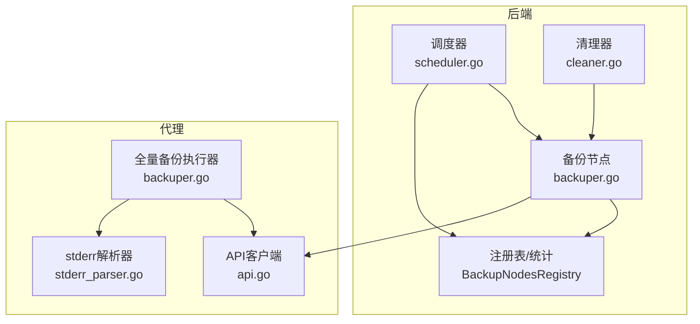
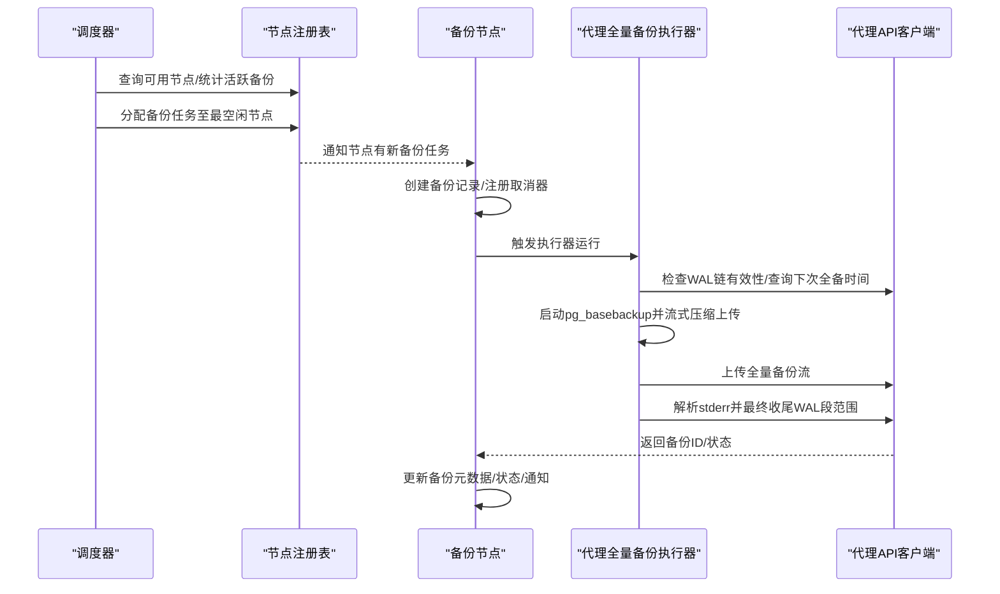
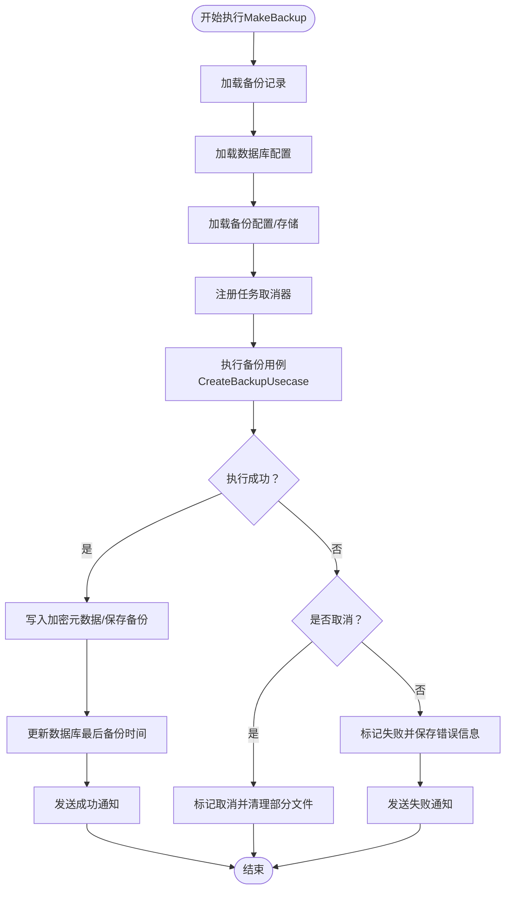
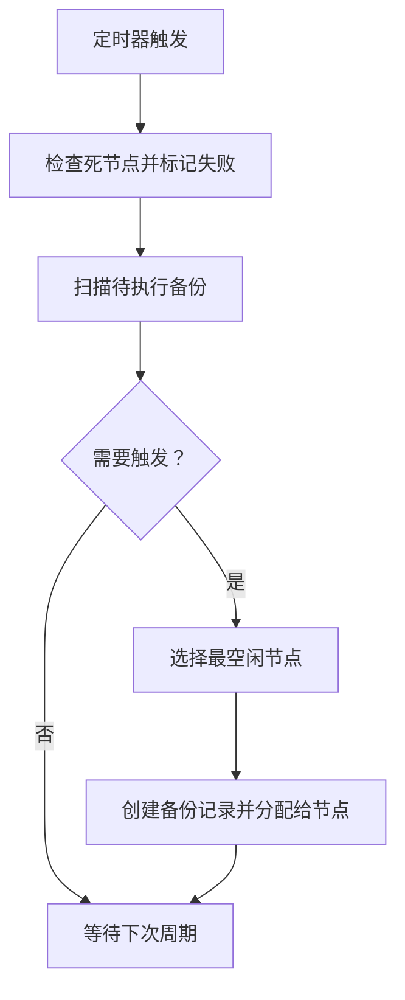
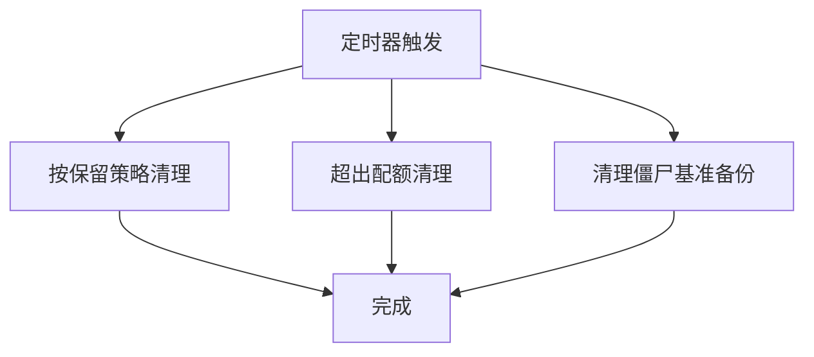
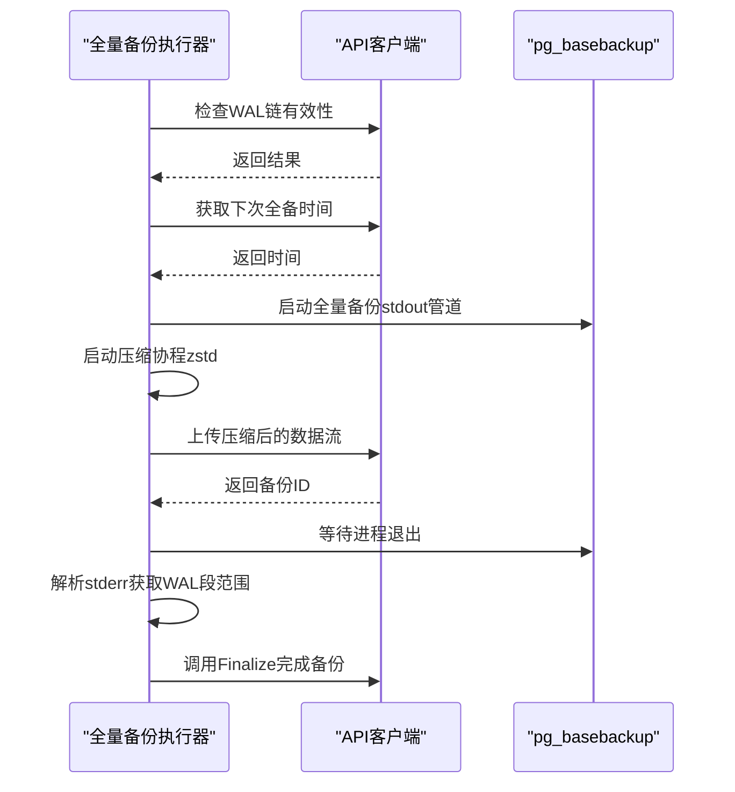
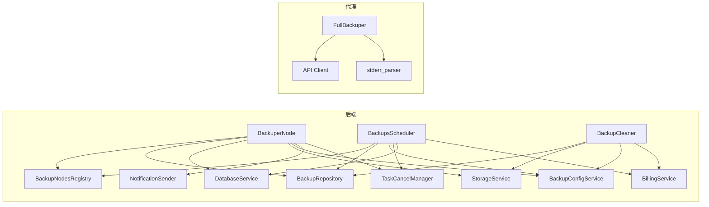

# 备份执行引擎

<cite>
**本文档引用的文件**
- [agent\internal\features\full_backup\backuper.go](file://agent/internal/features/full_backup/backuper.go)
- [agent\internal\features\api\api.go](file://agent/internal/features/api/api.go)
- [agent\internal\features\full_backup\stderr_parser.go](file://agent/internal/features/full_backup/stderr_parser.go)
- [backend\internal\features\backups\backups\backuping\backuper.go](file://backend/internal/features/backups/backups/backuping/backuper.go)
- [backend\internal\features\backups\backups\backuping\scheduler.go](file://backend/internal/features/backups/backups/backuping/scheduler.go)
- [backend\internal\features\backups\backups\backuping\cleaner.go](file://backend/internal/features/backups/backups/backuping/cleaner.go)
- [backend\internal\util\files\cleaner.go](file://backend/internal/util/files/cleaner.go)
- [backend\internal\features\backups\config\interfaces.go](file://backend/internal/features/backups/config/interfaces.go)
- [backend\internal\features\backups\backups\core\interfaces.go](file://backend/internal/features/backups/backups/core/interfaces.go)
</cite>

## 目录
1. [简介](#简介)
2. [项目结构](#项目结构)
3. [核心组件](#核心组件)
4. [架构总览](#架构总览)
5. [详细组件分析](#详细组件分析)
6. [依赖关系分析](#依赖关系分析)
7. [性能考虑](#性能考虑)
8. [故障排查指南](#故障排查指南)
9. [结论](#结论)
10. [附录](#附录)

## 简介
本文件面向Databasus备份执行引擎，系统性梳理后端备份节点、调度器与清理器三类核心组件，以及代理侧全量备份执行流程。内容覆盖：
- 备份协调器（后端）：任务分发、并发控制、资源管理、通知与错误处理
- 调度器（后端）：任务队列管理、优先级与负载均衡、重试策略
- 清理器（后端）：过期备份删除、存储空间回收、磁盘清理策略
- 代理侧全量备份执行：基于PostgreSQL pg_basebackup的流式压缩上传、WAL段解析与收尾
- 生命周期管理：从任务创建到完成的全过程
- 错误处理：失败重试、异常恢复、状态回滚
- 性能监控指标与优化建议
- 与代理服务的通信协议与数据传输机制

## 项目结构
备份执行引擎由“后端”和“代理”两部分协作完成：
- 后端负责任务编排、调度、并发控制、清理与通知
- 代理负责数据库侧的实际备份执行与数据流上传

图表来源
- [backend\internal\features\backups\backups\backuping\scheduler.go:42-94](file://backend/internal/features/backups/backups/backuping/scheduler.go#L42-L94)
- [backend\internal\features\backups\backups\backuping\backuper.go:51-116](file://backend/internal/features/backups/backups/backuping/backuper.go#L51-L116)
- [backend\internal\features\backups\backups\backuping\cleaner.go:37-71](file://backend/internal/features/backups/backups/backuping/cleaner.go#L37-L71)
- [agent\internal\features\full_backup\backuper.go:66-83](file://agent/internal/features/full_backup/backuper.go#L66-L83)
- [agent\internal\features\api\api.go:36-70](file://agent/internal/features/api/api.go#L36-L70)
- [agent\internal\features\full_backup\stderr_parser.go](file://agent/internal/features/full_backup/stderr_parser.go)

章节来源
- [backend\internal\features\backups\backups\backuping\scheduler.go:42-94](file://backend/internal/features/backups/backups/backuping/scheduler.go#L42-L94)
- [backend\internal\features\backups\backups\backuping\backuper.go:51-116](file://backend/internal/features/backups/backups/backuping/backuper.go#L51-L116)
- [backend\internal\features\backups\backups\backuping\cleaner.go:37-71](file://backend/internal/features/backups/backups/backuping/cleaner.go#L37-L71)
- [agent\internal\features\full_backup\backuper.go:66-83](file://agent/internal/features/full_backup/backuper.go#L66-L83)
- [agent\internal\features\api\api.go:36-70](file://agent/internal/features/api/api.go#L36-L70)

## 核心组件
- 后端备份节点（BackuperNode）
  - 订阅备份分配事件，执行具体备份用例，更新进度与状态，发送通知
  - 并发安全：通过原子标志位避免重复执行
- 后端调度器（BackupsScheduler）
  - 周期扫描启用的备份配置，触发新备份；计算最空闲节点进行负载均衡
  - 健康检查与死节点处理，失败重试计数与策略
- 后端清理器（BackupCleaner）
  - 基于保留策略（时间/数量/GFS）与云配额清理旧备份
  - 清理“已上传但未完成”的基准备份，释放存储空间
- 代理全量备份执行器（FullBackuper）
  - 定时检查WAL链有效性与计划备份时间，串行执行单次全量备份
  - 流式zstd压缩上传，超时与空闲超时控制，stderr解析WAL段范围并收尾
- 代理API客户端（Client）
  - 提供WAL链检查、下一次全备时间、错误上报、全量备份上传与收尾等REST接口
  - 针对流式上传使用独立HTTP客户端，避免内存缓冲

章节来源
- [backend\internal\features\backups\backups\backuping\backuper.go:32-49](file://backend/internal/features/backups/backups/backuping/backuper.go#L32-L49)
- [backend\internal\features\backups\backups\backuping\scheduler.go:25-40](file://backend/internal/features/backups/backups/backuping/scheduler.go#L25-L40)
- [backend\internal\features\backups\backups\backuping\cleaner.go:25-35](file://backend/internal/features/backups/backups/backuping/cleaner.go#L25-L35)
- [agent\internal\features\full_backup\backuper.go:46-52](file://agent/internal/features/full_backup/backuper.go#L46-L52)
- [agent\internal\features\api\api.go:36-42](file://agent/internal/features/api/api.go#L36-L42)

## 架构总览
后端与代理通过REST API交互，后端负责任务编排与治理，代理负责数据库侧实际备份执行与数据流上传。

图表来源
- [backend\internal\features\backups\backups\backuping\scheduler.go:178-269](file://backend/internal/features/backups/backups/backuping/scheduler.go#L178-L269)
- [backend\internal\features\backups\backups\backuping\backuper.go:122-360](file://backend/internal/features/backups/backups/backuping/backuper.go#L122-L360)
- [agent\internal\features\full_backup\backuper.go:85-124](file://agent/internal/features/full_backup/backuper.go#L85-L124)
- [agent\internal\features\api\api.go:72-106](file://agent/internal/features/api/api.go#L72-L106)

## 详细组件分析

### 后端备份节点（BackuperNode）
职责与特性
- 节点自注册与心跳：启动时向注册表上报节点信息，周期性发送心跳
- 任务订阅与执行：订阅备份分配事件，异步执行MakeBackup，完成后发布完成消息
- 进度与状态：回调函数实时更新备份大小与耗时，持久化保存
- 错误处理：区分用户取消、系统关闭与一般失败，分别标记状态并清理部分文件
- 通知：根据配置发送成功/失败通知

并发与资源管理
- 使用原子布尔值确保单实例运行
- 通过任务取消管理器注册/注销备份任务上下文，支持取消

图表来源
- [backend\internal\features\backups\backups\backuping\backuper.go:122-360](file://backend/internal/features/backups/backups/backuping/backuper.go#L122-L360)
- [backend\internal\features\backups\backups\core\interfaces.go:21-30](file://backend/internal/features/backups/backups/core/interfaces.go#L21-L30)

章节来源
- [backend\internal\features\backups\backups\backuping\backuper.go:51-116](file://backend/internal/features/backups/backups/backuping/backuper.go#L51-L116)
- [backend\internal\features\backups\backups\backuping\backuper.go:122-360](file://backend/internal/features/backups/backups/backuping/backuper.go#L122-L360)

### 后端调度器（BackupsScheduler）
职责与特性
- 周期扫描：每分钟扫描启用的备份配置，结合上次备份时间与重试剩余次数决定是否触发
- 负载均衡：按“活跃备份数/吞吐量”评分选择最空闲节点
- 死节点检测：若节点不可达，批量标记其所有待执行备份为失败
- 重启恢复：应用启动时将进行中的备份标记为失败并取消，防止悬挂

重试策略
- 基于最近N次备份中失败次数计算剩余重试次数
- 若允许重试且仍有剩余，则强制触发一次备份

图表来源
- [backend\internal\features\backups\backups\backuping\scheduler.go:42-94](file://backend/internal/features/backups/backups/backuping/scheduler.go#L42-L94)
- [backend\internal\features\backups\backups\backuping\scheduler.go:320-397](file://backend/internal/features/backups/backups/backuping/scheduler.go#L320-L397)
- [backend\internal\features\backups\backups\backuping\scheduler.go:442-488](file://backend/internal/features/backups/backups/backuping/scheduler.go#L442-L488)

章节来源
- [backend\internal\features\backups\backups\backuping\scheduler.go:178-269](file://backend/internal/features/backups/backups/backuping/scheduler.go#L178-L269)
- [backend\internal\features\backups\backups\backuping\scheduler.go:275-318](file://backend/internal/features/backups/backups/backuping/scheduler.go#L275-L318)
- [backend\internal\features\backups\backups\backuping\scheduler.go:442-488](file://backend/internal/features/backups/backups/backuping/scheduler.go#L442-L488)

### 后端清理器（BackupCleaner）
职责与特性
- 三种清理策略：
  - 基于保留策略：时间窗口、数量限制、GFS轮转
  - 超出配额清理：云环境按订阅配额限制存储占用
  - 僵尸基准备份：超过10分钟未完成上传的基准备份标记失败并清理
- 保护期：新建备份在60分钟内不被清理，避免误删

图表来源
- [backend\internal\features\backups\backups\backuping\cleaner.go:37-71](file://backend/internal/features/backups/backups/backuping/cleaner.go#L37-L71)
- [backend\internal\features\backups\backups\backuping\cleaner.go:157-183](file://backend/internal/features/backups/backups/backuping/cleaner.go#L157-L183)
- [backend\internal\features\backups\backups\backuping\cleaner.go:185-213](file://backend/internal/features/backups/backups/backuping/cleaner.go#L185-L213)
- [backend\internal\features\backups\backups\backuping\cleaner.go:105-155](file://backend/internal/features/backups/backups/backuping/cleaner.go#L105-L155)

章节来源
- [backend\internal\features\backups\backups\backuping\cleaner.go:157-183](file://backend/internal/features/backups/backups/backuping/cleaner.go#L157-L183)
- [backend\internal\features\backups\backups\backuping\cleaner.go:185-213](file://backend/internal/features/backups/backups/backuping/cleaner.go#L185-L213)
- [backend\internal\features\backups\backups\backuping\cleaner.go:105-155](file://backend/internal/features/backups/backups/backuping/cleaner.go#L105-L155)

### 代理全量备份执行器（FullBackuper）
职责与特性
- 定时检查：每30秒检查WAL链有效性或是否到达计划全备时间
- 单实例执行：通过原子布尔值保证同一时刻仅有一个全量备份在运行
- 流式上传：pg_basebackup输出经zstd压缩后直接通过io.Pipe上传，避免落盘
- 超时与空闲超时：上传过程设置总超时与空闲超时，超时则终止进程并上报
- 收尾：解析stderr中的WAL起止段，调用Finalize接口完成备份

图表来源
- [agent\internal\features\full_backup\backuper.go:85-124](file://agent/internal/features/full_backup/backuper.go#L85-L124)
- [agent\internal\features\full_backup\backuper.go:164-245](file://agent/internal/features/full_backup/backuper.go#L164-L245)
- [agent\internal\features\api\api.go:120-175](file://agent/internal/features/api/api.go#L120-L175)

章节来源
- [agent\internal\features\full_backup\backuper.go:66-83](file://agent/internal/features/full_backup/backuper.go#L66-L83)
- [agent\internal\features\full_backup\backuper.go:126-162](file://agent/internal/features/full_backup/backuper.go#L126-L162)
- [agent\internal\features\full_backup\backuper.go:164-245](file://agent/internal/features/full_backup/backuper.go#L164-L245)

### 代理API客户端（Client）
职责与特性
- REST接口封装：WAL链检查、下次全备时间、错误上报、全量备份上传与收尾、WAL段上传、下载备份文件、版本与二进制下载
- 流式上传：针对大体积数据（全量备份、WAL段）使用独立HTTP客户端，避免Resty默认缓冲
- 重试与鉴权：统一设置超时、最大重试次数与等待时间，自动附加认证头

章节来源
- [agent\internal\features\api\api.go:36-70](file://agent/internal/features/api/api.go#L36-L70)
- [agent\internal\features\api\api.go:120-175](file://agent/internal/features/api/api.go#L120-L175)
- [agent\internal\features\api\api.go:200-242](file://agent/internal/features/api/api.go#L200-L242)

## 依赖关系分析
- 后端组件间耦合
  - BackuperNode依赖备份仓库、数据库服务、存储服务、通知发送器、备份配置、任务取消管理器与节点注册表
  - BackupsScheduler依赖备份仓库、备份配置、任务取消管理器、节点注册表、数据库服务、计费服务
  - BackupCleaner依赖备份仓库、存储服务、备份配置、计费服务、字段加密器
- 代理组件间耦合
  - FullBackuper依赖配置、API客户端、日志
  - API客户端提供REST接口，代理侧stderr解析器用于解析pg_basebackup输出

图表来源
- [backend\internal\features\backups\backups\backuping\backuper.go:32-49](file://backend/internal/features/backups/backups/backuping/backuper.go#L32-L49)
- [backend\internal\features\backups\backups\backuping\scheduler.go:25-40](file://backend/internal/features/backups/backups/backuping/scheduler.go#L25-L40)
- [backend\internal\features\backups\backups\backuping\cleaner.go:25-35](file://backend/internal/features/backups/backups/backuping/cleaner.go#L25-L35)
- [agent\internal\features\full_backup\backuper.go:46-52](file://agent/internal/features/full_backup/backuper.go#L46-L52)
- [agent\internal\features\api\api.go:36-42](file://agent/internal/features/api/api.go#L36-L42)

章节来源
- [backend\internal\features\backups\backups\backuping\backuper.go:32-49](file://backend/internal/features/backups/backups/backuping/backuper.go#L32-L49)
- [backend\internal\features\backups\backups\backuping\scheduler.go:25-40](file://backend/internal/features/backups/backups/backuping/scheduler.go#L25-L40)
- [backend\internal\features\backups\backups\backuping\cleaner.go:25-35](file://backend/internal/features/backups/backups/backuping/cleaner.go#L25-L35)
- [agent\internal\features\full_backup\backuper.go:46-52](file://agent/internal/features/full_backup/backuper.go#L46-L52)

## 性能考虑
- 上传吞吐与并发
  - 后端节点注册表记录每个节点的吞吐量（MB/s），调度器据此进行负载均衡
  - 建议：根据网络带宽与存储IOPS调整节点吞吐配置，避免热点节点过载
- 流式压缩与传输
  - 代理侧采用zstd压缩+io.Pipe直传，减少中间磁盘IO与内存占用
  - 建议：合理设置压缩等级与上传超时，平衡CPU与网络开销
- 心跳与健康检查
  - 调度器与备份节点均具备健康检查阈值，及时发现死节点并转移任务
  - 建议：监控心跳丢失率与备份失败率，动态调整节点权重
- 清理策略
  - GFS策略可显著降低长期存储成本，建议结合业务SLA选择合适保留方案
  - 建议：开启“超出配额清理”，避免存储费用激增

## 故障排查指南
常见问题与处理
- 全量备份卡住或长时间无响应
  - 检查代理上传超时与空闲超时设置，确认网络稳定性
  - 查看stderr解析是否正常，确认WAL段范围是否正确
- 备份失败但未清理部分文件
  - 后端节点在检测到取消时会清理部分文件；如失败，需检查存储权限与可用性
- 死节点导致大量备份失败
  - 调度器会检测并标记死节点上的备份为失败；需恢复节点或迁移任务
- 清理器未按预期删除旧备份
  - 检查保留策略类型与参数、GFS键生成逻辑、近期备份保护期

章节来源
- [agent\internal\features\full_backup\backuper.go:185-245](file://agent/internal/features/full_backup/backuper.go#L185-L245)
- [backend\internal\features\backups\backups\backuping\backuper.go:216-281](file://backend/internal/features/backups/backups/backuping/backuper.go#L216-L281)
- [backend\internal\features\backups\backups\backuping\scheduler.go:551-633](file://backend/internal/features/backups/backups/backuping/scheduler.go#L551-L633)
- [backend\internal\features\backups\backups\backuping\cleaner.go:105-155](file://backend/internal/features/backups/backups/backuping/cleaner.go#L105-L155)

## 结论
Databasus备份执行引擎通过后端调度与节点、清理器与代理执行器的协同，实现了高可用、可扩展、可观测的备份体系。后端负责任务治理与资源调度，代理负责数据库侧高效执行与流式传输。配合灵活的清理策略与健康检查，能够在复杂环境中稳定运行并持续优化性能。

## 附录

### 备份生命周期管理（后端视角）
- 创建：调度器扫描配置，创建备份记录并分配给最空闲节点
- 执行：节点拉取数据库与存储配置，执行备份用例，回调更新进度
- 完成：写入元数据、更新状态、发送通知；失败时区分取消与异常并清理
- 清理：按保留策略与配额定期清理旧备份，处理僵尸基准备份

章节来源
- [backend\internal\features\backups\backups\backuping\scheduler.go:111-269](file://backend/internal/features/backups/backups/backuping/scheduler.go#L111-L269)
- [backend\internal\features\backups\backups\backuping\backuper.go:122-360](file://backend/internal/features/backups/backups/backuping/backuper.go#L122-L360)
- [backend\internal\features\backups\backups\backuping\cleaner.go:157-394](file://backend/internal/features/backups/backups/backuping/cleaner.go#L157-L394)

### 与代理服务的通信协议与数据传输
- REST接口
  - WAL链检查、下次全备时间、错误上报、全量备份上传与收尾、WAL段上传、下载备份文件、版本与二进制下载
- 数据传输
  - 流式上传使用独立HTTP客户端，避免Resty默认缓冲，支持空闲超时与总超时控制
- 错误处理
  - 上传失败时尝试终止进程，解析stderr并返回详细错误信息

章节来源
- [agent\internal\features\api\api.go:72-175](file://agent/internal/features/api/api.go#L72-L175)
- [agent\internal\features\api\api.go:200-358](file://agent/internal/features/api/api.go#L200-L358)
- [agent\internal\features\full_backup\backuper.go:185-245](file://agent/internal/features/full_backup/backuper.go#L185-L245)