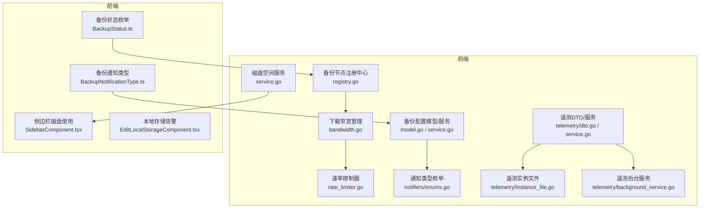
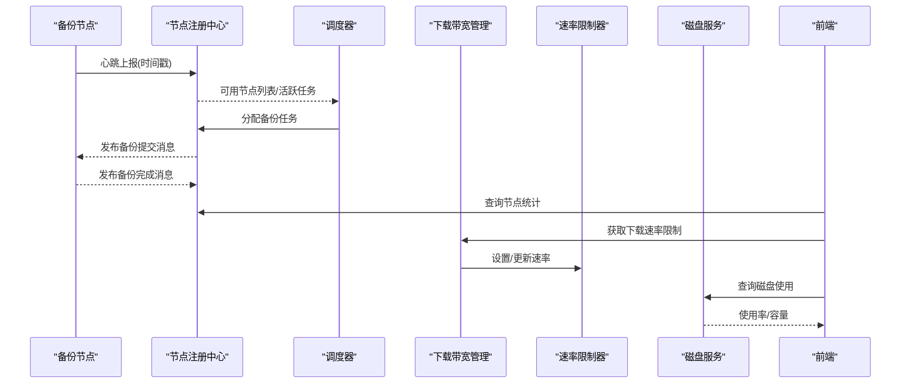
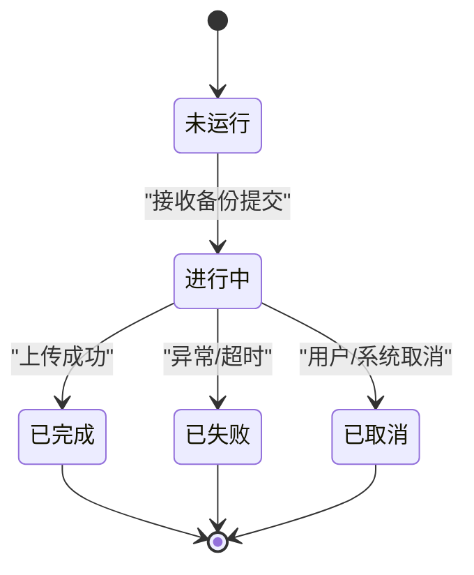
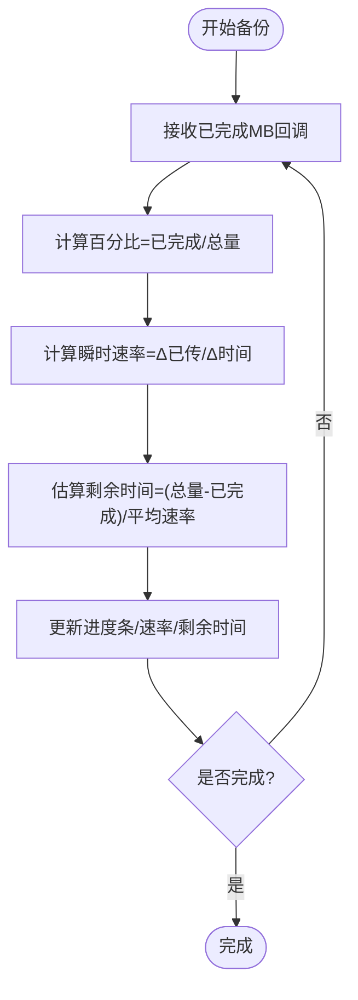
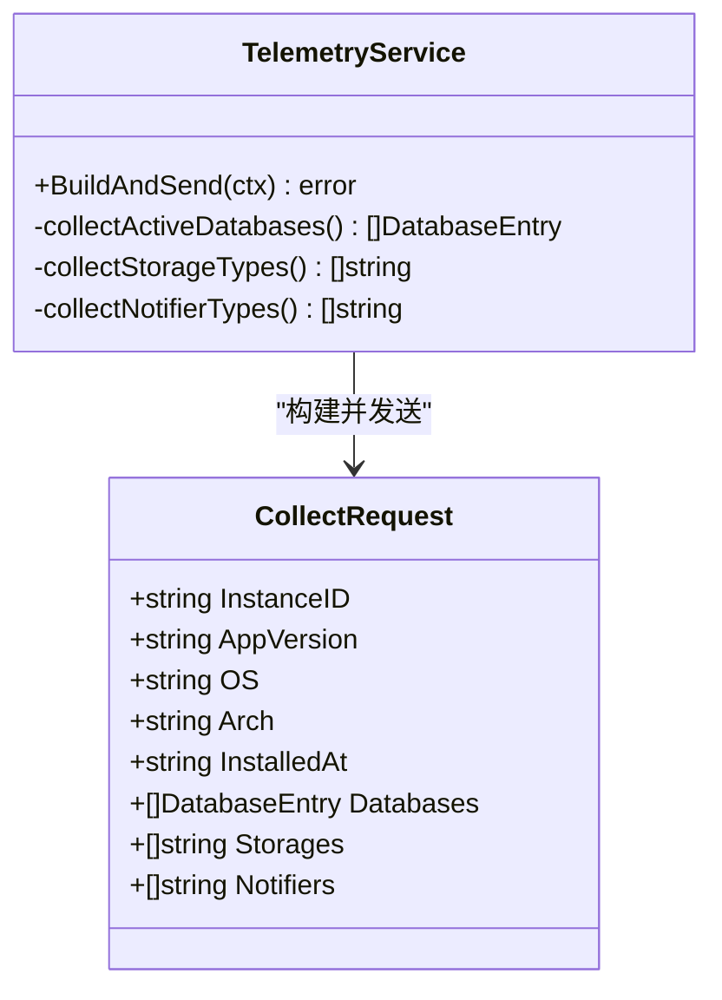
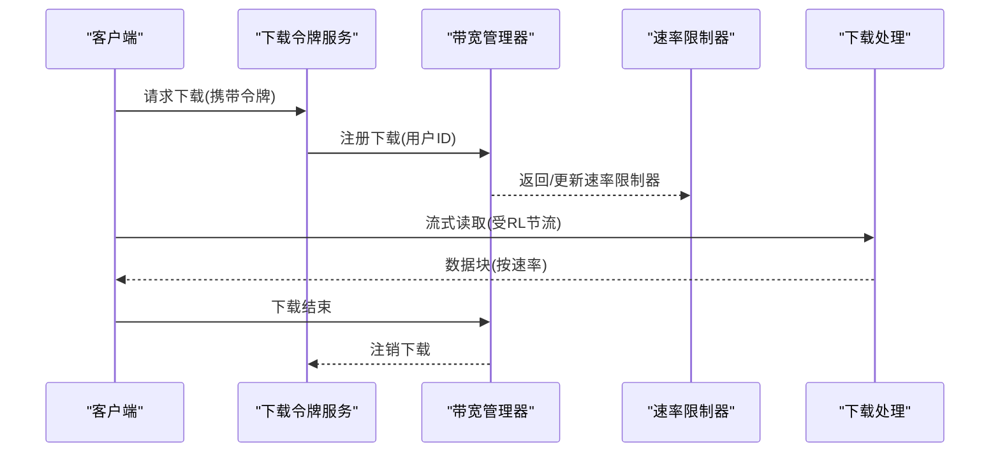
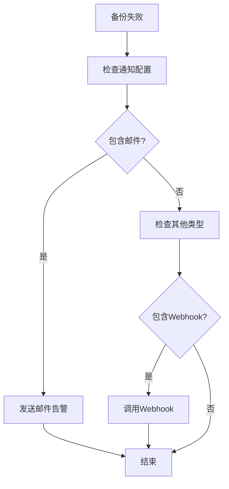
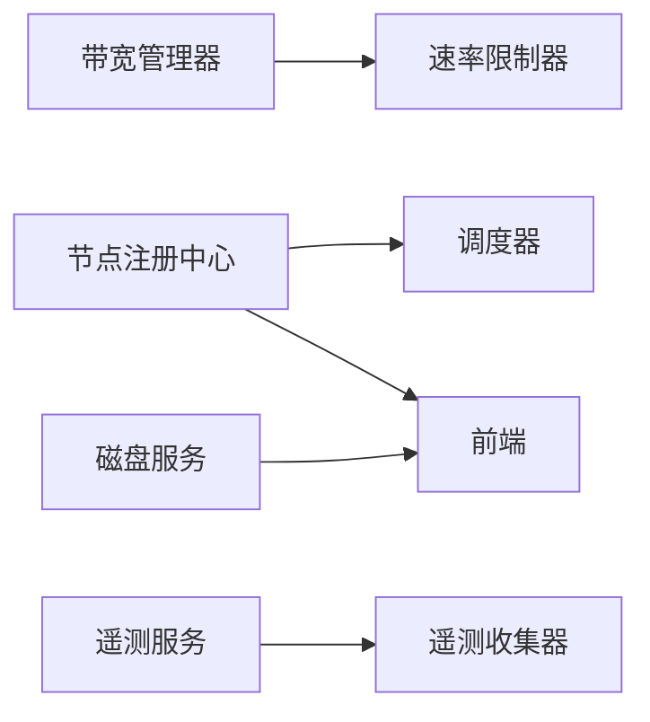

# 备份监控系统

<cite>
**本文档引用的文件**
- [registry.go](file://backend/internal/features/backups/backups/backuping/registry.go)
- [registry_test.go](file://backend/internal/features/backups/backups/backuping/registry_test.go)
- [bandwidth.go](file://backend/internal/features/backups/backups/download/bandwidth.go)
- [rate_limiter.go](file://backend/internal/features/backups/backups/download/rate_limiter.go)
- [di.go](file://backend/internal/features/backups/backups/download/di.go)
- [service.go](file://backend/internal/features/disk/service.go)
- [controller_test.go](file://backend/internal/features/backups/backups/controllers/controller_test.go)
- [model.go](file://backend/internal/features/backups/config/model.go)
- [service.go](file://backend/internal/features/backups/config/service.go)
- [enums.go](file://backend/internal/features/backups/config/enums.go)
- [enums.go](file://backend/internal/features/notifiers/enums.go)
- [dto.go](file://backend/internal/features/telemetry/dto.go)
- [service.go](file://backend/internal/features/telemetry/service.go)
- [instance_file.go](file://backend/internal/features/telemetry/instance_file.go)
- [background_service.go](file://backend/internal/features/telemetry/background_service.go)
- [client_test.go](file://backend/internal/features/telemetry/client_test.go)
- [BackupStatus.ts](file://frontend/src/entity/backups/model/BackupStatus.ts)
- [BackupNotificationType.ts](file://frontend/src/entity/backups/model/BackupNotificationType.ts)
- [SidebarComponent.tsx](file://frontend/src/widgets/main/SidebarComponent.tsx)
- [EditLocalStorageComponent.tsx](file://frontend/src/features/storages/ui/edit/storages/EditLocalStorageComponent.tsx)
</cite>

## 目录
1. [简介](#简介)
2. [项目结构](#项目结构)
3. [核心组件](#核心组件)
4. [架构总览](#架构总览)
5. [详细组件分析](#详细组件分析)
6. [依赖分析](#依赖分析)
7. [性能考虑](#性能考虑)
8. [故障排查指南](#故障排查指南)
9. [结论](#结论)
10. [附录](#附录)

## 简介
本文件面向Databasus备份监控系统，围绕备份状态跟踪、进度监控、性能指标采集、下载监控（含断点续传、带宽限制、并发下载控制）、告警机制（失败通知、性能警告、存储空间预警）以及监控数据可视化与报表生成进行系统化说明，并给出可扩展性设计与自定义指标支持建议。

## 项目结构
Databasus由后端Go服务、前端React界面、代理Agent三部分组成。监控相关能力主要分布在后端的备份调度与节点注册中心、下载带宽管理、磁盘空间监控、遥测与告警等模块；前端负责状态展示与用户交互。

**图表来源**
- [registry.go:1-627](file://backend/internal/features/backups/backups/backuping/registry.go#L1-L627)
- [bandwidth.go:1-81](file://backend/internal/features/backups/backups/download/bandwidth.go#L1-L81)
- [rate_limiter.go:1-100](file://backend/internal/features/backups/backups/download/rate_limiter.go#L1-L100)
- [service.go:1-58](file://backend/internal/features/disk/service.go#L1-L58)
- [model.go:1-156](file://backend/internal/features/backups/config/model.go#L1-L156)
- [service.go:1-381](file://backend/internal/features/backups/config/service.go#L1-L381)
- [enums.go:1-13](file://backend/internal/features/notifiers/enums.go#L1-L13)
- [dto.go:1-17](file://backend/internal/features/telemetry/dto.go#L1-L17)
- [service.go:50-106](file://backend/internal/features/telemetry/service.go#L50-L106)
- [instance_file.go:1-82](file://backend/internal/features/telemetry/instance_file.go#L1-L82)
- [background_service.go:52-109](file://backend/internal/features/telemetry/background_service.go#L52-L109)
- [BackupStatus.ts:1-7](file://frontend/src/entity/backups/model/BackupStatus.ts#L1-L7)
- [BackupNotificationType.ts:1-4](file://frontend/src/entity/backups/model/BackupNotificationType.ts#L1-L4)
- [SidebarComponent.tsx:161-189](file://frontend/src/widgets/main/SidebarComponent.tsx#L161-L189)
- [EditLocalStorageComponent.tsx:1-14](file://frontend/src/features/storages/ui/edit/storages/EditLocalStorageComponent.tsx#L1-L14)

**章节来源**
- [registry.go:1-627](file://backend/internal/features/backups/backups/backuping/registry.go#L1-L627)
- [bandwidth.go:1-81](file://backend/internal/features/backups/backups/download/bandwidth.go#L1-L81)
- [rate_limiter.go:1-100](file://backend/internal/features/backups/backups/download/rate_limiter.go#L1-L100)
- [service.go:1-58](file://backend/internal/features/disk/service.go#L1-L58)
- [model.go:1-156](file://backend/internal/features/backups/config/model.go#L1-L156)
- [service.go:1-381](file://backend/internal/features/backups/config/service.go#L1-L381)
- [enums.go:1-13](file://backend/internal/features/notifiers/enums.go#L1-L13)
- [dto.go:1-17](file://backend/internal/features/telemetry/dto.go#L1-L17)
- [service.go:50-106](file://backend/internal/features/telemetry/service.go#L50-L106)
- [instance_file.go:1-82](file://backend/internal/features/telemetry/instance_file.go#L1-L82)
- [background_service.go:52-109](file://backend/internal/features/telemetry/background_service.go#L52-L109)
- [BackupStatus.ts:1-7](file://frontend/src/entity/backups/model/BackupStatus.ts#L1-L7)
- [BackupNotificationType.ts:1-4](file://frontend/src/entity/backups/model/BackupNotificationType.ts#L1-L4)
- [SidebarComponent.tsx:161-189](file://frontend/src/widgets/main/SidebarComponent.tsx#L161-L189)
- [EditLocalStorageComponent.tsx:1-14](file://frontend/src/features/storages/ui/edit/storages/EditLocalStorageComponent.tsx#L1-L14)

## 核心组件
- 备份节点注册中心：维护节点心跳、可用节点列表、活跃任务计数、发布/订阅备份提交与完成消息。
- 下载带宽管理：集中式带宽限额与动态分配，支持多并发下载共享与重平衡。
- 速率限制器：基于令牌桶的流控实现，支撑下载限速与突发控制。
- 磁盘空间监控：跨平台获取磁盘使用情况，用于存储空间预警。
- 配置与通知：备份配置模型、通知类型枚举、通知策略。
- 遥测与实例：匿名遥测数据收集、实例标识持久化、周期性上报与退避重试。
- 前端状态与告警：备份状态枚举、通知类型、磁盘使用展示与本地存储风险提示。

**章节来源**
- [registry.go:30-45](file://backend/internal/features/backups/backups/backuping/registry.go#L30-L45)
- [bandwidth.go:10-31](file://backend/internal/features/backups/backups/download/bandwidth.go#L10-L31)
- [rate_limiter.go:9-28](file://backend/internal/features/backups/backups/download/rate_limiter.go#L9-L28)
- [service.go:15-48](file://backend/internal/features/disk/service.go#L15-L48)
- [model.go:16-44](file://backend/internal/features/backups/config/model.go#L16-L44)
- [enums.go:3-12](file://backend/internal/features/notifiers/enums.go#L3-L12)
- [dto.go:3-17](file://backend/internal/features/telemetry/dto.go#L3-L17)
- [instance_file.go:13-16](file://backend/internal/features/telemetry/instance_file.go#L13-L16)
- [background_service.go:66-82](file://backend/internal/features/telemetry/background_service.go#L66-L82)
- [BackupStatus.ts:1-7](file://frontend/src/entity/backups/model/BackupStatus.ts#L1-L7)
- [BackupNotificationType.ts:1-4](file://frontend/src/entity/backups/model/BackupNotificationType.ts#L1-L4)
- [SidebarComponent.tsx:170-186](file://frontend/src/widgets/main/SidebarComponent.tsx#L170-L186)
- [EditLocalStorageComponent.tsx:6-9](file://frontend/src/features/storages/ui/edit/storages/EditLocalStorageComponent.tsx#L6-L9)

## 架构总览
下图展示了备份监控的关键交互路径：备份节点通过注册中心上报心跳并统计活跃任务；下载请求经带宽管理器分配速率限制器；磁盘使用信息用于前端预警；遥测服务周期性收集并上报实例与环境信息。

**图表来源**
- [registry.go:293-344](file://backend/internal/features/backups/backups/backuping/registry.go#L293-L344)
- [registry.go:346-409](file://backend/internal/features/backups/backups/backuping/registry.go#L346-L409)
- [registry.go:411-454](file://backend/internal/features/backups/backups/backuping/registry.go#L411-L454)
- [bandwidth.go:33-51](file://backend/internal/features/backups/backups/download/bandwidth.go#L33-L51)
- [rate_limiter.go:30-44](file://backend/internal/features/backups/backups/download/rate_limiter.go#L30-L44)
- [service.go:15-48](file://backend/internal/features/disk/service.go#L15-L48)
- [SidebarComponent.tsx:170-186](file://frontend/src/widgets/main/SidebarComponent.tsx#L170-L186)

## 详细组件分析

### 备份状态跟踪机制
- 状态枚举：前端定义了备份状态集合，覆盖进行中、已完成、失败、删除、取消等。
- 节点注册中心：通过心跳阈值过滤不健康节点，聚合活跃备份任务计数，提供节点统计查询。
- 实时更新：通过发布/订阅通道向调度器与前端推送任务分配与完成事件。

**图表来源**
- [BackupStatus.ts:1-7](file://frontend/src/entity/backups/model/BackupStatus.ts#L1-L7)
- [registry.go:346-409](file://backend/internal/features/backups/backups/backuping/registry.go#L346-L409)
- [registry.go:411-454](file://backend/internal/features/backups/backups/backuping/registry.go#L411-L454)

**章节来源**
- [BackupStatus.ts:1-7](file://frontend/src/entity/backups/model/BackupStatus.ts#L1-L7)
- [registry.go:149-243](file://backend/internal/features/backups/backups/backuping/registry.go#L149-L243)
- [registry_test.go:176-220](file://backend/internal/features/backups/backups/backuping/registry_test.go#L176-L220)

### 进度监控实现
- 百分比计算：后端在备份用例执行过程中回调进度监听器，传递已完成MB数；前端根据总大小计算百分比。
- 剩余时间估算：基于当前速率与剩余字节估算；当速率不稳定时可采用滑动窗口平均。
- 传输速率监控：节点注册中心记录吞吐量字段；下载侧通过速率限制器输出实时速率。

**图表来源**
- [registry_test.go:261-263](file://backend/internal/features/backups/backups/backuping/registry_test.go#L261-L263)
- [rate_limiter.go:46-75](file://backend/internal/features/backups/backups/download/rate_limiter.go#L46-L75)

**章节来源**
- [registry_test.go:261-263](file://backend/internal/features/backups/backups/backuping/registry_test.go#L261-L263)
- [rate_limiter.go:46-75](file://backend/internal/features/backups/backups/download/rate_limiter.go#L46-L75)

### 性能指标收集
- CPU/内存：可通过系统库或进程级采样器定期采集（本仓库未直接实现，建议在Agent层扩展）。
- I/O吞吐量：结合备份工具输出解析与速率限制器统计，可推导出实际写入速率。
- 网络带宽：下载带宽管理器按节点并发动态分配，可作为网络使用参考。
- 遥测数据：收集实例ID、应用版本、操作系统、架构、安装日期、数据库类型/版本、存储类型、通知类型等，用于宏观分析。

**图表来源**
- [service.go:75-106](file://backend/internal/features/telemetry/service.go#L75-L106)
- [dto.go:8-17](file://backend/internal/features/telemetry/dto.go#L8-L17)

**章节来源**
- [service.go:75-106](file://backend/internal/features/telemetry/service.go#L75-L106)
- [dto.go:3-17](file://backend/internal/features/telemetry/dto.go#L3-L17)
- [instance_file.go:31-81](file://backend/internal/features/telemetry/instance_file.go#L31-L81)
- [background_service.go:66-82](file://backend/internal/features/telemetry/background_service.go#L66-L82)

### 下载监控功能
- 断点续传：下载令牌服务负责令牌签发与清理，配合带宽管理器实现并发控制与速率限制。
- 带宽限制：全局节点网络吞吐量配置，按并发数动态分配给每个下载会话。
- 并发下载控制：带宽管理器维护活动下载映射，注册/注销时重新计算每会话速率。

**图表来源**
- [di.go:19-38](file://backend/internal/features/backups/backups/download/di.go#L19-L38)
- [bandwidth.go:33-51](file://backend/internal/features/backups/backups/download/bandwidth.go#L33-L51)
- [rate_limiter.go:77-99](file://backend/internal/features/backups/backups/download/rate_limiter.go#L77-L99)
- [controller_test.go:1797-1804](file://backend/internal/features/backups/backups/controllers/controller_test.go#L1797-L1804)
- [controller_test.go:1882-1930](file://backend/internal/features/backups/backups/controllers/controller_test.go#L1882-L1930)

**章节来源**
- [di.go:19-38](file://backend/internal/features/backups/backups/download/di.go#L19-L38)
- [bandwidth.go:33-51](file://backend/internal/features/backups/backups/download/bandwidth.go#L33-L51)
- [rate_limiter.go:30-44](file://backend/internal/features/backups/backups/download/rate_limiter.go#L30-L44)
- [rate_limiter.go:77-99](file://backend/internal/features/backups/backups/download/rate_limiter.go#L77-L99)
- [controller_test.go:1797-1804](file://backend/internal/features/backups/backups/controllers/controller_test.go#L1797-L1804)
- [controller_test.go:1882-1930](file://backend/internal/features/backups/backups/controllers/controller_test.go#L1882-L1930)

### 告警机制
- 失败通知：备份配置模型支持“失败/成功”两类通知类型，便于在失败时触发告警。
- 存储空间预警：磁盘服务提供使用率，前端侧边栏以颜色区分高占用并提示风险。
- 通知类型：通知类型枚举涵盖邮件、Telegram、Webhook、Slack、Discord、Teams等。

**图表来源**
- [model.go:37-41](file://backend/internal/features/backups/config/model.go#L37-L41)
- [enums.go:3-12](file://backend/internal/features/notifiers/enums.go#L3-L12)
- [SidebarComponent.tsx:170-186](file://frontend/src/widgets/main/SidebarComponent.tsx#L170-L186)
- [EditLocalStorageComponent.tsx:6-9](file://frontend/src/features/storages/ui/edit/storages/EditLocalStorageComponent.tsx#L6-L9)

**章节来源**
- [model.go:37-41](file://backend/internal/features/backups/config/model.go#L37-L41)
- [enums.go:3-12](file://backend/internal/features/notifiers/enums.go#L3-L12)
- [SidebarComponent.tsx:170-186](file://frontend/src/widgets/main/SidebarComponent.tsx#L170-L186)
- [EditLocalStorageComponent.tsx:6-9](file://frontend/src/features/storages/ui/edit/storages/EditLocalStorageComponent.tsx#L6-L9)

### 监控数据可视化与报表生成
- 节点与任务统计：注册中心提供节点活跃任务统计，可用于折线图/柱状图展示。
- 下载并发与速率：带宽管理器可输出每会话速率与并发数，形成实时仪表盘。
- 磁盘使用：前端侧边栏展示使用量与占比，支持阈值告警。
- 遥测报表：遥测服务收集的环境与配置数据可用于趋势分析与合规报表。

**章节来源**
- [registry.go:149-243](file://backend/internal/features/backups/backups/backuping/registry.go#L149-L243)
- [bandwidth.go:61-65](file://backend/internal/features/backups/backups/download/bandwidth.go#L61-L65)
- [SidebarComponent.tsx:170-186](file://frontend/src/widgets/main/SidebarComponent.tsx#L170-L186)
- [service.go:75-106](file://backend/internal/features/telemetry/service.go#L75-L106)

### 可扩展性设计与自定义指标
- 指标扩展：在遥测DTO中新增字段，如自定义标签、业务指标等；在服务端扩展收集函数。
- 通知扩展：在通知类型枚举中增加新类型，配套后端适配器与前端UI。
- 采集扩展：在Agent层增加系统/应用指标采集器，统一上报格式。

**章节来源**
- [dto.go:8-17](file://backend/internal/features/telemetry/dto.go#L8-L17)
- [enums.go:3-12](file://backend/internal/features/notifiers/enums.go#L3-L12)

## 依赖分析
- 组件耦合：下载带宽管理器与速率限制器紧密耦合；注册中心与调度器通过发布/订阅解耦。
- 外部依赖：Valkey用于节点信息与计数缓存；gopsutil用于磁盘使用；前端依赖Ant Design图标与主题。

**图表来源**
- [bandwidth.go:10-31](file://backend/internal/features/backups/backups/download/bandwidth.go#L10-L31)
- [rate_limiter.go:9-28](file://backend/internal/features/backups/backups/download/rate_limiter.go#L9-L28)
- [registry.go:346-409](file://backend/internal/features/backups/backups/backuping/registry.go#L346-L409)
- [service.go:15-48](file://backend/internal/features/disk/service.go#L15-L48)
- [service.go:75-106](file://backend/internal/features/telemetry/service.go#L75-L106)

**章节来源**
- [bandwidth.go:10-31](file://backend/internal/features/backups/backups/download/bandwidth.go#L10-L31)
- [rate_limiter.go:9-28](file://backend/internal/features/backups/backups/download/rate_limiter.go#L9-L28)
- [registry.go:346-409](file://backend/internal/features/backups/backups/backuping/registry.go#L346-L409)
- [service.go:15-48](file://backend/internal/features/disk/service.go#L15-L48)
- [service.go:75-106](file://backend/internal/features/telemetry/service.go#L75-L106)

## 性能考虑
- 缓存与批处理：注册中心使用Valkey扫描与管道批量读取，降低网络往返开销。
- 动态速率分配：带宽管理器按活动下载数动态重算每会话速率，避免拥塞。
- 退避重试：遥测后台服务对失败请求采用指数退避与抖动，提升稳定性。
- 前端渲染：磁盘使用信息按需展示，避免频繁刷新造成卡顿。

**章节来源**
- [registry.go:479-511](file://backend/internal/features/backups/backups/backuping/registry.go#L479-L511)
- [bandwidth.go:67-81](file://backend/internal/features/backups/backups/download/bandwidth.go#L67-L81)
- [background_service.go:66-82](file://backend/internal/features/telemetry/background_service.go#L66-L82)
- [SidebarComponent.tsx:170-186](file://frontend/src/widgets/main/SidebarComponent.tsx#L170-L186)

## 故障排查指南
- 节点不在线：检查心跳时间戳与阈值，确认节点是否存活；必要时清理死节点键。
- 下载速率异常：核对全局吞吐量配置与并发数，查看带宽管理器与速率限制器状态。
- 磁盘空间不足：关注前端磁盘使用提示，及时扩容或清理。
- 遥测失败：查看后台服务日志与退避间隔，确认网络连通性与目标地址可达性。

**章节来源**
- [registry.go:523-626](file://backend/internal/features/backups/backups/backuping/registry.go#L523-L626)
- [bandwidth.go:33-51](file://backend/internal/features/backups/backups/download/bandwidth.go#L33-L51)
- [rate_limiter.go:46-75](file://backend/internal/features/backups/backups/download/rate_limiter.go#L46-L75)
- [SidebarComponent.tsx:170-186](file://frontend/src/widgets/main/SidebarComponent.tsx#L170-L186)
- [background_service.go:66-82](file://backend/internal/features/telemetry/background_service.go#L66-L82)

## 结论
Databasus备份监控系统通过节点注册中心、下载带宽管理、磁盘监控与遥测服务实现了从任务调度到实时可视化的完整闭环。现有机制支持状态跟踪、进度估算、带宽控制与存储预警；通过扩展遥测与通知类型，可进一步完善性能指标与告警体系，满足生产环境的可观测性需求。

## 附录
- 建议新增：系统/应用指标采集器（CPU/内存/I/O），在Agent层实现并统一上报。
- 建议新增：备份任务耗时与成功率统计报表，结合遥测数据生成趋势图。
- 建议新增：自定义通知模板与条件过滤，提升告警灵活性。