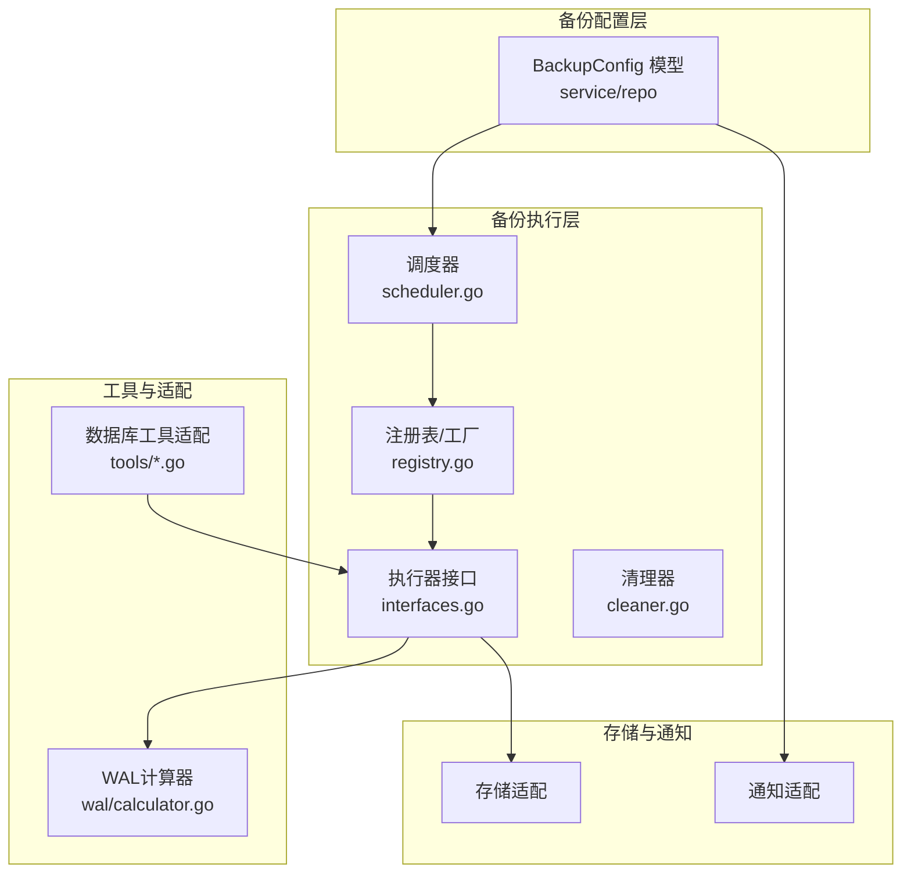
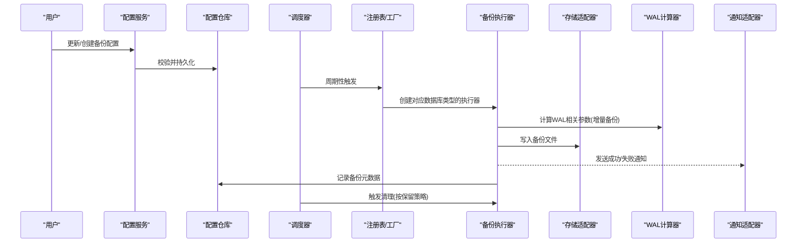
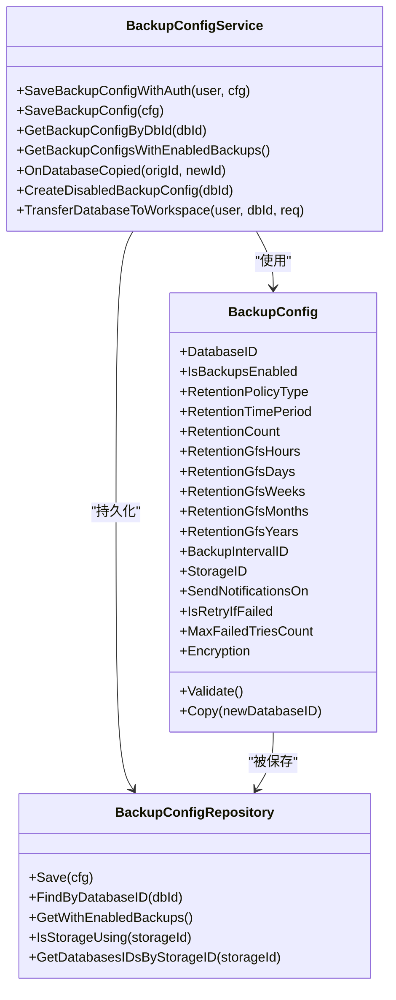
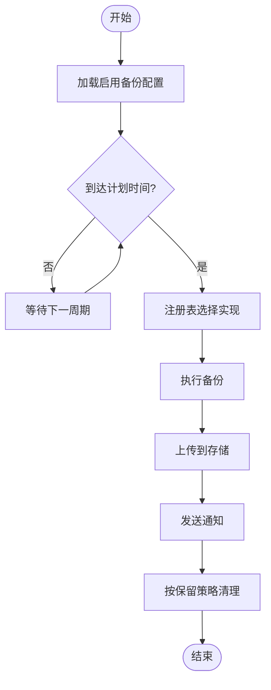
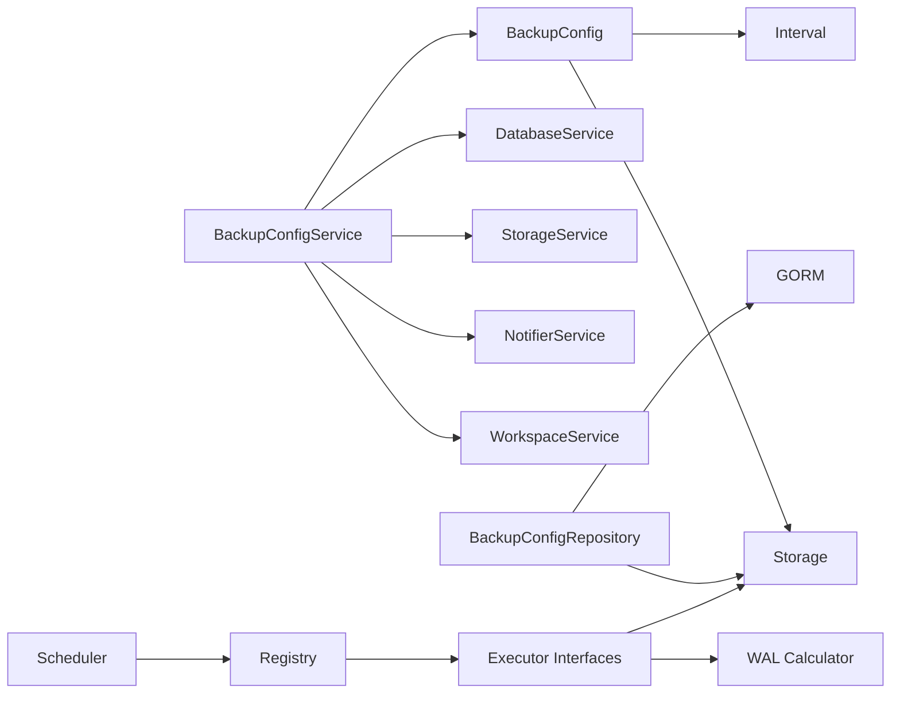

# 备份策略设计

<cite>
**本文引用的文件**
- [model.go](file://backend/internal/features/backups/config/model.go)
- [dto.go](file://backend/internal/features/backups/config/dto.go)
- [enums.go](file://backend/internal/features/backups/config/enums.go)
- [service.go](file://backend/internal/features/backups/config/service.go)
- [repository.go](file://backend/internal/features/backups/config/repository.go)
- [backuper.go](file://backend/internal/featurse/backups/backups/backuping/backuper.go)
- [scheduler.go](file://backend/internal/featurse/backups/backups/backuping/scheduler.go)
- [interfaces.go](file://backend/internal/featurse/backups/backups/backuping/interfaces.go)
- [dto.go](file://backend/internal/featurse/backups/backups/backuping/dto.go)
- [registry.go](file://backend/internal/featurse/backups/backups/backuping/registry.go)
- [cleaner.go](file://backend/internal/featurse/backups/backups/backuping/cleaner.go)
- [common/dto.go](file://backend/internal/featurse/backups/backups/common/dto.go)
- [common/interfaces.go](file://backend/internal/featurse/backups/backups/common/interfaces.go)
- [mysql.go](file://backend/internal/util/tools/mysql.go)
- [mariadb.go](file://backend/internal/util/tools/mariadb.go)
- [mongodb.go](file://backend/internal/util/tools/mongodb.go)
- [postgresql.go](file://backend/internal/util/tools/postgresql.go)
- [wal/calculator.go](file://backend/internal/util/wal/calculator.go)
- [wal/calculator_test.go](file://backend/internal/util/wal/calculator_test.go)
- [20260101200438_add_backup_format.sql](file://backend/migrations/20260101200438_add_backup_format.sql)
- [20260306045548_add_wal_properties.sql](file://backend/migrations/20260306045548_add_wal_properties.sql)
- [20260119124334_add_backup_size_limits.sql](file://backend/migrations/20260119124334_add_backup_size_limits.sql)
- [20260122134856_add_database_plans_table.sql](file://backend/migrations/20260122134856_add_database_plans_table.sql)
- [20260220111333_add_retention_policy.sql](file://backend/migrations/20260220111333_add_retention_policy.sql)
- [20260227132617_add_cascade_delete_for_backups_and_databases.sql](file://backend/migrations/20260227132617_add_cascade_delete_for_backups_and_databases.sql)
- [20260311094356_add_is_zstd_supported_to_mysql.sql](file://backend/migrations/20260311094356_add_is_zstd_supported_to_mysql.sql)
- [20260316151706_add_upload_completed_at.sql](file://backend/migrations/20260316151706_add_upload_completed_at.sql)
- [20260326130504_add_billing.sql](file://backend/migrations/20260326130504_add_billing.sql)
- [20260402055223_add_storage_class_to_s3.sql](file://backend/migrations/20260402055223_add_storage_class_to_s3.sql)
</cite>

## 目录
1. [引言](#引言)
2. [项目结构](#项目结构)
3. [核心组件](#核心组件)
4. [架构总览](#架构总览)
5. [详细组件分析](#详细组件分析)
6. [依赖关系分析](#依赖关系分析)
7. [性能考虑](#性能考虑)
8. [故障排查指南](#故障排查指南)
9. [结论](#结论)
10. [附录](#附录)

## 引言
本文件面向Databasus备份策略设计，系统化阐述三类备份类型的实现原理与适用场景，并给出配置参数、策略选择原则、不同数据库类型的最优实践、性能影响与成本效益评估。Databasus通过“配置驱动+调度执行+清理回收”的架构，支持逻辑备份、物理备份与增量备份（结合WAL归档）的统一管理。

## 项目结构
后端采用分层与功能域划分：备份配置模型与服务位于backups/config；备份执行框架在backups/backuping；通用工具与数据库适配在util/tools；WAL计算工具在util/wal；数据库类型适配器在databases子域；存储适配在storages子域；通知在notifiers子域；迁移脚本在migrations中。

图示来源
- [service.go:17-32](file://backend/internal/features/backups/config/service.go#L17-L32)
- [scheduler.go:1-200](file://backend/internal/featurse/backups/backups/backuping/scheduler.go)
- [registry.go:1-200](file://backend/internal/featurse/backups/backups/backuping/registry.go)
- [interfaces.go:1-200](file://backend/internal/featurse/backups/backups/backuping/interfaces.go)
- [cleaner.go:1-200](file://backend/internal/featurse/backups/backups/backuping/cleaner.go)
- [mysql.go:1-200](file://backend/internal/util/tools/mysql.go)
- [mariadb.go:1-200](file://backend/internal/util/tools/mariadb.go)
- [mongodb.go:1-200](file://backend/internal/util/tools/mongodb.go)
- [postgresql.go:1-200](file://backend/internal/util/tools/postgresql.go)
- [wal/calculator.go:1-200](file://backend/internal/util/wal/calculator.go)

章节来源
- [service.go:17-32](file://backend/internal/features/backups/config/service.go#L17-L32)
- [repository.go:12-56](file://backend/internal/features/backups/config/repository.go#L12-L56)

## 核心组件
- 备份配置模型与校验：定义备份启用开关、保留策略、通知类型、重试机制、加密等字段，并在保存前进行完整性与合规性校验。
- 配置服务：负责鉴权、权限校验、默认配置初始化、存储变更监听、工作区转移等。
- 执行框架：注册表/工厂按数据库类型选择具体备份实现；调度器根据配置周期触发；清理器按保留策略回收旧备份。
- 工具与适配：各数据库工具函数封装命令行调用、参数拼装、版本兼容处理；WAL计算器用于增量备份的时间点估算。
- 存储与通知：通过存储适配器抽象S3、本地、NAS、Azure Blob、Google Drive、Rclone、FTP/SFTP等；通知适配器支持邮件、Webhook、Slack、Teams、Discord等。

章节来源
- [model.go:16-44](file://backend/internal/features/backups/config/model.go#L16-L44)
- [enums.go:3-24](file://backend/internal/features/backups/config/enums.go#L3-L24)
- [service.go:44-109](file://backend/internal/features/backups/config/service.go#L44-L109)
- [repository.go:58-83](file://backend/internal/features/backups/config/repository.go#L58-L83)

## 架构总览
下图展示从配置到执行再到清理的整体流程，以及与存储、通知、数据库工具的交互。

图示来源
- [service.go:82-109](file://backend/internal/features/backups/config/service.go#L82-L109)
- [scheduler.go:1-200](file://backend/internal/featurse/backups/backups/backuping/scheduler.go)
- [registry.go:1-200](file://backend/internal/featurse/backups/backups/backuping/registry.go)
- [interfaces.go:1-200](file://backend/internal/featurse/backups/backups/backuping/interfaces.go)
- [cleaner.go:1-200](file://backend/internal/featurse/backups/backups/backuping/cleaner.go)

## 详细组件分析

### 备份配置模型与策略
- 字段要点
  - 启用开关：控制是否参与调度与执行。
  - 保留策略：支持按时间周期、数量、GFS（黄金文件系统）三种模式，确保成本与合规平衡。
  - 通知类型：可配置备份成功或失败的通知。
  - 重试机制：失败自动重试次数限制，避免无限占用资源。
  - 加密：云存储强制加密，保障数据安全。
- 默认初始化：未配置时自动创建默认配置，包含每日定时、3个月保留、双通知、最多3次重试等。
- 权限与工作区：保存配置需具备相应工作区权限，且存储归属需与数据库工作区一致或为系统存储。

图示来源
- [model.go:16-130](file://backend/internal/features/backups/config/model.go#L16-L130)
- [service.go:44-192](file://backend/internal/features/backups/config/service.go#L44-L192)
- [repository.go:14-83](file://backend/internal/features/backups/config/repository.go#L14-L83)

章节来源
- [model.go:83-156](file://backend/internal/features/backups/config/model.go#L83-L156)
- [service.go:299-323](file://backend/internal/features/backups/config/service.go#L299-L323)
- [repository.go:108-136](file://backend/internal/features/backups/config/repository.go#L108-L136)

### 备份执行框架
- 注册表/工厂：依据数据库类型与版本选择合适的备份实现（逻辑/物理/增量），并注入存储与通知依赖。
- 调度器：读取启用备份的配置集合，按周期触发执行；支持并发度与超时控制。
- 清理器：根据保留策略（时间/数量/GFS）删除过期备份，释放存储空间。
- 通用DTO与接口：统一备份任务、状态、结果的数据结构与回调接口。

图示来源
- [scheduler.go:1-200](file://backend/internal/featurse/backups/backups/backuping/scheduler.go)
- [registry.go:1-200](file://backend/internal/featurse/backups/backups/backuping/registry.go)
- [interfaces.go:1-200](file://backend/internal/featurse/backups/backups/backuping/interfaces.go)
- [cleaner.go:1-200](file://backend/internal/featurse/backups/backups/backuping/cleaner.go)

章节来源
- [scheduler.go:1-200](file://backend/internal/featurse/backups/backups/backuping/scheduler.go)
- [registry.go:1-200](file://backend/internal/featurse/backups/backups/backuping/registry.go)
- [interfaces.go:1-200](file://backend/internal/featurse/backups/backups/backuping/interfaces.go)
- [cleaner.go:1-200](file://backend/internal/featurse/backups/backups/backuping/cleaner.go)

### 数据库类型适配与工具
- MySQL/MariaDB：封装mysqldump/逻辑备份、mariabackup/物理备份、xtrabackup增量备份等命令；支持压缩、并发度、TLS跳过验证等参数；检测zstd支持以优化压缩比。
- PostgreSQL：封装pg_dump/逻辑备份、自定义物理备份（集群文件级复制）与WAL归档配合的增量备份；支持选择性schema导出、压缩与并发度。
- MongoDB：封装mongodump/逻辑备份、物理备份（直接复制数据目录）与oplog归档的增量备份；支持SRV连接、直连模式、TLS跳过验证等。

章节来源
- [mysql.go:1-200](file://backend/internal/util/tools/mysql.go)
- [mariadb.go:1-200](file://backend/internal/util/tools/mariadb.go)
- [mongodb.go:1-200](file://backend/internal/util/tools/mongodb.go)
- [postgresql.go:1-200](file://backend/internal/util/tools/postgresql.go)

### WAL与增量备份
- WAL计算器：基于WAL文件大小、写入速率、归档策略，估算PITR可用窗口与恢复点目标（RPO）。
- 增量备份：结合WAL归档实现点对时间（PITR）恢复，适合高RPO容忍度场景；与逻辑/物理备份组合形成混合策略。

章节来源
- [wal/calculator.go:1-200](file://backend/internal/util/wal/calculator.go)
- [wal/calculator_test.go:1-200](file://backend/internal/util/wal/calculator_test.go)

## 依赖关系分析
- 配置层依赖：配置模型依赖间隔模块与存储模型；服务层依赖数据库、存储、通知、工作区服务；仓库层依赖ORM与存储访问。
- 执行层依赖：注册表依赖数据库工具适配；执行器依赖存储与通知；清理器依赖保留策略与存储。
- 迁移脚本：新增备份格式、WAL属性、大小限制、数据库计划、保留策略、级联删除、zstd支持、上传完成时间、计费、存储类别等字段，支撑策略演进。

图示来源
- [model.go:16-44](file://backend/internal/features/backups/config/model.go#L16-L44)
- [service.go:17-31](file://backend/internal/features/backups/config/service.go#L17-L31)
- [repository.go:14-56](file://backend/internal/features/backups/config/repository.go#L14-L56)
- [scheduler.go:1-200](file://backend/internal/featurse/backups/backups/backuping/scheduler.go)
- [registry.go:1-200](file://backend/internal/featurse/backups/backups/backuping/registry.go)
- [interfaces.go:1-200](file://backend/internal/featurse/backups/backups/backuping/interfaces.go)

章节来源
- [20260101200438_add_backup_format.sql:1-200](file://backend/migrations/20260101200438_add_backup_format.sql)
- [20260306045548_add_wal_properties.sql:1-200](file://backend/migrations/20260306045548_add_wal_properties.sql)
- [20260119124334_add_backup_size_limits.sql:1-200](file://backend/migrations/20260119124334_add_backup_size_limits.sql)
- [20260122134856_add_database_plans_table.sql:1-200](file://backend/migrations/20260122134856_add_database_plans_table.sql)
- [20260220111333_add_retention_policy.sql:1-200](file://backend/migrations/20260220111333_add_retention_policy.sql)
- [20260227132617_add_cascade_delete_for_backups_and_databases.sql:1-200](file://backend/migrations/20260227132617_add_cascade_delete_for_backups_and_databases.sql)
- [20260311094356_add_is_zstd_supported_to_mysql.sql:1-200](file://backend/migrations/20260311094356_add_is_zstd_supported_to_mysql.sql)
- [20260316151706_add_upload_completed_at.sql:1-200](file://backend/migrations/20260316151706_add_upload_completed_at.sql)
- [20260326130504_add_billing.sql:1-200](file://backend/migrations/20260326130504_add_billing.sql)
- [20260402055223_add_storage_class_to_s3.sql:1-200](file://backend/migrations/20260402055223_add_storage_class_to_s3.sql)

## 性能考虑
- 并发度与压缩
  - 逻辑备份：合理设置并发度与压缩级别，平衡CPU与IO开销；MySQL/MariaDB支持zstd以提升压缩比与速度。
  - 物理备份：集群文件级复制对磁盘IO要求较高，建议在低峰期执行并评估存储带宽。
  - 增量备份：WAL归档会增加写放大，需监控磁盘与网络负载。
- 调度与超时
  - 调度器应根据数据库规模与存储性能设置合理的超时阈值，避免长时间占用资源。
  - 清理器在删除旧备份时应避免与高峰业务冲突。
- 成本效益
  - 保留策略直接影响存储成本：优先使用GFS策略在长期内降低存储费用。
  - 云存储加密与传输加密会带来额外CPU开销，但显著提升安全性。

[本节为通用性能讨论，不直接分析具体文件]

## 故障排查指南
- 配置校验失败
  - 检查备份间隔、保留策略、重试次数与加密设置是否满足约束条件。
- 权限不足
  - 确认用户对数据库所在工作区具有管理权限；存储归属需与数据库工作区一致或为系统存储。
- 存储变更监听
  - 当更换存储时，若存在其他数据库共享同一存储，需先解除关联或转移。
- 通知异常
  - 检查通知适配器配置（SMTP、Webhook、IM平台）与凭据有效性。
- 清理策略误删
  - 核对保留策略类型与参数，避免误删最新备份。

章节来源
- [model.go:83-108](file://backend/internal/features/backups/config/model.go#L83-L108)
- [service.go:44-80](file://backend/internal/features/backups/config/service.go#L44-L80)
- [service.go:194-297](file://backend/internal/features/backups/config/service.go#L194-L297)
- [repository.go:108-136](file://backend/internal/features/backups/config/repository.go#L108-L136)

## 结论
Databasus通过“配置即策略”的方式，将备份类型、保留策略、重试与通知等要素统一建模，并以调度器与执行框架落地。结合数据库工具适配与WAL计算，可灵活构建逻辑/物理/增量混合策略，满足不同RTO/RPO目标与成本约束。建议在生产环境优先采用多策略组合与严格的保留策略，定期评估性能与成本，持续优化备份方案。

[本节为总结性内容，不直接分析具体文件]

## 附录

### 备份类型与实现原理
- 逻辑备份
  - 原理：基于数据库引擎特定二进制格式导出，便于跨版本迁移与选择性恢复。
  - 典型工具：pg_dump、mysqldump/mariabackup、mongodump。
  - 适用场景：需要跨版本兼容、小规模快速恢复、Schema/数据分离。
- 物理备份
  - 原理：集群文件级复制，通常提供更快的恢复能力。
  - 典型工具：mariabackup/xtrabackup（物理）、自定义集群文件复制。
  - 适用场景：大规模数据、追求RTO优先。
- 增量备份
  - 原理：结合WAL归档实现点对时间（PITR）恢复，降低RPO。
  - 典型工具：PostgreSQL WAL、MySQL/MariaDB binlog、MongoDB oplog。
  - 适用场景：高可用与细粒度恢复需求。

[本节为概念性说明，不直接分析具体文件]

### 策略选择原则（RTO/RPO权衡）
- 数据重要性
  - 关键业务：优先物理备份+WAL增量，缩短RTO并降低RPO。
  - 普通业务：逻辑备份为主，辅以周期性物理备份，平衡成本与恢复效率。
- RTO/RPO目标
  - RTO低：倾向物理备份与并行上传，减少恢复时间。
  - RPO低：启用WAL归档与频繁增量备份，结合保留策略控制成本。
- 合规与成本
  - 长期合规：采用GFS保留策略与加密存储，满足审计要求。
  - 成本敏感：优先逻辑备份与压缩，结合保留策略与冷存储。

[本节为通用指导，不直接分析具体文件]

### 针对不同数据库类型的最优策略建议
- PostgreSQL
  - 推荐：逻辑备份（含选择性schema）+ WAL归档增量；必要时加入物理备份作为加速恢复手段。
  - 参数关注：并发度、压缩级别、选择性导出、WAL归档路径与保留。
- MySQL
  - 推荐：逻辑备份（mysqldump）+ 增量备份（binlog）；对大表可考虑物理备份（mariabackup/xtrabackup）。
  - 参数关注：zstd支持、TLS跳过验证、压缩级别、并发度。
- MariaDB
  - 推荐：物理备份（mariabackup/xtrabackup）+ 增量备份（binlog）；事件过滤与权限导出。
  - 参数关注：事件排除、权限导出、并发度、压缩。
- MongoDB
  - 推荐：逻辑备份（mongodump）+ oplog增量；支持SRV与直连模式，注意TLS配置。
  - 参数关注：集合/数据库选择、压缩、TLS跳过验证、直连模式。

章节来源
- [postgresql.go:1-200](file://backend/internal/util/tools/postgresql.go)
- [mysql.go:1-200](file://backend/internal/util/tools/mysql.go)
- [mariadb.go:1-200](file://backend/internal/util/tools/mariadb.go)
- [mongodb.go:1-200](file://backend/internal/util/tools/mongodb.go)

### 备份配置参数说明
- 保留策略
  - 时间周期：按自然时间保留，适合合规场景。
  - 数量：按备份数量保留，适合容量可控场景。
  - GFS：黄金文件系统，按小时/天/周/月/年阶梯式保留，兼顾成本与恢复灵活性。
- 通知类型
  - 备份成功/失败：用于运营监控与告警联动。
- 重试机制
  - 失败自动重试次数：避免单次失败导致长期不可恢复。
- 加密
  - 云存储强制加密：保障数据在传输与静态时的安全性。
- 并发度与压缩
  - 不同数据库工具支持的并发度与压缩算法不同，需结合硬件与网络条件调整。
- 超时设置
  - 调度器与执行器均应设置超时阈值，防止长时间占用资源。

章节来源
- [enums.go:17-24](file://backend/internal/features/backups/config/enums.go#L17-L24)
- [model.go:16-44](file://backend/internal/features/backups/config/model.go#L16-L44)
- [service.go:299-323](file://backend/internal/features/backups/config/service.go#L299-L323)