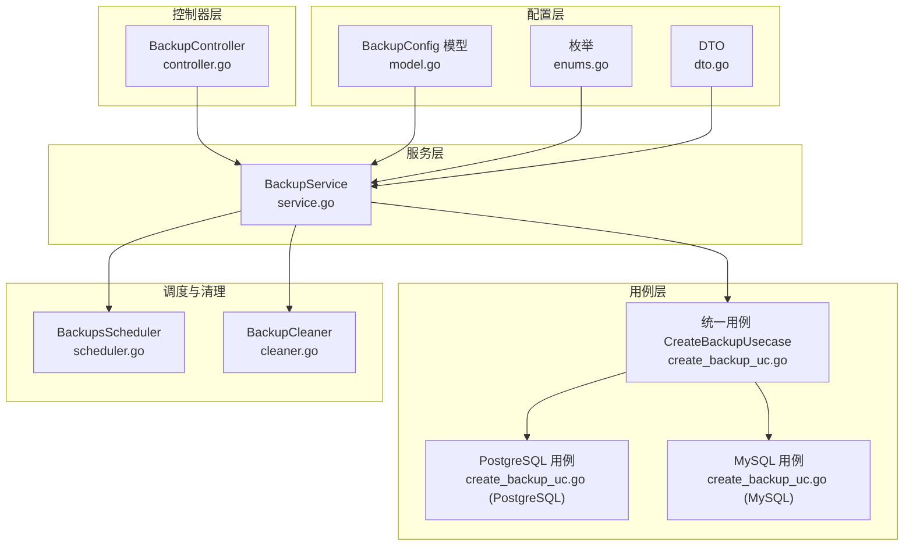
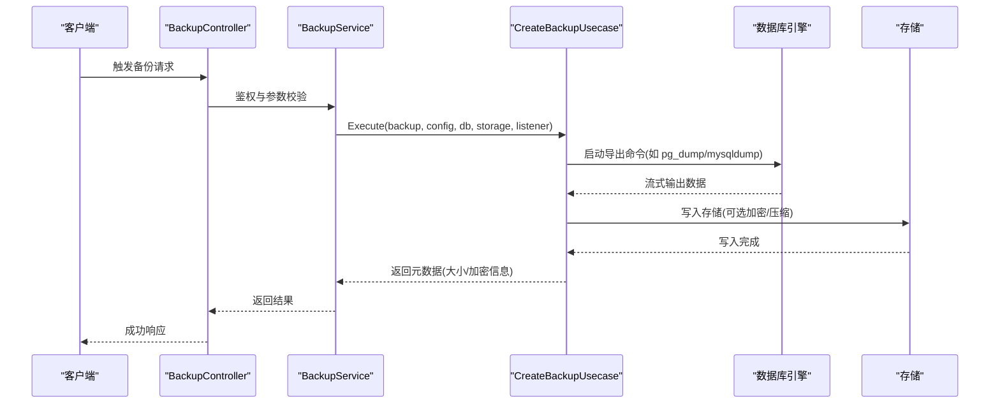
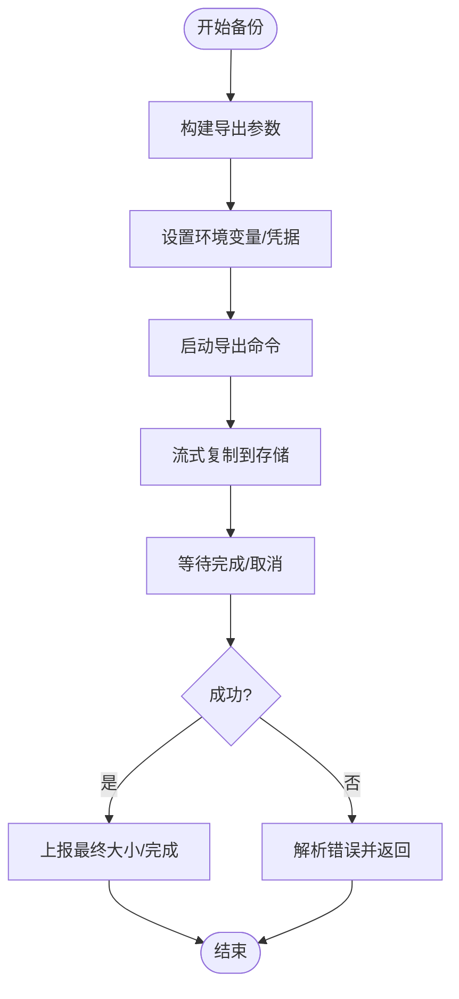
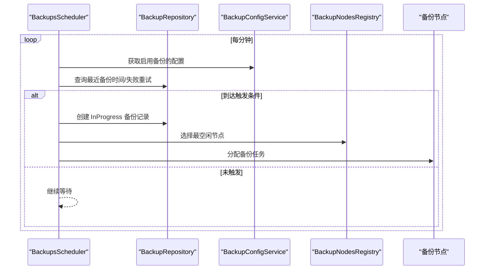
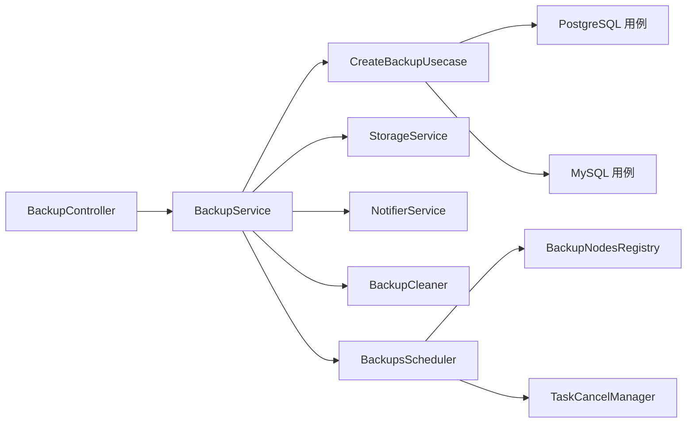

# 备份管理模块

<cite>
**本文引用的文件**
- [model.go](file://backend/internal/features/backups/config/model.go)
- [enums.go](file://backend/internal/features/backups/config/enums.go)
- [dto.go](file://backend/internal/features/backups/config/dto.go)
- [create_backup_uc.go](file://backend/internal/features/backups/backups/usecases/create_backup_uc.go)
- [service.go](file://backend/internal/features/backups/backups/services/service.go)
- [controller.go](file://backend/internal/features/backups/backups/controllers/controller.go)
- [interfaces.go](file://backend/internal/features/backups/backups/core/interfaces.go)
- [create_backup_uc.go (PostgreSQL)](file://backend/internal/features/backups/backups/usecases/postgresql/create_backup_uc.go)
- [create_backup_uc.go (MySQL)](file://backend/internal/features/backups/backups/usecases/mysql/create_backup_uc.go)
- [scheduler.go](file://backend/internal/features/backups/backups/backuping/scheduler.go)
- [cleaner.go](file://backend/internal/features/backups/backups/backuping/cleaner.go)
</cite>

## 目录
1. [简介](#简介)
2. [项目结构](#项目结构)
3. [核心组件](#核心组件)
4. [架构总览](#架构总览)
5. [详细组件分析](#详细组件分析)
6. [依赖关系分析](#依赖关系分析)
7. [性能考量](#性能考量)
8. [故障排除指南](#故障排除指南)
9. [结论](#结论)
10. [附录](#附录)

## 简介
本文件面向 Databasus 备份管理模块，提供从策略设计到执行引擎、调度机制、监控与清理、恢复流程与故障排除的完整技术文档。重点覆盖以下方面：
- 备份策略设计：逻辑备份、物理备份、增量备份的区别与适用场景
- 执行引擎：并发控制、进度监控、错误处理
- 调度机制：时间表配置、Cron 表达式支持、智能压缩算法
- 监控系统：实时状态跟踪、进度报告、性能指标采集
- 备份类型：逻辑备份（数据库引擎特定二进制格式）、物理备份（集群文件级复制）、增量备份（结合 WAL 归档的 PITR）
- 最佳实践与性能优化建议
- 恢复流程与故障排除指南

## 项目结构
备份模块位于后端服务中，采用按功能域分层组织：
- 配置层：备份配置模型、枚举与 DTO
- 用例层：针对不同数据库类型的备份执行用例（PostgreSQL、MySQL 等）
- 服务层：备份服务封装控制器、存储、通知、清理等能力
- 控制器层：HTTP 接口暴露备份查询、触发、取消、下载等操作
- 调度与清理：定时调度器与保留策略清理器

图表来源
- [model.go:16-48](file://backend/internal/features/backups/config/model.go#L16-L48)
- [enums.go:3-23](file://backend/internal/features/backups/config/enums.go#L3-L23)
- [dto.go:5-11](file://backend/internal/features/backups/config/dto.go#L5-L11)
- [create_backup_uc.go:18-77](file://backend/internal/features/backups/backups/usecases/create_backup_uc.go#L18-L77)
- [create_backup_uc.go (PostgreSQL):43-105](file://backend/internal/features/backups/backups/usecases/postgresql/create_backup_uc.go#L43-L105)
- [create_backup_uc.go (MySQL):42-99](file://backend/internal/features/backups/backups/usecases/mysql/create_backup_uc.go#L42-L99)
- [service.go:31-53](file://backend/internal/features/backups/backups/services/service.go#L31-L53)
- [controller.go:23-39](file://backend/internal/features/backups/backups/controllers/controller.go#L23-L39)
- [scheduler.go:25-40](file://backend/internal/features/backups/backups/backuping/scheduler.go#L25-L40)
- [cleaner.go:25-35](file://backend/internal/features/backups/backups/backuping/cleaner.go#L25-L35)

章节来源
- [model.go:16-156](file://backend/internal/features/backups/config/model.go#L16-L156)
- [enums.go:3-23](file://backend/internal/features/backups/config/enums.go#L3-L23)
- [dto.go:5-11](file://backend/internal/features/backups/config/dto.go#L5-L11)
- [create_backup_uc.go:18-77](file://backend/internal/features/backups/backups/usecases/create_backup_uc.go#L18-L77)
- [service.go:31-53](file://backend/internal/features/backups/backups/services/service.go#L31-L53)
- [controller.go:23-39](file://backend/internal/features/backups/backups/controllers/controller.go#L23-L39)
- [scheduler.go:25-40](file://backend/internal/features/backups/backups/backuping/scheduler.go#L25-L40)
- [cleaner.go:25-35](file://backend/internal/features/backups/backups/backuping/cleaner.go#L25-L35)

## 核心组件
- 备份配置模型：定义启用开关、保留策略、通知、重试与加密等字段，并在保存/查询时进行数组与字符串的双向转换
- 统一用例入口：根据数据库类型路由到对应数据库的备份用例
- 数据库专用用例：PostgreSQL 使用 pg_dump 自定义格式并按版本选择压缩算法；MySQL 使用 mysqldump 并在网络层启用 zstd 压缩
- 备份服务：封装控制器调用、鉴权、存储读写、下载令牌、审计日志、清理与取消任务
- 控制器：提供备份列表、手动触发、删除、取消、下载令牌生成与文件下载接口
- 调度器：周期性检查并触发备份，节点健康检查与失败兜底
- 清理器：基于时间、数量、GFS 的保留策略清理过期备份，以及云环境下的容量超限清理

章节来源
- [model.go:16-156](file://backend/internal/features/backups/config/model.go#L16-L156)
- [enums.go:3-23](file://backend/internal/features/backups/config/enums.go#L3-L23)
- [create_backup_uc.go:18-77](file://backend/internal/features/backups/backups/usecases/create_backup_uc.go#L18-L77)
- [create_backup_uc.go (PostgreSQL):43-105](file://backend/internal/features/backups/backups/usecases/postgresql/create_backup_uc.go#L43-L105)
- [create_backup_uc.go (MySQL):42-99](file://backend/internal/features/backups/backups/usecases/mysql/create_backup_uc.go#L42-L99)
- [service.go:31-53](file://backend/internal/features/backups/backups/services/service.go#L31-L53)
- [controller.go:23-39](file://backend/internal/features/backups/backups/controllers/controller.go#L23-L39)
- [scheduler.go:25-40](file://backend/internal/features/backups/backups/backuping/scheduler.go#L25-L40)
- [cleaner.go:25-35](file://backend/internal/features/backups/backups/backuping/cleaner.go#L25-L35)

## 架构总览
备份模块遵循“控制器-服务-用例-存储”的分层架构，配合调度器与清理器形成闭环。

图表来源
- [controller.go:99-118](file://backend/internal/features/backups/backups/controllers/controller.go#L99-L118)
- [service.go:84-114](file://backend/internal/features/backups/backups/services/service.go#L84-L114)
- [create_backup_uc.go:25-77](file://backend/internal/features/backups/backups/usecases/create_backup_uc.go#L25-L77)
- [create_backup_uc.go (PostgreSQL):54-105](file://backend/internal/features/backups/backups/usecases/postgresql/create_backup_uc.go#L54-L105)
- [create_backup_uc.go (MySQL):53-99](file://backend/internal/features/backups/backups/usecases/mysql/create_backup_uc.go#L53-L99)

## 详细组件分析

### 备份策略设计
- 逻辑备份：通过数据库原生命令导出（PostgreSQL 使用自定义格式，MySQL 使用 SQL 文本），适合跨平台、可移植性强
- 物理备份：当前代码未直接体现物理备份实现；若需集群文件级复制，可在调度器或用例层扩展
- 增量备份：当前代码未直接体现增量备份实现；若需 WAL 归档与 PITR，可在调度器或用例层扩展

保留策略类型：
- 时间段保留：按时间窗口清理
- 数量保留：保留最近 N 个备份
- GFS 保留：按小时/天/周/月/年多级保留规则

章节来源
- [model.go:16-48](file://backend/internal/features/backups/config/model.go#L16-L48)
- [enums.go:17-23](file://backend/internal/features/backups/config/enums.go#L17-L23)
- [cleaner.go:157-183](file://backend/internal/features/backups/backups/backuping/cleaner.go#L157-L183)

### 执行引擎
- 并发控制：统一用例根据数据库类型路由；服务层对同一数据库的并发备份进行检查与保护
- 进度监控：用例内部以固定间隔上报已完成 MB 数；控制器在下载时也记录进度
- 错误处理：捕获外部进程退出码与标准错误，区分连接、认证、SSL、超时等错误并给出明确提示；支持取消与关闭资源

图表来源
- [create_backup_uc.go (PostgreSQL):107-257](file://backend/internal/features/backups/backups/usecases/postgresql/create_backup_uc.go#L107-L257)
- [create_backup_uc.go (MySQL):163-297](file://backend/internal/features/backups/backups/usecases/mysql/create_backup_uc.go#L163-L297)

章节来源
- [create_backup_uc.go:18-77](file://backend/internal/features/backups/backups/usecases/create_backup_uc.go#L18-L77)
- [create_backup_uc.go (PostgreSQL):54-105](file://backend/internal/features/backups/backups/usecases/postgresql/create_backup_uc.go#L54-L105)
- [create_backup_uc.go (MySQL):53-99](file://backend/internal/features/backups/backups/usecases/mysql/create_backup_uc.go#L53-L99)

### 调度机制
- 周期调度：定时器每分钟扫描一次，检查上次备份时间与重试次数，决定是否触发新备份
- 节点健康：注册可用节点，计算最空闲节点，失败节点自动标记备份失败
- 订阅完成：订阅节点完成事件，更新关联关系并递减活动备份计数

图表来源
- [scheduler.go:42-94](file://backend/internal/features/backups/backups/backuping/scheduler.go#L42-L94)
- [scheduler.go:320-397](file://backend/internal/features/backups/backups/backuping/scheduler.go#L320-L397)
- [scheduler.go:442-488](file://backend/internal/features/backups/backups/backuping/scheduler.go#L442-L488)

章节来源
- [scheduler.go:25-40](file://backend/internal/features/backups/backups/backuping/scheduler.go#L25-L40)
- [scheduler.go:42-94](file://backend/internal/features/backups/backups/backuping/scheduler.go#L42-L94)
- [scheduler.go:320-397](file://backend/internal/features/backups/backups/backuping/scheduler.go#L320-L397)
- [scheduler.go:442-488](file://backend/internal/features/backups/backups/backuping/scheduler.go#L442-L488)

### 监控与清理
- 保留策略清理：按时间、数量、GFS 三种策略清理过期备份；云环境按订阅容量限制清理
- 近期备份保护：对新建备份保留一段时间避免被清理
- 死节点兜底：检测不可用节点并标记其备份失败

章节来源
- [cleaner.go:157-183](file://backend/internal/features/backups/backups/backuping/cleaner.go#L157-L183)
- [cleaner.go:215-253](file://backend/internal/features/backups/backups/backuping/cleaner.go#L215-L253)
- [cleaner.go:255-295](file://backend/internal/features/backups/backups/backuping/cleaner.go#L255-L295)
- [cleaner.go:297-343](file://backend/internal/features/backups/backups/backuping/cleaner.go#L297-L343)
- [cleaner.go:345-394](file://backend/internal/features/backups/backups/backuping/cleaner.go#L345-L394)
- [cleaner.go:396-398](file://backend/internal/features/backups/backups/backuping/cleaner.go#L396-L398)

### 下载与安全
- 下载令牌：生成短期有效令牌，防止直接暴露存储路径
- 并发控制：单用户同时仅允许一个下载任务，心跳维持锁
- 解密下载：若备份已加密，服务端在读取时进行解密流式传输

章节来源
- [controller.go:223-320](file://backend/internal/features/backups/backups/controllers/controller.go#L223-L320)
- [service.go:297-383](file://backend/internal/features/backups/backups/services/service.go#L297-L383)

## 依赖关系分析
- 控制器依赖服务层；服务层依赖用例、存储、通知、清理与取消管理
- 用例依赖数据库工具链（pg_dump、mysqldump）与压缩/加密库
- 调度器依赖配置服务、节点注册中心与任务取消管理
- 清理器依赖配置服务、存储服务与订阅服务

图表来源
- [controller.go:23-39](file://backend/internal/features/backups/backups/controllers/controller.go#L23-L39)
- [service.go:31-53](file://backend/internal/features/backups/backups/services/service.go#L31-L53)
- [create_backup_uc.go:18-77](file://backend/internal/features/backups/backups/usecases/create_backup_uc.go#L18-L77)
- [scheduler.go:25-40](file://backend/internal/features/backups/backups/backuping/scheduler.go#L25-L40)
- [cleaner.go:25-35](file://backend/internal/features/backups/backups/backuping/cleaner.go#L25-L35)

章节来源
- [controller.go:23-39](file://backend/internal/features/backups/backups/controllers/controller.go#L23-L39)
- [service.go:31-53](file://backend/internal/features/backups/backups/services/service.go#L31-L53)
- [create_backup_uc.go:18-77](file://backend/internal/features/backups/backups/usecases/create_backup_uc.go#L18-L77)
- [scheduler.go:25-40](file://backend/internal/features/backups/backups/backuping/scheduler.go#L25-L40)
- [cleaner.go:25-35](file://backend/internal/features/backups/backups/backuping/cleaner.go#L25-L35)

## 性能考量
- 压缩策略：PostgreSQL 在高版本使用 zstd 压缩，低版本使用 gzip；MySQL 在支持的版本启用 zstd 网络压缩，其余启用压缩
- 流式传输：导出命令输出直接通过管道写入存储，减少中间文件与内存占用
- 并发与节流：调度器按节点吞吐与活动备份数选择最优节点；下载端支持速率限制与心跳保活
- 资源清理：定期清理过期备份，避免存储膨胀；云环境按订阅容量限制清理

章节来源
- [create_backup_uc.go (PostgreSQL):355-374](file://backend/internal/features/backups/backups/usecases/postgresql/create_backup_uc.go#L355-L374)
- [create_backup_uc.go (MySQL):141-161](file://backend/internal/features/backups/backups/usecases/mysql/create_backup_uc.go#L141-L161)
- [controller.go:223-320](file://backend/internal/features/backups/backups/controllers/controller.go#L223-L320)
- [cleaner.go:185-213](file://backend/internal/features/backups/backups/backuping/cleaner.go#L185-L213)

## 故障排除指南
常见问题与定位要点：
- 导出命令失败
  - PostgreSQL：检查连接超时、认证失败、SSL 配置、访问冲突（0xC0000005）等错误信息
  - MySQL：检查访问被拒、连接被拒、压缩算法不支持、数据库不存在、SSL、超时等问题
- 存储写入失败
  - 检查存储凭证、网络连通性、权限与配额
- 下载失败
  - 检查下载令牌有效性、并发下载冲突、心跳丢失导致的锁失效
- 调度异常
  - 检查节点可用性、订阅状态、重试次数与保留策略

章节来源
- [create_backup_uc.go (PostgreSQL):588-729](file://backend/internal/features/backups/backups/usecases/postgresql/create_backup_uc.go#L588-L729)
- [create_backup_uc.go (MySQL):554-628](file://backend/internal/features/backups/backups/usecases/mysql/create_backup_uc.go#L554-L628)
- [controller.go:223-320](file://backend/internal/features/backups/backups/controllers/controller.go#L223-L320)
- [scheduler.go:551-633](file://backend/internal/features/backups/backups/backuping/scheduler.go#L551-L633)

## 结论
Databasus 备份管理模块以清晰的分层架构实现了逻辑备份的自动化执行、灵活的保留策略与可靠的调度清理机制。通过流式压缩与并发调度，兼顾了性能与可靠性。建议后续扩展物理备份与增量备份（WAL/PITR）能力，并完善监控指标与告警体系，以进一步提升运维可观测性与自动化水平。

## 附录
- 备份类型与适用场景
  - 逻辑备份：跨平台、可移植、便于迁移与恢复
  - 物理备份：全量文件级复制，适合快速恢复但跨平台性差
  - 增量备份：结合 WAL 归档实现点-in-time 恢复，适合高可用场景
- 最佳实践
  - 优先使用逻辑备份作为主策略，结合保留策略与压缩
  - 在云环境启用容量限制清理，避免存储超支
  - 对关键业务开启重试与通知，确保异常及时发现
  - 定期验证恢复流程，确保备份可用性