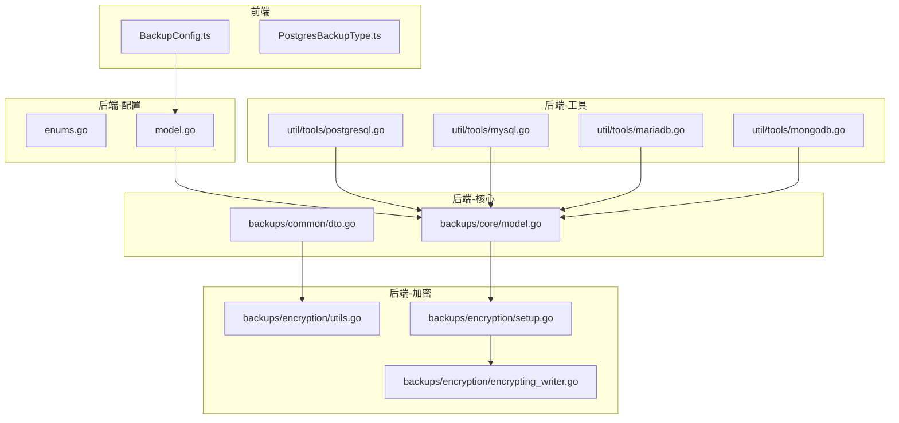
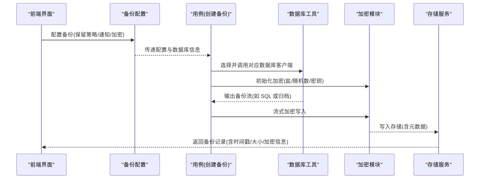
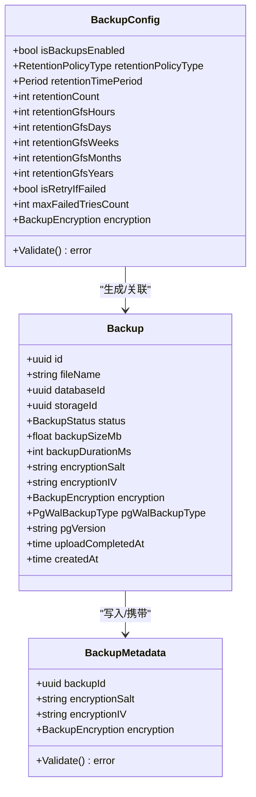
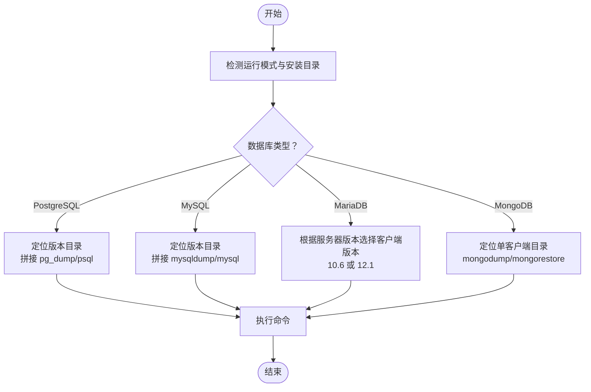
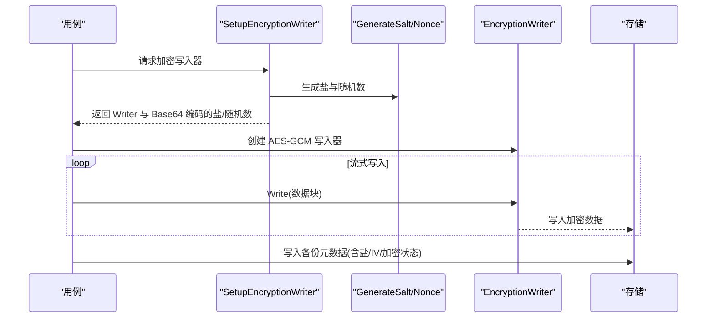
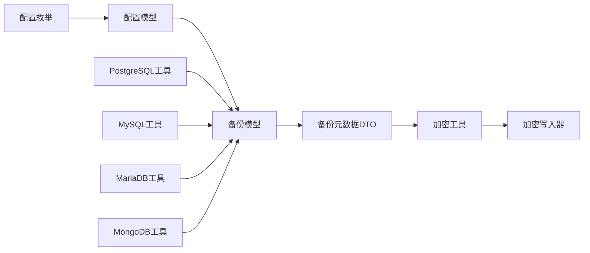

# 备份类型与格式

<cite>
**本文引用的文件**
- [PostgresBackupType.ts](file://frontend/src/entity/databases/model/postgresql/PostgresBackupType.ts)
- [add_backup_format.sql](file://backend/migrations/20260101200438_add_backup_format.sql)
- [remove_backup_type_field.sql](file://backend/migrations/20260102110334_remove_backup_type_field.sql)
- [enums.go](file://backend/internal/features/backups/config/enums.go)
- [model.go](file://backend/internal/features/backups/config/model.go)
- [dto.go](file://backend/internal/features/backups/backups/common/dto.go)
- [model.go](file://backend/internal/features/backups/backups/core/model.go)
- [utils.go](file://backend/internal/features/backups/backups/encryption/utils.go)
- [encrypting_writer.go](file://backend/internal/features/backups/backups/encryption/encrypting_writer.go)
- [setup.go](file://backend/internal/features/backups/backups/encryption/setup.go)
- [postgresql.go](file://backend/internal/util/tools/postgresql.go)
- [mysql.go](file://backend/internal/util/tools/mysql.go)
- [mariadb.go](file://backend/internal/util/tools/mariadb.go)
- [mongodb.go](file://backend/internal/util/tools/mongodb.go)
- [readme.md](file://backend/tools/readme.md)
- [create_backup_uc.go](file://backend/internal/feature/backups/backups/usecases/mongodb/create_backup_uc.go)
- [create_backup_uc.go](file://backend/internal/feature/backups/backups/usecases/mysql/create_backup_uc.go)
- [create_backup_uc.go](file://backend/internal/feature/backups/backups/usecases/postgresql/create_backup_uc.go)
- [BackupConfig.ts](file://frontend/src/entity/backups/model/BackupConfig.ts)
</cite>

## 目录
1. [简介](#简介)
2. [项目结构](#项目结构)
3. [核心组件](#核心组件)
4. [架构总览](#架构总览)
5. [详细组件分析](#详细组件分析)
6. [依赖分析](#依赖分析)
7. [性能考量](#性能考量)
8. [故障排查指南](#故障排查指南)
9. [结论](#结论)
10. [附录](#附录)

## 简介
本文件为 Databasus 的备份类型与格式技术参考，聚焦以下目标：
- 全面说明备份格式类别：SQL 转储格式（可移植性强、支持逻辑恢复）、原生二进制格式（高性能、数据库特定）、压缩格式（节省存储空间）、加密格式（增强安全性）。
- 对比不同数据库类型的备份格式差异：PostgreSQL 的逻辑备份 vs 物理备份、MySQL 的 mysqldump vs xtrabackup、MongoDB 的 mongodump vs 文件系统快照。
- 解释备份元数据结构：版本信息、配置快照、校验与完整性、时间戳等。
- 提供备份格式选择指南：基于数据规模、恢复需求、兼容性要求进行决策。
- 给出备份格式兼容性矩阵与迁移路径建议。

## 项目结构
围绕备份能力，后端在 features/backups 下按“配置、用例、核心模型、加密、工具”分层组织；前端提供备份配置与展示模型；工具目录内置多版本客户端以适配不同数据库版本。

图表来源
- [BackupConfig.ts:1-28](file://frontend/src/entity/backups/model/BackupConfig.ts#L1-L28)
- [PostgresBackupType.ts:1-4](file://frontend/src/entity/databases/model/postgresql/PostgresBackupType.ts#L1-L4)
- [enums.go:1-24](file://backend/internal/features/backups/config/enums.go#L1-L24)
- [model.go:1-156](file://backend/internal/features/backups/config/model.go#L1-L156)
- [model.go:1-60](file://backend/internal/features/backups/backups/core/model.go#L1-L60)
- [dto.go:1-39](file://backend/internal/features/backups/backups/common/dto.go#L1-L39)
- [utils.go:1-52](file://backend/internal/features/backups/backups/encryption/utils.go#L1-L52)
- [encrypting_writer.go:1-58](file://backend/internal/features/backups/backups/encryption/encrypting_writer.go#L1-L58)
- [setup.go:1-45](file://backend/internal/features/backups/backups/encryption/setup.go#L1-L45)
- [postgresql.go:1-208](file://backend/internal/util/tools/postgresql.go#L1-L208)
- [mysql.go:1-231](file://backend/internal/util/tools/mysql.go#L1-L231)
- [mariadb.go:1-251](file://backend/internal/util/tools/mariadb.go#L1-L251)
- [mongodb.go:1-179](file://backend/internal/util/tools/mongodb.go#L1-L179)

章节来源
- [enums.go:1-24](file://backend/internal/features/backups/config/enums.go#L1-L24)
- [model.go:1-156](file://backend/internal/features/backups/config/model.go#L1-L156)
- [model.go:1-60](file://backend/internal/features/backups/backups/core/model.go#L1-L60)
- [dto.go:1-39](file://backend/internal/features/backups/backups/common/dto.go#L1-L39)
- [utils.go:1-52](file://backend/internal/features/backups/backups/encryption/utils.go#L1-L52)
- [encrypting_writer.go:1-58](file://backend/internal/features/backups/backups/encryption/encrypting_writer.go#L1-L58)
- [setup.go:1-45](file://backend/internal/features/backups/backups/encryption/setup.go#L1-L45)
- [postgresql.go:1-208](file://backend/internal/util/tools/postgresql.go#L1-L208)
- [mysql.go:1-231](file://backend/internal/util/tools/mysql.go#L1-L231)
- [mariadb.go:1-251](file://backend/internal/util/tools/mariadb.go#L1-L251)
- [mongodb.go:1-179](file://backend/internal/util/tools/mongodb.go#L1-L179)
- [readme.md:126-184](file://backend/tools/readme.md#L126-L184)

## 核心组件
- 备份配置模型与枚举：定义保留策略、通知类型、加密开关等。
- 备份核心模型：记录备份状态、大小、耗时、加密盐/初始化向量、PostgreSQL WAL 相关字段等。
- 备份元数据 DTO：统一校验备份 ID、加密状态及必要参数。
- 加密模块：生成盐/随机数、派生密钥、流式加密写入器。
- 工具模块：按数据库类型与版本定位客户端工具，确保可用性与兼容性。

章节来源
- [enums.go:1-24](file://backend/internal/features/backups/config/enums.go#L1-L24)
- [model.go:1-156](file://backend/internal/features/backups/config/model.go#L1-L156)
- [model.go:1-60](file://backend/internal/features/backups/backups/core/model.go#L1-L60)
- [dto.go:1-39](file://backend/internal/features/backups/backups/common/dto.go#L1-L39)
- [utils.go:1-52](file://backend/internal/features/backups/backups/encryption/utils.go#L1-L52)
- [encrypting_writer.go:1-58](file://backend/internal/features/backups/backups/encryption/encrypting_writer.go#L1-L58)
- [setup.go:1-45](file://backend/internal/features/backups/backups/encryption/setup.go#L1-L45)

## 架构总览
下图展示从配置到执行再到存储的整体流程，以及加密与工具层的协作。

图表来源
- [model.go:1-156](file://backend/internal/features/backups/config/model.go#L1-L156)
- [model.go:1-60](file://backend/internal/features/backups/backups/core/model.go#L1-L60)
- [dto.go:1-39](file://backend/internal/features/backups/backups/common/dto.go#L1-L39)
- [utils.go:1-52](file://backend/internal/features/backups/backups/encryption/utils.go#L1-L52)
- [postgresql.go:1-208](file://backend/internal/util/tools/postgresql.go#L1-L208)
- [mysql.go:1-231](file://backend/internal/util/tools/mysql.go#L1-L231)
- [mariadb.go:1-251](file://backend/internal/util/tools/mariadb.go#L1-L251)
- [mongodb.go:1-179](file://backend/internal/util/tools/mongodb.go#L1-L179)

## 详细组件分析

### 备份配置与元数据
- 配置项要点：启用状态、保留策略（时间窗/数量/GFS）、通知类型、重试策略、加密开关。
- 校验规则：保留策略类型与字段组合校验、云环境强制加密、最大失败次数有效性。
- 元数据结构：备份 ID、加密盐、加密 IV、加密状态；用于恢复时解密与完整性验证。

图表来源
- [model.go:1-156](file://backend/internal/features/backups/config/model.go#L1-L156)
- [dto.go:1-39](file://backend/internal/features/backups/backups/common/dto.go#L1-L39)
- [model.go:1-60](file://backend/internal/features/backups/backups/core/model.go#L1-L60)

章节来源
- [enums.go:1-24](file://backend/internal/features/backups/config/enums.go#L1-L24)
- [model.go:1-156](file://backend/internal/features/backups/config/model.go#L1-L156)
- [dto.go:1-39](file://backend/internal/features/backups/backups/common/dto.go#L1-L39)
- [model.go:1-60](file://backend/internal/features/backups/backups/core/model.go#L1-L60)

### 数据库工具与版本选择
- PostgreSQL：按版本定位 pg_dump、psql 等工具，开发与生产路径不同；Windows 下自动补 .exe。
- MySQL：支持 5.7/8.0/8.4/9；根据连接安全与网络压缩特性动态拼接参数。
- MariaDB：区分旧版服务器使用 10.6 客户端、新版使用 12.1 客户端，避免信息架构列不兼容。
- MongoDB：单客户端版本向后兼容所有服务器主版本，简化部署。

图表来源
- [postgresql.go:1-208](file://backend/internal/util/tools/postgresql.go#L1-L208)
- [mysql.go:1-231](file://backend/internal/util/tools/mysql.go#L1-L231)
- [mariadb.go:1-251](file://backend/internal/util/tools/mariadb.go#L1-L251)
- [mongodb.go:1-179](file://backend/internal/util/tools/mongodb.go#L1-L179)
- [readme.md:126-184](file://backend/tools/readme.md#L126-L184)

章节来源
- [postgresql.go:1-208](file://backend/internal/util/tools/postgresql.go#L1-L208)
- [mysql.go:1-231](file://backend/internal/util/tools/mysql.go#L1-L231)
- [mariadb.go:1-251](file://backend/internal/util/tools/mariadb.go#L1-L251)
- [mongodb.go:1-179](file://backend/internal/util/tools/mongodb.go#L1-L179)
- [readme.md:126-184](file://backend/tools/readme.md#L126-L184)

### 加密与完整性
- 密钥派生：基于主密钥、备份 ID 与盐，使用 PBKDF2 派生对称密钥。
- 盐与随机数：固定长度盐与 12 字节随机数，分别用于唯一化与随机性。
- 流式加密：AES-GCM 模式，分块写入，首块写入魔数与头部信息。
- 元数据校验：备份记录中携带加密盐与 IV，用于恢复阶段解密。

图表来源
- [setup.go:1-45](file://backend/internal/features/backups/backups/encryption/setup.go#L1-L45)
- [utils.go:1-52](file://backend/internal/features/backups/backups/encryption/utils.go#L1-L52)
- [encrypting_writer.go:1-58](file://backend/internal/features/backups/backups/encryption/encrypting_writer.go#L1-L58)
- [dto.go:1-39](file://backend/internal/features/backups/backups/common/dto.go#L1-L39)

章节来源
- [setup.go:1-45](file://backend/internal/features/backups/backups/encryption/setup.go#L1-L45)
- [utils.go:1-52](file://backend/internal/features/backups/backups/encryption/utils.go#L1-L52)
- [encrypting_writer.go:1-58](file://backend/internal/features/backups/backups/encryption/encrypting_writer.go#L1-L58)
- [dto.go:1-39](file://backend/internal/features/backups/backups/common/dto.go#L1-L39)

### 不同数据库的备份格式差异
- PostgreSQL
  - 逻辑备份：使用 pg_dump 生成 SQL 转储，便于跨版本、跨平台恢复与筛选。
  - 物理备份：通过 WAL 归档与基础备份配合实现点-in-time 恢复（WAL V1 类型）。
- MySQL
  - 逻辑备份：mysqldump 生成 SQL 转储，支持触发器、事件、单事务一致性等参数。
  - 物理备份：xtrabackup（在工具链中预留版本支持），适合大体量、低停机窗口场景。
- MongoDB
  - 逻辑备份：mongodump 生成归档流，支持 gzip 压缩与并行集合导出。
  - 物理备份：文件系统快照（在工具链中预留版本支持），适合高吞吐与快速恢复。

章节来源
- [PostgresBackupType.ts:1-4](file://frontend/src/entity/databases/model/postgresql/PostgresBackupType.ts#L1-L4)
- [create_backup_uc.go](file://backend/internal/feature/backups/backups/usecases/postgresql/create_backup_uc.go)
- [create_backup_uc.go](file://backend/internal/feature/backups/backups/usecases/mysql/create_backup_uc.go)
- [create_backup_uc.go](file://backend/internal/feature/backups/backups/usecases/mongodb/create_backup_uc.go)
- [readme.md:126-184](file://backend/tools/readme.md#L126-L184)

### 备份元数据结构
- 必备字段：备份 ID、文件名、状态、大小、耗时、上传完成时间、创建时间。
- 加密字段：加密盐、加密 IV、加密状态。
- PostgreSQL WAL 字段：全量备份类型、起止 WAL 段名、版本号、当前 WAL 段名。
- 配置快照：保留策略类型与参数、通知类型、重试策略、加密开关。

章节来源
- [model.go:1-60](file://backend/internal/features/backups/backups/core/model.go#L1-L60)
- [dto.go:1-39](file://backend/internal/features/backups/backups/common/dto.go#L1-L39)
- [model.go:1-156](file://backend/internal/features/backups/config/model.go#L1-L156)

### 备份格式选择指南
- SQL 转储格式
  - 优点：可移植性强、支持逻辑恢复与过滤、跨版本兼容。
  - 适用：中小规模、需要灵活恢复、跨平台迁移。
- 原生二进制格式
  - 优点：高性能、低停机、适合大规模数据。
  - 适用：MySQL xtrabackup、MongoDB 文件系统快照。
- 压缩格式
  - 优点：显著节省存储空间。
  - 适用：网络传输带宽受限或对象存储成本敏感场景。
- 加密格式
  - 优点：增强数据安全与合规性。
  - 适用：云存储、法规要求强的行业。

章节来源
- [enums.go:1-24](file://backend/internal/features/backups/config/enums.go#L1-L24)
- [model.go:1-156](file://backend/internal/features/backups/config/model.go#L1-L156)
- [utils.go:1-52](file://backend/internal/features/backups/backups/encryption/utils.go#L1-L52)

### 兼容性矩阵与迁移路径
- PostgreSQL
  - 版本范围：12–18；开发与生产路径不同；Windows 自动补 .exe。
  - 迁移路径：升级客户端版本时，优先保证 pg_dump 可用；WAL 归档与基础备份配合实现 PITR。
- MySQL
  - 版本范围：5.7/8.0/8.4/9；根据服务器能力启用 zstd 压缩算法。
  - 迁移路径：备份版本高于恢复目标时需注意兼容性；必要时降级恢复目标版本。
- MariaDB
  - 旧服务器（5.5/10.1）使用 10.6 客户端；新服务器使用 12.1 客户端。
  - 迁移路径：根据服务器版本自动选择客户端，避免信息架构列不兼容。
- MongoDB
  - 单客户端版本向后兼容；支持 gzip 压缩与并行集合导出。
  - 迁移路径：升级客户端版本不影响备份/恢复兼容性。

章节来源
- [postgresql.go:1-208](file://backend/internal/util/tools/postgresql.go#L1-L208)
- [mysql.go:1-231](file://backend/internal/util/tools/mysql.go#L1-L231)
- [mariadb.go:1-251](file://backend/internal/util/tools/mariadb.go#L1-L251)
- [mongodb.go:1-179](file://backend/internal/util/tools/mongodb.go#L1-L179)
- [readme.md:126-184](file://backend/tools/readme.md#L126-L184)

## 依赖分析
- 配置层依赖：备份配置模型依赖保留策略枚举、通知类型枚举、加密枚举。
- 核心层依赖：备份模型依赖配置层与文件工具；元数据 DTO 依赖配置层加密枚举。
- 加密层依赖：加密工具依赖 PBKDF2 与 AES-GCM；写入器依赖随机数与盐。
- 工具层依赖：各数据库工具模块独立管理版本与路径，避免耦合到业务层。

图表来源
- [enums.go:1-24](file://backend/internal/features/backups/config/enums.go#L1-L24)
- [model.go:1-156](file://backend/internal/features/backups/config/model.go#L1-L156)
- [model.go:1-60](file://backend/internal/features/backups/backups/core/model.go#L1-L60)
- [dto.go:1-39](file://backend/internal/features/backups/backups/common/dto.go#L1-L39)
- [utils.go:1-52](file://backend/internal/features/backups/backups/encryption/utils.go#L1-L52)
- [encrypting_writer.go:1-58](file://backend/internal/features/backups/backups/encryption/encrypting_writer.go#L1-L58)
- [postgresql.go:1-208](file://backend/internal/util/tools/postgresql.go#L1-L208)
- [mysql.go:1-231](file://backend/internal/util/tools/mysql.go#L1-L231)
- [mariadb.go:1-251](file://backend/internal/util/tools/mariadb.go#L1-L251)
- [mongodb.go:1-179](file://backend/internal/util/tools/mongodb.go#L1-L179)

章节来源
- [enums.go:1-24](file://backend/internal/features/backups/config/enums.go#L1-L24)
- [model.go:1-156](file://backend/internal/features/backups/config/model.go#L1-L156)
- [model.go:1-60](file://backend/internal/features/backups/backups/core/model.go#L1-L60)
- [dto.go:1-39](file://backend/internal/features/backups/backups/common/dto.go#L1-L39)
- [utils.go:1-52](file://backend/internal/features/backups/backups/encryption/utils.go#L1-L52)
- [encrypting_writer.go:1-58](file://backend/internal/features/backups/backups/encryption/encrypting_writer.go#L1-L58)
- [postgresql.go:1-208](file://backend/internal/util/tools/postgresql.go#L1-L208)
- [mysql.go:1-231](file://backend/internal/util/tools/mysql.go#L1-L231)
- [mariadb.go:1-251](file://backend/internal/util/tools/mariadb.go#L1-L251)
- [mongodb.go:1-179](file://backend/internal/util/tools/mongodb.go#L1-L179)

## 性能考量
- 并行与压缩：MongoDB 支持并行集合导出与 gzip 压缩；MySQL 在支持的版本上启用 zstd 压缩算法。
- 传输优化：合理设置网络压缩与最大包大小，平衡吞吐与稳定性。
- 存储成本：压缩与加密会增加 CPU 开销，需结合存储成本与恢复时间目标权衡。

章节来源
- [create_backup_uc.go:92-113](file://backend/internal/feature/backups/backups/usecases/mongodb/create_backup_uc.go#L92-L113)
- [create_backup_uc.go:101-150](file://backend/internal/feature/backups/backups/usecases/mysql/create_backup_uc.go#L101-L150)
- [mysql.go:141-150](file://backend/internal/util/tools/mysql.go#L141-L150)

## 故障排查指南
- 工具缺失：检查对应数据库版本的客户端是否安装，开发与生产路径不同。
- 加密异常：确认备份记录中盐与 IV 是否完整保存，恢复时输入正确主密钥。
- 配置错误：核对保留策略类型与参数、通知类型、重试策略、加密开关。
- 版本不匹配：备份版本高于恢复目标时，评估兼容性并调整恢复目标版本。

章节来源
- [postgresql.go:34-166](file://backend/internal/util/tools/postgresql.go#L34-L166)
- [mysql.go:49-176](file://backend/internal/util/tools/mysql.go#L49-L176)
- [mariadb.go:82-179](file://backend/internal/util/tools/mariadb.go#L82-L179)
- [mongodb.go:49-126](file://backend/internal/util/tools/mongodb.go#L49-L126)
- [dto.go:18-38](file://backend/internal/features/backups/backups/common/dto.go#L18-L38)
- [model.go:83-108](file://backend/internal/features/backups/config/model.go#L83-L108)

## 结论
Databasus 通过清晰的配置层、核心模型层与加密层，结合多版本数据库工具，实现了对多种备份格式的支持与扩展。SQL 转储、原生二进制、压缩与加密在不同场景下各有优势，应基于数据规模、恢复需求与合规要求进行综合选择。版本工具链保障了跨版本兼容性，而完善的元数据与加密机制则提升了安全性与可恢复性。

## 附录
- 数据库工具版本与路径参考：见工具目录说明。
- 前端备份配置模型：用于界面交互与参数收集。

章节来源
- [readme.md:126-184](file://backend/tools/readme.md#L126-L184)
- [BackupConfig.ts:1-28](file://frontend/src/entity/backups/model/BackupConfig.ts#L1-L28)