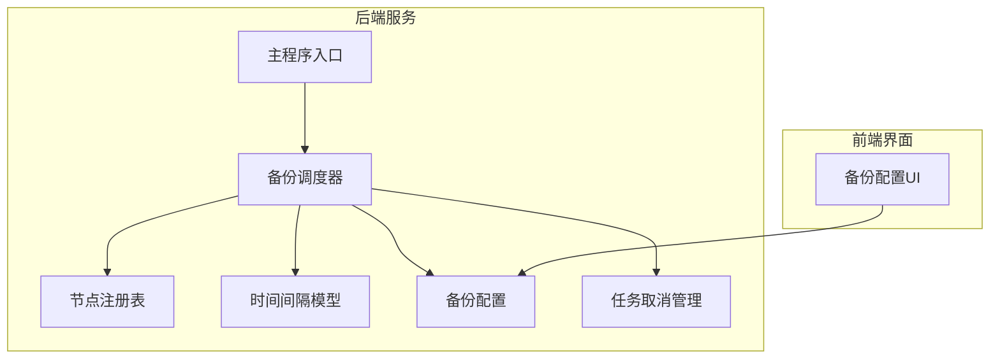
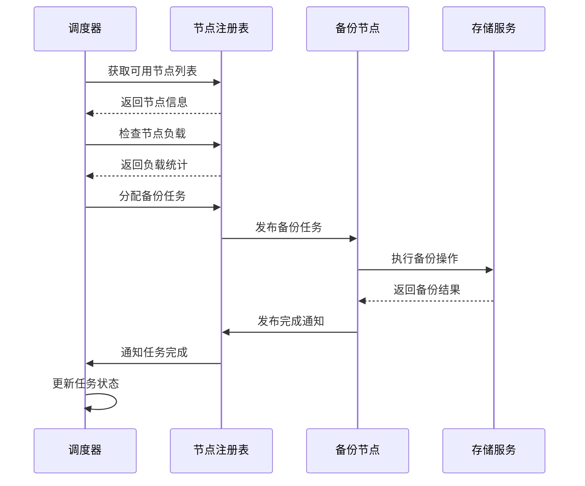
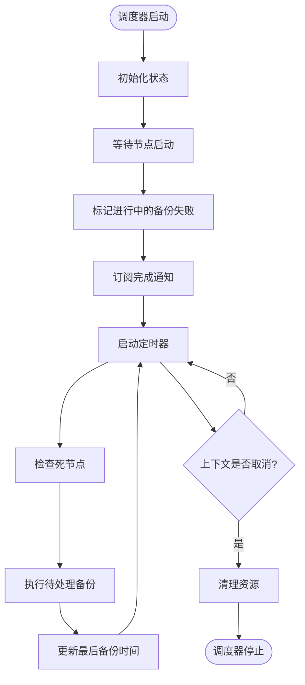
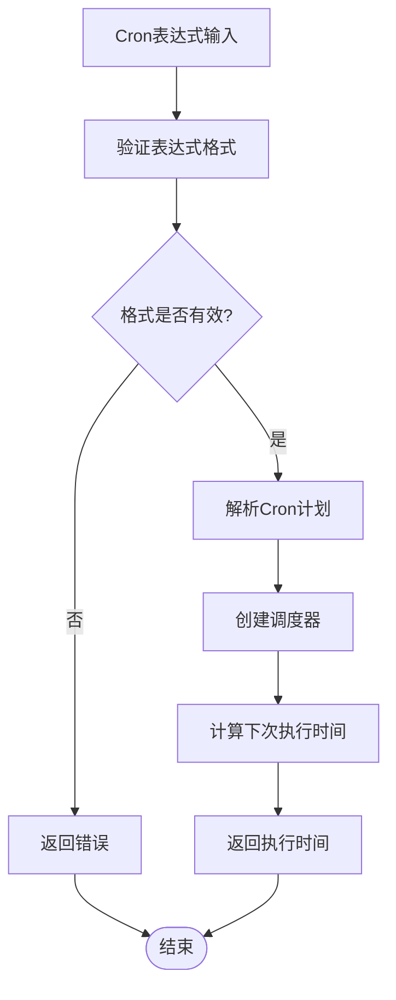
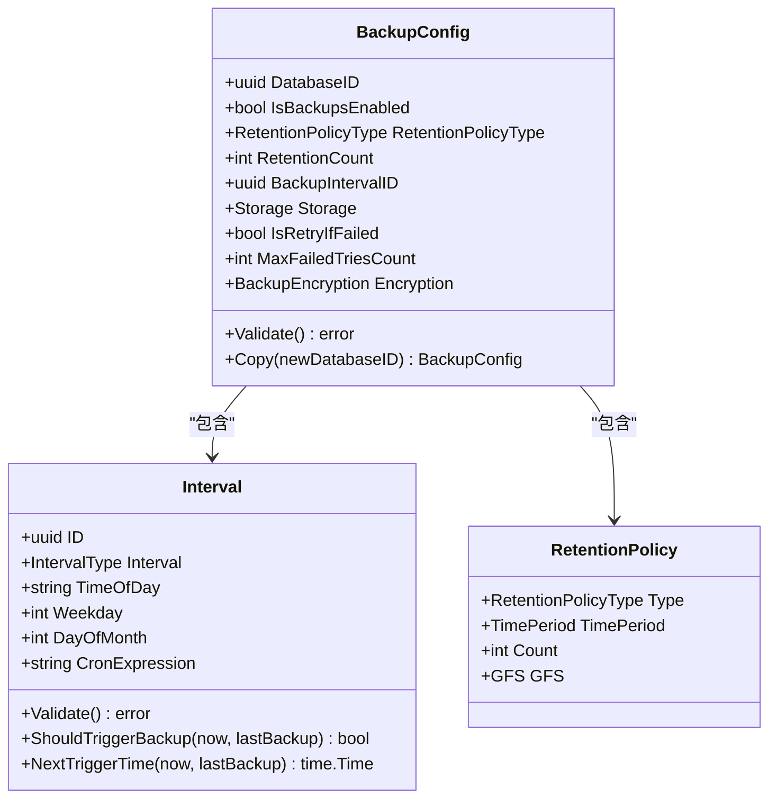
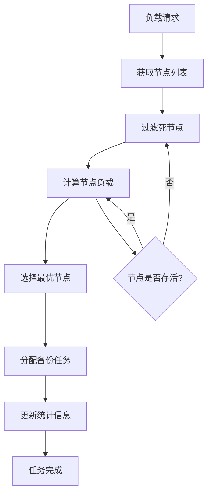
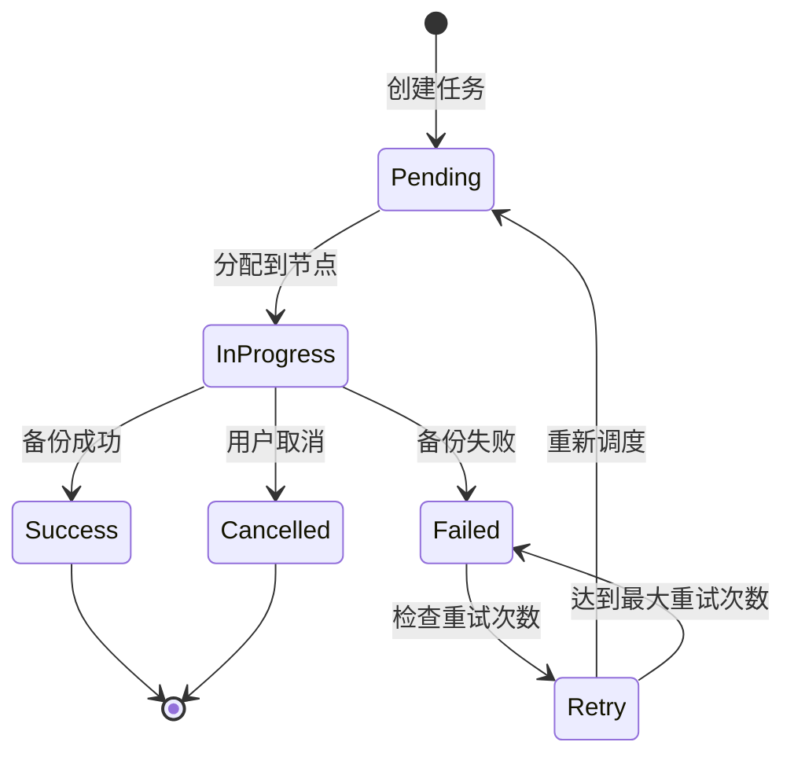
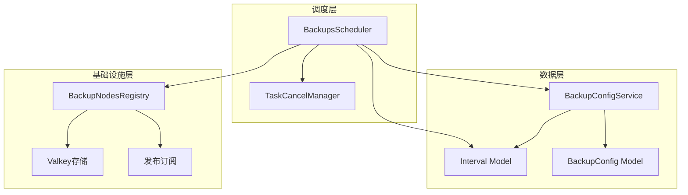

# 备份调度机制

<cite>
**本文档引用的文件**
- [scheduler.go](file://backend/internal/features/backups/backups/backuping/scheduler.go)
- [registry.go](file://backend/internal/features/backups/backups/backuping/registry.go)
- [model.go](file://backend/internal/features/intervals/model.go)
- [enums.go](file://backend/internal/features/intervals/enums.go)
- [service.go](file://backend/internal/features/backups/config/service.go)
- [model.go](file://backend/internal/features/backups/config/model.go)
- [cancel_manager.go](file://backend/internal/features/tasks/cancellation/cancel_manager.go)
- [di.go](file://backend/internal/features/tasks/cancellation/di.go)
- [main.go](file://backend/cmd/main.go)
- [EditBackupConfigComponent.tsx](file://frontend/src/features/backups/ui/EditBackupConfigComponent.tsx)
- [AGENTS.md](file://AGENTS.md)
</cite>

## 目录
1. [简介](#简介)
2. [项目结构](#项目结构)
3. [核心组件](#核心组件)
4. [架构概览](#架构概览)
5. [详细组件分析](#详细组件分析)
6. [依赖关系分析](#依赖关系分析)
7. [性能考虑](#性能考虑)
8. [故障排除指南](#故障排除指南)
9. [结论](#结论)

## 简介

Databasus备份调度机制是一个基于Go语言构建的企业级数据库备份管理系统。该系统实现了智能的备份调度、分布式节点管理和高可用性保障机制。本文档深入分析了备份调度的核心实现，包括任务队列管理、定时触发机制、优先级调度算法、Cron表达式支持、调度配置管理、智能调度功能以及调度状态管理。

## 项目结构

Databasus备份调度系统采用模块化架构设计，主要包含以下核心模块：

**图表来源**
- [main.go:318-360](file://backend/cmd/main.go#L318-L360)
- [scheduler.go:42-94](file://backend/internal/features/backups/backups/backuping/scheduler.go#L42-L94)

**章节来源**
- [main.go:318-360](file://backend/cmd/main.go#L318-L360)

## 核心组件

### 调度器核心架构

备份调度器是整个系统的核心组件，负责监控和触发备份任务。其核心特性包括：

- **定时触发机制**：使用1分钟精度的定时器进行周期性检查
- **多节点支持**：支持分布式环境下的多节点备份
- **健康检查**：自动检测和处理死节点
- **任务管理**：协调备份任务的执行和状态跟踪

### 节点注册表系统

节点注册表负责维护备份节点的状态信息和负载情况：

- **心跳机制**：通过Valkey存储节点心跳信息
- **负载统计**：实时统计各节点的活跃备份任务数量
- **死节点清理**：自动清理超过阈值未响应的节点
- **消息传递**：通过发布订阅机制实现节点间通信

### 时间间隔模型

系统支持多种备份间隔类型，每种类型都有特定的触发逻辑：

- **小时级备份**：每小时触发一次
- **日级备份**：按指定时间每日触发
- **周级备份**：在指定星期几触发
- **月级备份**：在指定日期触发
- **Cron表达式**：支持标准Cron格式的复杂调度

**章节来源**
- [scheduler.go:25-40](file://backend/internal/features/backups/backups/backuping/scheduler.go#L25-L40)
- [registry.go:45-53](file://backend/internal/features/backups/backups/backuping/registry.go#L45-L53)
- [model.go:12-23](file://backend/internal/features/intervals/model.go#L12-L23)

## 架构概览

Databasus备份调度系统采用分布式架构设计，实现了高可用性和可扩展性：

**图表来源**
- [scheduler.go:320-397](file://backend/internal/features/backups/backups/backuping/scheduler.go#L320-L397)
- [registry.go:346-430](file://backend/internal/features/backups/backups/backuping/registry.go#L346-L430)

## 详细组件分析

### 调度器实现分析

#### 核心调度逻辑

调度器采用基于时间轮询的实现方式，每分钟检查一次是否有备份任务需要执行：

**图表来源**
- [scheduler.go:42-94](file://backend/internal/features/backups/backups/backuping/scheduler.go#L42-L94)

#### 任务队列管理

调度器实现了智能的任务队列管理机制：

1. **任务发现**：扫描所有启用备份的数据库配置
2. **条件检查**：验证备份间隔、订阅状态等条件
3. **并发控制**：根据节点负载动态分配任务
4. **重试机制**：支持失败后的自动重试

**章节来源**
- [scheduler.go:320-397](file://backend/internal/features/backups/backups/backuping/scheduler.go#L320-L397)

### Cron表达式支持

系统提供了完整的Cron表达式支持，包括标准格式解析和自定义表达式验证：

#### Cron表达式解析流程

**图表来源**
- [model.go:256-273](file://backend/internal/features/intervals/model.go#L256-L273)

#### 支持的Cron语法

系统支持标准的5字段Cron表达式格式：
- 分钟（0-59）
- 小时（0-23）  
- 日期（1-31）
- 月份（1-12）
- 星期（0-6，0表示星期天）

**章节来源**
- [model.go:262-273](file://backend/internal/features/intervals/model.go#L262-L273)
- [EditBackupConfigComponent.tsx:358-415](file://frontend/src/features/backups/ui/EditBackupConfigComponent.tsx#L358-L415)

### 调度配置管理

#### 配置模型设计

备份配置采用了灵活的数据模型设计，支持多种存储类型和通知策略：

**图表来源**
- [model.go:16-44](file://backend/internal/features/backups/config/model.go#L16-L44)
- [model.go:12-23](file://backend/internal/features/intervals/model.go#L12-L23)

#### 配置验证机制

系统实现了多层次的配置验证机制：

1. **必需字段验证**：确保关键配置项不为空
2. **业务规则验证**：验证配置间的逻辑关系
3. **存储兼容性验证**：检查存储类型与配置的匹配性
4. **权限验证**：确保用户对数据库和存储有访问权限

**章节来源**
- [model.go:83-108](file://backend/internal/features/backups/config/model.go#L83-L108)
- [service.go:44-80](file://backend/internal/features/backups/config/service.go#L44-L80)

### 智能调度功能

#### 负载感知调度

系统实现了基于负载的智能调度算法：

**图表来源**
- [registry.go:79-147](file://backend/internal/features/backups/backups/backuping/registry.go#L79-L147)

#### 冲突避免机制

系统通过以下机制避免任务冲突：

1. **唯一性约束**：确保同一时间只有一个备份任务在执行
2. **超时检测**：检测长时间未响应的任务并进行清理
3. **资源隔离**：为不同类型的备份任务分配独立的资源池
4. **优先级管理**：根据任务重要性动态调整执行顺序

**章节来源**
- [registry.go:245-291](file://backend/internal/features/backups/backups/backuping/registry.go#L245-L291)

### 调度状态管理

#### 任务状态跟踪

系统实现了完整的任务状态跟踪机制：

#### 执行历史记录

系统记录详细的执行历史信息，包括：

- **任务元数据**：备份ID、数据库ID、开始时间、结束时间
- **执行结果**：状态、错误信息、备份大小
- **性能指标**：执行时间、网络传输量、存储使用量
- **通知记录**：发送的通知类型和接收者

**章节来源**
- [scheduler.go:399-433](file://backend/internal/features/backups/backups/backuping/scheduler.go#L399-L433)

## 依赖关系分析

### 组件耦合关系

Databasus备份调度系统展现了良好的模块化设计，各组件之间具有清晰的职责分离：

**图表来源**
- [scheduler.go:25-31](file://backend/internal/features/backups/backups/backuping/scheduler.go#L25-L31)
- [registry.go:45-50](file://backend/internal/features/backups/backups/backuping/registry.go#L45-L50)

### 外部依赖管理

系统对外部依赖进行了有效的抽象和封装：

1. **Valkey客户端**：用于节点状态存储和消息传递
2. **Cron解析器**：处理复杂的Cron表达式解析
3. **UUID生成器**：确保任务和节点标识的唯一性
4. **日志系统**：提供统一的日志记录接口

**章节来源**
- [registry.go:3-16](file://backend/internal/features/backups/backups/backuping/registry.go#L3-L16)
- [model.go:3-10](file://backend/internal/features/intervals/model.go#L3-L10)

## 性能考虑

### 并发控制策略

系统采用了多层并发控制机制来确保性能和稳定性：

#### 调度器并发控制

- **原子操作**：使用`atomic.Bool`防止重复启动
- **上下文管理**：通过context实现优雅的停止机制
- **goroutine安全**：所有共享状态都经过适当的同步保护

#### 节点负载控制

- **活跃任务计数**：每个节点维护活跃备份任务的计数器
- **动态负载均衡**：根据节点负载智能分配任务
- **资源限制**：防止单个节点过载

### 资源分配优化

#### 内存管理

- **对象池**：复用频繁创建的对象减少GC压力
- **延迟初始化**：按需初始化昂贵的资源
- **缓存策略**：合理使用缓存提高查询性能

#### 网络优化

- **批量操作**：使用管道批量执行Valkey命令
- **连接池**：复用数据库和外部服务连接
- **异步处理**：非阻塞的操作通过通道进行通信

### 负载均衡策略

系统实现了智能的负载均衡算法：

1. **健康检查**：定期检查节点状态和响应时间
2. **容量评估**：基于CPU、内存、磁盘I/O评估节点能力
3. **动态调整**：根据实时负载动态调整任务分配
4. **故障转移**：自动将任务转移到健康的节点

## 故障排除指南

### 常见问题诊断

#### 调度器启动问题

**症状**：调度器无法正常启动或频繁重启

**可能原因**：
1. 多次调用`Run()`方法
2. Valkey连接失败
3. 数据库连接异常
4. 权限不足

**解决方案**：
- 检查`hasRun`标志位的状态
- 验证Valkey服务器的可用性
- 确认数据库连接配置正确
- 检查应用的运行权限

#### 节点通信问题

**症状**：备份任务无法分配到节点或节点无响应

**可能原因**：
1. 节点心跳超时
2. 发布订阅通道故障
3. Valkey存储空间不足
4. 网络连接不稳定

**解决方案**：
- 检查节点的心跳机制
- 验证发布订阅通道的连通性
- 监控Valkey的存储使用情况
- 检查网络防火墙设置

#### 任务执行失败

**症状**：备份任务执行失败但没有明确的错误信息

**可能原因**：
1. 节点资源不足
2. 存储空间不足
3. 数据库连接超时
4. 权限配置错误

**解决方案**：
- 检查节点的系统资源使用情况
- 验证目标存储的可用空间
- 调整数据库连接超时设置
- 确认备份用户的权限配置

### 调试工具和技巧

#### 日志分析

系统提供了丰富的日志信息，可以通过以下方式分析问题：

1. **调试级别日志**：查看详细的执行过程
2. **错误级别日志**：定位具体的错误原因
3. **性能日志**：分析系统的性能瓶颈
4. **状态日志**：了解系统的当前状态

#### 监控指标

建议监控以下关键指标来确保系统正常运行：

- **调度器运行状态**：检查调度器是否正常运行
- **节点可用性**：监控节点的在线状态
- **任务成功率**：跟踪备份任务的成功率
- **系统资源使用**：监控CPU、内存、磁盘的使用情况

**章节来源**
- [AGENTS.md:644-703](file://AGENTS.md#L644-L703)

## 结论

Databasus备份调度机制展现了现代企业级备份系统的设计理念和技术实现。通过分布式架构、智能调度算法和完善的容错机制，系统能够可靠地处理大规模的备份任务。

### 主要优势

1. **高可用性**：通过多节点部署和自动故障转移确保系统的持续运行
2. **智能化**：基于负载感知的调度算法和冲突避免机制
3. **可扩展性**：模块化的架构设计支持水平扩展
4. **可靠性**：完善的错误处理和恢复机制
5. **易用性**：直观的配置界面和丰富的监控功能

### 技术亮点

- **分布式调度**：通过Valkey实现节点间的状态同步和任务分配
- **智能负载均衡**：动态监控节点负载并智能分配任务
- **Cron表达式支持**：完整的标准Cron格式支持
- **多存储兼容**：支持多种存储类型的备份配置
- **完整生命周期管理**：从创建到清理的全生命周期管理

### 未来改进方向

1. **机器学习优化**：引入预测算法优化备份时机
2. **增量备份**：实现更高效的增量备份机制
3. **压缩优化**：优化备份数据的压缩和传输效率
4. **成本优化**：智能选择最经济的备份策略
5. **自动化运维**：进一步提升系统的自动化程度

通过持续的技术创新和优化，Databasus备份调度机制将继续为企业提供可靠、高效、智能的备份解决方案。