# 存储抽象层设计

<cite>
**本文档引用的文件**
- [storage.go](file://backend/internal/storage/storage.go)
- [interfaces.go](file://backend/internal/features/storages/interfaces.go)
- [enums.go](file://backend/internal/features/storages/enums.go)
- [service.go](file://backend/internal/features/storages/service.go)
- [repository.go](file://backend/internal/features/storages/repository.go)
- [controller.go](file://backend/internal/features/storages/controller.go)
- [di.go](file://backend/internal/features/storages/di.go)
- [local/model.go](file://backend/internal/features/storages/models/local/model.go)
- [s3/model.go](file://backend/internal/features/storages/models/s3/model.go)
- [google_drive/model.go](file://backend/internal/features/storages/models/google_drive/model.go)
- [nas/model.go](file://backend/internal/features/storages/models/nas/model.go)
- [ftp/model.go](file://backend/internal/features/storages/models/ftp/model.go)
- [sftp/model.go](file://backend/internal/features/storages/models/sftp/model.go)
- [rclone/model.go](file://backend/internal/features/storages/models/rclone/model.go)
- [storageApi.ts](file://frontend/src/entity/storages/api/storageApi.ts)
- [index.ts](file://frontend/src/entity/storages/index.ts)
</cite>

## 目录
1. [引言](#引言)
2. [项目结构](#项目结构)
3. [核心组件](#核心组件)
4. [架构概览](#架构概览)
5. [详细组件分析](#详细组件分析)
6. [依赖关系分析](#依赖关系分析)
7. [性能考虑](#性能考虑)
8. [故障排除指南](#故障排除指南)
9. [结论](#结论)
10. [附录](#附录)

## 引言

Databasus存储抽象层是一个关键的基础设施组件，它为不同类型的存储后端提供了统一的接口和适配器模式实现。该抽象层支持多种存储类型，包括本地存储、S3兼容存储、Google Drive、NAS网络存储、FTP/SFTP以及Rclone等，通过标准化的接口实现了存储系统的可插拔架构。

存储抽象层的核心设计理念是通过适配器模式实现多态性，使得上层应用无需关心具体的存储实现细节，只需通过统一的接口进行文件操作。这种设计不仅提高了系统的可维护性和可扩展性，还为未来的存储类型扩展提供了便利。

## 项目结构

存储抽象层在项目中的组织结构如下：

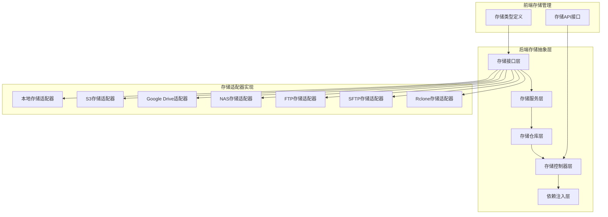

**图表来源**
- [storage.go:1-56](file://backend/internal/storage/storage.go#L1-L56)
- [interfaces.go:1-38](file://backend/internal/features/storages/interfaces.go#L1-L38)
- [enums.go:1-15](file://backend/internal/features/storages/enums.go#L1-L15)

**章节来源**
- [storage.go:1-56](file://backend/internal/storage/storage.go#L1-L56)
- [interfaces.go:1-38](file://backend/internal/features/storages/interfaces.go#L1-L38)
- [enums.go:1-15](file://backend/internal/features/storages/enums.go#L1-L15)

## 核心组件

### 存储接口定义

存储抽象层的核心是定义了标准的存储接口，所有存储适配器都必须实现这些接口：

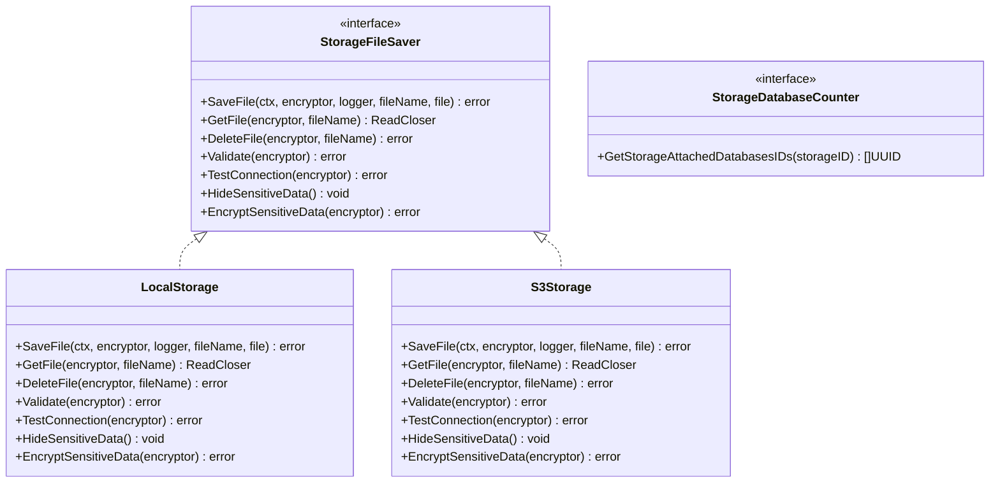

**图表来源**
- [interfaces.go:13-33](file://backend/internal/features/storages/interfaces.go#L13-L33)
- [local/model.go:38-197](file://backend/internal/features/storages/models/local/model.go#L38-L197)
- [s3/model.go:56-347](file://backend/internal/features/storages/models/s3/model.go#L56-L347)

存储接口定义了以下核心方法：

1. **文件操作方法**：SaveFile、GetFile、DeleteFile
2. **验证方法**：Validate用于验证存储配置的有效性
3. **连接测试**：TestConnection用于测试存储连接的可用性
4. **敏感数据处理**：HideSensitiveData和EncryptSensitiveData用于数据安全处理

**章节来源**
- [interfaces.go:13-38](file://backend/internal/features/storages/interfaces.go#L13-L38)

### 存储类型枚举

系统支持多种存储类型，每种类型都有其特定的配置参数和行为特征：

| 存储类型 | 描述 | 主要用途 |
|---------|------|----------|
| LOCAL | 本地文件系统存储 | 开发环境、小规模部署 |
| S3 | AWS S3兼容存储 | 云存储、大规模部署 |
| GOOGLE_DRIVE | Google云端硬盘 | 个人用户、协作场景 |
| NAS | 网络附加存储 | 企业内部网络存储 |
| AZURE_BLOB | Azure Blob存储 | 微软生态系统集成 |
| FTP | 文件传输协议 | 传统文件服务器 |
| SFTP | 安全文件传输协议 | 安全文件传输场景 |
| RCLONE | Rclone存储适配器 | 多云存储聚合 |

**章节来源**
- [enums.go:5-14](file://backend/internal/features/storages/enums.go#L5-L14)

## 架构概览

存储抽象层采用分层架构设计，确保各层职责清晰分离：

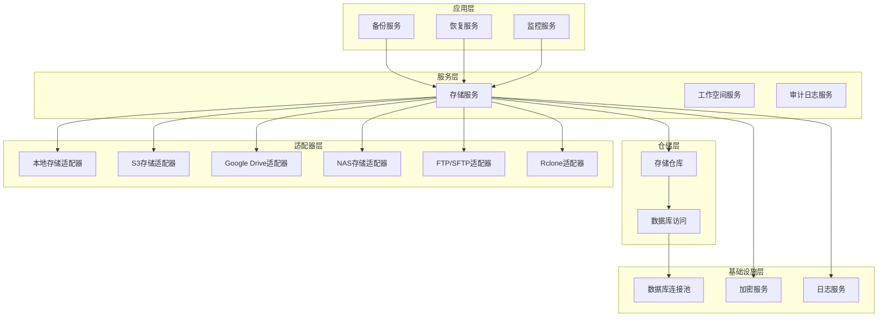

**图表来源**
- [service.go:16-22](file://backend/internal/features/storages/service.go#L16-L22)
- [repository.go:10-52](file://backend/internal/features/storages/repository.go#L10-L52)
- [di.go:11-25](file://backend/internal/features/storages/di.go#L11-L25)

### 依赖注入机制

存储抽象层使用依赖注入模式来管理组件间的依赖关系：

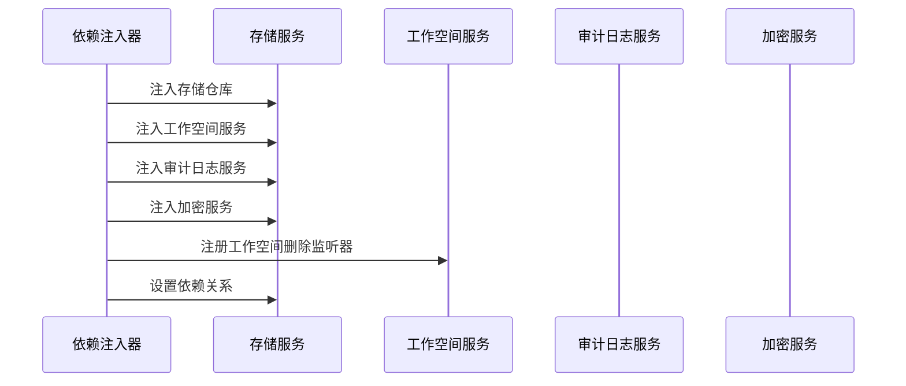

**图表来源**
- [di.go:11-37](file://backend/internal/features/storages/di.go#L11-L37)

**章节来源**
- [di.go:1-37](file://backend/internal/features/storages/di.go#L1-L37)

## 详细组件分析

### 数据库连接管理

存储抽象层使用GORM作为ORM框架，并实现了连接池管理：

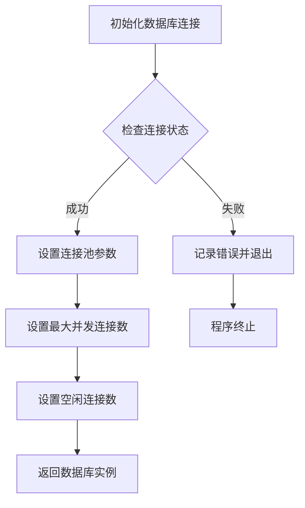

**图表来源**
- [storage.go:26-55](file://backend/internal/storage/storage.go#L26-L55)

连接池配置参数：
- 最大打开连接数：10个
- 最大空闲连接数：10个
- 连接生命周期：默认由GORM管理

**章节来源**
- [storage.go:1-56](file://backend/internal/storage/storage.go#L1-L56)

### 存储服务核心逻辑

存储服务负责协调各种存储操作，包括保存、删除、测试连接等功能：

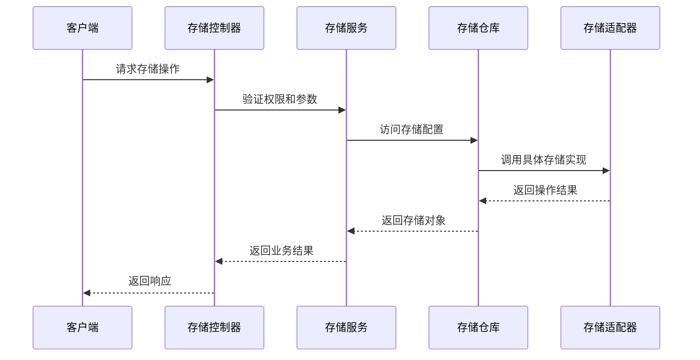

**图表来源**
- [service.go:54-147](file://backend/internal/features/storages/service.go#L54-L147)
- [controller.go:171-217](file://backend/internal/features/storages/controller.go#L171-L217)

**章节来源**
- [service.go:1-409](file://backend/internal/features/storages/service.go#L1-L409)
- [controller.go:171-217](file://backend/internal/features/storages/controller.go#L171-L217)

### 本地存储适配器

本地存储适配器是最简单的存储实现，直接使用文件系统：

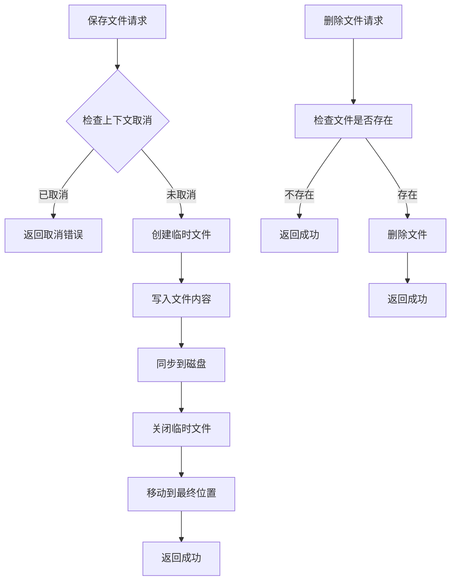

**图表来源**
- [local/model.go:38-169](file://backend/internal/features/storages/models/local/model.go#L38-L169)

本地存储的特点：
- 使用双缓冲机制优化I/O性能
- 支持跨设备文件移动（处理Docker卷挂载）
- 自动目录创建和清理

**章节来源**
- [local/model.go:1-279](file://backend/internal/features/storages/models/local/model.go#L1-L279)

### S3存储适配器

S3存储适配器实现了完整的S3兼容存储功能：

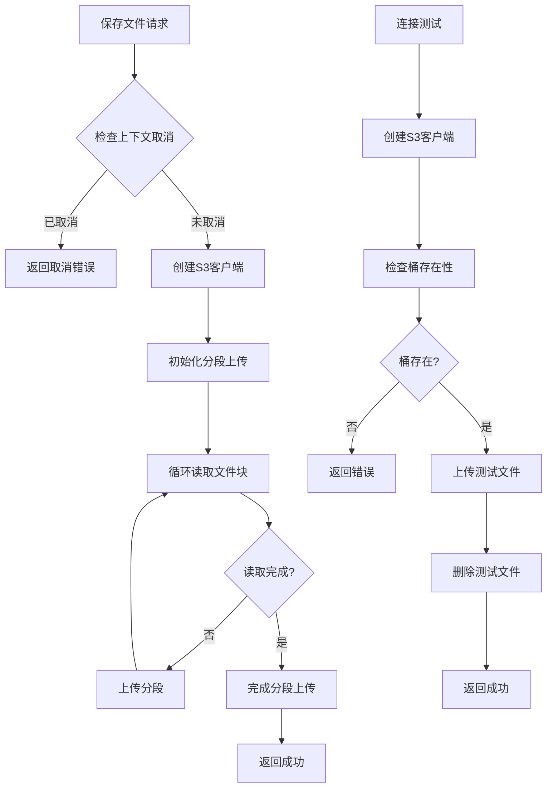

**图表来源**
- [s3/model.go:56-186](file://backend/internal/features/storages/models/s3/model.go#L56-L186)
- [s3/model.go:265-322](file://backend/internal/features/storages/models/s3/model.go#L265-L322)

S3存储的关键特性：
- 分段上传支持大文件
- MD5校验确保数据完整性
- 可配置的存储类别
- TLS证书验证选项

**章节来源**
- [s3/model.go:1-480](file://backend/internal/features/storages/models/s3/model.go#L1-L480)

### Google Drive存储适配器

Google Drive存储适配器提供了OAuth2认证和自动令牌刷新功能：

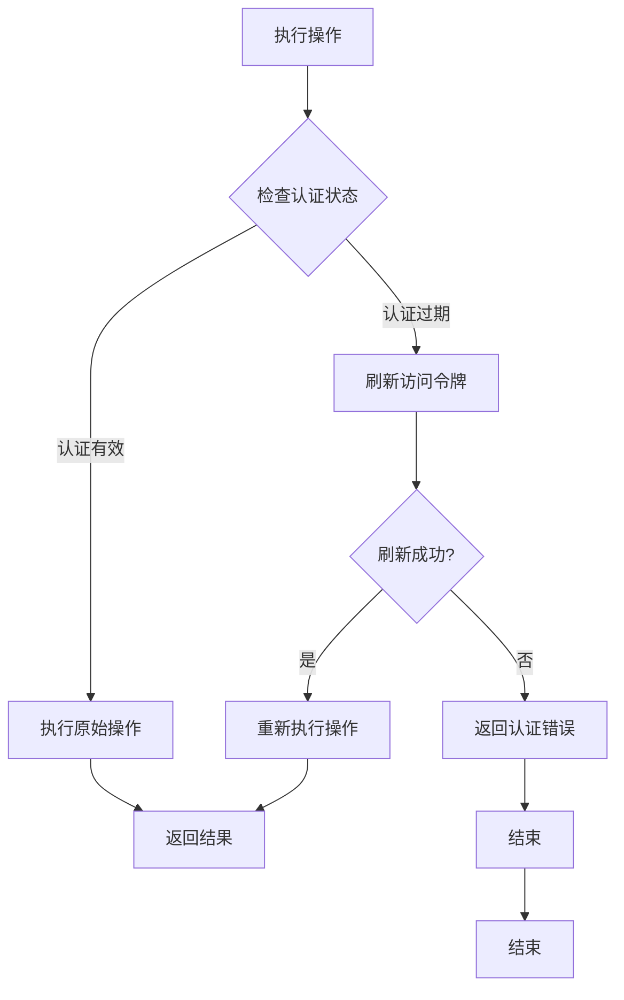

**图表来源**
- [google_drive/model.go:328-388](file://backend/internal/features/storages/models/google_drive/model.go#L328-L388)

Google Drive存储的特殊处理：
- OAuth2令牌自动刷新机制
- 断线重连和重试逻辑
- 响应式上传避免内存溢出
- 查询转义防止SQL注入

**章节来源**
- [google_drive/model.go:1-690](file://backend/internal/features/storages/models/google_drive/model.go#L1-L690)

### NAS存储适配器

NAS存储适配器支持SMB/CIFS协议，适用于企业网络存储：

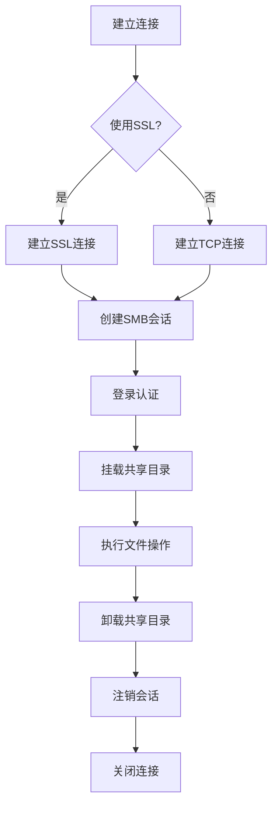

**图表来源**
- [nas/model.go:311-345](file://backend/internal/features/storages/models/nas/model.go#L311-L345)

NAS存储的特点：
- 支持SMB2协议
- 可选SSL加密传输
- 自动目录层级创建
- 资源自动清理机制

**章节来源**
- [nas/model.go:1-533](file://backend/internal/features/storages/models/nas/model.go#L1-L533)

### FTP/SFTP存储适配器

FTP和SFTP存储适配器提供了两种不同的文件传输方案：

| 特性 | FTP | SFTP |
|------|-----|------|
| 传输安全性 | 明文传输 | 加密传输 |
| 认证方式 | 用户名密码 | 密码或私钥 |
| 协议基础 | TCP | SSH |
| 性能表现 | 较快 | 中等 |
| 兼容性 | 广泛支持 | 标准协议 |

**章节来源**
- [ftp/model.go:1-374](file://backend/internal/features/storages/models/ftp/model.go#L1-L374)
- [sftp/model.go:1-431](file://backend/internal/features/storages/models/sftp/model.go#L1-L431)

### Rclone存储适配器

Rclone存储适配器提供了对众多云存储服务的统一访问接口：

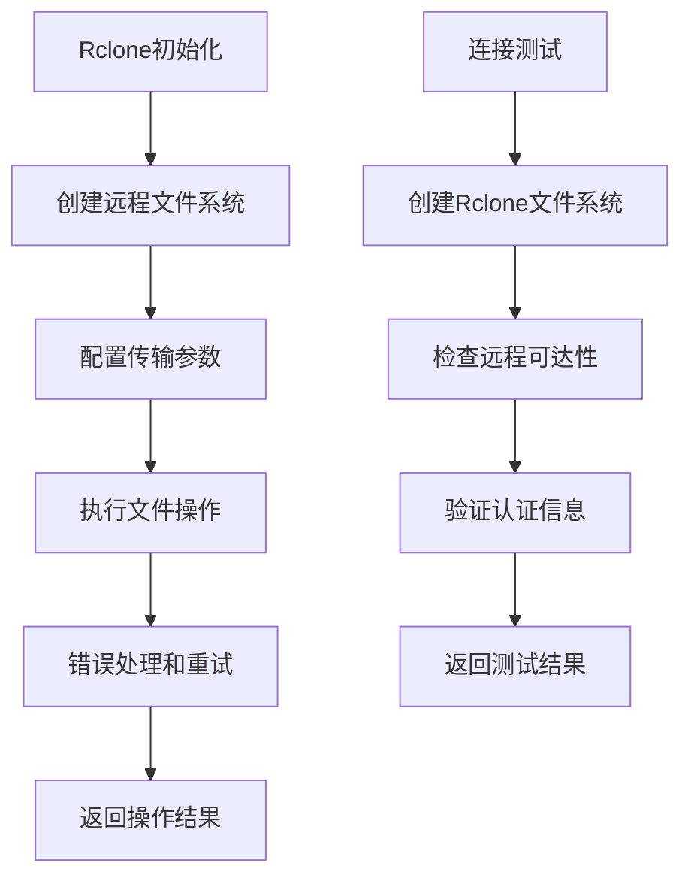

**图表来源**
- [rclone/model.go:56-90](file://backend/internal/features/storages/models/rclone/model.go#L56-L90)

**章节来源**
- [rclone/model.go:1-431](file://backend/internal/features/storages/models/rclone/model.go#L1-L431)

## 依赖关系分析

存储抽象层的依赖关系体现了清晰的分层架构：

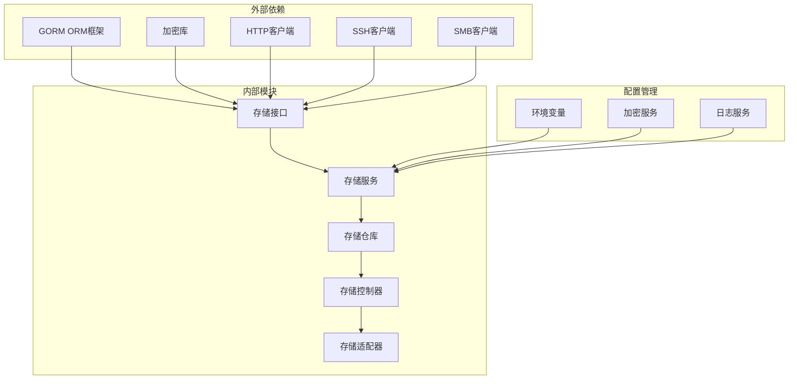

**图表来源**
- [repository.go:3-8](file://backend/internal/features/storages/repository.go#L3-L8)
- [service.go:3-14](file://backend/internal/features/storages/service.go#L3-L14)

### 前端集成

前端存储管理通过API接口与后端存储抽象层交互：

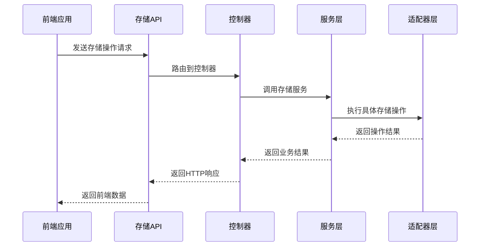

**图表来源**
- [storageApi.ts:6-67](file://frontend/src/entity/storages/api/storageApi.ts#L6-L67)
- [index.ts:1-14](file://frontend/src/entity/storages/index.ts#L1-L14)

**章节来源**
- [storageApi.ts:1-67](file://frontend/src/entity/storages/api/storageApi.ts#L1-L67)
- [index.ts:1-14](file://frontend/src/entity/storages/index.ts#L1-L14)

## 性能考虑

存储抽象层在设计时充分考虑了性能优化：

### 连接池管理
- 数据库连接池：最大10个并发连接
- HTTP客户端连接复用
- SSH连接持久化
- SMB会话缓存

### 内存优化
- 分块读写机制（8-16MB块大小）
- 上下文感知的取消处理
- 资源自动清理机制
- 流式文件传输

### 网络优化
- 可配置的超时时间
- 连接重试机制
- 错误快速失败
- 背压控制

### 缓存策略
- 存储配置缓存
- 认证令牌缓存
- 文件元数据缓存

## 故障排除指南

### 常见问题诊断

1. **连接超时问题**
   - 检查网络连通性
   - 验证防火墙设置
   - 调整超时参数

2. **认证失败**
   - 确认凭据正确性
   - 检查令牌有效期
   - 验证权限范围

3. **文件传输失败**
   - 检查磁盘空间
   - 验证路径权限
   - 监控网络稳定性

### 日志分析

存储抽象层提供了详细的日志记录：
- 操作开始和结束标记
- 错误详情和堆栈跟踪
- 性能指标统计
- 安全事件记录

**章节来源**
- [local/model.go:51-136](file://backend/internal/features/storages/models/local/model.go#L51-L136)
- [s3/model.go:69-186](file://backend/internal/features/storages/models/s3/model.go#L69-L186)

## 结论

Databasus存储抽象层通过精心设计的适配器模式和统一接口，成功实现了存储系统的高度可扩展性和可维护性。该架构不仅支持当前的多种存储类型，还为未来的新存储类型扩展提供了清晰的路径。

关键优势包括：
- **统一接口**：所有存储类型通过相同接口提供一致的用户体验
- **可插拔架构**：新的存储类型可以轻松集成
- **强类型安全**：编译时类型检查确保代码质量
- **性能优化**：针对不同存储类型的特定优化
- **错误处理**：完善的错误处理和恢复机制

## 附录

### 扩展指南

要为存储抽象层添加新的存储类型，需要遵循以下步骤：

1. **定义存储模型**
   ```go
   type NewStorage struct {
       StorageID uuid.UUID `json:"storageId"`
       // 新存储特有的字段
   }
   ```

2. **实现存储接口**
   - 实现所有必需的方法
   - 处理敏感数据加密
   - 实现连接测试逻辑

3. **注册存储类型**
   - 在枚举中添加新类型
   - 在仓库中添加类型分支
   - 更新依赖注入配置

4. **编写测试用例**
   - 单元测试覆盖所有方法
   - 集成测试验证完整流程
   - 性能测试评估效率

### 最佳实践

- **错误处理**：始终检查和传播错误
- **资源管理**：确保所有资源正确释放
- **日志记录**：提供详细的调试信息
- **安全考虑**：保护敏感数据和认证信息
- **性能监控**：定期评估和优化性能