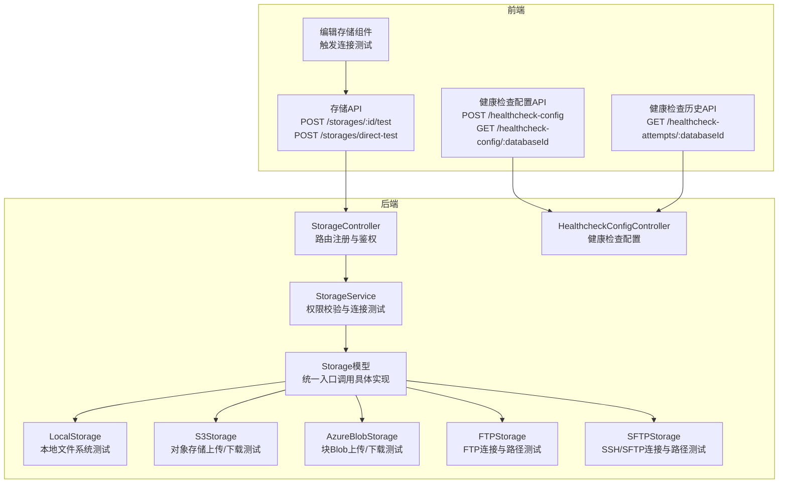
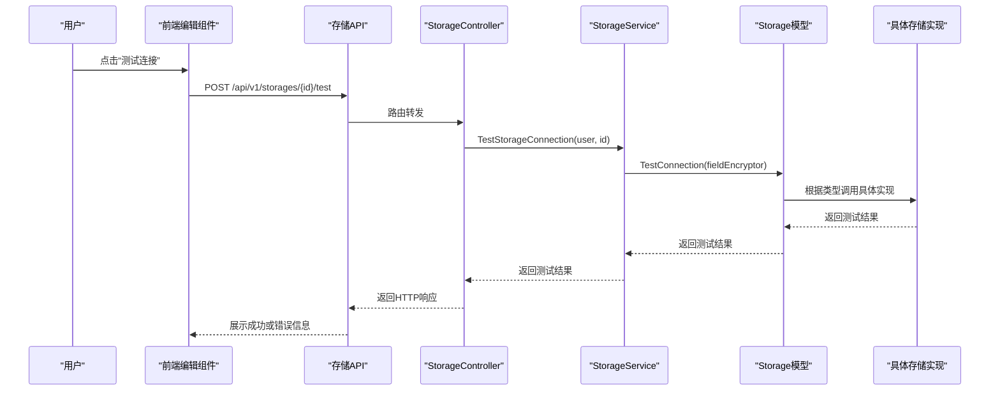
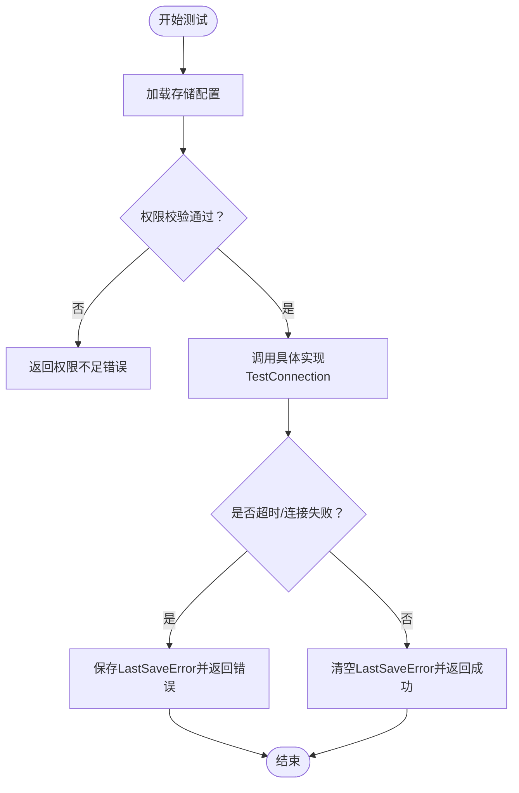
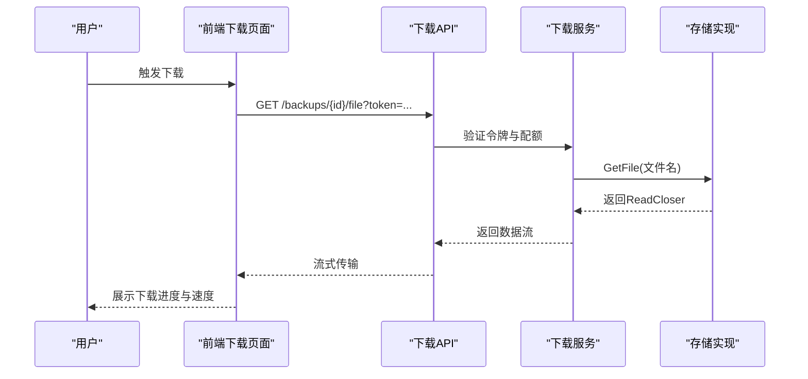
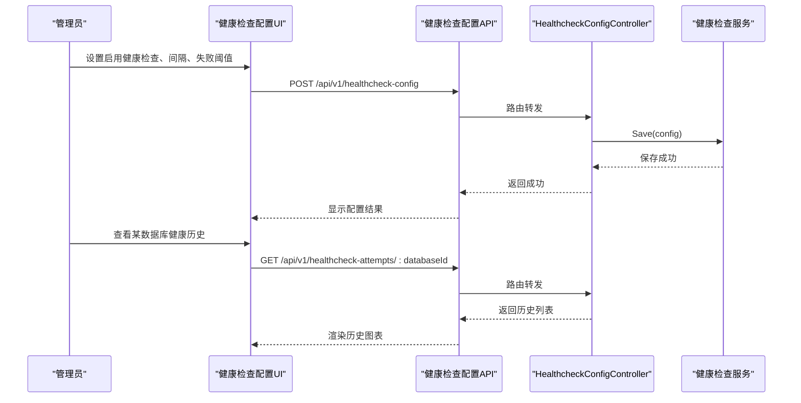
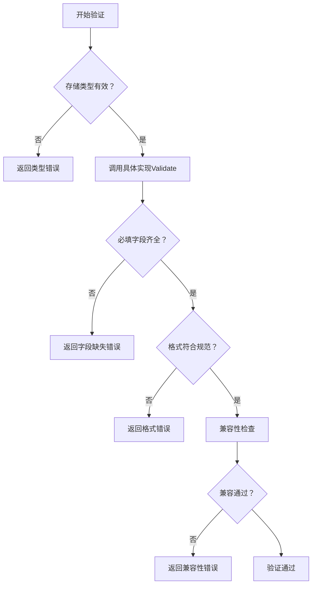
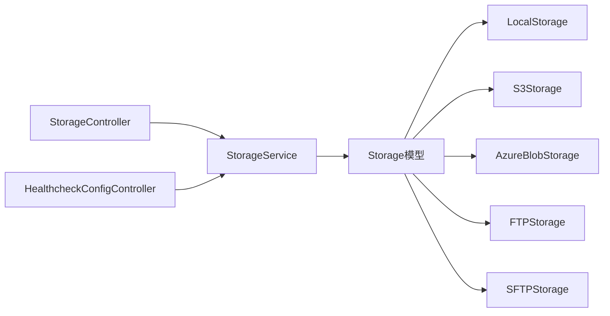

# 存储测试与验证

<cite>
**本文档引用的文件**
- [backend/internal/features/storages/controller.go](file://backend/internal/features/storages/controller.go)
- [backend/internal/features/storages/service.go](file://backend/internal/features/storages/service.go)
- [backend/internal/features/storages/model.go](file://backend/internal/features/storages/model.go)
- [backend/internal/features/storages/interfaces.go](file://backend/internal/features/storages/interfaces.go)
- [backend/internal/features/storages/enums.go](file://backend/internal/features/storages/enums.go)
- [backend/internal/features/storages/errors.go](file://backend/internal/features/storages/errors.go)
- [backend/internal/features/storages/models/local/model.go](file://backend/internal/features/storages/models/local/model.go)
- [backend/internal/features/storages/models/ftp/model.go](file://backend/internal/features/storages/models/ftp/model.go)
- [backend/internal/features/storages/models/sftp/model.go](file://backend/internal/features/storages/models/sftp/model.go)
- [backend/internal/features/storages/models/s3/model.go](file://backend/internal/features/storages/models/s3/model.go)
- [backend/internal/features/storages/models/azure_blob/model.go](file://backend/internal/features/storages/models/azure_blob/model.go)
- [backend/internal/features/healthcheck/config/controller.go](file://backend/internal/features/healthcheck/config/controller.go)
- [frontend/src/entity/storages/api/storageApi.ts](file://frontend/src/entity/storages/api/storageApi.ts)
- [frontend/src/entity/healthcheck/model/HealthcheckConfig.ts](file://frontend/src/entity/healthcheck/model/HealthcheckConfig.ts)
- [frontend/src/entity/healthcheck/api/healthcheckConfigApi.ts](file://frontend/src/entity/healthcheck/api/healthcheckConfigApi.ts)
- [frontend/src/entity/healthcheck/api/healthcheckAttemptApi.ts](file://frontend/src/entity/healthcheck/api/healthcheckAttemptApi.ts)
- [frontend/src/features/storages/ui/edit/EditStorageComponent.tsx](file://frontend/src/features/storages/ui/edit/EditStorageComponent.tsx)
- [backend/internal/features/backups/backups/controllers/controller_test.go](file://backend/internal/features/backups/backups/controllers/controller_test.go)
- [backend/internal/features/telemetry/service.go](file://backend/internal/features/telemetry/service.go)
- [backend/internal/features/telemetry/dto.go](file://backend/internal/features/telemetry/dto.go)
</cite>

## 目录
1. [简介](#简介)
2. [项目结构](#项目结构)
3. [核心组件](#核心组件)
4. [架构总览](#架构总览)
5. [详细组件分析](#详细组件分析)
6. [依赖分析](#依赖分析)
7. [性能考虑](#性能考虑)
8. [故障排查指南](#故障排查指南)
9. [结论](#结论)
10. [附录](#附录)

## 简介
本文件面向Databasus存储系统的测试与验证，系统性阐述以下能力：
- 存储连通性测试：覆盖网络连通性检查、认证有效性验证、权限范围测试
- 存储性能测试：上传速度测试、下载速度测试、并发性能评估
- 存储可用性监控：健康状态检查、故障检测、自动恢复尝试
- 存储配置验证：参数完整性检查、格式验证、兼容性测试
- 测试结果解读：常见错误原因分析与解决方案
- 自动化脚本与手动测试步骤：前后端协同的测试流程

## 项目结构
Databasus采用后端Go服务+前端React管理界面的分层架构。存储测试相关的核心代码分布于：
- 后端存储模块：控制器、服务层、存储模型与具体云/本地实现
- 健康检查模块：配置与历史记录的前后端接口
- 前端存储UI：连接测试触发、错误提示与用户交互
- 性能测试：备份下载带宽节流与并发场景的单元测试

**图表来源**
- [backend/internal/features/storages/controller.go:19-27](file://backend/internal/features/storages/controller.go#L19-L27)
- [backend/internal/features/storages/service.go:249-315](file://backend/internal/features/storages/service.go#L249-L315)
- [backend/internal/features/storages/model.go:83-85](file://backend/internal/features/storages/model.go#L83-L85)
- [backend/internal/features/healthcheck/config/controller.go:16-19](file://backend/internal/features/healthcheck/config/controller.go#L16-L19)

**章节来源**
- [backend/internal/features/storages/controller.go:19-340](file://backend/internal/features/storages/controller.go#L19-L340)
- [backend/internal/features/storages/service.go:249-315](file://backend/internal/features/storages/service.go#L249-L315)
- [backend/internal/features/storages/model.go:22-104](file://backend/internal/features/storages/model.go#L22-L104)

## 核心组件
- 存储控制器（StorageController）：提供保存、查询、删除、连接测试、直接测试、工作区转移等接口；负责鉴权与参数校验
- 存储服务（StorageService）：执行权限校验、调用具体存储实现进行连接测试、持久化最后错误信息
- 存储模型（Storage）：统一抽象，根据类型委托到具体实现（本地、S3、Azure Blob、FTP、SFTP等）
- 具体存储实现：针对不同协议/云厂商实现连接测试、文件读写、参数校验
- 健康检查控制器：提供健康检查配置的保存与查询接口
- 前端存储API：封装连接测试请求与直接测试请求
- 前端健康检查API：封装健康检查配置与历史记录请求

**章节来源**
- [backend/internal/features/storages/controller.go:19-340](file://backend/internal/features/storages/controller.go#L19-L340)
- [backend/internal/features/storages/service.go:249-315](file://backend/internal/features/storages/service.go#L249-L315)
- [backend/internal/features/storages/model.go:83-104](file://backend/internal/features/storages/model.go#L83-L104)
- [backend/internal/features/healthcheck/config/controller.go:16-88](file://backend/internal/features/healthcheck/config/controller.go#L16-L88)
- [frontend/src/entity/storages/api/storageApi.ts:42-57](file://frontend/src/entity/storages/api/storageApi.ts#L42-L57)

## 架构总览
存储测试在后端通过“控制器-服务-模型-实现”的分层设计完成，前端通过API触发测试并展示结果。

**图表来源**
- [frontend/src/entity/storages/api/storageApi.ts:42-48](file://frontend/src/entity/storages/api/storageApi.ts#L42-L48)
- [backend/internal/features/storages/controller.go:192-227](file://backend/internal/features/storages/controller.go#L192-L227)
- [backend/internal/features/storages/service.go:249-280](file://backend/internal/features/storages/service.go#L249-L280)
- [backend/internal/features/storages/model.go:83-85](file://backend/internal/features/storages/model.go#L83-L85)

## 详细组件分析

### 存储连通性测试机制
- 网络连通性检查：各实现均设置超时上下文，确保连接失败不会无限阻塞
- 认证有效性验证：解密敏感字段后进行连接，失败时返回明确错误
- 权限范围测试：服务层在测试前校验用户对工作区的访问权限，避免越权操作

**图表来源**
- [backend/internal/features/storages/service.go:258-280](file://backend/internal/features/storages/service.go#L258-L280)
- [backend/internal/features/storages/model.go:83-85](file://backend/internal/features/storages/model.go#L83-L85)

**章节来源**
- [backend/internal/features/storages/service.go:249-315](file://backend/internal/features/storages/service.go#L249-L315)
- [backend/internal/features/storages/model.go:83-85](file://backend/internal/features/storages/model.go#L83-L85)
- [backend/internal/features/storages/errors.go:15-17](file://backend/internal/features/storages/errors.go#L15-L17)

### 存储性能测试功能
- 上传速度测试：基于分块上传策略（S3多部分上传、Azure分块上传），通过固定块大小与顺序提交实现背压控制，便于测量实际吞吐
- 下载速度测试：通过下载流式读取验证带宽与延迟；结合带宽节流与并发场景测试
- 并发性能评估：单元测试覆盖单下载使用率、多下载共享带宽、动态调整等场景

**图表来源**
- [backend/internal/features/backups/backups/controllers/controller_test.go:1750-2031](file://backend/internal/features/backups/backups/controllers/controller_test.go#L1750-L2031)
- [backend/internal/features/storages/models/s3/model.go:56-186](file://backend/internal/features/storages/models/s3/model.go#L56-L186)
- [backend/internal/features/storages/models/azure_blob/model.go:68-157](file://backend/internal/features/storages/models/azure_blob/model.go#L68-L157)

**章节来源**
- [backend/internal/features/backups/backups/controllers/controller_test.go:1750-2031](file://backend/internal/features/backups/backups/controllers/controller_test.go#L1750-L2031)
- [backend/internal/features/storages/models/s3/model.go:56-186](file://backend/internal/features/storages/models/s3/model.go#L56-L186)
- [backend/internal/features/storages/models/azure_blob/model.go:68-157](file://backend/internal/features/storages/models/azure_blob/model.go#L68-L157)

### 存储可用性监控机制
- 健康状态检查：通过健康检查配置控制器保存与查询数据库的健康检查策略
- 故障检测：前端可按数据库ID拉取健康检查历史，识别连续失败次数与持续时间
- 自动恢复尝试：后端在特定场景下具备重试逻辑（如备份上传失败后的重试）

**图表来源**
- [frontend/src/entity/healthcheck/api/healthcheckConfigApi.ts:7-23](file://frontend/src/entity/healthcheck/api/healthcheckConfigApi.ts#L7-L23)
- [frontend/src/entity/healthcheck/api/healthcheckAttemptApi.ts:6-14](file://frontend/src/entity/healthcheck/api/healthcheckAttemptApi.ts#L6-L14)
- [backend/internal/features/healthcheck/config/controller.go:33-87](file://backend/internal/features/healthcheck/config/controller.go#L33-L87)

**章节来源**
- [frontend/src/entity/healthcheck/model/HealthcheckConfig.ts:1-10](file://frontend/src/entity/healthcheck/model/HealthcheckConfig.ts#L1-L10)
- [frontend/src/entity/healthcheck/api/healthcheckConfigApi.ts:7-23](file://frontend/src/entity/healthcheck/api/healthcheckConfigApi.ts#L7-L23)
- [frontend/src/entity/healthcheck/api/healthcheckAttemptApi.ts:6-14](file://frontend/src/entity/healthcheck/api/healthcheckAttemptApi.ts#L6-L14)
- [backend/internal/features/healthcheck/config/controller.go:33-87](file://backend/internal/features/healthcheck/config/controller.go#L33-L87)

### 存储配置验证流程
- 参数完整性检查：各实现对必填字段进行校验（如S3的桶、区域、密钥；FTP/SFTP的主机、端口、凭据）
- 格式验证：端口范围、路径合法性、TLS跳过选项等
- 兼容性测试：通过集成测试覆盖多种存储类型与环境变量配置

**图表来源**
- [backend/internal/features/storages/model.go:71-81](file://backend/internal/features/storages/model.go#L71-L81)
- [backend/internal/features/storages/models/s3/model.go:1-200](file://backend/internal/features/storages/models/s3/model.go#L1-L200)
- [backend/internal/features/storages/models/ftp/model.go:165-180](file://backend/internal/features/storages/models/ftp/model.go#L165-L180)
- [backend/internal/features/storages/models/sftp/model.go:194-201](file://backend/internal/features/storages/models/sftp/model.go#L194-L201)

**章节来源**
- [backend/internal/features/storages/model.go:71-81](file://backend/internal/features/storages/model.go#L71-L81)
- [backend/internal/features/storages/enums.go:3-14](file://backend/internal/features/storages/enums.go#L3-L14)
- [backend/internal/features/storages/models/s3/model.go:1-200](file://backend/internal/features/storages/models/s3/model.go#L1-L200)
- [backend/internal/features/storages/models/ftp/model.go:165-180](file://backend/internal/features/storages/models/ftp/model.go#L165-L180)
- [backend/internal/features/storages/models/sftp/model.go:194-201](file://backend/internal/features/storages/models/sftp/model.go#L194-L201)

### 存储测试结果解读指南
- 连接测试失败常见原因
  - 权限不足：用户无访问该工作区的权限
  - 凭证错误：解密后仍无法建立连接（主机、端口、用户名、密码、私钥、密钥等）
  - 网络不可达：超时或DNS解析失败
  - 路径不存在且无法创建：目标路径权限或挂载问题
- 解决方案
  - 检查工作区权限与角色
  - 复核并重新加密敏感字段
  - 使用工具验证网络连通性与端口可达性
  - 确认路径存在或允许自动创建

**章节来源**
- [backend/internal/features/storages/errors.go:15-17](file://backend/internal/features/storages/errors.go#L15-L17)
- [backend/internal/features/storages/service.go:258-280](file://backend/internal/features/storages/service.go#L258-L280)
- [backend/internal/features/storages/models/local/model.go:175-190](file://backend/internal/features/storages/models/local/model.go#L175-L190)
- [backend/internal/features/storages/models/ftp/model.go:182-201](file://backend/internal/features/storages/models/ftp/model.go#L182-L201)
- [backend/internal/features/storages/models/sftp/model.go:203-223](file://backend/internal/features/storages/models/sftp/model.go#L203-L223)

### 自动化脚本与手动测试步骤
- 自动化脚本
  - 前端：通过编辑存储组件触发“测试连接”按钮，自动调用后端接口
  - 后端：控制器与服务层完成鉴权、权限校验与连接测试
- 手动测试步骤
  - 在前端编辑存储页面选择对应类型，填写必要参数
  - 点击“测试连接”，查看提示信息
  - 如失败，根据错误信息逐项修正（权限、凭证、网络、路径）
  - 对于下载性能，可在备份下载场景中观察带宽使用与并发行为

**章节来源**
- [frontend/src/features/storages/ui/edit/EditStorageComponent.tsx:78-90](file://frontend/src/features/storages/ui/edit/EditStorageComponent.tsx#L78-L90)
- [frontend/src/entity/storages/api/storageApi.ts:42-57](file://frontend/src/entity/storages/api/storageApi.ts#L42-L57)
- [backend/internal/features/storages/controller.go:192-227](file://backend/internal/features/storages/controller.go#L192-L227)
- [backend/internal/features/storages/service.go:249-280](file://backend/internal/features/storages/service.go#L249-L280)

## 依赖分析
- 控制器依赖服务层，服务层依赖存储模型与工作区服务
- 存储模型通过接口委托到具体实现，实现类型切换与扩展
- 健康检查控制器独立于存储模块，但与数据库模块协作

**图表来源**
- [backend/internal/features/storages/controller.go:14-17](file://backend/internal/features/storages/controller.go#L14-L17)
- [backend/internal/features/storages/service.go:16-22](file://backend/internal/features/storages/service.go#L16-L22)
- [backend/internal/features/storages/model.go:22-39](file://backend/internal/features/storages/model.go#L22-L39)
- [backend/internal/features/healthcheck/config/controller.go:12-14](file://backend/internal/features/healthcheck/config/controller.go#L12-L14)

**章节来源**
- [backend/internal/features/storages/interfaces.go:13-33](file://backend/internal/features/storages/interfaces.go#L13-L33)
- [backend/internal/features/storages/enums.go:3-14](file://backend/internal/features/storages/enums.go#L3-L14)

## 性能考虑
- 上传背压：S3与Azure实现采用固定块大小分块上传，避免内存峰值过高，同时便于观测吞吐
- 下载并发：单元测试覆盖多并发下载场景，验证带宽共享与动态调整
- 超时控制：各类实现均设置连接、响应、空闲连接等超时，防止长时间阻塞
- 健康检查频率：通过健康检查配置控制轮询间隔与失败阈值，平衡监控灵敏度与系统负载

**章节来源**
- [backend/internal/features/storages/models/s3/model.go:25-36](file://backend/internal/features/storages/models/s3/model.go#L25-L36)
- [backend/internal/features/storages/models/azure_blob/model.go:25-35](file://backend/internal/features/storages/models/azure_blob/model.go#L25-L35)
- [backend/internal/features/backups/backups/controllers/controller_test.go:1750-2031](file://backend/internal/features/backups/backups/controllers/controller_test.go#L1750-L2031)

## 故障排查指南
- 连接测试失败
  - 检查工作区权限与用户角色
  - 核对并重新加密敏感字段
  - 验证网络连通性与端口可达性
  - 确认路径存在或允许自动创建
- 下载异常
  - 检查令牌有效性与过期时间
  - 观察带宽节流与并发限制
  - 分析下载历史与失败次数
- 健康检查告警
  - 调整健康检查间隔与失败阈值
  - 结合历史记录定位故障时段与根因

**章节来源**
- [backend/internal/features/storages/errors.go:15-17](file://backend/internal/features/storages/errors.go#L15-L17)
- [frontend/src/entity/healthcheck/api/healthcheckAttemptApi.ts:6-14](file://frontend/src/entity/healthcheck/api/healthcheckAttemptApi.ts#L6-L14)

## 结论
Databasus的存储测试体系以“控制器-服务-模型-实现”为核心，结合前端直观的连接测试与健康检查历史，形成从连通性、性能到可用性的完整闭环。通过严格的权限校验、超时控制与分块上传策略，系统在保证稳定性的同时提供了可靠的性能观测与故障诊断能力。

## 附录
- 存储类型枚举与名称映射
  - 类型：LOCAL、S3、GOOGLE_DRIVE、NAS、AZURE_BLOB、FTP、SFTP、RCLONE
  - 名称映射：用于前端显示与用户理解

**章节来源**
- [backend/internal/features/storages/enums.go:3-14](file://backend/internal/features/storages/enums.go#L3-L14)
- [frontend/src/entity/storages/models/getStorageNameFromType.ts:3-24](file://frontend/src/entity/storages/models/getStorageNameFromType.ts#L3-L24)