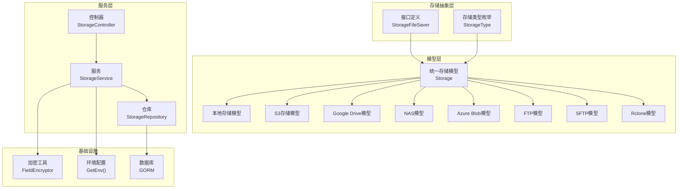
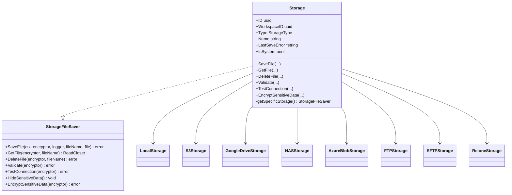
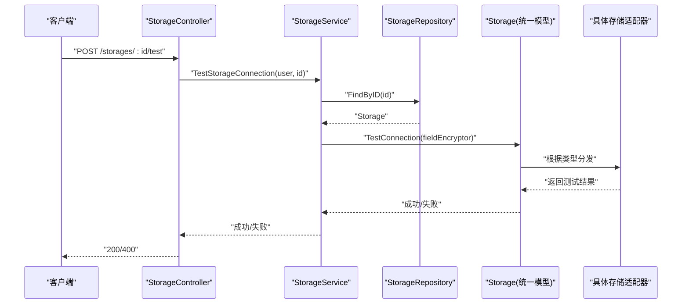
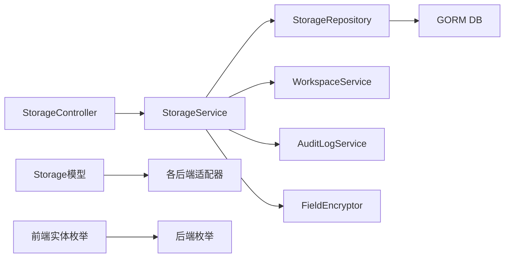

# 存储管理模块

<cite>
**本文引用的文件**
- [backend/internal/features/storages/interfaces.go](file://backend/internal/features/storages/interfaces.go)
- [backend/internal/features/storages/enums.go](file://backend/internal/features/storages/enums.go)
- [backend/internal/features/storages/model.go](file://backend/internal/features/storages/model.go)
- [backend/internal/features/storages/controller.go](file://backend/internal/features/storages/controller.go)
- [backend/internal/features/storages/service.go](file://backend/internal/features/storages/service.go)
- [backend/internal/features/storages/repository.go](file://backend/internal/features/storages/repository.go)
- [backend/internal/features/storages/dto.go](file://backend/internal/features/storages/dto.go)
- [backend/internal/features/storages/errors.go](file://backend/internal/features/storages/errors.go)
- [backend/internal/features/storages/testing.go](file://backend/internal/features/storages/testing.go)
- [backend/internal/features/storages/storages_test.go](file://backend/internal/features/storages/storages_test.go)
- [backend/internal/features/backups/config/repository.go](file://backend/internal/features/backups/config/repository.go)
- [backend/internal/features/restores/restorer_test.go](file://backend/internal/features/restores/restorer_test.go)
- [backend/internal/features/backups/backups/controllers/controller_test.go](file://backend/internal/features/backups/backups/controllers/controller_test.go)
- [backend/internal/features/backups/config/controller_test.go](file://backend/internal/features/backups/config/controller_test.go)
- [backend/internal/features/backups/backups/controllers/postgres_wal_controller_test.go](file://backend/internal/features/backups/backups/controllers/postgres_wal_controller_test.go)
- [backend/internal/features/audit_logs/service.go](file://backend/internal/features/audit_logs/service.go)
- [backend/internal/features/workspaces/services/workspace_service.go](file://backend/internal/features/workspaces/services/workspace_service.go)
- [backend/internal/util/encryption/field_encryptor.go](file://backend/internal/util/encryption/field_encryptor.go)
- [backend/internal/util/encryption/secret_key_field_encryptor.go](file://backend/internal/util/encryption/secret_key_field_encryptor.go)
- [backend/internal/util/encryption/password_generator.go](file://backend/internal/util/encryption/password_generator.go)
- [backend/internal/util/encryption/di.go](file://backend/internal/util/encryption/di.go)
- [backend/internal/storage/storage.go](file://backend/internal/storage/storage.go)
- [backend/internal/config/config.go](file://backend/internal/config/config.go)
- [backend/internal/config/dto.go](file://backend/internal/config/dto.go)
- [backend/internal/features/storages/models/local/local.go](file://backend/internal/features/storages/models/local/local.go)
- [backend/internal/features/storages/models/s3/s3.go](file://backend/internal/features/storages/models/s3/s3.go)
- [backend/internal/features/storages/models/google_drive/google_drive.go](file://backend/internal/features/storages/models/google_drive/google_drive.go)
- [backend/internal/features/storages/models/nas/nas.go](file://backend/internal/features/storages/models/nas/nas.go)
- [backend/internal/features/storages/models/azure_blob/azure_blob.go](file://backend/internal/features/storages/models/azure_blob/azure_blob.go)
- [backend/internal/features/storages/models/ftp/ftp.go](file://backend/internal/features/storages/models/ftp/ftp.go)
- [backend/internal/features/storages/models/sftp/sftp.go](file://backend/internal/features/storages/models/sftp/sftp.go)
- [backend/internal/features/storages/models/rclone/rclone.go](file://backend/internal/features/storages/models/rclone/rclone.go)
</cite>

## 目录
1. [简介](#简介)
2. [项目结构](#项目结构)
3. [核心组件](#核心组件)
4. [架构总览](#架构总览)
5. [详细组件分析](#详细组件分析)
6. [依赖关系分析](#依赖关系分析)
7. [性能与可靠性](#性能与可靠性)
8. [故障排查指南](#故障排查指南)
9. [结论](#结论)
10. [附录](#附录)

## 简介
本文件面向Databasus的“存储管理模块”，系统化阐述其支持的存储类型（本地存储、S3、Azure Blob、Google Drive、FTP、SFTP、NAS、Rclone）的配置与管理方法；深入解析存储抽象层的设计思想（统一接口、适配器模式、多后端集成策略）；说明各类存储的配置参数、认证方式与连接设置；给出存储测试机制（连通性验证、权限检查、性能评估）；并提供最佳实践（安全、性能、成本控制），以及在存储迁移与备份恢复场景下的操作要点与常见问题解决方案。

## 项目结构
存储管理模块位于后端工程的特性层，采用“统一抽象 + 多后端适配”的分层组织方式：
- 抽象层：定义统一接口与枚举，屏蔽具体后端差异
- 模型层：以联合模型聚合各后端配置
- 控制器/服务/仓库：提供REST路由、业务规则、持久化
- 加密工具：对敏感字段进行加密存储与传输
- 前端实体：与UI交互的类型定义与常量

图表来源
- [backend/internal/features/storages/interfaces.go:13-33](file://backend/internal/features/storages/interfaces.go#L13-L33)
- [backend/internal/features/storages/enums.go:3-14](file://backend/internal/features/storages/enums.go#L3-L14)
- [backend/internal/features/storages/model.go:22-39](file://backend/internal/features/storages/model.go#L22-L39)
- [backend/internal/features/storages/controller.go:14-27](file://backend/internal/features/storages/controller.go#L14-L27)
- [backend/internal/features/storages/service.go:16-22](file://backend/internal/features/storages/service.go#L16-L22)
- [backend/internal/features/storages/repository.go:10](file://backend/internal/features/storages/repository.go#L10)
- [backend/internal/util/encryption/field_encryptor.go](file://backend/internal/util/encryption/field_encryptor.go)
- [backend/internal/config/config.go](file://backend/internal/config/config.go)
- [backend/internal/storage/storage.go](file://backend/internal/storage/storage.go)

章节来源
- [backend/internal/features/storages/interfaces.go:13-33](file://backend/internal/features/storages/interfaces.go#L13-L33)
- [backend/internal/features/storages/enums.go:3-14](file://backend/internal/features/storages/enums.go#L3-L14)
- [backend/internal/features/storages/model.go:22-39](file://backend/internal/features/storages/model.go#L22-L39)
- [backend/internal/features/storages/controller.go:19-27](file://backend/internal/features/storages/controller.go#L19-L27)
- [backend/internal/features/storages/service.go:16-22](file://backend/internal/features/storages/service.go#L16-L22)
- [backend/internal/features/storages/repository.go:10](file://backend/internal/features/storages/repository.go#L10)

## 核心组件
- 统一接口：定义保存、读取、删除、校验、连通性测试、敏感信息隐藏与加密等能力，屏蔽后端差异
- 存储类型枚举：集中管理支持的存储类型，便于扩展与维护
- 统一存储模型：聚合各后端配置，通过类型分发到具体适配器
- 控制器：暴露REST接口，负责鉴权、参数绑定与错误处理
- 服务：实现业务规则（权限、系统存储限制、迁移约束）、调用仓库与加密工具
- 仓库：基于GORM的事务化持久化，按类型分别保存/删除具体配置
- 加密工具：对敏感字段进行加密存储，保障数据安全

章节来源
- [backend/internal/features/storages/interfaces.go:13-33](file://backend/internal/features/storages/interfaces.go#L13-L33)
- [backend/internal/features/storages/enums.go:3-14](file://backend/internal/features/storages/enums.go#L3-L14)
- [backend/internal/features/storages/model.go:22-184](file://backend/internal/features/storages/model.go#L22-L184)
- [backend/internal/features/storages/controller.go:42-339](file://backend/internal/features/storages/controller.go#L42-L339)
- [backend/internal/features/storages/service.go:54-408](file://backend/internal/features/storages/service.go#L54-L408)
- [backend/internal/features/storages/repository.go:12-243](file://backend/internal/features/storages/repository.go#L12-L243)
- [backend/internal/util/encryption/field_encryptor.go](file://backend/internal/util/encryption/field_encryptor.go)

## 架构总览
存储管理模块遵循“统一抽象 + 适配器模式 + 分层职责”的设计：
- 抽象层：统一接口定义，确保所有后端具备一致的操作语义
- 适配层：各后端模型实现统一接口，完成具体的IO与认证
- 控制层：控制器接收请求，调用服务层执行业务规则
- 服务层：服务层协调工作区权限、系统存储限制、审计日志与加密
- 数据层：仓库层负责事务化持久化，按类型拆分具体配置表

图表来源
- [backend/internal/features/storages/interfaces.go:13-33](file://backend/internal/features/storages/interfaces.go#L13-L33)
- [backend/internal/features/storages/model.go:22-184](file://backend/internal/features/storages/model.go#L22-L184)

章节来源
- [backend/internal/features/storages/interfaces.go:13-33](file://backend/internal/features/storages/interfaces.go#L13-L33)
- [backend/internal/features/storages/model.go:22-184](file://backend/internal/features/storages/model.go#L22-L184)

## 详细组件分析

### 统一接口与适配器模式
- 统一接口：定义了文件级操作（保存、读取、删除）与存储级操作（校验、连通性测试、敏感信息处理）
- 适配器模式：通过统一模型的类型分发，将调用路由至对应后端适配器，实现多后端一致性

图表来源
- [backend/internal/features/storages/controller.go:204-227](file://backend/internal/features/storages/controller.go#L204-L227)
- [backend/internal/features/storages/service.go:249-280](file://backend/internal/features/storages/service.go#L249-L280)
- [backend/internal/features/storages/repository.go:133-152](file://backend/internal/features/storages/repository.go#L133-L152)
- [backend/internal/features/storages/model.go:83-85](file://backend/internal/features/storages/model.go#L83-L85)

章节来源
- [backend/internal/features/storages/interfaces.go:13-33](file://backend/internal/features/storages/interfaces.go#L13-L33)
- [backend/internal/features/storages/model.go:41-104](file://backend/internal/features/storages/model.go#L41-L104)
- [backend/internal/features/storages/service.go:249-315](file://backend/internal/features/storages/service.go#L249-L315)

### 存储类型与配置参数
- 支持类型：LOCAL、S3、GOOGLE_DRIVE、NAS、AZURE_BLOB、FTP、SFTP、RCLONE
- 配置参数与认证方式由各后端适配器定义，统一通过模型聚合并在保存时加密存储
- 连接设置：由各后端适配器内部封装，控制器与服务不直接感知细节

章节来源
- [backend/internal/features/storages/enums.go:5-14](file://backend/internal/features/storages/enums.go#L5-L14)
- [backend/internal/features/storages/model.go:30-38](file://backend/internal/features/storages/model.go#L30-L38)

### 控制器与路由
- 提供创建/更新、查询、删除、连通性测试、直接测试、工作区转移等REST接口
- 路由注册在模块初始化阶段完成

章节来源
- [backend/internal/features/storages/controller.go:19-27](file://backend/internal/features/storages/controller.go#L19-L27)
- [backend/internal/features/storages/controller.go:42-339](file://backend/internal/features/storages/controller.go#L42-L339)

### 服务层业务规则
- 权限控制：仅允许有相应工作区权限的用户管理存储
- 系统存储限制：系统存储不可被普通用户删除或降级为私有
- 云模式限制：在云模式下，非管理员禁止使用本地存储
- 审计日志：创建、更新、删除、重命名等关键动作记录审计日志
- 迁移约束：迁移前需确认无数据库挂载，且仅允许跨工作区转移

章节来源
- [backend/internal/features/storages/service.go:54-147](file://backend/internal/features/storages/service.go#L54-L147)
- [backend/internal/features/storages/service.go:149-191](file://backend/internal/features/storages/service.go#L149-L191)
- [backend/internal/features/storages/service.go:221-247](file://backend/internal/features/storages/service.go#L221-L247)
- [backend/internal/features/storages/service.go:249-315](file://backend/internal/features/storages/service.go#L249-L315)
- [backend/internal/features/storages/service.go:327-408](file://backend/internal/features/storages/service.go#L327-L408)

### 仓库层持久化
- 事务化保存：先保存主表，再按类型保存具体配置，避免半更新
- 预加载：查询时预加载各后端配置，保证后续操作无需二次查询
- 删除：先删具体配置，再删主表，保持外键一致性

章节来源
- [backend/internal/features/storages/repository.go:12-131](file://backend/internal/features/storages/repository.go#L12-L131)
- [backend/internal/features/storages/repository.go:133-184](file://backend/internal/features/storages/repository.go#L133-L184)
- [backend/internal/features/storages/repository.go:186-243](file://backend/internal/features/storages/repository.go#L186-L243)

### 加密与安全
- 敏感字段加密：保存前对敏感字段进行加密，读取时解密
- 敏感信息隐藏：对外返回时隐藏敏感字段
- 密钥管理：通过加密工具注入FieldEncryptor，确保密钥生命周期管理

章节来源
- [backend/internal/features/storages/model.go:102-104](file://backend/internal/features/storages/model.go#L102-L104)
- [backend/internal/features/storages/model.go:87-89](file://backend/internal/features/storages/model.go#L87-L89)
- [backend/internal/util/encryption/field_encryptor.go](file://backend/internal/util/encryption/field_encryptor.go)
- [backend/internal/util/encryption/secret_key_field_encryptor.go](file://backend/internal/util/encryption/secret_key_field_encryptor.go)

### 测试机制
- 连通性测试：通过控制器的“测试连接”接口触发，服务层调用统一模型的TestConnection
- 权限检查：测试前校验用户对工作区的访问权限
- 直接测试：支持在不落库的情况下对传入的存储对象进行连通性测试

章节来源
- [backend/internal/features/storages/controller.go:204-227](file://backend/internal/features/storages/controller.go#L204-L227)
- [backend/internal/features/storages/controller.go:298-339](file://backend/internal/features/storages/controller.go#L298-L339)
- [backend/internal/features/storages/service.go:249-315](file://backend/internal/features/storages/service.go#L249-L315)

### 存储迁移与备份恢复中的存储操作
- 迁移流程：服务层在迁移前检查是否被数据库挂载，若存在则拒绝；完成后写入双向审计日志
- 备份/恢复：仓库层在查询备份配置时预加载Storage.*配置，确保备份/恢复流程可直接使用存储配置

章节来源
- [backend/internal/features/storages/service.go:327-408](file://backend/internal/features/storages/service.go#L327-L408)
- [backend/internal/features/backups/config/repository.go:64-98](file://backend/internal/features/backups/config/repository.go#L64-L98)

## 依赖关系分析
- 控制器依赖服务层；服务层依赖仓库层、工作区服务、审计日志服务与加密工具
- 仓库层依赖数据库连接；模型层依赖各后端适配器
- 前端实体与后端枚举保持一致，确保UI与后端类型映射正确

图表来源
- [backend/internal/features/storages/controller.go:14-17](file://backend/internal/features/storages/controller.go#L14-L17)
- [backend/internal/features/storages/service.go:16-22](file://backend/internal/features/storages/service.go#L16-L22)
- [backend/internal/features/storages/repository.go:10](file://backend/internal/features/storages/repository.go#L10)
- [backend/internal/features/storages/enums.go:3-14](file://backend/internal/features/storages/enums.go#L3-L14)
- [frontend/src/entity/storages/models/StorageType.ts:1-10](file://frontend/src/entity/storages/models/StorageType.ts#L1-L10)

章节来源
- [backend/internal/features/storages/controller.go:14-17](file://backend/internal/features/storages/controller.go#L14-L17)
- [backend/internal/features/storages/service.go:16-22](file://backend/internal/features/storages/service.go#L16-L22)
- [backend/internal/features/storages/repository.go:10](file://backend/internal/features/storages/repository.go#L10)
- [backend/internal/features/storages/enums.go:3-14](file://backend/internal/features/storages/enums.go#L3-L14)

## 性能与可靠性
- 性能优化建议
  - 使用预加载减少N+1查询，仓库层已对各后端配置进行预加载
  - 事务化保存降低并发写入风险，避免部分更新
  - 对大文件上传采用流式处理，避免内存峰值
- 可靠性建议
  - 连接测试前置，及时发现配置错误
  - 审计日志覆盖关键操作，便于回溯
  - 系统存储隔离，防止误删影响全局

章节来源
- [backend/internal/features/storages/repository.go:133-184](file://backend/internal/features/storages/repository.go#L133-L184)
- [backend/internal/features/storages/service.go:111-122](file://backend/internal/features/storages/service.go#L111-L122)

## 故障排查指南
- 常见错误与定位
  - 权限不足：保存/删除/测试存储时提示权限不足，检查用户角色与工作区权限
  - 系统存储限制：系统存储不可删除或降级，需管理员操作
  - 云模式限制：云模式下本地存储仅管理员可用
  - 存储迁移失败：若存储被数据库挂载，需先迁移/解除挂载数据库
  - 连接失败：检查后端配置、网络连通性与凭据有效性
- 排查步骤
  - 使用“直接测试”接口快速验证配置
  - 查看最近一次保存错误字段，定位具体失败原因
  - 检查审计日志，确认操作历史

章节来源
- [backend/internal/features/storages/errors.go](file://backend/internal/features/storages/errors.go)
- [backend/internal/features/storages/service.go:249-315](file://backend/internal/features/storages/service.go#L249-L315)
- [backend/internal/features/storages/model.go:47-57](file://backend/internal/features/storages/model.go#L47-L57)

## 结论
存储管理模块通过统一接口与适配器模式，实现了对多种存储后端的一致化管理；结合严格的权限控制、系统存储保护、加密与审计机制，确保了在复杂场景下的安全性与可靠性。配合完善的测试与迁移策略，能够支撑备份、恢复与跨工作区迁移等关键业务流程。

## 附录

### 存储类型与配置要点速览
- 本地存储：适用于单机部署，注意路径权限与磁盘空间
- S3：关注区域、桶名、凭证与TLS校验选项
- Azure Blob：关注账户名/密钥、容器与虚拟主机/前缀
- Google Drive：OAuth授权与目录ID
- NAS：共享路径、挂载点与访问权限
- FTP/SFTP：主机、端口、用户名/密码或密钥
- Rclone：远端名称与配置文件

章节来源
- [backend/internal/features/storages/enums.go:5-14](file://backend/internal/features/storages/enums.go#L5-L14)
- [backend/internal/features/storages/model.go:30-38](file://backend/internal/features/storages/model.go#L30-L38)

### 最佳实践
- 安全性
  - 所有敏感字段必须加密存储，定期轮换密钥
  - 限制本地存储在云模式下的使用范围
  - 严格审计日志，保留至少一个完整周期
- 性能
  - 合理选择存储类型与区域，就近访问
  - 大文件分片上传，启用断点续传
  - 连接池与超时参数按后端特性调优
- 成本控制
  - 根据数据生命周期选择存储层级（标准/低频/归档）
  - 设置合理的保留策略与清理任务
  - 监控用量与费用，避免过度冗余

章节来源
- [backend/internal/features/storages/service.go:111-122](file://backend/internal/features/storages/service.go#L111-L122)
- [backend/internal/features/storages/model.go:87-89](file://backend/internal/features/storages/model.go#L87-L89)

### 实际配置示例与常见问题
- 示例参考
  - 创建存储：通过控制器POST /storages，携带workspaceId与具体后端配置
  - 连通性测试：POST /storages/:id/test 或 /storages/direct-test
- 常见问题
  - “权限不足”：确认用户角色与工作区权限
  - “系统存储不可删除”：仅管理员可操作
  - “云模式下本地存储不可用”：切换为其他后端或提升权限
  - “迁移失败”：先迁移/解除挂载数据库

章节来源
- [backend/internal/features/storages/controller.go:42-339](file://backend/internal/features/storages/controller.go#L42-L339)
- [backend/internal/features/storages/service.go:327-408](file://backend/internal/features/storages/service.go#L327-L408)