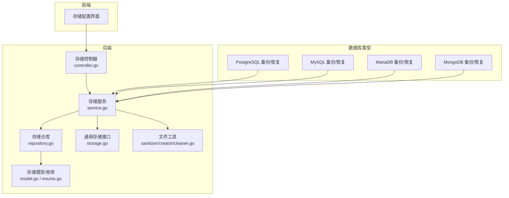
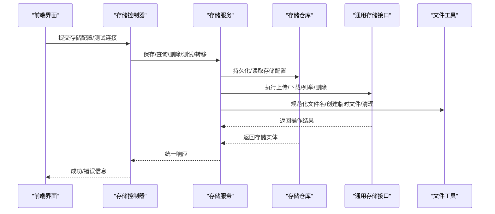
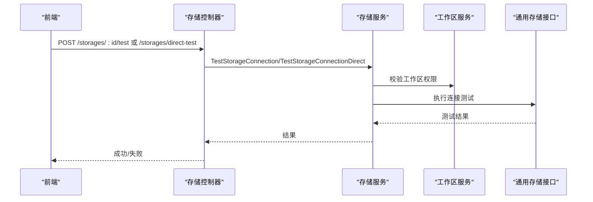
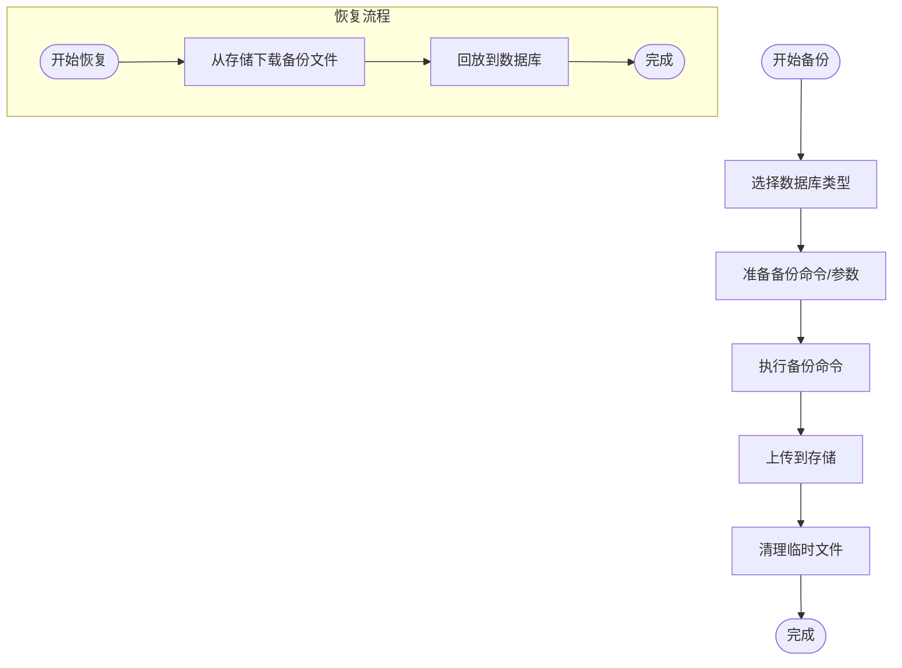
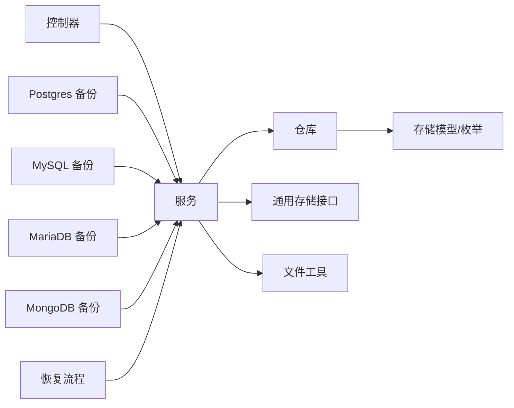

# 存储类型支持

<cite>
**本文引用的文件**
- [backend/internal/features/storages/controller.go](file://backend/internal/features/storages/controller.go)
- [backend/internal/features/storages/enums.go](file://backend/internal/features/storages/enums.go)
- [backend/internal/features/storages/dto.go](file://backend/internal/features/storages/dto.go)
- [backend/internal/features/storages/service.go](file://backend/internal/features/storages/service.go)
- [backend/internal/features/storages/repository.go](file://backend/internal/features/storages/repository.go)
- [backend/internal/features/storages/model.go](file://backend/internal/features/storages/model.go)
- [backend/internal/storage/storage.go](file://backend/internal/storage/storage.go)
- [backend/internal/features/disk/service.go](file://backend/internal/features/disk/service.go)
- [backend/internal/features/databases/mysql/service.go](file://backend/internal/features/databases/mysql/service.go)
- [backend/internal/features/databases/postgresql/service.go](file://backend/internal/features/databases/postgresql/service.go)
- [backend/internal/features/databases/mariadb/service.go](file://backend/internal/features/databases/mariadb/service.go)
- [backend/internal/features/databases/mongodb/service.go](file://backend/internal/features/databases/mongodb/service.go)
- [backend/internal/features/backups/usecases/postgresql/backuping/postgres_backup.go](file://backend/internal/features/backups/usecases/postgresql/backuping/postgres_backup.go)
- [backend/internal/features/backups/usecases/mysql/backuping/mysql_backup.go](file://backend/internal/features/backups/usecases/mysql/backuping/mysql_backup.go)
- [backend/internal/features/backups/usecases/mariadb/backuping/mariadb_backup.go](file://backend/internal/features/backups/usecases/mariadb/backuping/mariadb_backup.go)
- [backend/internal/features/backups/usecases/mongodb/backuping/mongodb_backup.go](file://backend/internal/features/backups/usecases/mongodb/backuping/mongodb_backup.go)
- [backend/internal/features/restores/restoring/restorer.go](file://backend/internal/features/restores/restoring/restorer.go)
- [backend/internal/features/healthcheck/attempts/check_database_health_uc.go](file://backend/internal/features/healthcheck/attempts/check_database_health_uc.go)
- [backend/internal/features/telemetry/service.go](file://backend/internal/features/telemetry/service.go)
- [backend/internal/util/files/sanitizer.go](file://backend/internal/util/files/sanitizer.go)
- [backend/internal/util/files/creator.go](file://backend/internal/util/files/creator.go)
- [backend/internal/util/files/cleaner.go](file://backend/internal/util/files/cleaner.go)
- [backend/migrations/20250629143714_add_google_drive_storage.sql](file://backend/migrations/20250629143714_add_google_drive_storage.sql)
- [backend/migrations/20250723135644_add_nas_storages.sql](file://backend/migrations/20250723135644_add_nas_storages.sql)
- [backend/migrations/20251116195618_add_azure_blob_storage.sql](file://backend/migrations/20251116195618_add_azure_blob_storage.sql)
- [backend/migrations/20251213180403_add_ftp_storages.sql](file://backend/migrations/20251213180403_add_ftp_storages.sql)
- [backend/migrations/20251218123447_add_rclone_storages.sql](file://backend/migrations/20251218123447_add_rclone_storages.sql)
- [backend/migrations/20251219220027_add_sftp_storages.sql](file://backend/migrations/20251219220027_add_sftp_storages.sql)
- [backend/migrations/20251116075135_add_virtual_host_and_prefix_to_s3.sql](file://backend/migrations/20251116075135_add_virtual_host_and_prefix_to_s3.sql)
- [backend/migrations/20251211142507_add_include_schemas_to_postgresql_databases.sql](file://backend/migrations/20251211142507_add_include_schemas_to_postgresql_databases.sql)
- [backend/migrations/20251211164424_add_skip_tls_verify_to_s3.sql](file://backend/migrations/20251211164424_add_skip_tls_verify_to_s3.sql)
- [backend/migrations/20260101200438_add_backup_format.sql](file://backend/migrations/20260101200438_add_backup_format.sql)
- [backend/migrations/20260119124334_add_backup_size_limits.sql](file://backend/migrations/20260119124334_add_backup_size_limits.sql)
- [backend/migrations/20260220000000_add_retention_policy.sql](file://backend/migrations/20260220000000_add_retention_policy.sql)
- [backend/migrations/20260316151706_add_upload_completed_at.sql](file://backend/migrations/20260316151706_add_upload_completed_at.sql)
- [backend/migrations/20260326130504_add_billing.sql](file://backend/migrations/20260326130504_add_billing.sql)
- [backend/migrations/20260402055223_add_storage_class_to_s3.sql](file://backend/migrations/20260402055223_add_storage_class_to_s3.sql)
</cite>

## 目录
1. [简介](#简介)
2. [项目结构](#项目结构)
3. [核心组件](#核心组件)
4. [架构总览](#架构总览)
5. [详细组件分析](#详细组件分析)
6. [依赖关系分析](#依赖关系分析)
7. [性能考量](#性能考量)
8. [故障排查指南](#故障排查指南)
9. [结论](#结论)
10. [附录](#附录)

## 简介
本文件系统性梳理 Databasus 的存储类型支持能力，覆盖以下存储类型：本地存储（LOCAL）、Amazon S3、Microsoft Azure Blob Storage、Google Drive、FTP、SFTP、NAS 网络附加存储、Rclone 远程存储。文档从架构与数据流、配置参数与认证方式、连接设置与性能特征、优缺点对比、最佳实践与迁移指南等维度进行说明，帮助用户在不同业务场景下选择最合适的存储方案。

## 项目结构
Databasus 后端通过统一的“存储”抽象管理多种后端存储，前端通过 UI 配置与测试连接；数据库层通过迁移脚本新增对各类存储的支持字段与约束。关键模块包括：
- 存储控制器与服务：负责存储的增删改查、连接测试、工作区转移等
- 存储模型与枚举：定义存储类型、字段与校验规则
- 数据库备份/恢复用例：针对不同数据库类型对接具体存储
- 文件工具：清理、创建、命名规范化等辅助能力
- 迁移脚本：为各存储类型添加必要的数据库字段与约束

图表来源
- [backend/internal/features/storages/controller.go:1-340](file://backend/internal/features/storages/controller.go#L1-L340)
- [backend/internal/features/storages/service.go](file://backend/internal/features/storages/service.go)
- [backend/internal/features/storages/repository.go](file://backend/internal/features/storages/repository.go)
- [backend/internal/features/storages/model.go](file://backend/internal/features/storages/model.go)
- [backend/internal/features/storages/enums.go:1-15](file://backend/internal/features/storages/enums.go#L1-L15)
- [backend/internal/storage/storage.go](file://backend/internal/storage/storage.go)
- [backend/internal/util/files/sanitizer.go](file://backend/internal/util/files/sanitizer.go)
- [backend/internal/util/files/creator.go](file://backend/internal/util/files/creator.go)
- [backend/internal/util/files/cleaner.go](file://backend/internal/util/files/cleaner.go)

章节来源
- [backend/internal/features/storages/controller.go:1-340](file://backend/internal/features/storages/controller.go#L1-L340)
- [backend/internal/features/storages/enums.go:1-15](file://backend/internal/features/storages/enums.go#L1-L15)

## 核心组件
- 存储类型枚举：定义了 LOCAL、S3、GOOGLE_DRIVE、NAS、AZURE_BLOB、FTP、SFTP、RCLONE 八种类型，作为系统内统一标识。
- 存储控制器：提供保存、查询、删除、连接测试、直接测试、工作区转移等接口，均受鉴权与权限控制。
- 存储服务：封装业务逻辑，协调仓库、存储接口与文件工具，执行连接测试与工作区权限校验。
- 存储模型：承载存储配置、认证凭据、路径/桶名/前缀等字段，配合仓库持久化到数据库。
- 通用存储接口：抽象出统一的上传/下载/列举/删除等操作，便于扩展新存储类型。
- 文件工具：提供文件名规范化、临时文件创建、备份文件清理等能力，保障备份流程稳定。

章节来源
- [backend/internal/features/storages/enums.go:1-15](file://backend/internal/features/storages/enums.go#L1-L15)
- [backend/internal/features/storages/controller.go:1-340](file://backend/internal/features/storages/controller.go#L1-L340)
- [backend/internal/features/storages/service.go](file://backend/internal/features/storages/service.go)
- [backend/internal/features/storages/model.go](file://backend/internal/features/storages/model.go)
- [backend/internal/storage/storage.go](file://backend/internal/storage/storage.go)
- [backend/internal/util/files/sanitizer.go](file://backend/internal/util/files/sanitizer.go)
- [backend/internal/util/files/creator.go](file://backend/internal/util/files/creator.go)
- [backend/internal/util/files/cleaner.go](file://backend/internal/util/files/cleaner.go)

## 架构总览
下图展示从 UI 到后端服务再到具体存储实现的数据流与交互关系：

图表来源
- [backend/internal/features/storages/controller.go:1-340](file://backend/internal/features/storages/controller.go#L1-L340)
- [backend/internal/features/storages/service.go](file://backend/internal/features/storages/service.go)
- [backend/internal/features/storages/repository.go](file://backend/internal/features/storages/repository.go)
- [backend/internal/storage/storage.go](file://backend/internal/storage/storage.go)
- [backend/internal/util/files/sanitizer.go](file://backend/internal/util/files/sanitizer.go)
- [backend/internal/util/files/creator.go](file://backend/internal/util/files/creator.go)
- [backend/internal/util/files/cleaner.go](file://backend/internal/util/files/cleaner.go)

## 详细组件分析

### 存储类型总览与对比
- 本地存储（LOCAL）
  - 特性：直接使用服务器本地文件系统，无需网络传输
  - 适用场景：单机部署、低延迟访问、成本敏感
  - 限制：不可跨节点共享，需考虑磁盘空间与快照策略
  - 认证：无外部认证，依赖系统文件权限
  - 性能：本地吞吐高，受限于磁盘IOPS与带宽
- Amazon S3
  - 特性：对象存储，支持虚拟主机、前缀、存储类别、跳过TLS校验等
  - 适用场景：云原生、跨区域备份、低成本长期归档
  - 限制：网络延迟影响上传/下载速度，需关注配额与请求次数
  - 认证：基于访问密钥/密钥ID或会话令牌
  - 性能：大文件分片上传，可并行加速
- Microsoft Azure Blob Storage
  - 特性：块blob/页blob，支持容器/路径前缀
  - 适用场景：混合云、与Azure生态集成
  - 限制：需要账户名与密钥或OAuth
  - 认证：账户密钥或托管身份
  - 性能：分块上传，适合大文件
- Google Drive
  - 特性：面向个人/团队的网盘，适合小规模备份
  - 适用场景：中小团队协作、快速分享
  - 限制：API配额较低，不适合大规模自动化
  - 认证：OAuth 2.0
  - 性能：受API速率限制
- FTP/SFTP
  - 特性：标准协议，SFTP更安全
  - 适用场景：传统企业内部存储、NAS直连
  - 限制：FTP明文风险，SFTP需密钥管理
  - 认证：用户名/密码或密钥对
  - 性能：取决于网络质量与服务器带宽
- NAS 网络附加存储
  - 特性：挂载为本地文件系统，透明接入
  - 适用场景：已有NAS基础设施的企业
  - 限制：网络抖动影响稳定性
  - 认证：取决于NAS厂商与挂载方式
  - 性能：接近本地磁盘，但受网络带宽/延迟影响
- Rclone 远程存储
  - 特性：统一抽象多云/本地/协议，支持加密与重试
  - 适用场景：多云/混合云、复杂拓扑
  - 限制：额外进程开销，需正确配置远端
  - 认证：按远端类型配置
  - 性能：可利用rclone的并发与断点续传

### 配置参数与认证方式
- 通用字段（由模型定义）：名称、类型、工作区、路径/桶名/容器、前缀、是否启用TLS校验等
- S3：虚拟主机、存储类别、跳过TLS校验、桶名/前缀
- Azure Blob：账户名/密钥、容器名、路径前缀
- Google Drive：OAuth客户端凭据、根目录ID
- FTP/SFTP：主机、端口、用户名/密码/密钥、路径、被动模式（已移除）
- NAS：挂载路径、只读/读写
- Rclone：远端名称、配置文件、加密开关

章节来源
- [backend/internal/features/storages/enums.go:1-15](file://backend/internal/features/storages/enums.go#L1-L15)
- [backend/migrations/20251116075135_add_virtual_host_and_prefix_to_s3.sql](file://backend/migrations/20251116075135_add_virtual_host_and_prefix_to_s3.sql)
- [backend/migrations/20251211164424_add_skip_tls_verify_to_s3.sql](file://backend/migrations/20251211164424_add_skip_tls_verify_to_s3.sql)
- [backend/migrations/20251116195618_add_azure_blob_storage.sql](file://backend/migrations/20251116195618_add_azure_blob_storage.sql)
- [backend/migrations/20250629143714_add_google_drive_storage.sql](file://backend/migrations/20250629143714_add_google_drive_storage.sql)
- [backend/migrations/20251213180403_add_ftp_storages.sql](file://backend/migrations/20251213180403_add_ftp_storages.sql)
- [backend/migrations/20251219220027_add_sftp_storages.sql](file://backend/migrations/20251219220027_add_sftp_storages.sql)
- [backend/migrations/20250723135644_add_nas_storages.sql](file://backend/migrations/20250723135644_add_nas_storages.sql)
- [backend/migrations/20251218123447_add_rclone_storages.sql](file://backend/migrations/20251218123447_add_rclone_storages.sql)

### 连接测试与工作流
- 控制器提供两类测试：按ID测试与直接测试（携带完整配置），后者还会校验工作区权限
- 服务层调用通用存储接口执行连接验证，返回成功或错误信息
- 工作区转移：仅允许有相应权限的用户在源/目标工作区间转移存储配置

图表来源
- [backend/internal/features/storages/controller.go:192-339](file://backend/internal/features/storages/controller.go#L192-L339)
- [backend/internal/features/storages/service.go](file://backend/internal/features/storages/service.go)
- [backend/internal/storage/storage.go](file://backend/internal/storage/storage.go)

章节来源
- [backend/internal/features/storages/controller.go:192-339](file://backend/internal/features/storages/controller.go#L192-L339)

### 数据库备份与恢复中的存储对接
- PostgreSQL/MySQL/MariaDB/MongoDB 的备份用例均通过统一的存储服务进行上传
- 恢复流程通过通用存储接口下载指定备份文件并回放到数据库
- 文件名规范化与清理由文件工具保障，避免冲突与资源泄漏

图表来源
- [backend/internal/features/backups/usecases/postgresql/backuping/postgres_backup.go](file://backend/internal/features/backups/usecases/postgresql/backuping/postgres_backup.go)
- [backend/internal/features/backups/usecases/mysql/backuping/mysql_backup.go](file://backend/internal/features/backups/usecases/mysql/backuping/mysql_backup.go)
- [backend/internal/features/backups/usecases/mariadb/backuping/mariadb_backup.go](file://backend/internal/features/backups/usecases/mariadb/backuping/mariadb_backup.go)
- [backend/internal/features/backups/usecases/mongodb/backuping/mongodb_backup.go](file://backend/internal/features/backups/usecases/mongodb/backuping/mongodb_backup.go)
- [backend/internal/features/restores/restoring/restorer.go](file://backend/internal/features/restores/restoring/restorer.go)
- [backend/internal/util/files/sanitizer.go](file://backend/internal/util/files/sanitizer.go)
- [backend/internal/util/files/cleaner.go](file://backend/internal/util/files/cleaner.go)

章节来源
- [backend/internal/features/backups/usecases/postgresql/backuping/postgres_backup.go](file://backend/internal/features/backups/usecases/postgresql/backuping/postgres_backup.go)
- [backend/internal/features/backups/usecases/mysql/backuping/mysql_backup.go](file://backend/internal/features/backups/usecases/mysql/backuping/mysql_backup.go)
- [backend/internal/features/backups/usecases/mariadb/backuping/mariadb_backup.go](file://backend/internal/features/backups/usecases/mariadb/backuping/mariadb_backup.go)
- [backend/internal/features/backups/usecases/mongodb/backuping/mongodb_backup.go](file://backend/internal/features/backups/usecases/mongodb/backuping/mongodb_backup.go)
- [backend/internal/features/restores/restoring/restorer.go](file://backend/internal/features/restores/restoring/restorer.go)
- [backend/internal/util/files/sanitizer.go](file://backend/internal/util/files/sanitizer.go)
- [backend/internal/util/files/cleaner.go](file://backend/internal/util/files/cleaner.go)

### 最佳实践建议
- 优先使用 S3/Azure Blob/Google Drive 等对象存储以获得更好的可扩展性与可靠性
- 对于本地/ NAS 存储，确保磁盘冗余与定期快照，监控空间与IO
- SFTP/FTP 建议使用 SFTP 并妥善管理密钥；必要时开启TLS校验
- Rclone 适合复杂拓扑，建议开启并发与断点续传，合理设置重试策略
- 使用连接测试在部署阶段验证配置，避免生产环境失败
- 为不同数据库类型分别配置独立的前缀/路径，避免命名冲突

## 依赖关系分析
- 控制器依赖服务层，服务层依赖仓库与通用存储接口
- 数据库类型用例依赖存储服务进行上传/下载
- 文件工具贯穿备份/恢复流程，保障文件命名与清理
- 迁移脚本为各存储类型增加必要的数据库字段与约束

图表来源
- [backend/internal/features/storages/controller.go:1-340](file://backend/internal/features/storages/controller.go#L1-L340)
- [backend/internal/features/storages/service.go](file://backend/internal/features/storages/service.go)
- [backend/internal/features/storages/repository.go](file://backend/internal/features/storages/repository.go)
- [backend/internal/features/storages/model.go](file://backend/internal/features/storages/model.go)
- [backend/internal/storage/storage.go](file://backend/internal/storage/storage.go)
- [backend/internal/util/files/sanitizer.go](file://backend/internal/util/files/sanitizer.go)
- [backend/internal/util/files/creator.go](file://backend/internal/util/files/creator.go)
- [backend/internal/util/files/cleaner.go](file://backend/internal/util/files/cleaner.go)

章节来源
- [backend/internal/features/storages/controller.go:1-340](file://backend/internal/features/storages/controller.go#L1-L340)
- [backend/internal/features/storages/service.go](file://backend/internal/features/storages/service.go)
- [backend/internal/features/storages/repository.go](file://backend/internal/features/storages/repository.go)
- [backend/internal/features/storages/model.go](file://backend/internal/features/storages/model.go)
- [backend/internal/storage/storage.go](file://backend/internal/storage/storage.go)
- [backend/internal/util/files/sanitizer.go](file://backend/internal/util/files/sanitizer.go)
- [backend/internal/util/files/creator.go](file://backend/internal/util/files/creator.go)
- [backend/internal/util/files/cleaner.go](file://backend/internal/util/files/cleaner.go)

## 性能考量
- 上传/下载带宽：对象存储通常具备更高带宽，但需考虑网络RTT与并发度
- 分片/并发：S3/Azure Blob 支持分片上传，可提升大文件传输效率
- TLS校验：开启校验会增加CPU开销，但在安全性与合规性要求高的环境中值得
- 文件系统：本地/NAS 的性能高度依赖底层存储介质与网络质量
- Rclone：可配置并发与重试，但会引入额外进程开销，需平衡吞吐与资源占用

## 故障排查指南
- 权限不足：控制器在多个接口中返回 403，提示用户在当前工作区无足够权限
- 本地存储限制：云模式下不允许使用本地存储，控制器明确拒绝
- 连接失败：通过连接测试接口定位配置问题（凭据、网络、路径等）
- 文件冲突：使用文件工具进行命名规范化与清理，避免重复与残留
- 数据库兼容性：不同数据库的备份格式与参数存在差异，需按类型配置

章节来源
- [backend/internal/features/storages/controller.go:42-71](file://backend/internal/features/storages/controller.go#L42-L71)
- [backend/internal/features/storages/controller.go:167-190](file://backend/internal/features/storages/controller.go#L167-L190)
- [backend/internal/features/storages/controller.go:204-227](file://backend/internal/features/storages/controller.go#L204-L227)
- [backend/internal/features/storages/controller.go:298-339](file://backend/internal/features/storages/controller.go#L298-L339)
- [backend/internal/util/files/sanitizer.go](file://backend/internal/util/files/sanitizer.go)
- [backend/internal/util/files/cleaner.go](file://backend/internal/util/files/cleaner.go)

## 结论
Databasus 通过统一的存储抽象与完善的控制器/服务/仓库架构，实现了对多种存储类型的灵活支持。用户可根据自身网络、安全与成本需求选择合适方案，并结合连接测试与最佳实践确保备份与恢复的可靠性。

## 附录

### 功能对比表（概念性）
- 本地存储：高吞吐、低延迟、易配置、不可跨节点
- S3：高扩展、跨区域、成本低、需网络
- Azure Blob：容器/路径前缀、块/页blob、需账户密钥
- Google Drive：小规模协作友好、API配额限制
- FTP：传统协议、明文风险
- SFTP：安全协议、密钥管理
- NAS：接近本地性能、网络依赖
- Rclone：多云统一、复杂拓扑、额外开销

### 迁移指南（概念性）
- 从本地迁移到对象存储：先在新存储上验证连接，再切换备份配置，最后清理旧路径
- 从FTP迁移到SFTP：生成密钥对，更新凭据，逐步替换连接参数
- 跨云迁移：先在目标云创建桶/容器，配置前缀，验证上传/下载，再切换生产配置
- Rclone 迁移：先在Rclone侧配置远端，验证同步，再在系统中启用对应存储类型