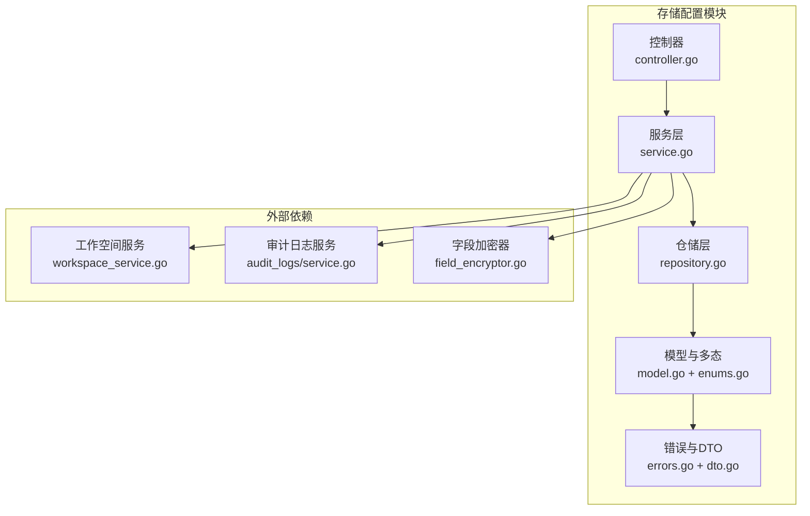
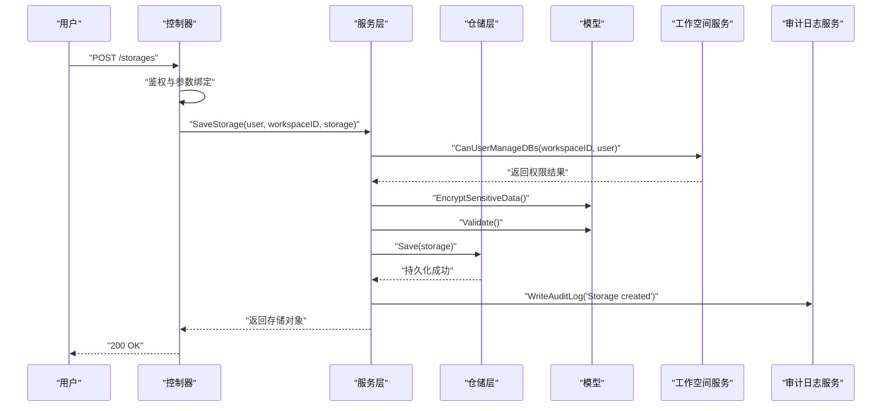
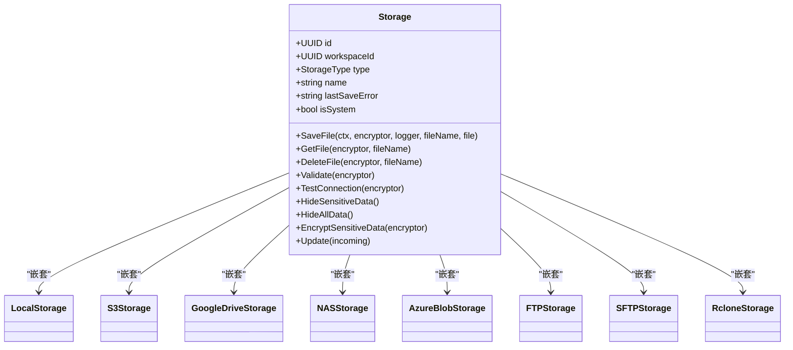
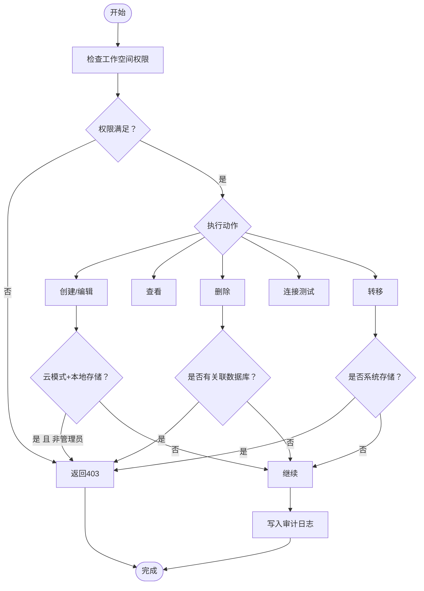
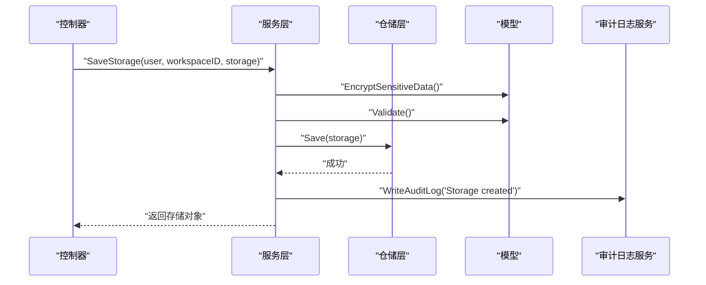
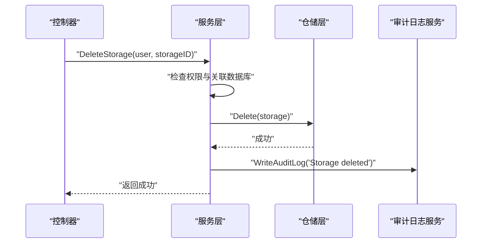
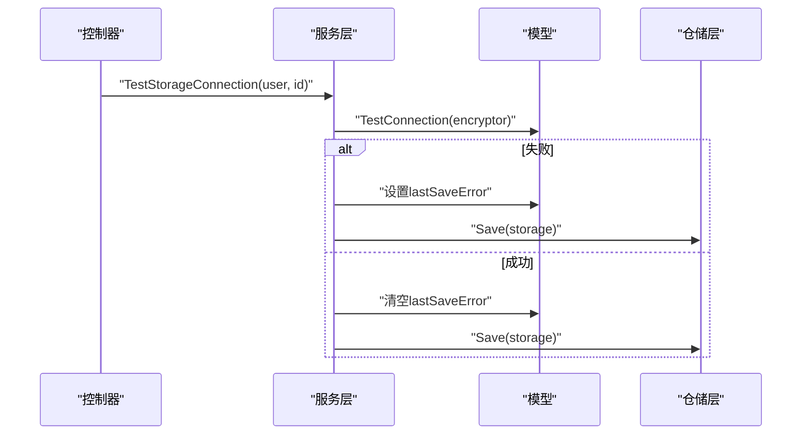
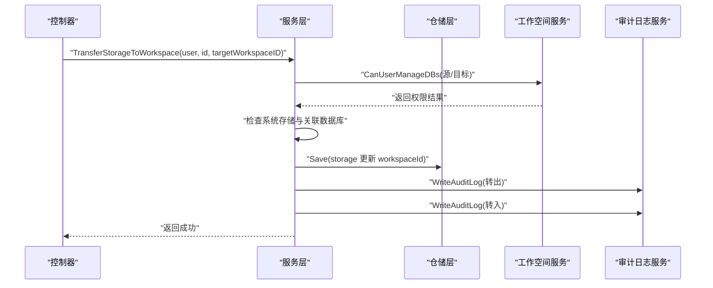
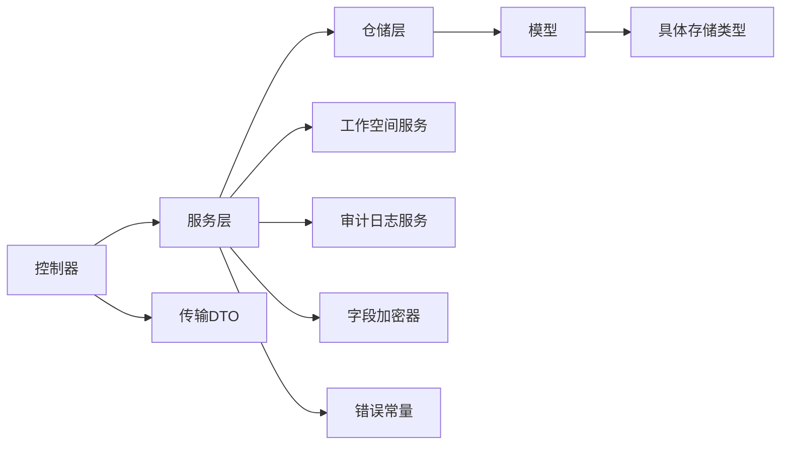

# 存储配置管理

<cite>
**本文引用的文件**
- [backend/internal/features/storages/controller.go](file://backend/internal/features/storages/controller.go)
- [backend/internal/features/storages/service.go](file://backend/internal/features/storages/service.go)
- [backend/internal/features/storages/model.go](file://backend/internal/features/storages/model.go)
- [backend/internal/features/storages/repository.go](file://backend/internal/features/storages/repository.go)
- [backend/internal/features/storages/enums.go](file://backend/internal/features/storages/enums.go)
- [backend/internal/features/storages/errors.go](file://backend/internal/features/storages/errors.go)
- [backend/internal/features/storages/dto.go](file://backend/internal/features/storages/dto.go)
- [backend/internal/features/audit_logs/service.go](file://backend/internal/features/audit_logs/service.go)
- [backend/internal/features/workspaces/services/workspace_service.go](file://backend/internal/features/workspaces/services/workspace_service.go)
- [backend/internal/util/encryption/field_encryptor.go](file://backend/internal/util/encryption/field_encryptor.go)
</cite>

## 目录
1. [简介](#简介)
2. [项目结构](#项目结构)
3. [核心组件](#核心组件)
4. [架构总览](#架构总览)
5. [详细组件分析](#详细组件分析)
6. [依赖关系分析](#依赖关系分析)
7. [性能考量](#性能考量)
8. [故障排查指南](#故障排查指南)
9. [结论](#结论)
10. [附录](#附录)

## 简介
本文件面向Databasus的“存储配置管理”功能，系统化阐述存储配置的完整生命周期（创建、编辑、删除、复制、转移）、数据模型与字段约束、权限控制机制（工作空间级访问控制）、UI交互设计要点（表单校验、错误提示、状态反馈）、批量操作能力（导入/导出、模板使用）以及安全性考虑（敏感信息加密、访问控制、审计日志）。文档以后端控制器、服务层、仓储层、模型与枚举为核心，结合工作空间与审计日志服务，形成端到端的功能说明。

## 项目结构
存储配置管理位于后端模块“storages”，采用分层架构：
- 控制器层：暴露REST接口，负责鉴权、参数绑定与错误响应
- 服务层：业务编排，执行权限检查、加密、校验、审计日志与跨工作空间转移
- 仓储层：数据库事务与多态存储对象持久化
- 模型层：统一的Storage聚合根，内含多种具体存储类型的嵌套模型
- 枚举与错误：定义存储类型、权限与业务错误常量
- 前端集成：通过API与UI交互，配合表单校验与状态反馈

图表来源
- [backend/internal/features/storages/controller.go:19-27](file://backend/internal/features/storages/controller.go#L19-L27)
- [backend/internal/features/storages/service.go:16-22](file://backend/internal/features/storages/service.go#L16-L22)
- [backend/internal/features/storages/repository.go:10-131](file://backend/internal/features/storages/repository.go#L10-L131)
- [backend/internal/features/storages/model.go:22-39](file://backend/internal/features/storages/model.go#L22-L39)
- [backend/internal/features/storages/enums.go:3-14](file://backend/internal/features/storages/enums.go#L3-L14)
- [backend/internal/features/storages/errors.go:5-45](file://backend/internal/features/storages/errors.go#L5-L45)
- [backend/internal/features/storages/dto.go:5-7](file://backend/internal/features/storages/dto.go#L5-L7)
- [backend/internal/features/workspaces/services/workspace_service.go](file://backend/internal/features/workspaces/services/workspace_service.go)
- [backend/internal/features/audit_logs/service.go](file://backend/internal/features/audit_logs/service.go)
- [backend/internal/util/encryption/field_encryptor.go](file://backend/internal/util/encryption/field_encryptor.go)

章节来源
- [backend/internal/features/storages/controller.go:19-340](file://backend/internal/features/storages/controller.go#L19-L340)
- [backend/internal/features/storages/service.go:16-409](file://backend/internal/features/storages/service.go#L16-L409)
- [backend/internal/features/storages/repository.go:10-244](file://backend/internal/features/storages/repository.go#L10-L244)
- [backend/internal/features/storages/model.go:22-185](file://backend/internal/features/storages/model.go#L22-L185)
- [backend/internal/features/storages/enums.go:3-14](file://backend/internal/features/storages/enums.go#L3-L14)
- [backend/internal/features/storages/errors.go:5-45](file://backend/internal/features/storages/errors.go#L5-L45)
- [backend/internal/features/storages/dto.go:5-7](file://backend/internal/features/storages/dto.go#L5-L7)

## 核心组件
- 控制器：提供创建/查询/删除/连接测试/转移等REST接口；统一进行用户鉴权、参数解析与错误处理
- 服务层：封装业务规则，执行工作空间权限校验、系统存储限制、加密与校验、审计日志记录、跨工作空间转移
- 仓储层：在单事务中保存/删除Storage及其具体类型子对象，支持按工作空间查询与全局查询
- 模型层：Storage聚合根，内嵌多种具体存储类型（本地、S3、Google Drive、NAS、Azure Blob、FTP、SFTP、Rclone），统一对外暴露保存/读取/删除/校验/连接测试等方法
- 枚举与错误：定义存储类型与权限/业务错误常量，便于统一处理
- 外部依赖：工作空间服务用于权限判定；审计日志服务记录变更；字段加密器对敏感字段进行加密

章节来源
- [backend/internal/features/storages/controller.go:42-340](file://backend/internal/features/storages/controller.go#L42-L340)
- [backend/internal/features/storages/service.go:54-409](file://backend/internal/features/storages/service.go#L54-L409)
- [backend/internal/features/storages/repository.go:12-244](file://backend/internal/features/storages/repository.go#L12-L244)
- [backend/internal/features/storages/model.go:22-185](file://backend/internal/features/storages/model.go#L22-L185)
- [backend/internal/features/storages/enums.go:3-14](file://backend/internal/features/storages/enums.go#L3-L14)
- [backend/internal/features/storages/errors.go:5-45](file://backend/internal/features/storages/errors.go#L5-L45)

## 架构总览
存储配置管理遵循“控制器-服务-仓储-模型”的分层架构，控制器负责HTTP请求入口，服务层协调工作空间权限、加密与审计，仓储层保证多态子对象的一致性持久化，模型层抽象不同存储类型的共性行为。

图表来源
- [backend/internal/features/storages/controller.go:42-71](file://backend/internal/features/storages/controller.go#L42-L71)
- [backend/internal/features/storages/service.go:54-147](file://backend/internal/features/storages/service.go#L54-L147)
- [backend/internal/features/storages/repository.go:12-131](file://backend/internal/features/storages/repository.go#L12-L131)
- [backend/internal/features/storages/model.go:102-104](file://backend/internal/features/storages/model.go#L102-L104)
- [backend/internal/features/audit_logs/service.go](file://backend/internal/features/audit_logs/service.go)
- [backend/internal/features/workspaces/services/workspace_service.go](file://backend/internal/features/workspaces/services/workspace_service.go)

## 详细组件分析

### 数据模型与字段规范
- 聚合根：Storage
  - 必填字段：id、workspaceId、type、name
  - 可选字段：lastSaveError、isSystem
  - 关系字段：指向具体存储类型的嵌套模型（localStorage、s3Storage、googleDriveStorage、nasStorage、azureBlobStorage、ftpStorage、sftpStorage、rcloneStorage）
- 具体存储类型
  - 通过StorageType枚举区分，每种类型对应一个嵌套模型，包含该类型特有的字段与行为
- 字段验证
  - 统一由Storage.Validate委托给具体类型执行
  - 连接测试由Storage.TestConnection委托给具体类型执行
- 敏感信息处理
  - 加密：Storage.EncryptSensitiveData委托给具体类型
  - 隐藏：Storage.HideSensitiveData隐藏敏感字段；Storage.HideAllData在管理员之外隐藏所有嵌套模型
- 更新策略
  - Storage.Update根据type选择性更新对应嵌套模型

图表来源
- [backend/internal/features/storages/model.go:22-39](file://backend/internal/features/storages/model.go#L22-L39)
- [backend/internal/features/storages/enums.go:3-14](file://backend/internal/features/storages/enums.go#L3-L14)

章节来源
- [backend/internal/features/storages/model.go:22-185](file://backend/internal/features/storages/model.go#L22-L185)
- [backend/internal/features/storages/enums.go:3-14](file://backend/internal/features/storages/enums.go#L3-L14)

### 权限控制机制（工作空间级）
- 创建/编辑
  - 需要“可管理数据库”的工作空间权限
  - 云模式下，非管理员禁止创建本地存储
  - 系统存储仅管理员可管理
- 查看
  - 非系统存储需具备“可访问工作空间”权限
  - 管理员可查看系统存储全部信息；普通用户仅可见名称等非敏感信息
- 删除
  - 需要“可管理数据库”的工作空间权限
  - 若存储被数据库引用则不可删除
  - 系统存储仅管理员可删除
- 连接测试
  - 需要“可访问工作空间”权限
  - 云模式下，非管理员禁止测试本地存储
- 跨工作空间转移
  - 需要源/目标工作空间均具备“可管理数据库”的权限
  - 系统存储不可转移
  - 存储若关联数据库且转移时未指定数据库ID，则不可转移

图表来源
- [backend/internal/features/storages/service.go:54-191](file://backend/internal/features/storages/service.go#L54-L191)
- [backend/internal/features/storages/service.go:249-408](file://backend/internal/features/storages/service.go#L249-L408)
- [backend/internal/features/storages/errors.go:5-45](file://backend/internal/features/storages/errors.go#L5-L45)

章节来源
- [backend/internal/features/storages/service.go:54-191](file://backend/internal/features/storages/service.go#L54-L191)
- [backend/internal/features/storages/service.go:249-408](file://backend/internal/features/storages/service.go#L249-L408)
- [backend/internal/features/storages/errors.go:5-45](file://backend/internal/features/storages/errors.go#L5-L45)

### 生命周期流程

#### 创建/编辑（SaveStorage）
- 控制器接收请求，绑定参数并鉴权
- 服务层检查权限、加密敏感字段、执行字段校验
- 仓储层在事务中保存Storage及对应的具体类型子对象
- 写入审计日志

图表来源
- [backend/internal/features/storages/controller.go:42-71](file://backend/internal/features/storages/controller.go#L42-L71)
- [backend/internal/features/storages/service.go:54-147](file://backend/internal/features/storages/service.go#L54-L147)
- [backend/internal/features/storages/repository.go:12-131](file://backend/internal/features/storages/repository.go#L12-L131)
- [backend/internal/features/audit_logs/service.go](file://backend/internal/features/audit_logs/service.go)

章节来源
- [backend/internal/features/storages/controller.go:42-71](file://backend/internal/features/storages/controller.go#L42-L71)
- [backend/internal/features/storages/service.go:54-147](file://backend/internal/features/storages/service.go#L54-L147)
- [backend/internal/features/storages/repository.go:12-131](file://backend/internal/features/storages/repository.go#L12-L131)

#### 删除（DeleteStorage）
- 控制器鉴权并解析ID
- 服务层检查权限与关联数据库
- 仓储层在事务中删除具体类型子对象与主对象
- 写入审计日志

图表来源
- [backend/internal/features/storages/controller.go:155-190](file://backend/internal/features/storages/controller.go#L155-L190)
- [backend/internal/features/storages/service.go:149-191](file://backend/internal/features/storages/service.go#L149-L191)
- [backend/internal/features/storages/repository.go:186-243](file://backend/internal/features/storages/repository.go#L186-L243)
- [backend/internal/features/audit_logs/service.go](file://backend/internal/features/audit_logs/service.go)

章节来源
- [backend/internal/features/storages/controller.go:155-190](file://backend/internal/features/storages/controller.go#L155-L190)
- [backend/internal/features/storages/service.go:149-191](file://backend/internal/features/storages/service.go#L149-L191)
- [backend/internal/features/storages/repository.go:186-243](file://backend/internal/features/storages/repository.go#L186-L243)

#### 连接测试（TestStorageConnection/TestStorageConnectionDirect）
- 控制器鉴权并解析ID或直接传入Storage对象
- 服务层检查权限与云模式限制
- 模型层委托具体类型执行连接测试
- 成功后清空lastSaveError，失败则记录

图表来源
- [backend/internal/features/storages/controller.go:192-339](file://backend/internal/features/storages/controller.go#L192-L339)
- [backend/internal/features/storages/service.go:249-315](file://backend/internal/features/storages/service.go#L249-L315)
- [backend/internal/features/storages/model.go:83-85](file://backend/internal/features/storages/model.go#L83-L85)
- [backend/internal/features/storages/repository.go:12-131](file://backend/internal/features/storages/repository.go#L12-L131)

章节来源
- [backend/internal/features/storages/controller.go:192-339](file://backend/internal/features/storages/controller.go#L192-L339)
- [backend/internal/features/storages/service.go:249-315](file://backend/internal/features/storages/service.go#L249-L315)
- [backend/internal/features/storages/model.go:83-85](file://backend/internal/features/storages/model.go#L83-L85)

#### 跨工作空间转移（TransferStorageToWorkspace）
- 控制器解析ID与目标工作空间ID
- 服务层检查权限、系统存储限制、关联数据库情况
- 仓储层更新workspaceId并保存
- 写入双向审计日志（转出/转入）

图表来源
- [backend/internal/features/storages/controller.go:229-283](file://backend/internal/features/storages/controller.go#L229-L283)
- [backend/internal/features/storages/service.go:327-408](file://backend/internal/features/storages/service.go#L327-L408)
- [backend/internal/features/storages/repository.go:12-131](file://backend/internal/features/storages/repository.go#L12-L131)
- [backend/internal/features/audit_logs/service.go](file://backend/internal/features/audit_logs/service.go)
- [backend/internal/features/workspaces/services/workspace_service.go](file://backend/internal/features/workspaces/services/workspace_service.go)

章节来源
- [backend/internal/features/storages/controller.go:229-283](file://backend/internal/features/storages/controller.go#L229-L283)
- [backend/internal/features/storages/service.go:327-408](file://backend/internal/features/storages/service.go#L327-L408)

### UI交互设计要点
- 表单验证
  - 必填项：名称、类型、工作空间ID
  - 类型相关字段：由具体类型模型决定必填/可选
  - 云模式限制：非管理员禁用本地存储选项
- 错误提示
  - 权限不足：显示“无权限”类提示
  - 参数错误：显示“参数无效”类提示
  - 连接失败：显示“连接测试失败”并展示lastSaveError
- 状态反馈
  - 成功：创建/更新/删除/转移/测试均应有明确的成功消息
  - 审计日志：在UI侧可展示最近变更记录（由审计日志服务提供）
- 批量操作
  - 导入/导出：建议提供模板下载与导入功能，导入时按模板字段映射到具体类型字段
  - 模板使用：提供常用配置模板，一键填充基础字段

（本节为概念性说明，不直接分析具体文件）

### 批量操作功能
- 导入/导出
  - 导出：将当前工作空间内的存储配置序列化为模板文件（包含必要字段与类型信息）
  - 导入：解析模板文件，校验字段合法性，创建或更新对应存储
- 模板使用
  - 提供常见云/本地存储的模板，减少重复配置成本
  - 支持复制现有存储配置为新模板

（本节为概念性说明，不直接分析具体文件）

### 安全性考虑
- 敏感信息加密
  - 使用字段加密器对敏感字段进行加密存储
  - 仅在运行时解密用于连接测试或文件操作
- 访问控制
  - 工作空间级权限：创建/编辑/删除/查看/测试均需相应权限
  - 系统存储：仅管理员可管理
  - 云模式限制：非管理员不可创建/测试本地存储
- 审计日志
  - 记录创建、更新、删除、重命名、转移等关键事件
  - 包含操作人、工作空间、时间戳与变更摘要

章节来源
- [backend/internal/features/storages/service.go:111-122](file://backend/internal/features/storages/service.go#L111-L122)
- [backend/internal/features/storages/service.go:184-188](file://backend/internal/features/storages/service.go#L184-L188)
- [backend/internal/features/storages/service.go:393-405](file://backend/internal/features/storages/service.go#L393-L405)
- [backend/internal/features/storages/model.go:102-104](file://backend/internal/features/storages/model.go#L102-L104)
- [backend/internal/features/storages/errors.go:42-44](file://backend/internal/features/storages/errors.go#L42-L44)

## 依赖关系分析
- 控制器依赖服务层与工作空间中间件
- 服务层依赖仓储层、工作空间服务、审计日志服务与字段加密器
- 仓储层依赖数据库连接与GORM事务
- 模型层依赖各具体存储类型实现
- 错误与DTO作为契约层存在

图表来源
- [backend/internal/features/storages/controller.go:14-27](file://backend/internal/features/storages/controller.go#L14-L27)
- [backend/internal/features/storages/service.go:16-22](file://backend/internal/features/storages/service.go#L16-L22)
- [backend/internal/features/storages/repository.go:10-131](file://backend/internal/features/storages/repository.go#L10-L131)
- [backend/internal/features/storages/model.go:22-39](file://backend/internal/features/storages/model.go#L22-L39)
- [backend/internal/features/storages/errors.go:5-45](file://backend/internal/features/storages/errors.go#L5-L45)
- [backend/internal/features/storages/dto.go:5-7](file://backend/internal/features/storages/dto.go#L5-L7)

章节来源
- [backend/internal/features/storages/controller.go:14-27](file://backend/internal/features/storages/controller.go#L14-L27)
- [backend/internal/features/storages/service.go:16-22](file://backend/internal/features/storages/service.go#L16-L22)
- [backend/internal/features/storages/repository.go:10-131](file://backend/internal/features/storages/repository.go#L10-L131)
- [backend/internal/features/storages/model.go:22-39](file://backend/internal/features/storages/model.go#L22-L39)
- [backend/internal/features/storages/errors.go:5-45](file://backend/internal/features/storages/errors.go#L5-L45)
- [backend/internal/features/storages/dto.go:5-7](file://backend/internal/features/storages/dto.go#L5-L7)

## 性能考量
- 事务一致性：仓储层在单事务中保存/删除多态子对象，避免部分更新导致的数据不一致
- 预加载策略：查询时预加载所有具体存储类型，减少N+1查询风险
- 加密开销：仅在必要时进行字段加密与解密，避免频繁I/O
- 审计日志：异步写入或批量写入，降低对主流程的影响

（本节为通用指导，不直接分析具体文件）

## 故障排查指南
- 常见错误与处理
  - 权限不足：检查用户在目标工作空间的角色与权限
  - 云模式限制：确认是否为管理员或是否尝试使用本地存储
  - 存储关联数据库：删除/转移前先解除数据库关联
  - 连接测试失败：查看lastSaveError并核对凭据与网络连通性
- 排查步骤
  - 确认请求头Authorization有效
  - 核对workspace_id与storage_id格式正确
  - 检查具体存储类型的必填字段是否完整
  - 查看审计日志定位最近变更

章节来源
- [backend/internal/features/storages/errors.go:5-45](file://backend/internal/features/storages/errors.go#L5-L45)
- [backend/internal/features/storages/service.go:249-280](file://backend/internal/features/storages/service.go#L249-L280)

## 结论
存储配置管理通过清晰的分层架构与严格的权限控制，实现了对多种存储类型的统一管理。结合字段加密、审计日志与工作空间级访问控制，确保了安全性与可追溯性。建议在前端完善表单校验与状态反馈，并提供导入/导出与模板功能以提升用户体验。

## 附录
- API概览
  - POST /storages：创建或更新存储
  - GET /storages：按工作空间查询存储列表
  - GET /storages/{id}：按ID查询存储详情
  - DELETE /storages/{id}：删除存储
  - POST /storages/{id}/test：连接测试
  - POST /storages/direct-test：直接连接测试
  - POST /storages/{id}/transfer：跨工作空间转移

章节来源
- [backend/internal/features/storages/controller.go:19-27](file://backend/internal/features/storages/controller.go#L19-L27)