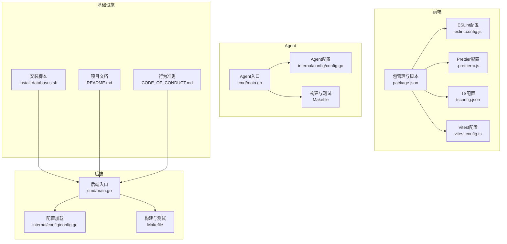
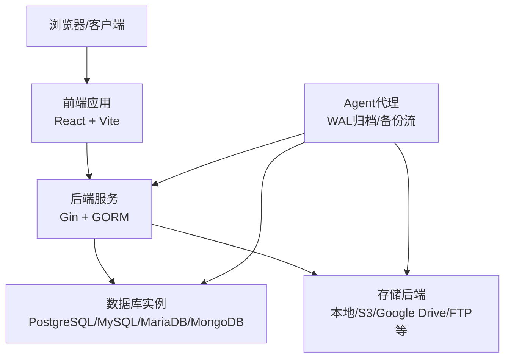
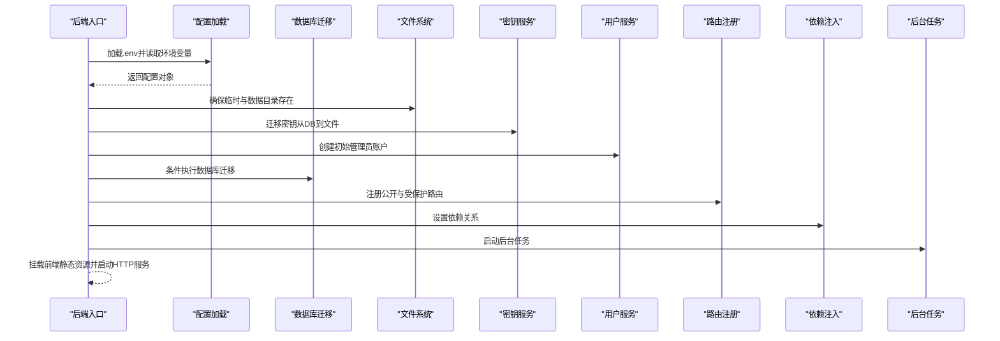
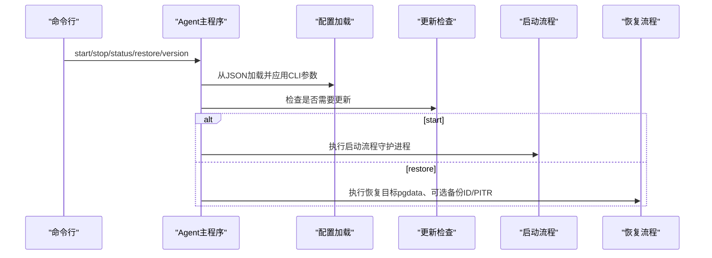
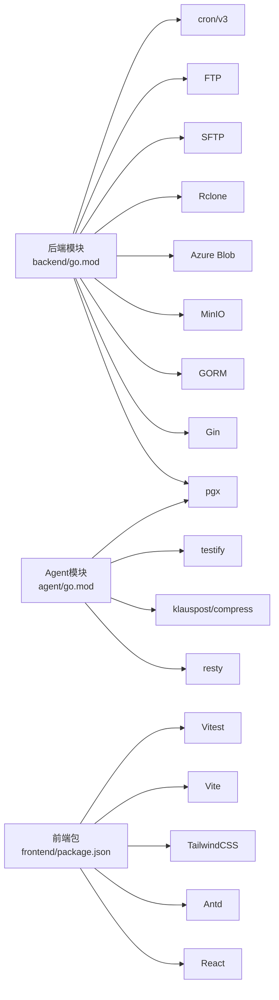

# 开发者指南

<cite>
**本文档引用的文件**
- [README.md](file://README.md)
- [install-databasus.sh](file://install-databasus.sh)
- [backend/go.mod](file://backend/go.mod)
- [agent/go.mod](file://agent/go.mod)
- [frontend/package.json](file://frontend/package.json)
- [backend/.golangci.yml](file://backend/.golangci.yml)
- [frontend/eslint.config.js](file://frontend/eslint.config.js)
- [frontend/.prettierrc.js](file://frontend/.prettierrc.js)
- [.github/CODE_OF_CONDUCT.md](file://.github/CODE_OF_CONDUCT.md)
- [backend/Makefile](file://backend/Makefile)
- [agent/Makefile](file://agent/Makefile)
- [frontend/vitest.config.ts](file://frontend/vitest.config.ts)
- [backend/cmd/main.go](file://backend/cmd/main.go)
- [agent/cmd/main.go](file://agent/cmd/main.go)
- [backend/internal/config/config.go](file://backend/internal/config/config.go)
- [agent/internal/config/config.go](file://agent/internal/config/config.go)
- [frontend/tsconfig.json](file://frontend/tsconfig.json)
</cite>

## 目录
1. [简介](#简介)
2. [项目结构](#项目结构)
3. [核心组件](#核心组件)
4. [架构总览](#架构总览)
5. [详细组件分析](#详细组件分析)
6. [依赖关系分析](#依赖关系分析)
7. [性能考虑](#性能考虑)
8. [故障排除指南](#故障排除指南)
9. [结论](#结论)
10. [附录](#附录)

## 简介
本指南面向Databasus项目的开发者，覆盖从开发环境搭建、代码贡献流程、测试策略、调试技巧到代码质量标准与开发工具配置的完整内容。Databasus是一个自托管的数据库备份与恢复工具，支持PostgreSQL、MySQL/MariaDB、MongoDB等数据库，提供多种存储目的地（本地、S3、Google Drive、FTP等）与通知渠道（邮件、Slack、Discord、Telegram、Webhook），并具备企业级安全特性（AES-256-GCM加密、零信任存储、只读用户等）。

## 项目结构
项目采用多模块组织方式：
- 后端服务（Go）：提供REST API、数据库迁移、后台任务调度、前端静态资源托管等
- 前端应用（React + TypeScript + Vite）：提供管理界面与交互
- Agent（Go）：轻量代理，负责WAL归档与基础备份流传输
- 部署与工具：Helm图表、安装脚本、E2E测试容器编排等

**图示来源**
- [backend/cmd/main.go:65-137](file://backend/cmd/main.go#L65-L137)
- [backend/internal/config/config.go:152-204](file://backend/internal/config/config.go#L152-L204)
- [frontend/package.json:6-14](file://frontend/package.json#L6-L14)
- [agent/cmd/main.go:24-48](file://agent/cmd/main.go#L24-L48)
- [agent/internal/config/config.go:35-64](file://agent/internal/config/config.go#L35-L64)
- [install-databasus.sh:113-124](file://install-databasus.sh#L113-L124)
- [.github/CODE_OF_CONDUCT.md:1-103](file://.github/CODE_OF_CONDUCT.md#L1-L103)

**章节来源**
- [README.md:1-310](file://README.md#L1-L310)
- [backend/cmd/main.go:65-137](file://backend/cmd/main.go#L65-L137)
- [frontend/package.json:6-14](file://frontend/package.json#L6-L14)
- [agent/cmd/main.go:24-48](file://agent/cmd/main.go#L24-L48)
- [install-databasus.sh:113-124](file://install-databasus.sh#L113-L124)

## 核心组件
- 后端主程序：初始化日志、缓存、数据库迁移、目录准备、密钥迁移、管理员账户创建、密码重置命令、Swagger文档生成、路由注册、依赖注入、后台任务启动、前端静态资源挂载、优雅关闭
- Agent主程序：命令解析（start/stop/status/restore/version）、更新检查、守护进程运行、恢复执行
- 配置系统：后端通过.env加载环境变量，校验必填项并设置默认值；Agent通过JSON配置文件与CLI参数组合
- 构建与测试：后端使用Makefile统一命令；前端使用Vitest进行单元测试；Agent提供E2E构建与清理目标

**章节来源**
- [backend/cmd/main.go:65-137](file://backend/cmd/main.go#L65-L137)
- [agent/cmd/main.go:50-75](file://agent/cmd/main.go#L50-L75)
- [backend/internal/config/config.go:152-204](file://backend/internal/config/config.go#L152-L204)
- [agent/internal/config/config.go:35-64](file://agent/internal/config/config.go#L35-L64)
- [backend/Makefile:1-21](file://backend/Makefile#L1-L21)
- [frontend/vitest.config.ts:1-9](file://frontend/vitest.config.ts#L1-L9)
- [agent/Makefile:1-42](file://agent/Makefile#L1-L42)

## 架构总览
Databasus采用“后端API + 前端UI + Agent代理”的分层架构。后端负责业务逻辑、数据持久化、定时任务与外部集成；Agent在数据库侧进行WAL归档与物理备份流传输；前端提供可视化操作界面。

**图示来源**
- [backend/cmd/main.go:213-257](file://backend/cmd/main.go#L213-L257)
- [agent/cmd/main.go:30-47](file://agent/cmd/main.go#L30-L47)
- [backend/internal/config/config.go:25-146](file://backend/internal/config/config.go#L25-L146)

## 详细组件分析

### 后端组件分析
- 入口与生命周期
  - 初始化日志、缓存与主节点清理
  - 条件执行数据库迁移
  - 创建临时与数据目录
  - 密钥迁移与初始管理员账户创建
  - 支持命令行密码重置
  - 生成Swagger文档（非生产）
  - 注册路由与依赖注入
  - 启动后台任务（备份、清理、健康检查、审计日志、下载令牌、节点注册、计费、遥测等）
  - 挂载前端静态资源
  - 优雅关闭（信号处理、超时控制）

- 路由与中间件
  - 分组API路径/api/v1
  - Swagger UI公开访问
  - 认证中间件保护私有路由
  - 公开路由（用户认证、健康检查、版本、Agent、备份（部分）、数据库（部分））
  - 受保护路由（工作区、磁盘、通知、存储、数据库、备份、恢复、健康检查配置与尝试、备份配置、审计日志、用户管理、设置、计费等）

- 配置加载
  - 优先从当前工作目录或项目根目录加载.env
  - 使用cleanenv读取环境变量
  - 校验ENV_MODE、DATABASE_DSN、VALKEY_*等关键变量
  - 设置默认值与测试端口映射
  - 自动验证本地数据库工具安装路径

**图示来源**
- [backend/cmd/main.go:65-137](file://backend/cmd/main.go#L65-L137)
- [backend/internal/config/config.go:152-204](file://backend/internal/config/config.go#L152-L204)

**章节来源**
- [backend/cmd/main.go:65-137](file://backend/cmd/main.go#L65-L137)
- [backend/internal/config/config.go:152-204](file://backend/internal/config/config.go#L152-L204)

### Agent组件分析
- 命令解析
  - start：启动Agent（WAL归档+基础备份），支持跳过自动更新检查
  - stop：停止运行中的Agent
  - status：显示Agent状态
  - restore：从备份恢复数据库（指定pgdata目录、可选全备ID与PITR时间）
  - version：打印Agent版本

- 配置与更新
  - 从databasus.json加载配置，支持CLI参数覆盖
  - 默认值（端口、类型、WAL删除策略）
  - 自动更新检查与升级后的重新执行

**图示来源**
- [agent/cmd/main.go:30-47](file://agent/cmd/main.go#L30-L47)
- [agent/internal/config/config.go:35-64](file://agent/internal/config/config.go#L35-L64)
- [agent/internal/config/config.go:179-234](file://agent/internal/config/config.go#L179-L234)

**章节来源**
- [agent/cmd/main.go:50-75](file://agent/cmd/main.go#L50-L75)
- [agent/internal/config/config.go:35-64](file://agent/internal/config/config.go#L35-L64)

### 前端组件分析
- 包管理与脚本
  - dev/build/test/lint/format/preview等常用脚本
  - 依赖React、Ant Design、TailwindCSS、Vite、React Router、Recharts等
- ESLint与Prettier
  - 推荐规则与插件，确保一致的代码风格
- TypeScript配置
  - 引用式配置，分离应用与Node环境配置

**章节来源**
- [frontend/package.json:6-14](file://frontend/package.json#L6-L14)
- [frontend/eslint.config.js:1-36](file://frontend/eslint.config.js#L1-L36)
- [frontend/.prettierrc.js:1-25](file://frontend/.prettierrc.js#L1-L25)
- [frontend/tsconfig.json:1-5](file://frontend/tsconfig.json#L1-L5)

## 依赖关系分析
- 后端依赖
  - Web框架：Gin
  - ORM：GORM（Postgres驱动）
  - 数据库：pgx、pq
  - 存储：MinIO、Azure Blob、Rclone、SFTP、FTP等
  - 定时任务：cron/v3
  - 工具库：jwt、uuid、crypto、valkey-go、prometheus等
- Agent依赖
  - REST客户端：resty
  - 数据库：pgx
  - 压缩：klauspost/compress
  - 测试：testify

**图示来源**
- [backend/go.mod:5-34](file://backend/go.mod#L5-L34)
- [agent/go.mod:5-10](file://agent/go.mod#L5-L10)
- [frontend/package.json:15-25](file://frontend/package.json#L15-L25)

**章节来源**
- [backend/go.mod:5-34](file://backend/go.mod#L5-L34)
- [agent/go.mod:5-10](file://agent/go.mod#L5-L10)
- [frontend/package.json:15-25](file://frontend/package.json#L15-L25)

## 性能考虑
- 后端
  - GZIP压缩中间件减少响应体积
  - 缓存连接测试与清理
  - 后台任务按节点角色拆分（主节点与处理节点）
  - Valkey作为缓存与消息队列支撑
- Agent
  - WAL队列目录配置与可选删除策略
  - 跳过更新选项用于开发场景
- 前端
  - Vite开发服务器与按需打包
  - Tailwind按需优化样式

[本节为通用指导，无需具体文件分析]

## 故障排除指南
- 安装与部署
  - 使用root权限运行安装脚本
  - 确认Docker与Compose可用
  - 检查docker-compose.yml写入与启动状态
- 后端启动失败
  - 检查.env中ENV_MODE、DATABASE_DSN、VALKEY_*等关键变量
  - 查看日志输出与错误堆栈
  - 确认数据库迁移成功
- Agent无法连接后端
  - 校验databasus-host与token
  - 确认pg-type与对应配置（host/bin目录或docker容器名）
  - 检查WAL队列目录权限
- 前端构建/测试异常
  - 确认Node版本与依赖安装
  - 使用Vitest配置与ESLint/Prettier规则

**章节来源**
- [install-databasus.sh:5-141](file://install-databasus.sh#L5-L141)
- [backend/internal/config/config.go:152-204](file://backend/internal/config/config.go#L152-L204)
- [agent/internal/config/config.go:35-64](file://agent/internal/config/config.go#L35-L64)
- [frontend/vitest.config.ts:1-9](file://frontend/vitest.config.ts#L1-L9)

## 结论
本指南提供了Databasus开发全流程的实践指引，涵盖环境搭建、贡献流程、测试策略、调试技巧与代码质量标准。建议开发者在本地先完成安装脚本验证与后端/前端基本命令运行，再逐步深入各模块源码与配置文件，结合Makefile与脚本实现高效开发与持续集成。

[本节为总结性内容，无需具体文件分析]

## 附录

### 开发环境搭建
- Go语言环境
  - 版本：1.26.1（后端与Agent均使用）
  - 依赖管理：go.mod
- Node.js环境
  - 前端使用Vite + React + TypeScript
  - 包管理：npm（package.json）
- 数据库准备
  - 后端通过.env配置DATABASE_DSN与Valkey连接
  - 支持本地PostgreSQL/MySQL/MariaDB/MongoDB工具路径验证
- IDE配置
  - Go：启用gopls、golangci-lint、gofumpt、golines、gci
  - TypeScript：VS Code + ESLint + Prettier插件
  - 前端：Tailwind IntelliSense、ESLint插件

**章节来源**
- [backend/go.mod:3-3](file://backend/go.mod#L3-L3)
- [agent/go.mod:3-3](file://agent/go.mod#L3-L3)
- [frontend/package.json:15-44](file://frontend/package.json#L15-L44)
- [backend/internal/config/config.go:250-280](file://backend/internal/config/config.go#L250-L280)

### 代码贡献指南
- Git工作流
  - Fork仓库并在本地创建功能分支
  - 提交前运行golangci-lint与ESLint/Prettier
  - 提交信息遵循约定式提交（建议）
- 分支策略
  - 主分支：稳定发布
  - 功能分支：feature/*
  - 修复分支：fix/*
- 提交规范
  - 类型：feat/fix/docs/style/refactor/test/chore
  - 范围：模块名（如backend、frontend、agent）
  - 描述：简洁明确，必要时引用Issue
- 代码审查流程
  - 提交PR并关联Issue
  - 至少一名维护者审查
  - 通过CI与测试后合并

**章节来源**
- [.github/CODE_OF_CONDUCT.md:80-95](file://.github/CODE_OF_CONDUCT.md#L80-L95)

### 测试策略
- 单元测试
  - 后端：go test（Makefile提供test目标）
  - 前端：Vitest（vitest.config.ts配置）
  - Agent：go test（Makefile提供test目标）
- 集成测试
  - 后端：通过.env配置测试端口映射与外部资源开关
  - Agent：E2E脚本（Makefile提供e2e与e2e-clean目标）
- 端到端测试
  - 使用Docker Compose编排PostgreSQL与Mock服务
  - 覆盖备份/恢复流程与Agent交互
- 测试覆盖率
  - 建议在CI中收集覆盖率报告（Vitest支持coverage-v8）

**章节来源**
- [backend/Makefile:4-6](file://backend/Makefile#L4-L6)
- [frontend/vitest.config.ts:1-9](file://frontend/vitest.config.ts#L1-L9)
- [agent/Makefile:23-24](file://agent/Makefile#L23-L24)
- [agent/Makefile:29-36](file://agent/Makefile#L29-L36)

### 调试技巧
- 日志分析
  - 后端：slog日志、VictoriaLogs写入（优雅关闭时清理）
  - Agent：结构化日志输出与敏感信息掩码
- 性能分析
  - 后端：Prometheus指标（依赖引入）
  - 前端：Vite性能面板与网络面板
- 问题定位
  - 检查.env配置与默认值
  - 关注panic恢复与堆栈输出
  - 使用命令行参数（如密码重置）快速验证

**章节来源**
- [backend/cmd/main.go:459-476](file://backend/cmd/main.go#L459-L476)
- [agent/cmd/main.go:173-193](file://agent/cmd/main.go#L173-L193)
- [agent/internal/config/config.go:263-271](file://agent/internal/config/config.go#L263-L271)

### 代码质量标准
- 编码规范
  - Go：gofumpt、golines（最大120字符）、gci导入排序
  - TypeScript：ESLint推荐规则、Prettier格式化
- 静态分析
  - golangci-lint启用funcorder、bodyclose、errorlint、gocritic、unconvert、misspell、errname、noctx、modernize
- 代码格式化
  - Go：gofumpt + golines + gci
  - TypeScript：Prettier + ESLint

**章节来源**
- [backend/.golangci.yml:8-42](file://backend/.golangci.yml#L8-L42)
- [frontend/eslint.config.js:27-33](file://frontend/eslint.config.js#L27-L33)
- [frontend/.prettierrc.js:8-23](file://frontend/.prettierrc.js#L8-L23)

### 开发工具配置
- IDE插件
  - Go：gopls、golangci-lint、go-critic、go-fumpt
  - TypeScript：ESLint、Prettier、TailwindCSS Intellisense
- 调试器设置
  - VS Code：Go与TypeScript调试配置（launch.json）
  - 后端：HTTP日志与panic堆栈
  - Agent：命令行参数与配置文件
- 性能分析工具
  - Go：pprof（net/http/pprof）
  - 前端：Vite DevTools与性能面板

**章节来源**
- [backend/.golangci.yml:25-42](file://backend/.golangci.yml#L25-L42)
- [frontend/eslint.config.js:1-36](file://frontend/eslint.config.js#L1-L36)
- [frontend/.prettierrc.js:1-25](file://frontend/.prettierrc.js#L1-L25)

### 常见开发问题与最佳实践
- 问题：后端启动报ENV_MODE为空
  - 解决：在.env中设置ENV_MODE=development或production
- 问题：Agent无法连接后端
  - 解决：确认databasus-host与token，检查pg-type与对应配置
- 问题：前端构建失败
  - 解决：安装依赖并使用Vite开发服务器
- 最佳实践
  - 使用Makefile统一命令
  - 在.env中集中管理配置
  - 保持golangci-lint与ESLint规则一致
  - E2E测试前清理容器与工件

**章节来源**
- [backend/internal/config/config.go:240-248](file://backend/internal/config/config.go#L240-L248)
- [agent/internal/config/config.go:147-151](file://agent/internal/config/config.go#L147-L151)
- [frontend/package.json:6-14](file://frontend/package.json#L6-L14)
- [agent/Makefile:38-42](file://agent/Makefile#L38-L42)