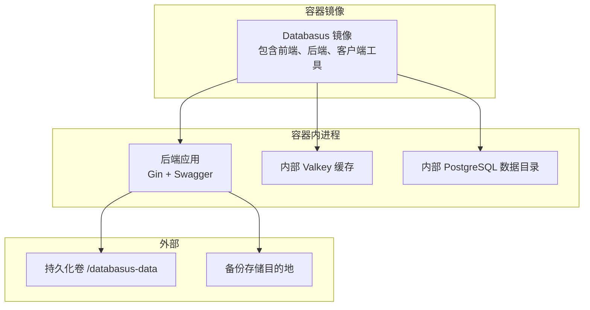
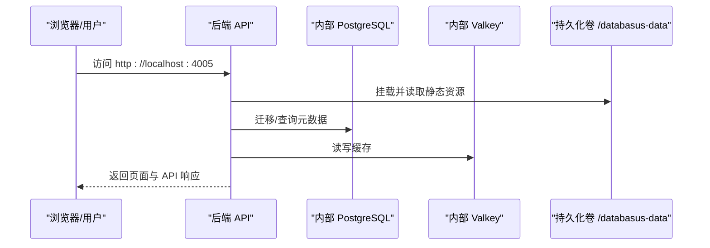
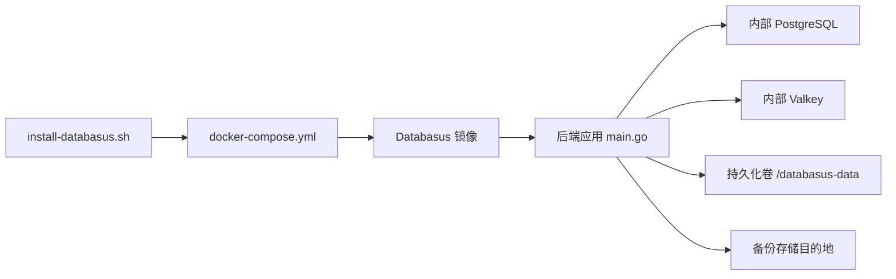

# 快速开始

<cite>
**本文引用的文件**
- [README.md](file://README.md)
- [install-databasus.sh](file://install-databasus.sh)
- [Dockerfile](file://Dockerfile)
- [docker-compose.yml.example](file://docker-compose.yml.example)
- [backend/cmd/main.go](file://backend/cmd/main.go)
- [backend/internal/config/config.go](file://backend/internal/config/config.go)
- [backend/.env.production.example](file://backend/.env.production.example)
- [deploy/helm/values.yaml](file://deploy/helm/values.yaml)
- [deploy/helm/README.md](file://deploy/helm/README.md)
- [backend/tools/readme.md](file://backend/tools/readme.md)
</cite>

## 目录
1. [简介](#简介)
2. [项目结构](#项目结构)
3. [核心组件](#核心组件)
4. [架构总览](#架构总览)
5. [详细安装与配置指南](#详细安装与配置指南)
6. [依赖关系分析](#依赖关系分析)
7. [性能与资源建议](#性能与资源建议)
8. [故障排除指南](#故障排除指南)
9. [结论](#结论)
10. [附录](#附录)

## 简介
Databasus 是一款开源、自托管的数据库备份工具，支持 PostgreSQL、MySQL、MariaDB 和 MongoDB。它提供灵活的调度、多种存储目的地、通知系统、加密与审计日志，并可作为 Docker 镜像或通过 Helm 在 Kubernetes 中部署。本文面向初学者，提供四种安装方式的完整步骤、初始配置流程、密码重置方法以及常见问题排查。

## 项目结构
- 后端服务：Go 编写，内置前端静态资源，提供 REST API、定时任务与后台服务。
- 前端：打包到后端镜像中，通过 Gin 路由回退到 index.html。
- 容器镜像：包含 PostgreSQL 客户端工具、Valkey 内部缓存、Rclone、Agent 二进制等。
- 部署：提供 Docker Compose 示例、自动化安装脚本、Helm Chart。

图表来源
- [Dockerfile:107-546](file://Dockerfile#L107-L546)
- [backend/cmd/main.go:112-137](file://backend/cmd/main.go#L112-L137)

章节来源
- [Dockerfile:107-546](file://Dockerfile#L107-L546)
- [backend/cmd/main.go:112-137](file://backend/cmd/main.go#L112-L137)

## 核心组件
- 后端入口与路由：启动 Gin 应用、注册公开与受保护路由、挂载前端静态资源。
- 配置加载：从 .env 加载环境变量，校验必要项，设置数据目录与密钥路径。
- 初始化与迁移：首次启动执行数据库迁移，创建初始管理员账户，生成 Swagger 文档。
- 后台任务：备份调度、清理、恢复调度、健康检查、审计日志清理、下载令牌清理、遥测等。
- 密码重置：支持通过命令行参数重置指定用户的密码。

章节来源
- [backend/cmd/main.go:65-137](file://backend/cmd/main.go#L65-L137)
- [backend/cmd/main.go:139-173](file://backend/cmd/main.go#L139-L173)
- [backend/internal/config/config.go:157-421](file://backend/internal/config/config.go#L157-L421)

## 架构总览
Databasus 以单容器模式运行，内部包含：
- 内部 PostgreSQL（仅本地访问）用于存储应用元数据
- 内部 Valkey（仅本地访问）用于缓存
- 备份与恢复通过调度器与节点后台任务执行
- 支持 Agent 模式（远程数据库直连或代理流式备份）

图表来源
- [Dockerfile:277-546](file://Dockerfile#L277-L546)
- [backend/cmd/main.go:112-137](file://backend/cmd/main.go#L112-L137)

## 详细安装与配置指南

### 方式一：自动化安装脚本（推荐，Linux）
该脚本会自动安装 Docker 与 Compose 插件，生成 docker-compose.yml 并启动服务。

- 步骤
  1) 以 root 权限运行脚本
  2) 脚本检测 OS 并安装 Docker 与 Compose 插件
  3) 创建安装目录并生成 docker-compose.yml
  4) 使用 docker compose 启动
  5) 访问 http://localhost:4005

- 注意事项
  - 仅支持 Ubuntu/Debian；其他发行版需手动安装 Docker
  - 安装完成后可在安装目录启动/停止服务

章节来源
- [install-databasus.sh:1-141](file://install-databasus.sh#L1-L141)
- [README.md:128-141](file://README.md#L128-L141)

### 方式二：简单 Docker 运行
适合快速体验或单机测试。

- 步骤
  1) 准备本地目录 ./databasus-data 用于持久化
  2) 执行容器运行命令，映射端口 4005，挂载数据卷
  3) 访问 http://localhost:4005

- 注意事项
  - 容器重启策略为 unless-stopped
  - 首次启动会初始化内部数据库与缓存

章节来源
- [README.md:142-160](file://README.md#L142-L160)
- [Dockerfile:277-546](file://Dockerfile#L277-L546)

### 方式三：Docker Compose 设置
适合本地开发或需要自定义配置的场景。

- 步骤
  1) 复制示例 compose 文件并按需修改
  2) 使用 docker compose up -d 启动
  3) 访问 http://localhost:4005

- 注意事项
  - 示例文件仅用于本地开发，不建议直接用于生产
  - 生产请参考 README 的安装说明与环境变量配置

章节来源
- [README.md:161-182](file://README.md#L161-L182)
- [docker-compose.yml.example:1-19](file://docker-compose.yml.example#L1-L19)

### 方式四：Kubernetes 部署（Helm）
适用于云原生环境，支持多种外部访问方式。

- 步骤
  1) 从 OCI 仓库安装 Chart，默认命名空间 databasus
  2) 默认使用 ClusterIP + 端口转发进行访问
  3) 可选：NodePort、LoadBalancer、Ingress 或 HTTPRoute

- 常见访问方式
  - 开发/测试：kubectl port-forward svc/databasus-service 4005:4005 -n databasus
  - 负载均衡：设置 service.type=LoadBalancer 获取外网 IP
  - Ingress：启用 ingress 并配置域名与证书

章节来源
- [README.md:183-222](file://README.md#L183-L222)
- [deploy/helm/README.md:1-247](file://deploy/helm/README.md#L1-L247)
- [deploy/helm/values.yaml:1-107](file://deploy/helm/values.yaml#L1-L107)

### 初始配置流程（仪表板向导）
完成安装后，在浏览器中访问 http://localhost:4005，按以下步骤完成初始配置：

- 添加你的第一个数据库
  - 点击“新建数据库”，选择数据库类型（PostgreSQL/MySQL/MariaDB/MongoDB）
  - 输入连接信息（主机、端口、用户名、密码、数据库名）
  - 保存并验证连接

- 配置备份计划
  - 选择备份类型（逻辑/物理/增量）
  - 设置调度周期（小时/日/周/月/Cron）
  - 配置压缩与并发参数

- 选择存储目的地
  - 支持本地、S3、Google Drive、NAS、FTP、SFTP、Rclone 等
  - 填写对应凭据与路径/桶名

- 配置保留策略
  - 时间范围、数量限制、GFS（祖父-父亲-儿子）分层策略
  - 可设置单个备份大小上限与总存储上限

- 添加通知（可选）
  - 邮件、Telegram、Slack、Discord、Webhook 等
  - 配置成功/失败通知

- 保存并启动
  - Databasus 将验证设置并开始按计划执行备份

章节来源
- [README.md:225-234](file://README.md#L225-L234)

### 密码重置方法
当忘记管理员密码时，可通过容器内命令重置指定用户的密码。

- 步骤
  1) 进入容器执行命令，传入新密码与邮箱
  2) 成功后即可使用新密码登录

- 注意
  - 需要提供目标用户的邮箱地址
  - 建议在安全环境中执行

章节来源
- [README.md:236-244](file://README.md#L236-L244)
- [backend/cmd/main.go:139-173](file://backend/cmd/main.go#L139-L173)

### Databasus 自身备份建议
- 建议定期备份 Databasus 自身，至少备份密钥文件（用于解密备份）
- 备份位置应与业务备份分离，避免单点故障
- 可将密钥文件与备份目录一起归档至安全存储

章节来源
- [README.md:246-248](file://README.md#L246-L248)

## 依赖关系分析

图表来源
- [install-databasus.sh:113-123](file://install-databasus.sh#L113-L123)
- [Dockerfile:277-546](file://Dockerfile#L277-L546)
- [backend/cmd/main.go:112-137](file://backend/cmd/main.go#L112-L137)

章节来源
- [install-databasus.sh:113-123](file://install-databasus.sh#L113-L123)
- [Dockerfile:277-546](file://Dockerfile#L277-L546)
- [backend/cmd/main.go:112-137](file://backend/cmd/main.go#L112-L137)

## 性能与资源建议
- 容器默认资源请求/限制为 1Gi 内存与 500m CPU，可根据实际负载调整
- 存储容量建议至少 10Gi，生产环境按备份量与保留策略评估
- 网络吞吐建议不低于 1Gbps，避免网络成为瓶颈
- 对于大规模数据库，可考虑多节点模式与合理的并发设置

章节来源
- [deploy/helm/values.yaml:27-33](file://deploy/helm/values.yaml#L27-L33)
- [deploy/helm/values.yaml:36-44](file://deploy/helm/values.yaml#L36-L44)

## 故障排除指南

- 容器无法启动或端口占用
  - 检查端口 4005 是否被占用，更换映射或释放端口
  - 查看容器日志定位错误

- PostgreSQL 初始化失败或 WAL 相关错误
  - 镜像内置启动脚本会在启动失败时尝试 WAL 重置恢复
  - 若仍失败，可删除数据卷重新初始化（注意数据丢失风险）

- Docker Compose 插件缺失
  - 自动化脚本要求 docker compose 插件可用，如缺失请先安装

- Kubernetes 访问异常
  - 默认使用 ClusterIP + 端口转发进行访问
  - 如需外网访问，可改为 LoadBalancer 或配置 Ingress/HTTPRoute

- 环境变量与 .env 配置
  - 确保 DATABASE_DSN、ENV_MODE、VALKEY_* 等关键变量正确设置
  - 生产环境建议使用 .env.production.example 作为模板

- 客户端工具兼容性（开发/CI 场景）
  - 不同数据库版本的客户端工具需按要求安装
  - 如遇权限或下载失败，可参考 tools/readme.md 的手动安装指引

章节来源
- [Dockerfile:446-490](file://Dockerfile#L446-L490)
- [install-databasus.sh:103-109](file://install-databasus.sh#L103-L109)
- [deploy/helm/README.md:14-23](file://deploy/helm/README.md#L14-L23)
- [backend/internal/config/config.go:157-421](file://backend/internal/config/config.go#L157-L421)
- [backend/tools/readme.md:206-263](file://backend/tools/readme.md#L206-L263)

## 结论
通过上述四种安装方式，你可以快速在本地或云环境中部署 Databasus。建议优先使用自动化安装脚本，既省时又保证一致性。初次使用时，遵循仪表板向导完成数据库连接、备份计划、存储与通知配置。遇到问题时，结合日志与本指南的故障排除建议进行定位与修复。最后别忘了定期备份 Databasus 自身与密钥，确保可恢复性。

## 附录

### 环境变量与配置要点
- 关键变量
  - DATABASE_DSN：内部数据库连接串
  - ENV_MODE：开发/生产模式
  - VALKEY_*：内部缓存连接信息
  - DATABASUS_URL：用于邮件链接的根地址（可选）
  - SMTP_*：邮件通知配置（可选）

- 默认值与路径
  - 数据目录：/databasus-data/backups
  - 临时目录：/databasus-data/temp
  - 密钥文件：/databasus-data/secret.key
  - 实例文件：/databasus-data/instance.json

章节来源
- [backend/internal/config/config.go:326-333](file://backend/internal/config/config.go#L326-L333)
- [backend/.env.production.example:1-19](file://backend/.env.production.example#L1-L19)