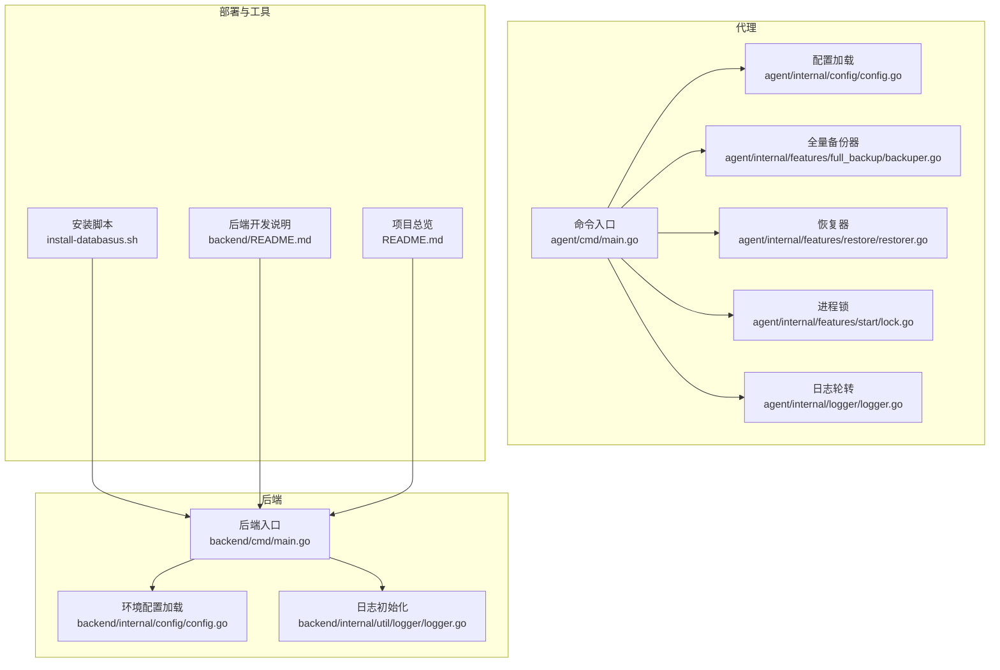
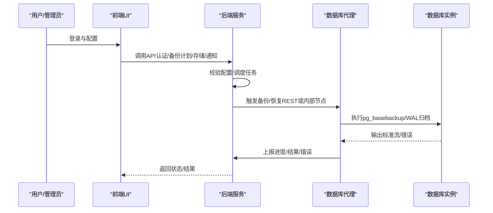
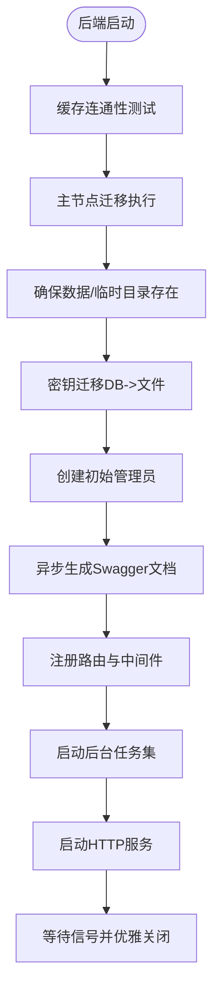
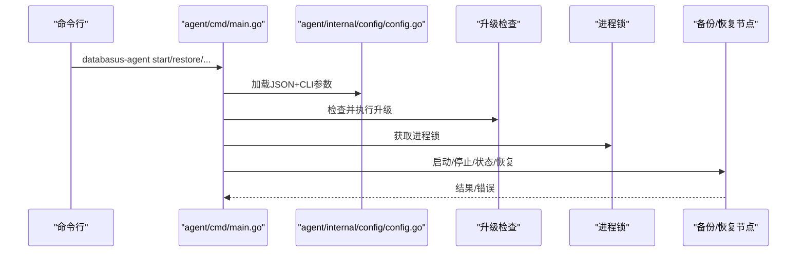
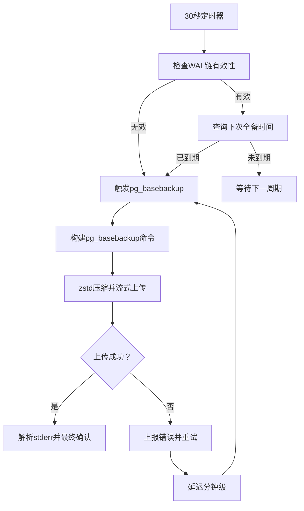
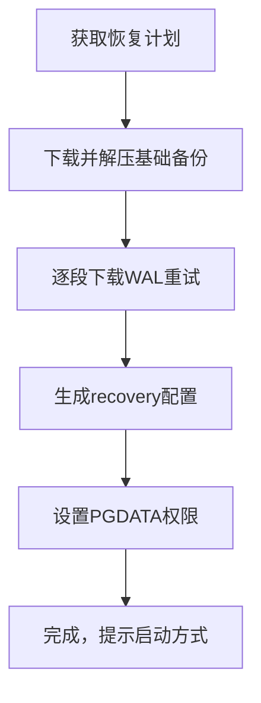
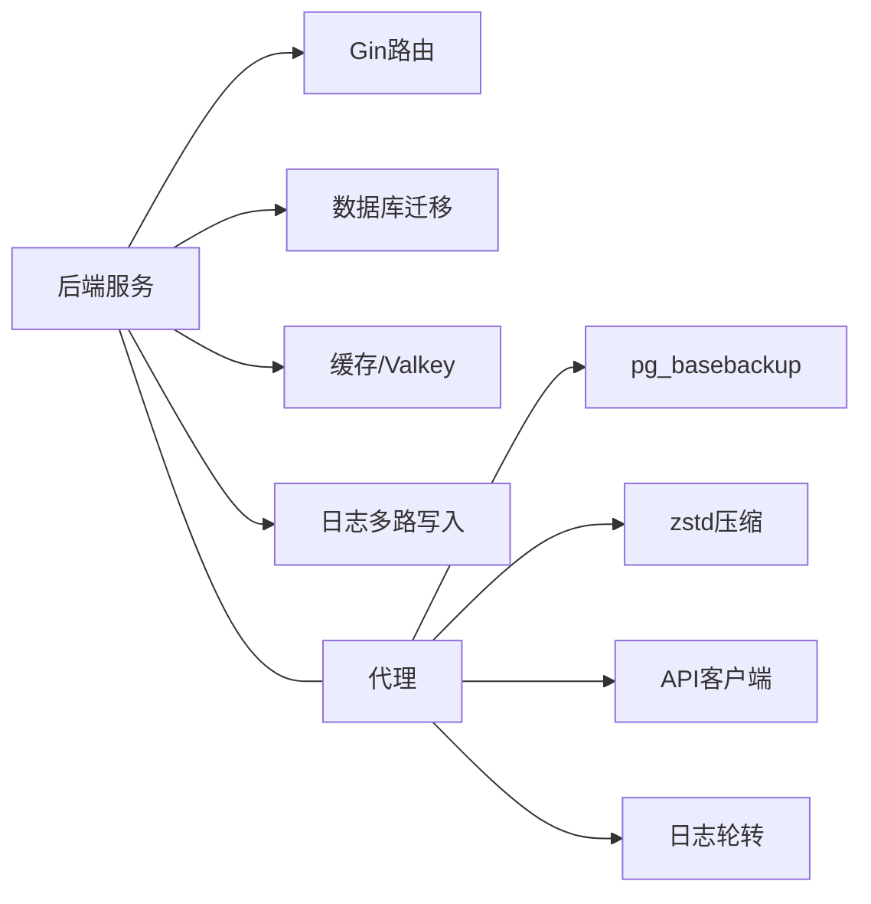

# 故障排除和FAQ

<cite>
**本文引用的文件**
- [README.md](file://README.md)
- [backend/README.md](file://backend/README.md)
- [install-databasus.sh](file://install-databasus.sh)
- [agent/cmd/main.go](file://agent/cmd/main.go)
- [agent/internal/config/config.go](file://agent/internal/config/config.go)
- [agent/internal/features/full_backup/backuper.go](file://agent/internal/features/full_backup/backuper.go)
- [agent/internal/features/restore/restorer.go](file://agent/internal/features/restore/restorer.go)
- [agent/internal/features/start/lock.go](file://agent/internal/features/start/lock.go)
- [agent/internal/features/upgrade/errors.go](file://agent/internal/features/upgrade/errors.go)
- [agent/internal/logger/logger.go](file://agent/internal/logger/logger.go)
- [backend/cmd/main.go](file://backend/cmd/main.go)
- [backend/internal/config/config.go](file://backend/internal/config/config.go)
- [backend/internal/util/logger/logger.go](file://backend/internal/util/logger/logger.go)
- [.github/ISSUE_TEMPLATE/bug_report.md](file://.github/ISSUE_TEMPLATE/bug_report.md)
</cite>

## 目录
1. [简介](#简介)
2. [项目结构](#项目结构)
3. [核心组件](#核心组件)
4. [架构总览](#架构总览)
5. [详细组件分析](#详细组件分析)
6. [依赖关系分析](#依赖关系分析)
7. [性能考虑](#性能考虑)
8. [故障排除指南](#故障排除指南)
9. [结论](#结论)
10. [附录](#附录)

## 简介
本指南面向Databasus用户与运维人员，提供系统化的问题诊断与排错方法，覆盖安装、配置、连接、备份与恢复、性能调优、安全与合规、升级迁移以及紧急响应流程。内容基于仓库中的源码与脚本，确保可追溯到具体实现位置。

## 项目结构
Databasus由后端服务、代理（Agent）、前端UI、工具链与部署脚本组成。后端负责API、调度、通知、审计与账单；代理负责与数据库交互、物理/逻辑备份、WAL归档与恢复；安装脚本与Compose配置简化部署；日志模块统一输出与轮转。

**图表来源**
- [backend/cmd/main.go:65-137](file://backend/cmd/main.go#L65-L137)
- [backend/internal/config/config.go:157-421](file://backend/internal/config/config.go#L157-L421)
- [backend/internal/util/logger/logger.go:19-79](file://backend/internal/util/logger/logger.go#L19-L79)
- [agent/cmd/main.go:24-97](file://agent/cmd/main.go#L24-L97)
- [agent/internal/config/config.go:33-115](file://agent/internal/config/config.go#L33-L115)
- [agent/internal/features/full_backup/backuper.go:66-124](file://agent/internal/features/full_backup/backuper.go#L66-L124)
- [agent/internal/features/restore/restorer.go:58-102](file://agent/internal/features/restore/restorer.go#L58-L102)
- [agent/internal/features/start/lock.go:18-49](file://agent/internal/features/start/lock.go#L18-L49)
- [agent/internal/logger/logger.go:76-115](file://agent/internal/logger/logger.go#L76-L115)
- [install-databasus.sh:113-134](file://install-databasus.sh#L113-L134)
- [backend/README.md:1-69](file://backend/README.md#L1-L69)
- [README.md:124-222](file://README.md#L124-L222)

**章节来源**
- [README.md:124-222](file://README.md#L124-L222)
- [backend/README.md:1-69](file://backend/README.md#L1-L69)
- [install-databasus.sh:113-134](file://install-databasus.sh#L113-L134)
- [backend/cmd/main.go:65-137](file://backend/cmd/main.go#L65-L137)
- [agent/cmd/main.go:24-97](file://agent/cmd/main.go#L24-L97)

## 核心组件
- 后端服务：启动时执行缓存与迁移、挂载路由、注册后台任务、启动HTTP服务与优雅关闭。
- 代理（Agent）：解析命令行参数与配置文件，执行启动/停止/状态查询/恢复，管理自动更新与进程锁。
- 配置系统：后端通过.env加载环境变量并校验关键字段；代理从JSON配置文件加载并支持CLI覆盖。
- 备份与恢复：代理负责物理/逻辑备份与WAL归档上传，恢复器负责下载解压、WAL段下载与PITR配置。
- 日志系统：后端支持stdout与VictoriaLogs多路写入；代理提供5MB轮转日志文件。

**章节来源**
- [backend/cmd/main.go:65-137](file://backend/cmd/main.go#L65-L137)
- [agent/cmd/main.go:24-97](file://agent/cmd/main.go#L24-L97)
- [agent/internal/config/config.go:33-115](file://agent/internal/config/config.go#L33-L115)
- [backend/internal/config/config.go:157-421](file://backend/internal/config/config.go#L157-L421)
- [agent/internal/features/full_backup/backuper.go:164-245](file://agent/internal/features/full_backup/backuper.go#L164-L245)
- [agent/internal/features/restore/restorer.go:165-258](file://agent/internal/features/restore/restorer.go#L165-L258)
- [agent/internal/logger/logger.go:76-115](file://agent/internal/logger/logger.go#L76-L115)
- [backend/internal/util/logger/logger.go:19-79](file://backend/internal/util/logger/logger.go#L19-L79)

## 架构总览
下图展示Databasus在运行期的关键交互：后端负责API与调度，代理负责数据库侧的备份/WAL归档与恢复，日志模块贯穿两端。

**图表来源**
- [backend/cmd/main.go:213-257](file://backend/cmd/main.go#L213-L257)
- [agent/cmd/main.go:30-75](file://agent/cmd/main.go#L30-L75)
- [agent/internal/features/full_backup/backuper.go:164-245](file://agent/internal/features/full_backup/backuper.go#L164-L245)
- [agent/internal/features/restore/restorer.go:58-102](file://agent/internal/features/restore/restorer.go#L58-L102)

## 详细组件分析

### 后端启动与后台任务
- 初始化：缓存连通性测试、主节点迁移、目录准备、密钥迁移、初始管理员创建、Swagger生成。
- 路由：公开与受保护路由分离，按功能模块注册控制器。
- 后台任务：备份/清理/恢复/健康检查/审计/下载令牌/节点注册/遥测/计费（云版）。
- 优雅关闭：信号处理、VictoriaLogs写入器关闭、HTTP服务器超时关闭。

**图表来源**
- [backend/cmd/main.go:65-137](file://backend/cmd/main.go#L65-L137)
- [backend/cmd/main.go:293-374](file://backend/cmd/main.go#L293-L374)

**章节来源**
- [backend/cmd/main.go:65-137](file://backend/cmd/main.go#L65-L137)
- [backend/cmd/main.go:293-374](file://backend/cmd/main.go#L293-L374)

### 代理命令与生命周期
- 命令：start/_run/stop/status/restore/version，支持跳过更新检查。
- 自动更新：根据主机地址检查并重执行自身。
- 进程锁：非Windows平台使用文件锁避免重复实例。
- 恢复：校验目标pgdata目录、拉取恢复计划、下载并解压基础备份、下载WAL段、生成recovery配置。

**图表来源**
- [agent/cmd/main.go:24-97](file://agent/cmd/main.go#L24-L97)
- [agent/internal/config/config.go:33-115](file://agent/internal/config/config.go#L33-L115)
- [agent/internal/features/start/lock.go:18-49](file://agent/internal/features/start/lock.go#L18-L49)
- [agent/internal/features/upgrade/errors.go:5-5](file://agent/internal/features/upgrade/errors.go#L5-L5)

**章节来源**
- [agent/cmd/main.go:24-97](file://agent/cmd/main.go#L24-L97)
- [agent/internal/config/config.go:33-115](file://agent/internal/config/config.go#L33-L115)
- [agent/internal/features/start/lock.go:18-49](file://agent/internal/features/start/lock.go#L18-L49)
- [agent/internal/features/upgrade/errors.go:5-5](file://agent/internal/features/upgrade/errors.go#L5-L5)

### 全量备份流程
- 定时检查：每30秒检查WAL链有效性或是否到达下次全备时间。
- 并发控制：原子布尔位防止并发执行。
- 执行：构建pg_basebackup命令，标准输出经zstd压缩后直传至后端。
- 错误上报与重试：失败后上报错误并以指数退避重试，超时约23小时。
- 终止：解析stderr获取WAL起止段并最终确认备份。

**图表来源**
- [agent/internal/features/full_backup/backuper.go:66-124](file://agent/internal/features/full_backup/backuper.go#L66-L124)
- [agent/internal/features/full_backup/backuper.go:164-245](file://agent/internal/features/full_backup/backuper.go#L164-L245)

**章节来源**
- [agent/internal/features/full_backup/backuper.go:66-124](file://agent/internal/features/full_backup/backuper.go#L66-L124)
- [agent/internal/features/full_backup/backuper.go:164-245](file://agent/internal/features/full_backup/backuper.go#L164-L245)

### 恢复流程（含PITR）
- 计划：从后端获取恢复计划（基础备份ID、WAL段列表、最新可用段）。
- 下载与解压：下载zstd压缩的tar包并解压到目标pgdata目录。
- WAL段：逐个下载WAL段到独立目录，带重试与指数退避。
- 配置：生成recovery.signal与postgresql.auto.conf，设置restore_command与recovery_target_time。
- 启动：容器或本地启动PostgreSQL完成恢复。

**图表来源**
- [agent/internal/features/restore/restorer.go:58-102](file://agent/internal/features/restore/restorer.go#L58-L102)
- [agent/internal/features/restore/restorer.go:165-258](file://agent/internal/features/restore/restorer.go#L165-L258)
- [agent/internal/features/restore/restorer.go:329-363](file://agent/internal/features/restore/restorer.go#L329-L363)

**章节来源**
- [agent/internal/features/restore/restorer.go:58-102](file://agent/internal/features/restore/restorer.go#L58-L102)
- [agent/internal/features/restore/restorer.go:165-258](file://agent/internal/features/restore/restorer.go#L165-L258)
- [agent/internal/features/restore/restorer.go:329-363](file://agent/internal/features/restore/restorer.go#L329-L363)

## 依赖关系分析
- 后端依赖：Gin框架、Swagger、数据库迁移工具、缓存/Valkey、日志多路写入。
- 代理依赖：PostgreSQL客户端工具（host模式）或Docker exec（docker模式）、zstd压缩库、API客户端。
- 配置依赖：后端通过dotenv与cleanenv加载；代理通过JSON文件与CLI参数叠加。

**图表来源**
- [backend/cmd/main.go:17-55](file://backend/cmd/main.go#L17-L55)
- [agent/cmd/main.go:3-20](file://agent/cmd/main.go#L3-L20)
- [agent/internal/features/full_backup/backuper.go:15-19](file://agent/internal/features/full_backup/backuper.go#L15-L19)
- [agent/internal/logger/logger.go:18-41](file://agent/internal/logger/logger.go#L18-L41)

**章节来源**
- [backend/cmd/main.go:17-55](file://backend/cmd/main.go#L17-L55)
- [agent/cmd/main.go:3-20](file://agent/cmd/main.go#L3-L20)
- [agent/internal/features/full_backup/backuper.go:15-19](file://agent/internal/features/full_backup/backuper.go#L15-L19)
- [agent/internal/logger/logger.go:18-41](file://agent/internal/logger/logger.go#L18-L41)

## 性能考虑
- 网络吞吐：后端环境变量支持节点网络吞吐配置，默认125MB/s，用于估算传输速率与并发。
- 压缩级别：代理对备份输出采用中等压缩级别，平衡CPU与带宽。
- 上传超时：备份上传超时约23小时，避免长时间占用资源。
- 并发与重试：备份器与恢复器均内置重试与指数退避，降低瞬时失败影响。
- 前端静态资源：后端启用GZIP压缩，排除图片/PDF等已压缩格式。

**章节来源**
- [backend/internal/config/config.go:282-284](file://backend/internal/config/config.go#L282-L284)
- [agent/internal/features/full_backup/backuper.go:21-27](file://agent/internal/features/full_backup/backuper.go#L21-L27)
- [agent/internal/features/full_backup/backuper.go:247-269](file://agent/internal/features/full_backup/backuper.go#L247-L269)
- [backend/cmd/main.go:117-124](file://backend/cmd/main.go#L117-L124)

## 故障排除指南

### 安装与部署
- 权限不足：安装脚本要求root权限，若无请使用sudo。
- Docker未安装：脚本会自动安装Docker与Compose插件，失败时检查系统发行版与仓库配置。
- Compose不可用：若docker compose不可用，安装失败，需手动安装。
- 启动失败：检查容器日志与端口占用，确认4005端口可用且防火墙放行。

**章节来源**
- [install-databasus.sh:5-10](file://install-databasus.sh#L5-L10)
- [install-databasus.sh:44-101](file://install-databasus.sh#L44-L101)
- [install-databasus.sh:126-134](file://install-databasus.sh#L126-L134)
- [README.md:124-222](file://README.md#L124-L222)

### 配置错误
- 后端环境变量缺失：DATABASE_DSN、ENV_MODE、VALKEY_*等必须配置，否则启动即退出。
- 代理配置文件：databasus.json不存在时会在保存时创建；敏感信息会掩码记录，便于核对但不泄露明文。
- CLI覆盖：CLI参数优先于JSON配置，注意区分pg-host/bin-dir/docker容器名等关键项。

**章节来源**
- [backend/internal/config/config.go:235-248](file://backend/internal/config/config.go#L235-L248)
- [backend/internal/config/config.go:295-324](file://backend/internal/config/config.go#L295-L324)
- [agent/internal/config/config.go:81-101](file://agent/internal/config/config.go#L81-L101)
- [agent/internal/config/config.go:236-261](file://agent/internal/config/config.go#L236-L261)

### 连接失败
- 数据库连接：确认主机、端口、用户、密码正确；host模式需可访问数据库端口；docker模式需容器名称正确。
- 代理无法启动：检查进程锁文件是否存在，避免重复实例；Windows平台无文件锁机制。
- 后端无法访问外部数据库：可通过危险模式变量覆盖连接串，但需谨慎。

**章节来源**
- [agent/internal/config/config.go:16-31](file://agent/internal/config/config.go#L16-L31)
- [agent/internal/features/start/lock.go:18-49](file://agent/internal/features/start/lock.go#L18-L49)
- [backend/internal/config/config.go:227-233](file://backend/internal/config/config.go#L227-L233)

### 备份失败
- WAL链无效或未达计划时间：备份器会周期检查并触发；若频繁失败，检查数据库WAL生成与网络稳定性。
- 上传超时或空闲超时：上传有约23小时超时与空闲超时，必要时调整网络环境或分批传输。
- 错误上报与重试：失败会上报后端并按分钟级延迟重试，查看后端日志定位原因。

**章节来源**
- [agent/internal/features/full_backup/backuper.go:85-124](file://agent/internal/features/full_backup/backuper.go#L85-L124)
- [agent/internal/features/full_backup/backuper.go:184-213](file://agent/internal/features/full_backup/backuper.go#L184-L213)
- [agent/internal/features/full_backup/backuper.go:271-275](file://agent/internal/features/full_backup/backuper.go#L271-L275)

### 恢复失败
- 目标pgdata目录：必须存在且为空，否则拒绝继续；恢复完成后生成recovery配置。
- WAL段下载：逐段重试，失败会记录重试次数与延迟；检查网络与存储可用性。
- PITR目标时间：需符合RFC3339格式，否则直接报错。

**章节来源**
- [agent/internal/features/restore/restorer.go:104-128](file://agent/internal/features/restore/restorer.go#L104-L128)
- [agent/internal/features/restore/restorer.go:260-299](file://agent/internal/features/restore/restorer.go#L260-L299)
- [agent/internal/features/restore/restorer.go:61-68](file://agent/internal/features/restore/restorer.go#L61-L68)

### 日志分析与错误解读
- 后端日志：stdout与VictoriaLogs双通道；优雅关闭时会关闭VictoriaLogs写入器。
- 代理日志：5MB轮转，包含敏感信息掩码；可通过日志定位命令行参数来源与配置来源。
- 常见错误：升级后需要重启、进程锁冲突、备份/恢复API返回的错误消息。

**章节来源**
- [backend/internal/util/logger/logger.go:19-79](file://backend/internal/util/logger/logger.go#L19-L79)
- [agent/internal/logger/logger.go:76-115](file://agent/internal/logger/logger.go#L76-L115)
- [agent/internal/config/config.go:236-261](file://agent/internal/config/config.go#L236-L261)
- [agent/internal/features/upgrade/errors.go:5-5](file://agent/internal/features/upgrade/errors.go#L5-L5)

### 性能调优建议
- 网络：根据节点吞吐设置合理值，避免带宽瓶颈导致上传超时。
- 压缩：在CPU与带宽间权衡压缩级别，必要时降低压缩强度。
- 重试：适当放宽重试间隔，减少瞬时抖动对业务的影响。
- 前端：启用GZIP压缩减少静态资源传输体积。

**章节来源**
- [backend/internal/config/config.go:282-284](file://backend/internal/config/config.go#L282-L284)
- [agent/internal/features/full_backup/backuper.go:247-269](file://agent/internal/features/full_backup/backuper.go#L247-L269)
- [backend/cmd/main.go:117-124](file://backend/cmd/main.go#L117-L124)

### 安全相关问题
- 密钥管理：后端支持从数据库迁移到文件的密钥迁移；生产环境建议将密钥文件置于安全路径。
- 加密：备份文件采用AES-256-GCM加密；通知与敏感字段加密存储。
- 访问控制：默认使用只读用户进行备份；支持工作区与角色管理。

**章节来源**
- [backend/cmd/main.go:96-100](file://backend/cmd/main.go#L96-L100)
- [README.md:72-78](file://README.md#L72-L78)

### 社区支持与反馈
- GitHub Issues：提供Bug报告模板，包含版本、操作系统、数据库类型与复现步骤。
- Telegram社区：加入社区讨论与求助。
- 文档反馈：遵循贡献指南与行为准则。

**章节来源**
- [.github/ISSUE_TEMPLATE/bug_report.md:1-45](file://.github/ISSUE_TEMPLATE/bug_report.md#L1-L45)
- [README.md:256-260](file://README.md#L256-L260)

### 版本升级与迁移
- 代理自动更新：根据主机地址检查并重执行自身；升级后返回特定错误以便重启。
- 安装脚本：一键安装Docker与Compose并启动服务，适合全新部署。
- 升级后验证：检查日志与服务状态，确认新版本生效。

**章节来源**
- [agent/cmd/main.go:173-193](file://agent/cmd/main.go#L173-L193)
- [agent/internal/features/upgrade/errors.go:5-5](file://agent/internal/features/upgrade/errors.go#L5-L5)
- [install-databasus.sh:126-134](file://install-databasus.sh#L126-L134)

### 紧急响应流程
- 立即措施：停止相关备份/恢复任务，检查网络与存储可用性。
- 收集信息：导出后端与代理日志、环境变量、配置文件快照。
- 报告渠道：提交GitHub Issue并附上日志与复现步骤。
- 联系方式：通过Telegram社区寻求帮助。

**章节来源**
- [.github/ISSUE_TEMPLATE/bug_report.md:1-45](file://.github/ISSUE_TEMPLATE/bug_report.md#L1-L45)
- [README.md:256-260](file://README.md#L256-L260)

## 结论
本指南基于仓库源码梳理了Databasus的安装、配置、备份/恢复、日志与性能调优要点，并提供了系统化的排错流程与升级迁移建议。建议在生产环境中结合日志与监控持续观察，遇到复杂问题及时通过社区渠道反馈。

## 附录
- 快速检查清单
  - 环境变量齐全（DATABASE_DSN、ENV_MODE、VALKEY_*）
  - Docker与Compose可用
  - 端口4005开放
  - pg_basebackup可用（host模式）或容器名称正确（docker模式）
  - 目标pgdata目录为空且可写
  - 网络稳定，带宽充足
  - 日志轮转正常，无磁盘空间不足