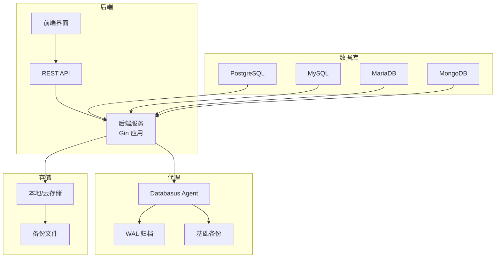
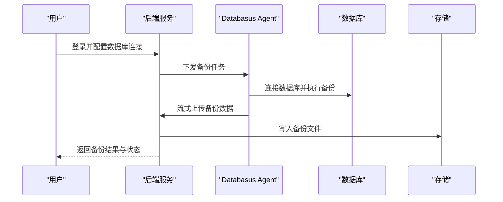
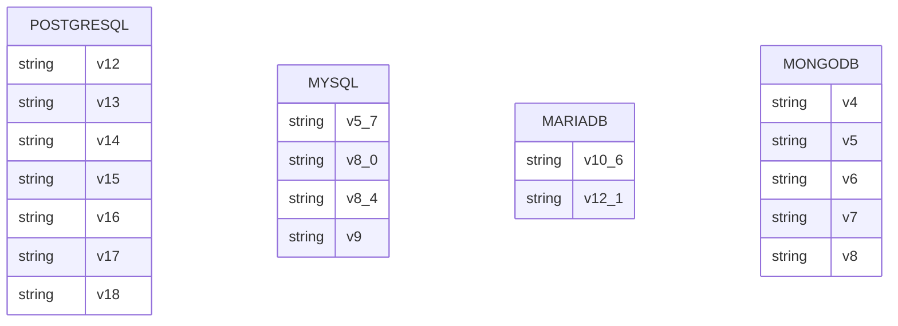
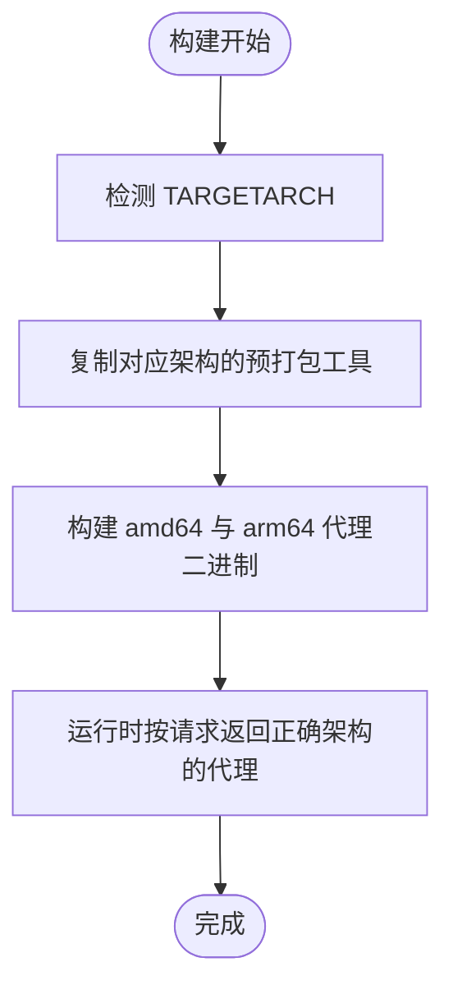
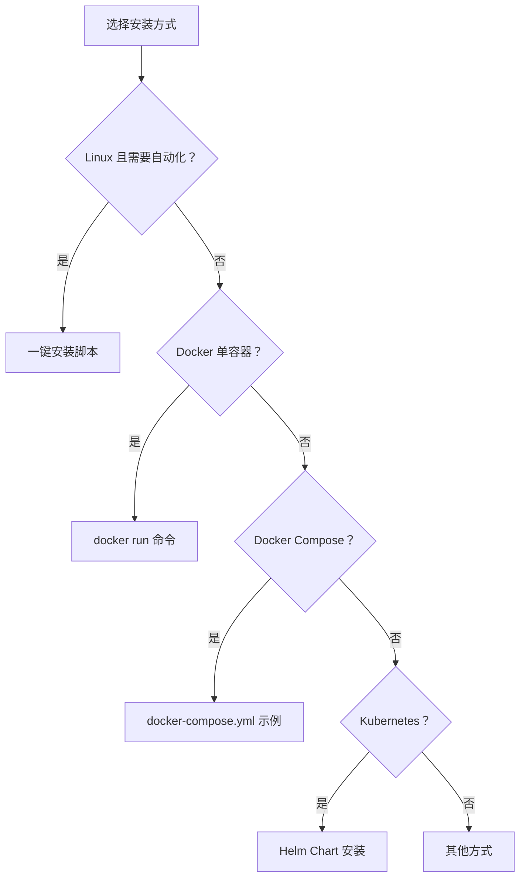
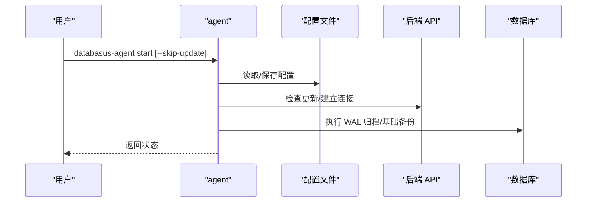
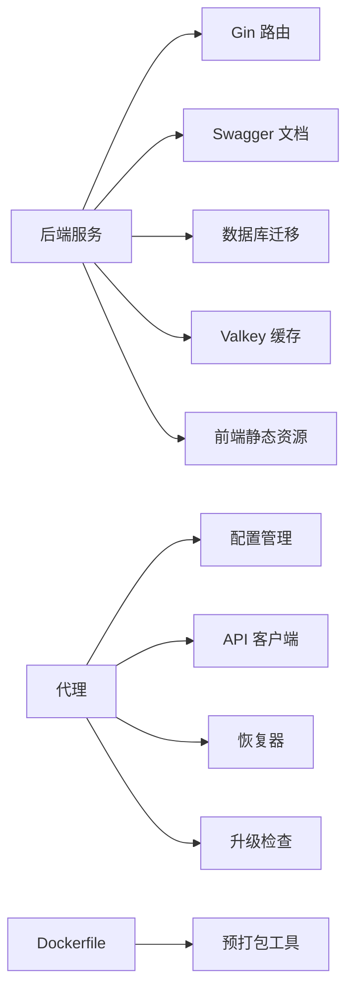

# 数据库客户端工具

<cite>
**本文档引用的文件**
- [README.md](file://README.md)
- [install-databasus.sh](file://install-databasus.sh)
- [backend/tools/readme.md](file://backend/tools/readme.md)
- [backend/tools/download_linux.sh](file://backend/tools/download_linux.sh)
- [backend/tools/download_windows.bat](file://backend/tools/download_windows.bat)
- [backend/tools/download_macos.sh](file://backend/tools/download_macos.sh)
- [Dockerfile](file://Dockerfile)
- [docker-compose.yml.example](file://docker-compose.yml.example)
- [deploy/helm/README.md](file://deploy/helm/README.md)
- [backend/cmd/main.go](file://backend/cmd/main.go)
- [agent/cmd/main.go](file://agent/cmd/main.go)
- [agent/internal/config/config.go](file://agent/internal/config/config.go)
- [backend/internal/util/tools/enums.go](file://backend/internal/util/tools/enums.go)
- [backend/internal/util/tools/postgresql.go](file://backend/internal/util/tools/postgresql.go)
- [backend/internal/util/tools/mysql.go](file://backend/internal/util/tools/mysql.go)
- [backend/internal/util/tools/mariadb.go](file://backend/internal/util/tools/mariadb.go)
- [backend/internal/util/tools/mongodb.go](file://backend/internal/util/tools/mongodb.go)
</cite>

## 目录
1. [简介](#简介)
2. [项目结构](#项目结构)
3. [核心组件](#核心组件)
4. [架构总览](#架构总览)
5. [详细组件分析](#详细组件分析)
6. [依赖关系分析](#依赖关系分析)
7. [性能考虑](#性能考虑)
8. [故障排除指南](#故障排除指南)
9. [结论](#结论)
10. [附录](#附录)

## 简介
Databasus 是一款开源、自托管的数据库备份与恢复工具，专注于 PostgreSQL，同时支持 MySQL、MariaDB 和 MongoDB 的备份与恢复。它提供多种存储目的地（本地、S3、Google Drive、FTP、NAS、SFTP、Rclone 等）以及通知渠道（邮件、Telegram、Slack、Discord、Webhook），并具备企业级安全特性（AES-256-GCM 加密、零信任存储、只读用户等）。Databasus 提供四种安装方式：自动化脚本、Docker 单容器运行、Docker Compose、Kubernetes Helm 部署。

- 支持的数据库版本矩阵详见下文“版本支持与兼容性”章节
- 多架构支持：x64 与 ARM64 均有工具包与镜像构建
- 工具链包含数据库客户端工具（pg_dump、mysqldump、mariadb-dump、mongodump 等）的多版本集合，用于备份与恢复

**章节来源**
- [README.md:1-310](file://README.md#L1-L310)

## 项目结构
仓库采用多模块结构：
- backend：后端服务（Go Gin 应用），提供 Web 界面、API、备份调度、恢复、审计日志、计费、通知、存储等
- agent：轻量代理（Go），负责 WAL 归档与基础备份流式传输，支持远程主机与 Docker 容器模式
- frontend：前端（React/Vite），打包嵌入到后端二进制中
- assets/tools：预打包的数据库客户端工具（按架构与版本组织），加速 CI/CD 与镜像构建
- deploy/helm：Helm Chart，用于 Kubernetes 部署
- docker-compose.yml.example：本地开发示例
- install-databasus.sh：一键安装脚本（Linux）

**图表来源**
- [backend/cmd/main.go:1-491](file://backend/cmd/main.go#L1-L491)
- [agent/cmd/main.go:1-246](file://agent/cmd/main.go#L1-L246)

**章节来源**
- [README.md:124-222](file://README.md#L124-L222)
- [docker-compose.yml.example:1-19](file://docker-compose.yml.example#L1-L19)

## 核心组件
- 后端服务（backend/cmd/main.go）
  - 负责启动 Gin 服务、注册路由、迁移数据库、后台任务（备份、清理、健康检查、审计日志、遥测等）、挂载前端静态资源
  - 支持通过命令行参数重置管理员密码（--new-password、--email）
- 代理（agent/cmd/main.go）
  - 提供 start/stop/status/restore/version 等子命令
  - 自动更新检查与升级、守护进程运行、WAL 归档与基础备份
- 工具与版本选择（backend/internal/util/tools/*.go）
  - PostgreSQL/MySQL/MariaDB/MongoDB 的版本枚举与可执行文件路径解析
  - 验证各版本客户端工具是否可用（开发/生产环境路径不同）
- 客户端工具准备（backend/tools/*）
  - 提供 Linux、Windows、macOS 的安装脚本，自动下载并安装多版本客户端工具
  - assets/tools 存放预编译工具，Dockerfile 中按架构复制到镜像

**章节来源**
- [backend/cmd/main.go:139-173](file://backend/cmd/main.go#L139-L173)
- [agent/cmd/main.go:24-171](file://agent/cmd/main.go#L24-L171)
- [backend/internal/util/tools/enums.go:1-70](file://backend/internal/util/tools/enums.go#L1-L70)
- [backend/internal/util/tools/postgresql.go:14-32](file://backend/internal/util/tools/postgresql.go#L14-L32)
- [backend/internal/util/tools/mysql.go:30-47](file://backend/internal/util/tools/mysql.go#L30-L47)
- [backend/internal/util/tools/mariadb.go:61-80](file://backend/internal/util/tools/mariadb.go#L61-L80)
- [backend/internal/util/tools/mongodb.go:31-47](file://backend/internal/util/tools/mongodb.go#L31-L47)

## 架构总览
Databasus 采用“后端 + 代理”的架构：
- 后端：提供 Web 界面与 API，调度备份与恢复任务，管理存储与通知
- 代理：在目标数据库服务器上运行，负责 WAL 归档与基础备份的流式传输
- 客户端工具：多版本工具集，按需调用对应版本的 pg_dump、mysqldump、mariadb-dump、mongodump

**图表来源**
- [agent/cmd/main.go:162-171](file://agent/cmd/main.go#L162-L171)
- [backend/cmd/main.go:213-257](file://backend/cmd/main.go#L213-L257)

## 详细组件分析

### 版本支持与兼容性矩阵
- PostgreSQL：12、13、14、15、16、17、18
- MySQL：5.7、8.0、8.4、9
- MariaDB：10.6（旧版客户端）、12.1（新版客户端），根据服务器版本自动选择合适客户端
- MongoDB：数据库工具 100.10.0，向后兼容支持 4、5、6、7、8

**图表来源**
- [backend/internal/util/tools/enums.go:15-25](file://backend/internal/util/tools/enums.go#L15-L25)
- [backend/internal/util/tools/mysql.go:14-21](file://backend/internal/util/tools/mysql.go#L14-L21)
- [backend/internal/util/tools/mariadb.go:14-28](file://backend/internal/util/tools/mariadb.go#L14-L28)
- [backend/internal/util/tools/mongodb.go:14-22](file://backend/internal/util/tools/mongodb.go#L14-L22)

**章节来源**
- [README.md:40-46](file://README.md#L40-L46)
- [backend/tools/readme.md:9-44](file://backend/tools/readme.md#L9-L44)

### 多架构支持（ARM 与 x64）
- Dockerfile 中按 TARGETARCH 条件复制不同架构的预打包工具
- 同时构建 amd64 与 arm64 的 agent 二进制，后端根据查询参数返回对应架构的代理
- assets/tools 按架构存放工具集（x64 与 arm）

**图表来源**
- [Dockerfile:70-104](file://Dockerfile#L70-L104)
- [Dockerfile:125-240](file://Dockerfile#L125-L240)

**章节来源**
- [Dockerfile:70-104](file://Dockerfile#L70-L104)
- [Dockerfile:125-240](file://Dockerfile#L125-L240)
- [assets/tools/README.md:1-17](file://assets/tools/README.md#L1-L17)

### 安装与部署方式
- 自动化脚本（推荐，Linux）
  - 自动安装 Docker 与 Compose、生成 docker-compose.yml 并启动
- Docker 单容器运行
  - 暴露 4005 端口，挂载数据目录
- Docker Compose
  - 使用示例配置文件，快速启动
- Kubernetes（Helm）
  - 从 OCI 仓库直接安装，支持 ClusterIP/NodePort/LoadBalancer/Ingress/HTTPRoute

**图表来源**
- [install-databasus.sh:1-141](file://install-databasus.sh#L1-L141)
- [README.md:124-222](file://README.md#L124-L222)
- [deploy/helm/README.md:1-247](file://deploy/helm/README.md#L1-L247)

**章节来源**
- [install-databasus.sh:1-141](file://install-databasus.sh#L1-L141)
- [README.md:124-222](file://README.md#L124-L222)
- [docker-compose.yml.example:1-19](file://docker-compose.yml.example#L1-L19)
- [deploy/helm/README.md:1-247](file://deploy/helm/README.md#L1-L247)

### 命令行参数与配置选项
- 后端服务
  - 重置管理员密码：--new-password、--email
  - 启动后端服务，监听 4005 端口，注册 API 路由与后台任务
- 代理（agent）
  - start：启动代理，支持 --skip-update
  - stop/status：停止或查看状态
  - restore：从备份恢复，需要 --target-dir、可选 --backup-id、--target-time、--pg-type（host/docker）
  - version：打印版本
  - 配置文件 databasus.json 支持 JSON 与命令行参数混合，命令行优先级更高
- 环境变量与工具路径
  - POSTGRES_INSTALL_DIR、MYSQL_INSTALL_DIR、MARIADB_INSTALL_DIR、MONGODB_INSTALL_DIR
  - 开发环境使用 ./tools 下的版本化目录；生产环境使用系统路径

**图表来源**
- [agent/cmd/main.go:50-75](file://agent/cmd/main.go#L50-L75)
- [agent/cmd/main.go:117-160](file://agent/cmd/main.go#L117-L160)
- [agent/internal/config/config.go:33-64](file://agent/internal/config/config.go#L33-L64)

**章节来源**
- [backend/cmd/main.go:139-173](file://backend/cmd/main.go#L139-L173)
- [agent/cmd/main.go:24-171](file://agent/cmd/main.go#L24-L171)
- [agent/internal/config/config.go:16-31](file://agent/internal/config/config.go#L16-L31)
- [backend/tools/readme.md:186-204](file://backend/tools/readme.md#L186-L204)

### 客户端工具准备与使用
- Linux
  - 使用官方 APT 仓库安装 PostgreSQL 客户端；MySQL 从官方归档下载最小化压缩包；MariaDB 从官方归档下载；MongoDB 通过 dpkg 安装
- Windows
  - PostgreSQL 使用官方安装器（仅安装命令行工具）；MySQL/MariaDB 使用 ZIP 包解压；MongoDB 使用官方 ZIP 包
- macOS
  - PostgreSQL 从源码编译客户端；MySQL 从官方归档下载；MariaDB 通过 Homebrew；MongoDB 通过 Homebrew
- 使用示例
  - 各平台均可通过版本化路径调用对应版本的工具进行 --version 验证

**章节来源**
- [backend/tools/download_linux.sh:1-359](file://backend/tools/download_linux.sh#L1-L359)
- [backend/tools/download_windows.bat:1-415](file://backend/tools/download_windows.bat#L1-L415)
- [backend/tools/download_macos.sh:1-392](file://backend/tools/download_macos.sh#L1-L392)
- [backend/tools/readme.md:156-184](file://backend/tools/readme.md#L156-L184)

### 数据库工具验证与版本选择
- PostgreSQL
  - 验证版本 12-18 的 pg_dump、psql 是否存在；开发环境使用 ./tools/postgresql/postgresql-{version}/bin；生产环境使用 /usr/lib/postgresql/{version}/bin
- MySQL
  - 验证 5.7、8.0、8.4、9 的 mysqldump、mysql；开发环境使用 ./tools/mysql/mysql-{version}/bin；生产环境使用 /usr/local/mysql-{version}/bin
- MariaDB
  - 根据服务器版本选择 10.6（旧版）或 12.1（新版）客户端；开发环境使用 ./tools/mariadb/mariadb-{version}/bin；生产环境使用 /usr/local/mariadb-{version}/bin
- MongoDB
  - 使用单版本工具（100.10.0）支持 4-8；开发环境使用 ./tools/mongodb/bin；生产环境使用 /usr/local/mongodb-database-tools/bin

**章节来源**
- [backend/internal/util/tools/postgresql.go:34-166](file://backend/internal/util/tools/postgresql.go#L34-L166)
- [backend/internal/util/tools/mysql.go:49-176](file://backend/internal/util/tools/mysql.go#L49-L176)
- [backend/internal/util/tools/mariadb.go:82-179](file://backend/internal/util/tools/mariadb.go#L82-L179)
- [backend/internal/util/tools/mongodb.go:49-126](file://backend/internal/util/tools/mongodb.go#L49-L126)

## 依赖关系分析
- 后端依赖
  - Gin Web 框架、Swagger 文档生成、数据库迁移（goose）、缓存（Valkey）、前端静态资源内嵌
  - 注册用户、工作区、备份、恢复、健康检查、审计日志、通知、存储、计费等模块
- 代理依赖
  - 配置加载与持久化、API 客户端、恢复器、锁机制、升级检查
- 工具依赖
  - 不同平台的客户端工具版本，Dockerfile 中按架构复制到镜像

**图表来源**
- [backend/cmd/main.go:213-276](file://backend/cmd/main.go#L213-L276)
- [agent/cmd/main.go:14-20](file://agent/cmd/main.go#L14-L20)
- [Dockerfile:253-266](file://Dockerfile#L253-L266)

**章节来源**
- [backend/cmd/main.go:213-276](file://backend/cmd/main.go#L213-L276)
- [agent/cmd/main.go:14-20](file://agent/cmd/main.go#L14-L20)
- [Dockerfile:253-266](file://Dockerfile#L253-L266)

## 性能考虑
- 多版本客户端工具避免了在运行时动态下载大体积依赖，提升 CI/CD 与首次启动速度
- Dockerfile 中按架构复制工具，减少网络下载与安装时间
- 后端使用 GZIP 中间件对响应进行压缩，减少带宽占用
- Valkey 作为内部缓存，限制内存与淘汰策略以控制资源占用

**章节来源**
- [assets/tools/README.md:1-17](file://assets/tools/README.md#L1-L17)
- [Dockerfile:125-240](file://Dockerfile#L125-L240)
- [backend/cmd/main.go:117-125](file://backend/cmd/main.go#L117-L125)

## 故障排除指南
- 安装脚本权限问题
  - 需要 root 权限；确保以 sudo 运行
- Docker 未安装或 Compose 插件缺失
  - 脚本会自动安装 Docker 与 Compose；若失败，请手动安装
- 客户端工具缺失
  - 检查 POSTGRES_INSTALL_DIR、MYSQL_INSTALL_DIR、MARIADB_INSTALL_DIR、MONGODB_INSTALL_DIR 环境变量
  - 使用 backend/tools 下的脚本安装对应版本工具
- Windows MySQL 5.7 ARM64
  - 无原生 ARM64 二进制，可能需要 Rosetta 或跳过该版本
- PostgreSQL 初始化失败
  - Dockerfile 中包含 WAL 重置恢复逻辑，必要时可尝试 WAL 重置

**章节来源**
- [install-databasus.sh:5-101](file://install-databasus.sh#L5-L101)
- [backend/tools/readme.md:206-263](file://backend/tools/readme.md#L206-L263)
- [Dockerfile:446-490](file://Dockerfile#L446-L490)

## 结论
Databasus 提供了从安装、部署到备份与恢复的完整自托管方案，支持主流数据库的多版本客户端工具与多架构镜像。通过统一的 API 与代理机制，实现跨平台、跨架构的稳定备份与恢复能力。结合多种存储与通知方式，满足个人与企业级的多样化需求。

## 附录

### 使用示例
- 访问 Web 控制台：http://localhost:4005
- 添加数据库并配置备份计划
- 可选：启用通知（邮件、Telegram、Slack、Discord、Webhook）
- 可选：设置保留策略（时间、数量、GFS、大小限制）

**章节来源**
- [README.md:225-235](file://README.md#L225-L235)

### 维护与更新
- 后端服务支持通过命令行重置管理员密码
- 代理支持自动更新检查与升级
- Helm Chart 支持升级与卸载

**章节来源**
- [backend/cmd/main.go:139-173](file://backend/cmd/main.go#L139-L173)
- [agent/cmd/main.go:173-193](file://agent/cmd/main.go#L173-L193)
- [deploy/helm/README.md:236-246](file://deploy/helm/README.md#L236-L246)