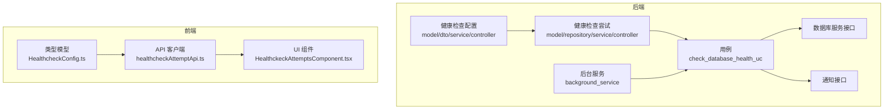
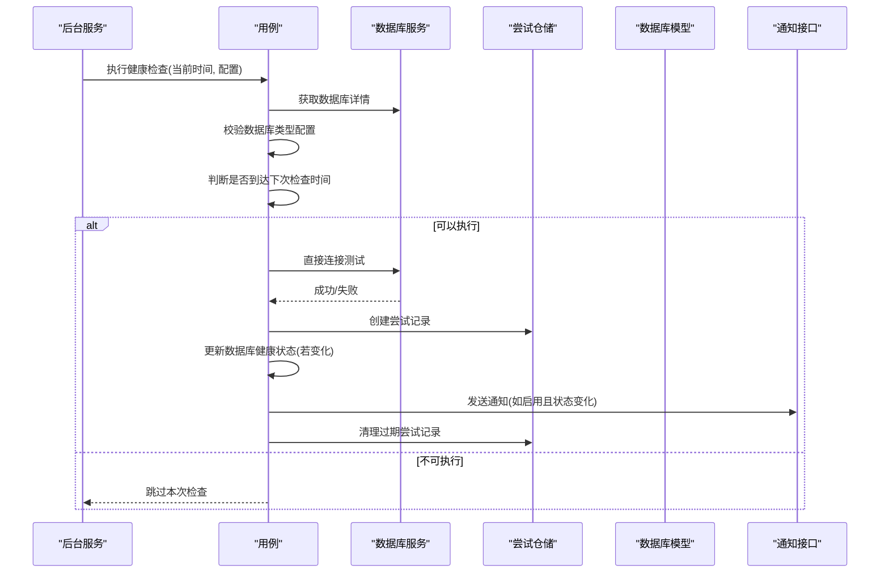
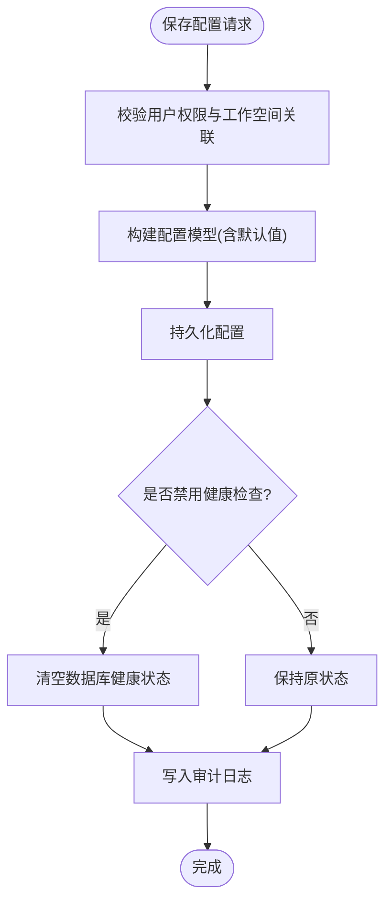
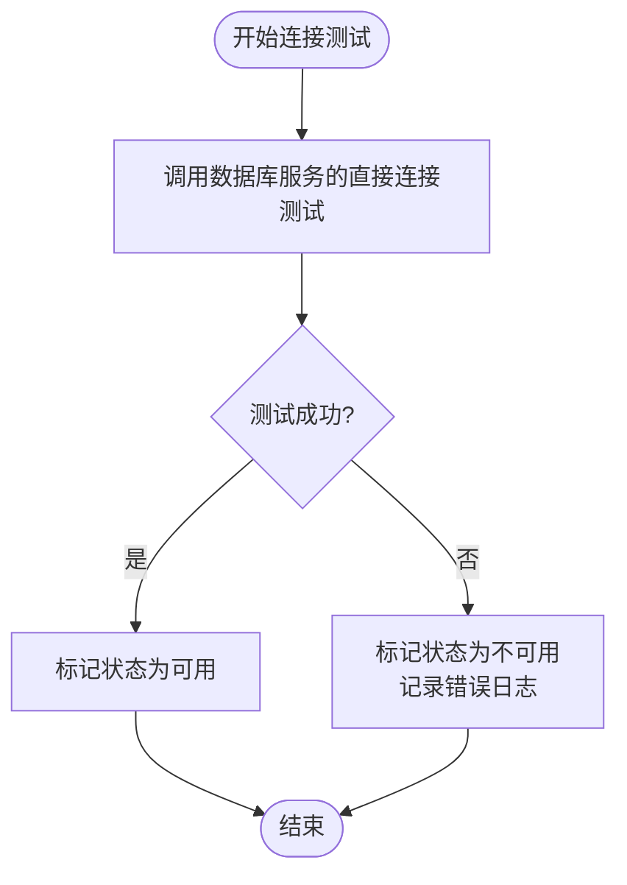
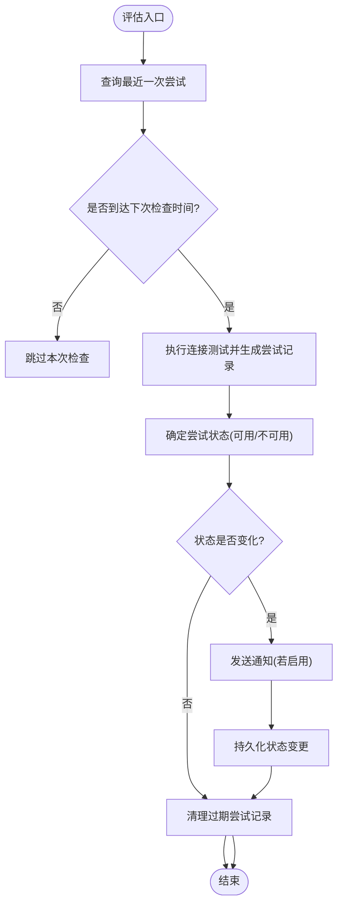
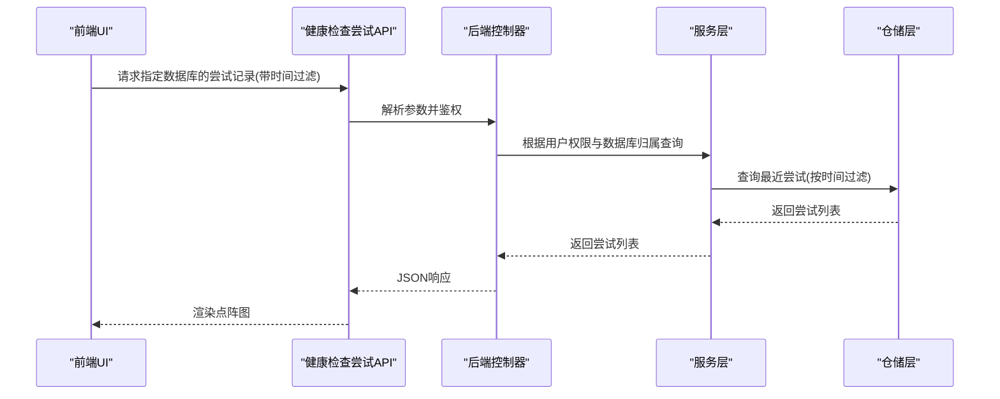
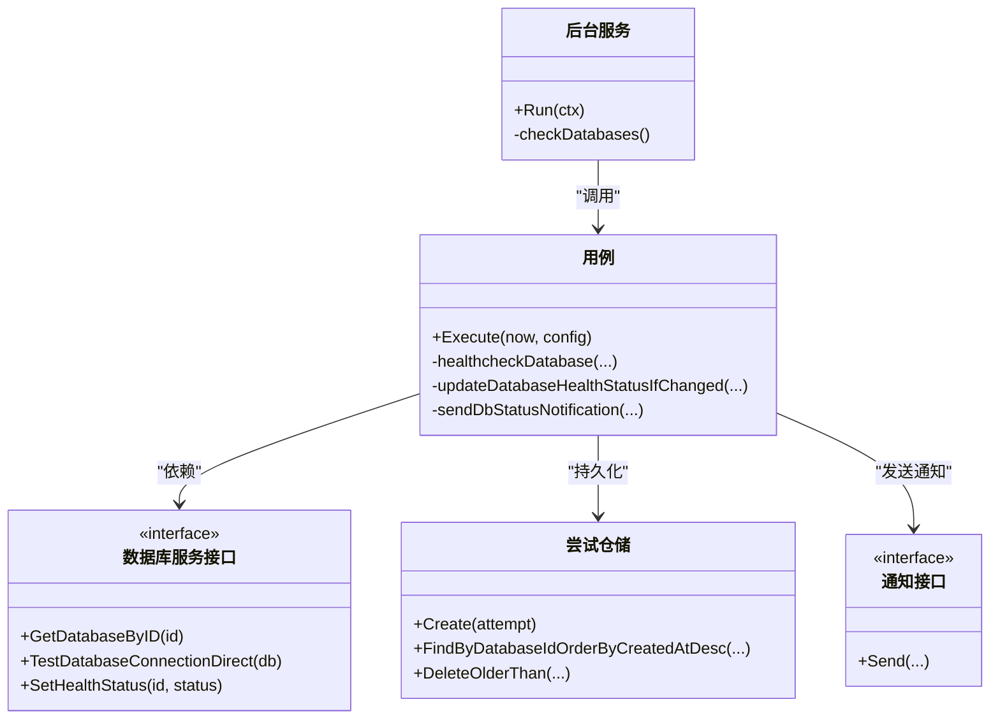

# 健康检查机制

<cite>
**本文引用的文件**
- [backend/internal/features/healthcheck/attempt/model.go](file://backend/internal/features/healthcheck/attempt/model.go)
- [backend/internal/features/healthcheck/attempt/repository.go](file://backend/internal/features/healthcheck/attempt/repository.go)
- [backend/internal/features/healthcheck/attempt/service.go](file://backend/internal/features/healthcheck/attempt/service.go)
- [backend/internal/features/healthcheck/attempt/controller.go](file://backend/internal/features/healthcheck/attempt/controller.go)
- [backend/internal/features/healthcheck/attempt/background_service.go](file://backend/internal/features/healthcheck/attempt/background_service.go)
- [backend/internal/features/healthcheck/attempt/check_database_health_uc.go](file://backend/internal/features/healthcheck/attempt/check_database_health_uc.go)
- [backend/internal/features/healthcheck/attempt/interfaces.go](file://backend/internal/features/healthcheck/attempt/interfaces.go)
- [backend/internal/features/healthcheck/config/model.go](file://backend/internal/features/healthcheck/config/model.go)
- [backend/internal/features/healthcheck/config/dto.go](file://backend/internal/features/healthcheck/config/dto.go)
- [backend/internal/features/healthcheck/config/service.go](file://backend/internal/features/healthcheck/config/service.go)
- [backend/internal/features/healthcheck/config/controller.go](file://backend/internal/features/healthcheck/config/controller.go)
- [backend/internal/features/databases/interfaces.go](file://backend/internal/features/databases/interfaces.go)
- [backend/internal/features/notifiers/interfaces.go](file://backend/internal/features/notifiers/interfaces.go)
- [backend/internal/features/system/healthcheck/dto.go](file://backend/internal/features/system/healthcheck/dto.go)
- [frontend/src/entity/healthcheck/model/HealthcheckConfig.ts](file://frontend/src/entity/healthcheck/model/HealthcheckConfig.ts)
- [frontend/src/entity/healthcheck/api/healthcheckAttemptApi.ts](file://frontend/src/entity/healthcheck/api/healthcheckAttemptApi.ts)
- [frontend/src/entity/healthcheck/index.ts](file://frontend/src/entity/healthcheck/index.ts)
- [frontend/src/entity/databases/model/HealthStatus.ts](file://frontend/src/entity/databases/model/HealthStatus.ts)
- [frontend/src/features/healthcheck/ui/HealthckeckAttemptsComponent.tsx](file://frontend/src/features/healthcheck/ui/HealthckeckAttemptsComponent.tsx)
</cite>

## 目录
1. [引言](#引言)
2. [项目结构](#项目结构)
3. [核心组件](#核心组件)
4. [架构总览](#架构总览)
5. [详细组件分析](#详细组件分析)
6. [依赖关系分析](#依赖关系分析)
7. [性能考量](#性能考量)
8. [故障排查指南](#故障排查指南)
9. [结论](#结论)
10. [附录](#附录)

## 引言
本技术文档系统性阐述 Databasus 数据库健康检查机制的设计与实现，覆盖检查策略、频率与阈值配置、连接测试实现（TCP/认证/查询）、健康状态评估算法（成功率、响应时间、错误分类）、配置管理（间隔、超时、重试）、可视化展示与告警、性能监控与历史趋势、以及自定义检查脚本扩展能力。目标是帮助开发者与运维人员快速理解并高效使用该机制。

## 项目结构
健康检查相关代码主要分布在后端的 healthcheck 子模块与前端的 healthcheck 功能模块中：
- 后端
  - 配置层：配置模型、DTO、服务、控制器
  - 尝试记录层：实体、仓储、服务、控制器、后台服务
  - 用例层：执行健康检查的用例
  - 接口层：数据库服务接口、通知发送接口
- 前端
  - 类型模型：健康检查配置、尝试记录
  - API 客户端：按数据库获取尝试记录
  - UI 组件：尝试记录可视化展示

图表来源
- [backend/internal/features/healthcheck/config/controller.go:16-19](file://backend/internal/features/healthcheck/config/controller.go#L16-L19)
- [backend/internal/features/healthcheck/attempt/controller.go:17-19](file://backend/internal/features/healthcheck/attempt/controller.go#L17-L19)
- [backend/internal/features/healthcheck/attempt/background_service.go:21-40](file://backend/internal/features/healthcheck/attempt/background_service.go#L21-L40)
- [backend/internal/features/healthcheck/attempt/check_database_health_uc.go:23-79](file://backend/internal/features/healthcheck/attempt/check_database_health_uc.go#L23-L79)
- [frontend/src/entity/healthcheck/api/healthcheckAttemptApi.ts:5-15](file://frontend/src/entity/healthcheck/api/healthcheckAttemptApi.ts#L5-L15)
- [frontend/src/features/healthcheck/ui/HealthckeckAttemptsComponent.tsx:135-180](file://frontend/src/features/healthcheck/ui/HealthckeckAttemptsComponent.tsx#L135-L180)

章节来源
- [backend/internal/features/healthcheck/config/controller.go:16-19](file://backend/internal/features/healthcheck/config/controller.go#L16-L19)
- [backend/internal/features/healthcheck/attempt/controller.go:17-19](file://backend/internal/features/healthcheck/attempt/controller.go#L17-L19)
- [frontend/src/entity/healthcheck/api/healthcheckAttemptApi.ts:5-15](file://frontend/src/entity/healthcheck/api/healthcheckAttemptApi.ts#L5-L15)

## 核心组件
- 健康检查配置
  - 模型字段：启用开关、不可用时是否发送通知、检查间隔（分钟）、判定为不可用前连续失败次数、保留尝试记录天数
  - 默认值：启用健康检查、判定失败阈值=3、间隔=1分钟、保留天数=7
- 健康检查尝试
  - 记录每次检查的状态（可用/不可用）与时间戳
  - 支持按数据库查询最近尝试、删除过期记录
- 用例与后台服务
  - 后台服务每分钟扫描一次启用健康检查的数据库
  - 用例负责连接测试、状态更新、通知发送与历史清理
- 前端
  - 提供健康检查配置模型与 API 客户端
  - UI 组件以点阵形式展示指定周期内的健康尝试状态

章节来源
- [backend/internal/features/healthcheck/config/model.go:10-19](file://backend/internal/features/healthcheck/config/model.go#L10-L19)
- [backend/internal/features/healthcheck/config/dto.go:7-15](file://backend/internal/features/healthcheck/config/dto.go#L7-L15)
- [backend/internal/features/healthcheck/config/service.go:133-155](file://backend/internal/features/healthcheck/config/service.go#L133-L155)
- [backend/internal/features/healthcheck/attempt/model.go:11-16](file://backend/internal/features/healthcheck/attempt/model.go#L11-L16)
- [backend/internal/features/healthcheck/attempt/repository.go:13-29](file://backend/internal/features/healthcheck/attempt/repository.go#L13-L29)
- [backend/internal/features/healthcheck/attempt/background_service.go:21-40](file://backend/internal/features/healthcheck/attempt/background_service.go#L21-L40)
- [backend/internal/features/healthcheck/attempt/check_database_health_uc.go:23-79](file://backend/internal/features/healthcheck/attempt/check_database_health_uc.go#L23-L79)
- [frontend/src/entity/healthcheck/model/HealthcheckConfig.ts:1-10](file://frontend/src/entity/healthcheck/model/HealthcheckConfig.ts#L1-L10)
- [frontend/src/entity/healthcheck/api/healthcheckAttemptApi.ts:5-15](file://frontend/src/entity/healthcheck/api/healthcheckAttemptApi.ts#L5-L15)
- [frontend/src/features/healthcheck/ui/HealthckeckAttemptsComponent.tsx:135-180](file://frontend/src/features/healthcheck/ui/HealthckeckAttemptsComponent.tsx#L135-L180)

## 架构总览
健康检查采用“配置驱动 + 后台轮询 + 用例执行 + 状态持久化 + 通知分发”的架构模式。后台服务以固定周期触发用例，用例对数据库进行直接连接测试，生成尝试记录并更新数据库健康状态；同时根据阈值策略决定是否发送告警通知，并清理过期尝试记录。

图表来源
- [backend/internal/features/healthcheck/attempt/background_service.go:42-59](file://backend/internal/features/healthcheck/attempt/background_service.go#L42-L59)
- [backend/internal/features/healthcheck/attempt/check_database_health_uc.go:23-79](file://backend/internal/features/healthcheck/attempt/check_database_health_uc.go#L23-L79)
- [backend/internal/features/healthcheck/attempt/repository.go:57-69](file://backend/internal/features/healthcheck/attempt/repository.go#L57-L69)
- [backend/internal/features/notifiers/interfaces.go:11-24](file://backend/internal/features/notifiers/interfaces.go#L11-L24)

## 详细组件分析

### 健康检查配置管理
- 配置项与默认值
  - 启用开关：默认启用
  - 不可用时发送通知：默认启用
  - 检查间隔：默认 1 分钟
  - 连续失败阈值：默认 3 次
  - 保留尝试记录天数：默认 7 天
- 权限控制
  - 修改/查看需具备工作空间数据库管理/访问权限
- 初始化策略
  - 新建数据库时自动初始化默认配置
  - 若数据库处于代理托管备份场景，则默认禁用健康检查

图表来源
- [backend/internal/features/healthcheck/config/service.go:33-84](file://backend/internal/features/healthcheck/config/service.go#L33-L84)
- [backend/internal/features/healthcheck/config/service.go:133-155](file://backend/internal/features/healthcheck/config/service.go#L133-L155)

章节来源
- [backend/internal/features/healthcheck/config/model.go:10-19](file://backend/internal/features/healthcheck/config/model.go#L10-L19)
- [backend/internal/features/healthcheck/config/dto.go:7-15](file://backend/internal/features/healthcheck/config/dto.go#L7-L15)
- [backend/internal/features/healthcheck/config/service.go:33-84](file://backend/internal/features/healthcheck/config/service.go#L33-L84)
- [backend/internal/features/healthcheck/config/controller.go:33-54](file://backend/internal/features/healthcheck/config/controller.go#L33-L54)
- [frontend/src/entity/healthcheck/model/HealthcheckConfig.ts:1-10](file://frontend/src/entity/healthcheck/model/HealthcheckConfig.ts#L1-L10)

### 连接测试实现
- 测试范围
  - TCP 连接可达性
  - 数据库认证有效性
  - 查询性能（通过直接连接测试体现）
- 执行流程
  - 用例在满足时间窗口后，调用数据库服务的直接连接测试方法
  - 失败时记录不可用状态并输出错误日志
  - 成功时记录可用状态

图表来源
- [backend/internal/features/healthcheck/attempt/check_database_health_uc.go:151-177](file://backend/internal/features/healthcheck/attempt/check_database_health_uc.go#L151-L177)
- [backend/internal/features/healthcheck/attempt/check_database_health_uc.go:155-166](file://backend/internal/features/healthcheck/attempt/check_database_health_uc.go#L155-L166)

章节来源
- [backend/internal/features/healthcheck/attempt/check_database_health_uc.go:151-177](file://backend/internal/features/healthcheck/attempt/check_database_health_uc.go#L151-L177)

### 健康状态评估算法
- 时间窗口控制
  - 仅当距离上次尝试已超过配置的间隔分钟数时才执行新尝试
- 失败阈值判定
  - 当前状态为可用：无需阈值，首次失败即视为不可用
  - 当前状态为不可用：需要最近 N 次尝试全部失败才更新为不可用（N 由阈值配置决定）
- 状态变更与通知
  - 状态变化时触发通知发送（标题与正文随状态变化而调整）
- 历史清理
  - 按配置的保留天数删除过期尝试记录

图表来源
- [backend/internal/features/healthcheck/attempt/check_database_health_uc.go:81-149](file://backend/internal/features/healthcheck/attempt/check_database_health_uc.go#L81-L149)
- [backend/internal/features/healthcheck/attempt/check_database_health_uc.go:206-226](file://backend/internal/features/healthcheck/attempt/check_database_health_uc.go#L206-L226)
- [backend/internal/features/healthcheck/attempt/check_database_health_uc.go:228-255](file://backend/internal/features/healthcheck/attempt/check_database_health_uc.go#L228-L255)

章节来源
- [backend/internal/features/healthcheck/attempt/check_database_health_uc.go:81-149](file://backend/internal/features/healthcheck/attempt/check_database_health_uc.go#L81-L149)
- [backend/internal/features/healthcheck/attempt/check_database_health_uc.go:206-226](file://backend/internal/features/healthcheck/attempt/check_database_health_uc.go#L206-L226)

### 健康检查结果可视化与告警
- 可视化
  - 前端 UI 使用点阵图展示指定周期（今日/7天/30天/所有时间）内的尝试状态
  - 点的颜色区分可用/不可用
- 告警
  - 状态从可用变为不可用或从不可用恢复为可用时发送通知
  - 通知来源为数据库绑定的通知器集合

图表来源
- [frontend/src/entity/healthcheck/api/healthcheckAttemptApi.ts:5-15](file://frontend/src/entity/healthcheck/api/healthcheckAttemptApi.ts#L5-L15)
- [backend/internal/features/healthcheck/attempt/controller.go:33-70](file://backend/internal/features/healthcheck/attempt/controller.go#L33-L70)
- [backend/internal/features/healthcheck/attempt/service.go:20-46](file://backend/internal/features/healthcheck/attempt/service.go#L20-L46)
- [backend/internal/features/healthcheck/attempt/repository.go:13-29](file://backend/internal/features/healthcheck/attempt/repository.go#L13-L29)
- [frontend/src/features/healthcheck/ui/HealthckeckAttemptsComponent.tsx:135-180](file://frontend/src/features/healthcheck/ui/HealthckeckAttemptsComponent.tsx#L135-L180)

章节来源
- [frontend/src/entity/healthcheck/api/healthcheckAttemptApi.ts:5-15](file://frontend/src/entity/healthcheck/api/healthcheckAttemptApi.ts#L5-L15)
- [backend/internal/features/healthcheck/attempt/controller.go:33-70](file://backend/internal/features/healthcheck/attempt/controller.go#L33-L70)
- [frontend/src/features/healthcheck/ui/HealthckeckAttemptsComponent.tsx:135-180](file://frontend/src/features/healthcheck/ui/HealthckeckAttemptsComponent.tsx#L135-L180)

### 性能监控、历史分析与趋势预测
- 指标采集
  - 尝试记录包含时间戳与状态，可用于统计成功率、平均响应时间（基于连接测试耗时）、错误分布
- 历史分析
  - 前端支持按天/周/月筛选尝试记录，便于观察趋势
- 趋势预测
  - 可基于近期失败率与时间序列数据进行简单阈值预警与趋势判断（建议在上层系统实现）

章节来源
- [backend/internal/features/healthcheck/attempt/model.go:11-16](file://backend/internal/features/healthcheck/attempt/model.go#L11-L16)
- [frontend/src/features/healthcheck/ui/HealthckeckAttemptsComponent.tsx:135-180](file://frontend/src/features/healthcheck/ui/HealthckeckAttemptsComponent.tsx#L135-L180)

### 自定义检查脚本支持与扩展
- 当前实现
  - 健康检查采用统一的直接连接测试流程，未内置自定义脚本执行引擎
- 扩展建议
  - 在数据库服务接口中增加“自定义检查脚本”能力，允许用户配置脚本路径与参数
  - 在用例中增加对脚本执行结果的解析与状态映射
  - 通过通知接口扩展更多通知渠道与模板

章节来源
- [backend/internal/features/databases/interfaces.go:15-23](file://backend/internal/features/databases/interfaces.go#L15-L23)
- [backend/internal/features/notifiers/interfaces.go:11-24](file://backend/internal/features/notifiers/interfaces.go#L11-L24)

## 依赖关系分析
- 组件耦合
  - 后台服务依赖配置服务与用例
  - 用例依赖数据库服务接口、尝试仓储与通知接口
  - 控制器依赖服务层，服务层依赖仓储与工作区/审计等服务
- 外部依赖
  - 数据库连接测试依赖具体数据库驱动
  - 通知发送依赖各通知器实现（Discord/Slack/Teams/Telegram/Webhook/邮件等）

图表来源
- [backend/internal/features/healthcheck/attempt/background_service.go:13-19](file://backend/internal/features/healthcheck/attempt/background_service.go#L13-L19)
- [backend/internal/features/healthcheck/attempt/check_database_health_uc.go:17-21](file://backend/internal/features/healthcheck/attempt/check_database_health_uc.go#L17-L21)
- [backend/internal/features/healthcheck/attempt/interfaces.go:18-27](file://backend/internal/features/healthcheck/attempt/interfaces.go#L18-L27)
- [backend/internal/features/healthcheck/attempt/repository.go:11-110](file://backend/internal/features/healthcheck/attempt/repository.go#L11-L110)
- [backend/internal/features/notifiers/interfaces.go:11-24](file://backend/internal/features/notifiers/interfaces.go#L11-L24)

章节来源
- [backend/internal/features/healthcheck/attempt/background_service.go:13-19](file://backend/internal/features/healthcheck/attempt/background_service.go#L13-L19)
- [backend/internal/features/healthcheck/attempt/check_database_health_uc.go:17-21](file://backend/internal/features/healthcheck/attempt/check_database_health_uc.go#L17-L21)
- [backend/internal/features/healthcheck/attempt/interfaces.go:18-27](file://backend/internal/features/healthcheck/attempt/interfaces.go#L18-L27)

## 性能考量
- 后台轮询频率
  - 默认每分钟扫描一次，可根据数据库数量与资源占用调优
- 并发策略
  - 对每个数据库独立 goroutine 执行检查，避免阻塞
- 数据清理
  - 按配置天数定期清理历史记录，控制表规模
- 连接测试成本
  - 直接连接测试开销较低，适合高频检查；如需更深入检测，可结合自定义脚本扩展

章节来源
- [backend/internal/features/healthcheck/attempt/background_service.go:29-39](file://backend/internal/features/healthcheck/attempt/background_service.go#L29-L39)
- [backend/internal/features/healthcheck/attempt/check_database_health_uc.go:50-79](file://backend/internal/features/healthcheck/attempt/check_database_health_uc.go#L50-L79)

## 故障排查指南
- 常见问题
  - 无法获取尝试记录：确认鉴权头与数据库 ID 是否有效，查询参数格式是否为 RFC3339
  - 健康检查未生效：检查配置中的启用开关、间隔与阈值是否合理
  - 通知未送达：确认数据库绑定的通知器配置正确且启用
- 日志定位
  - 用例在连接测试失败时会输出错误日志，便于快速定位问题
- 权限检查
  - 查看/修改配置需具备相应工作空间权限

章节来源
- [backend/internal/features/healthcheck/attempt/controller.go:33-70](file://backend/internal/features/healthcheck/attempt/controller.go#L33-L70)
- [backend/internal/features/healthcheck/attempt/check_database_health_uc.go:155-166](file://backend/internal/features/healthcheck/attempt/check_database_health_uc.go#L155-L166)
- [backend/internal/features/healthcheck/config/service.go:33-84](file://backend/internal/features/healthcheck/config/service.go#L33-L84)

## 结论
Databasus 的健康检查机制以配置为中心、用例为执行单元、后台服务为调度核心，实现了对多数据库类型的统一连接测试与状态管理。通过阈值策略与通知联动，能够在状态变化时及时告警；前端可视化与历史筛选提供了直观的趋势观察手段。未来可在通知渠道、自定义脚本与更丰富的监控指标方面进一步扩展。

## 附录
- 系统健康状态响应示例
  - 后端提供系统级健康检查响应结构，便于集成外部探针

章节来源
- [backend/internal/features/system/healthcheck/dto.go:3-5](file://backend/internal/features/system/healthcheck/dto.go#L3-L5)